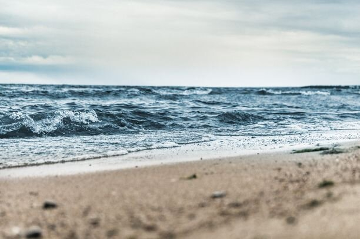
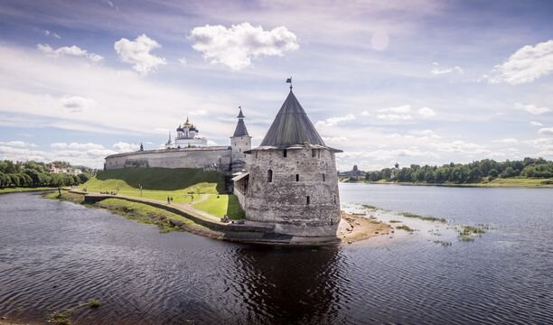
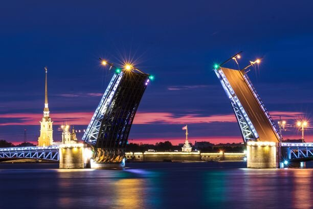
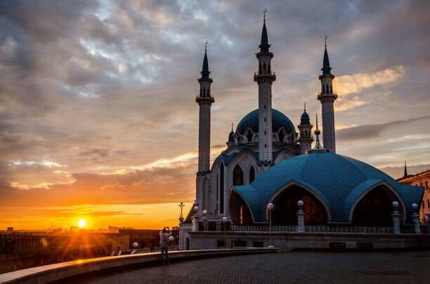
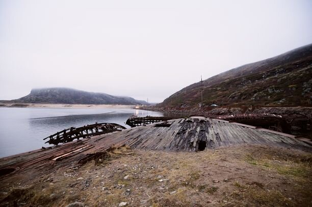
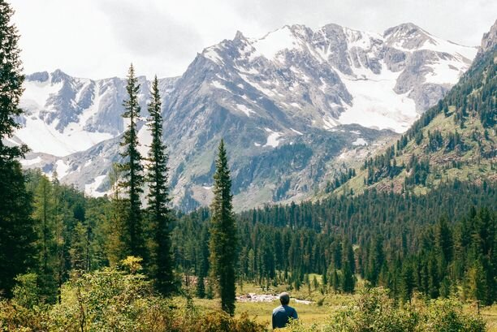
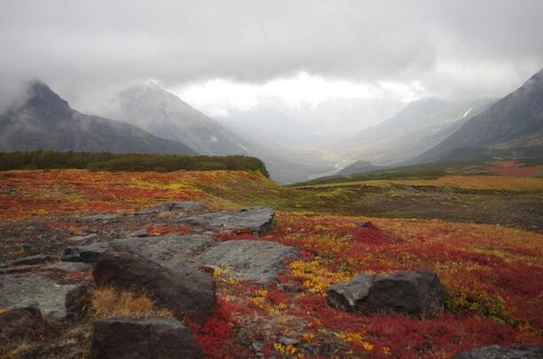

Отдых в России — это одна из самых доступных опций провести отпуск с удовольствием и недорого. Наша огромная страна может порадовать как любителей расслабленного пляжного отдыха, экскурсий по историческим объектам нашей необъятной Родины, так и тех, кто любит экстрим: сплавы на байдарках и походы. Словом, каждый сможет найти себе что-то по вкусу.

<!--more-->

Ниже я приведу 10 лучших мест, где можно отдохнуть в России.

## №10. Калининград

Калининград — отличное место, куда можно съездить на выходные или даже провести полноценный отпуск, если позволяет время. Немецкая архитектура, красивая набережная, вкусная еда в кафешках, приятный прохладный климат — звучит как отличное место для того, чтобы отдохнуть от рабочих будней. Пожалуй, мое любимое место в окрестностях Калининграда — это Куршская коса. Невероятной красоты природа, песчаные дюны, леса и море вряд ли кого-либо оставит равнодушным.

**Лучшее время для посещения:** с мая по октябрь

**Как добраться:** удобнее и быстрее всего [самолетом из Москвы/Петербурга/Мурманска](http://www.aviasales.ru/route/MOW/KGD/?marker=25257), можно доехать поездом или на машине, но для этого понадобится оформить шенгенскую мультивизу

## №9. Псков

Псков — скрытая жемчужина западной части России. До начала 18-го века Псков был одним из крупнейших городов России и Европы, важнейшим оборонительным и торговым центром страны, однако, утратил свое превосходство с появлением Санкт-Петербурга.

Мы приехали в Псков провести выходные, и мне было очень жаль, что у нас не было возможности остаться там дольше. Неприступный Кремль, прекрасные русские церкви, многочисленные музеи: для любителей истории и просто прогулок по красивым местам это лучший выбор, где отдохнуть в России.

**Лучшее время для посещения:** с мая по сентябрь

**Как добраться:** поездом, автобусом или на машине из Москвы и Петербурга, также есть [регулярные авиарейсы](http://www.aviasales.ru/route/MOW/PKV/?marker=25257)

## №8. Санкт-Петербург

Город, который вряд ли нуждается в представлении. Один из самых красивых городов мира по мнению многих, Санкт-Петербург — настоящая визитная карточка России. Ежегодно сюда приезжают миллионы туристов, и тысячи из них остаются там навсегда, влюбляясь в архитектуру и атмосферу города. Добавьте к этому спокойный темп жизни, вкусную и доступную еду: сложно сказать, чего больше в Санкт-Петербурге: хостелов или кафешек.

Пожалуй, если бы не климат, я бы сама с радостью переехала в Петербург. Чтобы сделать свою поездку наиболее приятной, избегайте пика сезона и жары: июль-август. Если вы собираетесь на отдых всей семьей, то вам может пригодится наша статья: [Куда сходить с ребенком в Санкт-Петербурге](https://vodpop.ru/10-mest-kuda-shodit-s-rebenkom-v-sankt-peterburge/)

**Лучшее время для посещения:** май-июнь, сентябрь-октябрь

**Как добраться:** удобнее всего ночным поездом из Москвы, заодно сэкономите на ночевке. Почти из любого города России есть [прямые рейсы](http://www.aviasales.ru/route/MOW/LED/?marker=25257) до аэропорта Пулково.

## №7. Казань

Столица Республики Татарстан — колоритный город, наполненный историей, но при этом идущий в ногу со временем. Обязательны к посещению мечеть Кул Шариф, набережная и улица Баумана — самая красивая и яркая улица города. Множество музеев, кафешек, вкусный чак-чак, красивая природа в окрестностях — что еще нужно для хорошего отпуска? По следам наших с мужем путешествий я написала отдельную про то, куда стоит сходить в Казани.

**Лучшее время для посещения:** апрель-сентябрь

**Как добраться:** быстрее и удобнее всего [самолетом из Москвы или Санкт-Петербурга](http://www.aviasales.ru/route/MOW/KZN/?marker=25257). Можно на поезде (но он идет неоправданно долго), автобусе или машине из Москвы

## №6. Золотое Кольцо

Еще одна визитная карточка России. Здесь я в студенческие годы начала знакомство с историей и культурой нашей Родины. В классический маршрут входят: Сергиев Посад, Переславль-Залесский, Ростов Великий, Ярославль, Кострома, Иваново, Суздаль, Владимир. Мне кажется, каждый человек, вне зависимости от своего отношения к религии, должен побывать в самых знаменитых церквях на этом маршруте.

Мой любимый город на Золотом Кольце, куда мы приезжали бесчисленное количество раз — это Суздаль. Уютный, красивый, домашний и очень русский. Кажется, нигде больше в России я с такой силой не ощущала принадлежность к своей стране.

**Лучшее время для посещения:** круглый год

**Как добраться:** удобнее всего путешествовать на машине, либо организованным туром. Между городами есть автобусное сообщение, но придется подстраиваться под расписание

## №5. Сочи

“Дело к ночи — едем в Сочи”, под таким девизом прошла не одна поездка в этот город. Для меня Сочи — это прежде всего горы и горнолыжные спуски, а уже потом — пляжный отдых. И это значит, что каждый член семьи, вне зависимости от интересов, сможет найти здесь что-то для себя.

Наше с мужем любимое времяпрепровождение — это прогулки по горам и поедание вкусного шашлыка в местных кафешках. Надеюсь, наша статья “Куда сходить в Сочи” поможет вам определиться, стоит ли провести здесь свой отпуск.

**Лучшее время для посещения:** круглый год

**Как добраться:** оптимальнее всего [самолетом из Москвы/Санкт-Петербурга](http://www.aviasales.ru/route/MOW/AER/?marker=25257), но можно на поезде или машине. Если едете на поезде во время летних каникул, позаботьтесь заранее о покупке обратного билета: их часто не хватает на всех желающих

## №4. Кольский полуостров

Мы — большие поклонники северной природы, и Кольский стал для нас настоящим открытием, начиная с Кировска, где нам посчастливилось покататься в Хибинах, заканчивая Териберкой, где находится, пожалуй, самое знаменитое кладбище кораблей в России. Невероятные просторы, леса, хорошие дороги (это был сюрприз!), многочисленные реки, безумная по красоте природа в любое время года, чистейший воздух — словом, незабываемые впечатления.

Хоть и с нашего последнего визита туда прошло 6 лет, я до сих пор помню ощущение восторга. Подойдет только тем, кто дружит с холодом: даже в самый разгар лета температура редко поднимается выше 18 градусов.

**Лучшее время для посещения:** круглый год

**Как добраться:** зависит от конкретного места на полуострове, но лучше всего ехать на своей машине, либо арендовать [по прилету в Мурманске/Кировске](http://www.aviasales.ru/route/MOW/MMK/?marker=25257)

А вот и тройка фаворитов в списке, где отдохнуть в России:

## №3. Озеро Байкал

Самое глубокое (а не большое, как многие ошибочно пишут) озеро на планете, кроме прочего является одним из самых солнечных мест России: в год всего 37 дней без солнца. Так что если вы ищите, где получить порцию витамина D, можете смело ехать на Байкал, а не на побережье Черного моря.

Вдоль озера есть несколько курортных зон: Листвянка, Ольхон, Бухта Песчаная, и вы можете выбрать тот, который отвечает вашим интересам. На Байкале можно плавать, загорать, рыбачить, кататься на лодке, заниматься дайвингом, виндсерфингом, кататься на байдарках, ходить в пешие туры, кататься на коньках (зимой) и многое, многое другое.

**Лучшее время для посещения:** круглый год

**Как добраться:** [самолетом из Москвы до Иркустка/Улан-Удэ](http://www.aviasales.ru/route/MOW/IKT/?marker=25257), для романтиков — поездом (4 дня), или на машине

## №2. Алтай

Тем, кто хочет провести отпуск в Республике Алтай, надо приготовиться, что отдыхать в традиционном смысле будет некогда. Сюда приезжают любители активного отдыха и экстремального туризма. Если вы всегда мечтали научиться ездить на лошади, сплавляться на байдарке и или кататься на горных лыжах, вам точно здесь понравится.

Впрочем, если вы себя к экстремалам не относитесь, но на Алтай хочется, то можно поехать в Белокуриху, где расположены лечебные санатории, и наслаждаться красивыми видами, чистым воздухом и полезными для здоровья процедурами.

**Лучшее время для посещения:** круглый год

**Как добраться:** [из Москвы прямым рейсом](http://www.aviasales.ru/route/MOW/RGK/?marker=25257) до Горно-Алтайска/Барнаула/Новосибирска

Лучшее место, где отдохнуть в России:

## №1. Камчатка

Многие из нас слышали о туризме на Камчатке, но это всегда представлялось чем-то нереальным. Камчатка — земля вулканов, гейзеров и ледников — сочетает в себе самые красивые и необычные природные явления. Сюда приезжают любители пешеходного туризма, сплавов по рекам, охотники, рыболовы и дайверы. Или, как и в случае с Алтаем, вы можете погрузиться в спокойную атмосферу на одном из минеральных источников, снимая стресс после тяжелых трудовых будней.

**Лучшее время для посещения:** июль-начало сентября, февраль-апрель. Старайтесь избегать межсезонья: октябрь-декабрь, май-июнь, так как погода в эти месяцы пасмурная и есть риск ничего не увидеть.

**Как добраться:** из крупных городов Москва/Санкт-Петербург/Новосибирск и т.п. есть [прямые рейсы до Петропавловска-Камчатского](http://www.aviasales.ru/route/MOW/PKC/?marker=25257)
