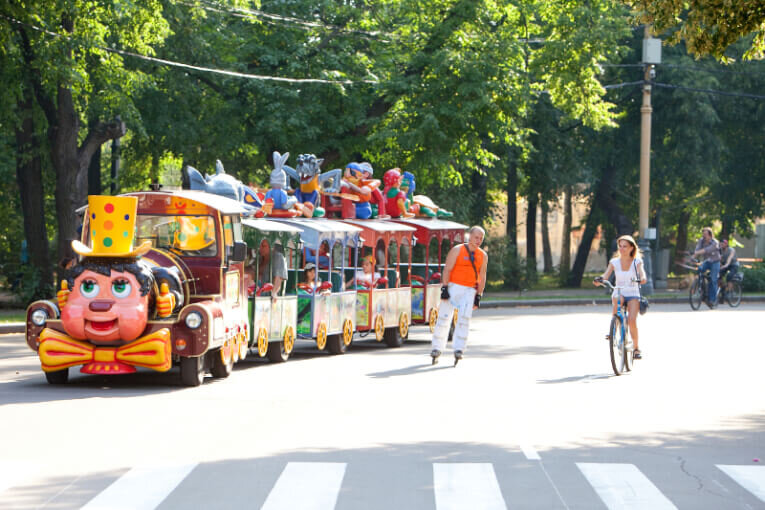
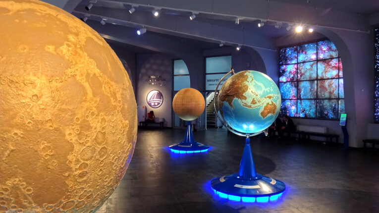
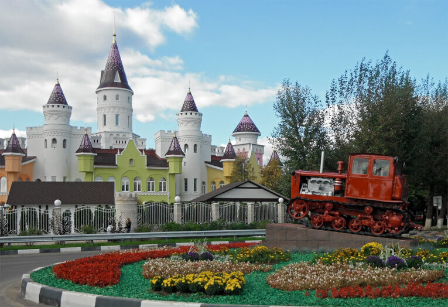
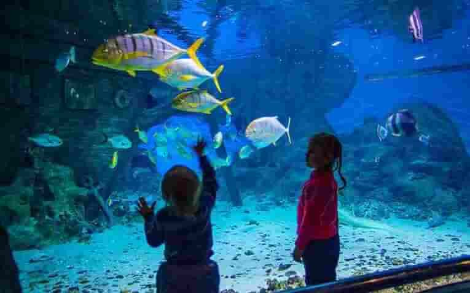
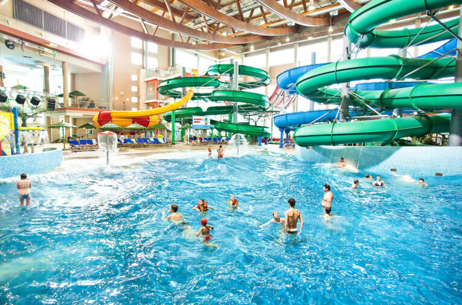
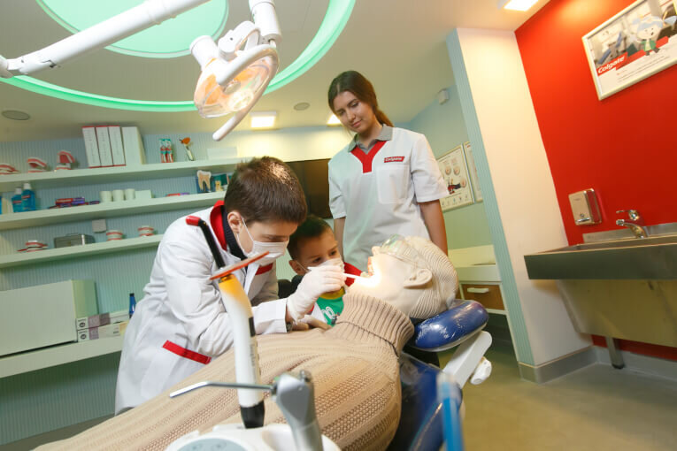
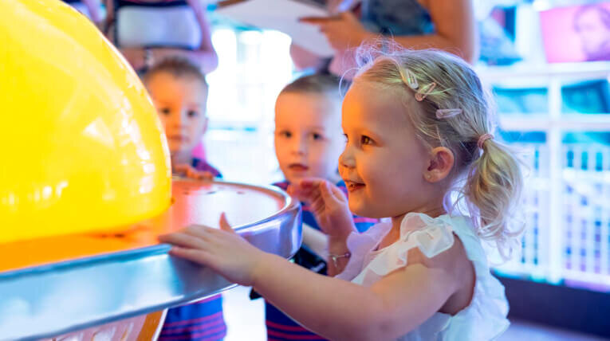

В Москве есть множество развлечений на любой вкус и кошелек, и в этой статье я подготовила список 10 лучших мест, куда сходить с ребенком в Москве.

<!--more-->

За последние годы появились сотни мест, куда можно сходить с ребенком в Москве. Однако среди этого разнообразия очень сложно выбрать самое лучшее и решиться, где же лучше провести время всей семьей.

Для тех кто ограничен в бюджете отличным выбором станут многочисленные парки Москвы, где можно отлично провести целый день с ребенком без особых затрат. Столица нашей Родины полна контрастов, и здесь есть и такие развлечения, за которые придется выложить половину месячной зарплаты. В мой личный рейтинг мест куда сходить с ребенком в Москве они не попали.

Итак, куда же можно сходить с ребенком в столице и насладиться временем, проведеным с семьей?

Приведу 10 лучших мест, куда сходить с ребенком в Москве.

## №10. Московский театр детской книги Волшебная Лампа

[http://puppets-lamp.ru/](http://puppets-lamp.ru/)

Небольшой и уютный кукольный театр с душевной атмосферой в центре Москвы предлагает спектакли для самых маленьких детишек, всего от 3-х лет. Театр расположен в центре и обладает гибкой системой бронирования: если вдруг ребенок заболел, можно отменить бронь прямо в день спектакля. Рекомендую сходить с ребенком в Москве на спектакль "Котенок по имени Гав".

**Цена:** 900‒1200 рублей

## №9. Парк сокольники

[http://park.sokolniki.com/](http://park.sokolniki.com/)

Один из крупнейших парков Москвы Сокольники — отличное место, чтобы сходить с ребенком любого возраста. Тут есть парк аттракционов, множество дорожек для катания на велосипедах, роликах и лыжах в зимнее время года. Также зимой работает каток. В отличие от другого популярного московского Парка Горького, в Сокольниках абсолютно везде можно проехать на коляске и тут не так людно. Здесь можно посмотреть на уток и лебедей на Золотом пруду, увидеть белочек (только не кормите их, пожалуйста), поиграть на одной из многих детских площадок, покататься на паровозике (как на фото). А если вы ищите, куда сходить с ребенком с ограниченными возможностями в Москве, то Сокольники станут отличным вариантом: здесь дружелюбная к коляскам среда, и на территории есть площадка Изумрудный Город, учитывающая потребности детишек с особенностями.

**Цена:** бесплатно

## №8. Московский Планетарий

[http://www.planetarium-moscow.ru/](http://www.planetarium-moscow.ru/)

Старейший планетарий России и один из крупнейших в мире, Московский Планетарий может порадовать любителей астрономии любого возраста, хотя я рекомендую приходить сюда с детьми от 6 лет, потому как детишкам меньшего возраста может быть скучно и непонятно. Сразу скажу, что на Планетарий надо закладывать весь день или разбивать посещение на два дня: активностей и информации очень много. Обязательно стоит посетить Большой Звездный зал и музей Урании, а также Интерактивный музей «Лунариум» (детям до 6 лет бесплатно). Не рекомендую идти в Театр Увлекательной Науки - скучно и точно не стоит дополнительных 600 рублей. Билеты можно купить заранее, но на сайте не действуют скидки.

**Цена:** от 550 рублей, много льгот

## №7.Московский цирк на Цветном бульваре.

[http://www.circusnikulin.ru/](http://www.circusnikulin.ru/)

Цирк Никулина — один из старейших и известных цирков России, куда можно сходить с ребенком любого возраста. Если вы живете в Москве или оказались тут проездом, это обязательное место к посещению. Необыкновенная атмосфера детства, интересная программа, которая смотрится на одном дыхании детьми от 2-х до 100 лет, возможность сфотографироваться с цирковыми животными (увы, дорого). Я очень рекомендую сходить на программу "Магия цирка", причем вне зависимости от наличия у вас детей: взрослые выходят с представления чуть ли не счастливее младшего поколения.

**Цена:** от 500 рублей

## №6. Парк Совхоза имени Ленина “Лукоморье”

Одно из лучших бесплатных мест, куда сходить с ребенком в Москве. Хотя, с технической точки зрения, парк расположен в Московской области, он находится всего в двух автобусных остановках от станции метро "Домодедовская". Парк рассчитан на самую разную возрастную категорию, и приходить сюда лучше на целый день, к открытию в 9 утра. В полдень вы уже можете попасть в длинную очередь, и ожидание займет от получаса до полутора: количество людей на территории ограничено во избежание давки. В парке царит атмосфера сказки и веселья: можно посмотреть мини-спектакль, попрыгать на батуте, полазать в веревочном городке, увидеть любимых сказочных персонажей, "искупаться" в бассейне с шариками и сделать аквагрим (за доп.плату).

**Цена:** бесплатно

## №5. Крытый каток

[http://www.hc-grad.ru/](http://www.hc-grad.ru/index.php/explore/svobodnoe-katanie)

Одно из самых моих любимых развлечений — катание на коньках. И хоть я очень люблю открытые катки, их крытые собратья значительно превосходят первых по качеству льда: по этой причине кататься с детьми на них намного приятнее, да и народу значительно меньше. Крытых катков в Москве великое множество, и я советую выбрать тот, который ближе к вашему дому, чтобы не нести далеко тяжелые коньки и теплую одежду. Мне по расположению подходит каток "Град" в ТЦ "Город-Лефортово": сеанс катания длится один час, расписание публикуют на сайте. Есть услуга проката и заточки коньков.

**Цена:** до 12 лет — 250 рублей, взрослый билет — 350 рублей

## №4. Океанариум на Дмитровском шоссе

[http://www.oceanarium-rio.ru/](http://www.oceanarium-rio.ru/)

Крупнейший океанариум России расположен в торговом центре "Рио" на Дмитровском шоссе. По сравнению с океанариумом  [в Бангкоке](https://vodpop.ru/okeanarium-bangkok/), московский намного скромнее в размерах и разнообразии, но, тем не менее, тут есть на что посмотреть: кровожадные пираньи, акулы, рыбка "Дори", пингвины, медузы и скаты, а также множество других обитателей морских глубин. Можно приходить с самыми маленькими.

**Цена:** по будням: дети до 5 лет — бесплатно, от 5 до 14 — 250 рублей, взрослый — 500 рублей. На выходных на 50 рублей дороже

## №3. Аквапарк Ква-Ква Парк

[https://kva-kva.ru/](https://kva-kva.ru/)

Отличное место, куда можно сходить всей семьей с детьми в Москве. На фотографиях он огромный, в жизни — чуть поменьше. Но, невзирая на размеры, здесь можно найти множество интересных горок, фонтанов, аттракционов. Внимательно изучите возрастные ограничения: на интересных горках стоит ограничение по возрасту от 10 лет, а для детей 3–8 лет есть детский городок. Я рекомендую поехать в аквапарк в теплое время года, так как при глубоких минусовых температурах наблюдается сквозняк: легко простудиться.

**Цена:** дети до 4-х лет — бесплатно, от 120 до 150 см — от 540 рублей, взрослые — от 940 рублей

## №2. Кидзания

[https://kidzania.ru](https://kidzania.ru)

Одно из тех мест, на которое я смотрю и ужасно завидую современным детям: в детстве я бы проглотила шляпу, чтобы тут побывать. Кидзания открылась в Москве совсем недавно, но уже обрела тысячи поклонников, в том числе в моем лице. Это парк игрового обучения, построенный в виде города, где детишки могут попробовать себя в сотне разных профессий: повара, стоматолога, полицейского, пожарного. У ребенка будет свой паспорт и даже зарплата, которую он может потратить на развлечения или в магазине. Если ваш ребенок старше 7 лет и вполне самостоятелен, то вы можете сэкономить на стоимости билета для себя и подождать его вне парка. Продолжительность пребывания в Кидзании —  4 часа, но в летние каникулы ограничение не действует, и тут можно провести целый день.

**Цена:**  дети — от 390 рублей, взрослые — от 500 рублей

А вот и мой личный фаворит в списке мест, **куда сходить с ребенком в Москве**:

## №1. Музей Экспериментариум

[http://www.experimentanium.ru/](http://www.experimentanium.ru/)

Если бы ищете, куда сходить с ребенком в Москве, я настоятельно рекомендую музей Экспериментариум. Я была в музее уже несколько раз, и всегда выходила только с положительными эмоциями. Тут интересно как взрослым, так и детям: все можно потрогать своими руками, провести эксперименты, узнать много нового о физике, химии, космосе, разгадать головоломки, попрыгать и побегать. Помимо интереснейшей постоянной экспозиции в музее каждый день проводятся занятия, лекции и шоу: расписание есть на сайте. По-моему, это лучшее соотношение "цена-качество" среди всех мест, куда можно сходить с ребенком в Москве.

**Цена:** дети до 3х лет — бесплатно, от 4-х до 16 — от 450 рублей, взрослые — от 550 рублей

Но, на самом деле, невзирая на этот список лучших мест, куда сходить с ребенком в Москве, неважно, куда именно вы пойдете; главное — не забудьте взять с собой хорошее настроение, и тогда даже обычная прогулка в парке принесет вам и вашему ребенку радость! :)

## Куда еще сходить в Москве?

Ну а если вы думаете, куда сходить в Москве без ребенка, рекомендую посмотреть [статью о моих любимых местах в столице](https://vodpop.ru/10-mest-kuda-shodit-v-moskve/).

## 2100 рублей в подарок на Airbnb!

Ищете, где остановиться в Москве? Наш любимый с мужем вариант в поездках — это аренда комнаты или апартаментов на Airbnb. Вот [ссылка на скидку 2100 рублей](http://www.airbnb.ru/c/alexandrab4058) при первом бронировании.

## Уже побывали с ребенком во всех интересных местах в Москве?

Не беда! Садитесь на Сапсан или ночной поезд и приезжайте с детьми на выходные в Питер! Об этом читайте мою следующую статью цикла: [10 мест куда сходить с ребенком в Санкт-Петербурге](https://vodpop.ru/10-mest-kuda-shodit-s-rebenkom-v-sankt-peterburge/)
