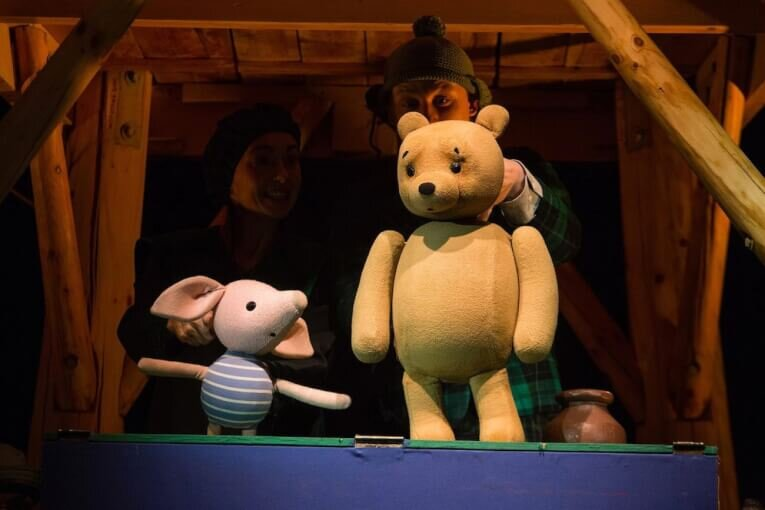
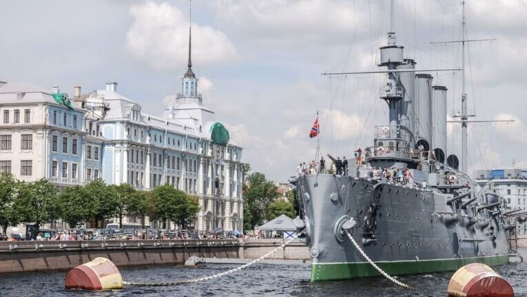
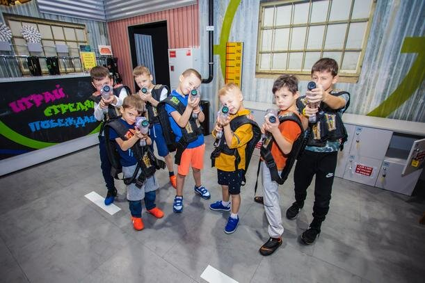

Санкт-Петербург — город, известный своими культурными развлечениями: музеями, площадями, дворцами, изобилием памятников и парков. Кроме того, здесь есть множество мест, куда будет интересно сходить как взрослым, так и детям. Я подготовила список 10 лучших мест, куда сходить с ребенком в Петербурге.

<!--more-->

Практически каждый день в Петербурге происходят интересные события, куда можно сходить всей семьей: с маленькими детьми, школьниками или подростками. Что мне нравится больше всего в Питере, так это то, что развлечения можно найти на любой вкус и цвет, а также бюджет: за прогулку по одному из многочисленных красивых парков с вас не возьмут денег, а если соберетесь в музей, то скорее всего, ваш малыш пройдет бесплатно.

Итак, 10 мест **куда сходить в Санкт-Петербурге с ребенком**:

## №10. Большой Театр Кукол

[http://puppets.ru/](http://puppets.ru/)

Один из самых известных кукольных театров, в который стоит сходить с ребенком в Санкт-Петербурге, БТК вот уже более 80 лет принимает самых маленьких зрителей. Расположен в центре, но на некотором удалении от метро: в хорошую погоду можно совместить с прогулкой по городу. В фойе выставлена коллекция кукол, а еще деткам будет интересно посмотреть на “витражные” окна (это не настоящий витраж, но не обязательно же расстраивать ребенка, верно?).

Зрительный зал оборудован специальными креслами. Вне зависимости от роста вашего ребенка, ему будет хорошо видно. Кроме того, создана доступная среда для людей с ограниченными возможностями. Искренне рекомендую сходить на спектакль “Маленький принц”, а если есть время, можно заглянуть на экскурсию за кулисы: ее проводят актеры театра. Одно из любимых мест для походов в театр с ребенком в Петербурге.

**Цена:** 350—500 рублей, можно купить онлайн

## №9. Парк Политехнического университета

В Санкт-Петербурге и его окрестностях сосредоточено огромное количество парков. Летний сад и Петергоф, пожалуй, самые известные, “парадные” парки: о них знают все, а потому в хорошую погоду там бывает не протолкнуться. Но есть и другие парки, “для своих”.

Парк Политехнического университета, например, станет ответом на вопрос, куда можно бесплатно сходить с ребенком в Санкт-Петербурге.

Чистый, аккуратный, частично асфальтированные дорожки, так что даже в слякоть можно проехать с коляской. Один из лучших парков, где можно погулять с детьми в Санкт-Петербурге. Тихо, спокойно, есть детские площадки. Множество тропинок для прогулок пешком и на велосипеде. Зимой по парку проложена лыжня. Вход в парк расположен в нескольких шагах от метро “Политехническая”.

**Цена:** бесплатно

## №8. Зоологический музей Санкт-Петербурга

Один из лучших музеев для посещения с детьми в Петербурге, особенно с маленькими: можно посмотреть на скелет кита, чучела животных, мамонтов в полный рост, жирафов, пингвинов и слонов, змей и множество других интересных экспонатов.

Отличный вариант, если вы ищите, куда сходить с ребенком в непогоду. Избалованным взрослым тут будет тяжеловато: музей давно нуждается в хорошем ремонте, но это совершенно не умаляет научной ценности представленных экспонатов. Зато у вас будет уникальная возможность увидеть практически всех животных в их полный рост.

Дети от полутора до восемнадцати лет выходят из музея в восторге: здесь проводят экскурсии и квесты. Если захотите сделать фотографию кита, поднимитесь по лестнице заранее (ее закрывают за час до закрытия музея).

**Цена:** 150—250 рублей, каждый третий четверг месяца вход бесплатный

## №7. Гранд Макет Россия

[https://grandmaket.ru/](https://grandmaket.ru/)

Ищите, куда сходить с ребенком в Санкт-Петербурге, но хочется, чтобы еще и взрослым было интересно? Гранд Макет как раз подходит для семейного посещения: красивый, современный, чистый музей для всех членов семьи.

Вы можете увидеть всю Россию целиком, от Калининграда до Дальнего Востока. Все продумано до мельчайших деталей. Можно найти достопримечательности, знаменитые здания и сооружения, а можно остановиться на пару минут и взглянуть поближе на жизнь этих маленьких человечков.

В интерактивных зонах, после нажатия кнопки можно понаблюдать за интересными событиями: задержание преступника, выступление уличного музыканта и даже за имитацией пожара. Во время просмотра экспозиции в зале меняется освещение: ночь сменяет день, и обратно. Что дети, что взрослые — в полном восторге от посещения этого места!

Одно “но”: с детскими колясками сюда не пускают, для них предусмотрена парковка, но совсем малышей придется держать на руках все время. Несмотря на этот маленький недостаток, это одно из лучших мест, куда можно сходить с ребенком в Санкт-Петербурге.

**Цена:** дети до 3-х лет — бесплатно, от 3 до 13 — 280 рублей, взрослый — 480 рублей. Скидки (многодетные семьи, пенсионеры) только по понедельникам

## №6. Крейсер Аврора

Визитная карточка северной столицы, крейсер Аврора — одно из тех мест, куда сходить с ребенком в Петербурге просто необходимо!

После реставрации крейсер пополнился интерактивными панелями, которые можно потрогать-потыкать, посмотреть внутреннюю конструкцию корабля и подняться на палубу. А если идете с ребенком в первый раз, будет не лишним взять экскурсию: можно будет узнать много интересных фактов об истории нашей страны. Обратите внимание: крейсер закрыт для посещений по понедельникам и вторникам.

**Цена:** дети — 200 рублей, взрослые — 400 рублей

## №5. Музей советских игровых автоматов

[http://www.15kop.ru/](http://www.15kop.ru/)

И хоть тема этой статьи — куда сходить с ребенком в Санкт-Петербурге, данный музей — это музей для взрослых, которые хотят вернуться в свое детство. Советские автоматы, настольный теннис, шахматы, кинотеатр с советскими мультфильмами, можно попить газировку из того самого автомата. Попробуйте с грушевым сиропом!

При оплате билета выдают 15 минуток, которыми можно расплачиваться за игры. Если вдруг устанете или проголодаетесь, тут работает кафе: можно посидеть и попить молочные коктейли. Обязательно сыграйте в морской бой и баскетбол!

**Цена:** 350—450 рублей

## №4. Экскурсия на Кондитерскую Фабрику им. Самойловой (“Красный Октябрь”)

[https://vk.com/club156701809](https://vk.com/club156701809)

Я не знаю ни одного ребенка, который не любит шоколад. Да и взрослых, если честно, тоже. А потому, путешествие на легендарный “Красный Октябрь” — отличный вариант, куда сходить вместе с ребенком в Санкт-Петербурге.

Вы сможете узнать о процессе производства шоколада, посмотреть как делаются конфеты, вафли, печенье, зефир и мармелад. В процессе экскурсии можно есть все увиденное — сколько хотите, столько и ешьте! В конце познавательной экскурсии вам подарят большой сладкий подарок. По отзывам детей, это лучше Эрмитажа. Ну кто бы сомневался!

**Цена:** 1250 рублей с человека

## №3. Парк "Волшебная Миля"

[http://magicmile.ru/](http://magicmile.ru/)

Про этот парк развлечений хочется говорить только хорошие вещи. И не мне одной: можете сами почитать отзывы и понять, что эти ребята по-настоящему любят работать с детьми. На огромной территории расположены игровые зоны для детей от 1,5 до 14 лет, батуты, бассейны с шариками, горки, лабиринты, проводятся мастер-классы, квесты и спектакли, аниматоры в каждой зоне.

Входной билет действует на весь день. Именно столько я бы рассчитывала здесь провести — и даже так у вас обязательно останется что-то на следующий раз. А еще тут можно отметить день рождения или провести выпускной: аниматоры устраивают настоящий праздник для детишек и взрослых. При посещении обязательно возьмите с собой сменную обувь для взрослых и для детей, иначе придется ходить в носках. Одно из чудеснейших мест, куда стоит сходить с ребенком в Санкт-Петербурге.

**Цена:** детский билет в будни — 600 рублей, в выходной — 900 рублей, взрослый — 300 рублей в любой день

## №2.GorillaPark

[http://gorillapark.ru/](http://gorillapark.ru/)

Еще один вариант, куда сходить с ребенком в Санкт-Петербурге в плохую погоду. В парке будет интересно как взрослым, так и детям. Попрыгать на батуте, полазить по веревочному парку, полетать на тарзанке - звучит, как что-то давно забытое из детства, да? Если вы и ваши дети не боитесь высоты, рекомендую полетать над территорией парка: на высоте 10 метров можно пролететь почти сотню метров. И не бойтесь: на всех аттракционых в парке постоянно дежурят инструкторы, которые объяснят технику безопасности, помогут и подскажут.

Не забудьте взять с собой сменную одежду и обувь: почти уверена, что после того, как вы напрыгаетесь всей семьей, вам точно захочется переодеться. Приятный бонус - раздевалки, как и прочие зоны парка, очень чистые.

**Цена:** понедельник-четверг —  650 рублей, пятница-воскресенье —  950 рублей

А вот и фаворит списка мест, **куда сходить с ребенком в Санкт-Петербурге**:

## №1. Кидбург

[https://kidburg.ru/](https://kidburg.ru/)

По-моему, города для детей — это одна из лучших идей, которая пришла взрослым. Тут есть все: госпиталь, банк, страховая компания, магазины, типография, пожарная станция и многое другое. Словом, все, что нас окружает в реальной жизни.

Дети могут попробовать себя работниками разных профессий, заработать деньги и потратить их на получение новых навыков, знаний, на отдых или игрушки. Особенно интересно и познавательно будет для детей 6-12 лет. А еще это отличная опция для родителей: если вашему ребенку больше 7 лет, он может самостоятельно изучать профессии, а если ему от 4 до 7, можно воспользоваться услугами няни, которая будет его сопровождать.

**Цена:** 315—890 рублей в зависимости от возраста и дня недели. При покупке онлайн действует скидка 10%
