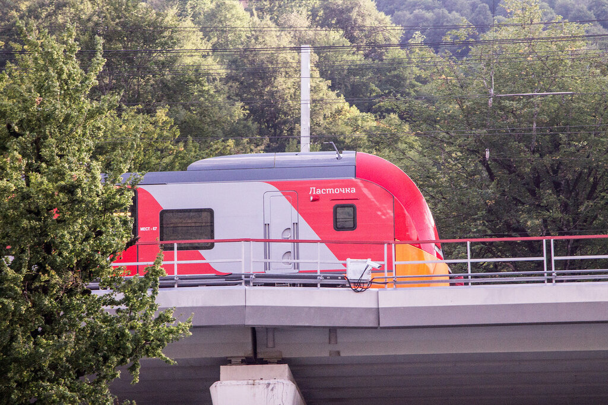
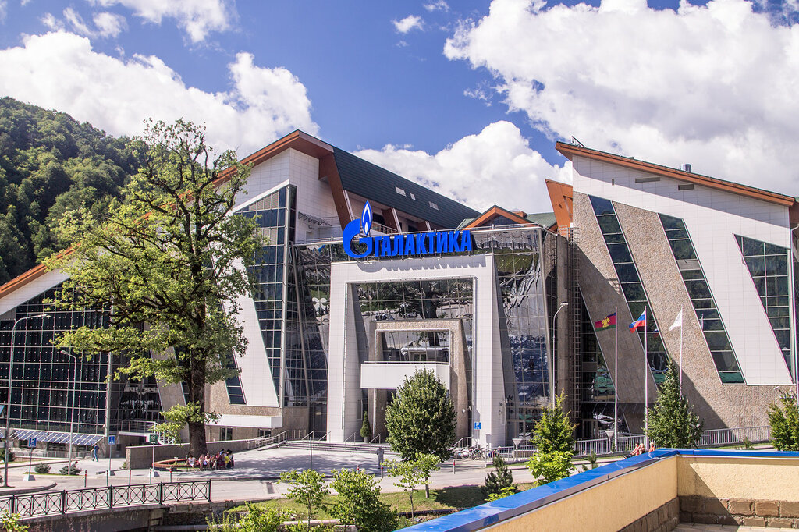
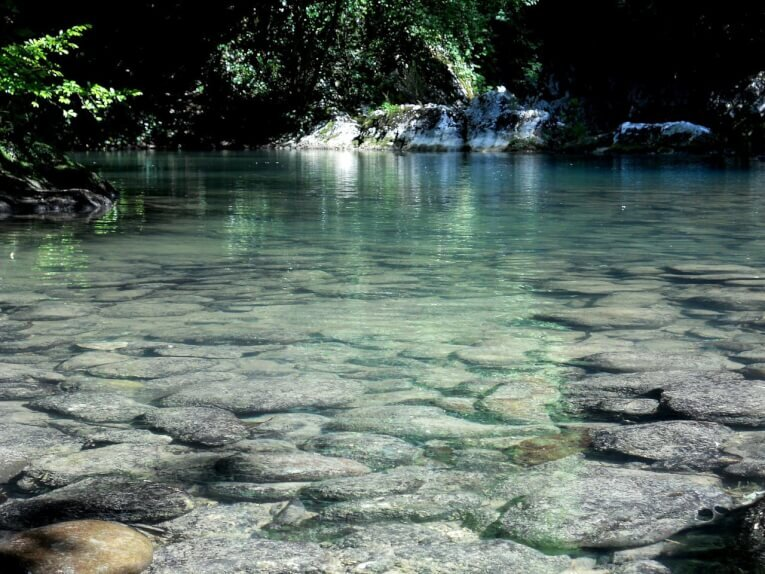
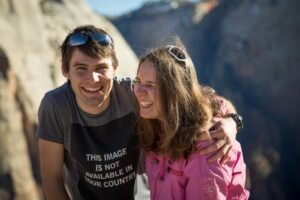

Когда на работе не дают длинный отпуск, то отличным решением может стать короткое путешествие на выходные в один из самых популярных курортов Краснодарского Края – Сочи.

<!--more-->

Для тех, кто как и я постоянно путает Адлер и Сочи, предлагаю объяснение: Адлер — это исторический и административный центр города-курорта Сочи, здесь находится аэропорт и отсюда ближе всего добираться до Красной Поляны.

В свете последних спортивных событий, а именно — проведения Олимпийских зимних игр в 2014 году, сюда стало приезжать все больше и больше туристов, как из России, так и из стран зарубежья.

И, честно говоря, я очень надеюсь, что со временем уровень сервиса выростет и станет соответствовать той природной красоте и прекрасной атмосфере, которую вы можете тут найти.

Кроме этого, многие ассоциируют отдых в Сочи как исключительно летний. Однако большинство мест из моего списка возможно посещать круглый год, без ограничений.

Итак, куда же можно пойти в Адлере и его окрестностях, на что стоит посмотреть?

Приведу 10 популярных достопримечательностей Адлера и Сочи.

## №10. Олимпийская деревня.

Первым делом (но после моря) стоит отправиться в построенную специально к Играм олимпийскую деревню. Находится она на высоте более 1000 метров над уровнем моря, и визит туда можно совместить с созерцанием удивительных горных пейзажей (летом), и катанием на лыжах или сноуборде (начиная с декабря, заканчивая в мае).

## №9. Олимпийский парк.

Еще одним наследием зимних Олимпийских игр 2014 года стал потрясающий своей красотой Олимпийский парк, разбитый на черноморском побережье. На его территории находится стадион «Фишт», дворец спорта «Айсберг», чаша Олимпийского огня и десяток других важных спортивных объектов. Здесь же состоялся первый в истории России этап Формулы-1.

## №8. Skypark AJ.

[http://www.ajhackett.com/sochi/](http://www.ajhackett.com/sochi/) 

Во всем мире всего 8 таких парков! Гордостью высотного парка является подвесной мост протяженностью 440 метров, натянутый над ущельем на высоте почти 210 метров. Как говорится в рекламных проспектах, одна только прогулка по мосту вызовет всплеск адреналина, но если вам покажется мало, то для смельчаков есть площадки для банджи-джампинга. Мы видели этот мост лишь со стороны, и показалось не очень страшно. Возможно, я бы изменила свое мнение, если бы к моим ногам привязали веревку, и сказали «Прыгай!».

## №7. Центр «Галактика».

[http://galaxy-centre.ru/](http://galaxy-centre.ru/) Этот развлекательный центр открывает перед посетителями двери аквапарка, хаммама, сауны, боулинга, кинотеатра, а также предлагает покататься на коньках и сыграть в бильярд. Подойдет для тех, кто путешествует с детьми. Мы пока без них, и в центр не пошли.

## №6. Заповедник им. Х. Г. Шапошникова.

Природный биосферный заповедник государственного значения — крупнейший по площади и разнообразию флоры и фауны на Северном Кавказе. Он находится под защитой ЮНЕСКО, а на его территории проживает без малого три десятка видов вымирающих животных. Тут вы можете заказать организованную экскурсию или даже полноценный поход на 5-6 дней. 

## №5. «Моя Россия».

Уникальный этнографический центр занимает площадь 11 гектаров и включает 11 отдельных павильонов, каждый из которых посвящен одному из регионов страны: Сибирь, Кавказ, Москва и так далее. Посетители смогут узнать массу интересных фактов об истории разных краев нашей Родины и отведать блюда местных традиционных кухонь. Пожалуй, этакий Этномир для иностранцев.

## №4. Sochi Discovery World Aquarium.

[http://sochiaquarium.ru](http://sochiaquarium.ru) 

Крупнейший в городе океанариум, оснащенный огромными аквариумами и великолепной системой освещения. Желающим полюбоваться на огромных акул и прочую морскую живность надо заплатить 600 рублей за вход+100 рублей за съемку.

## №3. Абхазия.

Ее еще называют «страна души». Если вы планируете лететь в Сочи, то я настоятельно рекомендую выделить хотя бы несколько дней на осмотр этой маленькой, но очень богатой достопримечательностями страны.

Существуют даже однодневные экскурсии, в ходе которых можно успеть осмотреть все основные достопримечательности Абхазии: Сухуми, Гаагры, Новый Афон и массу красивых горных озер, скал и ущелий (правда после такого марш-броска потребуется пара-тройка дней на пляже ничком). А еще в Абхазии вкусные фрукты и отлично готовят шашлык.

Маленький insight от меня – обязательно съездите в Черниговку – об этом месте не трубят в интернете, путеводителях и других местах, но оно сильнее всех запало мне в душу: потрясающая горная поездка на джипе, катание на лошадях, купание в ледяных водопадах.

## №2. Дельфинарии.

[http://delfin-riviera.ru/](http://delfin-riviera.ru/) , [http://sochi.delfinary.com](http://sochi.delfinary.com) И детям, и взрослым придется по душе представление, устраиваемое морскими львами и дельфинами в дельфинариях Сочи. Один можно найти в парке Ривьера, а второй – «Акватория» – в самом Адлере. Выходной день – понедельник. Как и многие дельфинарии мира, сочинские предлагаю поплавать с дельфинами. Могу добавить, что это действительно очень приятное занятие – я плавала с дельфинами в Таиланде, и улыбалась во все 32 зуба от радости. Дельфины очень милые, игривые и умные. Если захотите поплавать сами или подарить такой подарок ребенку, не забудьте заранее оставить заявку! 

## №1. Дендрарий.

[http://www.dendrarium.ru/](http://www.dendrarium.ru/)

Недорогой отдых в Сочи поможет обеспечить [календарь экономного путешественника от Momondo.ru](http://www.momondo.ru/content/travel-saver-calendar/), который подскажет, в какое время лучше всего лететь на отдых, а на сэкономленные деньги стоит покататься по курорту и обязательно заехать в Дендрарий. На территории в 50 гектаров произрастает и бережно охраняется более двух тысяч редких видов растений. Удовольствие стоит 250 рублей с человека, дополнительно можно отдать 200 рублей за экскурсию по канатной дороге.

## Как добраться до Адлера из Москвы

Наиболее удобный и при этом недорогой способ добраться до Адлера из Москвы — долететь авиакомпанией Победа. Иногда еще более дешевые авиабилеты появляются у S7 и Utair. Удобно сравнить цены разных авиакомпаний можно в [поисковике aviasales](http://www.aviasales.ru/?marker=25257).

## Где остановиться в Адлере

На [booking.com](http://www.booking.com/searchresults.ru.html?aid=878635;sid=a0a8e515fe031aa76d8f4969ee9da525;dcid=4;class_interval=1;dest_id=-2874290;dest_type=city;dtdisc=0;group_adults=2;group_children=0;hlrd=0;hyb_red=0;inac=0;label_click=undef;nha_red=0;no_rooms=1;offset=0;offset_unavail=1;postcard=0;redirected_from_city=0;redirected_from_landmark=0;redirected_from_region=0;review_score_group=empty;room1=A%2CA;sb_price_type=total;score_min=0;si=ai%2Cco%2Cci%2Cre%2Cdi;src=index;ss=адлер;ss_all=0;ss_raw=адлер;ssb=empty;sshis=0;srpos=1;origin=search) вы без проблем найдете тысячи вариантов размещения в Адлере на любой вкус и цену.

Мы с мужем любим общаться с местными, и кроме красивой картинки для туристов видеть еще и реальную жизнь. Поэтому для ночевок стараемся использовать сервис [Airbnb](http://www.airbnb.ru/c/alexandrab4058), и **дарим 2100 рублей в подарок при первом бронировании** нашим читателям.

Чтобы не попасть впросак, рекомендую внимательно изучить отзывы на хостов, и только потом приступать к бронированию.

## Геленджик

Если вы приехали в Адлер больше чем на неделю мы настоятельно рекомендуем съездить на пару дней в Геленджик. Недавно мы посетили этот город и подобрали для вас [Топ-5 лучших мест](https://vodpop.ru/5-mest-kuda-shodit-v-gelendzhike/), которые обязательно стоит посмотреть в Геленджике.

## Что еще посмотреть?

Если вдруг у вас останутся время и силы, очень рекомендуем вам съездить в солнечную Абхазию. Это совсем недалеко, можно добраться за полдня. Мы подготовили для вас [топ-10 самых красивых и интересных мест в Абхазии.](https://vodpop.ru/chto-posmotret-v-abhazii/) 

\[row\]\[column size="1/2"\]

## Где мы сейчас?

 Последние несколько лет мы находимся в большом путешествии по Северной и Южной Америке, двигаясь от Аляски до Аргентины на машине. Мы проехали уже около 80 000 км и это даже еще не полпути! Мы живем в домах у местных и познаем местные культуры и обычаи. Следите на нашими приключениями [в нашей группе ВКонтакте](https://vk.com/vodpop)!\[/column\] \[column size="1/2"\]

## Наша группа

\[/column\]\[/row\]
