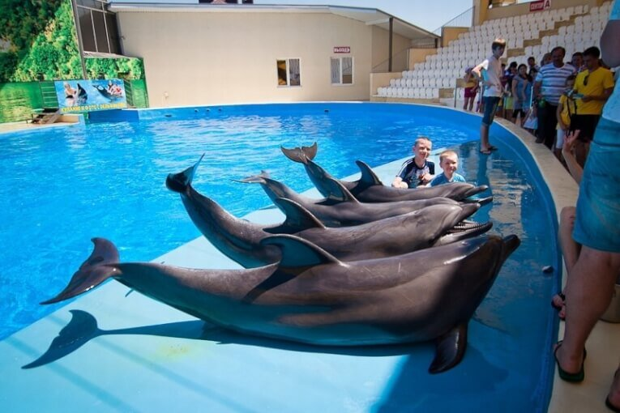
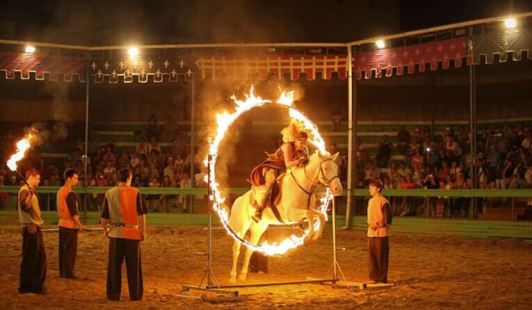
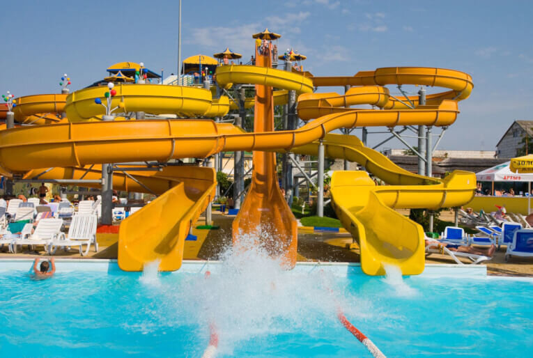

Куда сходить в Анапе, какие достопримечательности - вопросы, который задает каждый турист, приехавший  сюда. Очевидно, что море - это самая популярная достопримечательность, но кроме него здесь есть много интересных мест, куда можно сходить на этом черноморском курорте.

<!--more-->

Анапа -  это отличное место для отпуска с детьми: 40 км песчаных пляжей, 10 км галечных, леса, парки, дельфинарии, океанариумы, лечебные грязи и уникальные минеральные источники делают город одним из самых популярных курортов России. привлекающих более 4 миллионов туристов каждый год.

Итак, куда же можно пойти в Анапе и ее окрестностях, на что стоит посмотреть?

Приведу 10 популярных достопримечательностей Анапы.

## 1. Анапский дельфинарий Nemo

[http://nemoanapa.ru/](http://nemoanapa.ru/raspisanie-i-stoimost/)

Дельфинарий в Анапе - одно из самых популярных мест для посещения, которое предлагает ежедневные шоу (кроме понедельника) с участием дельфинов, морских львов, моржей и других представителей подводного мира. Побывать здесь, и не сходить в Анапский дельфинарий - это как побывать в Париже и не увидеть Эйфелеву башню. Шоу порадует как взрослых, так и самых маленьких. Приятный бонус: ребенок до 5 лет - бесплатно. Самая приятная часть для меня - тут можно поплавать с дельфинами! По-настоящему незабываемые впечатления.

## 2\. Музыкальные фонтаны

Удивительные "танцующие", или как еще называют "поющие" фонтаны можно наблюдать на Центральной площади Анапы с мая по октябрь. Вечернее шоу проходит с 21:00 до 23:00, и с момента открытия в 2014 году музыкальные фонтаны  стали точкой притяжения туристов. Отличное место, чтобы погулять с детьми вечером после дня на пляже. Если прийти за 15 минут до начала шоу, можно успеть занять скамейку и наслаждаться видом с комфортом.

 

## 3. Набережная Анапы

Набережная - это главная достопримечательность Анапы. С высокого берега открывается прекрасный вид на море. Если вы ищете, куда сходить в городе вечером, то смело выбирайте прогулку по набережной: помимо красивого вида здесь можно найти невероятное множество кафе и развлечений на любой вкус и кошелек. Заложите на прогулку 1,5-2,5 часа и не забудьте удобную обувь.

## 4\. Океанариум РИФ

[http://oceanariumrif.ru/](http://oceanariumrif.ru/)

В этом небольшом океанариуме Анапы вас ждет замечательная коллекция редких рыб и морских существ. Помимо обитателей моря вы также сможете увидеть коралловые рифы, почитать интересную информацию об каждой рыбке и потрогать морские звезды руками.

## 5\. Замок «Львиная Голова»

[шоу-рыцарей.рф](http://xn----8sbpqvnbu3ap1b.xn--p1ai/)

Идеальное место для посещения с детьми в Анапе. В замке "Львиная голова" можно погрузиться в атмосферу Средневековья, посмотреть на настоящий рыцарский турнир, трюки на лошадях, шоу с огнем и танцы. Кроме того, тут можно пройти посвящение в рыцари и купить тематические сувениры. Советую сходить на вечернее шоу - будет шанс увидеть трюки с огнем.

## 6\. Заповедник Большой Утриш

Заповедник, расположенный неподалеку от Анапы, славится своими необыкновенными зарослями можжевельника, прекрасными видами и чистейшим морем. Можно прогуляться вокруг, заняться дайвингом, поплавать с маской и полюбоваться на рыбок. Лучше всего выбрать для посещения будний день, чтобы избежать столпотворения - место очень популярно не только у туристов, но и у местных.

## 7\. Анапский археологический музей "Горгиппия"

[http://museumanapa.ru/](http://museumanapa.ru/)

Археологический музей в Анапе будет интересен как взрослым, так и детям: если первым профессиональный гид расскажет об истории Горгиппии (старое название города), то представителям младшего поколения будет интересно полазить по раскопкам этого музея под открытым небом. 

 

## 8\. Долина индийских лотосов

[http://sochiaquarium.ru](http://sochiaquarium.ru) 

По словам многих путешественников, долина индийских лотосов в Ахтанизовском лимане - это скрытая жемчужина Краснодарского края, расположенная чуть более чем в часе езды от Анапы. Можно поехать с экскурсией и самостоятельно, но в обоих случаях вы получите уникальные эмоции и множество красивых фотографий одного из самых прекрасных цветков нашей планеты. Период активного цветения приходится на июль-август, поэтому постарайтесь спланировать свою поездку именно в этом период. Попасть туда можно только на катере: многие путешественники наслаждаются поездкой по реке ничуть не меньше, чем наблюдением за лотосами. Заложите на поездку минимум половину дня.

## 9\. Бювет с минеральной водой

О пользе минеральной воды знает каждый, но не каждый знает, где найти настоящую минеральную воду. Если вы ищете, куда сходить в Анапе, чтобы поправить здоровье, бюветы - самое подходящее место. Один из самых популярных находится по адресу проспект Революции, д.1. Также можно зайти в бювет санатория "Родник" по адресу Пионерский проспект, д.30.

 

## 10\. Аквапарк Золотой Пляж

[http://anapa-akvapark.ru/](http://anapa-akvapark.ru/)

Пожалуй, лучшее место, куда сходить в Анапе на целый день всей семьей: горки и бассейны для всех возрастных категорий: будет интересно как взрослым, так и подросткам и совсем маленьким детям. Большое разнообразие горок, шезлонги, ресторан на территории - все это позволит провести день под открытым небом. Советую приходить в теплый безветренный день, иначе может быть прохладно. Постарайтесь оставить все ценные вещи дома - аренда ячейки стоит дополнительных 300 рублей. Полотенца также надо взять с собой.

Надеюсь, после прочтения данной статьи у вас не осталось сомнений, куда сходить в Анапе. Если вы знаете другие интересные места, поделитесь с нами в комментариях!

## Как добраться до Анапы из Москвы

Наиболее удобный и при этом недорогой способ добраться до Анапы из Москвы — долететь на самолете. Иногда дешевые авиабилеты появляются у S7, Аэрофлот и Ural Airlines. Чтобы не ходить по сайтам этих компаний, можете сравнить и выбрать билеты в поисковике [Aviasales](http://www.aviasales.ru/?marker=25257).

Или найдите самые дешевые авиабилеты из Москвы в Анапу на [Скайсканере](https://www.skyscanner.ru/routes/mosc/aaq/moscow-to-anapa.html).

Вы готовы потратить немного времени, чтобы узнать, как купить самые дешевые авиабилеты в Анапу? Тогда рекомендуем прочитать нашу статью с [пошаговой инструкцией для покупки авиабилетов.](https://vodpop.ru/kak-kupit-samyie-deshevyie-aviabiletyi/)

## Где остановиться в Анапе

Разумеется, на том же [booking.com](https://www.booking.com/searchresults.ru.html?aid=878635&lang=ru&sid=0825771f3eb0e9f21f2b743cefe52fc3&sb=1&src=index&src_elem=sb&error_url=https%3A%2F%2Fwww.booking.com%2Findex.ru.html%3Faid%3D878635%3Bsid%3D0825771f3eb0e9f21f2b743cefe52fc3%3Bsb_price_type%3Dtotal%26%3B&ss=%D0%90%D0%BD%D0%B0%D0%BF%D0%B0&ssne=%D0%9F%D1%83%D1%8D%D1%80%D1%82%D0%BE-%D0%90%D0%B2%D0%B5%D0%BD%D1%82%D1%83%D1%80%D0%B0%D1%81&ssne_untouched=%D0%9F%D1%83%D1%8D%D1%80%D1%82%D0%BE-%D0%90%D0%B2%D0%B5%D0%BD%D1%82%D1%83%D1%80%D0%B0%D1%81&dest_id=900040476&dest_type=city&checkin_monthday=&checkin_month=&checkin_year=&checkout_monthday=&checkout_month=&checkout_year=&room1=A%2CA&no_rooms=1&group_adults=2&group_children=0&genius_rate=1) вы без проблем найдете около тысячи вариантов размещения в Анапе на любой вкус и цену.

Однако мы предпочитаем побольше общаться с местными во время путешествий, узнавать, как и чем они живут, чем увлекаются, к чему стремятся, какие у них взгляды на мир. Поэтому и на ночевки мы стараемся останавливаться у местных, через Airbnb. С точки зрения безопасности, желательно выбирать из вариантов, по которым уже есть хотя бы 5-10 хороших отзывов. Сейчас в Анапе есть около трех сотен хостов.

Кстати, если вы решите бронировать жилье через Airbnb, вы можете **получить скидку 2100 рублей**, если воспользуйтесь нашей [ссылкой](http://www.airbnb.ru/c/alexandrab4058).

Хорошего вам отпуска.
