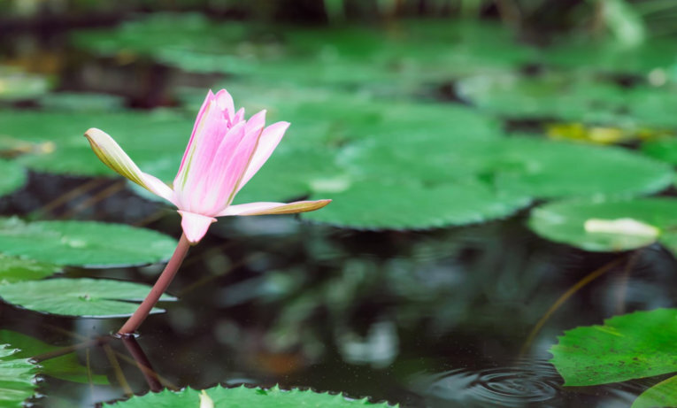
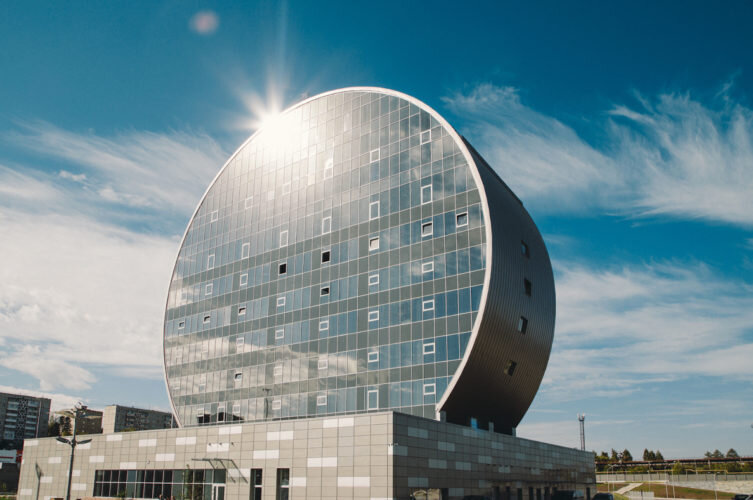
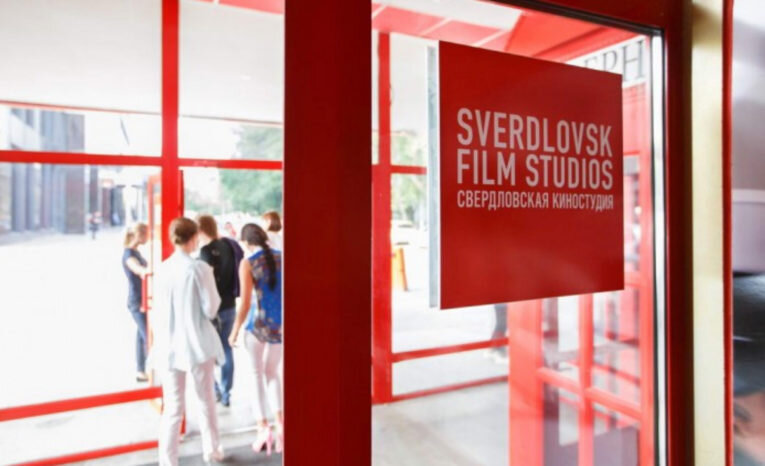
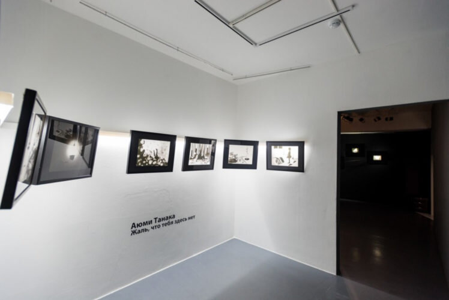
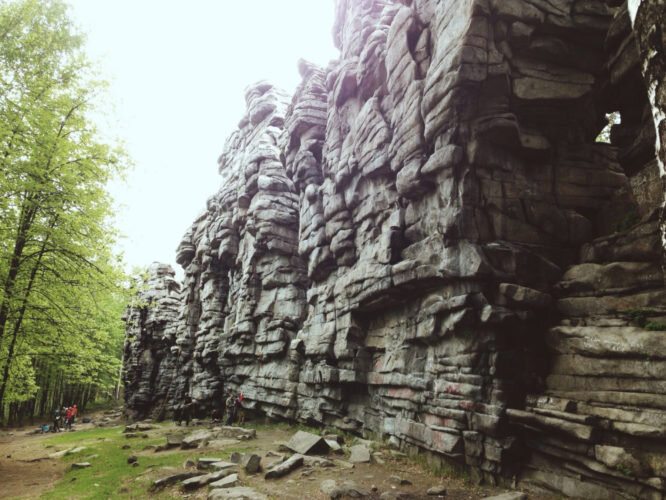
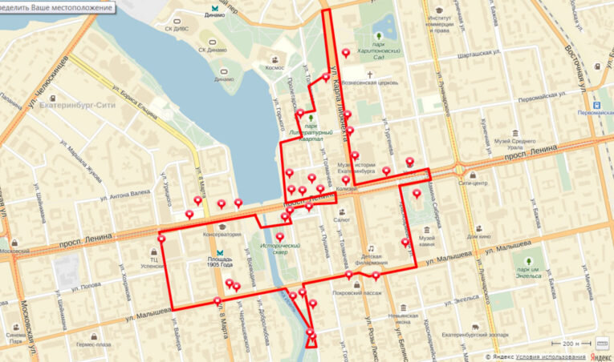
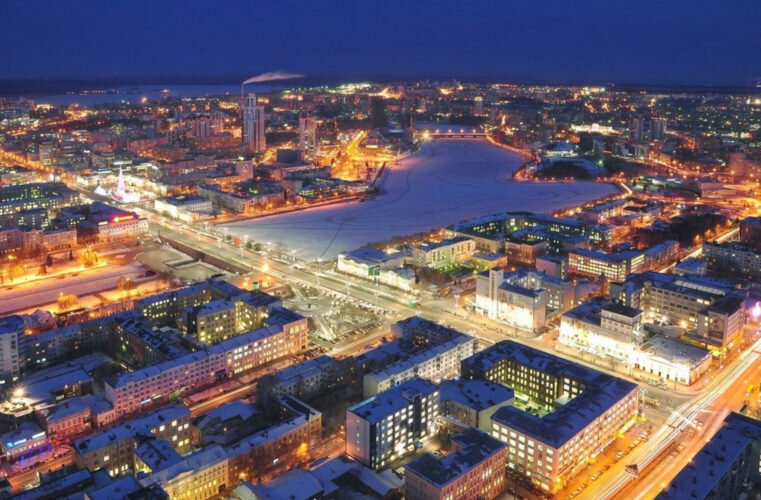

Екатеринбург — удивительное по своей атмосфере место, входит в четверку крупнейших городов России после Москвы, Санкт-Петербурга и Новосибирска, и может похвастаться парой сотен интересных для посещения мест.

Чтобы обойти их все, вам понадобится не менее пары месяцев, поэтому я подобрала для вас 10 лучших мест, куда сходить в Екатеринбурге.

<!--more-->

Итак, 10 мест **куда сходить в Екатеринбурге**:

## №10. Ботанический сад

[http://botgard.uran.ru](http://botgard.uran.ru/)

Один из самых красивых парков Екатеринбурга, где можно погулять, почитать книжку, полюбоваться цветами, деревьями, утками и белочками. Особенно красив поздней весной и ранним летом, когда растения начинают поочередно цвести. Если вы ищете тихий уголок, чтобы отвлечься от шума мегаполиса, то Ботанический сад — ваше идеальное место. Одно огорчение: работает только по будням, с 8 до 18.

Если вы любите смотреть на редкие цветы и растения, можете заглянуть в оранжереи (правда, посещать их можно только в составе группы, необходима предварительная запись). Также Ботанический сад — одно из лучших мест для фотосессий в городе, здесь часто снимают свадьбы и love story.

**Цена:** бесплатно, экскурсии в оранжереи оплачиваются отдельно (от 150 рублей)

## №9. Галерея декоративно-прикладного искусства "Арт-птица"

[https://artbird.ru](https://artbird.ru)

“Арт-птица” — одно из мест, куда точно стоит сходить в Екатеринбурге, если вы ищете подарок своим близким, хотите купить что-то с Урала в качестве сувенира или просто полюбоваться на красивые самобытные вещи.

В галерее представлены работы из керамики, стекла, серебра и бронзы уральских мастеров, а также картины, книги — словом, все, что вы только можете вообразить. Очень приятно видеть своими глазами, какие талантливые люди живут на Урале. Приятным бонусом станут музеи Невьянской иконы и Миши Брасиловского на втором этаже этого же здания: можно объединить поход в галерею с их посещением.

**Цена:** бесплатно

## №8. Инновационный Культурный Центр

[https://vk.com/ikc66](https://vk.com/ikc66)

За свою необычную форму ИКЦ прозвали “шайбой”, внутри которой расположены одни из самых интересных экспозиций Урала. На первом этаже комплекса расположен музей горнозаводской цивилизации, где можно увидеть образцы клемм металлургических заводов, посмотреть их расположение на интерактивной карте, наряду с местонахождением рудников и месторождений.

На нулевом этаже можно посетить выставку картин, на третьем — заглянуть в музей камня, где представлена частная коллекция минералов, драгоценных и полудрагоценных камней. Если не поленитесь подняться на восьмой этаж, то оттуда сможете полюбоваться красивым видом на Первоуральск. Кроме того, ИКЦ — это довольно большая концертная площадка с хорошим звуком, следите за их афишей!

**Цена:** бесплатно, вход в музей камня и концерты оплачивается отдельно

## №7. Екатеринбургский музей изобразительных искусств

[http://www.emii.ru](http://www.emii.ru)

Не так уж важно, турист вы или коренной екатеринбуржец, но ЕМИИ — место, куда надо обязательно сходить в Екатеринбурге. Крупнейший художественный музей Урала содержит уникальную и весьма обширную коллекцию, расположенную на двух площадках музея, поэтому советую заложить хотя бы 3-4 часа на осмотр.

Начать, пожалуй, стоит с Каслинского павильона, гордости металлургической промышленности Урала, а затем познакомиться с картинами Айвазовского, Репина, Шишкина, Серова и других известнейших русских художников. Не пожалейте 100 рублей, возьмите аудиогид: с ним прогулка по залам станет намного интереснее.

**Цена:** студентам — бесплатно, пенсионерам и школьникам — 100 рублей, взрослым — 250 рублей. Каждая последняя среда месяца — бесплатный вход для пенсионеров и школьников

## №6. Свердловская киностудия

[http://iglobe.pro](http://iglobe.pro)

Одно из тех мест в Екатеринбурге, куда можно и нужно приходить всей семьей. Здесь проводят выставки, мастер-классы, презентации фильмов, здесь даже можно сходить на экскурсию в студию звука и самостоятельно озвучить отрывок фильма! Если у вас есть дети, или вы сами фанаты мультипликации, то на тематической экскурсии вам расскажут, как зарождалась анимация, и вы даже сможете создать свой собственный мультик и стать мультяшным персонажем.

**Цена:** 250 рублей за экскурсию в составе группы

## №5. Центр фотографии “Март”

[http://8mart1.ru](http://8mart1.ru)

Без лишних слов — это лучшая выставочная площадка в Екатеринбурге. Все без исключения выставки прекрасны. Кураторы и администраторы подходят к своей работе с душой и полной отдачей, и в “Марте” действительно работают с пространством, а не просто вешают фотографии на гвоздики в стене. Для каждой новой выставки перекрашивают стены, подбирают звуковое сопровождение, стараясь подчеркнуть и дополнить основную идею. Добавьте к этому вкусный кофе и возможность полистать книги о фотографии в библиотеке и вы поймете, что это одно из лучших мест, куда сходить в Екатеринбурге.

**Цена:** пенсионеры, студенты, школьники — 150 рублей, взрослые — 250 рублей

## №4. Чертово Городище

“Чертово Городище” — необычный природный памятник, своими неестественными формами так и намекает на свое дьявольское происхождение, благодаря чему и получил такое название. Лучший вариант отдыха на природе в окрестностях Екатеринбурга: излюбленное место для скалолазов, мотоциклистов, велосипедистов и многих других. Что совсем неудивительно, ведь местный ландшафт как нельзя лучше подходит для экстремального спорта: владельцы эндуро-мотоциклов и квадроциклов не зря облюбовали это место.

Но даже если вы далеки от подобных развлечений, тут есть чем заняться в спокойной атмосфере. Некоторые, например, специально приезжают сюда медитировать, заниматься йогой или просто на пикник с красивым видом. Одна просьба: не оставляйте мусор.

**Цена:** бесплатно

## №3. Прогулка по “Красной линии” Екатеринбурга

[http://www.ekbredline.ru](http://www.ekbredline.ru)

“Красная линия” Екатеринбурга — это пешеходный туристический маршрут по историческому центру, обозначенный специальной разметкой на асфальте. На маршруте расположены 35 объектов: исторические памятники, усадьбы, площади и целые улицы.

Длина маршрута — 6,5 километров, и на него можно смело заложить весь день: будет сложно удержаться и не заглянуть, не рассмотреть поближе памятники истории и архитектуры. Идеально подходит для туристов, которые еще не определились, куда сходить в Екатеринбурге: с этого маршрута как раз можно начать знакомство с городом. На сайте доступен бесплатный аудиогид к каждому из 35 объектов.

**Цена: бесплатно**

## №2. Смотровая площадка БЦ “Высоцкий”

[http://visotsky-e.ru](http://visotsky-e.ru)

Хотите посмотреть на Екатеринбург с высоты птичьего полета? Тогда вам точно сюда. Смотровая площадка находится на 52-м этаже на высоте 186 метров. Она огорожена панорамными окнами, но без крыши, поэтому в дождливый день я бы воздержалась от похода сюда. В холодное время года стоит утеплиться, иначе даже минута наверху покажется вам вечностью. В остальном отличное место, чтобы насладиться красивым видом на город, особенно с вечерними огнями. Здорово сюда подняться, когда уже что-то узнали и посмотрели в Екатеринбурге: тут можно искать места, где вы уже побывали. Приятным бонусом идет входной билет в музей Высоцкого.

**Цена:** дети — 150 рублей, студенты и пенсионеры — 250 рублей, взрослые — 350 рублей

А вот и фаворит списка мест, **куда сходить в Екатеринбурге**:

## №1. Президентский центр Бориса Ельцина

[https://yeltsin.ru](https://yeltsin.ru)

Знаковое место Екатеринбурга, несмотря на явное приукрашивание истории и преувеличении заслуг первого президента России. Если вы внимательно читали учебники истории за 11 класс или смотрели телевизор во время перестройки, то определенно найдете повод недоверчиво хмыкнуть во время осмотра музея. Но идти сюда нужно за тем, чтобы повторить забытую со школы историю России, проникнуться атмосферой 80-х и 90-х, посмотреть на пустые полки магазинов (если вы их не застали), на президентский лимузин ЗИЛ и чтобы составить свое собственное мнение об этой крайне неоднозначной политической фигуре.

Смело закладывайте 2-3 часа на осмотр экспозиции и еще полчаса, чтобы побродить по центру и посетить арт-галерею и книжный магазин.

**Цена:** от 50 до 250 рублей
