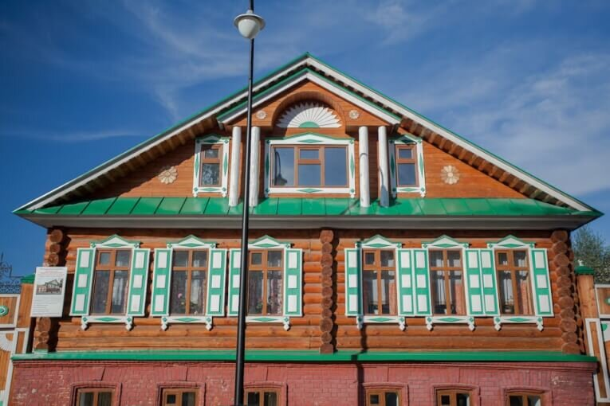
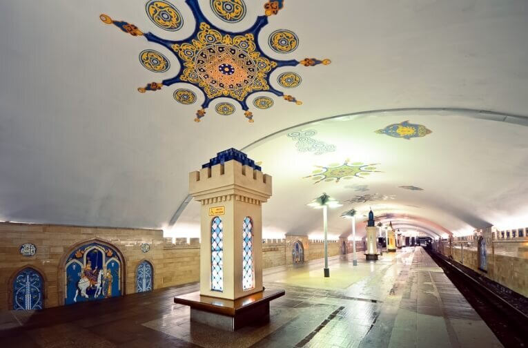
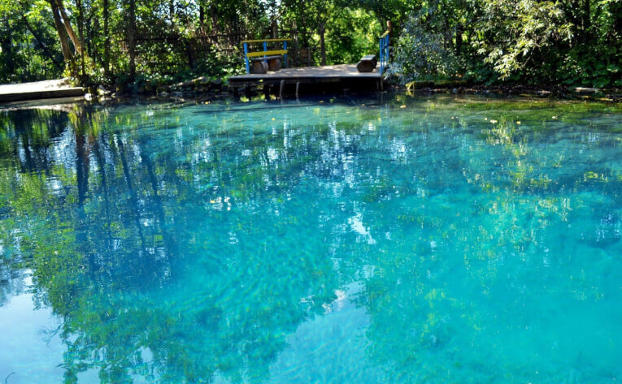
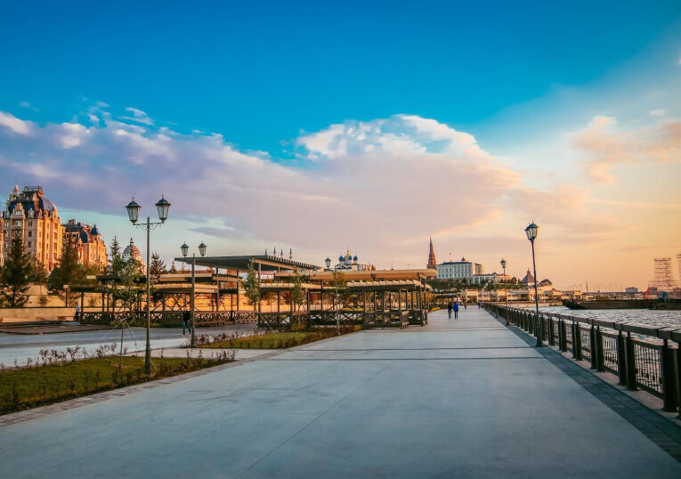

Казань — это город, впитавший в себя множество культур на протяжении своей 1000-летней истории. Он по праву считается "третьей столицей" России, ведь это мультинациональный город, полный контрастов и интересных мест для осмотра. В этой статье я поделюсь с вами, куда сходить в Казани.

<!--more-->

Первый раз мы побывали в Казани путешествуя автостопом. Но добраться до города можно и другими способами: приехать на автомобиле, самолете, автобусе, приплыть по Волге или приехать поездом. Кстати, к 2022 году РЖД обещает запустить высокоскоростную железнодорожную магистраль, которая сократит время пути из Москвы с 12 до 3,5 часов.

Я расскажу, какие интересные места тут есть, и куда сходить в Казани в первую очередь.

## №10. Дом татарской культуры и ремесла

[https://vk.com/tatar\_dom](https://vk.com/tatar_dom)

Этот музей татарской культуры находится в районе Старо-Татарская слобода, где в 18 веке проживала татарская интеллигенция. Музей открылся к Универсиаде и располагается в доме Муллина — купца, торговавшего сахаром.

Мне кажется, это место, куда лучше сходить в Казани в первый день: узнать больше об обычаях и традициях татар и не только посмотреть на предметы быта, но и прикоснуться к истории своими руками. В отличие от большинства музеев, тут можно и нужно трогать все.

Вы можете прийти сюда самостоятельно или в составе экскурсии, где девушка в красивом национальном костюме расскажет вам множество интересных фактов. В конце угощают чаем со сладостями!

**Цена:** взрослый —  250 рублей, дети до 7 лет — бесплатно.

## №9. Казанский метрополитен

Открытое к 1000-летию города, Казанское Метро — единственное, построенное после распада СССР. Возможно, его появление в списке лучших мест, куда сходить в Казани, несколько неожиданно, но оно того стоит.

Что меня поразило, так это то, что таблички на английском тут появились раньше, чем в Московском Метрополитене, и это как нельзя лучше отражает современный дух Казани: несмотря на богатую историю, тут активно следят за последними мировыми тенденциями. Обязательно спуститесь на станцию "Кремлевская", которая находится в самом центре Казани. Витражи, мозаика, башенки, выполненные в традиционном стиле, не смогут оставить вас равнодушными.

**Цена:** 25 рублей.

## №8. Голубые озера

Удивительной чистоты вода, сохраняющая круглый год температуру в +4 градуса, поможет скрасить жаркий летний день или порадует любителей моржевания зимой. В межсезонье местные сюда ехать не рекомендуют. Озера пополняются подземными родниками, и именно поэтому вода такая холодная и чистая.

Для любителей шашлыков есть специально оборудованные места, но я настоятельно рекомендую взять спрей от комаров, если хотите обойтись без болезненных укусов. Добраться сюда можно как на машине, так и общественным транспортом: автобус №40 идет из центра около часа. Если не хочется ждать автобус, можно заказать такси (около 300 рублей).

**Цена:** бесплатно.

## №7. Кремлевская Набережная

Излюбленное место для прогулок как у туристов, так и у местного населения, откуда открываются потрясающие виды на город. Множество развлечений, в том числе для детей: можно арендовать велосипеды на всю семью (в наличие есть тандемы), ролики, а можно покататься на качелях и каруселях, позаниматься спортом и даже поиграть на пианино.

Для желающих сделать короткий перерыв в изучении города советую взять книжку в одной из бесплатных уличных библиотек и насладиться чтением на лавочке или в кафе.

**Цена:** бесплатно.

## №6. Фирменный магазин хлебозавода №3

Приехать в Казань и не попробовать местный чак-чак можно считать преступлением, поэтому посещение хотя бы одного из многочисленных магазинов хлебозавода №3 является обязательным. Магазины, понятное дело, не являются туристическим объектом, но именно тут можно попробовать самый вкусный чак-чак, причем разных вкусов. Кроме этого тут можно найти свежую выпечку и торты. Словом, рай для сладкоежек.

Ближайший к центру магазин находится по адресу г.Казань, ул.Муштари, 30. Но если у вас совсем нет времени, то их фирменную сладость можно купить в "Чак-Чак STORE" по адресу г.Казань, ул. Баумана, 82.

**Цена:** 100-450 рублей.

## №5. Храм всех религий

Строительство Храма всех религий началось в 1994 году Ильдаром Хановым. По его задумке, это место должно было стать культурным центром, объединяющим представителей разных конфессий. Каждый из 16 куполов символизирует одну из религий или культов: христианство, ислам, буддизм, индуизм, иудаизм, синтоизм и другие.

К сожалению, после смерти идейного вдохновителя и главного художника Храма, Ильдара Хасанова, началась борьба за право владения этим местом, привлекавшим немало туристов. В итоге 10 апреля 2017 года Храм подожгли, и сейчас ведутся активные восстановительные работы. Весьма неоднозначная достопримечательность, которую я рекомендую для посещения всем, кто разделяет идеологию автора.

**Цена:** 50 рублей.

## №4. Казанский университет

Казанский Федеральный Университет является одним из старейших ВУЗов России. С момента создания в 1804 году императором Александром I и до Февральской революции 1917 года он именовался «Императорским Казанским университетом», а после — Казанским Университетом.

Среди выпускников был Николай Лобачевский — создатель неевклидовой геометрии. Можно прогуляться и полюбоваться на архитектуру 19-20 вв., посидеть на "сковородке" — популярном месте встречи студентов.

**Цена:** бесплатно.

## №3. Музей социалистического быта

[http://muzeisb.ru/](http://muzeisb.ru/)

Итак, третье место, куда сходить в Казани. Тут можно окунуться в недалекое прошлое. Одежда, техника, игрушки, продукты питания, коллекция гитар с автографами от известных музыкантов того времени, по телевизору крутят клипы из 90-х, создавая неповторимую атмосферу. Всем ностальгирующим, а так же желающим узнать, как жили дедушки-бабушки, мамы и папы, музей обязателен к посещению!

**Цена:** 100-250 рублей.

## №2. Улица Баумана

Не зря улицу Баумана называют Казанским Арбатом. Старейшая улица исторического центра столицы Татарстана совмещает в себе развлечения на любой вкус и кошелек: дорогие рестораны, дешевые кафешки, музеи соседствуют с храмами, магазинами, скульптурами и сувенирными лавочками. Смело заложите пару часов, чтобы пройтись вдоль улицы от часов до Кремля и обратно.

**Цена:** бесплатно.

Ну и лучшее на наш взгляд место, куда можно сходить в Казани:

## №1. Мечеть Кул Шариф

Мечеть Кул Шариф, построенная в 2005 году, не только является главной мечетью Татарстана, но и символом Казани. Мнения про нее можно услышать самые разные: кто-то говорит, что это бездушный новодел, а кто-то ахает от восторга от необычной архитектуры и внутреннего убранства.

Как всегда, лучше увидеть один раз самому, чем сто раз услышать от других. Обязательно посмотрите мечеть снаружи, а если есть желание зайти внутрь, то девушкам не рекомендую ярко краситься: могут и не пустить.

**Цена:** бесплатно.

## 2100 РУБЛЕЙ В ПОДАРОК НА AIRBNB!

Ищете, где остановиться в в Казани? Наш любимый с мужем вариант в поездках — это аренда комнаты или апартаментов на Airbnb. Специально для наших читателей - [скидка 2100 рублей](http://www.airbnb.ru/c/alexandrab4058) на первое бронирование.
