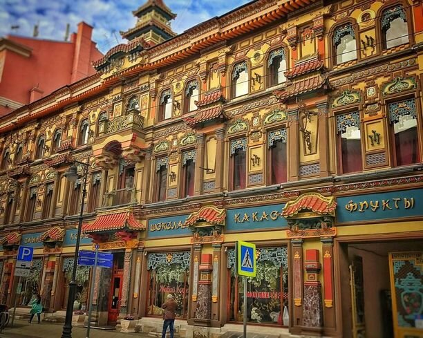
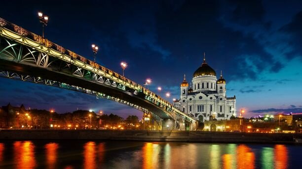
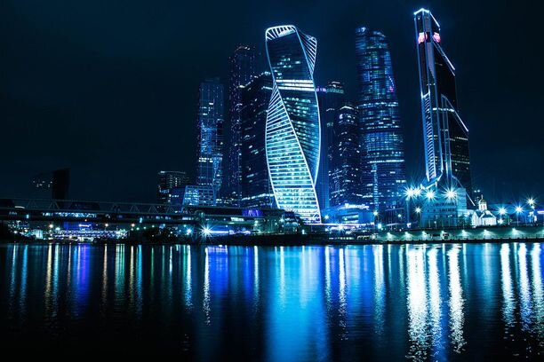
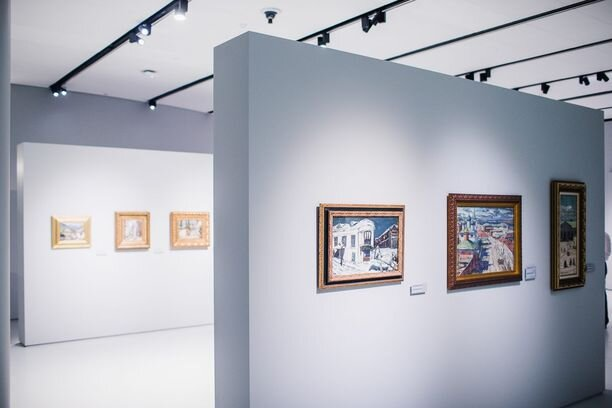
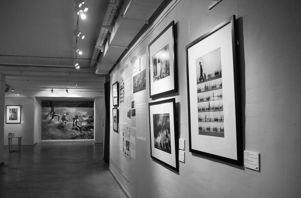
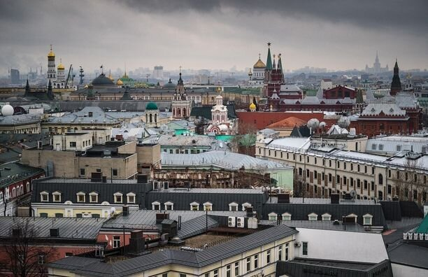
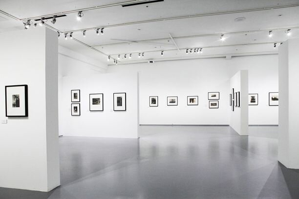
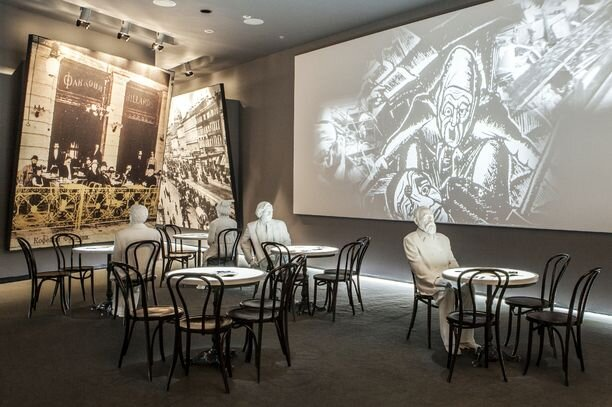

В Москве есть множество интересных мест для посещения, и самая трудная задача — это выбрать, куда именно стоит пойти. Перед написанием этой статьи, я спросила своих знакомых про их любимые места в Москве, куда бы они порекомендовали сходить другим. В чем-то наш список совпал, в чем-то нет, но, надеюсь, что вам список из 10 лучших мест, куда сходить в Москве, придется по вкусу.

<!--more-->

Что ж, вот десятка моих любимых мест в столице нашей Родины:

## №10. Сад МГТУ им.Баумана

[https://vk.com/sbaumana](https://vk.com/sbaumana)

С этим парком меня связывают особые воспоминания, так как учась в МГТУ им.Баумана, я частенько прогуливалась сюда после (а иногда и вместо) пар. Летом — множество цветов, просмотры кинофильмов под открытым небом, фотовыставки, открытые уроки танцев, йога-сессии, а также бесплатные концерты и театральные постановки. Зимой — каток, а в межсезонье — множество других, не менее интересных мероприятий, о которых они пишут на своей страничке.

Удивительно, но даже спустя много лет, сад все равно продолжает сохранять свою уютную атмосферу.

**Цена:** бесплатно

## №9. Чайный дом на Мясницкой

[https://chai-cofe.com/](https://chai-cofe.com/)

Возведенный в 1893 году, этот особняк в псевдокитайском стиле был доходным домом и чайным магазином одновременно. После Октябрьской революции здание перешло в собственность государства, но даже тогда сохранило свой облик с элементами китайской архитектуры.

Лично я, прогуливаясь по центру Москвы, всегда стараюсь сюда заглянуть: даже если вы уйдете отсюда без покупок (что трудно), то, по крайней мере, полюбуетесь на архитектуру и попробуете новый вид чая или кофе: почти каждый день в магазине проводятся дегустации.

**Цена:** бесплатно

## №8. Прогулка по Москве-реке

Одно из самых бюджетных развлечений в столице, при этом доступное круглый год. Если у вас есть такая возможность, советую съездить как минимум два раза: днем, пока светло, и можно рассмотреть архитектуру, а также вечером, когда включается подсветка на всех зданиях в центре Москвы. Пожалуй, вариант с вечерней прогулкой мне даже нравится чуточку больше. Маршруты у разных компаний могут незначительно отличаться, но в общем и целом идут по участку от Киевского вокзала до м.Пролетарская.

Прогулку на речном трамвайчике удобно совместить с посещением Парка Горького: в его дальнем конце находится одна из остановок. Кстати, ни разу не покупала билет по полной стоимости: всегда пользовалась сайтами-купонаторами, покупая их буквально в последний момент и показывая на судне на экране телефона. Экономия минимум 50%, хотя и без этой скидки цена на прогулки по Москве-реке очень доступная.

**Цена:** регулярная цена от 350 рублей

## №7. Москва-Сити

Москва-Сити — это ультрасовременный комплекс небоскребов, расположенных на площади почти в 100 ГА, буквально за пару лет ставший визитной карточкой Москвы. Удивительным образом, Москва-Сити нравится всем: что коренные москвичи, что туристы с радостью фотографируются на фоне башен, ходят на смотровые площадки и закупаются в магазинах. Я — фанат дикой природы, и каменные джунгли мне совсем не по душе, но “ситечка”, как ласково ее называют работающие и живущие в ней люди, радует глаз, как ни крути.

Возможно, вы слышали, что в Москве-Сити работает смотровая площадка. Так вот, игнорируйте ее существование: вид с набережной Тараса Шевченко, что идет вдоль Москвы-реки с противоположной от Сити стороны, куда красивее. С платной смотровой площадки вид открывается весьма посредственный, так как он частично загорожен соседними небоскребами. Сэкономленные 1000 рублей лучше потратить на что-нибудь более полезное.

**Цена:** бесплатно

## №6. Музей русского импрессионизма

[http://www.rusimp.su/](http://www.rusimp.su/)

Уверена, что Пушкинский музей и Третьяковская галерея не нуждаются в представлении и всеми любителями искусства давно изучены. А вот музей русского импрессионизма, открывшийся всего лишь в 2016 году, явно нуждается в том, чтобы о нем узнали если не миллионы, то хотя бы тысячи.

Над термином “русский импрессионизм” до сих пор ведутся жаркие споры, ведь импрессионизм, как известно, зародился во Франции. Однако это не помешало многим известным русским художникам, таким как Серов, Коровин, Кустодиев, Грабарь, писать свои картины в этом художественном стиле.

**Цена:** 250 рублей — обычный при покупке онлайн, 300 рублей в кассе музея, льготные категории только в кассе

## №5. Центр фотографии имени братьев Люмьер

[http://www.lumiere.ru/](http://www.lumiere.ru/)

Одно из лучших мест для любителей фотографии в Москве и идеальное место для свиданий. Братья Люмьер расположены в самом сердце столицы, на Красном Октябре. Мы сюда частенько приходили с мужем, будучи еще студентами, но даже с момента, как мы стали платить “взрослую” цену, любовь к этому месту не угасла.

Всегда интересные, иногда провокационные выставки, бойкот которым пытаются устроить в соц.сетях. Но искусство — оно вне этого. Даже обнаженные тела на фотографиях, представленных в братьях Люмьер, я никогда бы не назвала порнографией. Если вы захотите сделать паузу, то тут можно выпить кофе и полистать книги о фотографии и искусстве.

**Цена:** 400 рублей — будни, 500 рублей — выходной, 250 рублей — студенты

## №4. Смотровая площадка на крыше Центрального Детского Мира

[https://cdm-moscow.ru/attractions](https://cdm-moscow.ru/attractions)

Если вы ищете, куда можно бесплатно сходить в Москве, эта смотровая площадка — одна из лучших ваших опций. С нее открывается вид на Кремль, Политехнический музей и Лубянскую площадь. Смотровая площадка открыта каждый день, с 10:00 до 21:30, а попасть в нее можно с 6-го этажа Центрального Детского Мира на Лубянке следуя по указателям.

**Цена:** бесплатно

## №3. Мультимедиа Арт Музей

[http://mamm-mdf.ru/](http://mamm-mdf.ru/)

Музей также известен в широких кругах под своим прежним названием “Дом фотографии на Остоженке”. Самая крупная московская площадка с фотографиями, где одна именитая выставка сменяет другую. Благо, 6 этажей огромного светлого пространства позволяют удовлетворить любой вкус: не понравится одна коллекция фотографий, всегда можно посмотреть другую.

В рамках выставок частенько устраивают кинопоказы: как правило, на языке оригинала с субтитрами. На базе музея также проводятся мастер-классы и лекции, о которых можно прочитать подробнее на их сайте. Не забудьте также заглянуть на 7-й этаж, где расположена открытая терраса с прекрасным видом на Москву.

**Цена:** взрослый — 500 рублей, студенты — 250 рублей, пенсионеры и школьники — 50 рублей; каждый третий вторник месяца вход в музей для всех посетителей бесплатный

## №2. Ботанический сад МГУ “Аптекарский огород”

[http://www.hortus.ru/](http://www.hortus.ru/)

Старейший ботанический сад России, основанный по приказу Петра I, может похвастаться большой коллекцией растений со всех уголков планеты. Несколько минут от метро — а воздух уже совершенно другой, будто бы и не московский, словно оазис в каменных джунглях.

Подходит для свиданий, неспешных прогулок, фотосессий и крайне популярен в летнее время для проведения свадеб. Из-за наплыва посетителей в выходные дни, я рекомендую зайти сюда в будние: сад работает до 21:00, так что даже после работы вы успеете по нему прогуляться.

**Цена:** взрослые — 300 рублей, льготные категории — 200 рублей

А вот и мой личный фаворит списка лучших мест, **куда сходить в Москве**:

## №1. Еврейский музей и центр толерантности

[https://www.jewish-museum.ru/](https://www.jewish-museum.ru/)

Один из лучших музеев Москвы, да и, пожалуй, России. Столько интерактива вы вряд ли найдете где-то еще, но современные технологии отнюдь не являются целью, а лишь удобным инструментом для подачи истории в интересном всем возрастам формате. История, политика, искусство, религия — каждый сможет найти здесь то, что ему по душе.

В зал Холокоста нужно идти с осознанием того, что безразличным вы оттуда уйти не сможете. Книги, интервью, записки, фильмы, хронология основных событий — все показано и дополнено невероятным количеством деталей, которые делают посещение этого музея особенным.

Еврейский музей однозначно заставит задуматься о многих вещах, и я бы посоветовала сходить сюда несколько раз: первый раз я провела в музее почти 5 часов, и ушла под глубоким впечатлением, чтобы несколько месяцев спустя вернуться вновь и попытаться досмотреть оставшиеся экспозиции. Можно здесь же перекусить в кафе: вкусно, но дороговато.

**Цена:** взрослые — 400 рублей, льготные категории — 200 рублей, посещение временной экспозиции оплачивается отдельно
