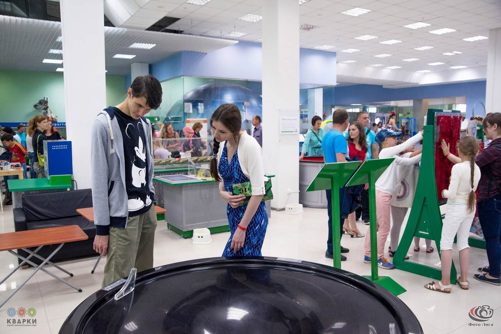
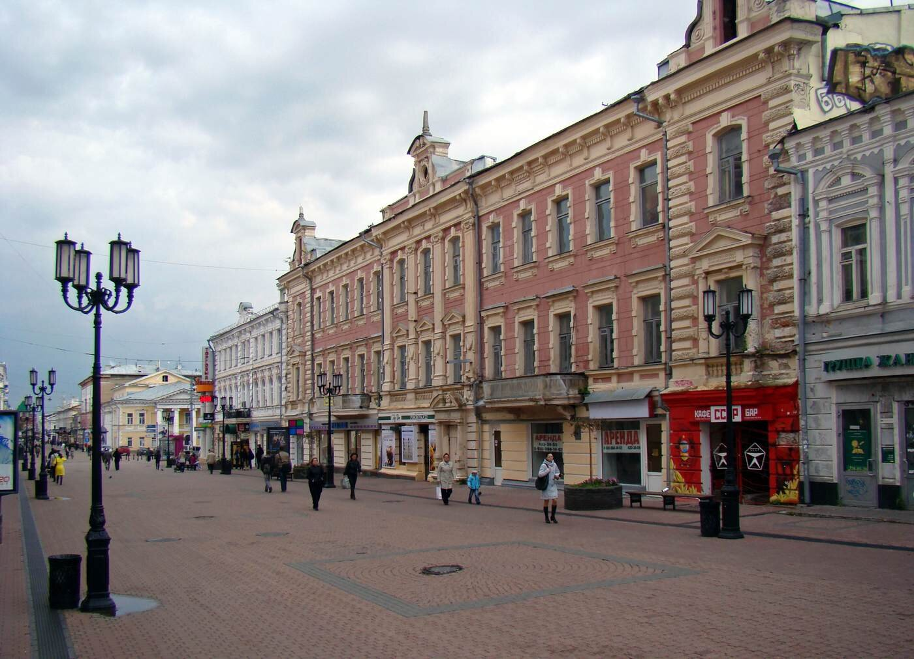
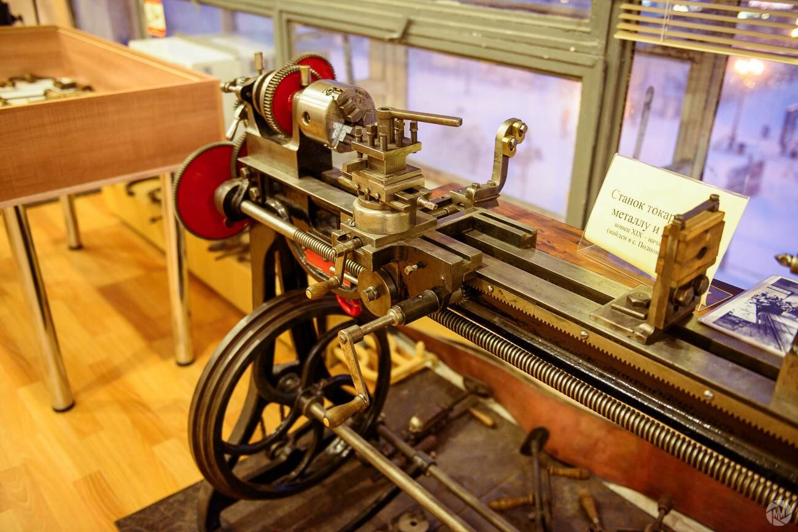
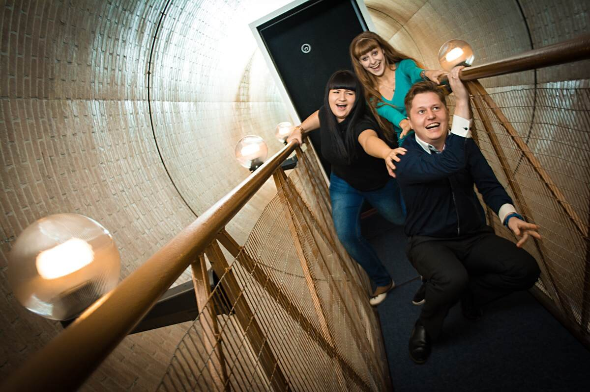
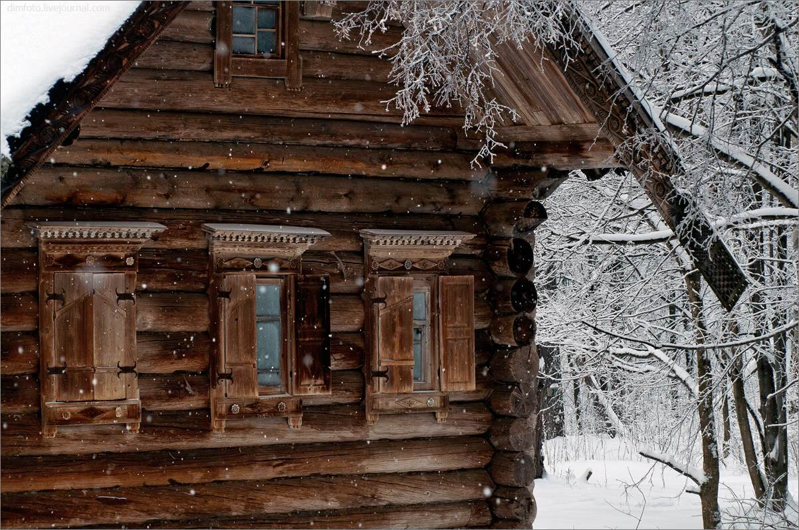
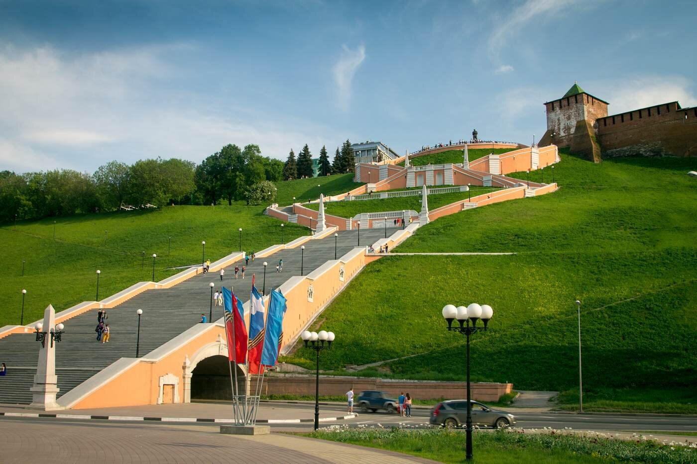
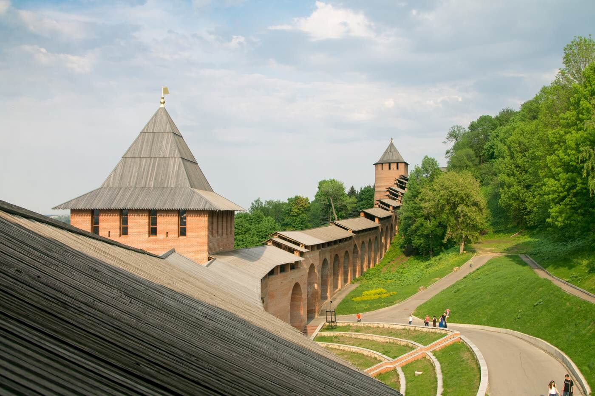

Родина Лобачевского и Кулибина, пятый по величине город России, знаменитая на всю империю ярмарка, один из древнейших каменных кремлей страны и место, откуда в 17-ом веке Минин и Пожарский отправились освобождать Москву от поляков. Как живет «карман России» сегодня, и куда сходить в Нижнем, чтобы влюбиться в него?

<!--more-->

## №10. Музей занимательных наук Кварки

[http://kvarky.ru/muzej.html](http://kvarky.ru/muzej.html)

Здесь физика сходит с пыльных страниц учебников и оживает в увлекательных экспериментах. Экспонаты музея — изобретения и механизмы, которые иллюстрируют физические законы в действии. Экспериментатор — вы сами! Всё тут можно крутить, трогать и нажимать.

Экспозиция организована в хронологическом порядке, чтобы вы наглядно могли проследить развитие научной мысли: от механических орудий Средневековья до новейших изобретений нашего века. По выходным в музее устраивают научные шоу и яркие демонстрации. Здесь с восторгом и любопытством проводят долгие часы и дошкольники (дети до 14 лет только в сопровождении), и студенты, и даже люди совсем взрослые.

Ах, да! Билет вы покупаете на целый день, так что можно пойти перекусить, прогуляться и вернуться назад.

**Цена:** 300 рублей в будни, 380 на выходных

## №9. Русский музей фотографии

[http://www.fotomuseum.nnov.ru/](http://www.fotomuseum.nnov.ru/)

Побывать в этом музее — мечта многих любителей фотографии, ведь место поистине историческое. Именно здесь жили и работали знаменитые на весь мир нижегородские фотографы Карелин и Дмитриев. Экспозиция музея — это материалы об истории города, уникальная коллекция фотоаппаратов (начиная с самых древних) и отдельная выставка, посвященная оптическим иллюзиям.

Кроме того, в музее регулярно проводятся тематические выставки, о которых лучше уточнить по телефону или на сайте. Если вы здесь впервые, попросите экскурсовода.

В этом месте очень легко прочувствовать красоту города и сквозь выцветшие дагерротипы заглянуть в волнующее прошлое.

**Цена:** 75 рублей для детей, 150 рублей для взрослых

## №8. Большая Покровская улица

«Нижегородский Арбат», «главная гастрономическая улица России», «прогулочная миля» и древнейшая улица города — все это о ней. История Большой Покровской начинается в 17-м веке, а к концу 19-го века улица становится средоточием городской дворянской жизни. Здесь вы найдете главные архитектурные ценности города: государственный банк, усадьбу Рукавишниковых (мать В. Набокова, к слову, принадлежала к их роду), целых три театра и прочее.

Бóльшая часть улицы является пешеходной, что привлекает туристов, уличных музыкантов и простых горожан собираться и назначать встречи именно здесь.

К футбольному чемпионату Большую Покровскую отреставрировали, что пришлось по вкусу далеко не всем нижегородцам. И, тем не менее, улица по-прежнему является одним из самых колоритных и интересных мест в городе. Поэтому, если вы пока не знаете, куда сходить в Нижнем Новгороде, то начните отсюда.

**Цена:** бесплатно

## №7. Музей старинной техники и инструментов

[http://www.techmuzey.ru/](http://www.techmuzey.ru/)

Он встретится вам по пути, когда вы будете гулять по Большой Покровской. Рекомендуем заглянуть, потому как все посетители в один голос твердят: место с душой. Музей был создан человеком, безнадежно влюбленным в технику. Это частная коллекция, а потому все сотрудники музея — люди, которые «горят» своим делом.

Старинные кареты, велосипеды и мотоциклы, швейные станки, судовые приборы, промышленный, железнодорожный и часовой инструмент, кинокамеры и уголок обстановки «Родом из СССР».

Здесь вы поразитесь тому, насколько точны были инструменты прошлого и насколько высокотехнологичные продукты с их помощью создавались. А еще в музее хранится печатная машинка писателей Ильфа и Петрова — прообраз печатной машинки Остапа Бендера с отсутствующей буквой «е».

**Цена:** 150 рублей для детей, 200 рублей для взрослых

## №6. Парк чудес Галилео

[http://nn.galileopark.ru/](http://nn.galileopark.ru/)

Множество комнат и переходов заполненных оптическими иллюзиями, неожиданными механизмами и химическими опытами. Напоминает музей Кварки, но с бóльшим акцентом на впечатления и эмоции. Здесь можно весело провести время с семьей или компанией друзей.

Волшебную атмосферу праздника поддерживают работники парка: всегда вежливы и доброжелательны. Периодически здесь проводят практические занятия, на которых посетителей обучают фокусам на границе науки и чуда.

Все экспонаты интерактивны. Среди них вы найдете воплощенные идеи Да Винчи и Эймса и сможете лично провести занимательные эксперименты. В среднем, весь парк обойти можно за час.

**Цена:** 350 рублей для детей, 450 рублей для взрослых Дети до 12 лет в сопровождении старших

## №5. Зоопарк Лимпопо

[http://www.nnzoo.ru/](http://www.nnzoo.ru/)

Мы не станем обсуждать этическую сторону зоопарков как таковых, а расскажем вам, чем «Лимпопо» примечателен. Это первый частный зоопарк в России. Здесь очень, очень чисто. Животные выглядят здоровыми и ухоженными. Есть контактный зоопарк. Коллекция зверей действительно большая, и среди них много редких видов. Вполне вероятно, что некоторых животных вы увидите впервые.

Зоопарк работает круглый год. Периодически проводит акции по сбору корма для животных, а иногда раздает питомцев «в добрые руки».

Территория зоопарка просторна, имеются все необходимые атрибуты: аттракционы, кафе, сладкая вата и прочее. Куда сходить в Нижнем Новгороде еще? Идем дальше →

**Цена:** 250 рублей для детей, 400 рублей для взрослых

## №4. Нижегородская канатная дорога

[http://www.nnkd.ru/](http://www.nnkd.ru/)

Создавалась исключительно из практических соображений: необходимо было соединить Нижний Новгород с Бором, его городком-спутником (по воздуху через Волгу между ними 4 км, а по земле все 27). Однако места, над которыми проходит маршрут, столь живописны, что канатная дорога быстро стала одной из основных достопримечательностей.

Закрытые кабинки на 8 человек, время в пути чуть больше 10 минут. Чисто, современно, безопасно. С высоты птичьего полета вам откроется вид на город, его церкви и монастыри, на место слияния Волги и Оки («Стрелку»), на проходящие под вами суда. Красиво, особенно на закате. Такое путешествие вам запомнится.

Отопления в кабинках нет.

**Цена:** 100 рублей в одну сторону

## №3. Музей архитектуры и быта народов Нижегородского Поволжья (Музей деревянного зодчества “Щелоковский хутор”)

[http://www.hutor-museum.ru/](http://www.hutor-museum.ru/)

Все это названия одного и того же места, небольшого этнографического музея под открытым небом.

Щелоковский хутор находится на территории заповедного леса и включает в себя 16 деревянных строений, типичных для жизни города в прошлом: избы, амбары, мельницы, колодец, церковь 1731 года.

Правда, что музей находится в запустении. И правда, что некоторые здания в крайне плохом состоянии. К сожалению, сегодня это так. Но если вы из тех, кому недостаточно однотипных рафинированных впечатлений, если вы тот, кто в туризме ищет настоящие, правдивые переживания, тогда для вас это место станет ключевым пунктом всей поездки. Настоящая машина времени.

**Цена:** 50 рублей для детей, 100 рублей для взрослых

## №2. Чкаловская лестница и памятник Валерию Чкалову

Одни из главных символов города, расположенные у набережной Волги. Памятник знаменитому летчику установлен на возвышенности с потрясающим видом на окрестные леса и речную жизнь города. Идеально, если с собой у вас окажется бинокль.

Вниз от памятника ведет самая длинная в России лестница — грандиозное и великолепное сооружение сталинской архитектуры. Спустившись к набережной, вы выйдете к другой достопримечательности — катеру «Герой».

Здесь часто проводят спортивные соревнования, встречаются с друзьями и назначают свидания. Открытое пространство, высота, история на каждом шагу — все это вызывает желание остаться тут подольше. Некоторые места называют «местами силы». Думаю, каждый побывавший здесь согласится, что это одно из них.

**Цена:** бесплатно

## №1. Нижегородский кремль

[https://ngiamz.ru/filialy/nizhegorodskij-kreml/](https://ngiamz.ru/filialy/nizhegorodskij-kreml)

Вы уже видели его стены возле памятника Чкалову. Это крепость 1515 года постройки, служившая для защиты региона и выполнявшая функцию сборного пункта во время походов против Казани. Ни разу за всю свою долгую историю не был взят. Сегодня это комплекс административных зданий, музей, храм, площади и сады. Вот куда сходить в Нижнем Новгороде стоит обязательно!

Общая протяженность стен — чуть больше 2-х км! Толщина — от 3,5 до 4,5 м! 13 башен! Остальное узнаете на месте : )

На территории кремля сильный ветер, так что в холодное время года одевайтесь тепло. Посетителям доступна экскурсия по стенам кремля и выставки, расположенные в его башнях (археологические находки, выставки военной тематики и прочее). Во время прогулки по стенам вам откроются новые захватывающие виды, так что держитесь за поручни крепче.Надеемся, вы уже выбрали куда сходить в Нижнем Новгороде! Оставляйте ваши комментарии, и давайте путешествовать вместе!

**Цена:** 100 рублей для детей, 200 рублей для взрослых
