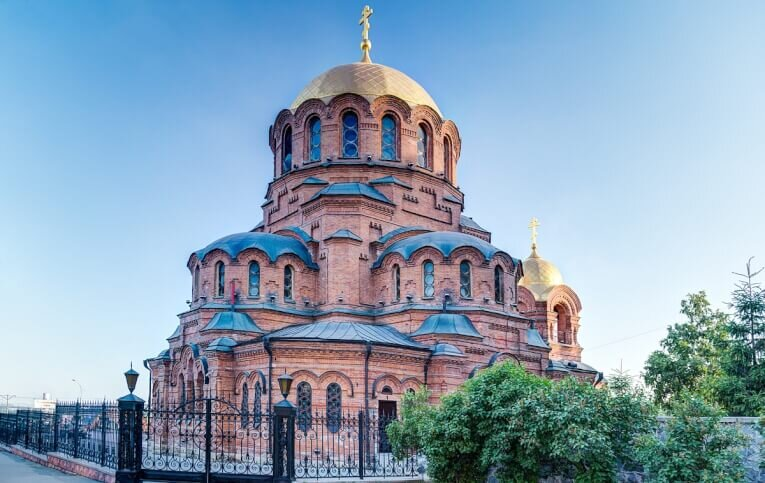
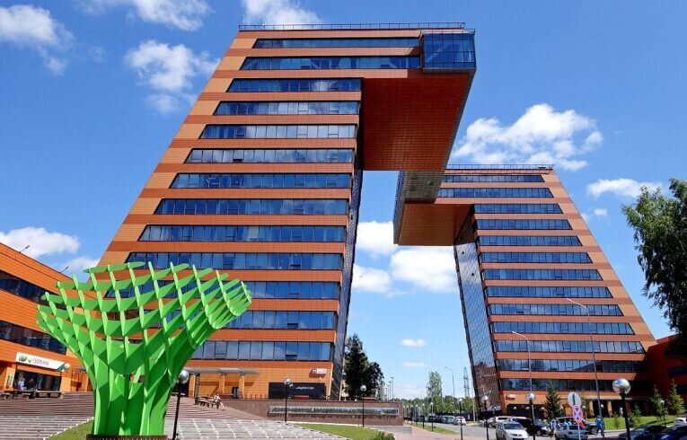
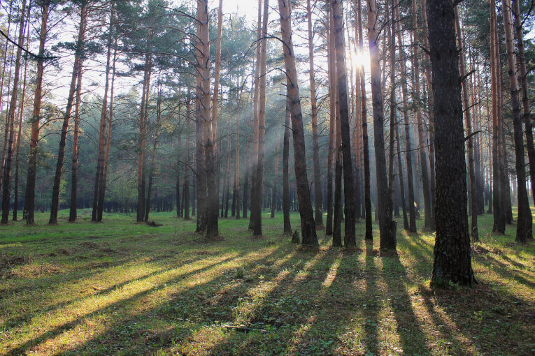
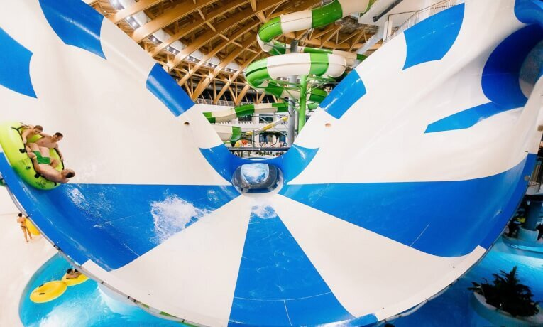
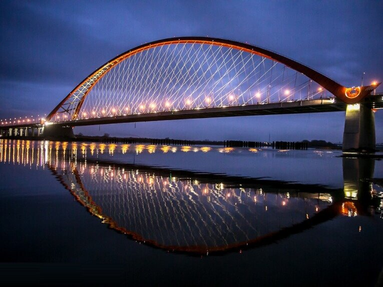
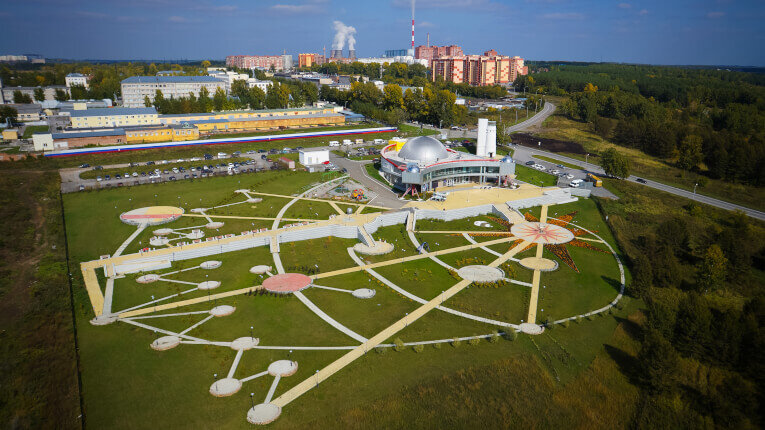

Новосибирск является третьим по численности городом России и крупным научным центром. Но когда встает вопрос, куда сходить в Новосибирске, даже многие местные жители неуверенно пожимают плечами. И зря! В этой статье я расскажу про самые интересные места, куда можно сходить в Новосибирске.

<!--more-->

В таком большом городе как Новосибирск, можно найти развлечение почти на любой вкус, но я хотела бы остановиться на самых традиционных, после просмотра которых вы сможете сказать "я увидел Новосибирск".

Итак, мой личный рейтинг из 10 лучших мест куда сходить в Новосибирске:

## №10. Собор во имя Александра Невского

Здание собора, возведенное в 1899 году, является старейшим каменным строением Новосибирска. Собор построен из красного кирпича, в неовизантийском стиле. В 1937 году он был "приговорен" к уничтожению, но после первого взрыва собор остался невредимым.

Затем был отдан приказ увеличить вдвое количество взрывчатки, и от следующего взрыва осыпалась звонница, разрушенная ударной волной, а в окрестных домах покачнулась земля. Собор же выстоял. Дальнейшее увеличение мощности заряда было опасно для окружавших зданий и собор оставили в покое.

**Цена:** бесплатно

## №9. Первомайский сквер

Это излюбленное место для прогулок в самом центре города. Сюда удобно добраться на общественном транспорте (автобусом или метро) или припарковать машину поблизости и просто насладиться красивым ландшафтным дизайном, многочисленными парковыми скульптурами, посидеть на лавочке, выпить чашку кофе, поесть мороженое в теплый день или полюбоваться на снежные и ледяные скульптуры в зимнее время года.

**Цена:** бесплатно

## №8. Новосибирский Академгородок

Пожалуй, тут можно найти один из самых высоких показателей интеллекта на квадратный метр в мире: на территории Академгородка располагаются десятки научно-исследовательских институтов, в том числе Новосибирский Государственный Университет, входящий в список лучших университетов мира. В городке обязательно нужно посмотреть Технопарк,  прогуляться по улице Золотодолинской, где под номеров 75 находится дом М.А. Лаврентьева (основателя Академгородка), а затем по улице Ильича дойти до корпуса НГУ. И не забудьте посидеть на лавочке-шпаргалке около главного корпуса на улице Пирогова!

**Цена:** бесплатно

## №7. Заельцовский парк

Всего в 15 минутах езды от центра Новосибирска вы сможете перенестись в настоящий сосновый лес и атмосферу спокойствия и тишины. Идеальное место для прогулок всей семьей: есть прокат велосипедов, обустроенные пешие и велодорожки, доступна аренда беседок, пляж и многое другое. Здесь за доп. плату можно посмотреть на воссозданную стоянку кочевников в "Территории Сибири", полазить по веревочному парку, покататься на детской железной дороге, арендовать гидроскутер, а зимой кататься на коньках и лыжах. Самое главное — не забудьте взять с собой репеллент, иначе отдых будет испорчен укусами комаров.

**Цена:** вход бесплатно, доп. опции за деньги

## №6. Аквапарк "Аквамир"

[http://akvamirnsk.ru/](http://akvamirnsk.ru/)

По отзывам многих посетителей, новосибирский аквапарк не уступает своим московским конкурентам: множество горок, бани, сауны, хаммамы, бассейны, искусственные волны. Закладывайте минимум 4 часа, а если собираетесь пойти в выходные, то закладывайте побольше времени на ожидание в очередях. На территории также работают кафе и бары. Первое блюдо, например, можно купить за 100 рублей. Из существенных минусов: долгая процедура регистрации, нет оплаты банковской картой, а также для получения льгот по возрасту необходимо предъявить оригиналы документов (свидетельство о рождении, пенсионное удостоверение).

**Цена:** от 1400 — детский, от 1600 —  взрослый

## №5. Бугринский мост

Это третий мост в Новосибирске через реку Обь, построенный совсем недавно, сразу же он стал одной из его главных достопримечательностей. Красивое и величественное сооружение не оставляет равнодушным ни местных, ни приезжих. Если у вас нет своего автомобиля, сядьте на автобус и прокатитесь по нему хотя бы один раз.

**Цена:** бесплатно

## №4. РЖД музей

В этом музее находится уникальная коллекция паровозов, тепловозов, электровозов и вагонов, в основном работавших на железных дорогах Западной Сибири. Расположены все объекты на 6 путях, и без экскурсии вам потребуется около часа, чтобы обойти все экспонаты. Помимо этого, в коллекции музея имеются советские легковые автомобили ГАЗ, Москвич, ЗАЗ разных годов выпуска, а также несколько грузовиков, тракторов и вездеходов. Я бы советовала сходить туда с сопровождением экскурсовода, чтобы заглянуть внутрь некоторых паровозов. Особенно интересны дореволюционные вагон-тюрьма, вагон-госпиталь.

**Цена:** обычный билет —  90 рублей, дети до 6 лет — бесплатно

## №3. Театр оперы и балета

[http://www.novat.nsk.ru/](http://www.novat.nsk.ru/)

Крупнейшее здание театра России строилось в промежутке с 1931 по 1941 годы и до сих пор поражает своим размером и величием. Если верить слухам, то все здание Большого театра можно поместить под купол новосибирского театра. Недавно в театре прошел ремонт, который вы можете оценить самостоятельно, сходив на одну из постановок. Советую посмотреть современный балет "Пер Гюнт" и "Щелкунчик" — нестареющую классику.

**Цена:** 400— 5000 рублей

## №2. Планетарий

[http://www.nebo-nsk.ru/](http://www.nebo-nsk.ru/)

Большой Новосибирский планетарий открыл свои двери в 2012 году и сразу же вошел в список лучших мест, куда сходить в Новосибирске. А все потому, что помимо интересных экспонатов, тут можно посмотреть 3D фильмы о космосе, а также самому заглянуть в телескоп! Еще рядом с планетарием можно покататься на колесе обозрения и погулять по красивой территории.

**Цена:** 130 —  детский, 200 —  взрослый

Лучшим же местом, куда сходить в Новосибирске, по мнению подавляющего большинства, явлется

## №1. Новосибирский зоопарк

[http://www.zoonovosib.ru/](http://www.zoonovosib.ru/)

Крупнейший в России, Новосибирский зоопарк ежегодно привлекает 1,5 миллиона посетителей со всего мира. Куда интереснее и масштабнее своего московского собрата, Новосибирский зоопарк занимает территорию в несколько футбольных стадионов и держит под своим крылом почти 11 тысяч особей и 770 видов. К главным достопримечательностям можно отнести бенгальского тигра и пару белых медведей Кая и Герду, которые в 2016 году второй раз стали родителями. Закладывайте не менее 3,5 часов на осмотр и прихватите пару удобных кроссовок — ноги скажут вам "спасибо" :)

**Цена:** 150 —  детский, 300 —  взрослый, 50 рублей парковка

## 2100 рублей в подарок на Airbnb для наших читателей!

Ищете, где остановиться в Новосибирске? Наш любимый с мужем вариант в поездках — это аренда комнаты или квартиры на Airbnb. Вот [ссылка на скидку 2100 рублей](http://www.airbnb.ru/c/alexandrab4058) при первом бронировании.
