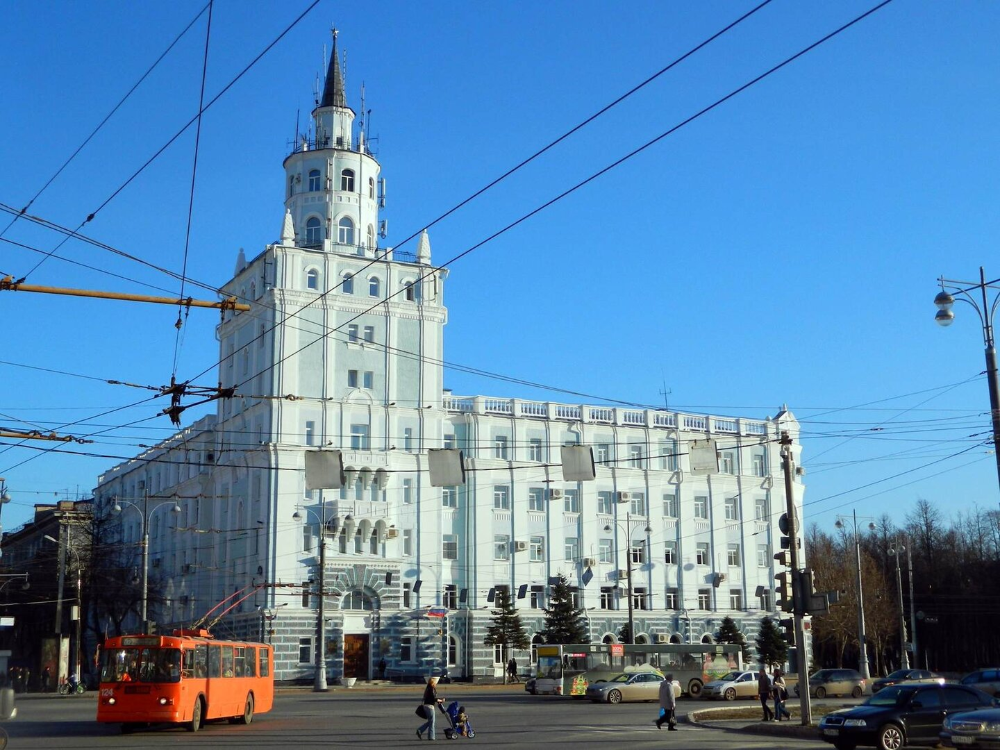
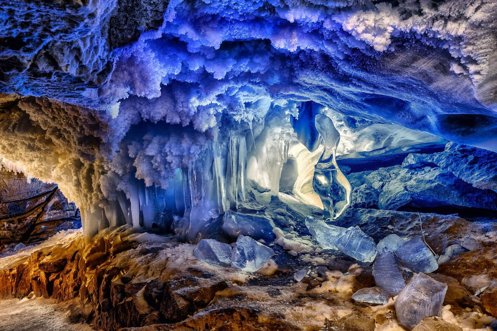
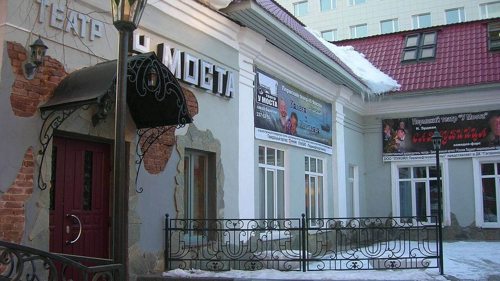
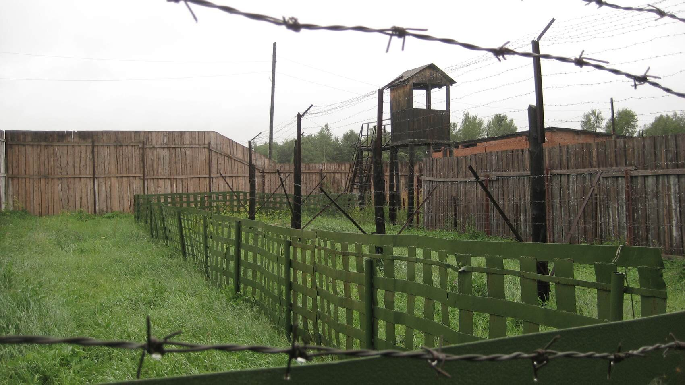
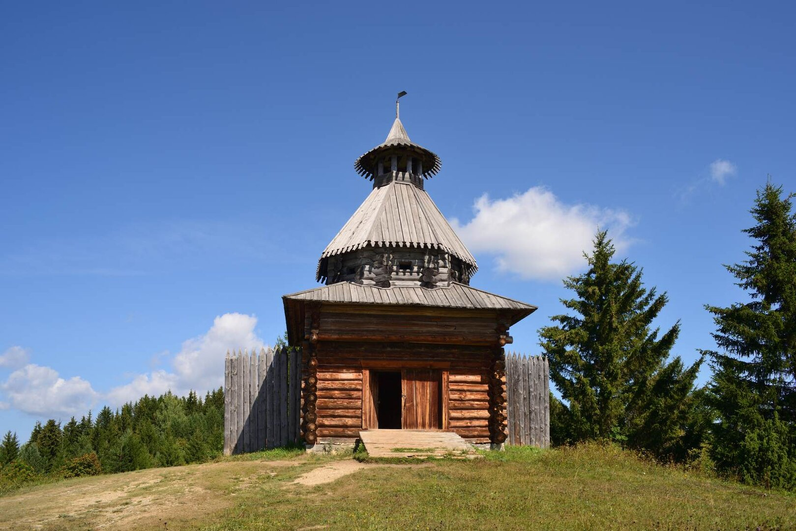
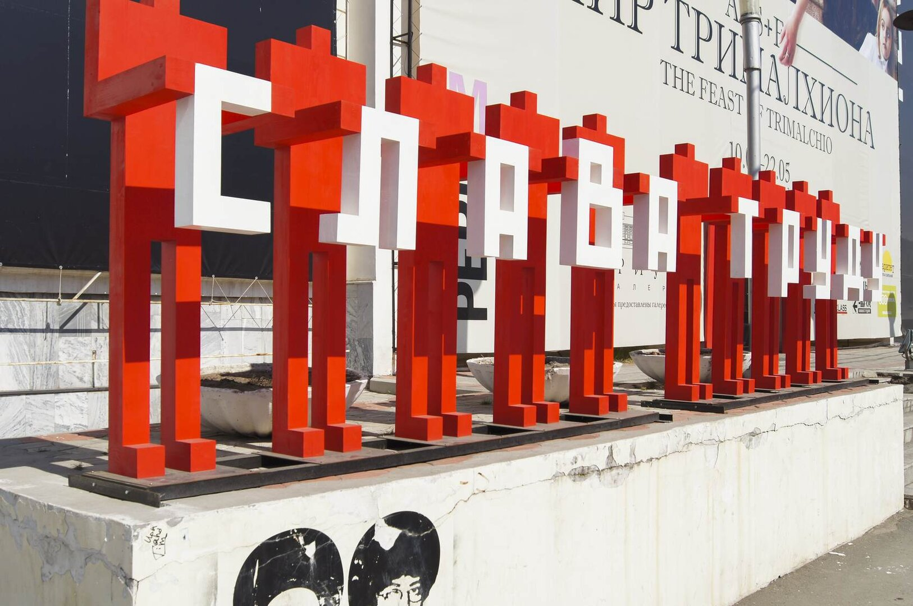
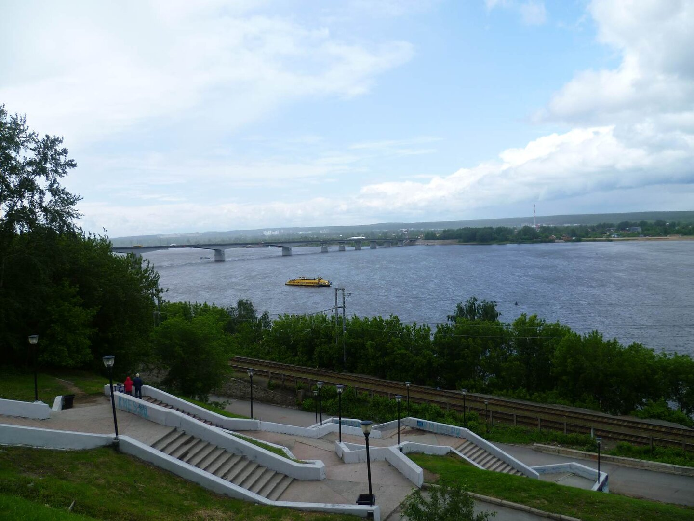
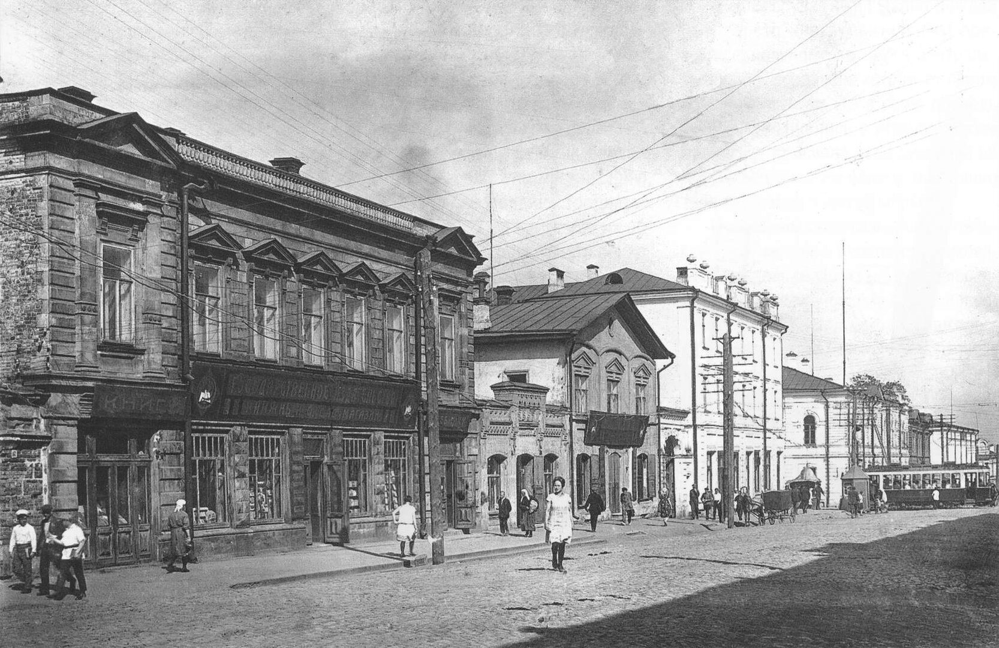
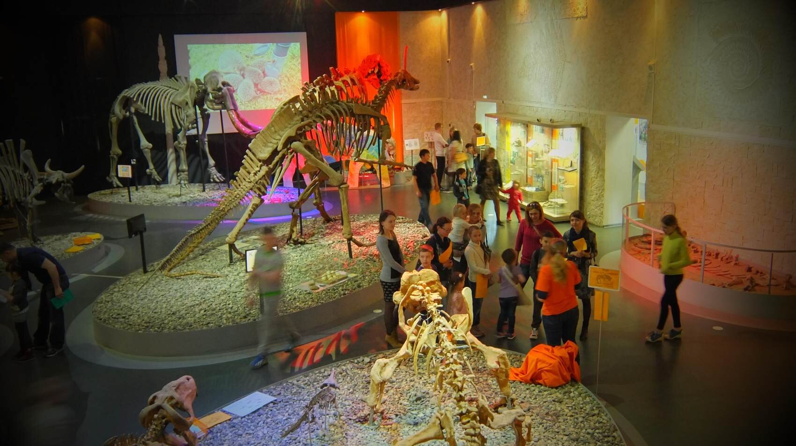

Молния: Баба-яга — пермячка! И неудивительно, ведь Пермь окружена густыми лесами, а половина ее городской территории — рощи и парки.

В Перми родился изобретатель радио Александр Попов. Это единственный город в России, у которого есть собственный шрифт Пермиан. А еще именем Перми назван целый геологический период (этим мы обязаны британскому геологу Родерику Мурчисону).

И не в обиду москвичам: Царь-пушка в Москве с самого начала изготавливалась как памятник, а вот Пермская царь-пушка — настоящее боевое орудие, и титул самого большого в стране орудия принадлежит именно ей.

Куда сходить в Перми, если хочется увидеть все и сразу? Пойдемте, я покажу дорогу.

<!--more-->

## №10. Тихий Компрос

Часть Комсомольского проспекта, где шум города отступает перед обилием тенистых аллей и уютных парков. Начинается от Комсомольской площади и идет вниз до монумента с самолетом МИГ-31.

Здесь вас встретят величественные здания сталинского ампира (диковинная лепнина, арки в полдома, скульптуры), тенистые бульвары и неспешно прогуливающиеся пермяки с мечтательным взглядом. В 70-х годах местные хиппи называли Компрос «Бродвеем» (от слова «бродить»), да и сегодня эта часть проспекта остается у горожан любимым местом встреч, отдыха и общения.

Тут есть где пообедать, а до шумного центра и главных городских достопримечательностей полчаса пешком.

**Цена:** бесплатно

## №9. Кунгурская пещера

[http://kungurcave.ru/](http://kungurcave.ru/)

В 100 км от Перми на берегу реки Сылва расположена самая обычная, ничем не примечательная деревня под названием Филипповка. Делать там, откровенно говоря, нечего. Но побывать в Филипповке вам непременно стоит, потому что именно через нее лежит путь в одну из самых поразительных и популярных достопримечательностей Сибири и Урала — в Кунгурскую ледяную пещеру.

Что в ней такого примечательного? Дело в том, что воздух в пещере циркулирует совершенно особым образом. Благодаря этому с зимы до оттепели в пещере нарастают фантастические ледяные фигуры и гигантские сталактиты. Выглядит завораживающе.

Пещера принимает туристов и летом. Часть льдин не тает даже в жару. Общая протяженность ходов — 5,6 км. Около 70-и озер, в некоторых даже водятся ракообразные и земноводные.

Пещера известна с 17-го века! В те далекие времена в ней спасались от набегов татар и башкир. Добраться до пещеры можно с автостанции «Южная», автобусы ходят довольно часто. На крайний случай в Филипповке есть несколько отелей.

**Цена:** Цена: детский 400 рублей, взрослый 600 рублей (выходные на 100 рублей дороже)

## №8. Театр “У моста”

[http://www.teatr-umosta.ru/](http://www.teatr-umosta.ru/)

Вот куда сходить в Перми стоит обязательно. Театр «У моста» возник как небольшая молодежная студия, но почти сразу буквально перевернул всю культурную жизнь Перми. Да так, что на его постановки начали регулярно съезжаться зрители из столицы и других регионов страны (1988 год).

Основатель, режиссер и руководитель театра — Сергей Федотов. Его режиссерский метод это авангард, воплощение идей психологического театра и постоянные эксперименты. Сегодня «У моста» — это самые яркие спектакли, самые красивые декорации и самые дорогие билеты в городе.

Хочу вас предупредить о минусах: некоторые посетители отмечают, что изредка администрация театра ведет себя не совсем корректно, а зрительный зал со старыми креслами давно пора обновить.

**Цена:** от 600 до 1500 рублей (зависит от спектакля)

## №7. Пермь 36

[http://itk36-museum.ru/](http://itk36-museum.ru/)

Это единственный в России музей истории политических репрессий. Находится в 113 км от города (автобусом до г. Чусовой, оттуда до поселка Кучино).

Пермь-36 — это действующая в прошлом исправительная колония (одна из самых суровых колоний тех времен), куда помещали опасных для режима людей. Экскурсия проходит через жилые и административные помещения, знакомит с тем, как был устроен быт заключенных, во что они одевались, как питались, какими орудиями труда пользовались. Мрачные деревянные бараки, серые стены, холодные душевые…

Заключенные до изнеможения работали на валке леса и даже не знали, в какой части страны они находятся. Без права переписки, без какого-либо доступа ко внешнему миру. Помнить об этом страшно, но забывать нельзя.

В 2015 году против музея выступили пермские коммунисты, с тех пор его работа под вопросом. Поэтому перед поездкой рекомендуем позвонить в администрацию музея и уточнить режим работы.

**Цена:** 100-150 рублей для граждан РФ (в третью среду месяца бесплатно для всех)

## №6. Хохловка, музей деревянного зодчества

[http://museum.perm.ru/filiali/muzey-khohlovka](http://museum.perm.ru/filiali/muzey-khohlovka)

40 км от Перми (автобус с автовокзала). Музей под открытым небом включает в себя 23 деревянных постройки, старейшим из которых более трехсот лет. Это типичные для Пермского края образцы архитектуры, которые расскажут вам о быте пермяков того времени. Сторожевые башни, солеварня, ветряная мельница, пожарное депо.

Музей расположился в таком живописном месте, что дух захватывает. Берег Камы здесь покрыт рощицами калины и черемухи, а холмистая местность вокруг поросла сказочным хвойным лесом.

В Хохловке можно провести весь день. На территории есть блинная/чайная. Здесь часто отмечают традиционные славянские праздники, проводят военные реконструкции.

В поездку рекомендую надеть удобную обувь и практичную одежду.

**Цена:** детям до 18 лет бесплатно (при наличии паспорта, ученического билета или свидетельства о рождении), пенсионерам 90 рублей, полный билет 150 рублей. Третья среда месяца бесплатно для всех

## №5. PERMM

 [https://permm.ru/](https://permm.ru/)

Музей современного искусства PERMM — одно из ключевых мест в культурной жизни Перми. Экспозиции здесь часто меняются и никого не оставляют равнодушными, вызывая или горячий восторг, или не менее горячее осуждение. Действительно, экспонаты тут странные и необычные, а потому проекты музея почти всегда становятся известными далеко за пределами региона.

Своей задачей музей считает популяризацию искусства не только в городах, но и в деревнях Пермского края, а потому часто привозит свои экспозиции в отдаленные сельские районы.

В музее действует детский проект «Чердак» и подростковый образовательный проект«За П-Artой». На территории есть кафе, где можно отдохнуть и поделиться впечатлениями.

**Цена:** до 18 лет бесплатно (при наличии документа), взрослый 150 рублей

## №4. Набережная Камы

Если на улице остановить прохожего и спросить куда сходить в Перми, то почти наверняка вам порекомендуют набережную.

С 18-го по 19-й века это было место торговли, занятое невзрачными складами и лодками. Здесь продавали соль, дерево, рыбу. Несколько лет назад набережную основательно перестроили, выложили плиткой, установили несколько достопримечательностей и беседку.

Теперь это приятнейшее место для отдыха: гуляешь, наслаждаешься видом на реку и холмы на противоположном берегу, следишь за движением катеров и речных трамвайчиков. С набережной можно отправиться на экскурсию по Каме.

Гуляя вдоль реки, вы заметите странные отверстия на склоне набережной. Это ходы в город, которые использовались для транспортировки грузов.

**Цена:** бесплатно

## №3. Улица Сибирская

Главная историческая улица Перми. До начала 20-го века это был центр городской жизни. Старейшие учебные заведения, городские сады, биржа, самые дорогие и престижные магазины. Сейчас именно здесь находится большинство пермских памятников архитектуры: дом губернатора, Пересыльный замок и другие.

Улица названа так потому, что являлась продолжением Сибирского тракта, по которому заключенных вели на каторгу и в ссылку. По Сибирской ехала жена декабриста Мария Волконская, и именно на этой улице в гостинице (по адресу Сибирская 5) останавливался Владимир Маяковский.

**Цена:** бесплатно

## №2. Пермский музей древностей

[http://www.museum.perm.ru/filiali/muzey-permskih-drevnostey](http://www.museum.perm.ru/filiali/muzey-permskih-drevnostey)

Куда сходить в Перми, если вы приехали с ребенком? Однозначно стоит посетить Пермский музей древностей с его небольшой, но весьма интересной экспозицией. Уютная, чем-то магическая атмосфера, интересный дизайн помещения, необычный свет, доброжелательные музейные работники.

Среди экспонатов: скелет мамонта, скелеты древних рыб и зверей, реалистичные макеты динозавров. Отдельного внимания заслуживает коллекция редких полезных ископаемых (зеленая нефть, «роза пустыни» и т. д.).

Иногда в помещении музея собирается клуб путешественников, проводятся образовательные лекции.

Стоит учесть, что музей находится на 4-ом этаже в здании без лифта.

**Цена:** 130 рублей

## №1. Дом Мешкова. Пермский краеведческий музей

[http://www.museum.perm.ru/filiali/dom-meshkova](http://www.museum.perm.ru/filiali/dom-meshkova)

Тот случай, когда форма не уступает содержанию: с 2007 года богатейшая коллекция краеведческого музея размещается в красивейшем здании Перми — в старинном особняке предпринимателя Мешкова.

Предметы одежды, старинные орудия труда, первые телефоны и телеграфы, печатные машинки, оружие, религиозные святыни, первые книги, элементы быта разных эпох, древние украшения, промышленная экспозиция и главная гордость музея — посох Стефана Пермского, первого в истории края епископа.

А вы знали, что в Пермском крае находится одно из крупнейших месторождений соли? В музее вы сможете узнать о том, как ее добыча происходила в древности, и как соляная промышленность повлияла на развитие региона. Есть здесь и экспозиции, которые привозят в музей из других регионов.

**Цена:** до 18 лет бесплатно, полный билет 130 рублей (в третью среду месяца бесплатно для всех

Это был последний пункт в нашем списке Куда сходить в Перми. Ждем обратной связи в комментариях! Счастливого пути : )
