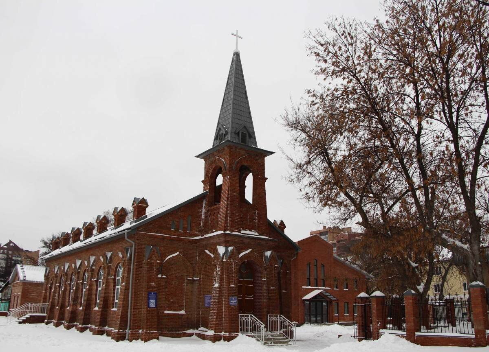
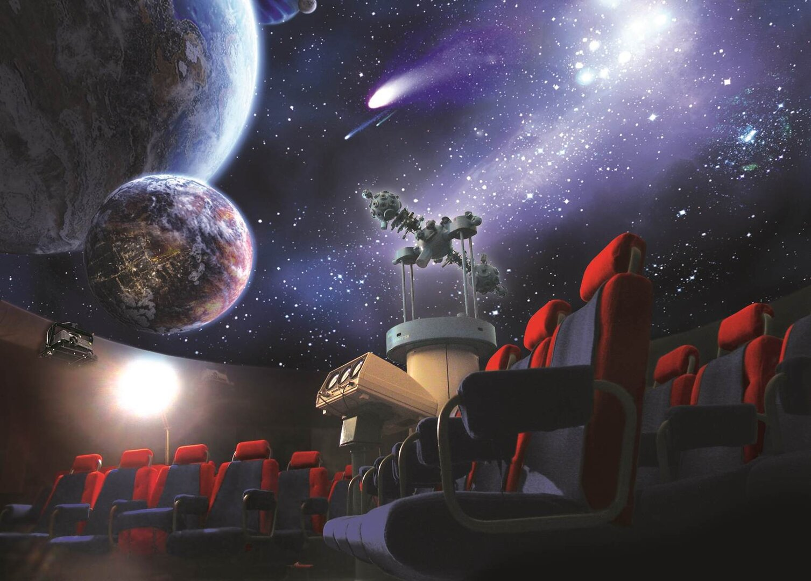
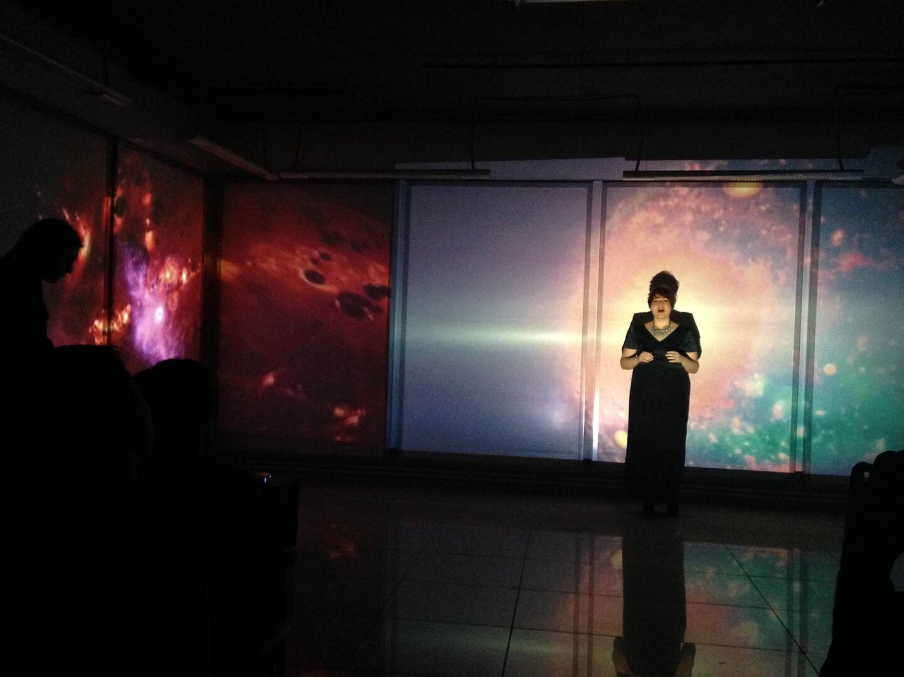
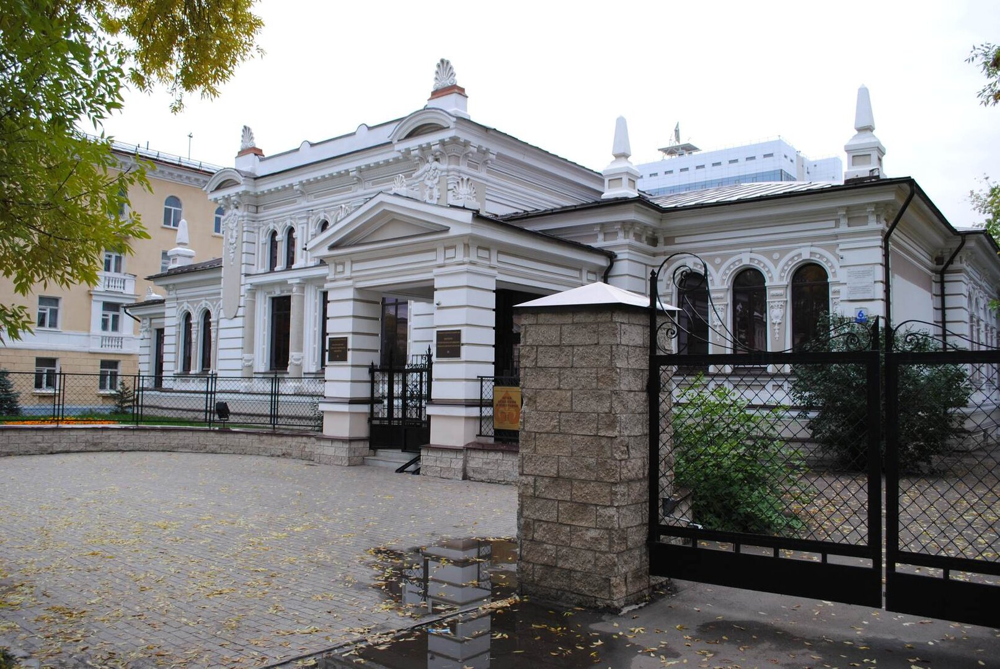
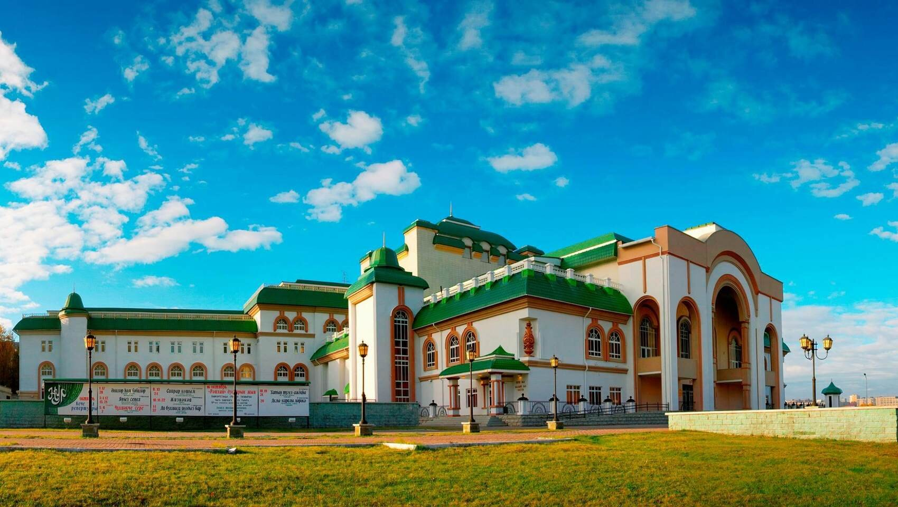
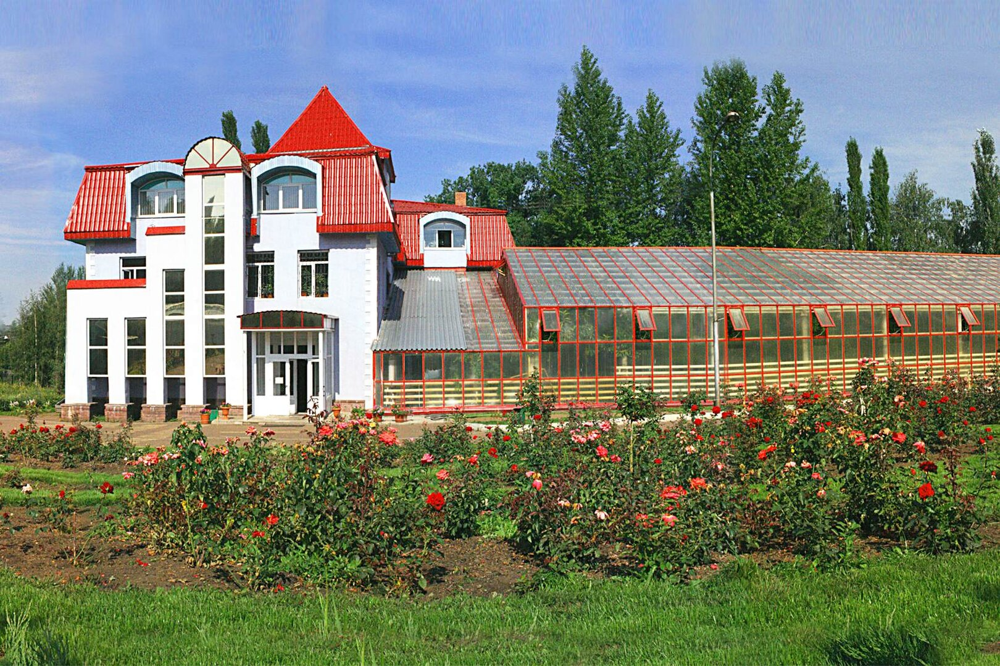
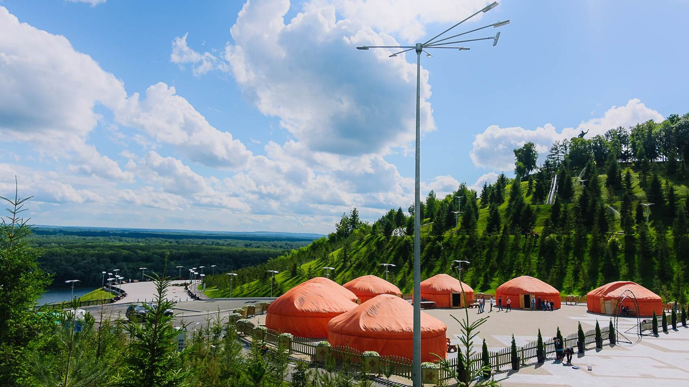
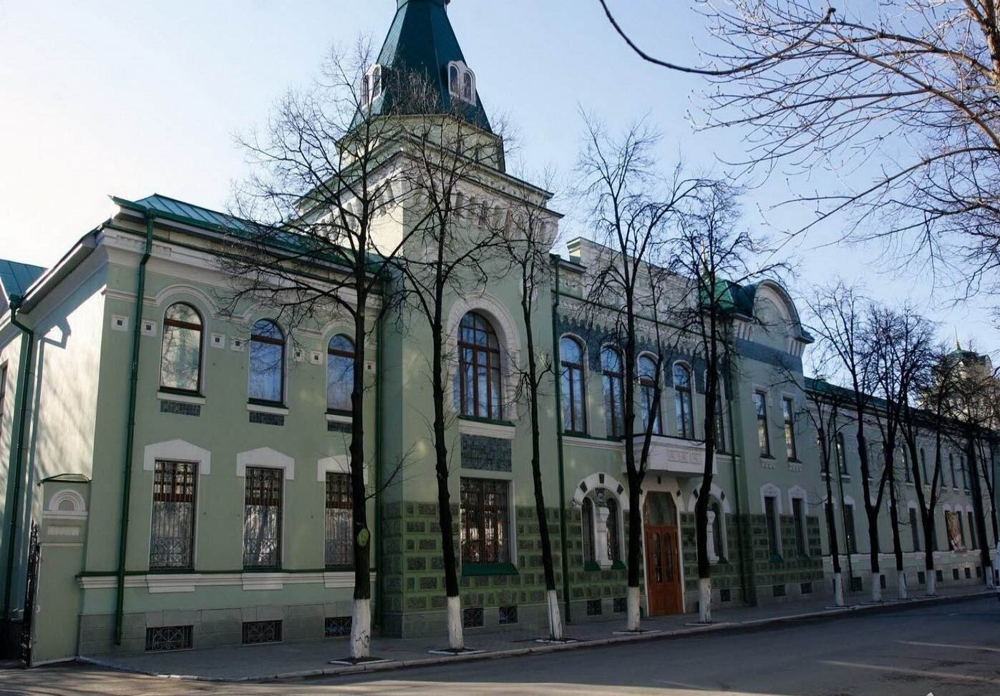
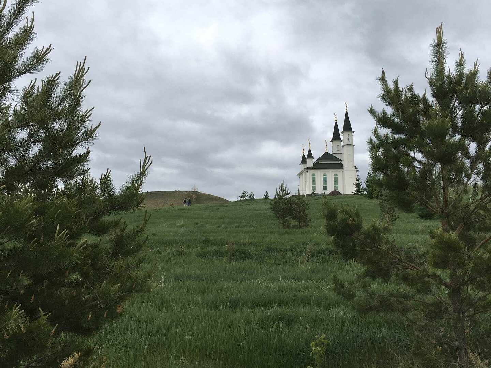

Великолепие природы Башкортостана поражает даже бывалого путешественника. Бесконечные горные цепи, нетронутые хвойные леса с реликтовыми травами, озера кристальной чистоты и стремительные реки, несущие свои воды вдоль отвесных скал.

Уфа — столица этого сказочного края. Название города переводится как «темная вода». Город-миллионник с самой низкой плотностью населения и единственный в России, в котором нет полностью пешеходной улицы.

Куда сходить в Уфе? Самые интересные места здесь!

<!--more-->

## №10. Евангелическо-Лютеранская церковь

[http://www.kirchufa.ru/](http://www.kirchufa.ru/)

Нет, я не предлагаю вам менять вероисповедание :) Просто среди городского пейзажа Уфы это здание в романском стиле выглядит очень необычно. К тому же, оно всецело отражает многонациональную историю города: более века назад сюда приходили молиться немцы, латыши и эстонцы. Служба велась на их родных языках.

К сожалению, в 1930-ом году городские власти передали церковь ремонтному заводу, и на следующие 70 лет она превратилась в склад. В 2000-ом ее вернули общине, начались восстановительные работы. Спустя время служба возобновилась.

Сегодня церковь используется по назначению, в ней проходят открытые чтения библии, слушают лекции и смотрят фильмы. Войти может каждый желающий. Уфимская община активно сотрудничает и с другими евангелическо-лютеранскими церквями страны.

**Цена:** бесплатно

## №9. Контактный зоопарк «Лесное посольство»

[http://ufa.lesnoeposolstvo.ru/](http://ufa.lesnoeposolstvo.ru/)

Находится на третьем этаже торгового центра, а потому открыт для посещений круглый год. Здесь поддерживается идеальная чистота, отсутствуют неприятные запахи, а животные выглядят ухоженными и довольными жизнью.

Сурикаты, страусы, дикобразы, карликовые свинки, черепахи, рыбы, змеи и ящерицы, пони, бурундуки (есть среди нас фанаты «Чипа и Дейла»?). Еду с собой не берите, кормить можно только тем, что продают в зоопарке (пакет со свежими овощами стоит 50 рублей).

Персонал «посольства» приветливый и может многое рассказать о своих подопечных, если вы поинтересуетесь. Отличное место для похода с детьми, где ребенок научится любить природу и с уважением относиться к ее обитателям.

Из минусов: по выходным, когда посетителей много, тут бывает душновато.

**Цена:** 200 руб.

## №8. Планетарий

[http://ufaplanetarium.ru/](http://ufaplanetarium.ru/)

Еще одно место, куда в Уфе сходить стоит обязательно. А причин сразу несколько: во-первых, в планетарии очень много программ совершенно разного формата. Вы точно найдете то, что вам понравится (детальнее на сайте).

Во-вторых, уникальный проектор. В 2014 году в планетарии появилось очень качественное оборудование для проекции на весь купол. В таком формате фильмы про космос смотрятся впечатляюще. Я рекомендую выбрать короткую программу на 20-30 минут, потому как за час шея устает.

В-третьих, уфимский планетарий — это еще и точка социальной жизни города. Здесь проводят лекции, конкурсы, праздники. Да и находится планетарий рядом с парком аттракционов, где можно погулять и отдохнуть.

Интересный факт: на пятидесятилетие планетарий запустил стратосферный зонд с исследовательским оборудованием. Полет был записан на камеры, установленные на платформе зонда. Запись полета можно посмотреть [здесь](https://www.youtube.com/watch?v=qePuP0p0zO4).

**Цена:** 120 - 200 руб. (в зависимости от программы)

## №7. Центр современного искусства «Облака»

[http://artoblaka.ru/](http://artoblaka.ru/)

Находится на цокольном этаже ТРК Иремель. Центр гордится тем, что собрал у себя все виды искусства, включая музыку и театр. Более того, в центре есть квест-комната, студия звукозаписи, студия шитья, антикварный магазин и зона буккроссинга (место обмена книгами). Периодически проводятся танцевальные вечера. Думаю, здесь вы точно найдете что-то интересное для себя. Значительную часть экспонатов можно приобрести.

В «Облаках» стараются поддерживать творческих людей и предоставляют им свои площадки. Выставки часто меняются, что сохраняет высокий интерес уфимцев к галерее. Кроме того, центр «Облака» работает над созданием единого электронного каталога всех произведений искусства России.

Отдохнуть, перекусить и обсудить идеи можно в кафе при центре.

PS: Исследую карту Уфы, я обнаружил довольно своеобразное проявление современного искусства — какие-то неизвестные «хакеры» назвали Музей леса именем современной популярной исполнительницы. Ссылка [здесь](https://goo.gl/maps/5QPBWkhJs1D2).

**Цена:** Бесплатно

## №6. Музей археологии и этнографии УНЦ РАН

[http://www.museum.ru/m2089](http://www.museum.ru/m2089)

Сегодня располагается в красивейшем здании Уфы — в особняке Поносовой-Молло. Это первое здание в городе, построенное в стиле «модерн».

Посещение возможно только в составе экскурсионной группы от 10 человек, так что необходимо предварительно позвонить в администрацию и присоединиться к какой-либо группе.

Все потому, что музей является первым и единственным в республике академическим музеем. Это значит, что экскурсии здесь проводят научные сотрудники, суббота и воскресенье выходной, а администрация к посетителям относится довольно сухо и иногда строго.

В музее есть 4 постоянные экспозиции: Археология Южного Урала, Сарматское золото, Народы Башкортостана, Мир башкирской культуры. Все в традициях лучших краеведческих музеев, а из необычного — скелет мамонта, кость носорога (найдена в Башкортостане), костяные псалии, древние надгробия и детальная экспозиция о зарождении и развитии рыболовства.

Если вдруг по каким-то причинам у вас не выйдет посетить этот музей, то есть запасной вариант — Национальный музей Башкортостана (в нашем списке «Куда сходить в Уфе» он идет предпоследним).

**Цена:** 200 руб.

## №5. Уфимский Государственный театр «Нур»

[http://teatrnur.ru/](http://teatrnur.ru/)

Особенность театра в том, что спектакли здесь ставят на татарском и башкирском языках, а перевод на русский транслируется через наушники в зал. Такие постановки — отличный способ познакомиться с культурой уфимцев и их самобытной театральной школой.

«Нур» вырос из небольшой творческой группы молодых людей (1912 год), которой руководила талантливая 19-летняя девушка, Сахипжамал Гиззатуллина-Волжская. Сегодня же театр насчитывает десятки народных артистов федерации и заслуженных артистов республики. В репертуаре более 20-и спектаклей (башкирские и российские авторы, мировая классика), число их постоянно растет.

Театр занимает одно из красивейших зданий Уфы, строительство которого велось более десяти лет. Это массивный дворец, сочетающий в себе византийский, индийский и татарский архитектурные стили. Сложная конструкция из крыш, башен и переходов завораживает. «Нур» находится в центре, так что посетить его стоит даже в том случае, если на спектакль идти вы не собираетесь.

Из минусов: гости жалуются на невзрачный буфет и недоброжелательность кассиров по телефону. Электронный билет, купленный через интернет, все равно приходится менять в кассе (в порядке очереди).

**Цена:** 150-500 руб.

## №4. Уфимский ботанический сад

[уфаботсад.рф](уфаботсад.рф)

Куда сходить в Уфе любителям природы, как не в ботанический сад. Тем более что здесь он отличный. Большая территория в 23 гектара (это как 30 футбольных полей), интересный ландшафтный дизайн, целых полторы тысячи видов декоративных, лекарственных и редких растений. Есть сиреневый сад и тропическая оранжерея. Чистые дорожки, ухоженные клумбы, уютные аллеи, умиротворяющая атмосфера.

Кроме сохранения имеющегося зеленого фонда, ботанический сад работает над выведением новых видов. Названия им придумывают сами уфимцы (выбор проходит через конкурс на лучший вариант). Здесь проводят курсы по садоводству, устраивают выставки кактусов, цветущих фиалок и тому подобное.

**Цена:** 75 руб. детский, 150 руб. взрослый

## №3. Этнический парк Ватан

[http://parkvatan.ru/](http://parkvatan.ru/)

Создан в 2015 году для иностранных гостей саммитов БРИКС и ШОС. Парк состоит из семи больших палаток, в которых посетителей знакомят с культурой и историей региона. Традиционные ремесла, народное искусство, библиотека, закуски, продажа башкирского меда и сувениров. Здесь проводят городские праздники и концерты.

Место выбрано неслучайно: совсем рядом находится памятник национальному герою Салавату Юлаеву, поэту и защитнику крестьян. К тому же, с площадки парка открывается живописный вид на реку Белая и окрестности Уфы.

Парк работает до 21:00 ежедневно, а зимой уходит на каникулы. Когда выпадает снег, на склонах парка сооружают горки.

**Цена:** бесплатно

## №2. Национальный музей республики Башкортостан

[http://museumrb.ru/](http://museumrb.ru/)

Находится в историческом здании позапрошлого века и занимает все три этажа. Экспозиция музея столь интересна и обширна, что посетители проводят здесь по 2-4 часа.

Искуснейшая резьба по камню, аквариум с живыми рыбами местной фауны, диорамы исторических событий, быт древних поселений и предметы обихода, коллекция оружия, экспозиция редких минералов и полезных ископаемых, история региона в советскую эпоху. В музее даже есть зал, стилизованный под пещеру (под Уфой около 20 пещер, но для посещения они закрыты).

Здесь очень приветливый персонал и интересные экскурсии. Недавно в музее провели ремонт и обновили залы.

**Цена:** 50 руб. — детский, 150 руб. — взрослый

## №1. Святые воды Нарыстау

Гора Нарыстау находится в 180 км от города, но я все равно включил ее в наш список «Куда сходить в Уфе». Слишком уж велико значение этого места в культуре региона.

Гора Нарыстау — святыня для мусульман края и всего мира, которые зовут ее «башкирской Меккой». Здесь вы встретите паломников со всех уголков нашей планеты, и поток их не прекращается круглый год.

На горе похоронены отец и сын — Зубаир и Абдурахман — которые в 7-м веке привезли в эти края ислам. Здесь же был похоронен Идукай, воевавший за свободу края с Золотой Ордой (14 век). Через сто лет после его похорон у подножия горы забил насыщенный серебром источник.

Мемориальный комплекс состоит из кованой юрты с могильным камнем, небольшой площадки со скамейкой, мечетью, источником и купелью (согласно ритуалы, верующие омываются в ней перед подъемом на гору). Многие верят в то, что вода лечит больные суставы, бесплодие и зависимости. Здесь красиво и умиротворяюще (лучше ехать не в выходной).

Общественным транспортом добираться сюда непросто, но какое паломничество проходит без тягот в пути? В поездку наденьте удобную обувь, возьмите еду и пустую тару для воды из источника. Помните, что в мечеть нельзя заходить в открытой одежде и с непокрытой головой.

**Цена:** Бесплатно
