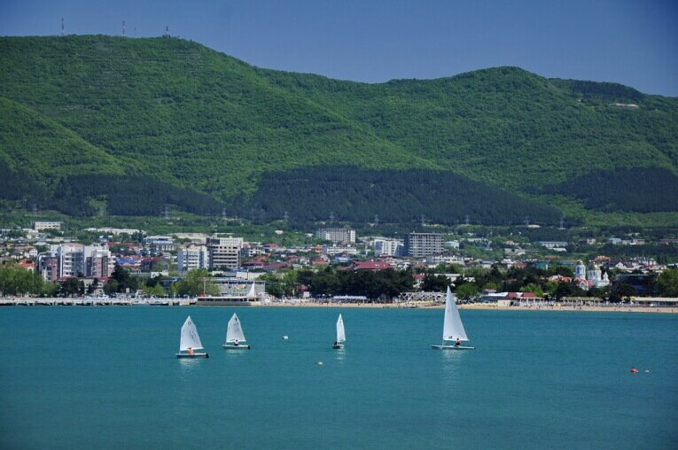
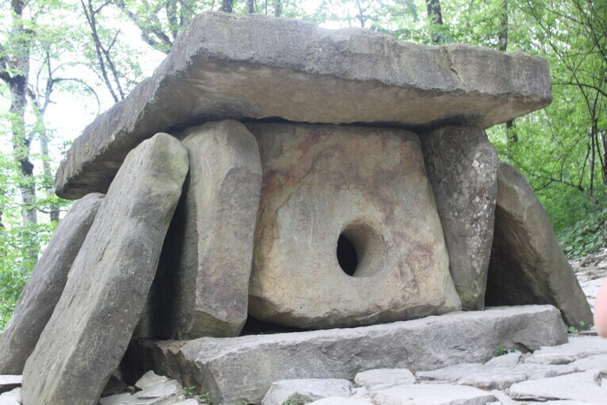
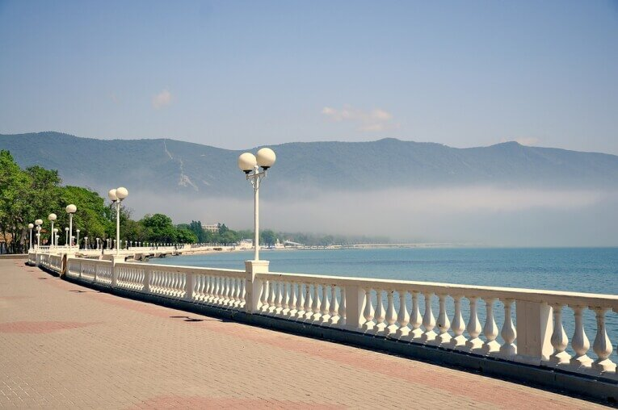
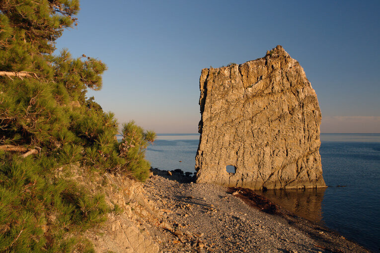
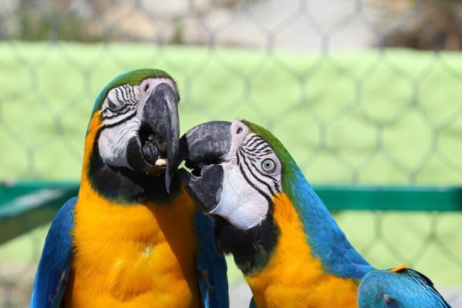
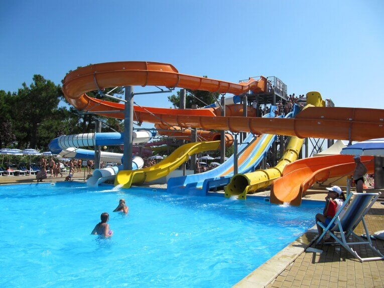

Ни для кого не секрет, что Геленджик – один из лидеров «альтернативных» Сочи курортов российского Причерноморья. Но для большинства гостей отдых здесь – это пляж, отель и гостевой домик – и всё. Наши туристы порой намеренно игнорируют возможности отдыха в Геленджике и его окрестностях. Кто-то по причине экономии средств, кто-то – по элементарному незнанию. Мы знаем 5 мест, куда обязательно стоит сходить в Геленджике.

<!--more-->

Итак, куда сходить в Геленджике во время вашего отпуска?

Посмотреть в Геленджике есть на что, хоть сам город не сравним с Сочи по площади и количеству достопримечательностей. Геленджик – приморский город-курорт России, имеющий многовековую историю и по-настоящему уникальные природные объекты, увидеть которые стоит хотя бы один раз.

## №1. Дольмены

В первую очередь в Геленджике стоит посмотреть **дольмены**. Легендарные сооружения, возраст которых насчитывает несколько тысяч лет, разбросаны вокруг Геленджика в 15-ти районах, но самые известные находятся у села Возрождение.

Популярная версия гласит, что эти каменные глыбы – не что иное, как место захоронений древнейших народов, проживавших здесь в эпоху, когда египетские пирамиды только-только начали возвышаться над африканскими пустынями.

Связаны с дольменами и легенды, что каждое каменное сооружение источает особую энергию, и в дни весеннего равноденствия здесь особенно много поклонников оккультных учений и теорий инопланетного вмешательства. К сожалению, такая популярность для некоторых дольменов привела к печальным последствиям – особо рьяные «исследователи» уже разрушили несколько крупных сооружений.

Это одно из тех мест, куда лучше сходить в Геленджике с опытным экскурсоводом, чтобы не заблудиться, и успеть осмотреть самые интересные образцы древнего каменного зодчества. Ведь каждый дольмен не только имеет свою форму, но и украшен рельефными узорами, которые могут быть похожими, но никогда не повторяются.

## №2. Набережная 

Уникальная в своём роде **Набережная Геленджика** – это визитная карточка города, обрамляющая живописную бухту, и являющаяся, по сути – отдельным районом, со своими бульварами, променадами и скверами. Долгое время она считалась самой протяжённой набережной в мире, но когда набережная Дубая тоже стала 14 км в длину, они оказались вдвоём на первом месте. Даже если вы приехали в город на один день, это одно из тех мест, куда сходить в Геленджике стоит непременно.

К набережной выходит одна из центральных улиц города – Лермонтовский бульвар, оформленная белоснежными воротами. Здесь же можно видеть и памятник поэту, посещавшему город, и посвятившему ему один из эпизодов своего романа «Герой нашего времени».

Вообще, на всём протяжении Набережной можно видеть множество памятников в стиле ростовой городской скульптуры. Здесь и памятник Невесте, и даже увековеченный в бронзе Кот Учёный из сказки Пушкина.

Кроме того, вдоль Набережной сосредоточена вся туристическая инфраструктура Геленджика – от лодочных пристаней до отелей и ресторанов.

## №3. Водопады и скала Парус

Куда точно стоит сходить в Геледжике в жаркий летний день, так это поближе к воде.

Из природных достопримечательностей Геленджика  чаще всего упоминаются многочисленные водопады, находящиеся в пригородной зоне. Для экскурсий и походов уровня «начинающего» туриста подойдут водопады на горе Гебиус, возле села Пшада и на реке Жане. Каждый водный каскад имеет своё «говорящее» название – **Пасть Дьявола**,**Шнурок**, **Изумрудный** – это самые посещаемые туристами места.

Но ни один водопад не имеет столько гостей, как знаменитая, благодаря отечественным фильмам и сериалам, **скала Парус** – огромная каменная глыба прямоугольной формы.

Происхождение памятника природы до сих пор неизвестно, как и неизвестно, сколько веков этот «парус» из нерушимого песчаника стоит в морской отмели в 17-ти км от Геленджика.

## №4. Парки и музеи

Ключевой рекреационной зоной города всеми обозревателями признаётся **Сафари-парк** Геленджика. По факту – это полноценный реабилитационный центр для львов, тигров, обезьян и птиц, привезённых сюда из цирков, фотосалонов и спасённых от браконьеров. Несколько крупных зон создают условия, чтобы звери смогли дожить свой век в сытости и спокойствии. Если вы любите посмотреть на животных, теперь вы знаете, куда стоит сходить в Геленджике.

Здесь же находится и **Морской музей**, чья коллекция посвящена древностям, поднятым со дна моря в близости к бухте Геленджика. Жемчужиной экспозиции считаются монеты древнегреческой чеканки, а также раритетные петербургские медали весом более килограмма.

Другой интересный уголок Сафари-парка – это **Медвежья пещера**. Так называют карстовую пещеру, где своими глазами можно увидеть десятки сталактитов и сталагмитов, освещённых, как настоящие музейные экспонаты.

Если смотреть на подводные находки и диких зверей желания нет, можно заглянуть в **Дельфинарий Геленджика**. Морские животные в этом водном парке развлечений в течение всего сезона устраивают зрелищные трюки, готовя со своими дрессировщиками новую программу, каждый год.

**Старый парк** в районе Кабардинки – это образец тематического парка с уменьшенными репликами мировых архитектурных достопримечательностей – от египетских пирамид и античных храмов до европейских соборов. Многих удивляет, но главным автором всех объектов является один человек – Александр Алексеев, в прошлом писатель и журналист, а ныне архитектор и скульптор. Пожалуй, хотя бы ради этого факта Старый парк обязателен к посещению.

В районе Набережной находится сразу две площадки, которые можно посетить между делом после пляжного отдыха или морских прогулок. Это **Художественный салон** и **Музей Восковых фигур**. Названия говорят сами за себя, а заходить или нет – уже право гостя. Оба выставочных зала периодически представляют весьма интересные инсталляции. 

Образец нетленной классики – **Историко-краеведческий музей** Геленджика. Она мало чем сможет отличиться от других подобных ему музеев, но, если интересна история города и края, то зайти стоит, пусть даже и без экскурсий.

А вот претендентом на звание самого оригинального музея можно назвать галерею современного искусства «**Белая Лошадь**». Находится он в районе Голубой Бухты, и с каждым годом это место становится всё популярнее у молодёжи и креативных людей разных возрастов. Все экспонаты музея – это переработанный мусор, чем авторы выставок хотят привлечь внимание к ситуации с экологией в регионе, но не агитацией, а таким вот экстравагантным способом.

## №5. АКВАПАРКИ

Кроме упомянутой Набережной с её инфраструктурой отдыха стоит сказать и о ключевых развлекательных зонах Геленджика – **аквапарках**.

Сегодня крупных зон водных развлечений в городе – три. Каждый из них предоставляет аттракционы, как для детей, так и для взрослых. Поэтому, любой гость Геленджика, посетивший аквапарки, будет доволен. Ну, а то, что по своим масштабам они не дотягивают до Сочи – это даже в плюс – гарантия более низких цен, чем в столице российского туризма.
