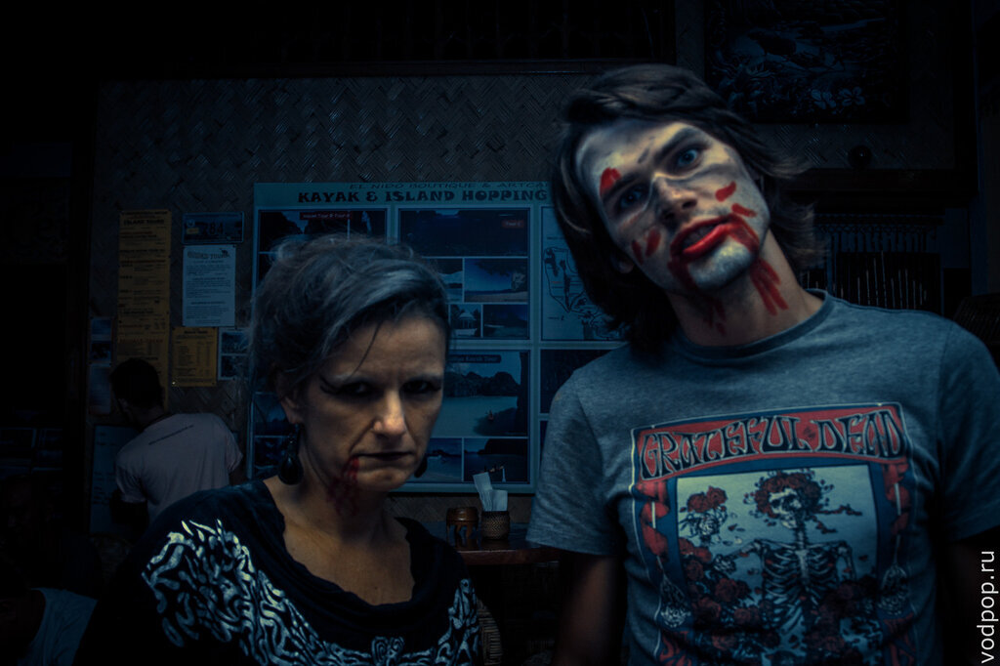
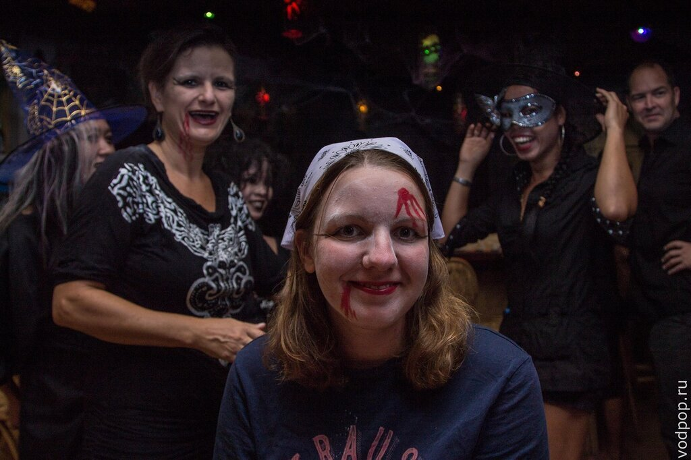
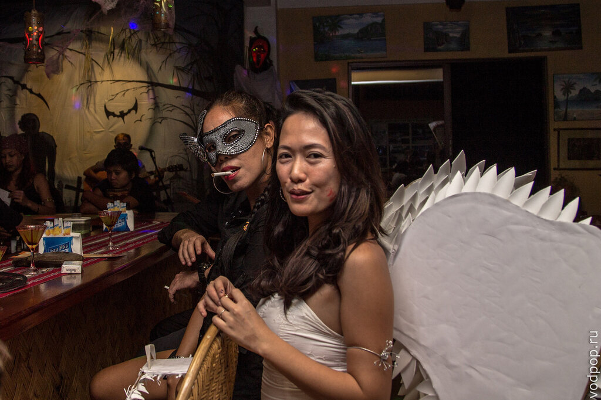
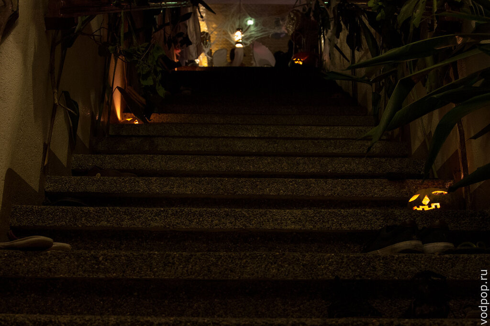
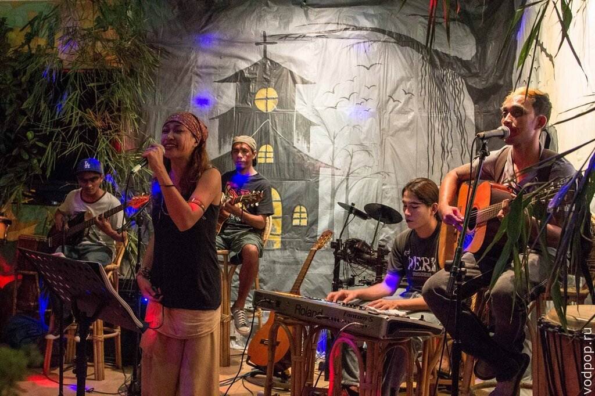
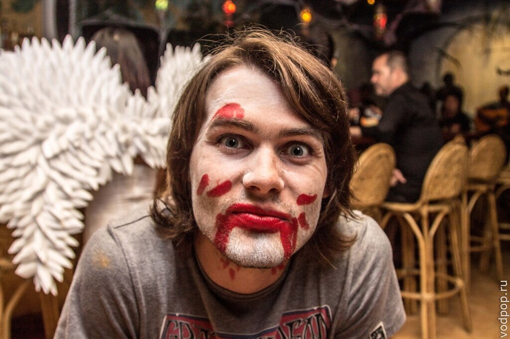
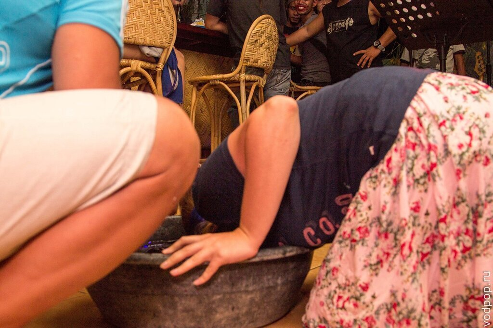
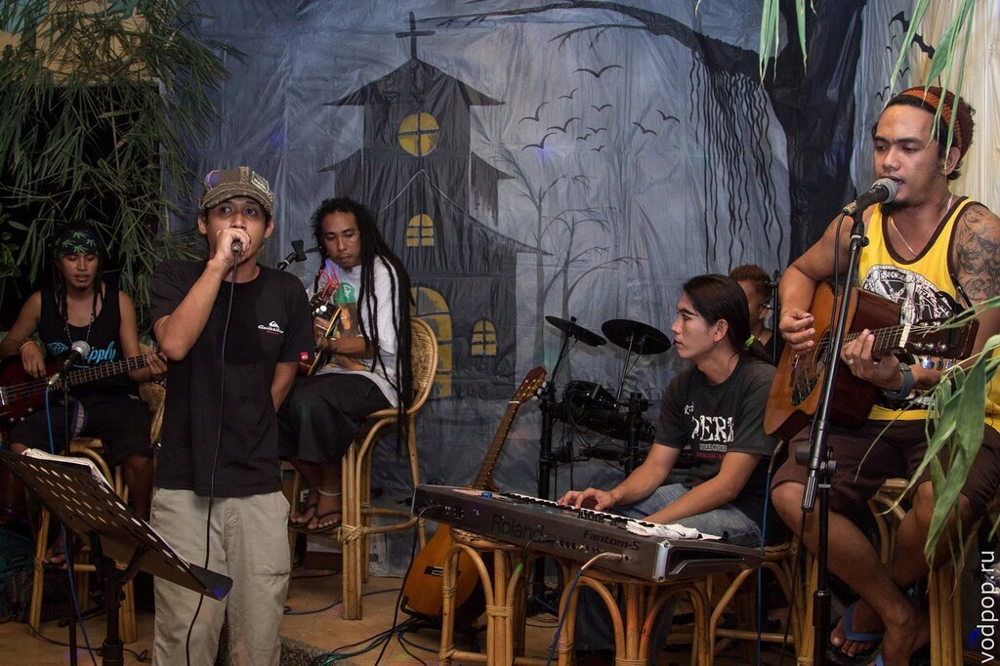

Арт Кафе - это культовое место в Эль Нидо, о котором рано или поздно узнают все путешественники, которые приехали в этот край. Мы не стали исключением, и в первый же день пришли сюда поужинать. Так случилось, что этот день оказался Хеллоуином, который мы никогда до этого не отмечали.

<!--more-->Полное название этого заведения - El Nido Boutique & Artcafe. Уроженка Швейцарии Джудит и симпатичный филиппинец Тани каким-то образом познакомились и решили открыть бизнес в Эль Нидо. На фотографии, которую Клим старательно прятал от меня (я не поймала фокус!), запечатлена Джудит, которая только-только закончила устрашающий макияж Климентия.

Изначально это был магазинчик по продаже футболок с оригинальным дизайном, затем к бизнесу добавились продажи туров на острова, и только после этого основатели решили не только одеть, но и накормить туристов. Так и появилось Арт Кафе.

Сейчас у них в штате работает почти 40 человек, и Арт Кафе является для многих отправной точкой для путешествия по острову. Здесь можно не только покушать, но и забронировать туры A, B, C, D на острова и лагуны [Эль Нидо](https://vodpop.ru/ostrova-el-nido/ "Острова Эль Нидо. Как мы ездили в тур А"), заказать билеты в Манилу, арендовать лодку, купить одежду, оборудование для снорклинга, сувениры и предметы первой необходимости.

Мы, кажется, разгадали причину успеха их бизнеса. Они все делают сами. Джудит встретила нас и сразу же посадила за столик, чтобы сделать каждому макияж.

Тани вообще не попал в наш кадр, потому что он все время бегал между столиками, что-то двигал, вытирал полы после праздничных конкурсов с напитками.

Официанты выглядели не менее стильно. Все были в черных одеяниях, с масками, колдовскими шляпами и ярким макияжем. Некоторые гости приготовились заранее и пришли в костюмах.

На лестнице были расставлены маленькие тыквочки со свечками. Кстати, в кафе принято разуваться и ходить босиком, чтобы не тащить с улицы песок. Шлепки аккуратно стоят по бокам.

Мы, как оказалось, пришли к началу вечеринки, и даже смогли выбрать столик поближе к сцене, чтобы послушать музыку. Потом просто негде было яблоку упасть - люди набились под завязку. А мы наслаждались потрясающими филиппинскими музыкантами.

Красочно расписанный Климентий был невероятно спокоен.

Нравится статья? Узнавайте первым о выходе новых интересных историй! Подпишитесь на нас по [эл. почте](http://feedburner.google.com/fb/a/mailverify?uri=vodpop&loc=ru_RU) или в [группе ВКонтаке](http://vk.com/vodpop)

А мне хотелось веселья, поэтому я пошла участвовать в конкурсе под названием "вытащи все яблоки ртом из тазика  с завязанными глазами"

Вообще я считаю подобные конкурсы глупыми, но почему-то в этот вечер очень хотелось чего-то такого. Это все от усталости после [дороги и выбора отеля.](https://vodpop.ru/kak-dobratsa-do-el-nido/ "Как добраться до Эль Нидо")

За этот вечер в Арт Кафе мы послушали американский рок, регги, филиппинскую популярную музыку и восторгались умению филиппинцев владеть своим голосом и музыкальными инструментами.

Филиппинцы - самая музыкальная нация их всех, с которыми мы знакомы. А караоке-бары по вечерам \- это самые популярные и забитые людьми места. Причем поют они превосходно, не имея никакого специального образования. Наверное, потому, что делают это везде - кассиры, пока никого нет, подпевают музыке в зале, дети поют, играя в лужах, трайсиклисты что-то мурлычат себе под нос под шум двигателя. 

Поэтому, несмотря на то, что Хеллоуин, он же День всех Святых, в моих глазах более чем надуманный праздник, созданный маркетологами для продвижения никому ненужных в оставшиеся 364 дня в году вещей, мы здорово провели время, послушали хорошую музыку, съели вкусную пиццу, и счастливые и довольные поехали отсыпаться в свой отель.

###### Полезное

- Официальный сайт Арт Кафе [http://elnidoboutiqueandartcafe.com/](http://elnidoboutiqueandartcafe.com/) Тут можно посмотреть все услуги и активити, которыми можно заняться в Эль Нидо. А еще на сайте есть супер-полезный список гостиниц, резортов, гестов и отелей в Эль Нидо и Корон Короне ( смотреть [тут](http://elnidoboutiqueandartcafe.com/faq.html))
- Почта, по которой можно узнать про авиа-билеты, паромы, лодки до Эль Нидо и другую полезную информацию: elnidoboutique@yahoo.com
- Список услуг (неполный): аренда каяков, велосипедов, оборудования для снорклинга, мотоциклов, паддл-боттлов (лодка, на которой 1 человек гребет стоя), покупка и бронь авии-билетов, бронь гостиниц, заказ трансфера до [Пуэрто-Принцессы](https://vodpop.ru/chem-zanatsa-v-puerto-princesse/ "Чем заняться в Пуэрто-Принцессе: Хонда Бэй, гостиницы и рестораны"), обмен валют, звонки за границу, доступ в интернет (есть бесплатный вай-фай, но он почти всегда не работает), покупка туров на острова и лагуны.

Эль Нидо на карте

