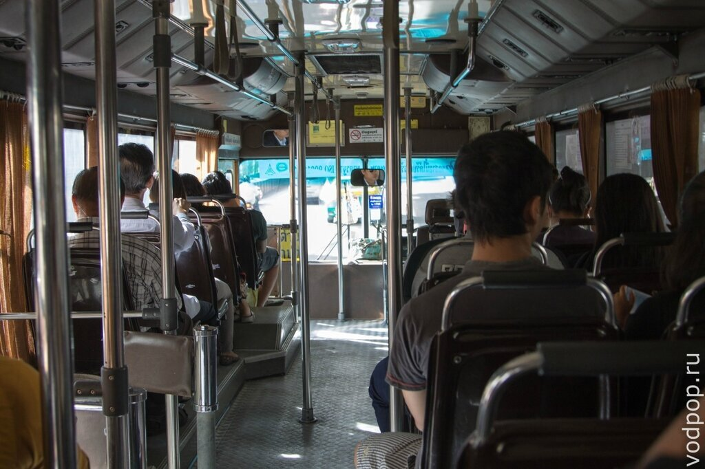
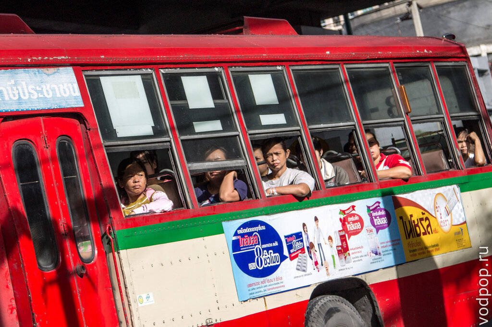
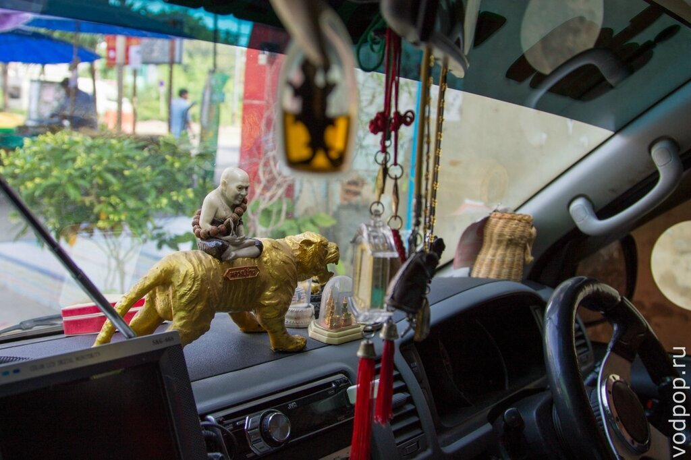
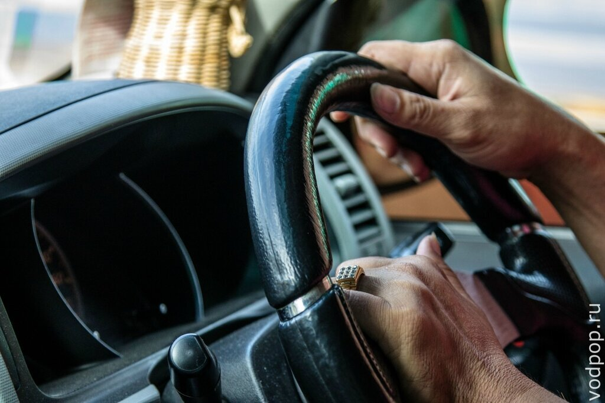

Автобусы в Бангкоке хороши тем, что они дешевле, чем метро и такси, а их маршруты пролегают во всех районах города, включая те, где метро еще не построили. Так получилось, что мы мало пользовались автобусами в Бангкоке, но все же разобрались в этой системе.

<!--more-->

Читайте наши заметки о других видах общественного транспорта в Бангкоке:

[Такси, мото-такси и тук-туки](https://vodpop.ru/taxi-v-bangkoke/ "Такси в Бангкоке")

[Метро](https://vodpop.ru/metro-v-bangkoke/ "Метро в Бангкоке")

[Лодки](https://vodpop.ru/lodki-v-bangkoke/ "Лодки в Бангкоке (Khlong boats)")

 

Схему передвижения общественного транспорта можно взять бесплатно в аэропорту на стойках информации, либо в городе в информационных центрах "tourist info". Если вдруг забыли это сделать, то можно зайти в книжный и купить карту транспорта Бангкока.

Если вы хорошо умеете пользоваться бумажными картами или планируете свое путешествие заранее  - это хороший вариант сэкономить и почувствовать колорит города. Мы обычно смотрим [https://maps.google.ru/](https://maps.google.ru/), который показывает, где ближайшая остановка и какой автобус нам нужен. Особенно удобно пользоваться [мобильным приложением](https://itunes.apple.com/th/app/google-maps/id585027354?mt=8) с местной симкой с интернетом. Словом, все то же самое, что и в России. Тайцы очень доброжелательные, поэтому даже если вы заблудитесь, вам обязательно постараются помочь. Так, когда мы ехали на автобусе в парк-музей "Древний город", тайский школьник, сидящий перед нами, поинтересовался нашим маршрутом и показал, на какой остановке нам нужно пересесть на маршрутку, чтобы доехать быстрее. Потом даже проводил нас до остановки маршруток и сказал водителю, куда нас нужно довезти.

Мы, прожив несколько лет в Москве, все ждали подставы, но парень ничего не требовал взамен. После этого к нам часто подходили на улице и пытались чем-то помочь, даже когда мы просто останавливались, чтобы посмотреть на карту. Здесь это норма. Сложно привыкнуть к тому, что вокруг всех хотят тебе помочь.

Но если вы не хотите рассчитывать на помощь тайцев, то на этом сайте [http://www.bmta.co.th/en/travel.php](http://www.bmta.co.th/en/travel.php) вы можете посмотреть все автобусные маршруты, спланировать свое перемещение, а также посмотреть, какие автобусы ходят рядом с главными достопримечательностями Бангкока.

Цены варьируются от 7 до 24 бат, в зависимости от многих параметров: типа и размера автобуса (с кондиционером/без, большой/маленький и т.п.), расстояния, государственная  компания или частная. В любом случае это будет небольшая сумма, которая будет заметно ниже стоимости проезда в России.

Посмотреть тарифы, карты и другую полезную информацию об автобусах можно на сайте [http://www.transitbangkok.com/bangkok\_buses.html](http://www.transitbangkok.com/bangkok_buses.html)

Кстати говоря, по многим маршрутам в Бангкоке курсируют бесплатные автобусы каждые 1-1,5 часа. Чаще всего это старые автобусы красного цвета, весьма старенькие, но вполне себе работоспособные.

Автобусы без кондиционера обычно ездят с открытыми дверцами. Тайцы этим пользуются, запрыгивая и спрыгивая на ходу.

Но иногда, при сильно оживленном движении, водители все же закрывают двери.

Нравится статья? Узнавайте первым о выходе новых интересных историй! Подпишитесь на нас по [эл. почте](http://feedburner.google.com/fb/a/mailverify?uri=vodpop&loc=ru_RU) или в [группе ВКонтаке](http://vk.com/vodpop)

Автобусное сообщение в Бангкоке круглосуточное, но большая часть маршрутов работает с 5 утра до 23. Узнать о ночных автобусах можно [тут](http://www.transitbangkok.com/bangkok_buses.html).

Маршрутки это еще один вид транспорта, в котором удобно знакомиться с местным населением. Если поехать на переднем сиденье, то можно понаблюдать за водителем.

Они не включают поворотники при перестроении и очень часто сигналят - у них звуковой сигнал носит другой смысловой оттенок, нежели у нас. Здесь таким образом предупреждают о своем присутствии на дороге. Поэтому одна рука тайского водителя почти всегда лежит на сигнале.

