Давненько мы не ездили автостопом, и когда к нам приехали наши друзья - Даша и Владимир, мы решили, что самое время вспомнить, как это делается, и проехать автостопом из Таиланда в Малайзию.

<!--more-->

Мы, как всегда, решили встать рано утром - как обычно, проспали. С нами это случается постоянно, например [в поездке в Норвегию](https://vodpop.ru/moskva-norvegija-na-mashine/ "В Норвегию на машине. Часть 2. Начало пути") мы просыпали каждое второе утро. Собрав рюкзаки, мы решили поехать на завтрак в ближайший Теско.

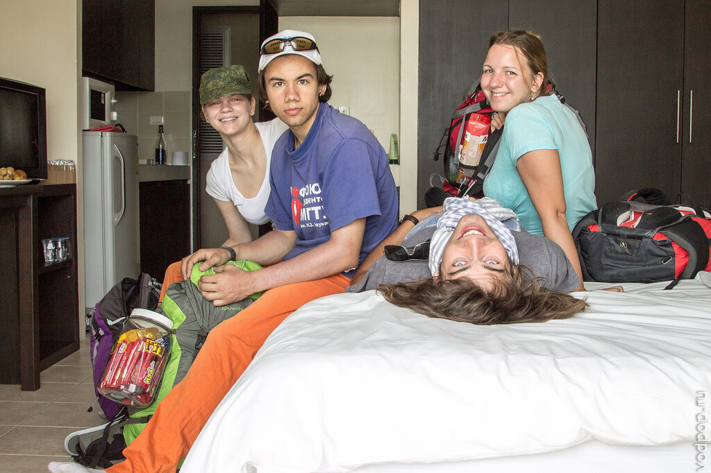

И все было бы отлично, если бы не случайное падение половины нашего боевого состава. Было решено, что сегодня мы поедем на автобусе до Транга, а оттуда уже автостопом. Сказано - сделано. Поймав машину до автобусного терминала №2 в Пхукет-тауне, мы сели в автобус и покатили в сторону Транга, активно смотря по сторонам - природа даже из окошка приводила нас в восторг.

Уже стемнело, когда мы добрались до Транга. Мы были настолько голодные, что пошли в первую же кафешку - восполнять запас калорий и витаминов.

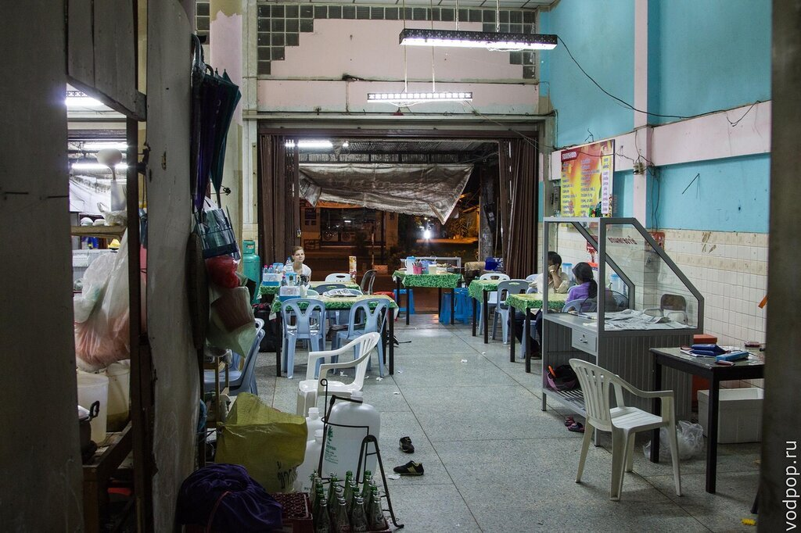Кстати, в дороге нам обычно помогает это делать волшебная банка с печеньками. И ее верный хранитель - Владимир

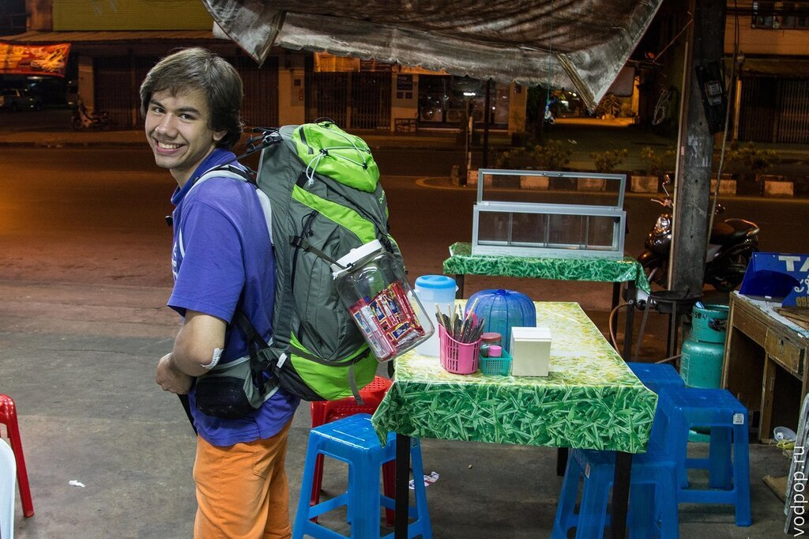

Еще в автобусе мы забронировали гестхаус и решили прогуляться до него пешком - размять конечности после долгой дороги. Когда мы наконец пришли туда, выяснилось, что мест в нем нет. За нами приехала хозяйка на джипе и отвезла в другой гест, где мы после теплого душа начали смотреть церемонию открытия Олимпийских Игр в Сочи.

Следующее утро началось бодро - быстрый завтрак в гестхаусе и пешая прогулка за пределы города

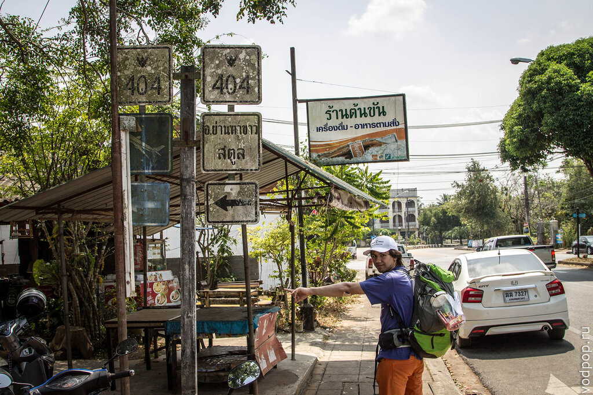

В автостопе не без приключений - так как  самая популярная машина в Таиланде - пикап, то мы ехали почти все время именно в них, в открытом кузове сзади.

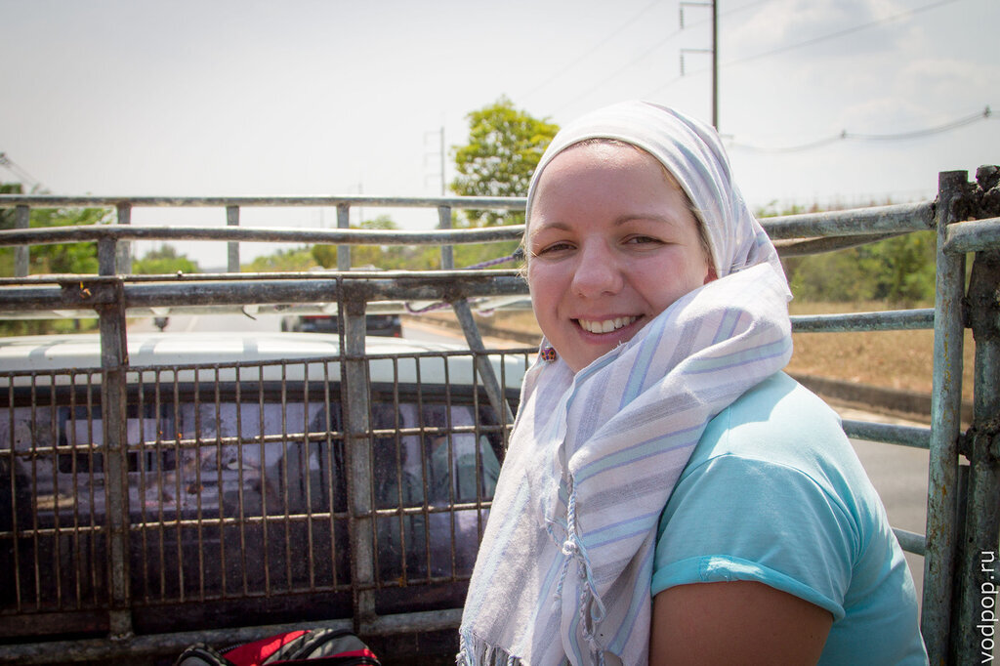

Мы с Климом привыкли к нашим кромам (универсальным х\\б-платкам из Камбоджи), а Владимир спасался от солнца белой кепкой, которая на скорости 80 км/ч решила улететь с его головы. Пришлось останавливать водителя и бежать по шоссе обратно.

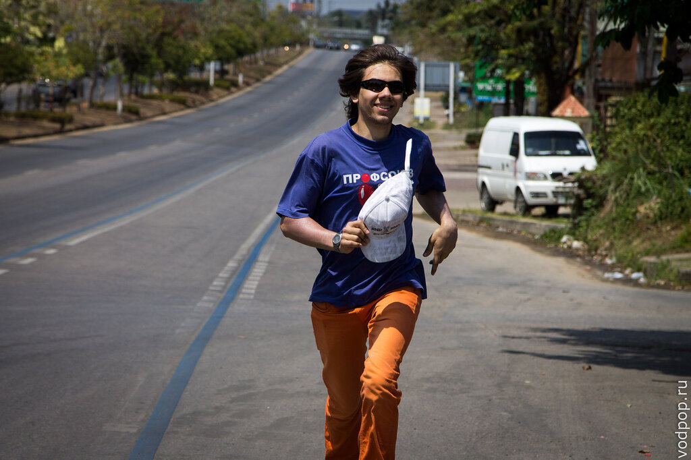

На следующей смене машин мы поняли, что жутко обгораем на солнце. Учимся завязывать платки

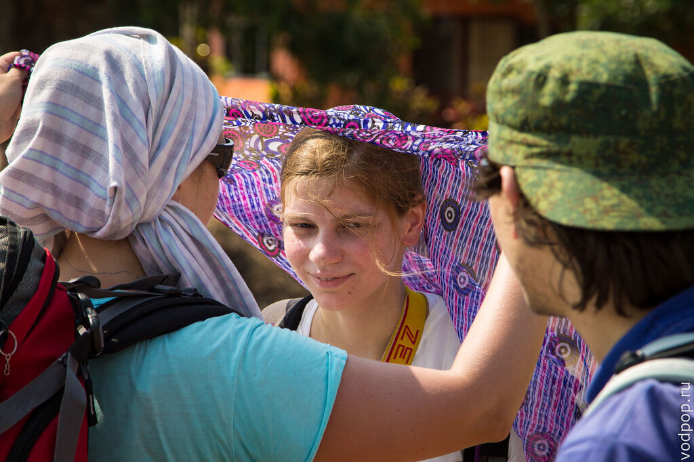

Пока не получается что-то похожее на хиджаб. Хотя, это не совсем верный термин, так как хиджаб - это в буквальном переводе "барьер", который относится как к одежде, так и к поведению женщин в Исламе. Кстати, чем ближе к границе Малайзии, тем больше исламских деревень встречалось нам по пути. На крайней машине в тот день нас подвозила мусульманская семья - очень добрые и отзывчивые люди, у которых две маленьких дочки. Одна из них на фотографии.

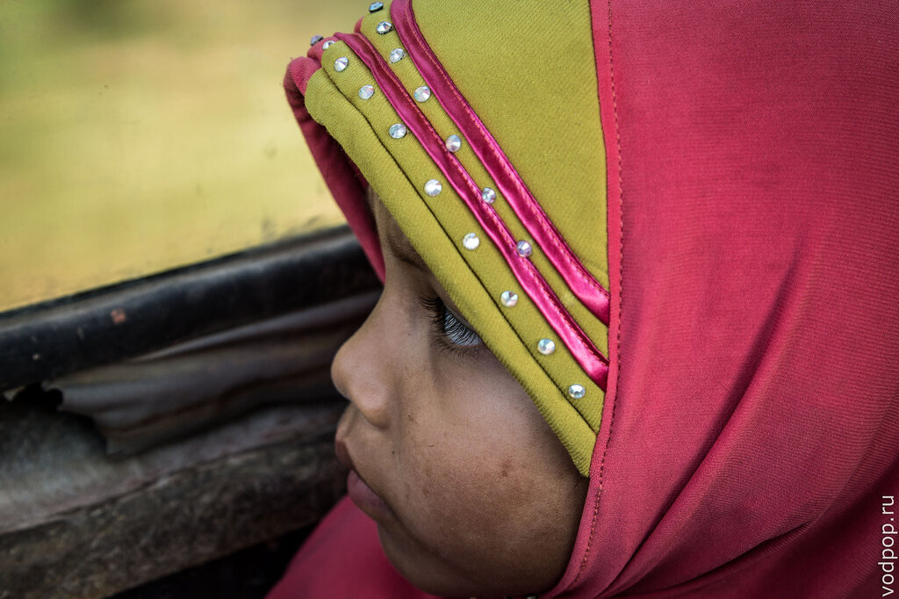

Кроме них нам еще очень запомнился солнечный, добрый дядечка-водитель грузовика, который, казалось, сиял изнутри. Особенно когда примерял очки Владимира.

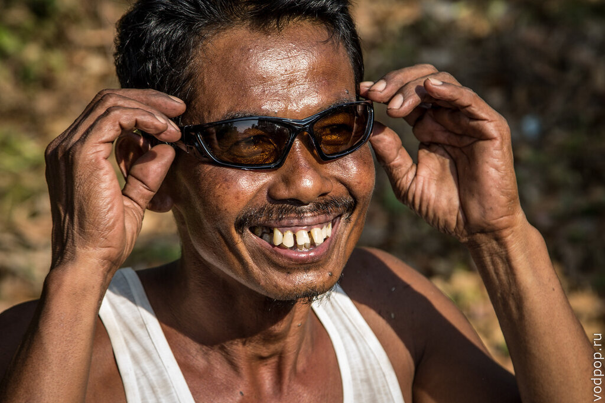

В задней части его грузовика были бетонные кольца, среди которых мы расположились почти с комфортом

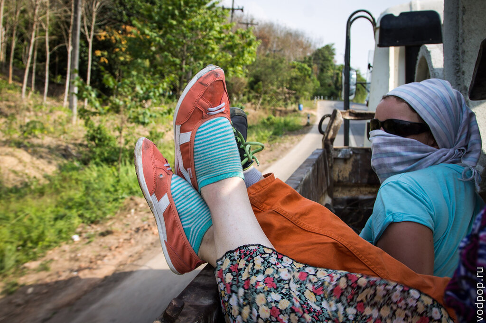

Увы, мы совсем немного не успели доехать до пограничного пункта, который закрывался в 18.00. Пришлось остановиться переночевать в нескольких километрах, куда нас привезла та самая мусульманская семья. Они были очень добрые - даже предлагали заехать за нами с утра и довезти до границы, но мы отказывались всеми возможными способами и благодарили их за доброту, пока они наконец не сдались.

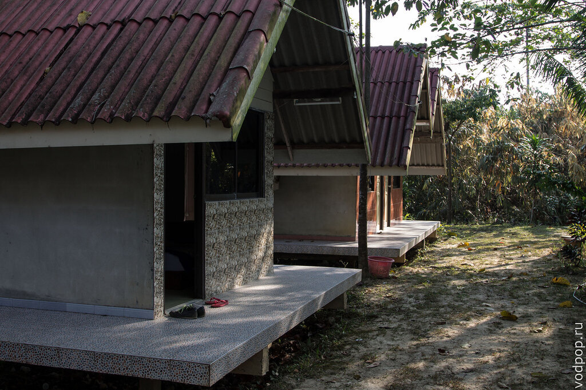

После того, как мы "заселились" в домики по 500 бат, то есть кинули наши рюкзаки и помылись под потоком ледяной воды, резко захотелось ужинать.

К слову, мы жили у хозяина одного из нескольких магазинов в округе, но у него были только чипсы и лапша быстрого приготовления - после дня автостопа хотелось чего-то более полезного и питательного.

На наши просьбы арендовать нам байк, чтобы съездить в ближайшую кафешку, он ответил отказом, так как уже стемнело, а этот район - один из самых небезопасных в Таиланде. Здесь  за последние пять лет погибли около 3700 человек и около десяти тысяч получили ранения. Все из-за взрывов, которые устраивают радикальные исламские организации, выступающие за независимость провинций Яла, Паттани и Наратхиват от Таиланда. Последний взрыв был совсем недавно - 2 февраля 2014, поэтому всем, кто собирается в этот район, будьте аккуратны.

Взрывают в основном днем, а ночью грабят, угрожая оружием, пока ты не отдашь им все ценное, но оставляют в живых.  Один из гостей нашего хозяина - учитель китайского языка в частной школе, согласился за подвезти Клима на байке до местного кафе, где он взял на всех по порции фрайдрайсчикен. Учитывая размер порций, можно было смело брать одну тарелку на двоих - у нас осталось на завтрак больше половины.

Забавный момент связан с заказом еды - Климентий попросил fried rice pork - жареный рис со свининой, на что тихий голос учителя китайского прошептал сзади: "Это мусульманская деревня!", а продавец в кафе рассмеялся.

Следующим утром мы решили пересечь границу Wangprachan с Малайзией и проехать до Джорджтауна.

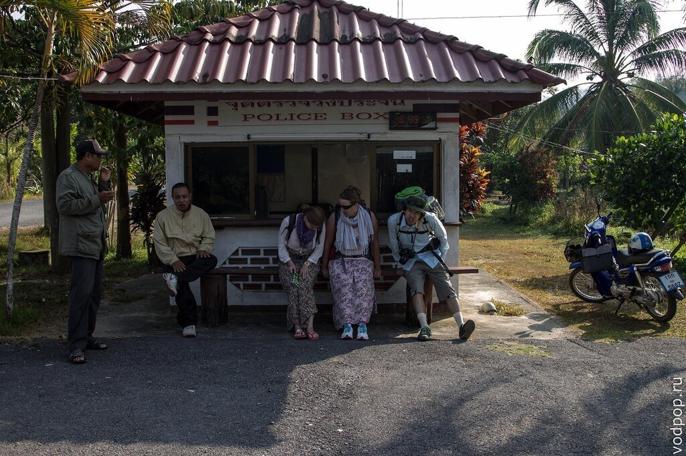

Приграничный  хаос рынок очень похож на любой другой рынок Таиланда, разве что здесь куда больше подделок известных брендов - очки, сумки, часы. По ценам от 100 до 500 бат. Мне лично очень понравилось качество очков - кажется, это тот самый "левак", который производится в ночную смену.

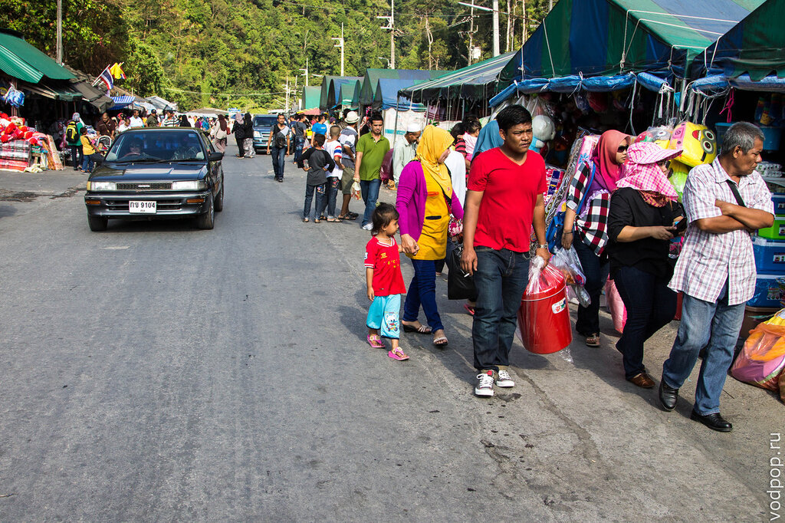

На границе мы - единственные белые, хотя в тот же день ее точно пересекал велосипедист, с которыми мы познакомились на ночевке - он на велосипеде проехал от Испании до Азии и пока не собирается останавливаться

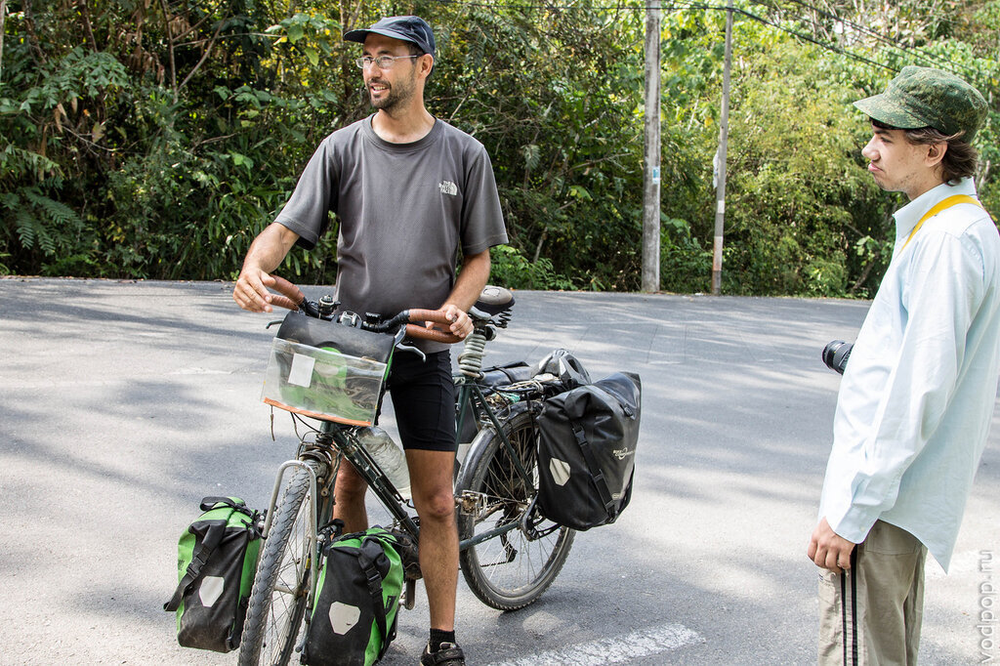

Граница организована плохо - ее можно пройти насквозь вообще без отметок в паспорте, поэтому все окошки на выход и на вход нужно внимательно искать самим.

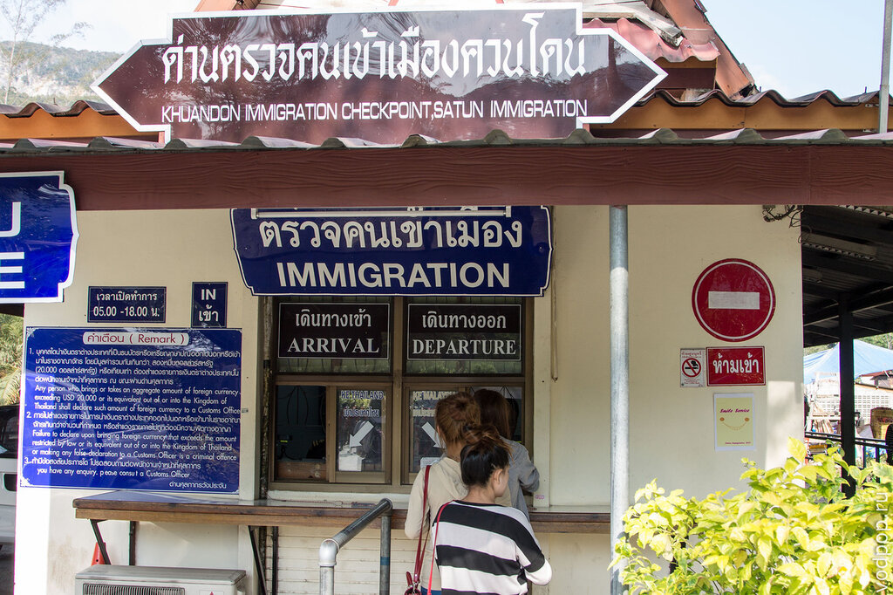

Поток туристов из Таиланда в большинстве своем ездит через границу рядом с Хатьйяем, поэтому про этот пограничный пункт информации крайне мало. Разве что режим работы - с 7.00 до 18.00, и, пожалуй, все.

Очередей нет, такое ощущение, что мы единственные стояли на получение штампиков, а все остальные просто ходили беспрепятственно туда-сюда

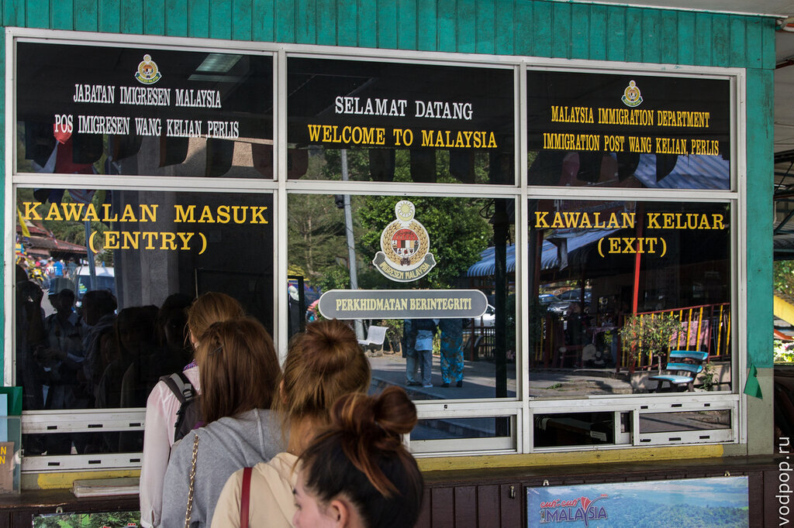

Тут даже есть duty-free, но мы в него заходить не стали

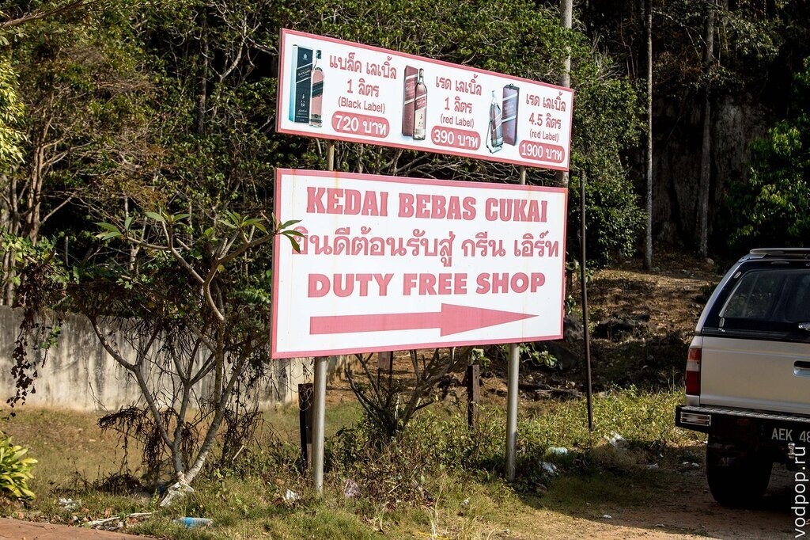

Уехать от границы было сложно - в Малайзии меньше пикапов, плюс от границы все машины ехали заполненные от пола до потолка любо людьми, либо вещами. Плюс, как мы поняли уже потом, приблизительно в 2,3 и 10 км от границы стоят полицейские чек-пойнты, где на иностранцев смотрят с особым пристрастием, записывают в журнал данные  паспортов и спрашивают о цели визита. Нас еще спросили, почему мы и куда едем автостопом. Одобрения нашего способа передвижения мы не получили, но полицейские все же улыбнулись нам на прощание.

Семья, которая не побоялась нас подвезти - молодая пара с ребенком и бабушкой. Бабушка на нас смотрела с диким подозрением и была бы рада, если бы мы не ехали с ней в одном автомобиле.

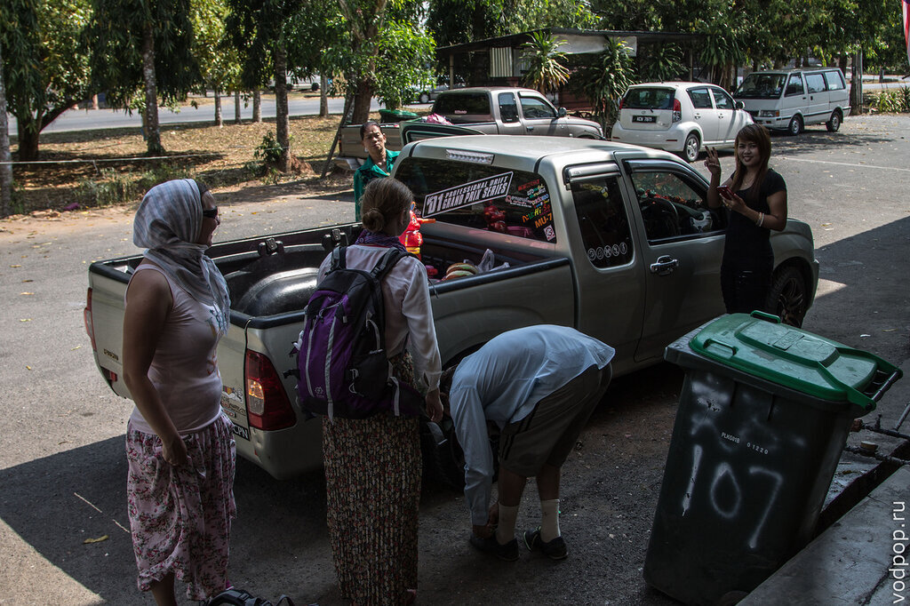

Как только въезжаешь в Малайзию, сразу понимаешь, что это другая страна. Во-первых, дороги - разметка и знаки уже совершенно другие.

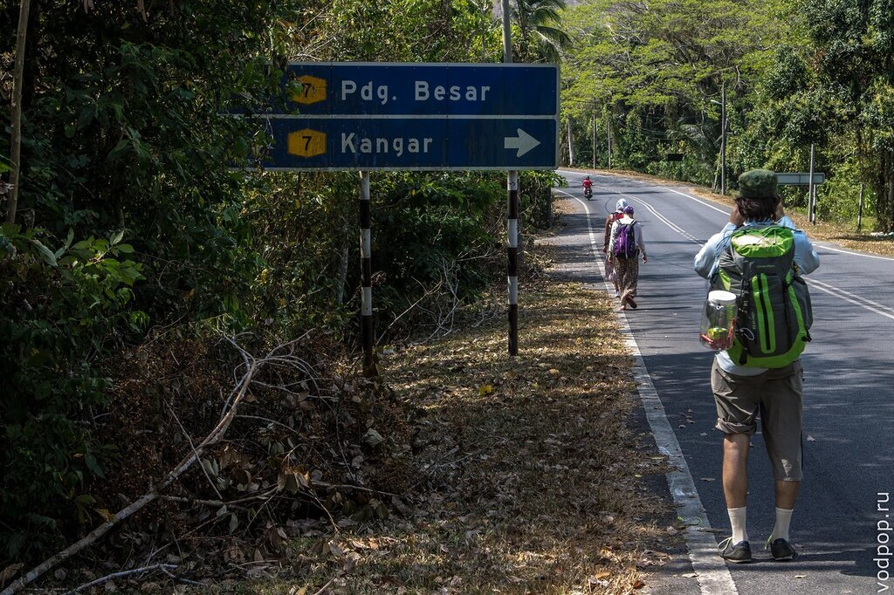

Природа тоже

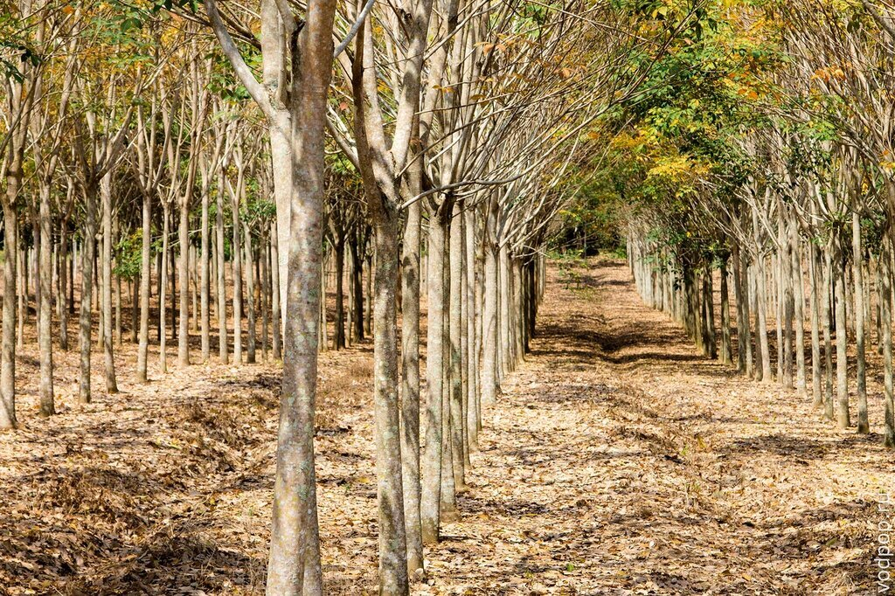

Хотя чувствуется, что Малайзия побогаче Таиланда - дома большие, каменные, машины подороже. И, что особенно приятно - многие хорошо говорят по-английски.

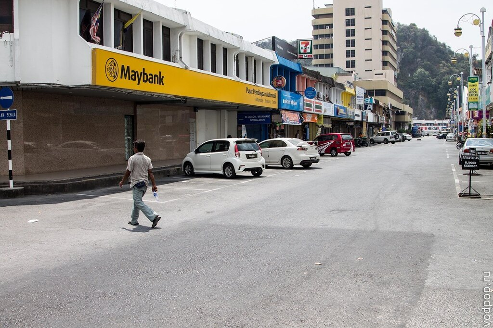

Изначально мы планировали весь путь до Пенанга проехать автостопом, но тут я внесла в наши планы коррективы, провалившись в яму на асфальте (с тротуарами в Малайзии так же плохо, как и везде в Азии). Результатом падения стала частично порванные связки и царапина на коленке. Пока ребята снимают малайзийские рингиты в банкомате, Климентий бежит в магазин и возвращается с ледяной банкой газировки, которой я пытаюсь охладить ногу.

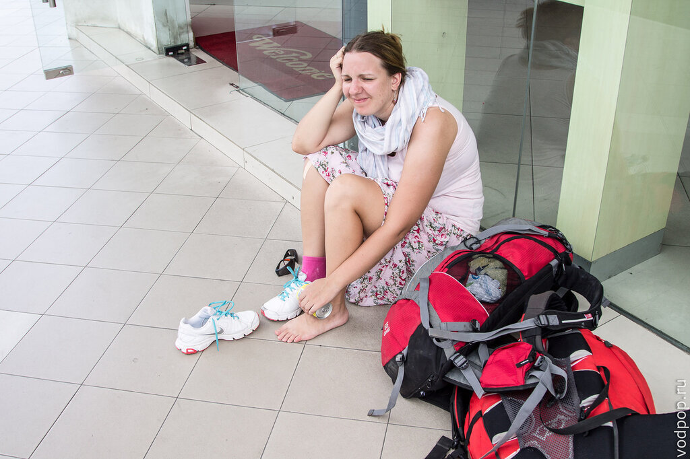

Надо сказать, что под конец поездки целым и невредимым остался только Климентий, а запасы пластыря и бинтов резко сократились.

К слову, наш автостоп резко разошелся с тем планом, который мы изначально себе установили - мы много передвигались на автобусах, остановились на лишнюю ночевку, но от этого он не стал менее интересным и запоминающимся. Мы познакомились с интересными людьми, узнали много удивительных фактов и наполнили себя свежими и яркими впечатлениями.

Вот и последний участок пути на тот день мы проехали на автобусе, к обеду оказавшись на Пенанге.

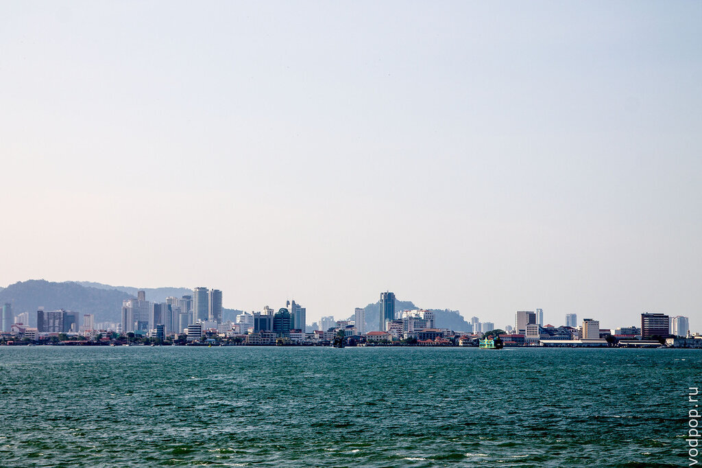Что было дальше - читайте в следующих статьях!
