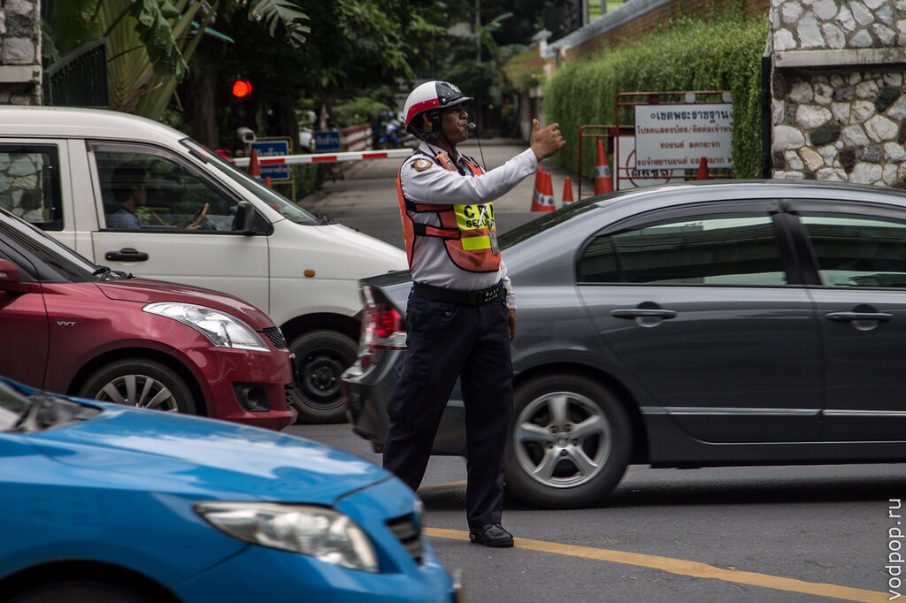
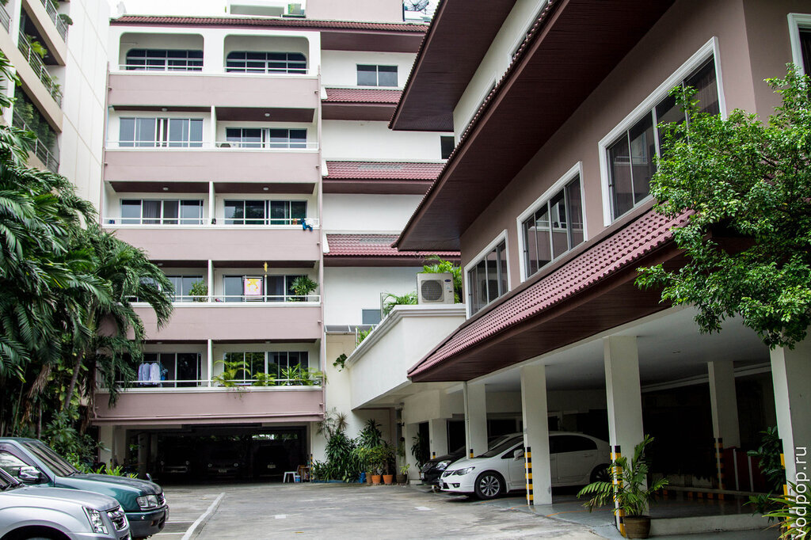
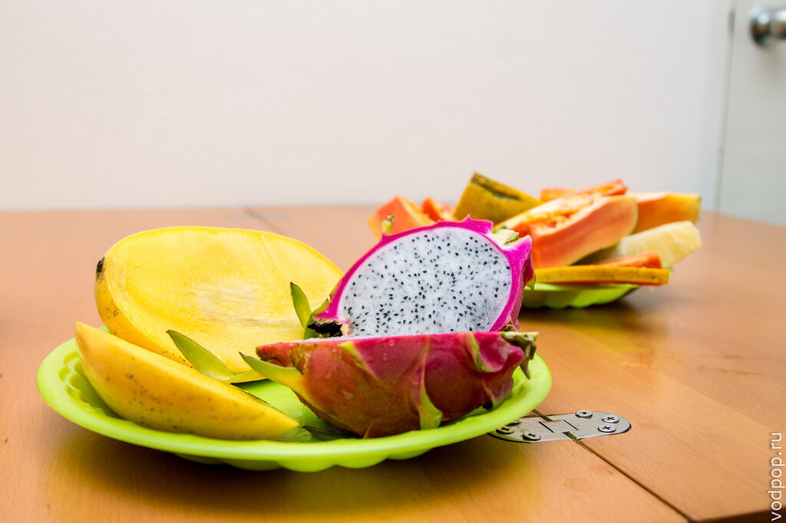
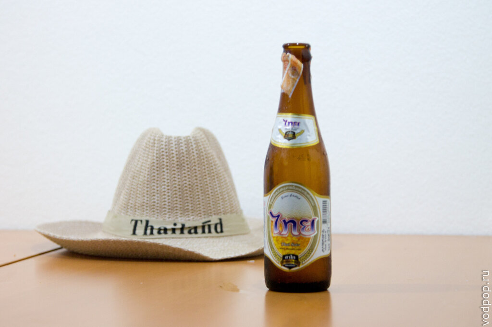
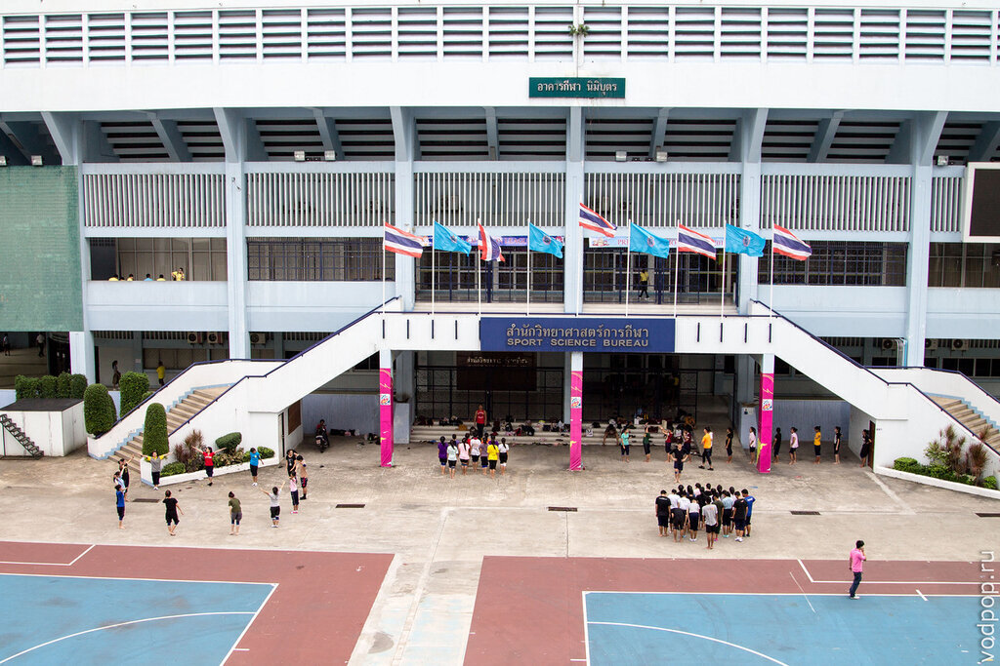
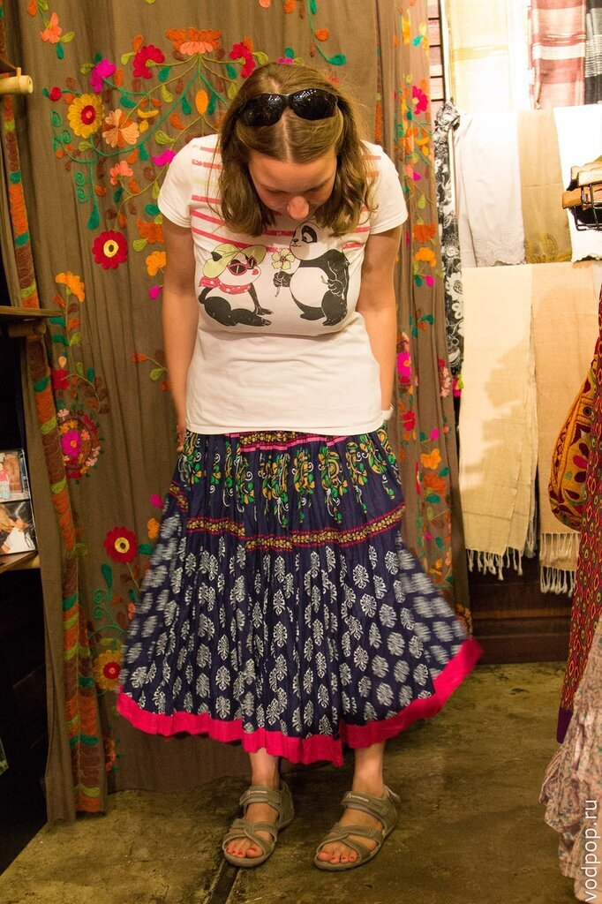

Сейчас мы с Климентием на Филиппинах, на [острове Палаван](https://vodpop.ru/kak-dobratsa-palavan/ "Как добраться на Палаван, Филиппины") (Palawan). О том, как мы тут оказались будет в следующих постах, а пока я хочу подвести итоги нашего почти месячного пребывания в Бангкоке.

<!--more-->

## Безопасность

Бангкок похож на Москву - такая же шумная столица, с толпами людей, пробками на дорогах, большими супермаркетами, небоскребами и трущобами.  Отличие, наверное, кроется именно в последнем пункте. В центре Бангкока сосредоточено наибольшее количество [торговых центров](https://vodpop.ru/shopping-v-bangkoke/ "Шоппинг в Бангкоке — 10 лучших мест для шоппинга"), элитных домов и бизнес-центров, что не мешает многим тайцам жить между этих небоскребов в 2-3 этажных хибарах, которые вот-вот рухнут. В Москве же все сдвинуто на окраины города, причем уровень безопасности напрямую зависит от удаленности от центра. В Бангкоке вы можете себя безопасно чувствовать даже гуляя поздним вечером рядом с самой последней станции метро.

 

## Гостеприимство

Все тайцы невероятно хорошо относятся к фарангам (так они называют иностранцев). Меньше всех улыбались только пограничники, но как только мы вышли к багажной ленте, нам все стали улыбаться и помогать - уборщица одолжила свой скребок для чистки, чтобы мы могли содрать защитную упаковку с рюкзаков. Затем добродушный таксист расспрашивал нас про поездку, пока вез в отель. Увы, это был [один из немногих таксистов](https://vodpop.ru/taxi-v-bangkoke/ "Такси в Бангкоке"), которые говорили по-английски.

Как-то у магазина Теско, который в 2 км от нашего кондо, мы стояли нагруженные сумками и не могли поймать такси. К нам подошел полицейский, привез тележку и загрузил туда наши сумки. А потом вместе с нами пошел на дорогу и жезлом подгонял каждое такси, пока один из таксистов не согласился довезти нас до дома. Мы совершенно растерялись и посмеивались про себя, думая, как бы поступил наш полицейский в аналогичной ситуации.

А на фото мы едем следом за смешным тайцем в шапке (в плюс 30 по Цельсию), который показывает нам дорогу [до Древнего Сиама](https://vodpop.ru/drevnij-gorod-bangkok/ "Достопримечательности Бангкока. Парк «Древний город» в Бангкоке").

Случаев было много и все они говорят о гостеприимстве и радушии тайцев. Если они видят белого человека, да еще и с картой в руках, они обязательно подойдут и станут помогать тебе сориентироваться. Поэтому иногда мы в буквальном смысле прятались, чтобы самим придумать, куда идти - добрые советчики все равно выглядывали из-за плеч и предлагали помощь.

В общем, будьте готовы к тому, что вам будут везде улыбаться и пытаться помочь. Такая вот добродушная нация.

 

## Транспорт

Мы уже описали подробно [транспорт в Бангкоке](https://vodpop.ru/taxi-v-bangkoke/ "Такси в Бангкоке"), поэтому вкратце. Пробки еще хуже, чем в Москве, но есть метро, на котором можно быстро перемещаться по городу.

 

## Жилье

На первые два дня мы остановились в уютном хостеле «The 50's» (бронировали заранее на booking.com ), а затем на месте искали кондо с помощью сайта [http://www.thaiapartment.com/](http://www.thaiapartment.com/) неподалеку от станции On Nut. Нам понравился этот район, несмотря на удаленность от туристического центра. Во-первых, не хотелось шума, а во-вторых, мы пытались проникнуться местным колоритом – покупать еду, ходить на массаж и ужинать в кафешках для тайцев. Плюсом была также стоимость жилья – за месяц аренды двухкомнатных апартаментов с общим фитнес-залом и бассейном мы заплатили 13900 бат (12000 аренда + 900 электричество и вода+ 1000 разбитая Климентием столешница). Место называется [Pornphirun Place](http://www.thaiapartment.com/AptDetail.asp?ProjectID=4439#.UqQQ6dJdXjY).  За аналогичный вариант ближе к центру мы бы заплатили около 18000 бат. Что, впрочем, существенно дешевле, чем в столице нашей родины.

Нравится статья? Узнавайте первым о выходе новых интересных историй! Подпишитесь на нас по [эл. почте](http://feedburner.google.com/fb/a/mailverify?uri=vodpop&loc=ru_RU) или в [группе ВКонтакте](http://vk.com/vodpop)

 

## Еда

В Бангкоке крайне популярны магазины 7/11 (Seven/Eleven), а также крупные супермаркеты Теско (Tesco) и Биг Си (Big C). Цены чуть ниже российских на основные продукты, на кисломолочные продукты чуть выше, на фрукты значительно ниже. Мы жили рядом с магазином Max Value, довольно дорогим по меркам Таиланда, но с хорошим ассортиментом товаров.

Конечно же, оказавшись в Таиланде, мы в первую очередь попробовали все местные фрукты. Вкусно все, кроме дуриана. Несмотря на то, что многим нравится его вкус, нам это показалось похожим на хорошо разваренный лук с отвратительным запахом. Мы подсели на свежие кокосы – брали их каждый день. Вкусный и сытный сок, да еще и нежная мякоть вполне заменяли полноценный обед. Кстати, в жару меньше хочется мяса, больше фруктов с мягкой сочной мякотью, чтобы утолять жажду. Поэтому у нас в холодильнике всегда лежали 3-4 драконьих фрукта.

Питаться в уличных кафешках у нас не получилось – все-таки было остро (несмотря на наши просьбы «no spicy, no chili»). Поэтому мы покупали готовую еду в супермаркетах. С этим проблем нигде нет – в любом 7/11 можно найти курицу с рисом. По цене от 20 до 50 бат за порцию, что даже дешевле, чем в уличном кафе, где цены начинаются от 60 бат за порцию.

 

## Напитки

Можно и не говорить о том, что в Таиланде нужно пить только бутилированную воду. Также во многих кондо стоит автомат с питьевой водой, где можно за символическую плату набрать воду в пластиковую бутылку. Если прийти со своей бутылкой, то будет дешевле. У нас стоял такой в холле, но мы купили чайник, чтобы пить горячий чай и стали кипятить и остужать воду, поэтому автоматом не пользовались.

Алкоголь мы покупали только на пробу, хотя он здесь довольно дешевый. Попробовали местные напитки. Очень понравилось манговое пиво – мы его попробовали на крокодильей ферме в Самутпракане. Возможно, оно продается где-то еще. Советуем попробовать. Еще в самом начале поездки мы купили бутылку рома. На удивление, он был коричневого цвета с травяным привкусом. По всем статьям больше похоже не Ягермейстер, чем на ром. Его можно пить в чистом виде, без разбавления газировкой.

Мы же предпочитали либо фрукты в чистом виде, либо шейки из них. Самым популярным охлаждающим напитком у местных является  холодный кофе – его можно купить практически на каждом углу.  Все напитки подают в пластиковом стаканчике с трубочкой. Тайцы невероятно любят расходовать пластик – к йогуртам в упаковке всегда идут пластиковые ложки в комплект, на кассе если видят, что ты берешь бутылку воды или целый кокос, обязательно кладут в пакет пластиковую трубочку. Все упаковки с едой также снабжены столовыми приборами из пластика. Мы так и не поняли, чем вызвана подобная анти-экономия ресурсов, но это печальный факт.

 

## Образование

Об этом могу судить лишь по внешним признакам – на улицах очень много вывесок различных школ. Во многих преподавание ведется на английском языке. Рядом с нашим кондо было 2 школы изучения иностранного языка, куда можно записаться и даже получить визу на год. Хотя я бы сто раз подумала, прежде чем учить английский в Таиланде. Разве что у носителя языка, так как местные говорят с весьма специфическим акцентом, пропуская большинство гласных в словах. Если вам очень понравилось в Таиланде, вы также можете пойти на курсы изучения тайского языка. Вероятно, общение в таких школах идет на английском языке, поэтому сначала все-таки придется выучить английский. Цена от 18 до 25 тысяч бат за год обучения, в зависимости от количества часов занятий. Подойдет для тех, кому не нравится идея делать бордер-ран каждые 30 дней, и для тех, кто действительно хочет подтянуть язык.

 

## Шоппинг

Я уже немного писала про [шоппинг в Бангоке](https://vodpop.ru/shopping-v-bangkoke/ "Шоппинг в Бангкоке — 10 лучших мест для шоппинга"). Теперь мое личное отношение. Если у вас есть пара свободных дней, однозначно стоит сходить и купить что-то для дома, для себя. Выбор качественных вещей по хорошим ценам просто зашкаливает. Мы же ничего себе не купили (хотя очень хотелось) т.к. планируем еще много путешествовать, а в рюкзаке много не унесешь.

 

## Итоги: наш отзыв о Бангкоке

В целом, нам понравился Бангкок. Мы успели посмотреть этот город с разных сторон: с красивой и [богатой](https://vodpop.ru/shopping-v-bangkoke/ "Шоппинг в Бангкоке — 10 лучших мест для шоппинга"), с [нищей](https://vodpop.ru/lodki-v-bangkoke/ "Лодки в Бангкоке (Khlong boats)") и нереспектабельной. Понравились добрые люди с открытыми улыбками. Через день мы чередовали работу и поездку куда-нибудь в город. И успели посмотреть почти все, что нам было интересно. Кстати, до супер-известного храма Ват По мы так и не добрались. Но зато мы были в Древнем городе, где видели его уменьшенную копию.  Также мы ходили на тайский массаж с маслом. Удовольствие невероятное, стоит всего 350 бат за час. Мы поездили по [Клонгам](https://vodpop.ru/lodki-v-bangkoke/ "Лодки в Бангкоке (Khlong boats)") не вдоль центра, а по жилым бедным районам Бангкока. Для нас это стало своего рода прививкой реальности. В России почти каждый человек, живущий в хорошем доме в двухкомнатной квартире со светом, горячей водой, окнами и даже интернетом всегда найдет повод себя пожалеть и как-то поругаться на условия существования. Я веду себя точь-в-точь также, когда приезжаю из Европы. А тайцы не жалуются, встают в 5 утра  в хибарах, которые вот-вот уйдут под воду,и идут на работу с улыбкой. Не знаю, как у них так получается. Мы решили, что причина тому религия – буддизм, которую исповедуют 90% населения Таиланда.

Из каких-то мелочей могу заметить отсутствие зависти и желания казаться лучше, чем ты есть. Все тайцы одеваются очень скромно. Никаких тебе супер-брендов, а если и носят брендовые вещи, то ярлычками внутрь.

Все машины на дорогах японские  - Тойоты, Мазды, Хонды. Пару раз видели американские и корейские авто. Большая часть машин новые, обязательно с тонировкой (спасаются от палящего солнца). И вполне себе скромно одетая девушка (чаще всего с небритыми ногами – брить у них как-то не принято) паркуется на дорогом авто  у самой обшарпанной уличной кафешки и идет ужинать. Хотя рядом почти всегда есть ресторан с официантами в белых воротничках.
