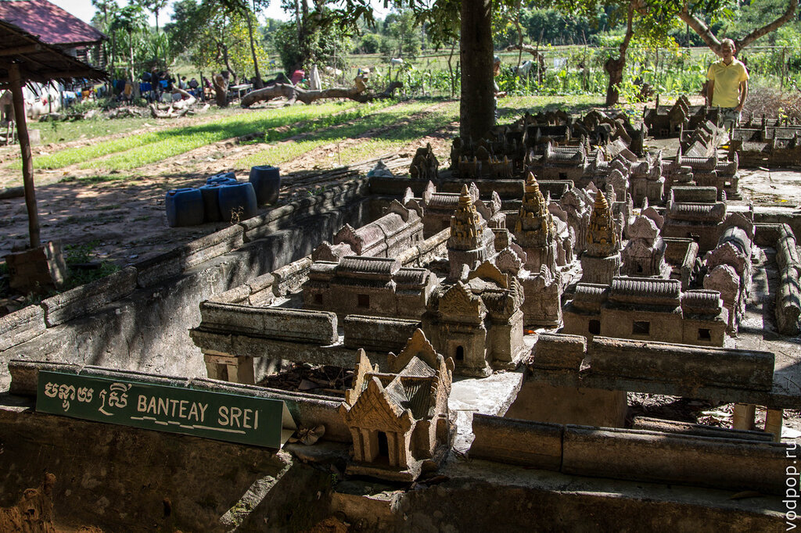
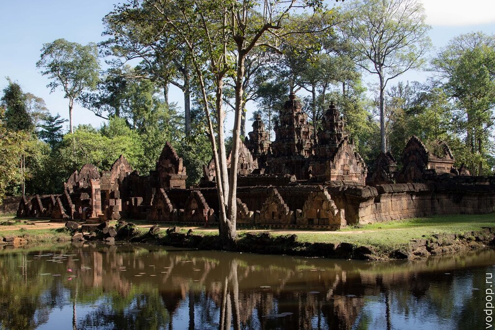
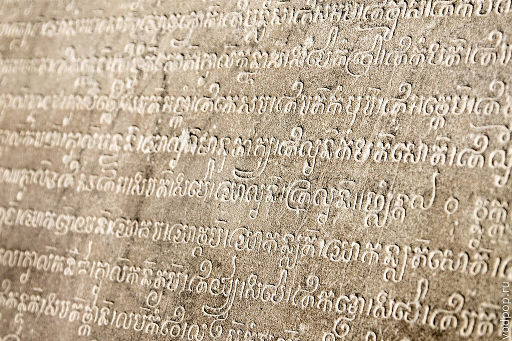
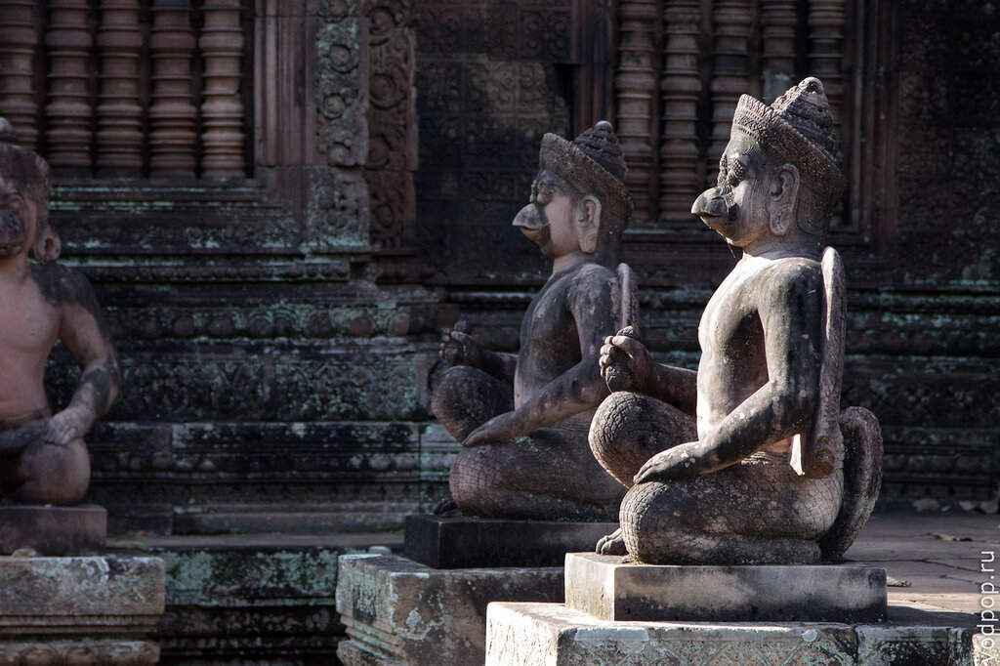
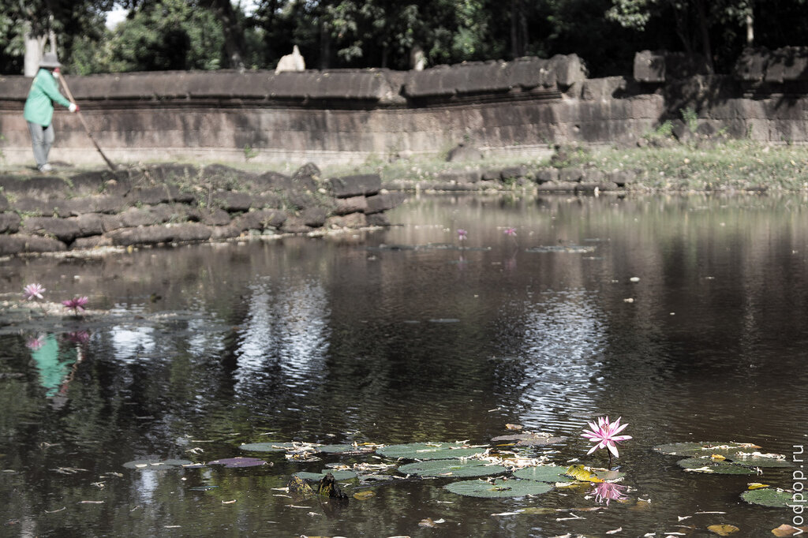
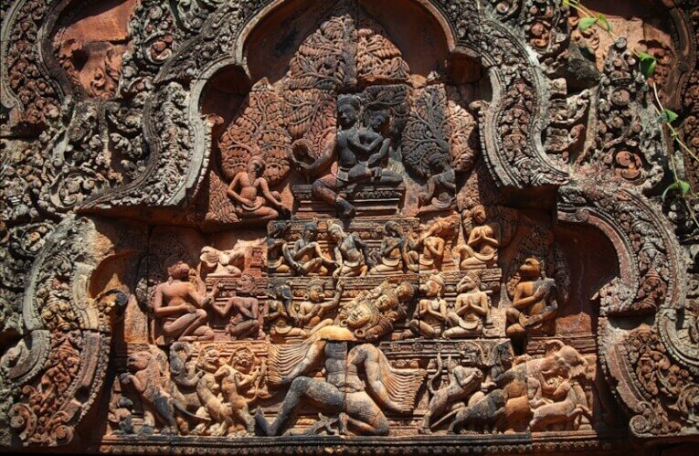
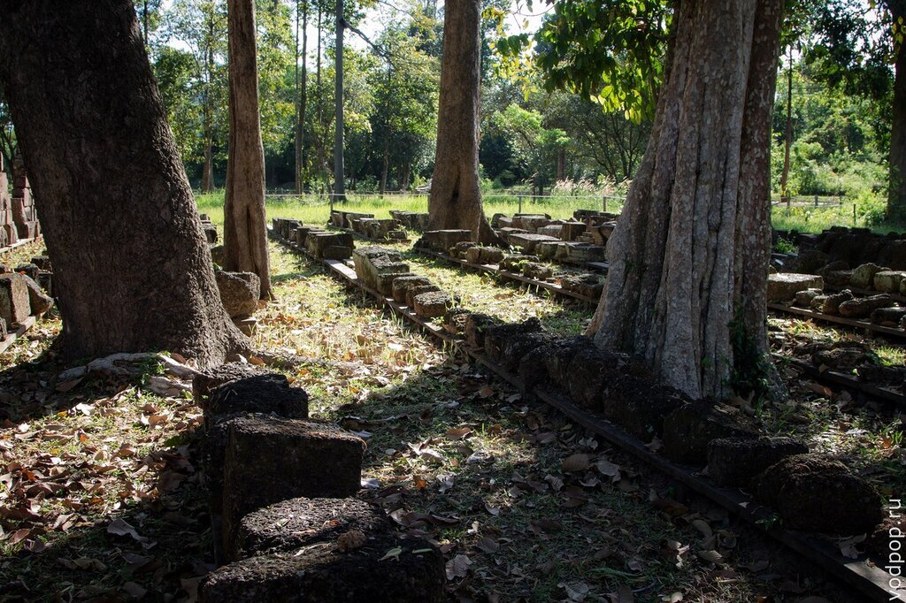
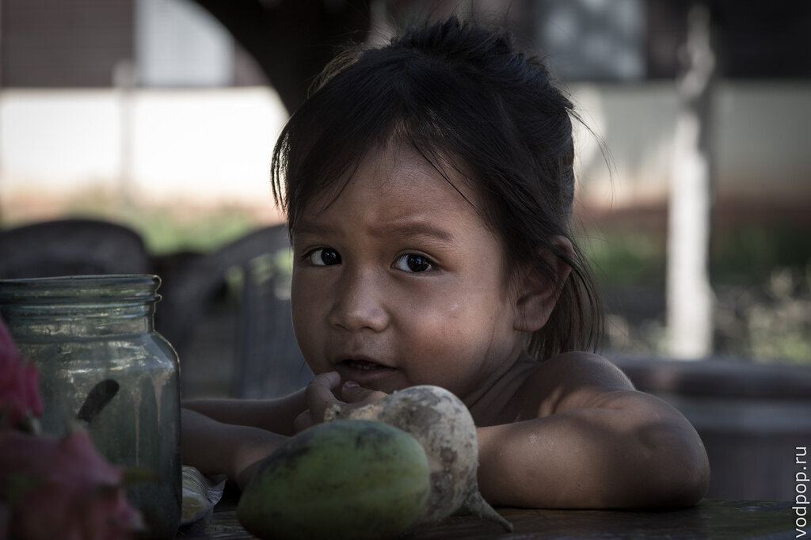

На второй день нашего путешествия по Камбодже мы открыли для себя очень интересный индуистский храм Бантей Срей, построенный в X веке. Так как мы приехали ранним утром, туристов практически не было и мы сумели спокойно посмотреть храм и даже погулять вокруг, не пробираясь сквозь экскурсионные группы.

<!--more-->

Уменьшенная копия Бантей Срей дает лишь отдаленное представление о том, насколько величественен этот храм. В центре стоят 3 башни прасат, окруженные библиотеками.

Не знаю, почему, но именно Бантей Срей из всех [увиденных нами в Камбодже храмов](https://vodpop.ru/hramyi-angkora/ "Храмы Ангкора. Загадки Кхмерской Империи"), понравился мне больше всего. Возможно, это как-то связано с тем, что в переводе с древнего кхмерского название этого храма звучит как "Цитадель Женщин" (другие варианты - "Цитадель Красоты" "Женская Цитадель"). Храм действительно очень "женственный", если можно применять это слово к подобному роду архитектурных объектов.

Изящный, не похожий на другие храмы, Бантей Срей очаровал меня с первого взгляда. Также, как и [храм Ангкор Ват](https://vodpop.ru/hram-angkor-vat/ "Храм Ангкор Ват. Восьмое чудо света"), его окружает ров, наполненный водой, на поверхности которой эффектно отражается храм.

Как и многие другие религиозные памятники Ангкора, Бантей Срей посвящен богу Шиве. История Рамаяны опоясывает древние камни из розового песчаника. Искусная резьба в буквальном смысле нанесена от пола до потолка.

Нравится статья? Узнавайте первым о выходе новых интересных историй! Подпишитесь на нас по [эл. почте](http://feedburner.google.com/fb/a/mailverify?uri=vodpop&loc=ru_RU) или в [группе ВКонтакте](http://vk.com/vodpop)

Вход в храм охраняют обезьяны. Выглядят очень грозно

Тот самый ров, в котором можно видеть отражение Бантей Срей

Если бы я писала все, что нам рассказывал наш гид Андрей, то у меня бы на каждую статью уходило не менее суток - настолько подробно он рассказывал, объяснял все сюжетные линии, высеченные на розовом песчанике. На примере одного барельефа на Южной Библиотеке вы можете ознакомиться с расшифровкой росписи (картинка ниже):

_"Знаменитый барельеф  изображает не менее знаменитую историю из Рамаяны как ракшаса (демон- поедатель человеческой плоти) Равана, изображённый многоруким и многоголовым, пытается трясти гору Кайласа, где живёт Шива._

_Сама гора изображена как многоярусная пирамида, подобная горе Меру и изображена на стилизованном лесном фоне. На вершине сидит Шива с его женой Умой, присевшей около него в восхитительной позе. Шива придавливает гору своей правой ногой, чтобы прекратить тряску._  _Второй ряд изображает явно встревоженных священников и богомольцев, показывающих пальцем на Равану. Справа молящаяся женская фигура._  _На третьем ряду поклоняющиеся с головами  слонов, львов, птиц и лошадей. С обоих сторон обезьяны в изысканных головных уборах._  _Нижний ярус вместе с Раваной занят животными, которые в ужасе бегут от него"_

Храм Бантей Срей также как и прочие храмы Ангкора, частично разрушен за сотни столетий, которые провел в запустении. Реставрация храмов Ангкора идет очень интересным способом - каждая страна в 90е годы, участвующая в программе Юнеско, была выбрана ответственной за восстановление определенного храма.

Но так как исполнителями работ являются кхмеры, то им просто не выгодно сразу заканчивать работы - тогда финансирование прекратится. Поэтому картина с лежащими в рядок камнями, которые соотносят затем с нужным элементом конструкции, весьма популярна на протяжении последних десятилетий.

Кхмеры в туристической зоне на меня произвели довольно отрицательное впечатление - они жутко приставучи, не всегда понимают слово "нет", продолжая навязывать свои услуги. И что самое печальное - они с малых лет приучают своих детей к тому же: торговать, втюхивая любому представителю белого цвета кожи все подряд.

Детей откровенно жалко, но система, если можно так сказать, гнилая у самых корней. Будьте готовы ходить по храмам с непробиваемым лицом. В храмах Ангкора это довольно действенный метод, а вот в Пномпене тук-тукер будем вам орать "тук-тук, ТУК-ТУК" даже через квартал, пока вы ему не ответите.

Словом, Камбоджа необычная и многогранная страна - величие наследия Кхмерской Империи пересекается с нищенскими пейзажами современных деревушек, и это непременно стоит увидеть своими глазами.
