[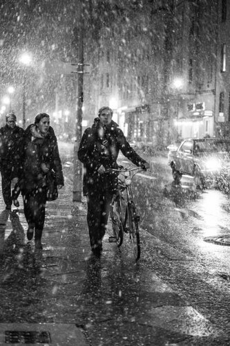](https://vodpop.ru/berlin-germaniya/)

Наша поездка началась с того, что мы приземлились в аэропорту Берлина -Тегель (TXL). На регистрации рейса в России нас напугали представители Трансаеро — сказали, что немцы могут обидеться, что мы летим к ним по французской визе. Мы удивились, но решили все-таки перестраховаться-распечатали бронь на гостиницу в Париже и узнали насчет аренды машины в Берлине, чтобы было что сказать пограничникам. К счастью, никаких вопросов не было и паспортный контроль в Германии мы прошли за считанные секунды.

<!--more-->

Если кратко сказать об аэропорте — он небольшой (по меркам того же Домодедово,откуда мы прилетели), выход из самолета через рукав сразу к паспортному контролю-никаких туалетов/автоматов с водой или едой- ничего. Нам показалось это довольно странным, но времени удивляться не было — багаж выгрузили быстро и мы пошли искать автобус до центра.  
Проблема с оплатой проезда возникает в каждой стране- недружелюбный человеку интерфейс в автомате и отсутствие сдачи у водителей. Мы выбрали первое из двух зол и доехали до Александрплатц.

[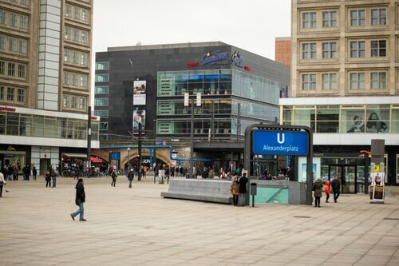](http://fotki.yandex.ru/users/klimentij511/view/794333/)

Площадь названа в честь русского царя Александра Первого, на этом историческое содержание заканчивается — вокруг одни небоскребы, современные бизнес-центры и магазины. Мое внимание привлек один из известных в России магазин электроники МедиаМаркт. В Берлине он расположен на 3 этажах огромного молла и занимает 8000 кв. метров. Немало, да?  
Так как был воскресный день, почти все магазины были закрыты. Мы уже не раз поражались тому, что магазины в Европе закрываются рано либо вовсе не работают по выходным.  
На Александрплатц помимо этого находится крупный пересадочный пункт и согласно статистике ежедневно там осуществляют пересадку порядка 500 тысяч человек.  
Напомню, в Берлине несколько видов общественного транспорта — Sbahn, U, Bus и Tram — в переводе на человеческий: электрички, метро, автобусы и трамваи. Через весь город идет разветвленная сеть и почти до каждой точки можно добраться несколькими путями. Внутри все чистенько, аккуратно, без излишеств.

[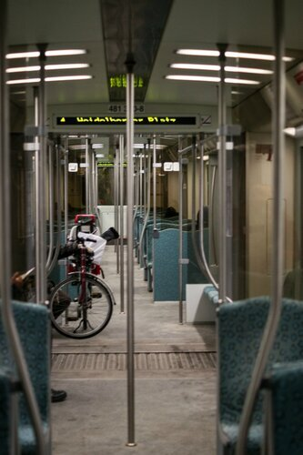](http://fotki.yandex.ru/users/klimentij511/view/794411/)

С первого взгляда на схему ничего не понятно, но уже через 2-3 дня перестаешь путаться. Наверное у транспортной сети Берлина только один недостаток — высокая цена ( если брать на 1-2 поездки или на день), которая компенсируется качеством, скоростью и удобством. Нельзя не отметить, что Берлин по плотности населения значительно уступает столице нашей Родины и в общественном транспорте очень свободно- в 90 процентах случаев можно сесть.  
Скорее всего это связано с тем, что огромное количество людей передвигается на велосипедах — они повсюду.  
Огромные парковки перед станциями забиты двухколесным траспортом, около кафешек, магазинов их даже оставляют не пристегнутыми.

[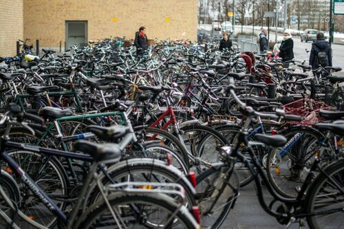](http://fotki.yandex.ru/users/klimentij511/view/794414/)

Маленькие, большие, с корзинами и без, с детскими сидениями — такого разнообразия не встретить даже в магазине.  
В Берлине нас встретила слякотная погода и мы не рискнули взять велосипеды на прокат, а местное население это нисколько не останавливало — видимо, привычка.

Чтобы познакомиться с городом рекомендую СитиТур- на двухэтажном автобусе за 2 часа вас провезут по всем основным достопримечательностям Берлина и аудио гид поведает о том, что перед вами находится.

[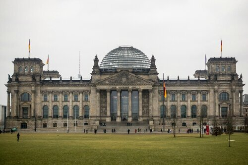](http://fotki.yandex.ru/users/klimentij511/view/794339/)

Насчет экскурсий — практически везде можно купить билет и погулять в тот же день, кроме Рейхстага (см. фото выше). Нас же вежливо развернули у входа, посоветовав записаться в группу в каком-нибудь экскурсионном бюро. Увы.  
О достопримечательностях написано масса путеводителей, поэтому о них писать не буду. Из необычного могу посоветовать отъехать подальше от центра и погулять по разрисованным Граффити кварталам.

[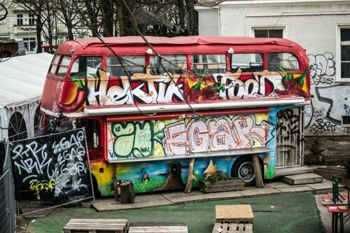](http://fotki.yandex.ru/users/klimentij511/view/794352/)

Довольно резкий контраст между отреставрированными зданиями в стиле барокко и уличной живописью на обрушевшихся стенах потемневших зданий.

[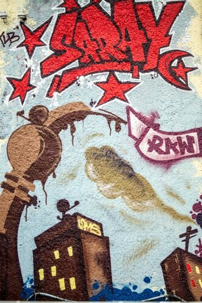](http://fotki.yandex.ru/users/klimentij511/view/794353/)

Также можно сходить в шоколадный магазин&кафе Fassenbender&Rausch, где можно не только купить разные виды шоколада, конфет и пирожных и полюбоваться на шоколадный Рейхстаг, но и попробовать любое из понравившихся лакомств на втором этаже.  
[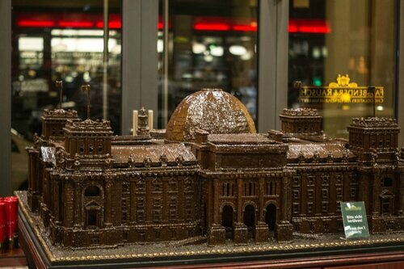](http://fotki.yandex.ru/users/klimentij511/view/794377/)

В один из вечером мы решили зайти на панораму Берлинской Стены. У меня от нее мурашки по коже и я бы не пошла еще раз на это смотреть — что может быть печальней холодной гражданской войны? Рядом стояли творения местных уличных художников, а в сувенирных магазинах продавали куски стены за 5-6 евро в зависимости от размера. Цинично.

[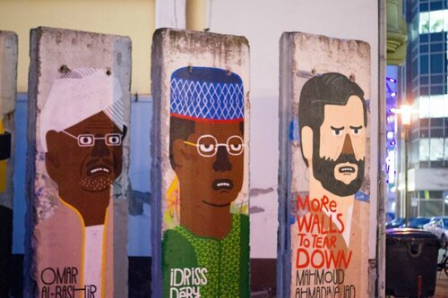](http://fotki.yandex.ru/users/klimentij511/view/794373/)

Несмотря на бледность красок, Берлин создан для удобной жизни. Живут они в основном на окраине города — в панельных домах, где [wholesale jerseys China](http://www.wholesaleijerseys.com) вокруг много зелени и мест для прогулок с детьми и собаками.

[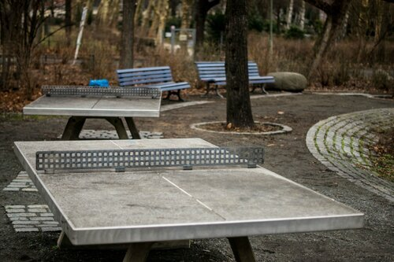](http://fotki.yandex.ru/users/klimentij511/view/794366/)

Детские площадки, правда, вызвали больше сочувствия к детям — все такое же серенькое и монументальное (теннисный стол из бетона).

[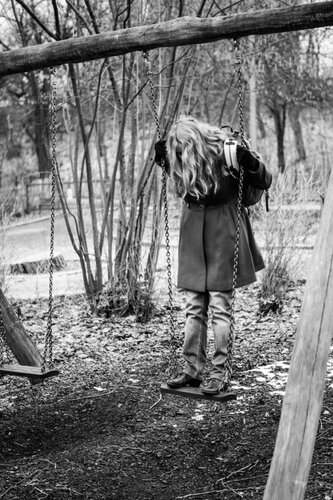](http://fotki.yandex.ru/users/klimentij511/view/794367/)

Мне кажется, детство должно быть более ярким.  
Особенно поразили дачные участки, аккуратно стоящие вдоль Кольцевой дороги Sbahn. Скромные дачные домики, очень небольшого размера — на вид 12 квадратных метров. Пара грядок, цветочки. В России дача ассоциируется совсем с другим.  
Если брать all-day ticket за 6,50 евро, то почти все равно где находится гостиница. Переночевать стоит от 19 до 60 евро за ночь за двухместных номер в зависимости от района и удобств. Можно здорово сэкономить, если брать недорогую гостиницу + проездной на день.  
Побыв в столице Германии пару дней, мы предприняли попытку уехать из Берлина традиционным для нас способом- автостопом:

[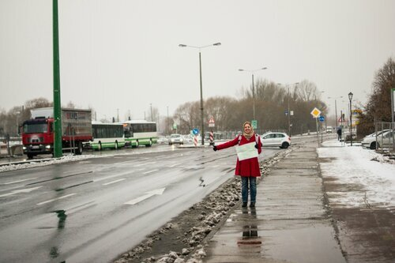](http://fotki.yandex.ru/users/klimentij511/view/794420/)

но в первый раз в жизни нам это не удалось- в городе никто не любит подвозить, а вот с выездом на трассы там откровенно плохо- остановиться водителю просто негде, а на автобан пешеходам доступ закрыт (мы попытались выйти, но машины проезжали мимо нас на скорости 110 кмч и было понятно, что они просто не успеют остановиться). Мы предприняли другую попытку и выехали в Потсдам — почти что пригород Берлина, в надежде, что нам улыбнется удача, но погода окончательно испортилась и мы решили не морозить себя понапрасну — вернулись в Берлин.  
На главном вокзале Hauptbahnhof мы попытались найти free wi-fi, но не тут-то было.

[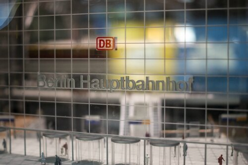](http://fotki.yandex.ru/users/klimentij511/view/794427/)

Вообще в Берлине с wi-fi довольно грустно- далеко не во всех гостиницах и кафе он есть, в основном запароленный и медленный. Есть оператор Tmobile, который покрывает Берлин, но скорость низкая и цены кусаются (мы отдали 5 евро за 24 часовой доступ к крайне неспешному интернет- соединению).  
Так или иначе, мы купили билеты на easy jet за 109 евро до Парижа и поехали в аэропорт Schnoenefeld , чтобы там дождаться самолета. К счастью, кафе в аэропорту работают круглосуточно. Позавтракав, мы сели в самолет и уснули еще до того, как самолет оторвался от земли.
