После тщательного изучения туристического справочника было решено поехать на озеро Блед - одну из основных достопримечательностей Словении, которая пользуется невероятным успехом у туристов и спортсменов. Первые приезжают сюда ради потрясающих видов на Юлианские Альпы, вторые - для участия в соревнованиях по академической гребле. Вид с Бледской Крепости.

<!--more-->

Мы арендовали лодку, чтобы полюбоваться живописными видами, а также посмотреть островок посередине озера, на котором находится часовня Успения.

Лодки побольше везут экскурсионные группы - гребут стоя сами хозяева лодок. Наверное, тяжело. Мы оплыли островок вокруг - тишина, чистейшее горное озеро, прекрасные виды. Романтика, одним словом. И если бы не желание увидеть еще больше красот словенской земли, мы бы задержались на озере подольше. Следующим пунктом осмотра стала Бледская Крепость, стоящая на утесе рядом с озером.

[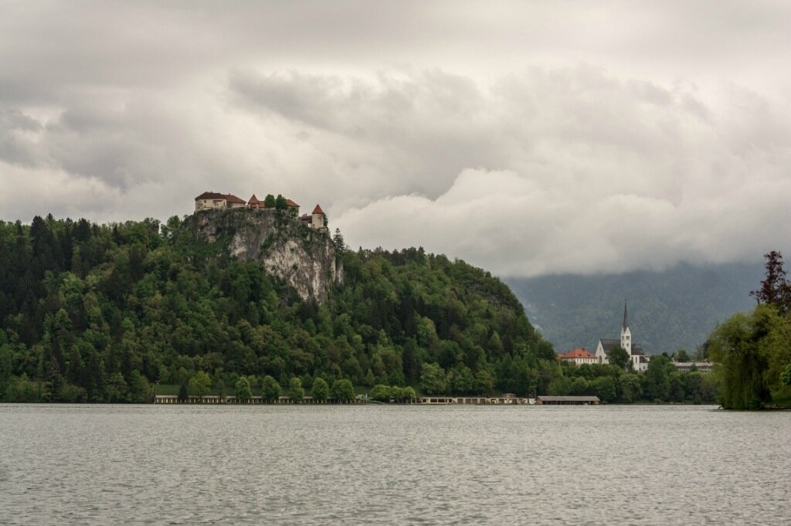](http://fotki.yandex.ru/users/klimentij511/view/841239/)

Первое упоминание датируется 1004 годом, сейчас внутри располагается исторический музей, печатная мастерская, винный погребок и ресторан. Мы начали осмотр замка с печатной мастерской, где влюбленный в свое дело мастер показал нам как работает печатный станок Гутенберга.

[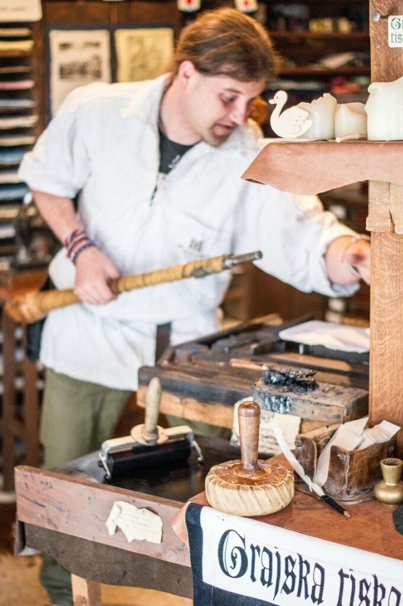](http://fotki.yandex.ru/users/klimentij511/view/841260/)

Он рассказал (на английском) про устройство и принцип работы станка, показал наборные буквы и при нас изготовил памятную открытку с надписью "Home is where the heart is".

[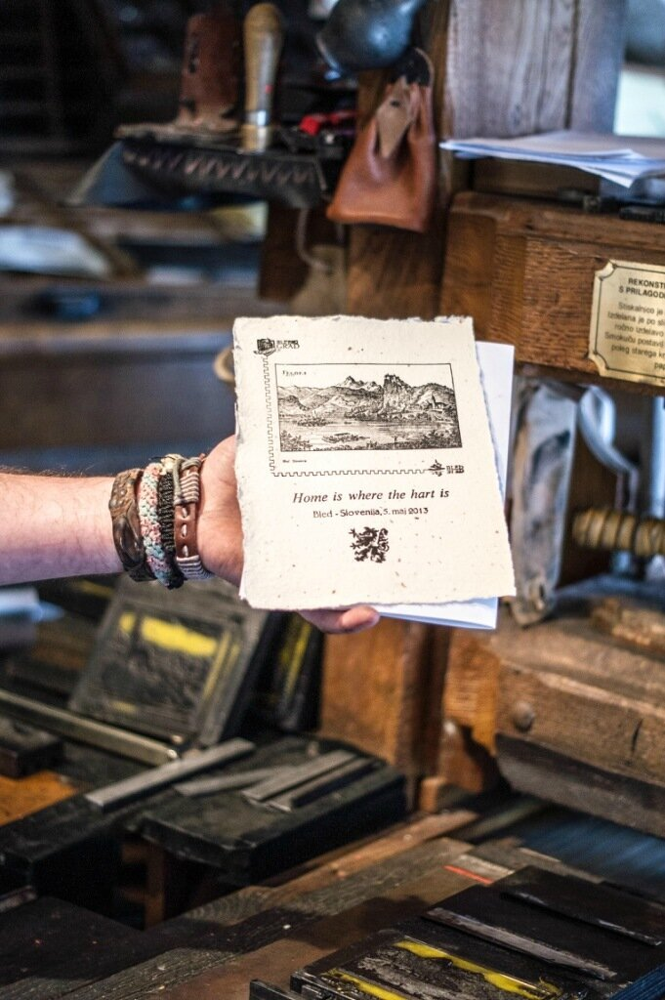](http://fotki.yandex.ru/users/klimentij511/view/841261/)

В первой версии вышла небольшая опечатка, поэтому мы закрепили наши знания. Климентий отпечатывал буквы,а я ставила сургучную печать. Очень интересно и познавательно, особенно приятно, что человек настолько увлечен своим делом - он подробно рассказывает каждому, кто к нему заходит, о работе станка, а также ведет занятия со школьниками (что-то вроде наших уроков труда). Честь и хвала таким людям! После весьма увлекательной лекции у нас разыгрался аппетит и было решено пообедать прямо на вершине замка. Цены там довольно высокие - 20 евро за la carte на 1 персону, но мы решили не отказывать себе в удовольствии попробовать "высокую" кухню.

[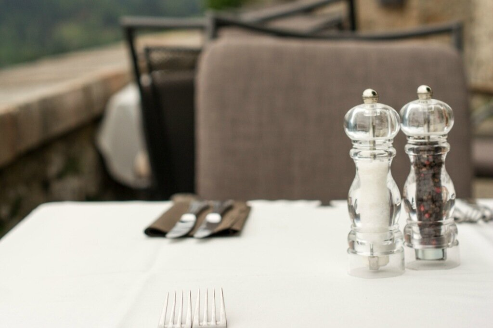](http://fotki.yandex.ru/users/klimentij511/view/841271/)

Обед был прекрасен - первый раз в жизни попробовала овощной салат со сливочным мороженым, горячее блюдо было под каким-то необыкновенным сливочным соусом. Я силилась понять, как они это готовят, но довольно быстро сдалась и просто стала наслаждаться прекрасным видом на озеро Блед. После окончания "трапезы" мы отправились штурмовать музей - очень интересный, с красиво оформленными витринами и табличками на английском языке. В каждой комнате висела плазма, показывающая тот или иной фильм - с начала движения материков и образованием континентов до нынешней эры, о флоре и фауне. По центру одной из комнат разместился странный объект - объемная модель Юлианских Альп, на которую проецировались названия хребтов, рек, озер и отметки высоты над уровнем моря.

[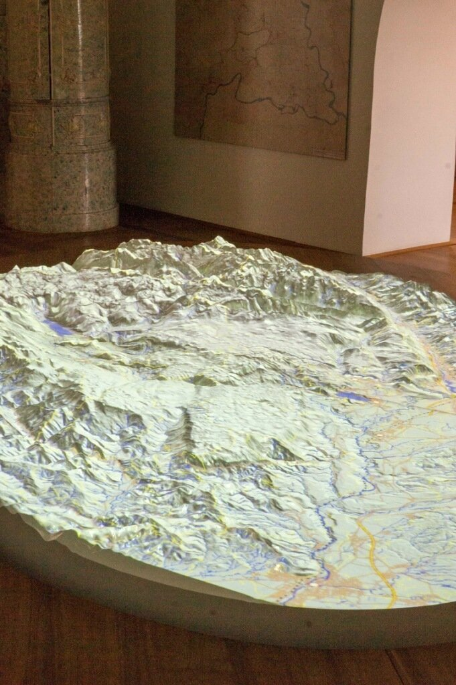](http://fotki.yandex.ru/users/klimentij511/view/841277/)

В общем, здесь есть куда сходить и взрослым и детям. Мы же отправились дальше, на озеро Бохинь. По дороге остановились у водохранилища. Словению можно сравнить с Абхазией - природа местами очень похожа, и тут и там мерещится озеро Рица, река Псоу и безымянные горные ручейки. Но, безусловно, ехать по шикарной дороге намного приятнее, чем трястись в хантере по дороге на Черниговку. Когда-нибудь я подниму старые отчеты о поездах и обязательно поделюсь фотографиями маленькой непризнанной страны.

[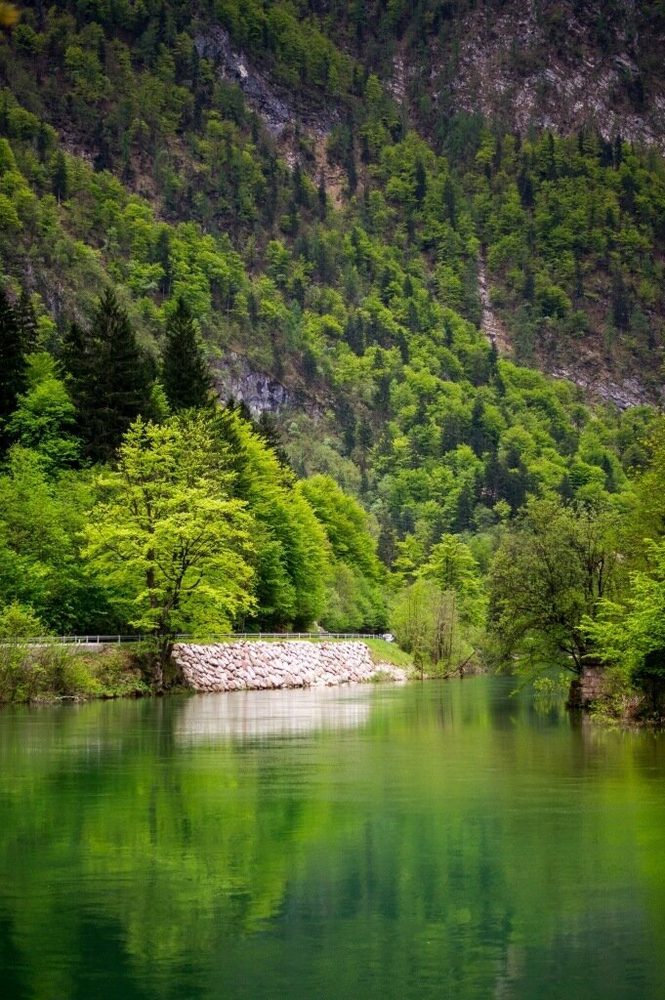](http://fotki.yandex.ru/users/klimentij511/view/841279/)

Возвращаясь к теме повествования..Честно, я даже не знаю, какое из озер лучше - они оба по-своему прекрасны. Пейзажи заставляют сердце колотится быстрее - настолько накрывает восторг при виде нетронутого человеком творения природы. Жилые дома аккуратно прячутся за пышными ветками деревьев, из людей мы встретили только молодую пару с маленьким мальчиком. Тоже русские.

[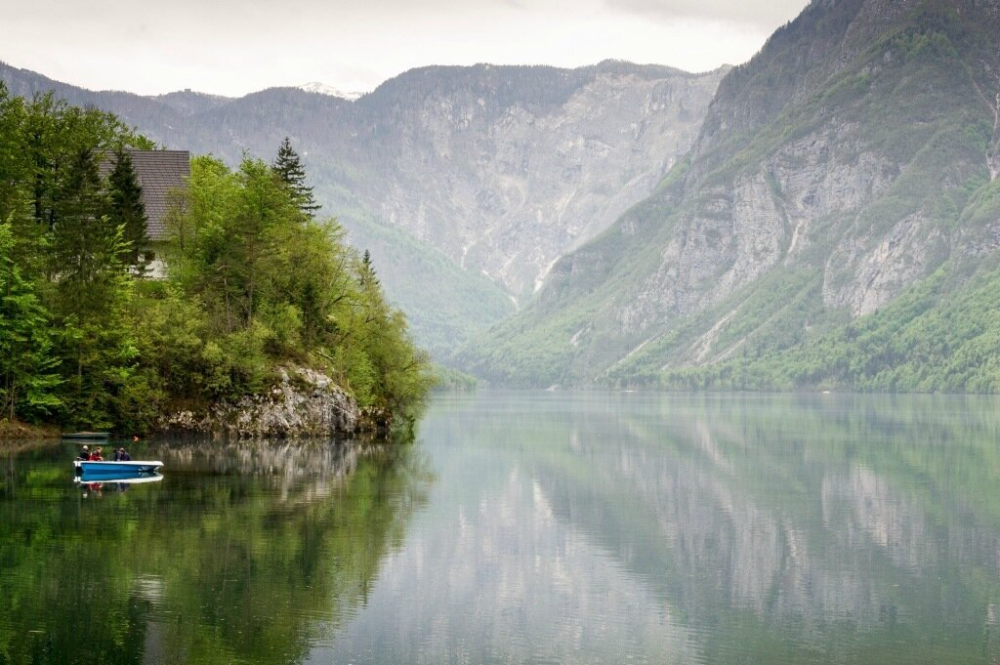](http://fotki.yandex.ru/users/klimentij511/view/841286/)

Вода кристально чистая и поверхность озеро гладкая. Лишь иногда выпрыгивающие рыбки пускают мелкую рябь.

[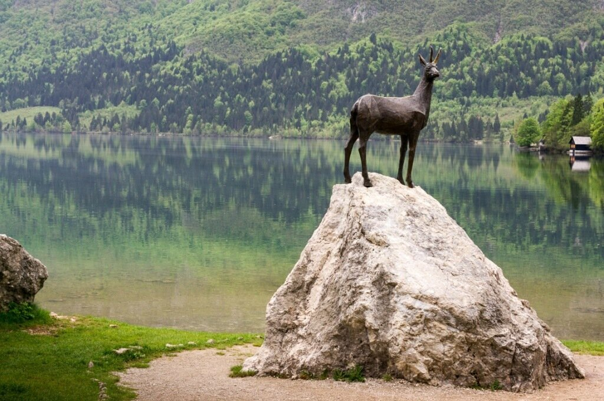](http://fotki.yandex.ru/users/klimentij511/view/841285/)

Словно зеркало. [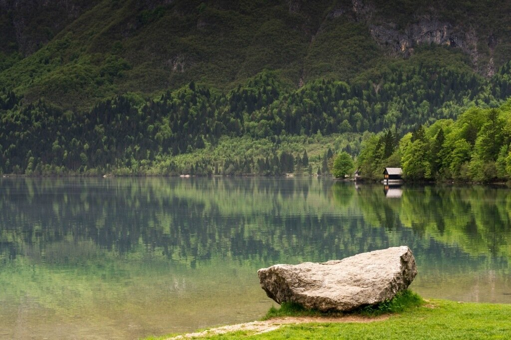](http://fotki.yandex.ru/users/klimentij511/view/841289/)

Вообще, чтобы лучше описать свои ощущения от о.Бохинь, лучше всего помолчать - именно такое желание возникает пока стоишь на берегу. Мы попытались снять лодку, но вокруг не было ни души, кроме той самой семейной пары. Вдоволь налюбовавшись, мы стали подниматься наверх, и попытались попасть на вершину горы на подъемнике - зимой тут горнолыжный курорт. Увы, мы подоспели только к последнему подъему - спускаться пришлось бы пешком, а учитывая местный рельеф нас сразу предупредили, что это нереально. Мы немного расстроились, тем более что в конце дня наша тучка все же настигла нас - пошел сильный дождь. Какая-то лодочка одиноко плыла без пассажиров.

[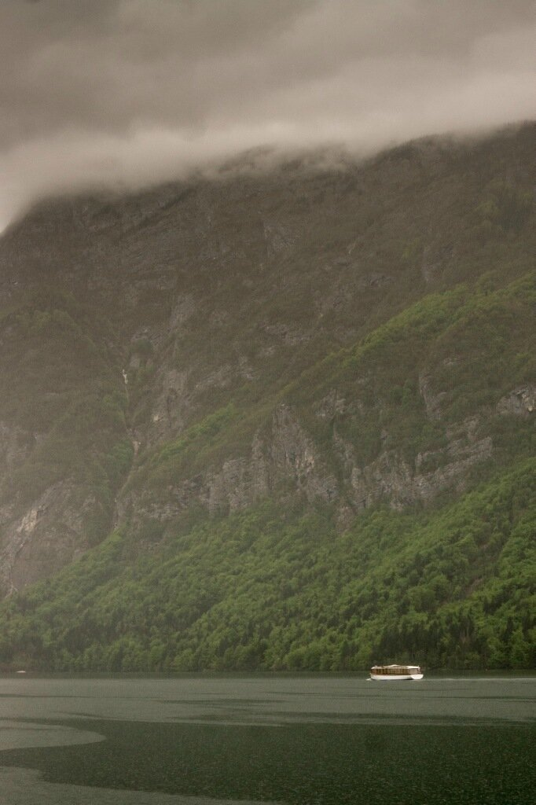](http://fotki.yandex.ru/users/klimentij511/view/841298/)

Кстати, видимо во всей Европе по горным озерам ходят только на электродвигателях - нигде не видела обычных бензиновых и масляных следов на воде. Довольно странно, хотя очень разумно. Климентий захотел увидеть Адриатическое море, поэтому мы сделали небольшой крюк в 200 км и добрались до побережья около города Купер, где находится порт.

[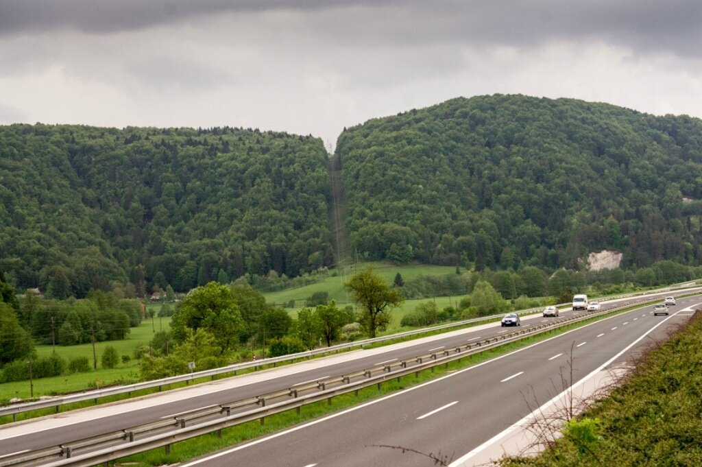](http://fotki.yandex.ru/users/klimentij511/view/841305/)

Мне совершенно не нравятся портовые города - слишком грязно, шумно и многолюдно. Марсель, Клайпеда, Мурманск, Сухум, Хельсинки - среди них разве что в последнем порт оставляет приятные впечатления. Так или иначе "галочка" была проставлена и тем же вечером мы отправились в Хорватию.
