Большой Будда на Пхукете, он же Биг Будда, стал нашей любимой достопримечательностью на острове.  И не удивительно, ведь мы жили [в кондо у подножия горы](https://vodpop.ru/kondominium-na-phukete/ "Лучший кондоминиум на Пхукете или как увенчались успехом наши поиски жилья") Кхао Наккерд, на которой расположена гигантская, 45-метровая статуя Будды, которую отлично видно в радиусе 10 километров.

<!--more-->

Даже дорога на Большого Будду является сама по себе примечательной - крутой  серпантин проведет вас сквозь дикие заросли и практически настоящие джунгли.

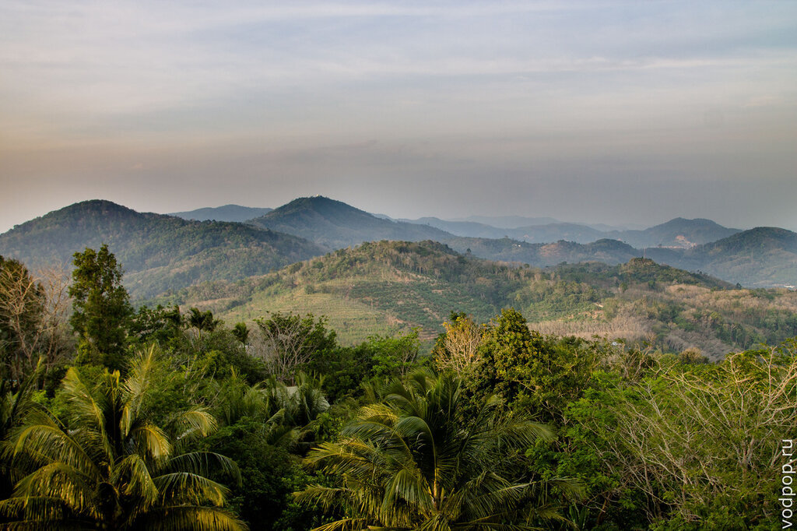

Асфальт весьма приличного качества, хотя местами повороты настолько резкие и под большим градусом, что я бы не советовала туда ехать тем, кто только-только сел за руль мотобайка.

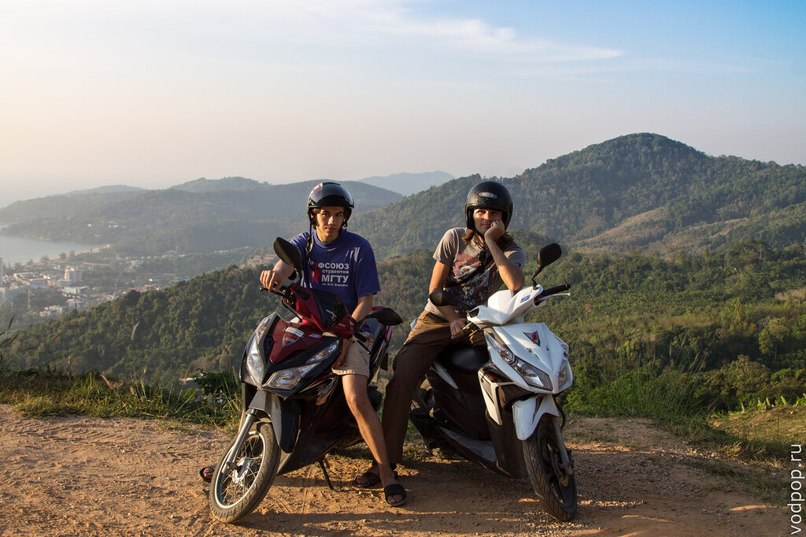

И если вы правильно доехали до подножия горы, то дальше ошибиться уже невозможно - дорога единственная и ведет к Большому Будде, стоящему на самой вершине. Этим пхукетский Биг Будда похож на своего  брата- близнеца  [Большого Будду в Гонконге](https://vodpop.ru/bolshoy-budda-v-gonkonge/ "Большой Будда в Гонконге и рыбацкая деревня Тай О"), который тоже стоит на вершине острова Лантау.

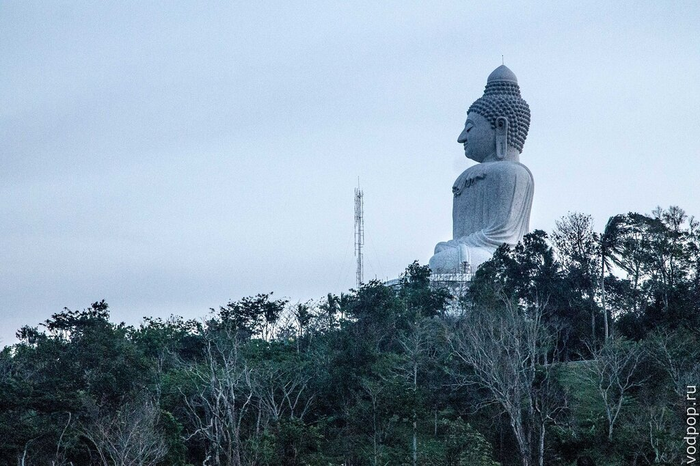

Строительство комплекса началось в 2002 году, и при текущих темпах туристам нужно подождать еще лет 10, чтобы наконец увидеть всю красоту этого места, без мешков с цементом и строительных лесов.

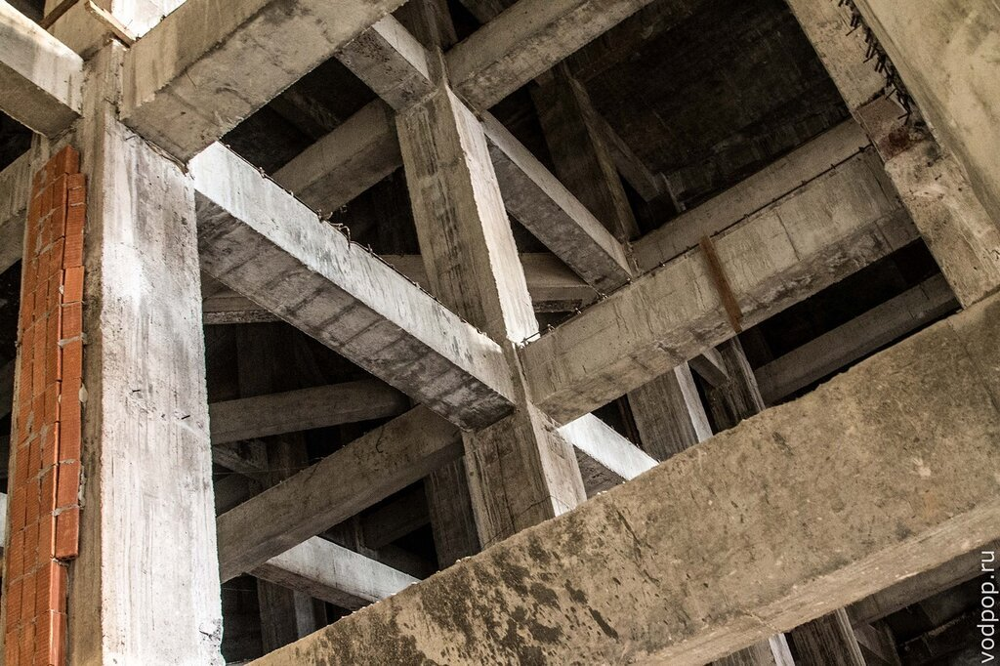Камнем преткновения, конечно же, являются деньги, ведь храмы в Таиланде большей частью строятся на пожертвования прихожан. Каждый турист может помочь ускорить этот процесс, купив сувенир - фигурку Будды, колокольчик или даже кирпич, который ляжет в основу одной из стен комплекса.

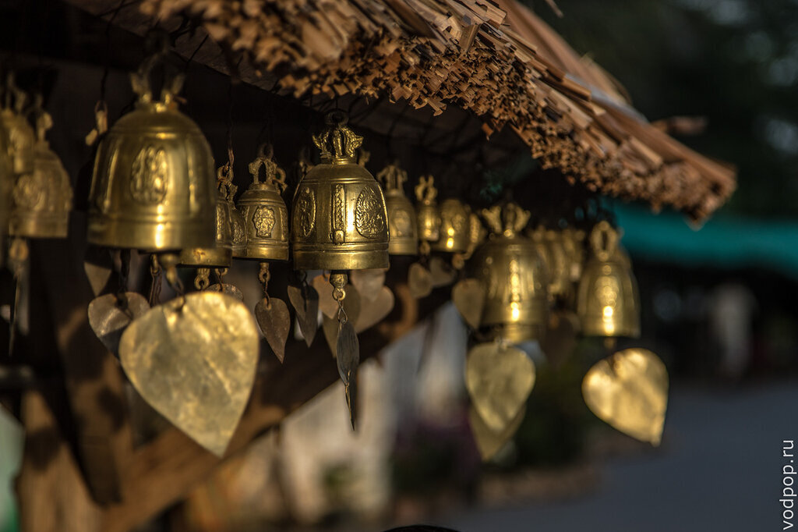

Колокольчиков тут просто безумное количество! Как-то раз мы попали в очень ветреный день, и просто не могли заставить себя поехать домой - настолько красиво звучала музыка тысячи колокольчиков, развеваемых на ветру.

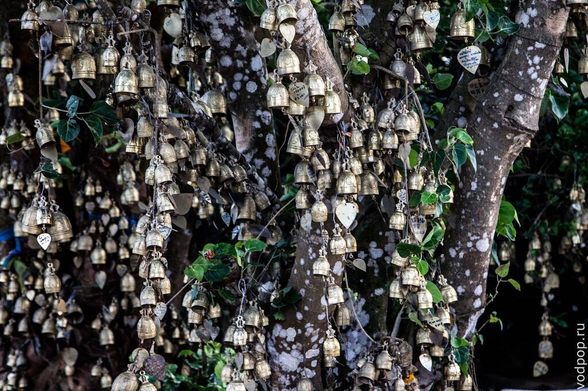

Кстати, вход на территорию комплекса абсолютно бесплатный. Единственное требование - к одежде: закрытые плечи и ноги до коленей. Тем, кто приехал сразу с пляжа, бесплатно выдают саронг.

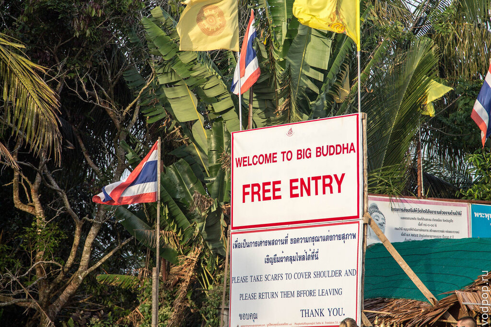

Вообще, требование одеваться поприличнее стоит повесить на каждом углу. Перегревшиеся на жаре туристы забывают обо всех приличиях, входя в кафе и магазины с голым торсом, в одних плавках или купальнике. Хотя в туристических зонах тайцы уже привыкли к обнаженным телам, в остальной части Таиланда над полуголыми людьми в общественном месте могут и посмеяться.

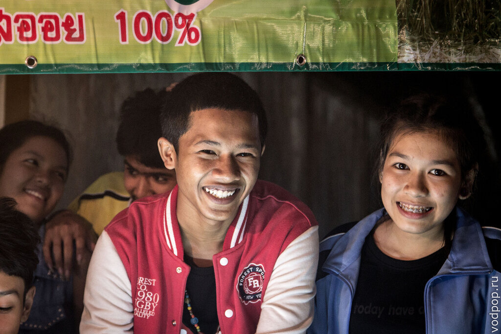

На пути на Большого Будду есть небольшая слоновья ферма, где можно не только покормить понравившегося вам слоника, но и покататься по настоящим джунглям на спине этого величественного животного. Мы уже катались на слонах в зоопарке Бангкока, поэтому остались на смотровой площадке, чтобы понаблюдать за Дашей и Владимиром, которые приехали к нам в гости в свой отпуск.

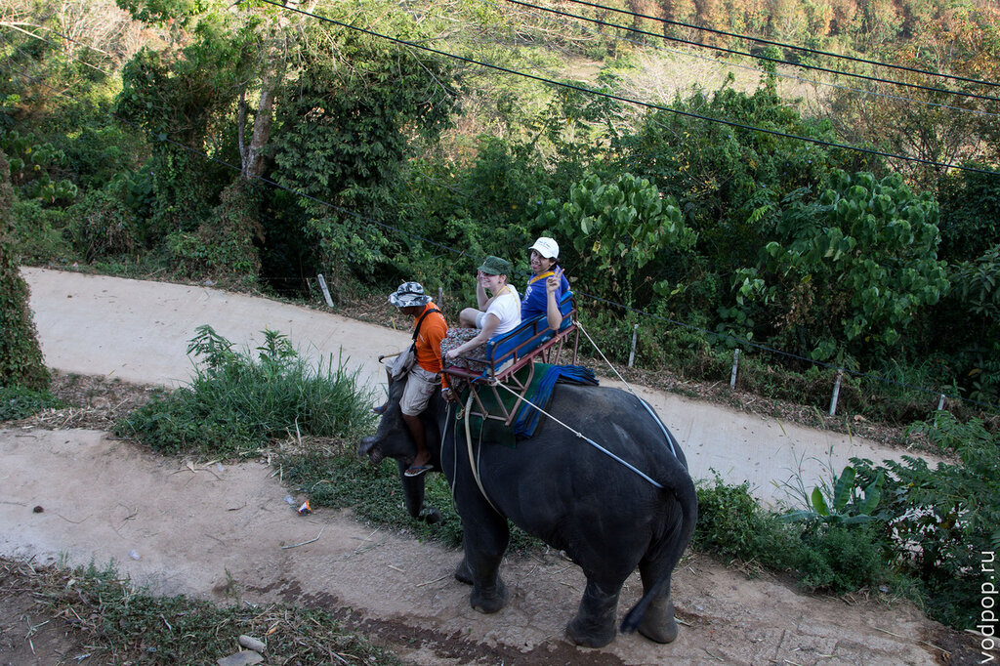

Пока ребята катались, мы с Климом бродили вокруг и пили бесплатную воду, которую дали нам на всех (хотя катались только двое)

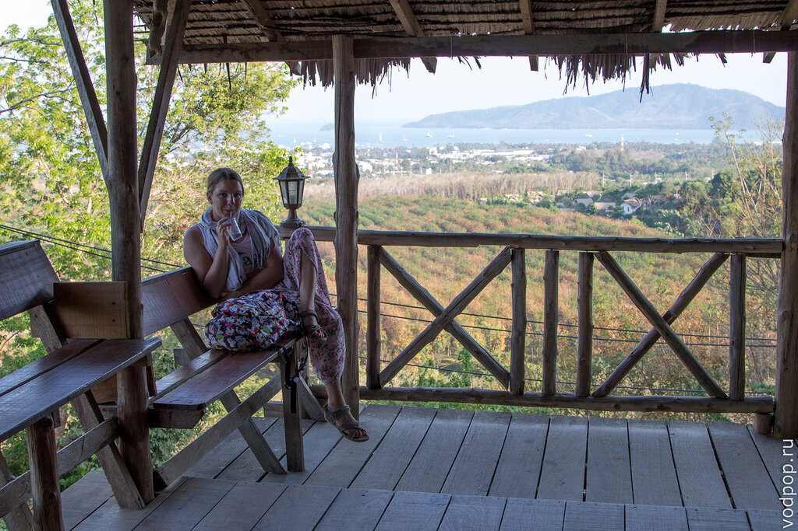

Тайцы довольно сговорчивый народ - мы уговорили их уменьшить время катания с получаса до 15 минут и сделать скидку. Наверное, легко быть добрым, когда тебя окружает такая красота

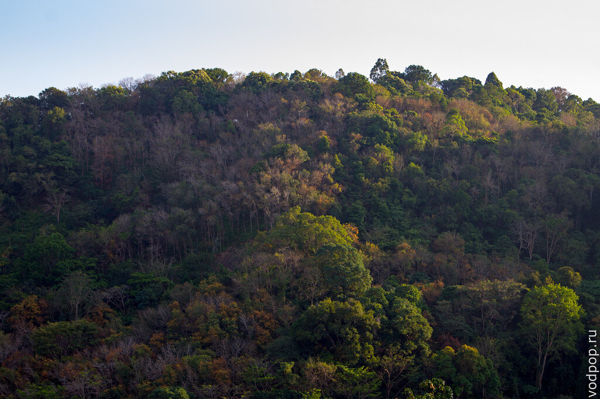

Нравится статья? Узнавайте первым о выходе новых интересных историй! Подпишитесь на нас по [эл. почте](http://feedburner.google.com/fb/a/mailverify?uri=vodpop&loc=ru_RU) или в [группе ВКонтакте](http://vk.com/vodpop)

В Таиланде просто интересно смотреть по сторонам. У меня вызвало улыбку, когда маленькая тайка отобрала у мамы метлу и продолжила убирать территорию от листьев самостоятельно.

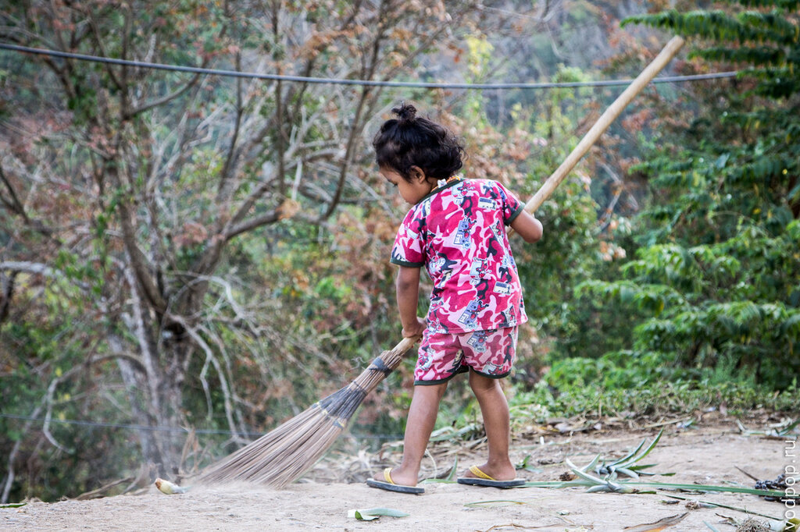

Погонщик слонов в конце рабочего дня. Скоро он "припаркует" своего слона, отвяжет скамейку, снимет три толстых одеяла, а затем принесет связку листьев для корма.

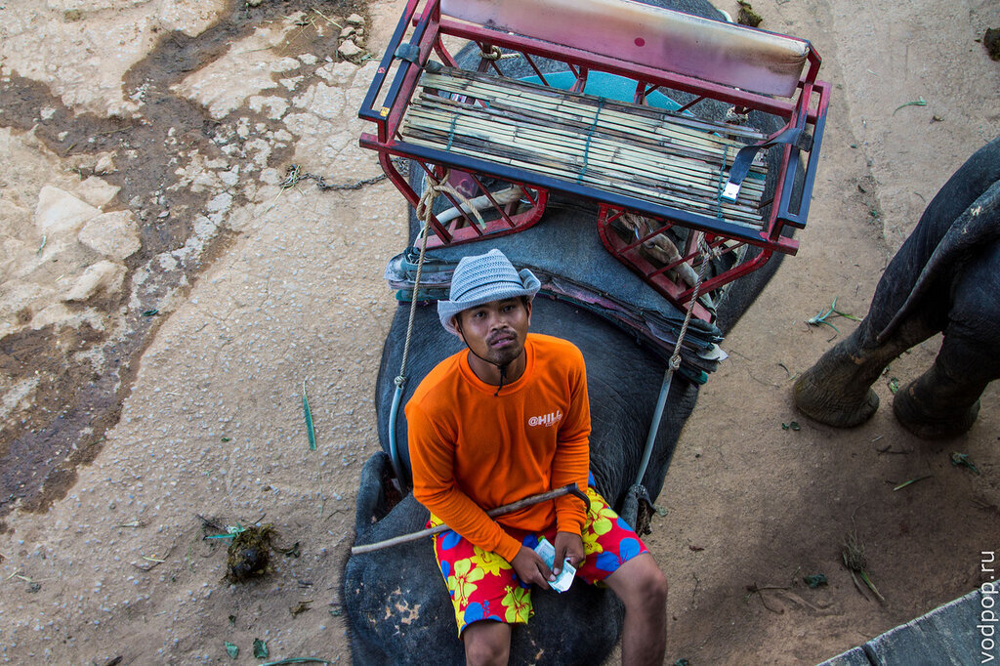

Вот так отвязывают скамейку: сидя почти на голове у слона

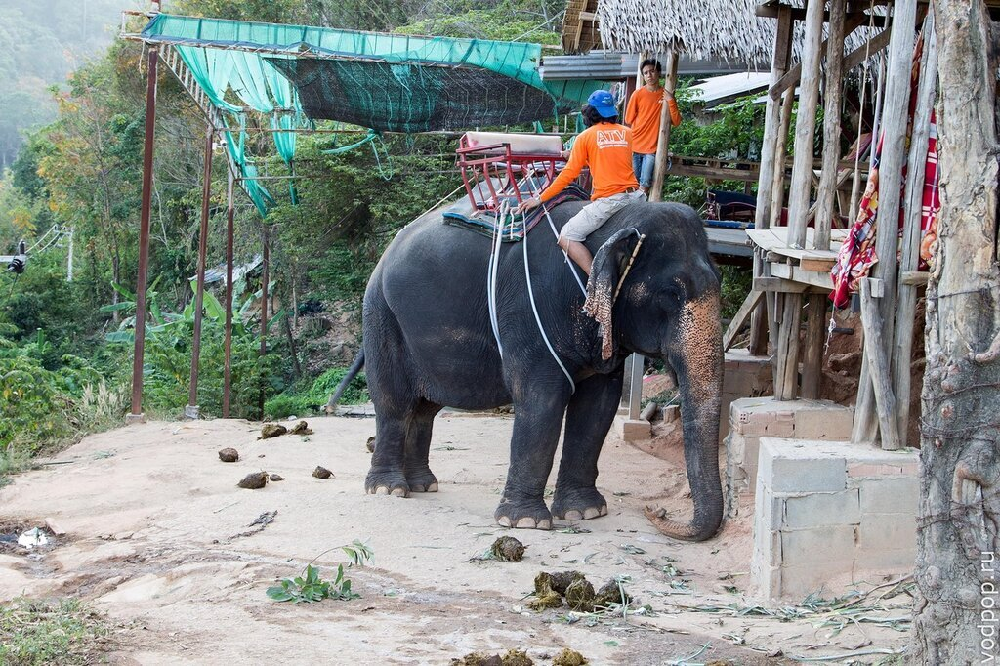

Слоны за последние полгода стали очень привычными животными, хотя когда встречаем их прямо на шоссе, все равно очень удивляемся

Словом, Большой Будда на Пхукете - это то, что стоит увидеть своими глазами!

## Как добраться:

- самостоятельно: координаты Большой Будда на Пхукете:  7°49'39"N   98°18'45"E;
- на тук-туке или такси: просто сказать "Биг Будда";
- из Пхукет Тауна раз в 20-30 минут ходит сонгтэо до поворота на Большого Будду, а вот дальше все равно придется брать такси или тук-тук - идти в гору около 6 км;

 

<iframe style="border: 0px;" src="https://www.google.com/maps/embed?pb=!1m18!1m12!1m3!1d3952.6377901210703!2d98.31246600000003!3d7.828106000000001!2m3!1f0!2f0!3f0!3m2!1i1024!2i768!4f13.1!3m3!1m2!1s0x30502f7c270cefdb%3A0xa5c8acf78851d651!2sBig+Buddha+Phuket!5e0!3m2!1sru!2sru!4v1393951927157" width="600" height="450" frameborder="0"></iframe>

Время работы с 8:00 до 19:30, но мы советуем приехать за полчаса-час до заката, и посмотреть его прямо здесь, с вершины Большого Будды. И захватите с собой средство от комаров - вечером они очень любят кусаться!
