Большой Будда находится на острове Лантау, Гонконг. В мире есть несколько больших статуй главного символа буддизма: например, на Пхукете, где мы сейчас живем. Однако в Гонконге, пожалуй, находится самая известная из них.

<!--more-->

В один из дней нашего пребывания в Гонконге, нам захотелось немного отвлечься от шума большого города, и мы решили поехать на остров Лантау - зеленый и тихий, с огромными высокими деревьями и почти безлюдный в будние дни.

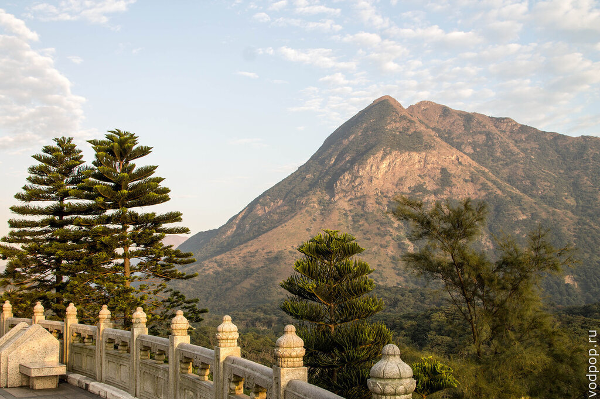

Доехав до деревни Нгонг Пинг (как добраться до Большого Будды, читайте в конце статьи), мы как раз успели посмотреть 34-метровую статую за час до закрытия.

После преодоления 200 с лишним ступеней к статуе, можно насладиться видами

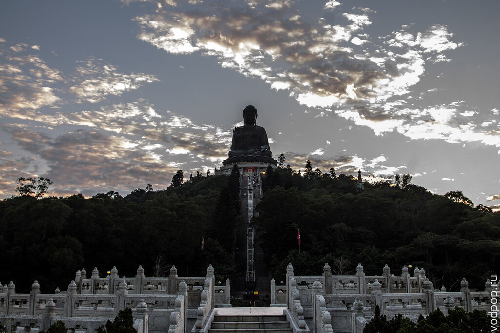

Небо перед закатом

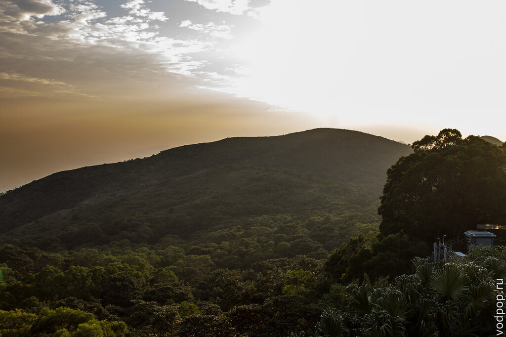

Кстати, статуя Большого Будды относительно молодая - ей всего 20 лет. Построена специально для привлечения туристов, хотя многие жители Гонконга тоже приезжают сюда обратиться к своим богам, зажечь ароматическую палочку и зайти в буддийский монастырь По Линь.

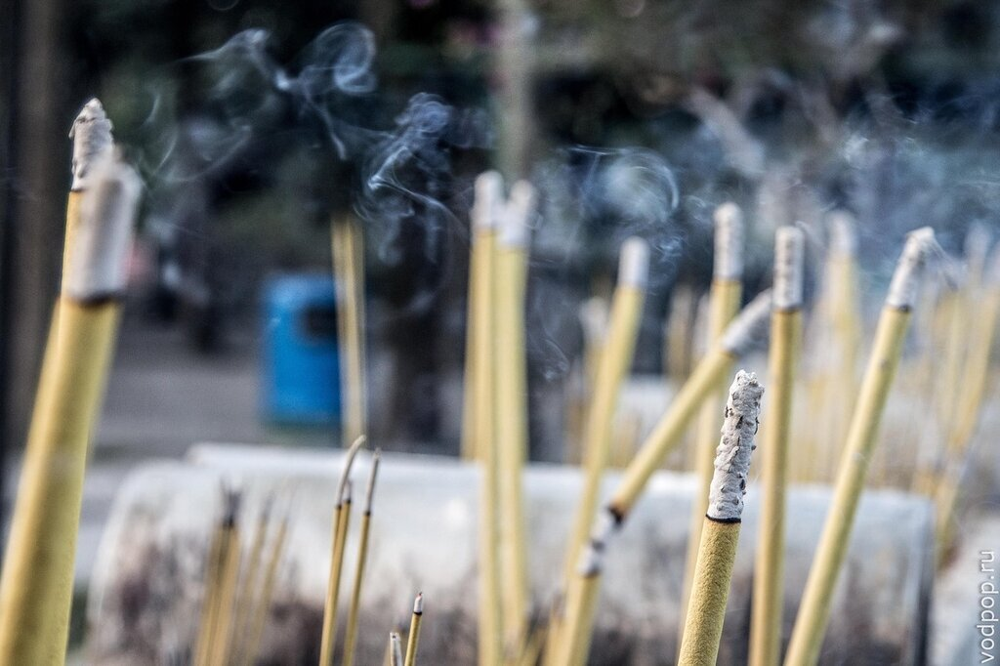

К сожалению, во время нашего посещения, монастырь был на реконструкции. Так что мы сфотографировали лишь открытую часть крыла.

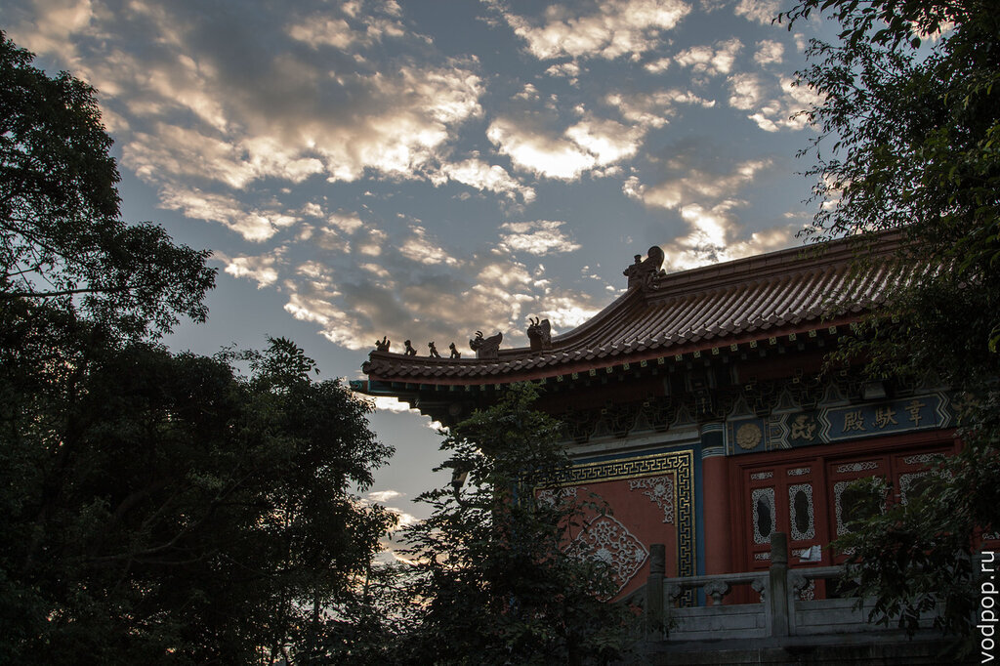

Для тех, кто увлекается буддизмом, также могут быть интересны статуи Бодхисатв на смотровой площадке Большого Будды.

Нравится статья? Узнавайте первым о выходе новых интересных историй! Подпишитесь на нас по [эл. почте](http://feedburner.google.com/fb/a/mailverify?uri=vodpop&loc=ru_RU) или в [группе ВКонтакте](http://vk.com/vodpop)

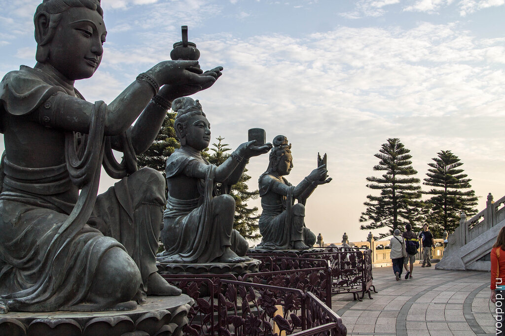

Подробная схема комплекса Нгонг Пинг

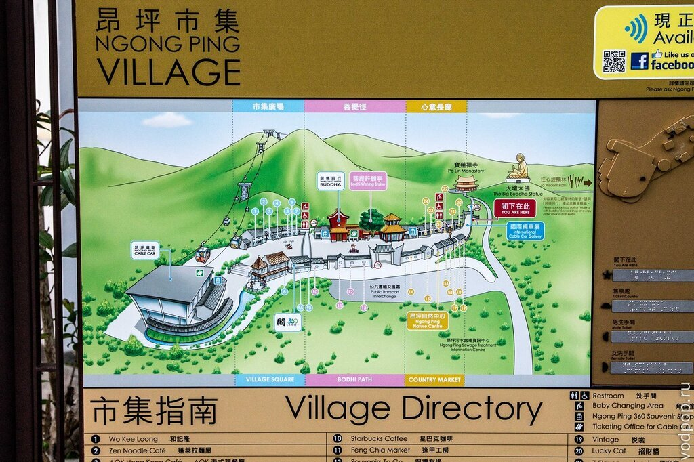

Близилось время заката, но возвращаться домой как-то не хотелось, поэтому мы решили заодно посмотреть рыбацкую деревню Тай О. Ночной пирс, уходящий на сотни метров вперед.

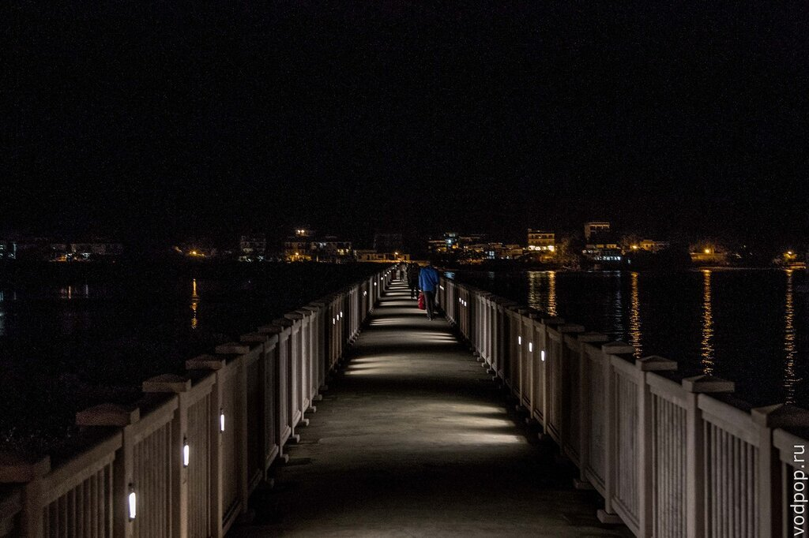

Пустые улочки с едва уловимым запахом рыбы

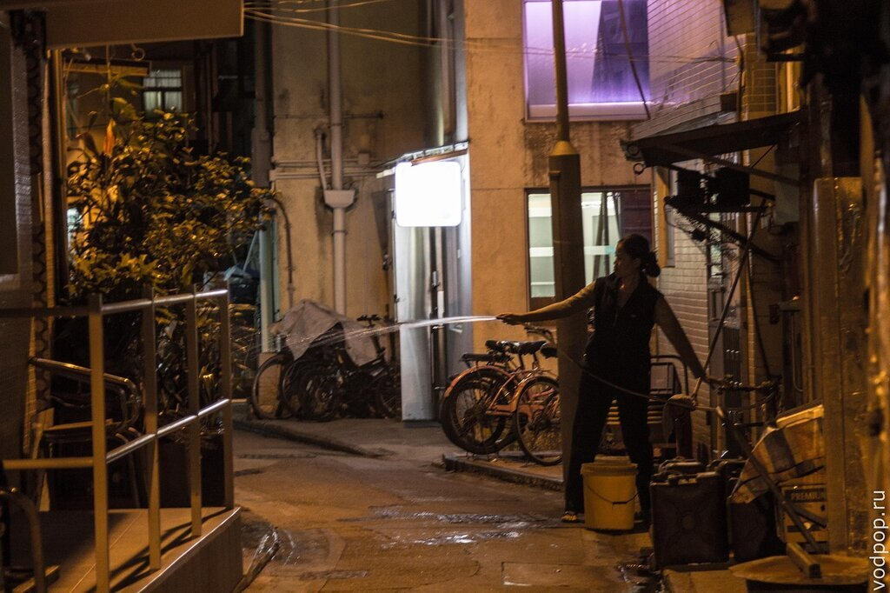

Вид с мостика на автобусную станцию и многоэтажные домики. Почти как Европа

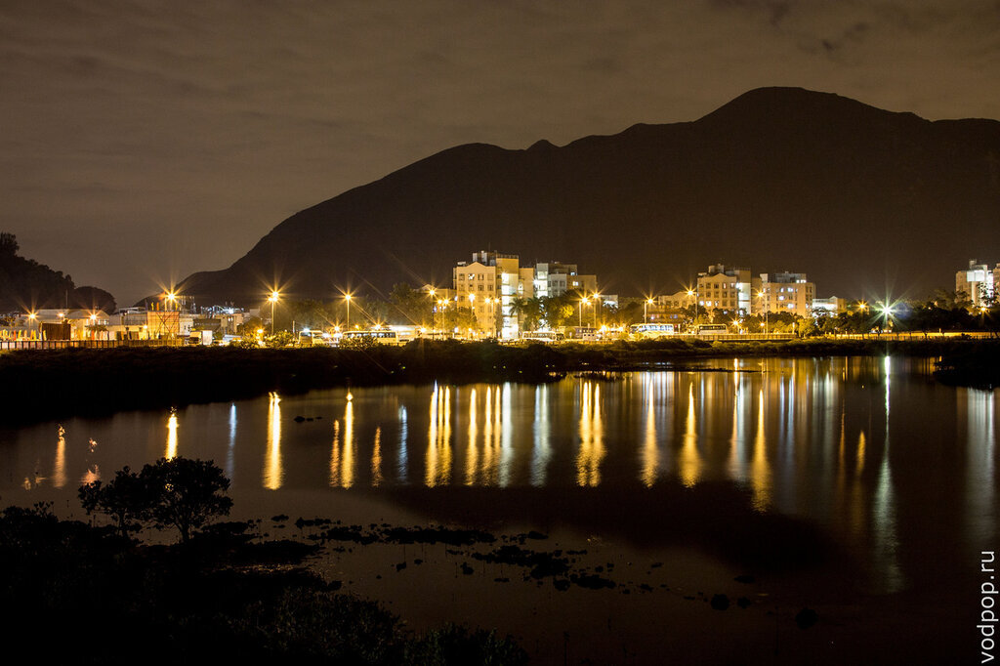

Нашли небольшой парк, с деревьями и скамейками, откуда открывался вид на остров Гонконг. Красота

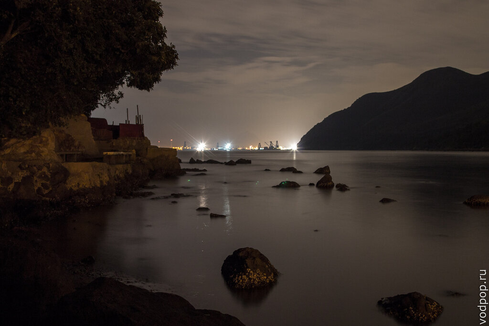

Схема деревушки Тай О - если приедете днем, можно взять лодку и сплавать до места обитания уникальных представителей морских глубин - розовых дельфинов (картинка кликабельна)

[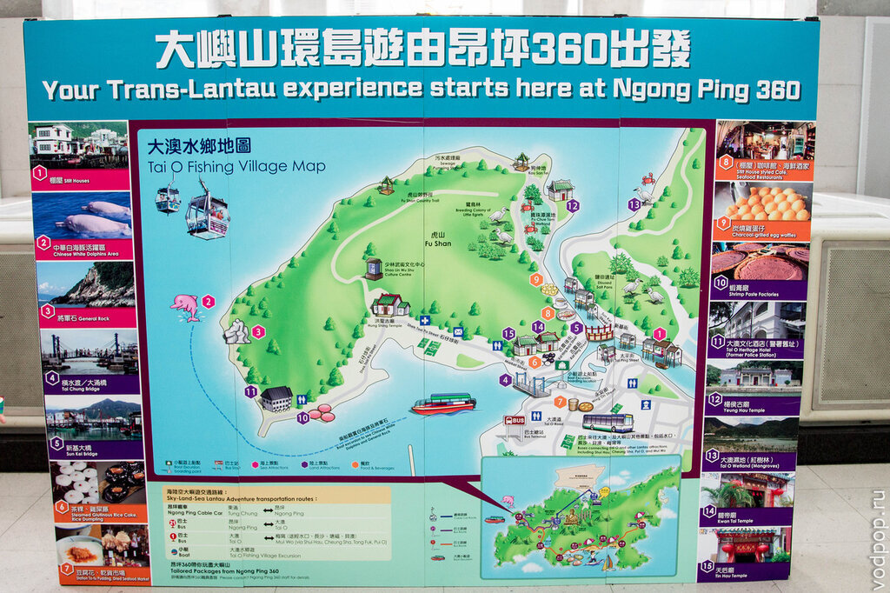](http://img-fotki.yandex.ru/get/9494/47246859.54/0_f16d3_117efb9a_XXL.jpg)

Такого количества сушеной рыбы я не видела даже на Волге.

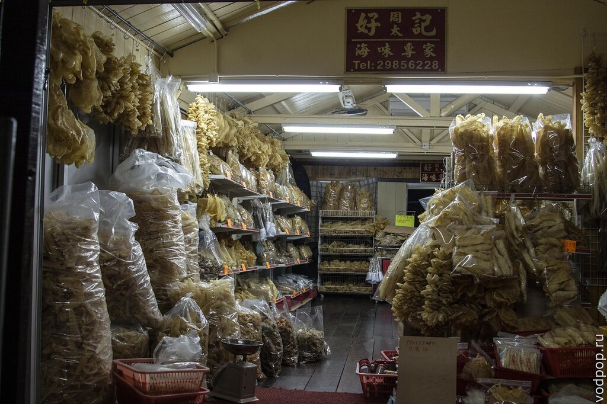

Странный объект в ночи

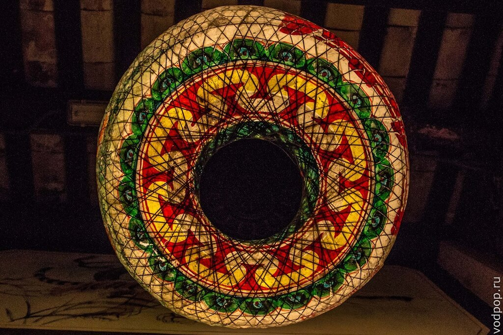

После ужина в местной кафешке мы сели в автобус и добрались до нашего хостела. О том, как добраться до этих мест самостоятельно, читайте далее.

 

## Как добраться до Большого Будды в Гонконге:

1. Доехать на метро до станции Tung Chung ( о том, как ориентироваться в метро Гонконге, я немного рассказала [в другой статье](https://vodpop.ru/chto-posmotret-v-gonkonge/ "Что посмотреть в Гонконге")), а затем подняться на Нгонг Пинг (Ngong Ping) либо на автобусе, либо на фуникулере (есть даже кабины с прозрачным дном). Цены на эти два вида транспорта существенно отличаются. Фотография с ценами на фуникулер за поездку туда-обратно (картинка кликабельна), в один конец примерно в 2 раза дешевле (около 150 HK$) 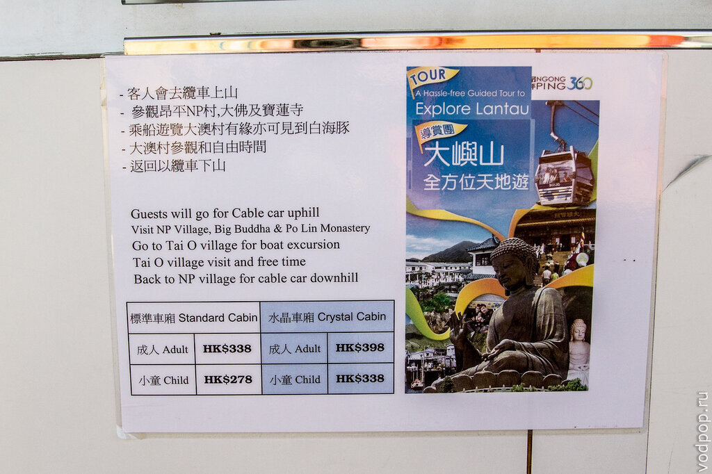 Фуникулер работает с 10. 00 до 18.00 по будням, с 9.30 до 18.30 по выходным. Не советую приходить к открытию и закрытию, а уж тем более ехать в выходной день - народу будет масса, очередь на фуникулер может растянуться на пару часов. Мы выбрали вариант с автобусом - так дешевле и быстрее: На карте отмечены все маршруты автобусов, которые проходят через остров Лантау. Невероятно удобные карты, которые не позволят вам заблудиться. К Большому Будде мы добирались на автобусе №23 - 40 минут лихого подъема на вершину, и мы на месте. По цене куда более демократично, чем фуникулер: 17  HK$ в будни и 27  HK$ в выходные. 
2. С причала Central, который находится рядом с одноименной станцией метро, доплыть до причала Mui Wo на острове Лантау за 12  HK$, затем на прямом автобусе №2 ( 17 HK$ в будни и 27  HK$ в выходные).

## Как добраться до рыбацкой деревни Тай О в Гонконге:

1. От Большого Будды автобусом №21
2. От станции метро Tung Chung автобусом №11
