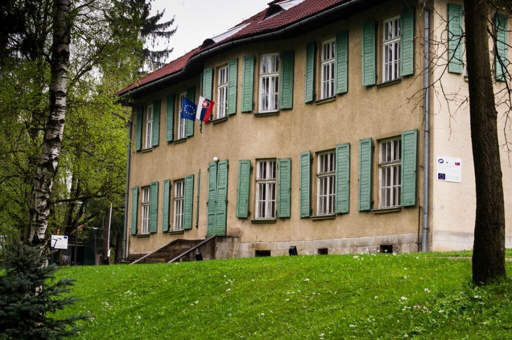
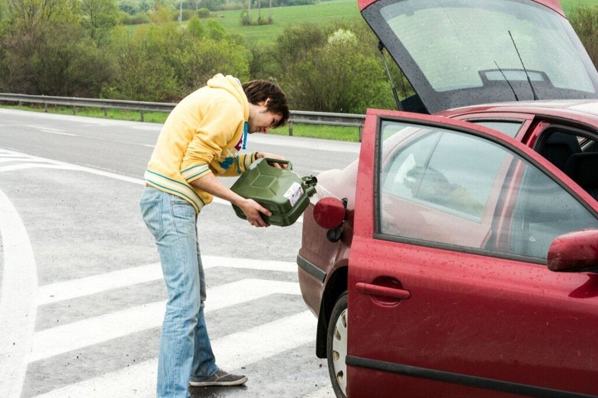
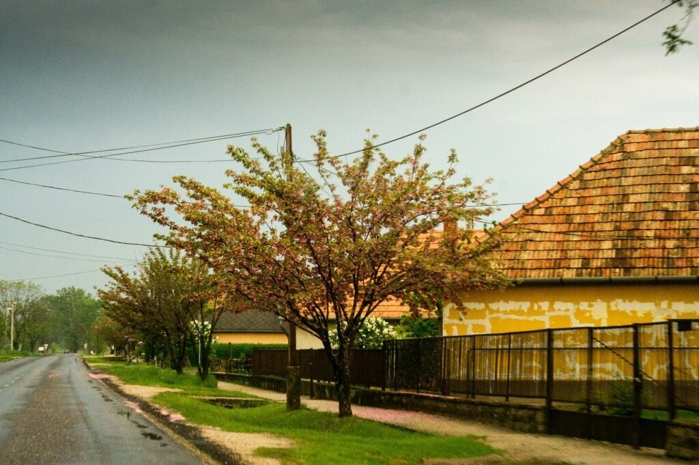
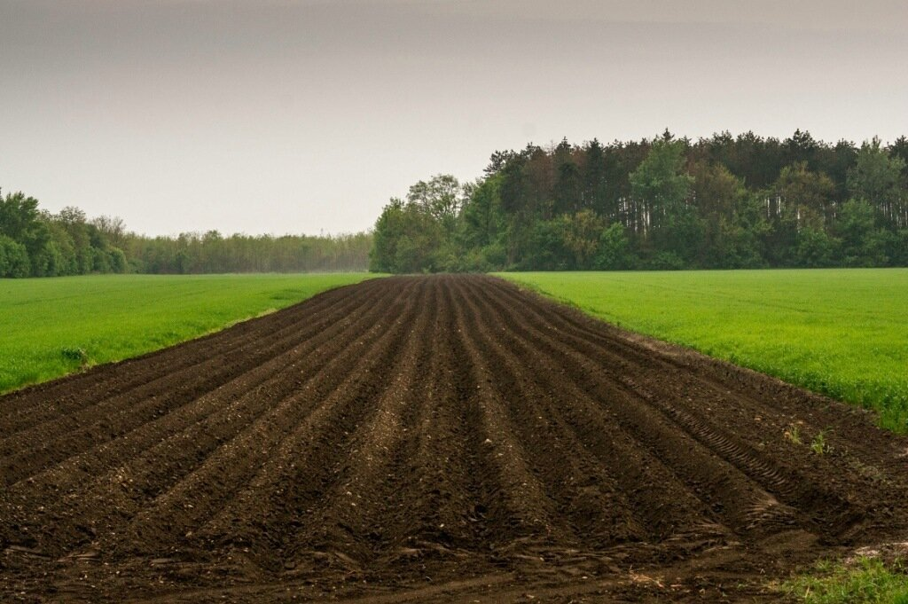
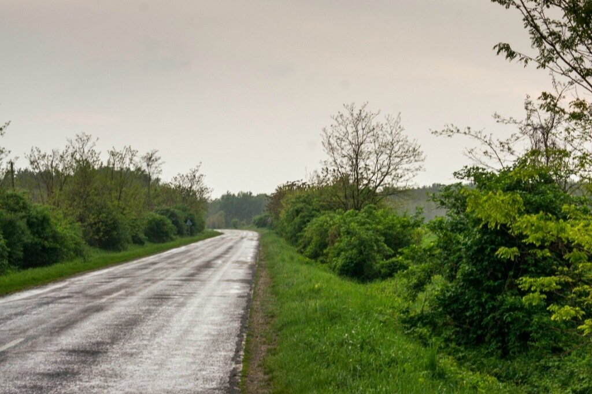
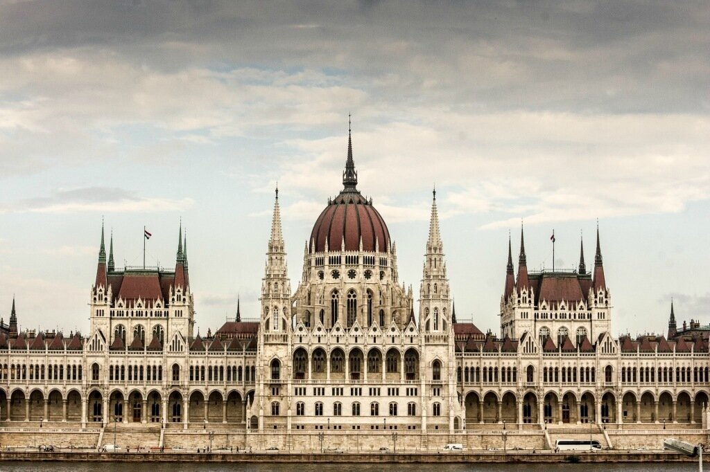
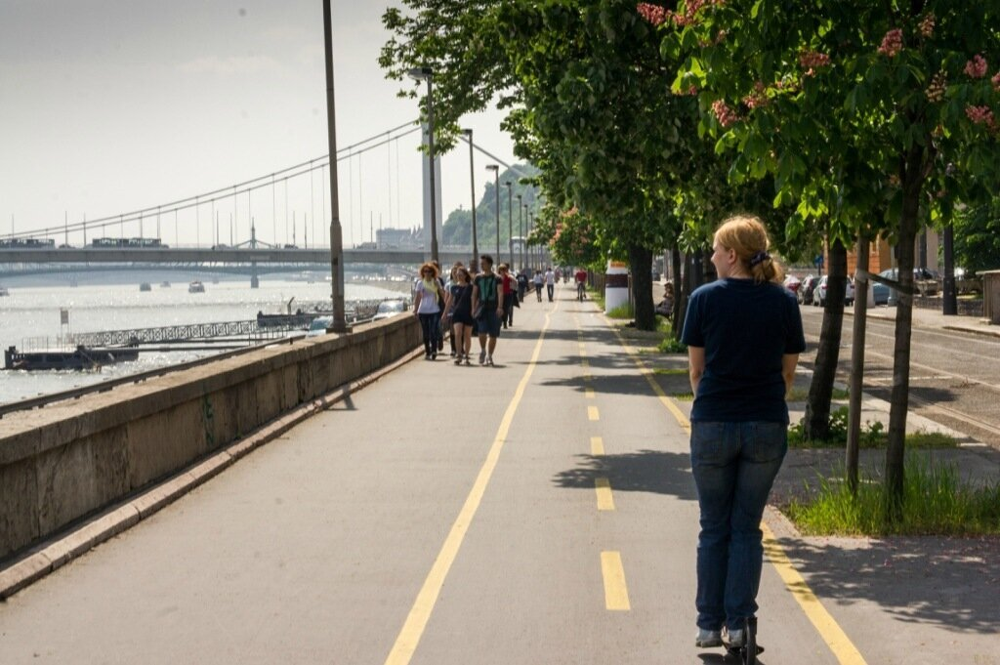
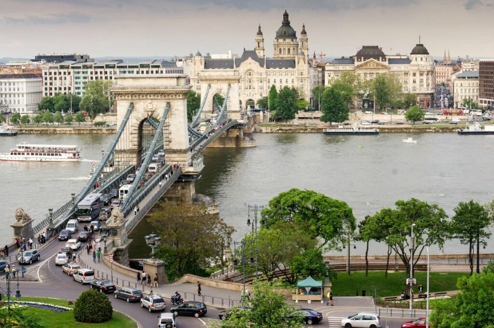

Никогда не тянуло в страну с этим непроизносимым названием - Magyarország, однако столица и страна в целом произвели приятное впечатление. По дороге мы проехали  Словакию без остановок - Братиславу мы уже видели и даже были в одном из многочисленных замков, стоящих на холмах.

<!--more-->

Была попытка посмотреть чью-то резиденцию, но нам хватило 10 минут, чтобы оббежать двухэтажное зданием со всех сторон и продолжить путь. 

Единственное, что омрачало наш путь в тот момент - это отсутствие бензина в баке. Заправок в Словакии откровенно мало - они сосредоточены около крупных поселений, а вот горную дорогу сопровождают разве что знаки.. После того, как стрелка совсем упала "за ноль" и прошло еще полчаса, мы решили остановиться и залить топливо из канистры. Владимир Подшивалов, спасибо тебе!

Так получилось, что в первый день путешествия по Венгрии мы пожадничали 10 евро за виньетку и поехали по бесплатным "сельским" дорогам. Венгерские деревушки почти также уютны, как французские.

Кажется, вся Европа активно занимается земледелием -такие поля были в каждой стране.

Дороги довольно приличные - не автобан, но 110 ехать вполне комфортно.

Погода менялась очень резко - с Польши нас преследовала наша маленькая персональная тучка, которая исправно 1-2 раза в день поливала нашу машину. Именно дождь и удивительно полезная вещь на заправках в Европе в виде ведра воды и щетки для стекла, помогали что-то видеть в лобовое стекло. Будапешт нас встретил проливным дождем с пузырями на асфальте - доехав до центра я уже чуть падала от усталости, поэтому руль был перепоручен Климу (менялись, пока стояли на светофоре, но даже за 10 секунд успели промокнуть). "Любимый" макдак с free wi-fi, поиск гостиницы, сообщения родителям - и вот мы уже едем по берегу Дуная в сторону нашего ботеля - отеля - кораблика, стоящего на воде. Это уже третья подобная гостиница и честно говоря, у меня мало приятных впечатлений. Быстро позавтракав, мы отправились в центр Будапешта. Вид на Парламент с противоположного берега Дуная.

Всем, кто ищет бесплатную парковку в центре рекомендую ехать вдоль реки и искать свободное место там - местные напаркованы вдоль всей береговой линии. Экономят. Город был образован в 1873 году из трех городов - Буды, Обуды и Пешта. Город достаточно большой и интересный для туристов. Наш выбор был между самокатами и туром на автобусе с аудиогидом, в результате чего мы все же выбрали двухколесных друзей и поехали смотреть город.

Шикарные велосипедные дорожки проложены по всему городу. Невероятно удобно! Покатавшись пару часов, мы решили зайти в Музей, где проходила выставка фотографий, очень похожая на Best Of Russia. Сотрудники музея сразу пустили нас без билетов в гардероб, чтобы сдать самокаты (!). У них это абсолютная норма, в Москве я не пробовала, но можно попытаться сходить в музей Пушкина с самокатом или велосипедом и попытаться сдать их в гардероб. Хихи. На выходе из музея мы увидели толпу школьников и родителей. Очевидно, это что-то вроде нашего последнего звонка.

Наша тучка вновь застала нас врасплох, поэтому чаепитие в одной из кафешек по соседству растянулось на час. Удивительно, но асфальт почти мгновенно становился сухим - когда едешь на самокате без заднего крыла, это особенно актуально.

На мой взгляд Будапешт - тот город, которому стоит уделить несколько дней. Можно купить путеводитель или побродить по улочкам в поиске своих собственных открытий. Мы исследовали город до полного физического истощения. Сэкономив 400 рублей за подъем на фуникулере на Будайскую Крепость, мы взобрались туда пешком с самокатами в руках. Вид необыкновенный, как с открытки.

Будайская Крепость (или Замок) была уничтожена и восстановлена несколько раз. Последнее разрушение пришлось на 1944 год - Вторую Мировую войну. Быть может, есть страны, которых не коснулась война, но в этой поездке тут и там мы натыкались на фотографии послевоенных руин. Невероятно страшно видеть, сколько бед натворил один человек и его приспешники. Но несмотря на это, сейчас город выглядит прекрасно и вселяет уверенность, что сюда стоит еще вернуться.

