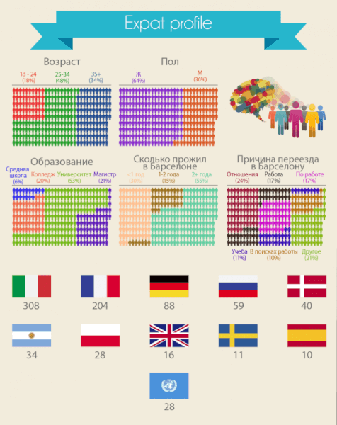

Первое социологическое исследование от ОК Апартмент подробно расскажет, чем именно недовольны люди, которые живут в Барселоне.

<!--more-->

Немного необычная для меня тема, но уверена, что среди читателей нашего блога найдутся те, кто не только много путешествует, но и планирует переехать в любую другую страну, или конкретно в Барселону.

Итак, первого своего рода социологическое исследование, было проведено агентством, специализирующимся на аренде квартир в Барселоне. Опрос состоял из 20 вопросов открытой формы, и ответы были проанализированы и распределены на 9 негативных факторов, такие, экономика, “холодный нрав” барселонцев и др.

Для тех, кто первый раз в жизни слышит слово "Каталония" - это автономная область Испании, столицей которой является Барселона. И официальных языков тут целых три. Самый популярный, конечно, испанский, но каталанский не слишком ему уступает.

## **Особенности опроса**

Опрос был произведен в период с 1 июня до 31 декабря 2015 года. 88% были опрошены через онлайн-форму и 15% участников опроса заполнили бумажную-форму, что, впрочем, не должно сильно влиять на результаты исследования.

Всего в опросе приняло участие 850 иностранцев из 26 стран, что живут в Барселоне по меньшей мере 3 месяца. Каждый участник выделил от 1-3 факторов.

Характеристики опрошенных следующие: 

Как вы можете догадаться, большинство экспатов хочет остаться в городе. В процентном соотношении:

По результатам был выявлен фактор, который упоминался в ответах чаще всего - явление "массового туризма" стало главной проблемой для экспатов.

Каталонские власти предложили несколько путей решения данной проблемы. Агентство ОК Апартаменты, которое специализируется на услугах [по аренде квартир в Барселоне](http://www.barcelonacheckin.com/ru/n/accomodation.php), также продумало новые пути разрешения данного вопроса.

Против "массового туризма" выступило 34% всех опрошенных. Далее следует локальный характер (26%), проблема загрязнения (19%) и уровень экономики (16%). Были также рассмотрены нерелевантные ответы, как "Мне нравится все" и "Мне все не нравится". В общей сложности релевантные ответы составили 646 ответов.

По стране и национальности список стран-участников срез составляет: Италия (242), Франция (164), Германия (72), Россия (50), Дания (36), Аргентина (28) и Польша (22). Ответы участников из других стран, общая сумма которых составила менее, чем 20 ответов, не были учтены.

#### **Мы рассмотрим все 9 негативных факторов:**

## Первый фактор: массовый туризм.

Напоминаем, что респондентам было предложено отметить от 1 до 3 негативных фактора в Барселоне. Если резюмировать все комментарии, то явление массового туризма отмечается в 28% всех ответах респондентов русского происхождения.

В инфографике вы можете посмотреть все факторы и другие комментарии экспатов. Больше всех, кто недоволен этим фактором поляки (40%) и итальянцы (31%) и меньше всего этот фактор беспокоит датчан (22%) и русских (24%).

**Наиболее значимые комментарии:**

- “Слишком много туристов в течение всего года”
- “Туристы приезжают и ведут себя в городе, как дома”
- “Неуважительное поведение туристов”

**Исходные данные** В Барселоне проживают чуть меньше 1,6 млн. жителей и сейчас поток туристов составляет более 8 млн. в год. Это четвертый город, самый посещаемый в Европе, после Лондона, Парижа и Рима. Он является ведущим круизным портом в Средиземноморье. Предполагается, что сумма, которую приносит туризм в Барселоне равняется 20% от ВВП. **Проблема** Проблема устойчивости туризма и качества жизни горожан. Рост туризма особенно четко отразился в таких районах, как Барселонета, Рамбла и близлежащие районы, а также Саграда Фамилия и Парк Гуэль. Напряженность между соседями и массовым туризмом сосредоточены вокруг следующих аспектов:

- Замена коммерческой зоны района на сплошные магазины сувениров, бары и рестораны.
- Повышение цен на жилье для туристов и "поглощение" недвижимости туристическим сектором.
- Недовольство местных жителей из-за шума, трафика и поведения туристов.

В результате происходит отток местного населения. **Пути решения проблемы** Некоторое время назад местные власти приняли меры, направленные на смягчение негативных последствий массового туризма. Текущая политика направлена на регулирование предложений аренды. В 2005 году обязательные лицензии для квартировладельцев, желающих сдавать недвижимость в собственности в аренду, выдавались всем. Особенно это приветствовалось для тех владельцев, чьи квартиры находятся в историческом центре города. В июле 2015 года выдача таких лицензий прекратилась и правительство крепко взялось за урегулирование этого сектора. Совсем недавно, 23 февраля 2016 года, был представлен прототип будущей организации - Pla Especial Urbanístic d'Alotjamients Turístics (PEUAT), которая урегулирует весь сектор туристической недвижимости (отели, пансионы, туристические апартаменты и пансионаты). Цель состоит в том, чтобы уменьшить количество туристов, проживающих в центре города, и сохранить культурный облик города. Муниципалитет хочет создать новую систему, при которой распределение доходов от туристов будет справедливым, а также поможет равномерно распределить туристический поток. **Как можно решить проблему?** Известно, что историческая Барселона привлекает туристов больше, чем туристическая. Нью-Йорк не так давно запустил кампанию под названием “От района к району”, смысл которой было показать районы, что находятся за пределами Манхеттена. Благодаря этой кампании удалось увеличить поток туристов и улучшить экономику за пределами традиционных туристических мест города. В каталанской столице приняли похожую инициативу. В районе Hota Guinardó местная организация разработала 10 направлений, связанных с историческим, ландшафтным и этнографическим аспектами этой области. Материал был опубликован на сайте правительства, но он доступен только на каталанском языке . Таким образом необходимо также поддержка со стороны политиков для популяризации такой идеи, чтобы способствовать развитию идеи для широкой публики, а не только “каталаноговорящих”

## “Холодный нрав”: фактор 2 (26%)

26% упоминаний о закрытом характере и холодном нраве барселонцев:

- "Закрытый менталитет местных жителей"
- “Люди с грустным и злым выражением лица”
- “Люди "холодные" "
- "Некоторые люди достаточно категоричные и самодостаточные, и иногда это не очень удобно"
- "Некоторые люди очень закрытые и даже не хотят приветствовать вновь прибывших."

Этот аспект не нравится аргентинцам (45%) и русским (29%) и меньше всего уделяют этому внимание немцы (17%) и поляки (17%).

## Уровень загрязнения: фактор 3 (19%)

Третий фактор, который был упомянут в опросе - это загрязнение. 15% опрошенных недовольны загрязненным воздухом города, грязным улицами, шумом. Что касается национального среза: Французы (20%) и Итальянцы (16%).

## Экономика: 4 фактор (16%)

Экономические проблемы были упомянуты участниками в 13% ответах: Больше на этот фактор жалуются русские (20%) и поляки (17%). Следуя последним исследованиям Центра Социологических Исследований (CIS) на тему что больше всего беспокоит испанцев: безработица (78,8%), коррупция (43,7%) и экономика (25%).

В этом смысле очень удивляет невысокий процент упоминаний о низкой экономике среди самих испанцев.

#### Остаточные факторы (5-8% опрошенных) Негативные факторы, которые были упомянуты меньше всего:

## Фактор 5: Небезопасность города (7%):

“Карманники и воры-велосипедисты” / “Опасные зоны”

## Фактор 6: Проблема "Каталония-Испания" (6%)

"Каталоницизм" / “Национализм”

## Фактор 7: Бюрократия (5%)

“Сложности с бумагами, которые приходится преодолевать” / “Административные трудности”

## Фактор 8: Еда (3%)

“Продукты питания и супермаркеты"

## Фактор 9: Полиция (1%)

“Полиция наблюдает за проблемами, но не решает их.”

Надеюсь, что данное исследование покажется вам интересным и приоткроет глаза на иммиграцию. Как говорится, нас там никто не ждет, но секрет в том, что нас никто нигде не ждет...
