Белый храм в Чианг Рае или Wat Rong Khun - один из самых популярных объектов фотографирования во всем Таиланде. Невероятной красоты и архитектуры храм построен всемирно признанным художником Таваном Дучани (Thawan Duchanee).

<!--more-->

 

Около храма всегда собирается толпа людей, поэтому красивый кадр надо еще постараться поймать

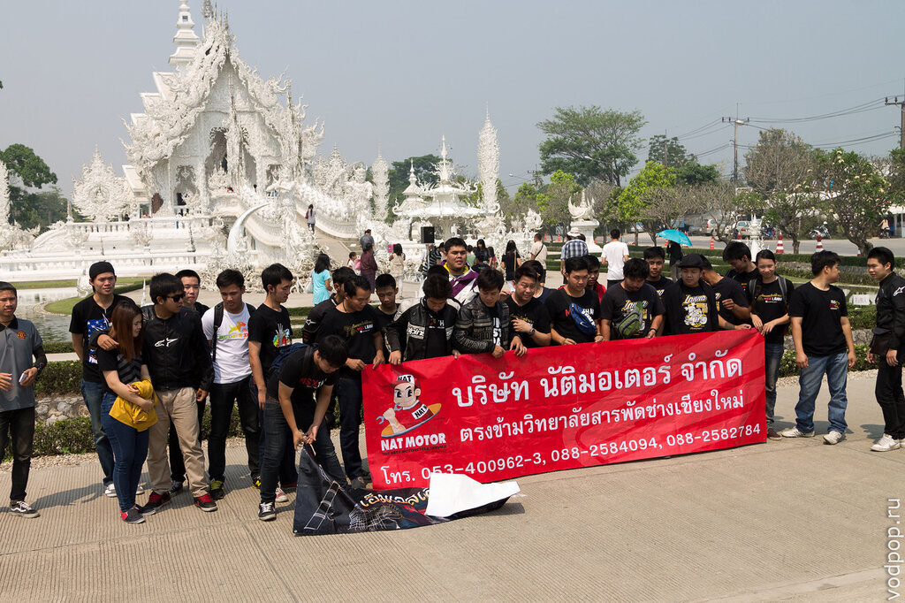

Устрашающая маска сатира, видимо, призвана изгонять злых духов

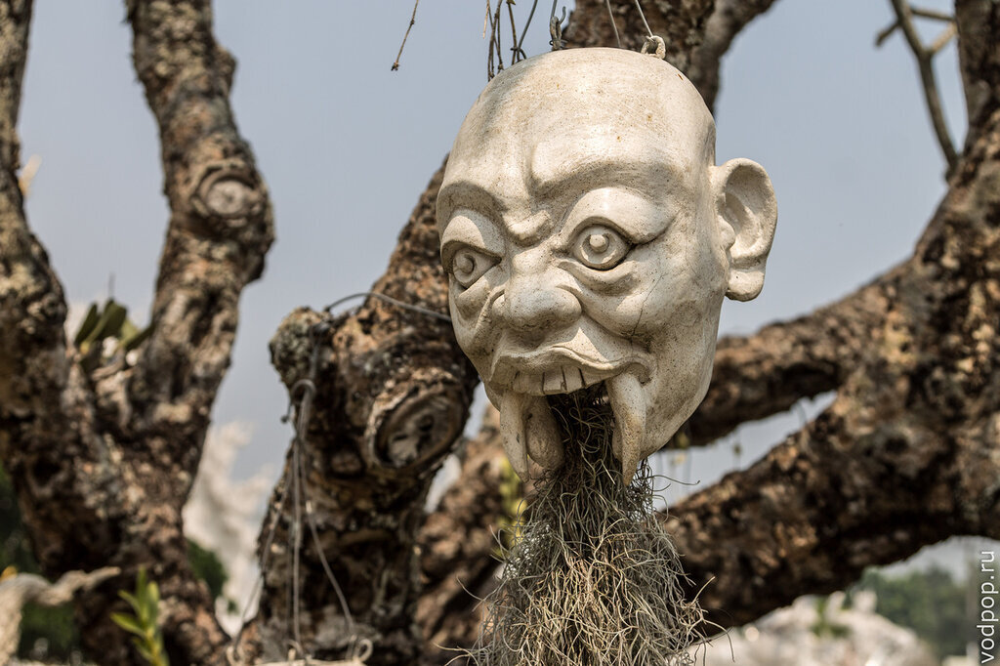

А, может, это такой цветочный горшок?

Рядом с храмом деревья с тончайшими листьями из металла - их можно купить за 50 бат и сделать надпись (фломастеры лежат тут же)

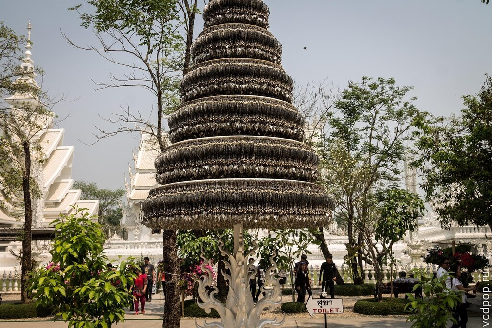

От них идет невероятно красивый перезвон - мы не удержались, и купили одну штучку (все средства идут на расширение храма)

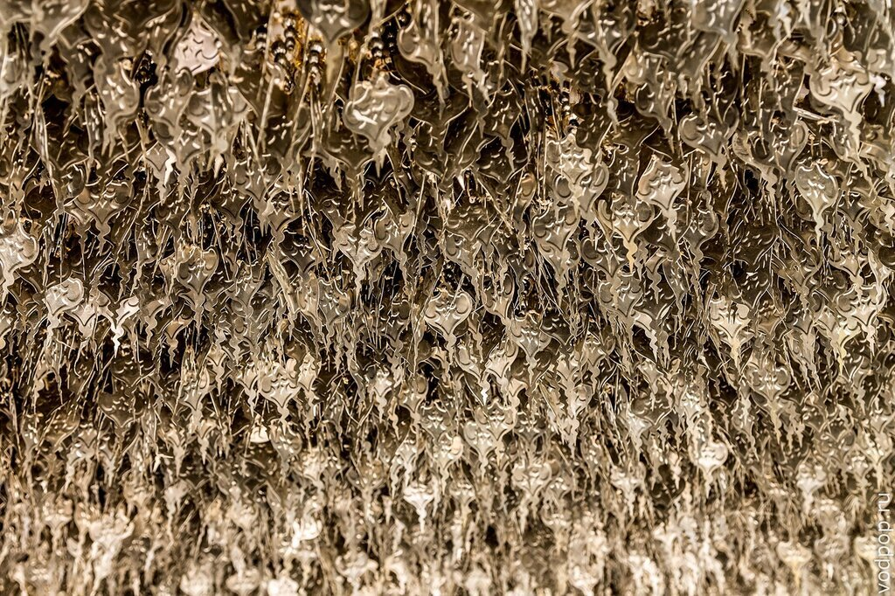

Стоит только заглянуть за красивый фасад, как видно, что тут идет работа полным ходом

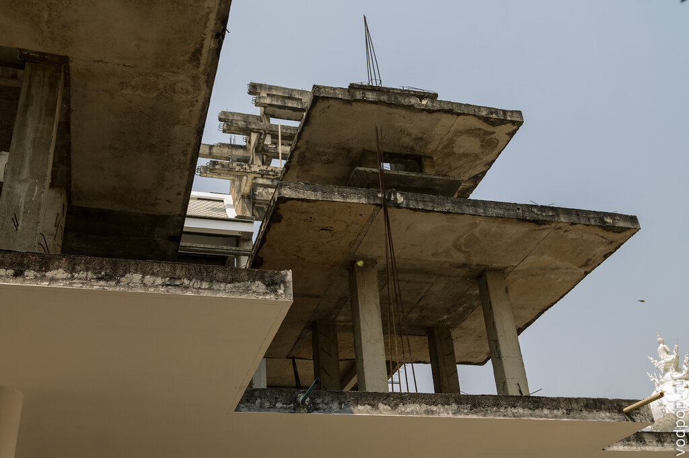

Узоры "листочка" повторяют те, что на зданиях

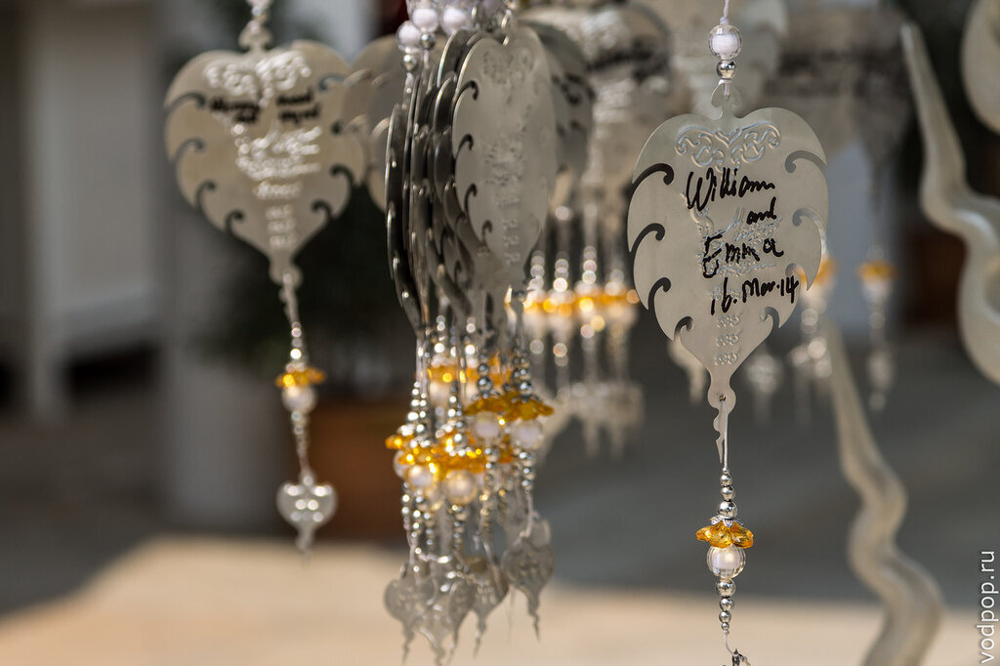

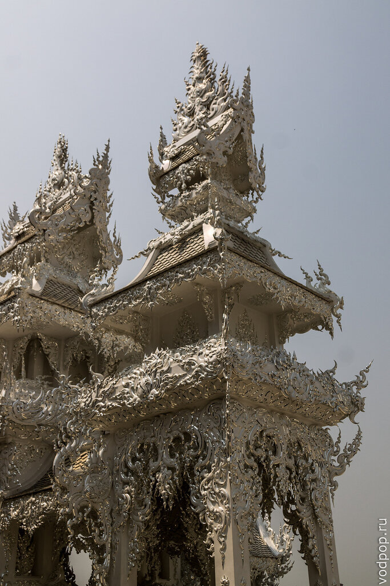

На солнце храм сияет так, что без солнцезащитных очков немного больно смотреть. Дело в том, что храм покрыт не только белой штукатуркой, но и серебряными узорами.

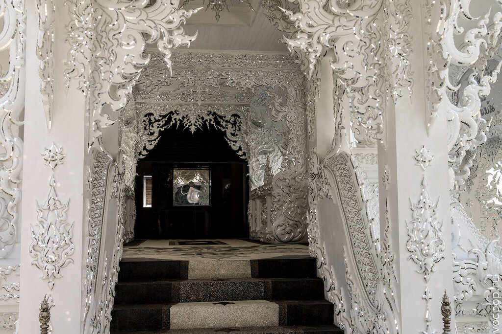

До написания статьи мы с Климом думали, что видели самого Тавана Дучани за работой. Но он умер как раз в 2014 году от гепатита, в возрасте 74 лет. Поэтому скульптор на фото, увы, не он.

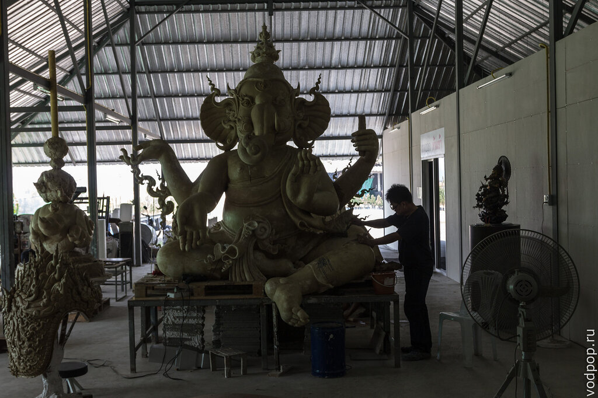

Что интересно, так это то, что и в Черном, и в Белом храмах художник как будто нарочно наслаивает религии, символику и пр. атрибутику веры друг на друга: к сожалению, внутри главного храма нельзя было фотографировать, но в интернете множество фотографий с Микки-маусом, Нео из Матрицы, Майкла Джексона и Сейлор Мун на стенах. Таван изображал все, и всех, кто цеплял его творческую натуру. Удивительно, что он достиг такой независимости и смог делать практически все, что хотел в своем творчестве.

Если бы не толпа людей, было бы вдвойне приятно смотреть на такую красоту. Лучше всего приезжать пораньше, к 8-9 утра, пока никого еще нет.

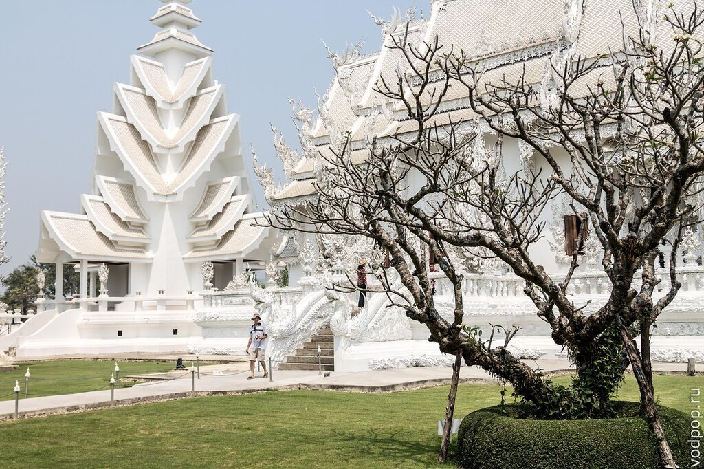

А это что-то вроде чистилища - перед входом в храм слева и справа фигуры людей, протягивающих руки в мучительных позах.

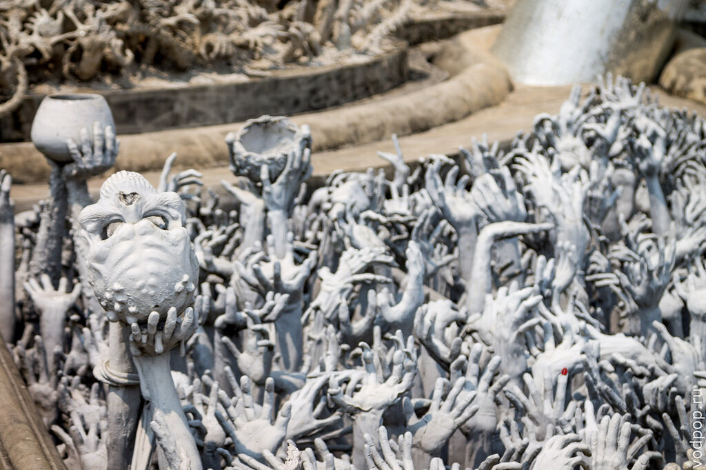

Фотогенично изогнулся

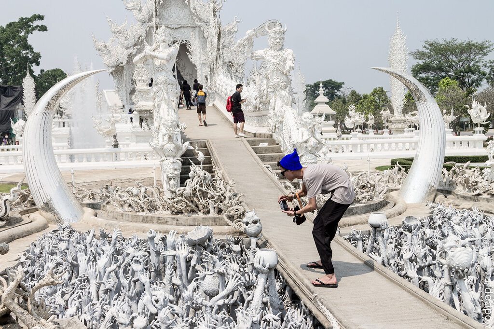

 

Как добраться до Белого храма в Чианг Рае.

<iframe style="border: 0;" src="https://www.google.com/maps/embed?pb=!1m29!1m12!1m3!1d60038.367931073306!2d99.76103973249322!3d19.86540937578616!2m3!1f0!2f0!3f0!3m2!1i1024!2i768!4f13.1!4m14!1i0!3e6!4m5!1s0x30d706670927ea4b%3A0x386bd811b93aa61e!2z0KfQuNCw0L3QsyDQoNCw0Lkg0KLQsNC40LvQsNC90LQ!3m2!1d19.9071656!2d99.83095499999999!4m5!1s0x30d70e54b3baf1e3%3A0x766017ac8d5fc4e8!2zV2F0IFJvbmcgS2h1biwgUGEgTyBEb24gQ2hhaSBSb2FkLCBBLiBNdWFuZywgQ2hpYW5nIFJhaSwgNTcwMDAsINCi0LDQuNC70LDQvdC0!3m2!1d19.824405!2d99.763048!5e0!3m2!1sru!2sru!4v1426016701969" width="600" height="450" frameborder="0"></iframe>

Постарайтесь одеться поприличнее - все-таки это храм, и в коротких шортах сюда не пустят. Лучше всего приехать ранним утром, пока нет толпы и жаркого солнца.

Если захотите совместить просмотр Белого храма с Черным храмом, будьте готовы к долгой дороге.

Вокруг храма много сувенирных магазинов, а если смотреть прямо на главный храм, то по левую руку будет картинная галерея - там можно немного передохнуть от палящего солнца. Цены на все рядом с храмом выше в 2 раза, чем на соседней улице, поэтому не советую здесь устраивать обед - лучше отъехать пару кварталов, и покушать в тишине и спокойствии.
