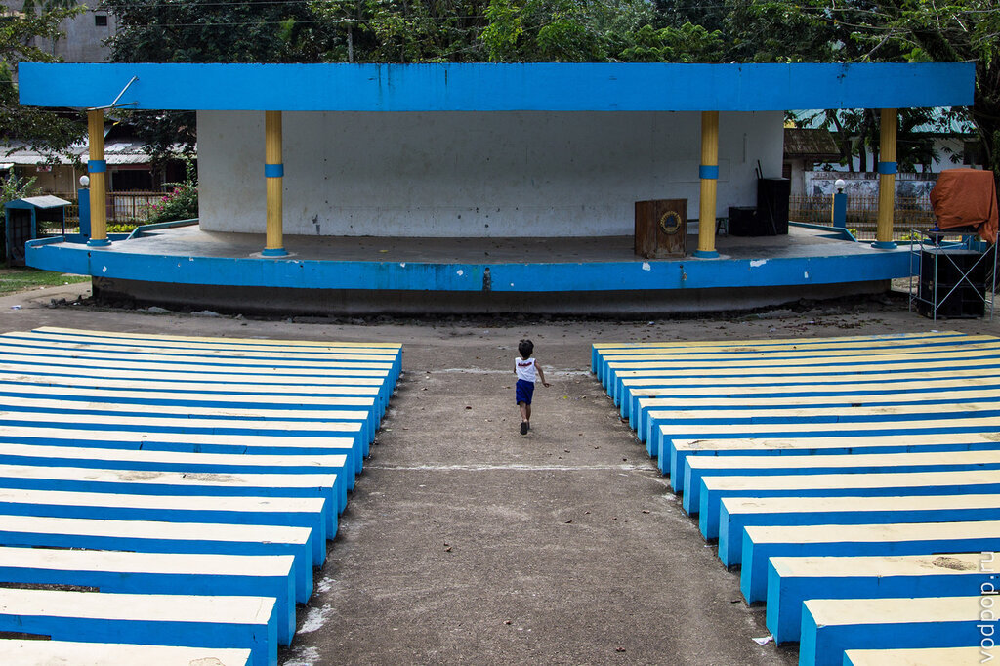

На обратном пути из Эль Нидо мы решили остановиться в небольшом городке Тай Тай, бывшей столице Палавана. В этой статье мы расскажем про то, где остановиться в Тай Тай, вкусно поужинать, и что посмотреть в окрестностях города.

<!--more-->

Начнем, пожалуй, с гостиницы. Вдоль Северного шоссе тут и там расставлены плакаты с надписью "Casa Rosa #1 Tay Tay". И плакаты, на удивление, не врут! Мы выбрали это место, предварительно прочитав все отзывы о нем в интернете, и ни разу не пожалели.

Во время самого тяжелого участка дороги, между [Эль Нидо](https://vodpop.ru/kak-dobratsa-do-el-nido/ "Как добраться до Эль Нидо") и [Тай Тай,](https://vodpop.ru/okrestnosti-tai-tai/ "Изучаем окрестности Тай Тай") мы потеряли все силы, и приехали в гостиницу в полу-вареном состоянии. На территории можно спрятаться от жары в тени огромных пальм и деревьев.

Для мотоциклов есть своя собственная залитая бетоном тропинка. Хотя некоторые постояльцы гостиницы табличку не замечали и возмущались на Клима, который на всех парах несся вверх. А иначе там не заедешь - очень крутой подъем.

Так выглядит главный вход. Табличка на реконструкции. Кстати, дорожка для мотоциклов слева. А еще левее есть ворота, ведущие в частный дом. Там тоже сдаются комнаты. Цену не узнавали, но песо за 400-500 точно можно договориться.

Территория украшена цветами, которые растут в оригинальных горшках из плода кокоса. На самом деле там обычные пластиковые коричневые горшочки, но их весьма умело прячут.

Веранда, на которой мы проводили наши рабочие часы, по совместительству была и кафе для постояльцев и гостей Casa Rosa. На веранде стоял WiMax, который обеспечивал самую высокую скорость интернета на Палаване (больше об интернете на Филиппинах читать [тут](https://vodpop.ru/internet-na-filippinah/ "Связь и интернет на Филиппинах"))  и приятный рабочий процесс без лишних нервов. Большую часть времени мы с Климом сидели там одни, пару раз в день заказывая еду. К концу повара научились угадывать наши желания почти без слов.

Нравится статья? Узнавайте первым о выходе новых интересных историй! Подпишитесь на нас по [эл. почте](http://feedburner.google.com/fb/a/mailverify?uri=vodpop&loc=ru_RU) или в [группе ВКонтакте](http://vk.com/vodpop)

Наш домик снаружи. Верный конь отдыхает. Он еще не знает, что ему предстоит вскоре сломаться.

Немного вида изнутри. Кровать, тумбочка, стул. В домике мы только спали и ходили в душ. Кстати, горячей воды тут нет. Климентий жаловался, но я беспощадно отправляла его в душ два раза в день.

Такой вид очень мотивирует работать. Отвлекала от работы всякого рода живность. По вечерам, даже намазавшись спреем, мы не могли отгородить от себя надоедливых мушек и муравьев, желающих надкусить первыми наш обед. Природа, однако. И обратите внимание на высокое здание.

Вблизи оно выглядит невероятно похоже на аттракцион Hollywood Tower Hotel в Диснейленде (можете сравнить с фотографией в [статье про Диснейленд](https://vodpop.ru/disneylend-frantsiya/ "Диснейленд в Париже. Цены и инструкция для новичков")).

Это старое административное здание уже доживает свои годы, в то время, как новое, по соседству с Casa Rosa становится все более и более современным. Внутри

И снаружи

А на двери висит распечатка с предупреждениями о предстоящих ураганах. За 5 дней до того, как на Филиппины обрушился тайфун Хаян.

По соседству с администрацией находится открытая сцена

А сбоку от здания стоит вот такой странный агрегат. Мне кажется, что это для розыгрыша лотереи - у дальней стенки этого зеленого барабана есть отверстие, чтобы просунуть руку.

Генератор шумит без перерыва, хотя мы не поняли, почему. Ведь электричество в [Тай Тай](https://vodpop.ru/okrestnosti-tai-tai/ "Изучаем окрестности Тай Тай") отключают с 6.00 до 18.00.

Затем мы решили зайти внутрь школы. На входе нас спросили, зачем мы туда идем. Наш ответ "просто посмотреть" их устроил.

Замечательные школьные правила. Жалко, взрослые им не всегда следуют

Дети улыбчивые и веселые. Такие же, как и везде. Правда, при виде светлокожего человека дружно кричат "хаааай".

А некоторые стеснительно прячутся

Даже миссия прописана. Всем бы так!

Затем можно сделать небольшой кружок на мотоцикле. Мимо [знаменитого Форта](https://vodpop.ru/taj-taj-palavan/ "Неизведанный Палаван. Тай Тай")

И пристани, откуда ежедневно уходят лодки в [Пуэрто-Принцессу](https://vodpop.ru/chem-zanatsa-v-puerto-princesse/ "Чем заняться в Пуэрто-Принцессе: Хонда Бэй, гостиницы и рестораны") и Эль Нидо.

К центральному рынку, где можно купить почти все - еду, одежду, технику, косметику

В рыбных рядах запах на любителя, к коим мы не относимся

Тут же можно купить телефон за 1000 песо и меньше (а узнать про сотовых операторах на Филиппинах можно [в этой](https://vodpop.ru/internet-na-filippinah/ "Связь и интернет на Филиппинах") статье)

И всякую мелочь -батарейки, будильники, зарядки, парео и даже наушники Монстер Бит за 300 песо.

Хотя есть довольно неплохой интернет, большинство покупает фильмы на DVD.

Отсюда же каждый день можно добраться до нынешней столицы Палавана - Пуэрто-Принцессы.

Самый большой продуктовый магазин в Тай Тай, с неплохим по местным меркам ассортиментом

Супердешевые тапки за 40 песо

Процесс подсчета покупок для нас выглядит дико. Сначала тетя записывает суммы на бумажку быстро-быстро, а затем складывает их на калькуляторе

Впрочем, лучше уж так, чем она бы считала в уме. Как мы выяснили при отправке нескольких документов на почте, с устным счетом у них беда.

А еще филиппинцы на редкость не пьющая нация. Алкоголь без дела пылится на полках.

В процессе изучения города мы остановились на обед. 35 песо за порк адобо с рисом, еще 15 за шоколадный напиток Мило

Затем мы подъехали к католическому храму Санта Моника (Santa Monica Church), построенному из крупных известняковых блоков, благодаря чему смотрится одновременно очень воздушным, но надежным

Внутри днем никого. Зато на вечерней службе в воскресенье яблоку негде упасть

В Тай Тай есть банкоматы

Правда, совершенно бесполезные для нас, из-за чего нам пришлось поехать в Рохас за снятием наличных

Такая прогулка заняла у нас часа 2, хотя расстояния тут очень маленькие. Вот мы уже почти у Casa Rosa. Очередная баскетбольная площадка. Баскетбол и караоке - два самых популярных развлечения на Филиппинах.

Только  зашли на веранду, как на улице пошел дождик. Дожди на Филиппинах дело привычное, короткое и не мешающее образу жизни филиппинцев

Тай Тай на карте

Надеемся, что наша прогулка доставила вам минутку удовольствия! Если есть какие-то вопросы, спрашивайте в комментариях.
