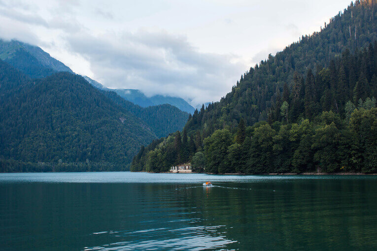
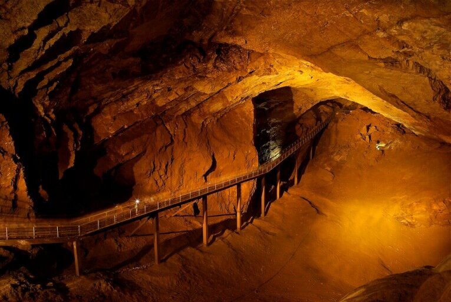
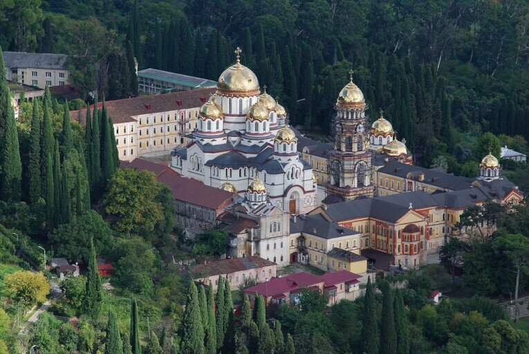
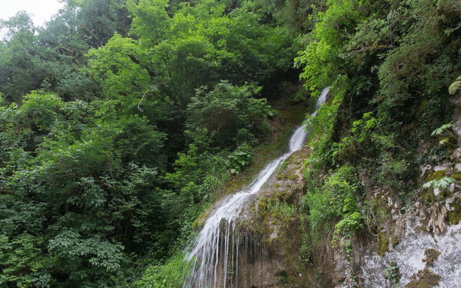
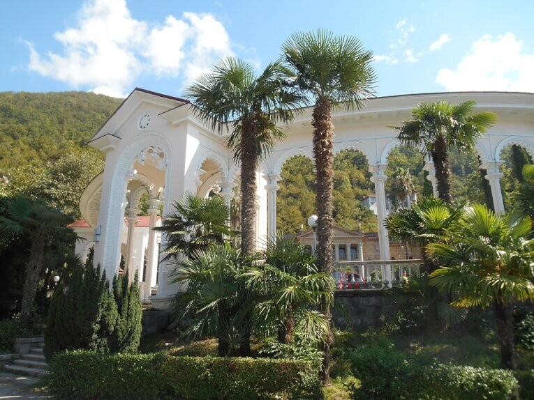
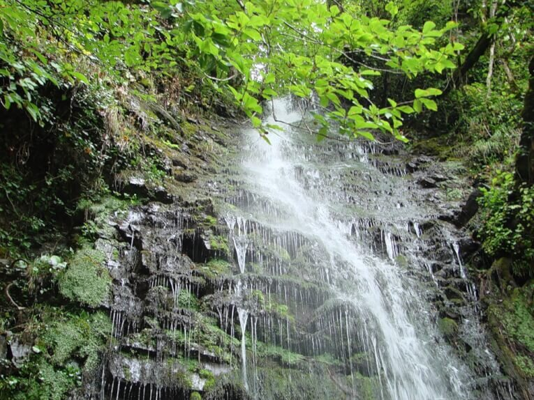
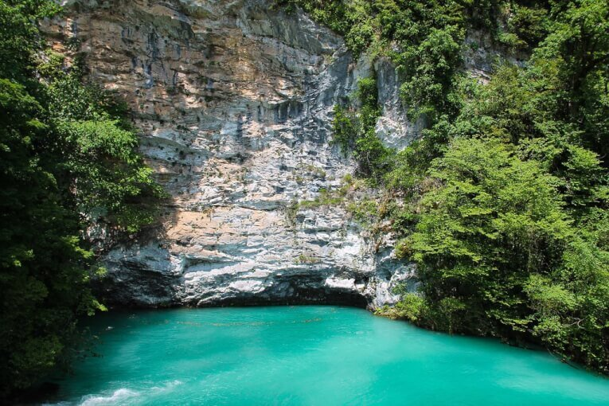
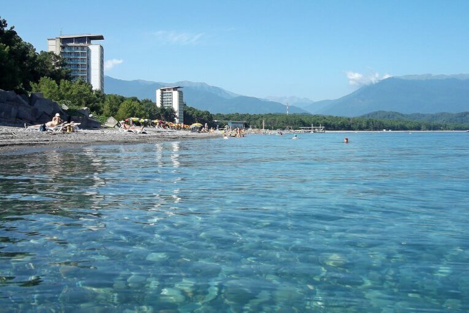
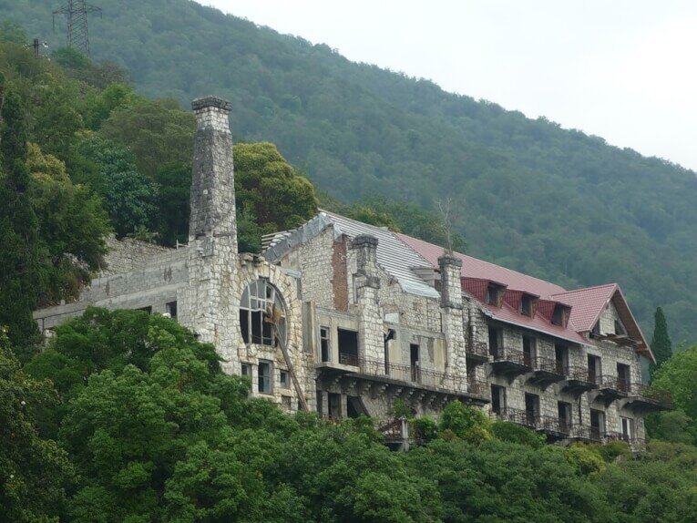

Абхазия - удивительная страна, с множеством достопримечательностей, вкусными фруктами и гостеприимными людьми. Для тех, кто уже увидел все [олимпийские объекты Сочи](https://vodpop.ru/10-mest-kuda-shodit-v-adlere/), это отличный вариант поездки за природными достопримечательностями.

Гагра, Новый Афон, Сухум и Пицунда обладают невероятным туристическим потенциалом и рады открыть свои двери всем желающим, в том числе самостоятельным путешественникам.

<!--more-->

Что же можно посмотреть в Абхазии и какие достопримечательности ни в коем случае нельзя упустить?

Приведу 10 популярных достопримечательностей Абхазии.

## 1\. Озеро Рица, Гудаутский район

Самая популярная и живописная достопримечательность Абхазии - Озеро Рица привлекает тысячи туристов круглый год. Интересный факт, что вода в озере меняет свой цвет в соответствии с временем года: осенью и зимой вода сине-голубая, а весной и летом - желтая.

## 2\. Новоафонская пещера, Новый Афон

Одна из крупнейших пещер Абхазии, Новоафонская пещера была открыта местным жителем Гиви Смыром, и в том же 1961 году исследована группой спелеологов под руководством Зураба Тинтилозова. Объем пещеры просто невероятный: более 1 млн кубических метров. С 1975 года здесь проводят экскурсии, и общая протяженность туристического маршрута составляет 2 км. Температура в пещере около 11 градусов, поэтому рекомендуем взять с собой теплую кофту и что-нибудь на голову: мурашки по коже должны идти от красоты сталактитов и сталагмитов, а не от холода. 

Небольшая подсказка:

- **Сталагмиты** — натёчные минеральные образования, растущие вверх столбы в виде конусов.
- **Сталактиты** — отложения в карстовых пещерах в виде сосульки, свешивающейся с потолка.
- **Сталагнат  —** слившиеся воедино сталагмиты и сталактиты

## 3\. Новоафонский монастырь, Новый Афон

Новоафонский монастырь знаменит тем, что он был возведен неподалеку от храма Симона Канонита, где хранятся святые мощи апостола и пещеры, где он святой любил уединяться для молитвы. История Ново-Афонского монастыря началась в 1874 году. По преданию, на этом месте в I веке н.э.  от рук римских легионеров погиб апостол Симон Кананит, проповедовавший христианство среди народов Западного Кавказа.

Строительство монастыря проходило с большим трудом - при высоте 75 метров на уровнем моря трудно обеспечивать бесперебойную доставку строительных материалов. Монастырь был разграблен во время Русско-турецкой войны в 1877-1878 году, а с 1880 года началось его восстановление. Во время Советского периода монастырь превратился в базу отдыха, краеведческий музей и затем, в Грузино-Абхазкой войне, в военный госпиталь. Лишь в 1994 году здесь возобновились службы, и сейчас монастырь открыт для всех желающих.

## 4\. Водопад "Мужские слезы", Гагрский район

Согласно легенде, давным-давно жила прекрасная девушка по имени Амра, она пасла коз на берегу реки и пела песни своим чудесным голосом, которые достигали даже уха ее любимого Адгура, жившего в горах. На их беду, в водах реки обитала русалка. Она очень завидовала юной красавице и ее чудесному голосу, поэтому задумала убить Амру. Однажды, когда Амра вновь пасла коз, русалка хотела столкнуть девушку в воду, но Бог Воды спас невинную девушку и превратил злую русалку в камень. Когда Амре угрожала опасность, Адгур охотился в горах. Он почувствовал приближение беды, но знал, что не может помочь девушке. В этот момент скупая слеза юноши упала на землю, и в этом месте появился водопад. 

## 5\. Колоннада, Гагра

Строительство колоннады пришлось на сложный послевоенный период, когда не хватало не только ресурсов, но и рабочих рук для ее возведения. Несмотря на это, колоннада была построена за 2 года и быстро стала одним из символов Абхазии.

Открытие 60-метровой колоннады в Гаграх состоялось в 1956 году. Архитектурный комплекс представляет из себя 4 башни, соединенных малыми аркадами. Выполнен он в стиле советского классицизма и ранее носил название "Площадь Конституции СССР".

## 6\. Водопад "Девичьи слезы", Гагрский район

Легенда гласит, что давным-давно на этом месте жила семья пастухов, и у хозяина была красивая дочь. Однажды она пошла пасти коз и встретила горного духа. Они полюбили друг друга, но ревнивая волшебница, обитавшая в тех местах, решила погубить девушку. Она выследила ее, подняла над скалами, чтобы сбросить вниз. Девушка звала своего любимого духа на помощь, но он был слишком далеко и не мог ей помочь. Тогда она начала горько плакать и пообещала, что перед смертью выплачет все свои слезы, что тысячи лет они текли со скал и не давали покоя волшебнице за погубленную любовь.

## 7\. Обезьяний питомник, Сухум

Отличное место для всей семьи! Обезьянник открыт в 1927 году на месте бывшей дачи русского учёного Остроумова, рядом с Сухумским ботаническим садом. В питомнике насчитывается более 300 обезьян, за которыми можно наблюдать часами. Обезьяны с радостью принимают еду из рук посетителей, но будьте осторожны с украшениями и другими предметами, которые подносите близко к клетке - обезьяны очень ловкие и обычно не хотят расставаться со своей добычей.

Обезьяний питомник в Сухуми открыт для посещений с 10.00 по 18.00 круглый год, без выходных. Стоимость - 200 рублей

## 8\. Голубое озеро, Гагрский район

Существует легенда, что когда-то на этом месте была пещера, где жил мудрый старец с голубыми, как небо, глазами. Охотники часто у него спрашивали совета, и в благодарность приносили шкуры животных. И в одну ночь чужестранцы попросились на ночлег. Добрый старец пустил путников, но они оказались алчными: увидев драгоценные шкуры, они убили старца. Но в тот самый момент, когда они сложили награбленное в мешки, поток воды хлынул в пещеру. Вода затопила пещеру и грабителей, а голубые глаза старца окрасили озеро в небесный цвет.

Обратите внимание, что Голубое озеро находится по дороге на о.Рица и водопады Девичьи и Мужские слезы. Весьма удобно планировать посещение этих достопримечательностей на один день. Также, если вы путешествуете на машине, обращайте внимание на знаки "Остановка запрещена": можно нарваться на штраф в 500 рублей.

## 9. Пляж Пицунды

В Абхазии множество пляжей, но пляж Пицунды особенно знаменит. Тут почти не бывает сильных течений, море кристально чистое, а воздух будто заряжен энергией. Сразу за пляжем протянулся сосновый бор, который поможет укрыться в тени в особо знойные часы. Большая часть пляжа покрыта галькой, но если пройти чуть дальше, то можно найти песчано-галечный пляж.

## 10\. Замок принца Ольденбургского, Гагра

Замок был возведен в далеком 1904 году, когда принц Александр Ольденбургский, родственник императора Николая I, впервые посетил Абхазию. Невероятно влюбившись в страну и проникнувшись великолепным пейзажем, он решил "утереть нос" французским фешенебельным курортам, и построить в Абхазии свою собственную Ниццу. Перво-наперво он решил построить собственный замок в стиле модерн, а также возвести в Гаграх телеграф и больницу.

К сожалению, он не успел довести дело до конца, но даже существующие части замка достойны внимания. К сожалению, замок ветшает с каждым годом - без должной реставрации в скором времени он превратится в руины.

Обязательно загляните в Парк Принца Ольденбургского - невероятно красивое место!

Ну и если у вас еще останутся время и силы, рекомендуем переехать границу и посмотреть [10 интересных мест в Адлере](https://vodpop.ru/10-mest-kuda-shodit-v-adlere/) и окрестностях.

Если у вас есть какие-либо вопросы по тому, что посмотреть в Абхазии — задавайте их в комментариях, мы постараемся оперативно и подробно ответить.

Желаем вам хорошего отдыха и отличного настроения! :)
