С этой заметки начинается цикл статей о нашем путешествии в Великобританию летом 2015 года. Мы арендовали машину и проехали королевство с юга на север и обратно.

Мы жили в палатке, мылись в реках, общались с местными, ходили в небольшие пешие походы, купались в морях и озерах. Из этого цикла статей вы узнаете, что стоит посмотреть в Англии.

<!--more-->

## День первый. Перелет Москва-Кишинев-Лондон. Стенстед. Кембридж.

Вылетев с работы, как угорелая, я добралась до Кунцевской – станции, где живут Вова и Даша, с которыми путешествуем уже не первый год. 

Я напросилась на душ и горячую еду, из-за чего мы впритирку успели на аэроэкспресс: Климентий предварительно занял нам 4 места, поэтому доехали мы с комфортом, попивая горячий чаек из одного из четырех термосов, которые всегда берем с собой в поездку. Так они выглядят одинаково, то каждый имеет свое название (об этом я уже упоминала в своих заметках с [Исландии](https://vodpop.ru/islandiya-zimoy-chast-3-strana-ldov/)): Фрося – хранительница супов, а также Эйнар, Бъерн и Геннадий (для друзей – Гена), которые возят преимущественно чай, изредка кофе.

Летели мы компанией Air Moldova. Это весьма бюджетный перевозчик – за перелет Москва-Кишинев-Лондон-Кишинев-Москва мы отдали 10 тыс рублей с человека, что совсем неплохо, учитывая высокий сезон.

Рейс до Кишинева был довольно-таки спартанский: Клима посадили на последний ряд, где не откидывалась спинка, что для такого высокого человека просто мучение. Хорошо, что оно длилось недолго: через 2 часа мы приземлились и оказались в транзитной зоне, где с комфортом расположились на скамейках без перегородок и попросили добрую официантку в кафе налить нам полный термос кипятка (сахар в подарок).

Затем перелет на Эмбрайере до Лондона, который показался намного приятнее – меньше было турбулентности, самолет поновее и нам удалось хорошенько поспать – лично я пропустила даже прием пищи, и в сонном состоянии проглотила жидкость и дальше отправилась к Морфею. Посадка прошла быстро, но путь до пограничной зоны был не близкий: пройти через пару этажей терминала, сесть в электричку, которая едет около 3 минут, а потом упереться в огромную очередь.

Надо сказать, что чуть ли не первый раз очередь для не-граждан ЕУ была намного меньше, чем для европейцев. Кстати, молдаване с нашего рейса пошли туда – видимо, они тоже относятся каким-то боком к Евросоюзу.

Несмотря на отсутствие людей в нашей колонне, дело продвигалось медленно – в очереди мы заполнили миграционные карточки, а потом побеседовали несколько минут с очень похожим на Санта-Клаусом пограничником, который вежливо задавал вопросы про цель приезда, нашу работу и место остановки. Быстрые ответы (что делают люди, которые не знают английский?), сканирование двух пальцев, и вот уже штампы проставлены, и мы идем к багажной ленте за нашими страшилами.

Страшили – это чемоданы, на которые сверху мы примотали походные пенки, а затем обмотали кто чем – ребята культурной пленкой, а Климентий разноцветными пакетами и парой десятков слоев скотча. Дальше нам предстоял этап аренды машинки – предварительно забукав машинку класса Hyundai i30, после получаса, проведенных в очереди и бумажках, мы сели в Форд Фокус. 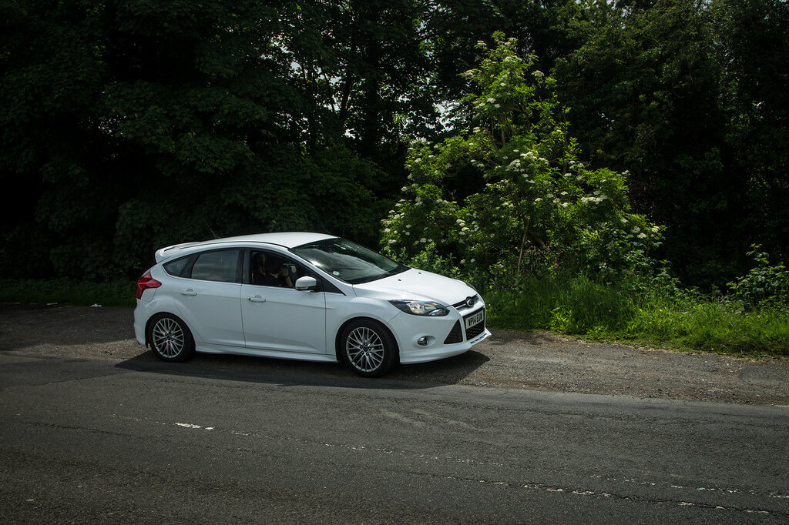

Потратив еще полчаса, чтобы впихнуть всю поклажу в багажник и распихать остальное по салону, мы наконец уехали из аэропорта и направились к первой точке на нашем маршруте — Кембриджу. Чувство реальности и присутствия первый день всегда притуплено, вот и мы никак не могли осознать, что находимся в Англии. Разве что левостороннее движение напоминало о необычности ситуации, и держало в тонусе.

Сонные, мы решили, что сначала стоит заселиться в кемпинг и скинуть весь наш скарб из машинки: заехали в один из кемпингов, где цена в 44 фунта за ночь нас отпугнула настолько, что добрая женщина на ресепшен сразу достала распечатку с 10 адресами и рассказала, где найти самый дешевый. Последовав ее совету, мы доехали до милого местечка, где всего за 10 фунтов за ночь нам разрешили остаться. 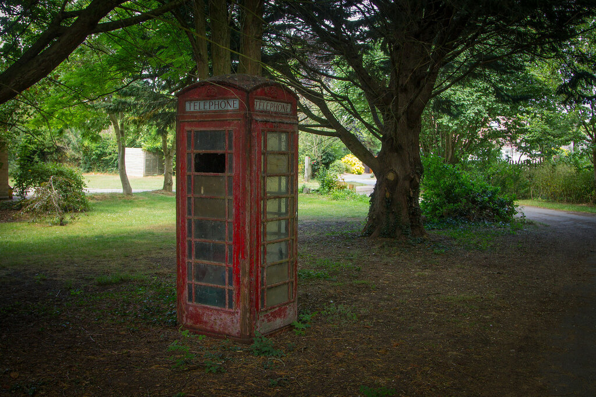

Надо сказать, что мы всеми правдами и неправдами пытались разузнать побольше об английских кемпингах из отчетов других путешественников. Но как бы не так! Никто, например, не упомянул ОЧЕНЬ важной детали, что в кемпингах не UK-розетка, а особая Hook-Up, которая позволяет подключиться к нестандартному разъему на поле. Благо, хозяин кемпинга оказался очень милым мужчиной и сразу принес нам без всяких разговоров свой переходник. Поставив палатку и оставив внутри чемоданы (а мы читали, что так можно и нужно – в караван-парках царит атмосфера доверия и открытости: все оставляют свои вещи на виду), мы сели в машинку и поехали в центр города. 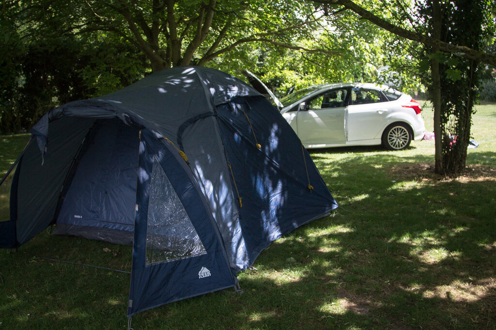

Форд Фокус был главным разочарованием поездки: внешне машинка очень и очень красива, но внутри это полный кошмар: куча кнопок и переключателей, расположенных неудобно даже с поправкой на правый руль. Багажник явно не предназначен для перевозки такого количества вещей, а маленькие пластиковые кармашки не внушают доверия, чтобы в них положить что-то кроме жевачки или упаковки печенек. 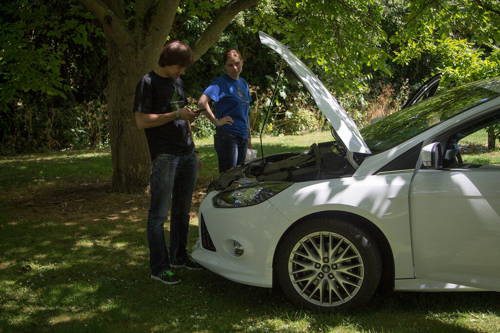

Ну да ладно про машинки. Конечно, мы примерно раз в час мечтаем о другой, но в конце концов, не за тем сюда приехали. Кембридж – это город, который не нуждается в особом представлении, и мы вместо длинных статей про историю, сразу перешли к осмотру колледжей, коих на территории 31 штука. 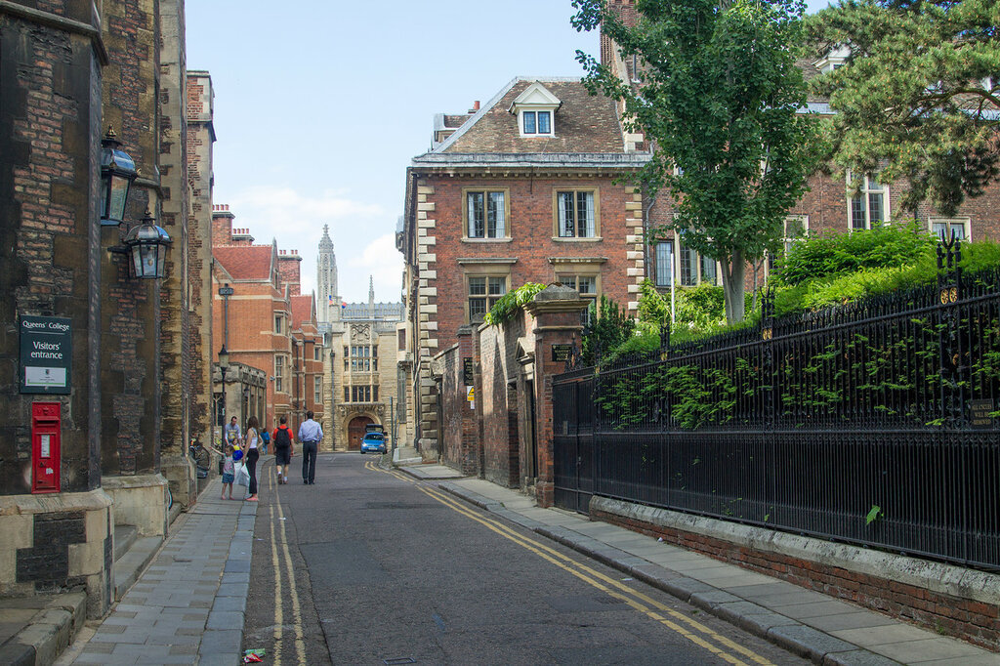

Самые знаменитые - Кингс Колледж и Тринити Колледж, с них мы и начали осмотр городка. В центре проходила церемония вручения дипломов – очень радостные выпусники и не менее радостные и презентабельно выглядящие родители, стояли около древних каменных стен и фотографировались на память. 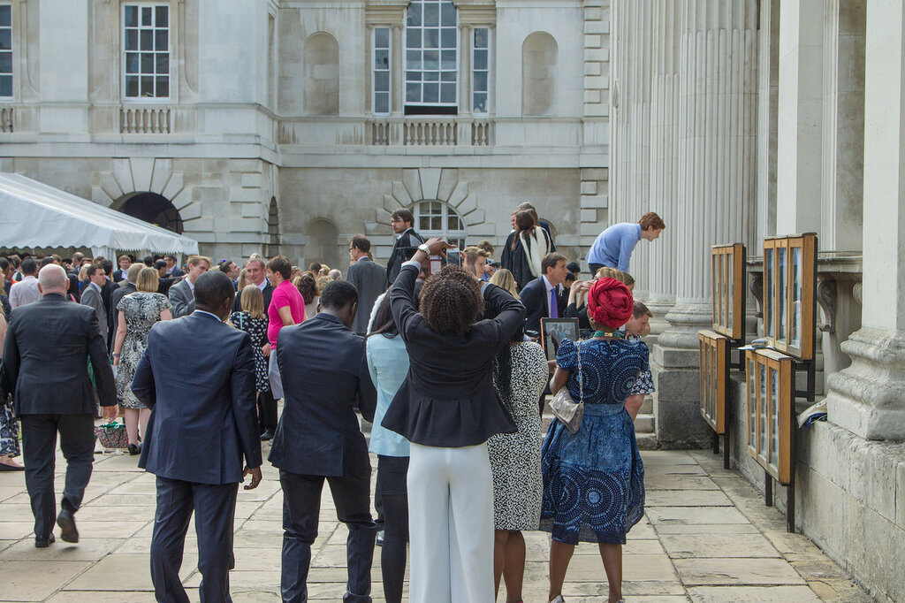

Смотреть на это было приятно и даже немного завидно. Окончив Бауманку, я могла бы не распускать слюни на колледжи, но мысль «а было бы здорово здесь учиться» не покидала до самого конца прогулки. 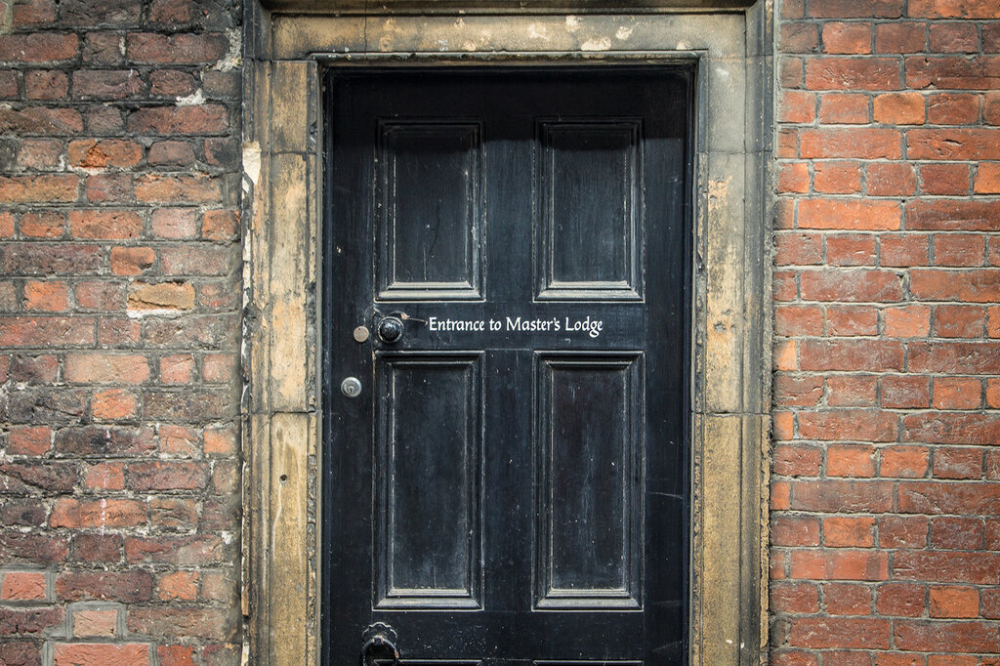

Легко понять, почему состоятельные люди так хотят, чтобы их дети здесь учились: атмосфера Кембриджа потрясающая – очень интернациональная, так как студенты со всего мира: на выпуске мы видели сари, смокинги, вечерние платья, яркие балдахоны представителей африканских стран.

История так и витает в воздухе, и наверняка очень лестно, что ты учишься в университе, который выпустил более 90 нобелевских лауреатов, где был открыт закон гравитации и среди выпускников несколько десятков премьер-министров Британии. 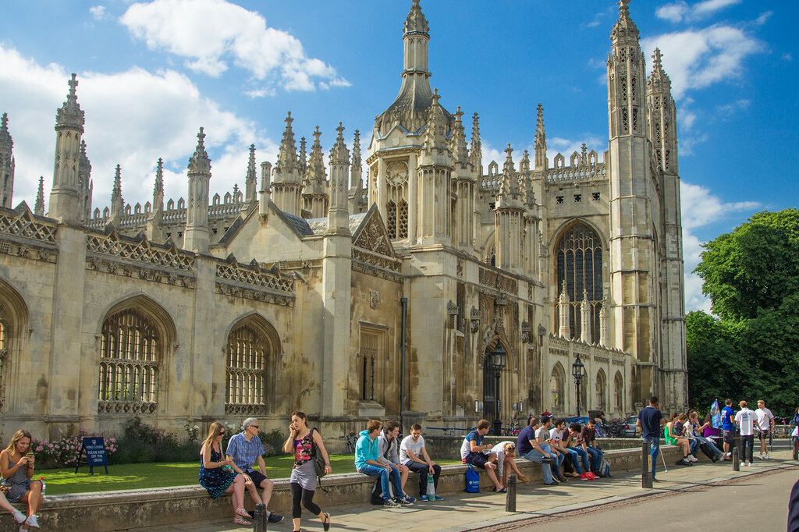

Прогулялись вдоль реки Кем, по которой традиционно катают на широках лодках вот уже несколько столетий. Есть опции на выбор: ты можешь сам отталкиваясь длинным посохом от дна реки, грести и любоваться видом сразу на 9 колледжей, либо заплатить за эту услугу профессиональному гребцу, многие из которых студенты университета, подрабатывающие во время каникул. 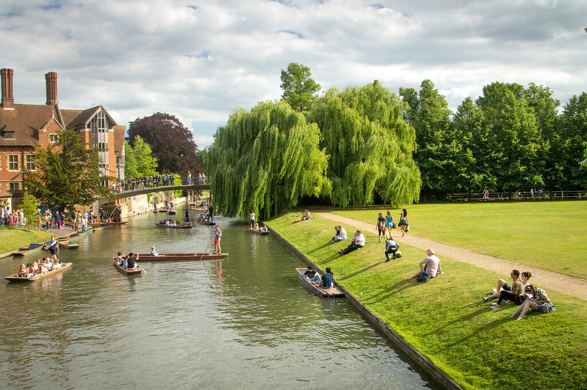

Мы хотели успеть на вечернее хоровое пение в Кингс Колледже, но нагулявшись по Тринити колледжу, опоздали на 15 минут, и нас уже не пустили. Архитектура потрясает больше всего – просто удивительно, как сквозь все эти столетия дома из коричневого камня крепко стоят на земле и радуют глаз необычными формами и укрошениями. 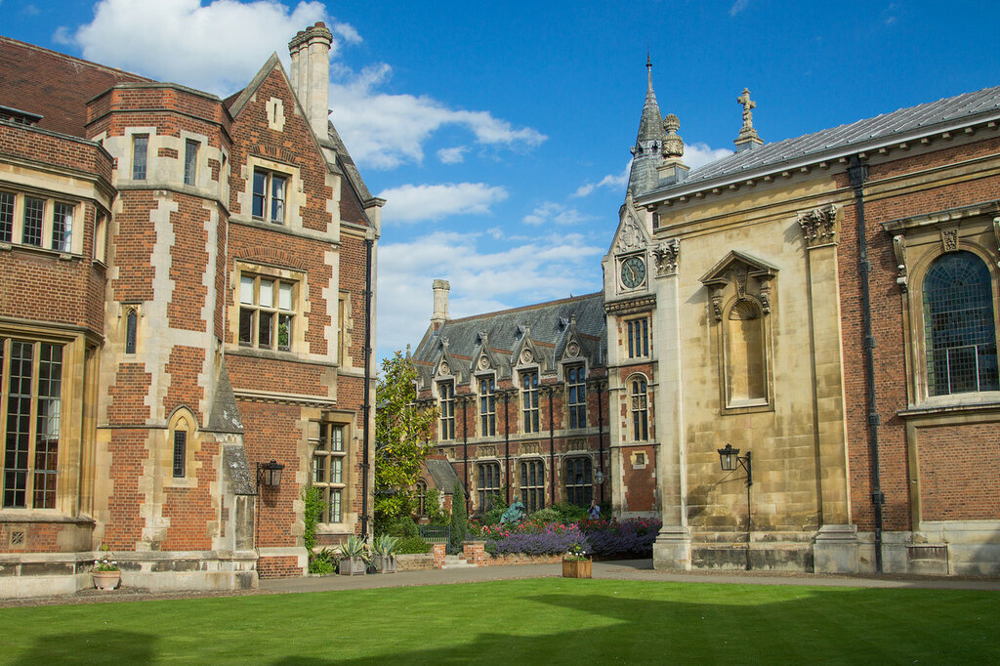

А плющ, дикий плющ, ползущий вдоль стен, или увитые розами и цветами, названия которых мне не знакомы! Сказка. 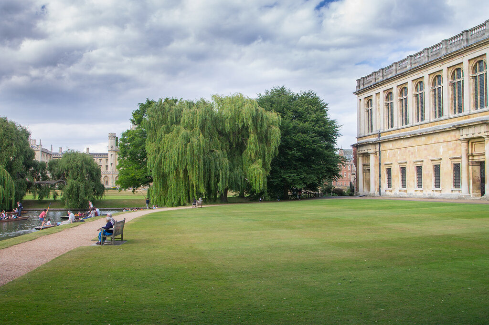

Когда оказываешься в Англии, становится легче понять, почему Толкиен писал о хоббитах, Роулинг написала Гарри Поттера и покорила весь мир, а Льюис Керрол – преподаватель Оксфорда, написал Алису в стране чудес для дочки декана этого же колледжа Лиддела. Англия – это какое-то волшебство, и несмотря на всю строгость и упорядоченность, здесь открываются огромные просторы для фантазии. 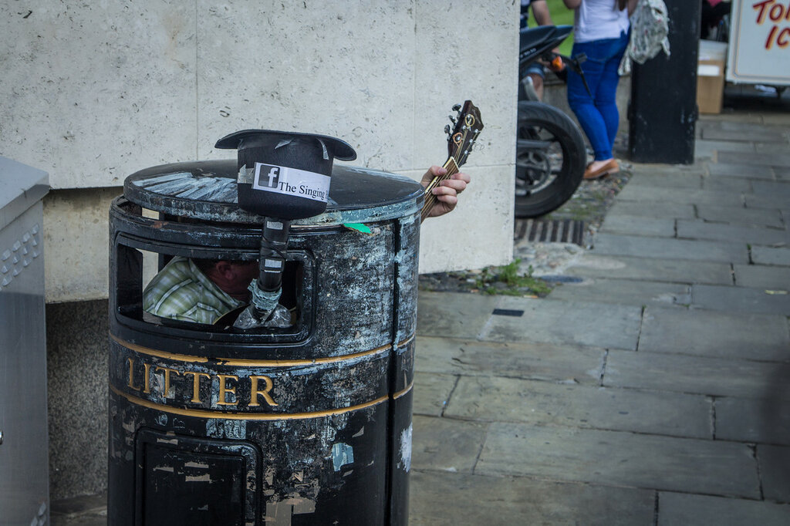

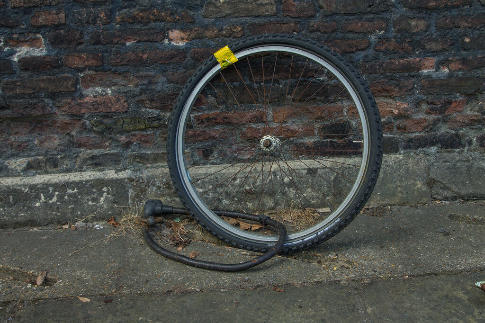

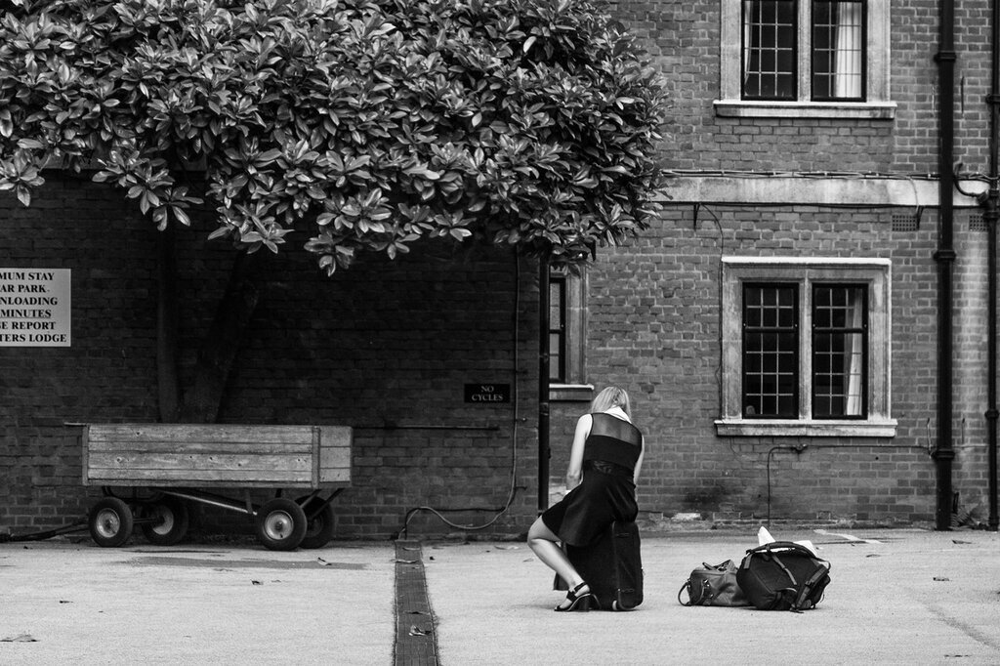

Впечатлений была масса, но сонливость и банальная усталость от половины дня в прогулках взяли свое – мы поехали в кемпинг, где поужинали, приняли душик и легли спать примерно по расписанию передачи «Спокойной ночи, малыши». Отдельное спасибо за ужин мультиварке – предмету повышенных споров с ребятами на тему брать-не брать. В последний вечер они все-таки отказались брать свою, и мы запихнули в чемодан нашу,  о чем радуемся вот уже третий прием пищи. Конечно, в походе мультиварка – вещь неожиданная, и вызывающая много вопросов. Но на ней невероятно удобно готовить завтрак – закинул, чистишь зубки, а каша варится. Ужин – примерно та же история, а обед превосходит фантазии – сегодня мы сварили гречку, а на втором ярусе запекли курочку, и прямо в мультиварке взяли с собой. Итого – вкусная, горячая и здоровая пища всегда под рукой! 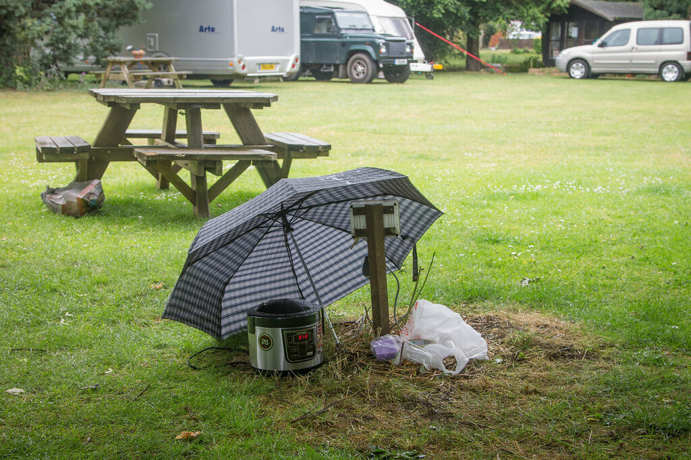

Пришли мы к этому не сразу, а после того, как весь Архангельск промучались с едой из-за отсутствия там кафе или хотя бы магазинов на дорогах. Питались чаем с печеньками, за что мой желудок мстил мне всю поездку и еще неделю после.

## День второй. Элай – Петерборо – Ноттингем

На завтрак кашка, а продукты на обед закупили в Теско и ждали почти час, пока мультиварка запечет его под дождем: из-за упомянутого переходника на розетку электричество все время вырубалось. Так как мы решили выспаться после перелетов, то выехать нам удалось в половине двенадцатого, что значительно сократило время на осмотр достопримечательностей, которые по воскресеньям работают до 15-16 часов. 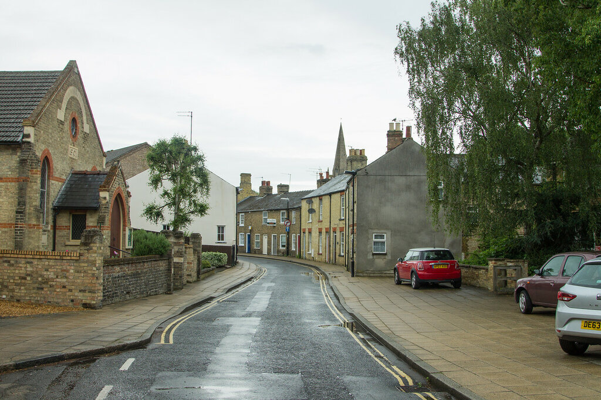

Первым городком на пути стал Элай, где нас ждал Кафедральный собор, построенный в 13 веке. Честно, до этого момента я не видела ничего, что способно по красоте перебороть Нотрдам-де-Пари, но тут просто дух захватывало от одного взгляда снаружи. 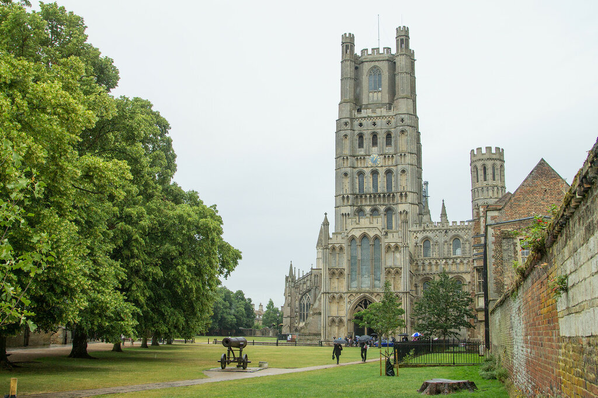

Внутри потрясающей красоты витражи, высотой в несколько метров. Весь потолок украшен росписями, и под ними зеркала, чтобы можно было рассмотреть потолок не задирая голову. Мы даже застали концерт живой музыки: играли какой-то военный марш, поэтому мы послушали только первую композицию, и пошли к выходу. 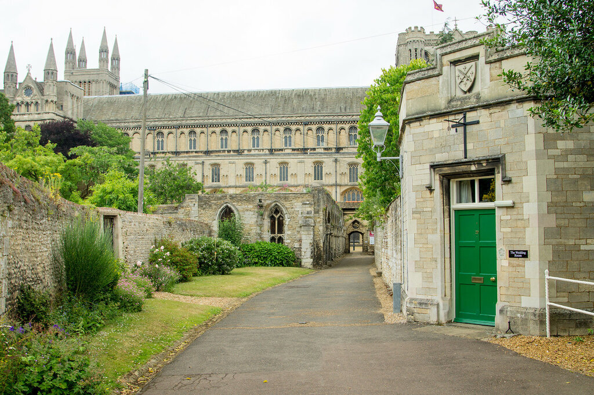

Короткий обед в машине из мультиварки, мы снова в пути. Цель – Кафедральный собор в Петерборо, который, увы, удалось посмотреть только снаружи, так как он уже был закрыт. Об этом нам сообщил вежливый дядечка и попросил прийти завтра (но мы его не послушаемся, увы). Вежливость – отличительная национальная черта англичан. Все здороваются, все улыбаются и благодарят. Мы стараемся не отставать и здороваться первыми, если успеваем. Прогулки невероятно раскаляют аппетит, поэтому к моменту, когда мы добрались до центральной площади Петерборо, где бьют фонтаны, мы решили остановиться на привал на скамейке и выпить супчик. 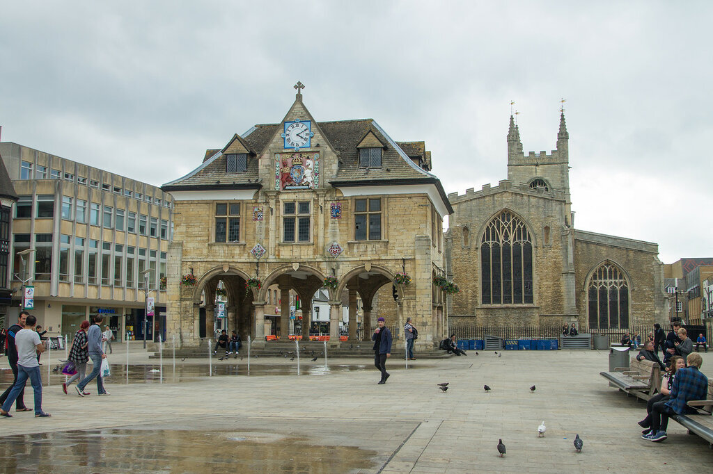

Спасибо магазину Теско, к которому за несколько месяцев жизни в Таиланде, я почти приросла душой: отличный выбор продуктов позволил купить вкусный супчик меньше чем за 100 рублей: достаточно было растворить «закваску» в кипятке, и вот горячий минестроне оказался в нашем термосе. Конечно, пакетированные супы – не лучший выбор, но варить борщи нам не позволяет время, поэтому идем на компромисс с желудком, который пока воспринимает ежевику, манго и голубику (от 1 до 2 фунтах) На карте был также отмечен Кафедральный собор в Линкольне, куда мы решили уже не заезжать, так как время близилось к вечеру, а надо было еще добраться до Ноттингема (все вспомнили Робин Гуда?). После сытного обеда и прогулки всех нас потянуло в сон, и водитель не стал исключением: Владимир махнулся с Климентием, и мы продолжили свой путь. Поиск ночевок в Англии – очень увлекательный процесс, и сопряжен с социализацией как минимум по той причине, что у нас нет переходника Hook-Up: в каждом кемпинге мы уточняем, смогут ли нам дать его в аренду. Пока опыт остановки в караван-парках весьма удачен – в первую ночь для нас сделали исключение – в парке остановка была только для членов клуба, и только на мотор- или караван-хоумах. И цена была копеечная по меркам Англии – всего 10 фунтов за всех (870 рублей). В

торая ночь то же самое –сначала мужчина ответил, что кемпинг закрыт на ремонтые работы, но потом увидел нашу заминку и спросил «are you desperate to sleep for 1 night?», и мы уверенно закачали головами, что да, конечно, мы очень отчаянно хотим остаться тут ночевать. Цена уже более кусачая – 20 фунтов, но за доступ к электричеству, горячему душу, столику со стульями и туалетам для 4х человек это все еще приемлимые расценки. Клим с Вовой уже горят желанием устроить дикий кемпинг, и несмотря на мои убеждения, что в Англии нам это не удастся, мы сегодня покатались 20 минут по окрестностям, пытаясь найти открытый выход к воде. И как бы не так: вся территория за заборами, везде организованы либо кемпинги, либо частые дома отдыха, рыболовные клубы и так далее. Сейчас мы готовимся ко сну: все уткнулись в гаджеты: читают книги, пишут статьи и обрабатывают фотки. На завтра много планов, и мы хотим встать пораньше, чтобы успеть их осуществить. Вот уже последний человек вернулся из душа, и все залезли в машину погреться, где сижу я на пассажирском сидении и пишу статью. Климентий подошел с поцелуями, а я игнорирую, пытаясь дописать последние строки и наконец пойти помыться.

Читайте другие статьи из нашего путешествия по Великобритании летом 2015 года (подробная информация о том, что стоит посмотреть в Англии и Шотландии): [Что посмотреть в Англии. Часть 2: Шеффилд и Йорк](https://vodpop.ru/chto-posmotret-v-anglii-sheffild-i-york/) [Что посмотреть в Англии. Часть 3: Достопримечательности севера](https://vodpop.ru/chto-posmotret-v-anglii-sever/) [Что посмотреть в Англии. Часть 4: Достопримечательности Лондона](https://vodpop.ru/chto-posmotret-v-anglii-dostoprimechatelnosti-londona/) [Что посмотреть в Англии. Часть 5: Виадук Гленфиннан, Саутпорт и Сноудония](https://vodpop.ru/chto-posmotret-v-anglii-viaduk-glenfinnan-sautport-i-snoudoniya/)

[Что посмотреть в Шотландии. Часть 1: Достопримечательности Эдинбурга](https://vodpop.ru/chto-posmotret-v-shotlandii-dostoprimechatelnosti-edinburga/) [Что посмотреть в Шотландии. Часть 2: Природа Шотландии](https://vodpop.ru/chto-posmotret-v-shotlandii-priroda-shotlandii/) [Что посмотреть в Шотландии. Часть 3: Достопримечательности Шотландии](https://vodpop.ru/chto-posmotret-v-shotlandii-dostoprimechatelnosti/)
