Через полтора часа после подъема (да, мы капуши, но нам простительно) мы отчалили в сторону Форт-Уильямс, где находится самый знаменитый виадук во всем мире - Гленфиннан. Именно по нему ехал Гарри Поттер в волшебную школу Хогвартс экспресс, и именно на него открывались потрясающие виды с “Форд Англия” - машины, которую одолжили Рон и Гарри у Уизли-старшего.

<!--more-->

## День двенадцатый. Виадук Гленфиннан, где ехал Хогвартс-экспресс, дорога на юг и ночевка в Саутпорте

Ночью мы развесили с Дашкой мокрое чистое белье во всех туалетах кемпинга, так как снаружи крапал дождик и шансов на просушку было мало. Под множественные укусы мошек мы стянули все шмотки обратно в пакеты, сложили палатку, подпрыгивая на одной ноге и постоянно почесываясь. Через полтора часа после подъема (да, мы капуши, но нам простительно) мы отчалили в сторону Форт-Уильямс, где находится самый знаменитый виадук во всем мире - Гленфиннан. Именно по нему ехал Гарри Поттер в волшебную школу Хогвартс экспресс, и именно на него открывались потрясающие виды с “Форд Англия” - машины, которую одолжили Рон и Гарри у Уизли-старшего. 

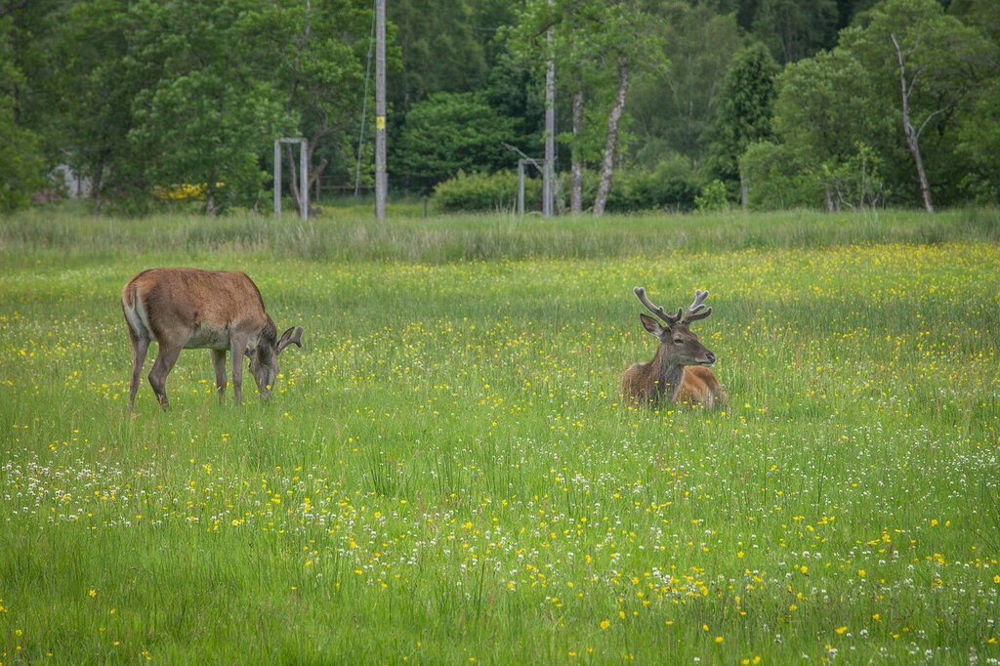

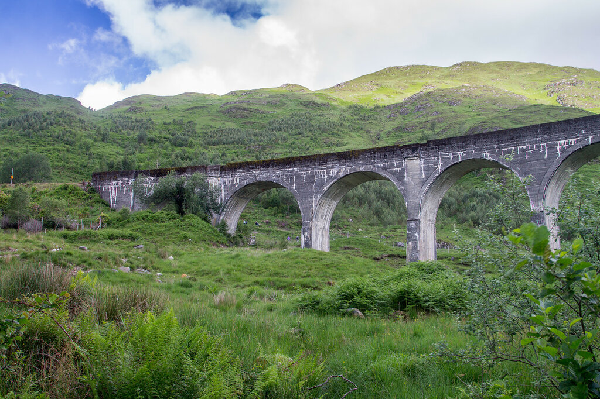

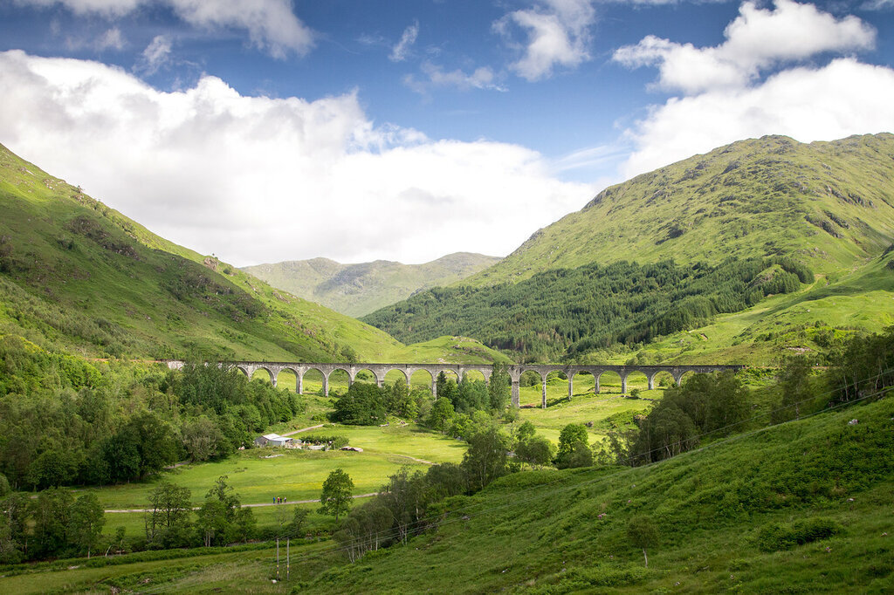

Мы были невероятно упорны и приехали к назначенному времени (вроде бы, 10.44), 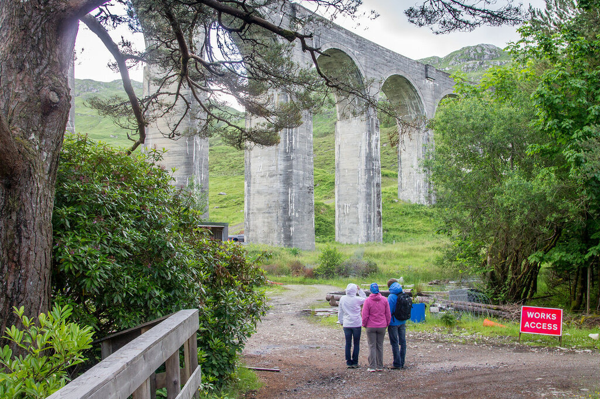

и не мы одни 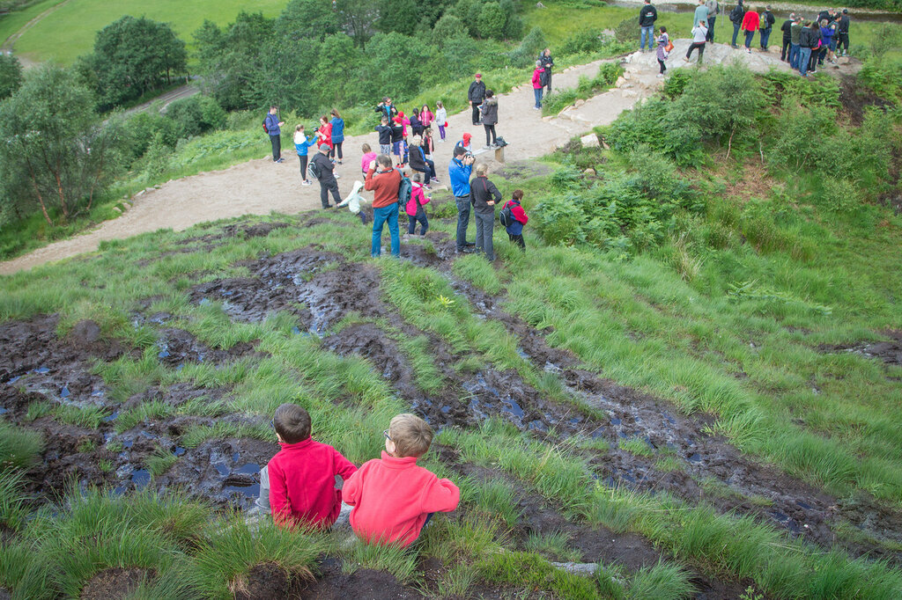

но прождав почти час мы сдались и пошли к машине, как вдруг услышали долгожданный свисток парового поезда. Увы, даже спринтерский забег из машины на первое место, откуда можно было увидеть поезд, закончился только следами пара, скрывающимися в кустах и деревьях. 

Было немного обидно - так долго ждать, подгадывать свои планы, и не дождаться буквально 20 минут. Но сил ждать уже не было - было ветрено и прохладно. Одно из преимуществ - мы налюбовались потрясающим видом на горы, который открывается, если смотреть на противоположную сторону дороги от виадука. 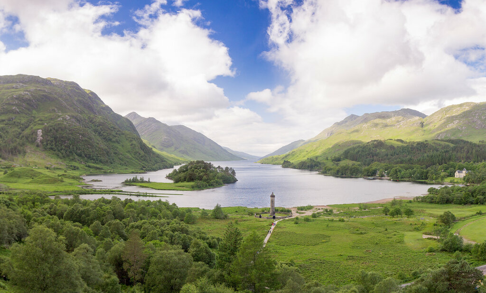

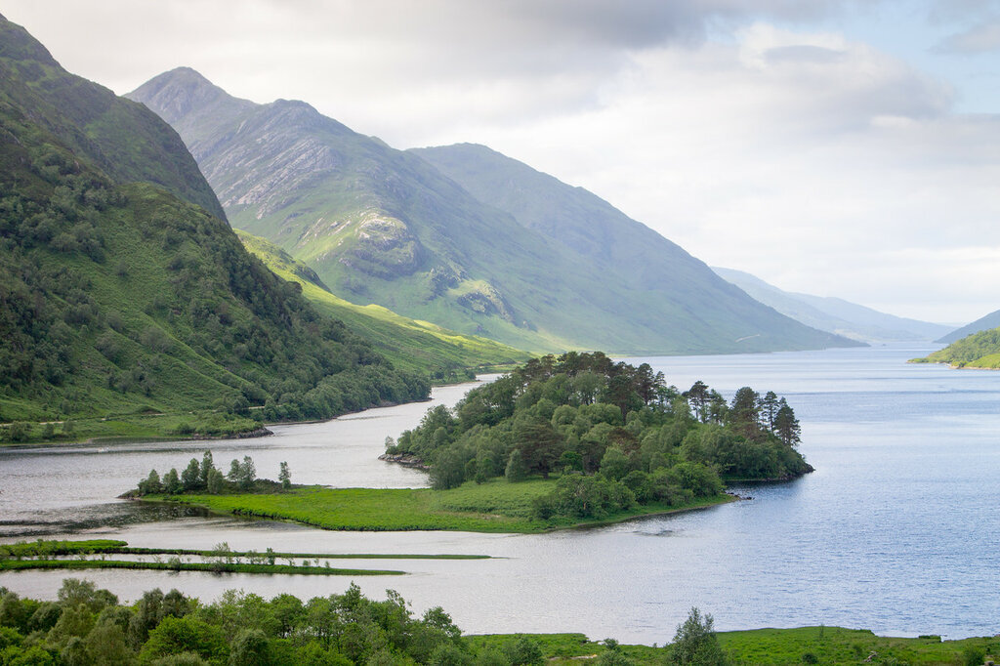

Далее была красивейшая дорога из Форт-Уильямс на юг, половину которой я проспала, а вот Климентий должен отлично помнить, так как он был за рулем.

Из окна машины сначала казалось, что в горах дыры 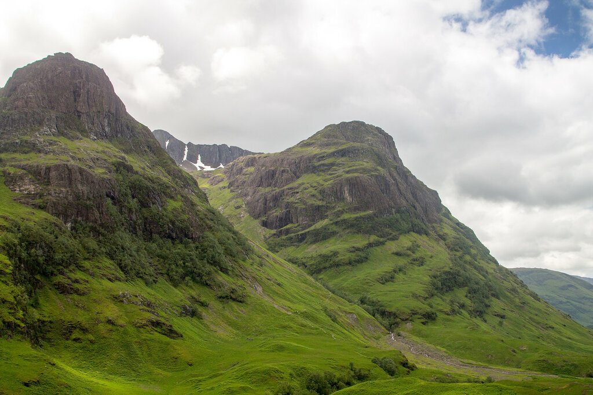

Но если приглядеться, можно увидеть снег 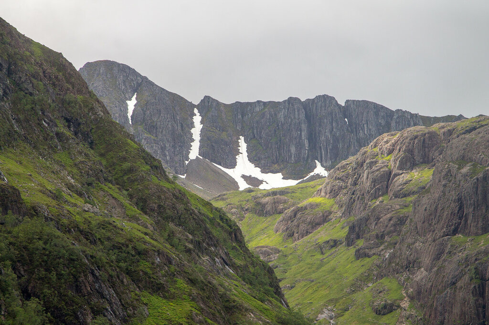

Мы заехали в Теско, купили ужин и забронировали гостиницу в Саутпорте - место было выбрано по цене и отзывам, но после такого количества дней в палатке нас бы устроило и намного более скромное жилище: у ребят в номере был выход в садик, поэтому вечером мы допивали ванильный Ягермейстер именно у них. Наш номер мог похвастаться двухспальной кроватью и ванной(!!!). Кто был в походных условиях более трех дней, тот поймет, как эти две простые радости могут сделать нашу жизнь приятнее.

## День тринадцатый. Сноудония, пеший маршрут и купание в озере, марш-бросок в Севеноакс (пригород Лондона)

Мой изначальный план — посмотреть те же прекрасные места, которые мы проехали с Климом на машине двумя неделями ранее — разбился в дребезги, когда Климентий решил свернуть не на ту дорогу. Когда я поняла, куда мы едем, уже было слишком поздно разворачиваться. Однако, мы нашли пешеходную тропу 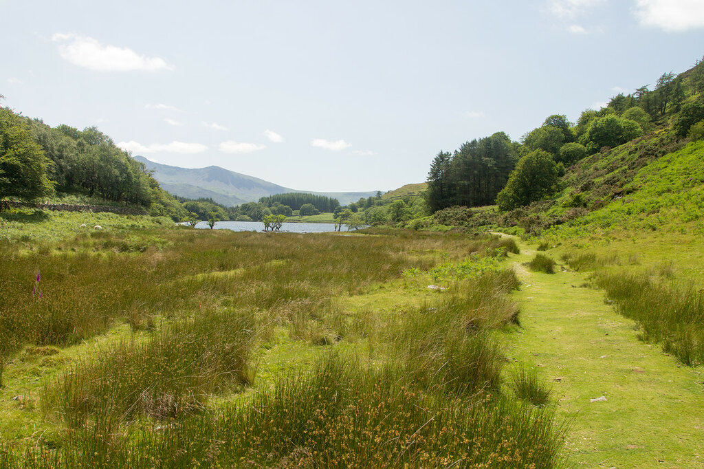

и рядом было озеро, в котором мы искупались голышом (ня-ня), посидели на пляже и сойдя с тропы стали прыгать по оврагам, как горные козлы 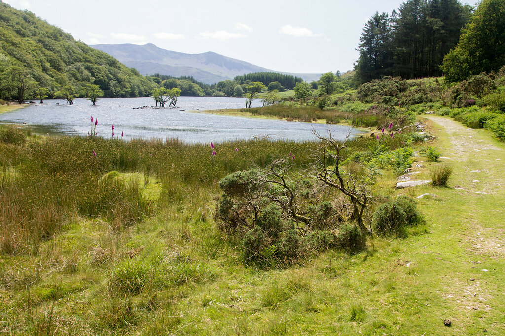

Торопились мы изрядно, и пообещав приехать в гости к Марине и Денису к 21 часу, мы были у них в 23 (в прошлый раз, когда мы гостили у них в Норвегии, мы тоже опоздали часа на три). После купания в озере мы только ехали и ехали, один раз остановившись на заправку и перекусив на стоянке автобана.

Читайте другие статьи из нашего путешествия по Великобритании летом 2015 года (подробная информация о том, что посмотреть в Англии и Шотландии): [Что посмотреть в Англии. Часть 1: Кембридж, Элай и Петерборо](https://vodpop.ru/chto-posmotret-v-anglii-chast-1/) [Что посмотреть в Англии. Часть 2: Шеффилд и Йорк](https://vodpop.ru/chto-posmotret-v-anglii-sheffild-i-york/) [Что посмотреть в Англии. Часть 3: Достопримечательности севера](https://vodpop.ru/chto-posmotret-v-anglii-sever/) [Что посмотреть в Англии. Часть 4: Достопримечательности Лондона](https://vodpop.ru/chto-posmotret-v-anglii-dostoprimechatelnosti-londona/)

[Что посмотреть в Шотландии. Часть 1: Достопримечательности Эдинбурга](https://vodpop.ru/chto-posmotret-v-shotlandii-dostoprimechatelnosti-edinburga/) [Что посмотреть в Шотландии. Часть 2: Природа Шотландии](https://vodpop.ru/chto-posmotret-v-shotlandii-priroda-shotlandii/) [Что посмотреть в Шотландии. Часть 3: Достопримечательности Шотландии](https://vodpop.ru/chto-posmotret-v-shotlandii-dostoprimechatelnosti/)
