Хотя Гонконг формально считается административной единицей Китая, а точнее Китайской Народной Республики, на деле этот город куда больше похож на развитый европейский мегаполис. Мы остановились в этом городе на целых две недели, за которые успели многое увидеть, и готовы рассказать о том, что посмотреть в Гонконге

<!--more-->

Обычно туристы бывают в Гонконге транзитом, либо останавливаются здесь на крайне непродолжительное время для покупки Iphone, Macbook или китайского чая (кстати, последнего мы так и не нашли - где продается пуэр на развес для нас осталось загадкой). Кстати, для россиян виза не нужна - на 14 дней вам просто ставится штампик в паспорт. Правда, проверяют наличие обратного билета. Если вы хотите задержаться в Гонконге, нужно оформить визу. Мы четко спланировали наше пребывание на 14  дней, чтобы лишний раз не оформлять бумажки.

Гонконг находится на полуострове Коулун и граничит с континентальным Китаем. Причем жители Гонконга очень обижаются, если их назвать китайцами - поведением, стилем одежды, достатком и культурой они куда больше смахивают на европейцев. Правда, за это приходится расплачиваться довольно высокими по меркам Юго-Восточной Азии ценами. Если сравнивать цены с Москвой, то они примерно сопоставимы. Как-то гуляя по городу, мы увидели сразу несколько свадеб. Отличие от российский разве что в том, что все азиатской внешности.

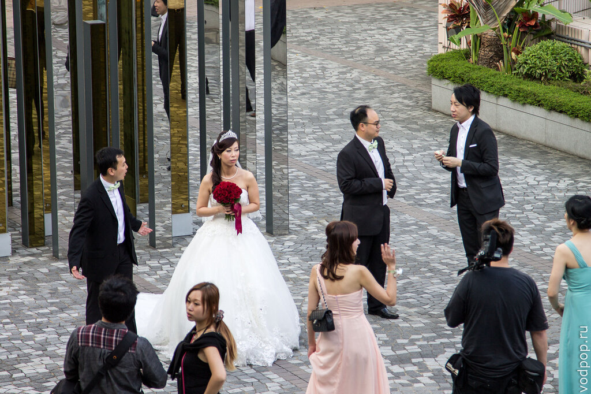

Многие носят очки. Они им невероятно к лицу.

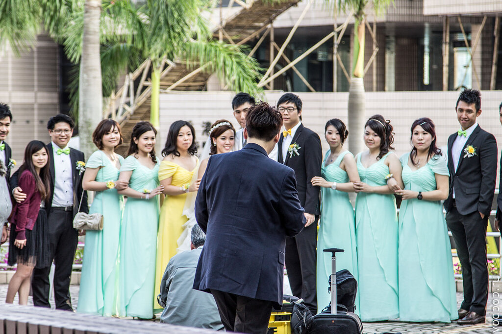

Кстати, о прогулках по городу. Самый удобный способ перемещения - метро. Еще в аэропорту Гонконга мы приобрели две карточки Октопус  (Octopus Card), на которые положили по 200 гонконгских долларов. Эту сумму нужно умножить на 4,3 для получения рублевого эквивалента, т.е. 200 долларов примерно 1000 рублей. Карта очень удобная, ей можно расплачиваться во всех видах общественного транспорта (метро, автобусы, паромы между островами, трамваи и т.п.), но и оплачивать покупки в магазинах. Карточка стала нашим постоянным спутником - для оплаты покупок достаточно поднести карту к считывателю, а в метро приложить к турникету на входе и на выходе - сумма поездки спишется автоматически (она зависит от количества станций, которые вы проехали), и на табло турникета загорится остаток денег на карте.

Турникеты собственной персоной.

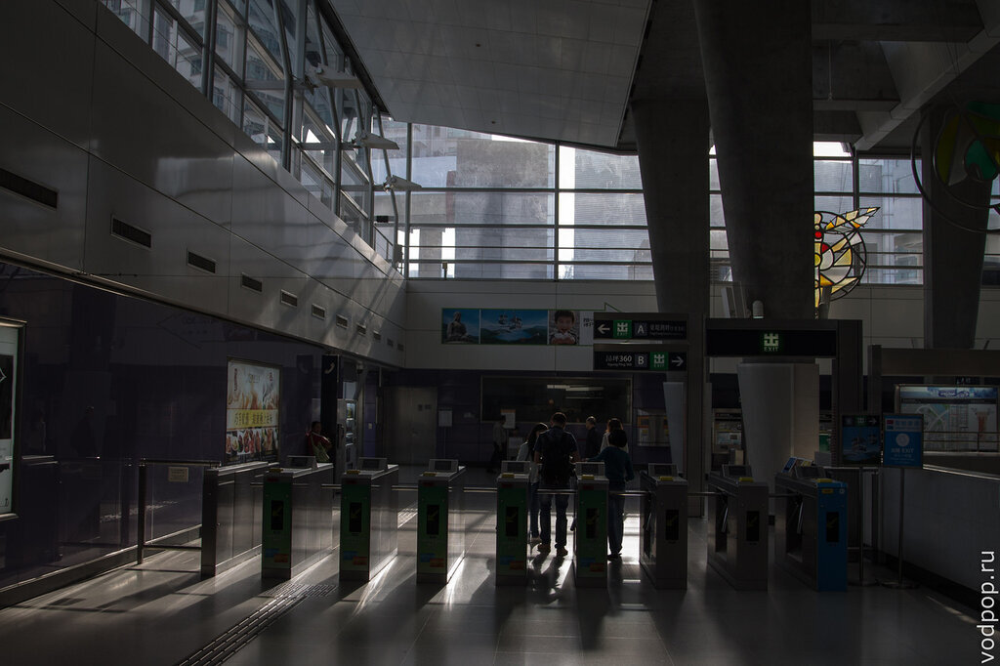

Пополнить карточку можно в любом магазине 7-11 (Seven-Eleven, Севен-Элевен).

Метро в час-пик.

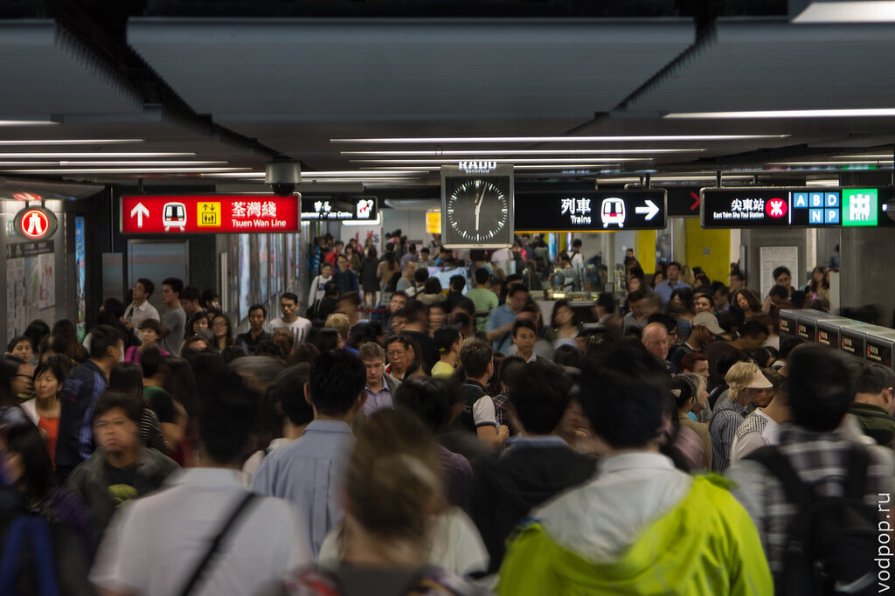

Везде множество указателей, всегда выделены цветом линии, на которую вы хотите перейти, а также все надписи продублированы на английском. Если вдруг заблудитесь, то есть стойки информации (англо-говорящий персонал), а также на многих станциях стоят компьютеры с выходом в интернет. Пользоваться ими можно абсолютно бесплатно. А можно просто подойти с картой к любому прохожему и ткнуть пальцем в нужную станцию.

Метрополитену Гонконга я готова петь дифирамбы часами - более продуманной подземки с точки зрения ориентирования и удобства для пассажиров  я не видела.

Официальный сайт Октопус кард: [http://www.octopus.com.hk/home/en/index.html](http://www.octopus.com.hk/home/en/index.html)

Тут есть вся полезная информация, правда на английском. Если что-то будет непонятно - спрашивайте в комментариях.

Посмотреть схему метро, рассчитать стоимость поездки, а также узнать всю необходимую информацию можно на официальном сайте метрополитена Гонконга: [http://www.mtr.com.hk/eng/homepage/cust\_index.html](http://www.mtr.com.hk/eng/homepage/cust_index.html)

Я бы даже расписала подробную статью об общественном транспорте Гонконга, как я делала это в случае [с Бангкоком](https://vodpop.ru/metro-v-bangkoke/ "Метро в Бангкоке"), но в этом нет необходимости - настолько все интуитивно понятно и продумано для жителей города и иностранцев. Возле каждого выхода висит огромная карта, на которой подписаны все выходы со станции, улицы и значимые туристические объекты. В общем, вы точно не заблудитесь!

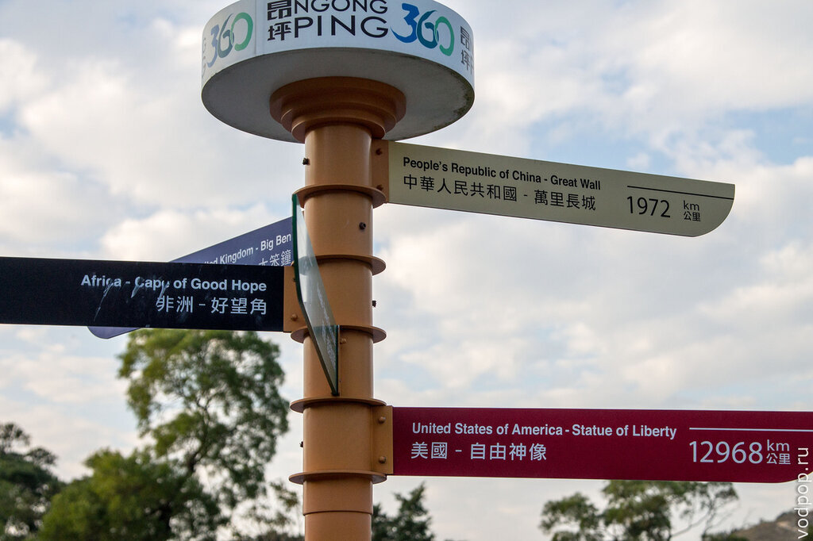

Теперь стоит сказать о том, как мы выбирали жилье. После [Филиппин](https://vodpop.ru/kak-dobratsa-palavan/ "Как добраться на Палаван, Филиппины"), цены на отели нам показались кусачими - от 1200 рублей за  приличный номер. По этой причине мы решили остановиться в хостеле Tin Tong, крайне популярным среди бэкпекеров (так называют самостоятельных путешественников, которые ездят с рюкзаками за спиной).

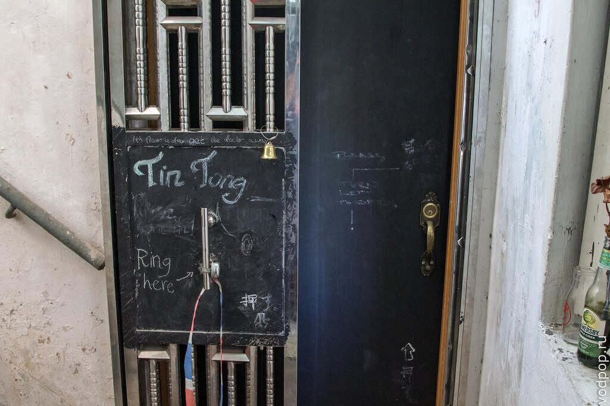

Мы решили поверить [отзывам](http://www.hostelbookers.com/hostels/hong-kong/kowloon/66546/reviews/), и ни разу не пожалели об этом! Правда, при заселении случился маленький конфуз. Мы, оказывается, забронировали палатку на крыше. Не место в общей комнате, а самую настоящую походную палатку, правда с постельным бельем из Икеи внутри. На крыше их целых две - синенькие.

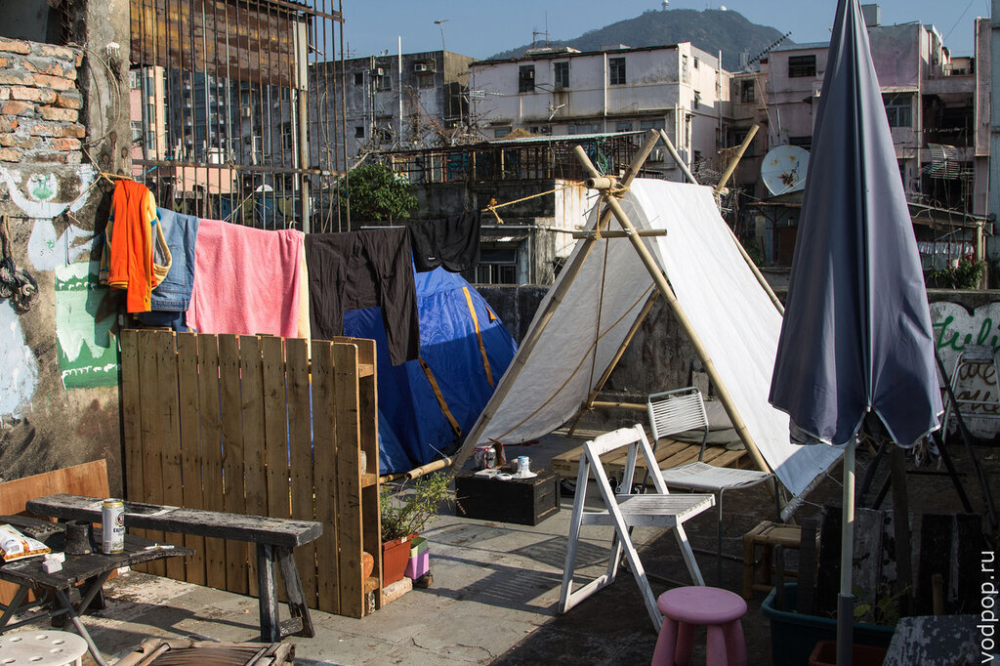

Благо, в хостеле оказались свободные места, и дружелюбный хозяин Кит разрешил нам без оплаты пожить внутри здания.

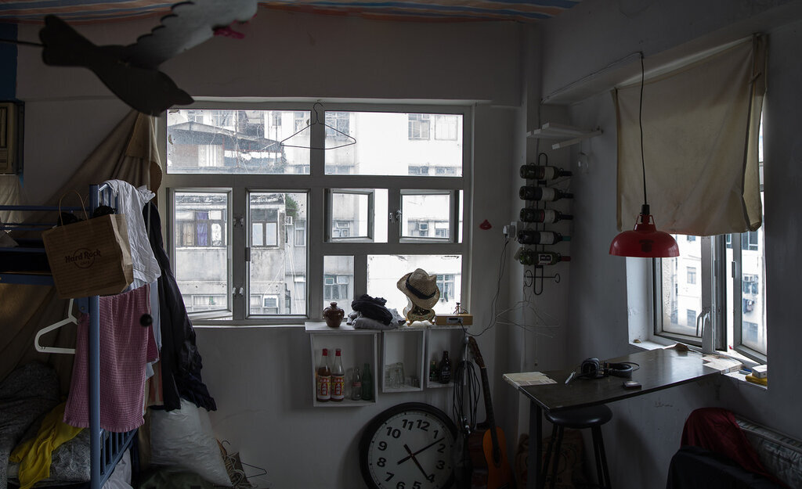

В хостеле есть чайник и кофе/чай. А еще тебя постоянно угощают всякими вкусняшками добрые соседи по комнате.

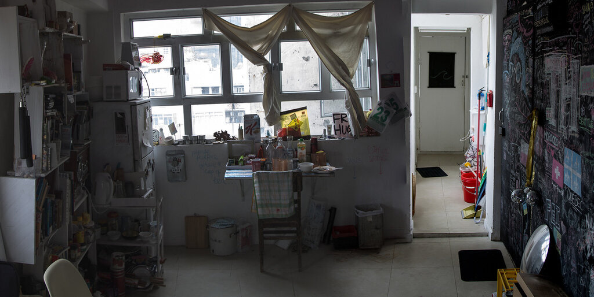

За 2 недели проживания в хостеле мы познакомились со множеством интересных людей из разных стран. А под конец получилось так, что почти все живущие были русские. А еще хостел находится на 9 этаже здания, построенного в пятидесятые годы. По этой причине лифта там нет, и каждый день мы вынужденно делали зарядку.

Еще неплохая подборка хостелов Гонконга есть [тут](http://goo.gl/1KkDOq).

После длинной вступительной части можно перейти к ответу на вопрос, что посмотреть в Гонконге:

- улицу Натан роуд (Nathan Road) - место для любителей шоппинга,да и для всех остальных будет интересно посмотреть, за чем столько людей каждый год приезжают в Гонконг за покупками. 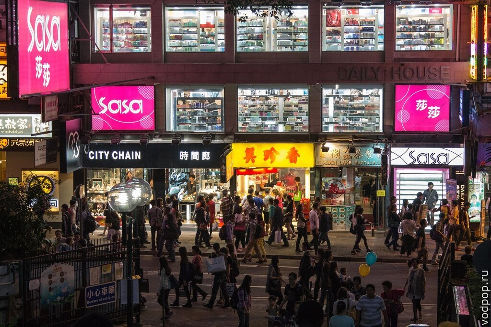Тут есть все, начиная от бытовой техники, заканчивая золотыми рыбками. Я нашла на этой улице аниме-магазин, где продавалась коллекционная кукла героя из моего любимого мультика Sailor Moon
- музеи Гонконга. Однозначно рекомендуем к посещению! Во-первых, большинство туристов приезжает за покупками, и не за культурными ценностями - т.е. вы будете осматривать все в тишине и спокойствии, а во-вторых, музеи сделаны очень интересно, везде есть перевод на английский, а билеты стоят сущие копейки. Время работы большинства музеев с 9.00 до 18.00, кассы закрываются за час до закрытия:
    
    - Музей Искусств (Museum of Art), официальный сайт [http://hk.art.museum/](http://hk.art.museum/) . Выставки сменяют одна другую, большая часть из представленного - современное искусство. 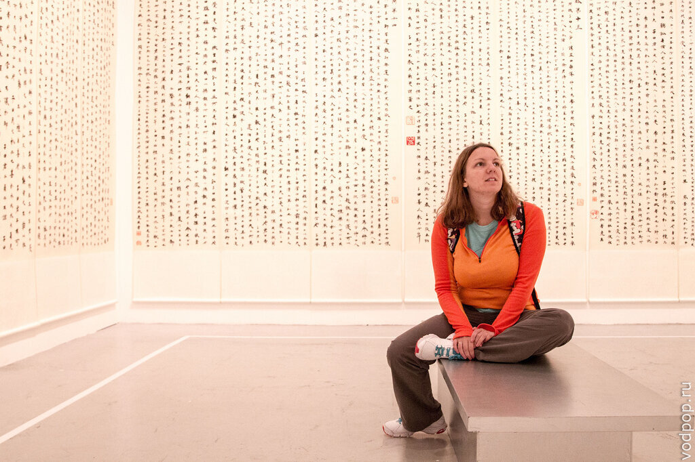
    - Музей Космонавтики (Space Museum), официальный сайт [http://www.lcsd.gov.hk/CE/Museum/Space/e\_index.htm](http://www.lcsd.gov.hk/CE/Museum/Space/e_index.htm) Очень интересный, особенно для юных любителей космоса. Все можно трогать/щупать/дергать, масса тренажеров, макетов советских и американских кораблей. За дополнительную плату можно посмотреть фильм под куполом в 360 градусов (а-ля Планетарий Москвы). Мы смотрели фильм про Солнечную систему - очень красочно! 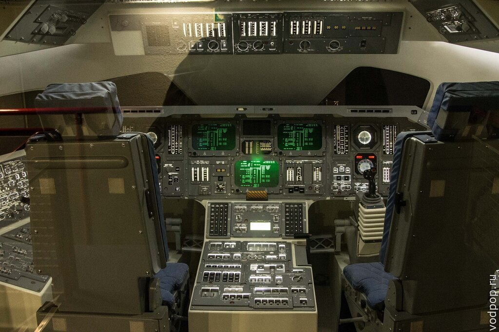
    
    Нравится статья? Узнавайте первым о выходе новых интересных историй! Подпишитесь на нас по [эл. почте](http://feedburner.google.com/fb/a/mailverify?uri=vodpop&loc=ru_RU) или в [группе ВКонтакте](http://vk.com/vodpop)
    - Научный Музей (Science Museum), официальный сайт [http://hk.science.museum/](http://hk.science.museum/) Мы сами туда так и не попали, но соседи по хостелу отзывались крайне восторженно.
- Световое шоу в Гонконге является одним из самых известных мероприятий, проводимых специально для многочисленных туристов этого города. Официальный сайт [http://www.tourism.gov.hk/symphony/english/details/details.html](http://www.tourism.gov.hk/symphony/english/details/details.html) Ровно в 20.00 на небоскребы острова Гонконг под бодрящую музыку начинают проецировать различные изображения. Специально ехать на это шоу я бы не советовала, но прогуляться по Аллее звезд, где стоит статуя Брюса Ли, и одновременно посмотреть на "Симфонию огней" (так называется шоу) вполне можно. Только будьте готовы к толпе. 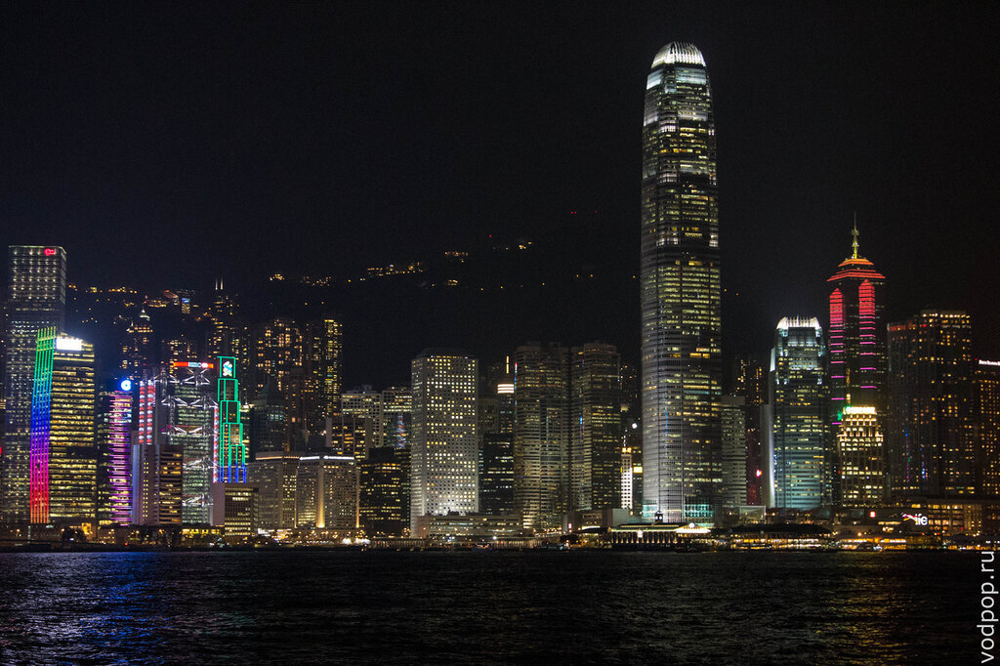
- Филармония Гонконга, официальный сайт [http://www.hkphil.org/eng/home/index.jsp](http://www.hkphil.org/eng/home/index.jsp) . Мы сходили на джаз-концерт в память Дж.Гершвина - остались в диком восторге. Цены от 400 рублей и выше. 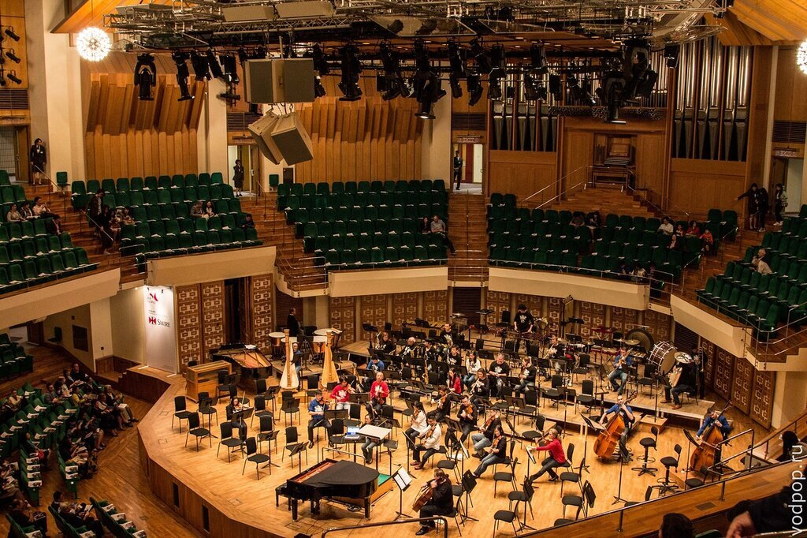
- [Оушен парк](https://vodpop.ru/oushen-park-v-gonkonge/ "Оушен Парк в Гонконге. Как мы встретились с большой пандой") (Ocean Park) в Гонконге - одно из мест, которое стоит посетить хотя бы ради того, чтобы увидеть живую гигантскую панду своими глазами. Это невероятно милые и добрые существа, смотреть на которых одно удовольствие.

<iframe src="//www.youtube.com/embed/53zCKgvTDvM" width="560" height="315" frameborder="0" allowfullscreen="allowfullscreen"></iframe>

- [остров Ламма](https://vodpop.ru/ostrov-lamma/ "Остров Ламма. Как снабжают электричеством Гонконг"). Довольно пустынное в будние дни место, где можно погулять на свежем воздухе, посидеть в одном из рыбных ресторанчиков на берегу моря, а также посмотреть на ветряк высотой 78 метров. 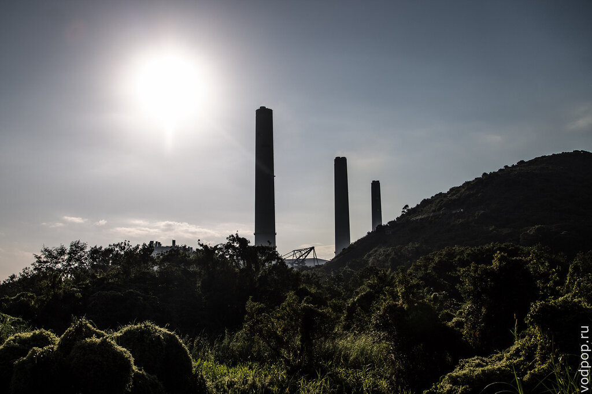
- [Большой Будда на острове Лантау](https://vodpop.ru/bolshoy-budda-v-gonkonge/ "Большой Будда в Гонконге и рыбацкая деревня Тай О"), официальный сайт [http://www.plm.org.hk/eng/home.php](http://www.plm.org.hk/eng/home.php) . Тихое, спокойное место. Со смотровой площадки открывается прекрасный вид, можно погулять вокруг, послушать пение птиц, посидеть на скамеечке или понаблюдать за рыбками. После шумного и людного центра Гонконга - самое то! 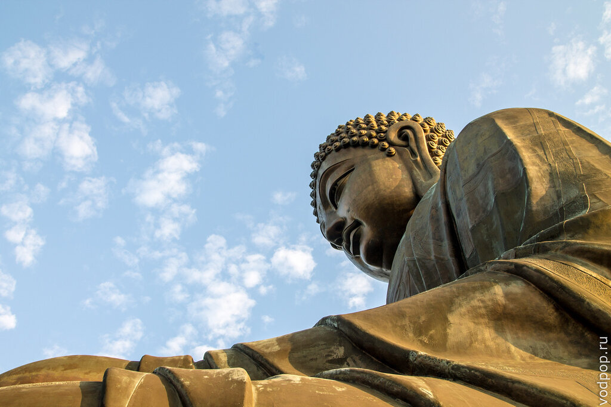
- [рыбацкая деревня Тай О](https://vodpop.ru/bolshoy-budda-v-gonkonge/ "Большой Будда в Гонконге и рыбацкая деревня Тай О"), расположенная на том же острове Лантау, в 20 минутах езды на автобусе от Большого Будды. Мы приехали туда после заката, туристов уже не было, поэтому гуляли мы в полном одиночестве. Тишина и огни большого города где-то вдали - что еще нужно для счастья? 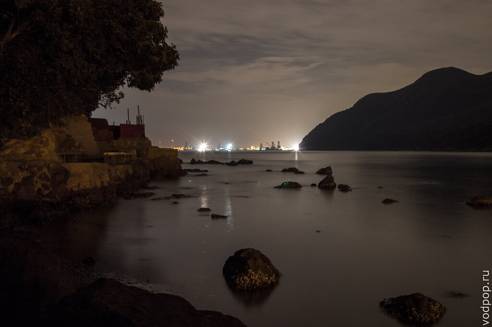
- Пик Виктория, официальный сайт [http://www.thepeak.com.hk/en/](http://www.thepeak.com.hk/en/) . Красивое место, довольно людное, но тем нее менее рекомендуемое к посещению. На территории пика находится несколько торговых центров, ресторанчиков и кафе. Можно посидеть за чашкой вкусного напитка с прекрасным видом на море 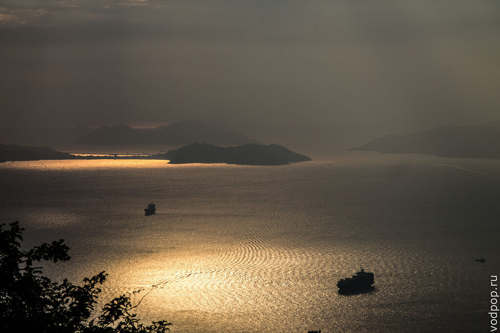 или город 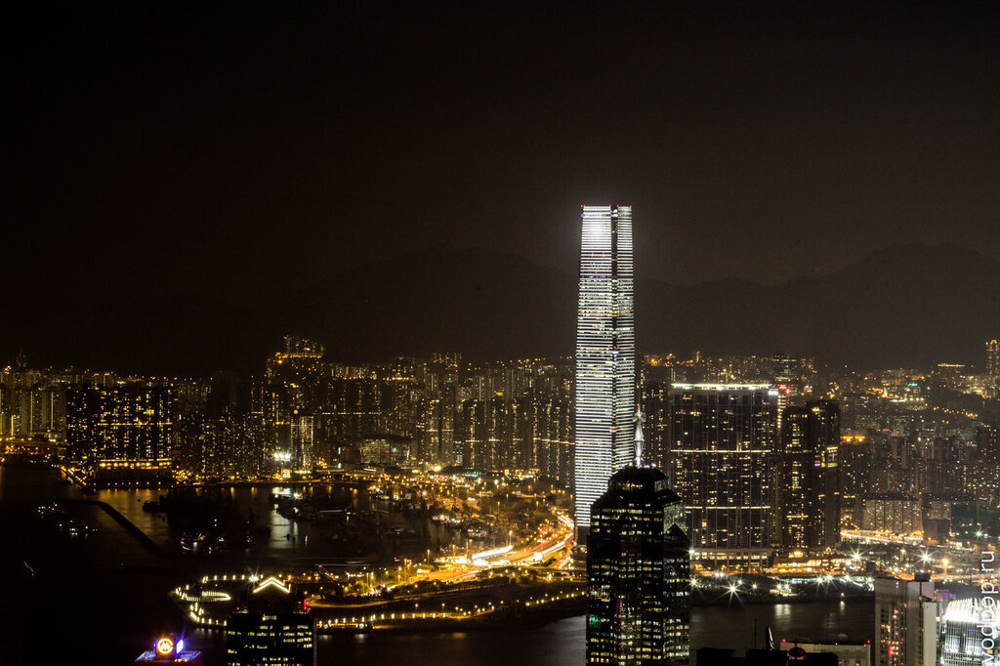
- парк Коулун, официальный сайт [http://www.lcsd.gov.hk/parks/kp/en/index.php](http://www.lcsd.gov.hk/parks/kp/en/index.php)\- кусочек зелени среди бетона. Иначе не назовешь. Парк маленький, зелени не сказать, чтобы очень много, но если забраться поглубже в деревья, можно попытаться представить, что ты не в людном мегаполисе (население Гонконга приближается к отметке в 10 миллионов), а в тихом лесу 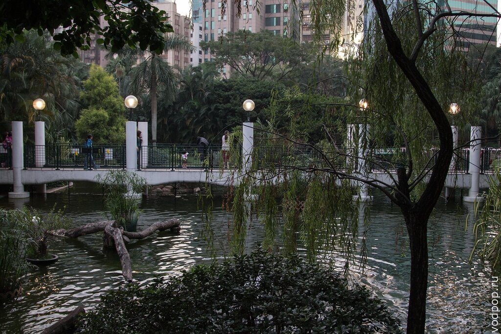 здесь же находится небольшой Археологический музей (вход бесплатно) 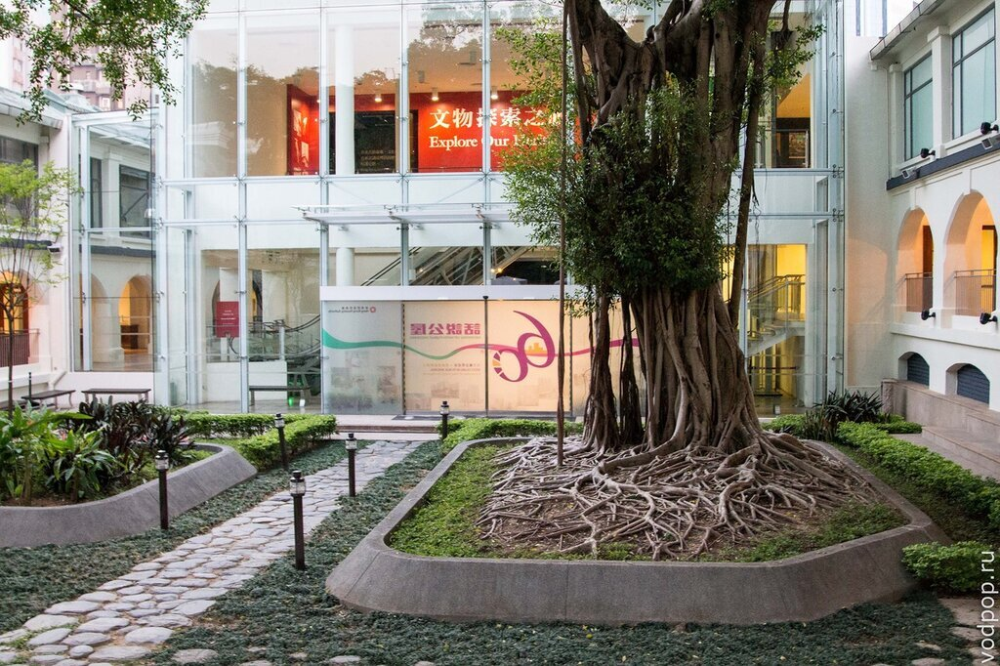
- Ботанический и Зоологический сады Гонконга. Официальный сайт [http://www.lcsd.gov.hk/parks/hkzbg/en/index.php](http://www.lcsd.gov.hk/parks/hkzbg/en/index.php) . Очень интересное и красивое место! Кусок джунглей в мегаполиса. Почти не слышна шума дорог, множество интересных животных и растений. Одни розовые фламинго чего стоят! 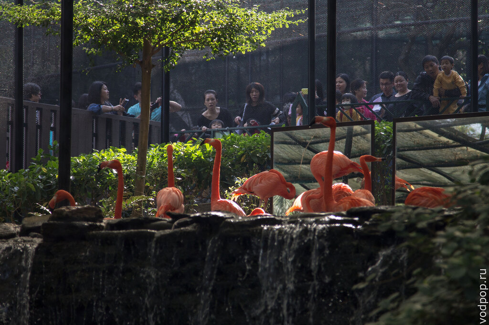
- самый длинный эскалатор в Гонконге, он же и в мире, протяженностью 800 метров. Находится недалеко от станции метро Central. Ежедневно перевозит несколько тысяч людей на работу и с работы. У него весьма интересный режим работы: с 6.00 до 10.00 работает на спуск, а затем с 10.30 до полуночи на подъем. Можно сойти в престижный район Сохо, или прогуляться по Голливуд роад. 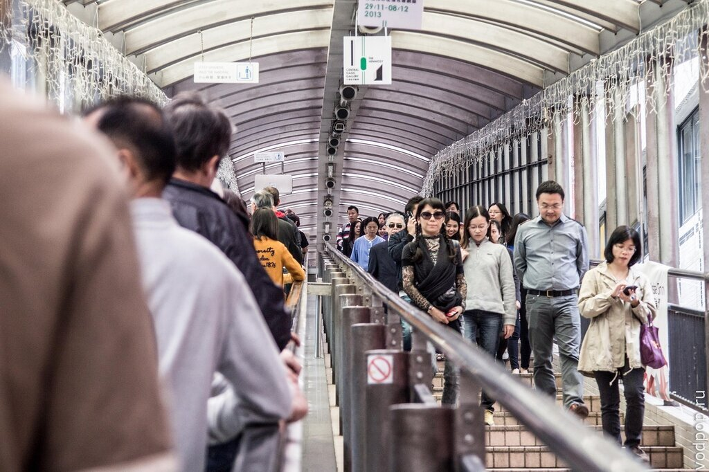

Обратите внимание, что во всех общественных зонах курение запрещено, и карается весьма и весьма высоким штрафом. 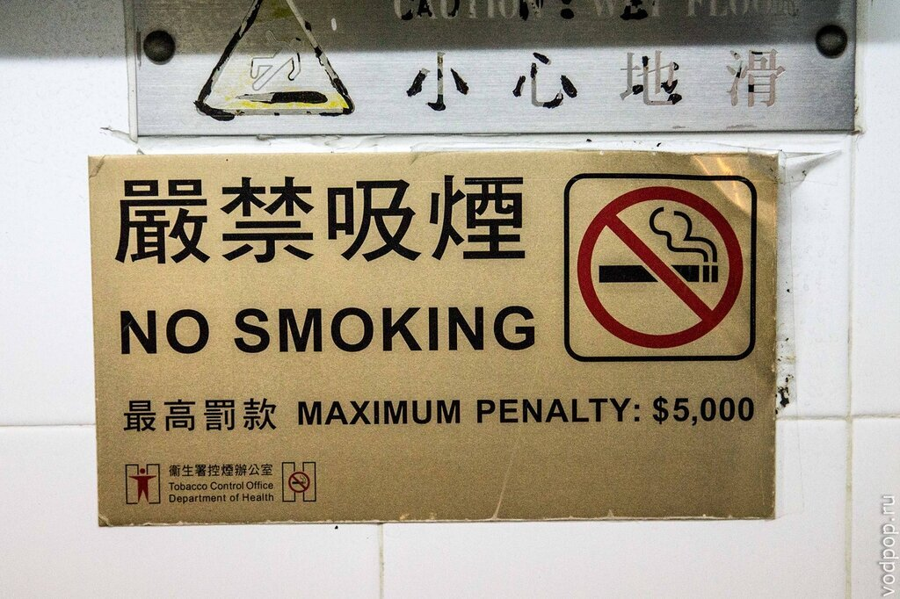

Надеюсь, что наш список достопримечательностей Гонконга поможет вам сориентироваться в этом городе. Есть много интересных путеводителей (мы брали один из них в нашем хостеле) , которые также смогут ответить на вопрос, что посмотреть в Гонконге. Если остались вопросы - добро пожаловать в комментарии !
