С утра мы поздно продрали глаза - накануне мы сильно нагулялись и устали. Вовка на своем браслете мониторит, сколько мы прошли за день, и за все дни поездки мы ни разу не опускали планку на меньше, чем 15 км. Так как был мой день рождения, а мое любимое развлечение - это купаться, то мы поехали на Северное море в поисках пляжа, и только потом в Эдинбург: гулять и смотреть достопримечательности

<!--more-->

## День седьмой. Эдинбург

Мы немного пробежались (Дашка с Вовкой в кроссвоках по берегу, а мы с Климом босиком рассекали воду), а потом с дикими криками лезли в очень бодрящую воду. Затем был завтрак с английским пуддингом, свечки и загадывание желаний, вручение подарков, стирка, душик и все такое... 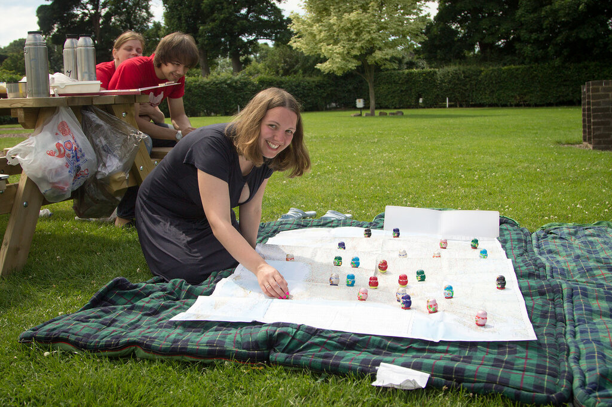

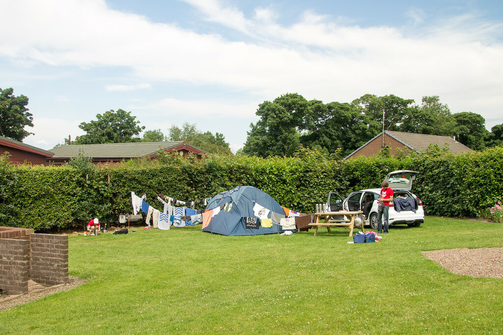

в общем, в Эдинбург мы добрались к 15 часам, и сразу рванули в Национальный Музей, который работает до 17. Даже заплатили за платную парковку по 2,40 фунта в час: при нас грозная тетенька выписала штраф другой машинке, которая решила этого не делать. Сумму мы не уточняли, но она явно превосходит МРОТ в Москве. 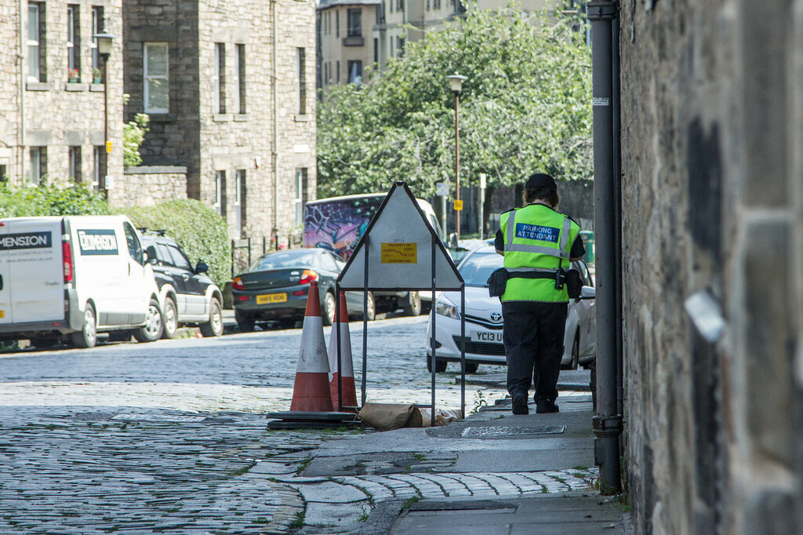

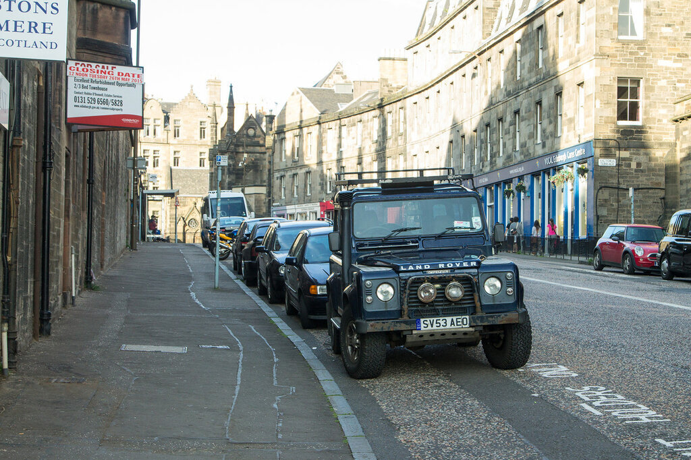

Времени на музей было катастрофически мало, и мы не все достопримечательности Эдинбурга успели посмотреть: изначально был план вернуться на следующий день и досмотреть оставшееся, но мы решили двигаться дальше, так как впереди много точек. 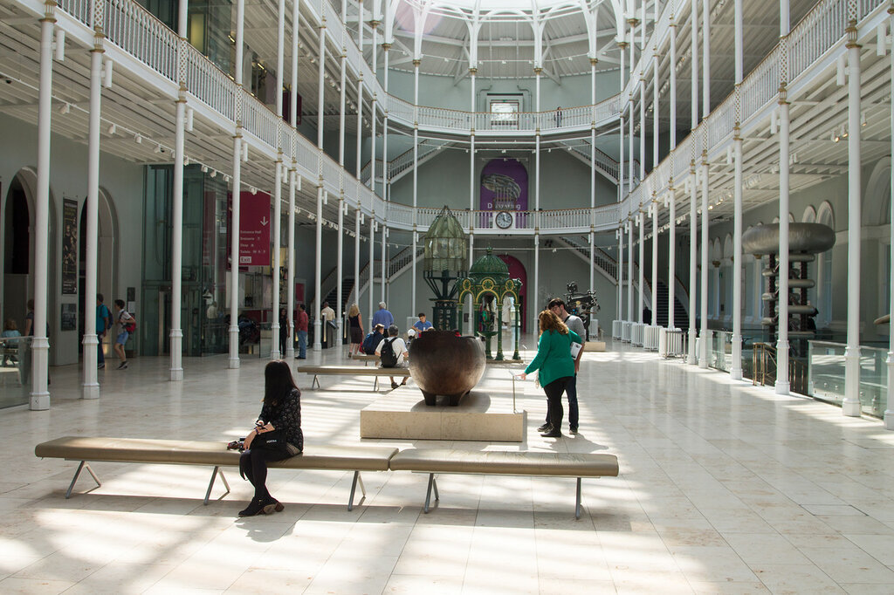

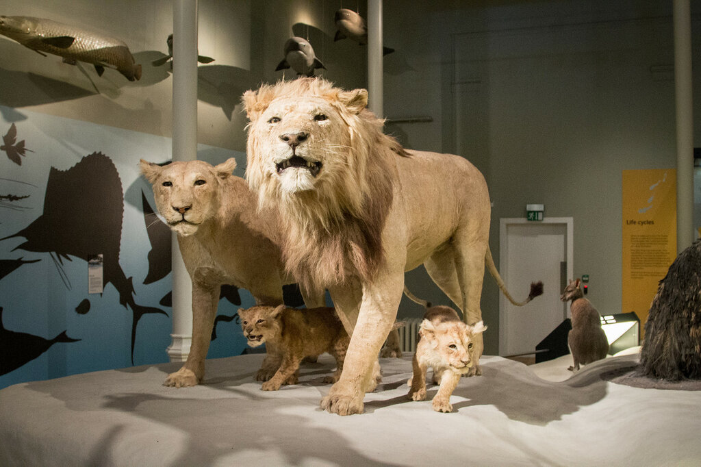

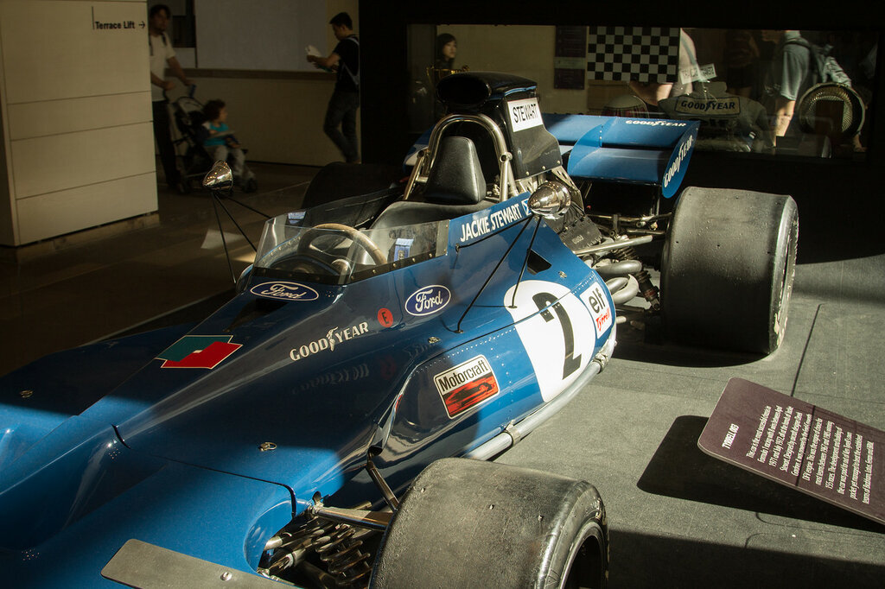

Так вот, когда нас выгнали из музея, мы пошли гулять по центру: к Эдинбургскому Замку, потом опять к Королевской Миле. 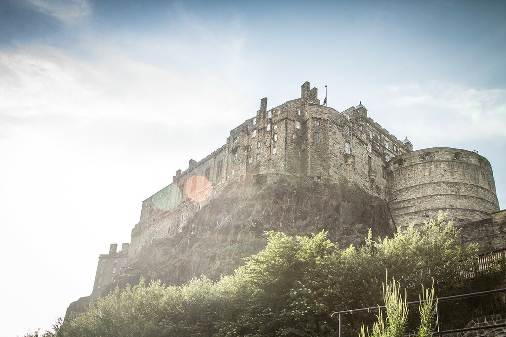

Так что, если отбросить культурные достопримечательности, то Эдинбург можно охватить буквально за день - этого хватит, чтобы прогуляться по основным улочкам (по некоторым даже два раза). 

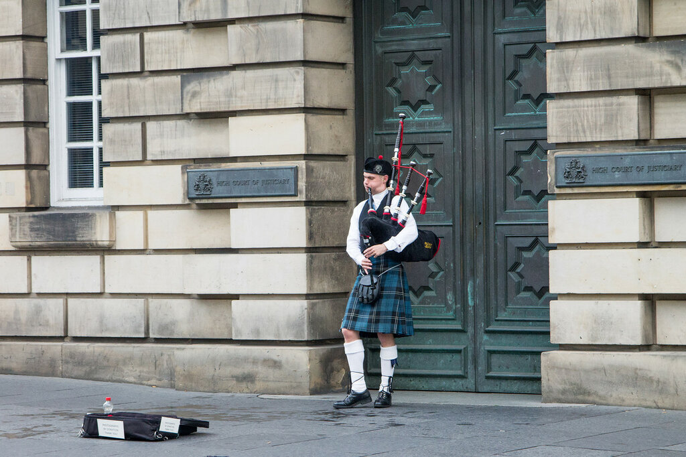

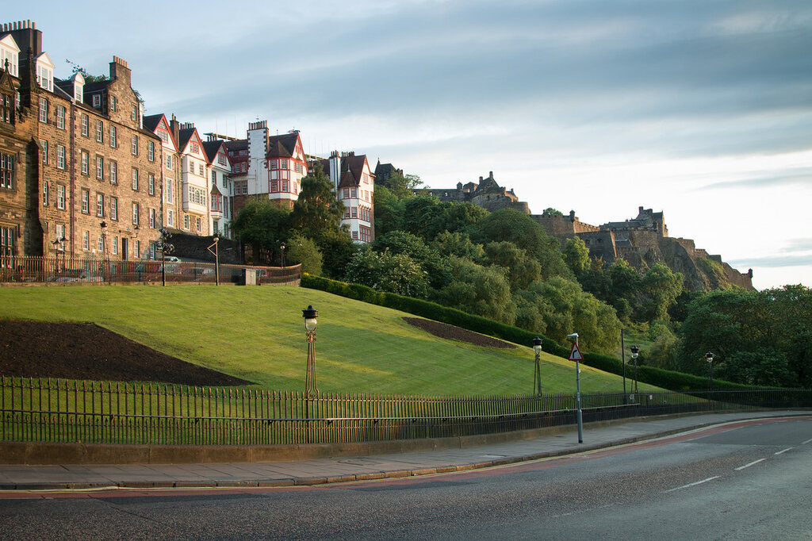

На музеи надо закладывать пару дней - у нас неохваченной осталась Национальная Портретная Галерея и Музей Современного Искусства: будет повод слетать в Эдинбург еще раз. 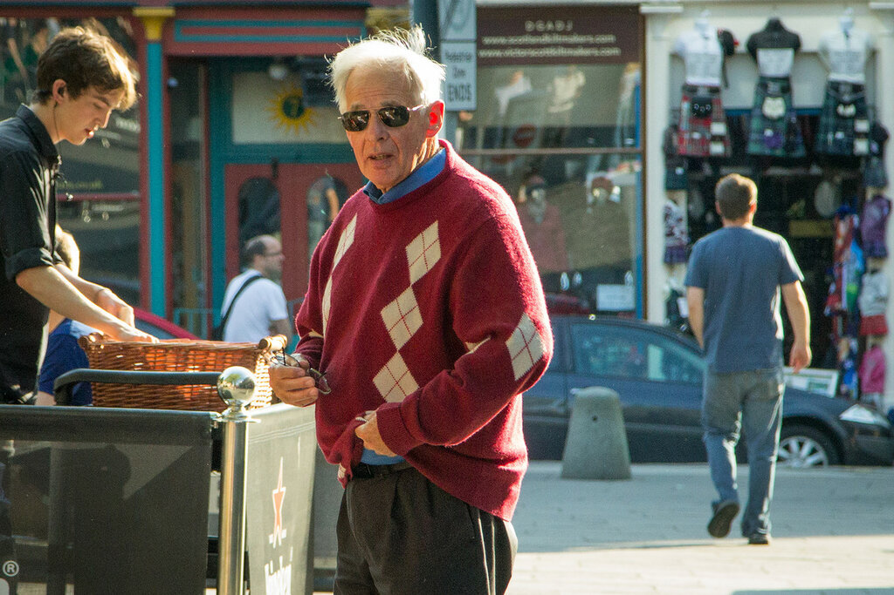

Пока из всех охваченных нами городов мне Эдинбург понравился больше всего, особенно в предзакатные часы. 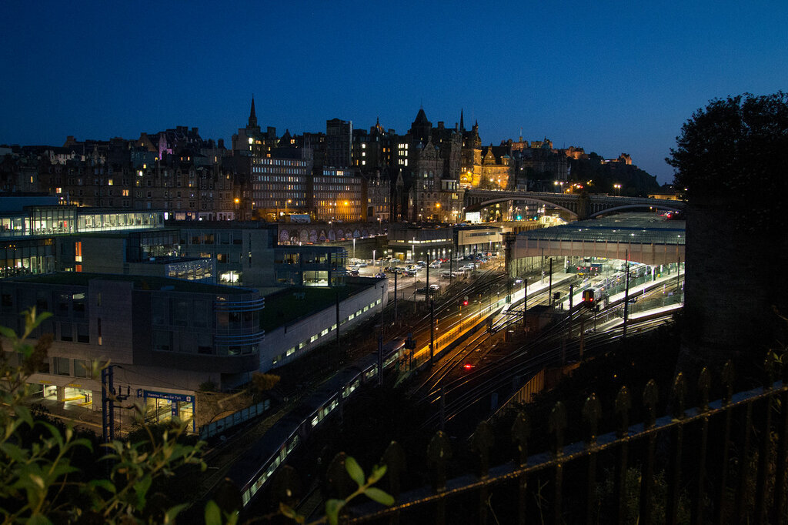

Если вам удастся забраться на один из семи холмов этого города, то увидите потрясающую панорами в тепло-желтых оттенках. 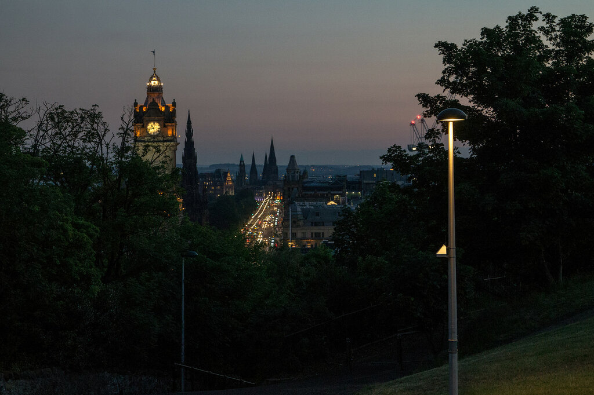

Вечером мы попробовали новый вкус Ягермейстера - нашей любимой травяной настойки, которую мы берем в каждую поездку, так как это единственный для нас приятный крепкий алкоголь, который можно ничем не разбавлять. Без него очень сложно купаться в северных морях и озерах, а также здорово отогреваться после длинной каталки на склонах.

Так вот, новый Ягерь был со вкусом ванили и корицы, за счет чего пьется очень мягко, и мы совсем незаметно выпили половину бутылки в 700 мл. В принципе, это не так уж много, но мы редко пьем больше одного глотка, и потом крепко удивились, как же мы так быстро его распробовали.

Потом мы досматривали последнюю часть Гарри Поттера - подсадив на эту вселенную Климентия и Владимира, которые не прочитали ни одной книги из серии и смотрели несколько фильмов, но ничего из них не помнили. Примерно за два месяца, когда эта поездка начала формироваться в голове, мы с Дашей решили показать ребятам хотя бы фильмы, чтобы они прониклись ГП и разделяли с нами восторги по поводу Виадуков, Дырявых Котлов, Кингс-Кросса и других примечательных объектов.

Читайте другие статьи из нашего путешествия по Великобритании летом 2015 года (подробная информация о том, что посмотреть в Англии и Шотландии): [Что посмотреть в Англии. Часть 1: Кембридж, Элай и Петерборо](https://vodpop.ru/chto-posmotret-v-anglii-chast-1/) [Что посмотреть в Англии. Часть 2: Шеффилд и Йорк](https://vodpop.ru/chto-posmotret-v-anglii-sheffild-i-york/) [Что посмотреть в Англии. Часть 3: Достопримечательности севера](https://vodpop.ru/chto-posmotret-v-anglii-sever/) [Что посмотреть в Англии. Часть 4: Достопримечательности Лондона](https://vodpop.ru/chto-posmotret-v-anglii-dostoprimechatelnosti-londona/) [Что посмотреть в Англии. Часть 5: Виадук Гленфиннан, Саутпорт и Сноудония](https://vodpop.ru/chto-posmotret-v-anglii-viaduk-glenfinnan-sautport-i-snoudoniya/) [Что посмотреть в Шотландии. Часть 2: Природа Шотландии](https://vodpop.ru/chto-posmotret-v-shotlandii-priroda-shotlandii/) [Что посмотреть в Шотландии. Часть 3: Достопримечательности Шотландии](https://vodpop.ru/chto-posmotret-v-shotlandii-dostoprimechatelnosti/)
