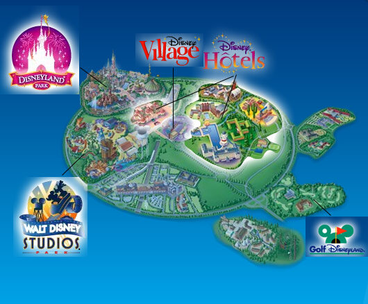
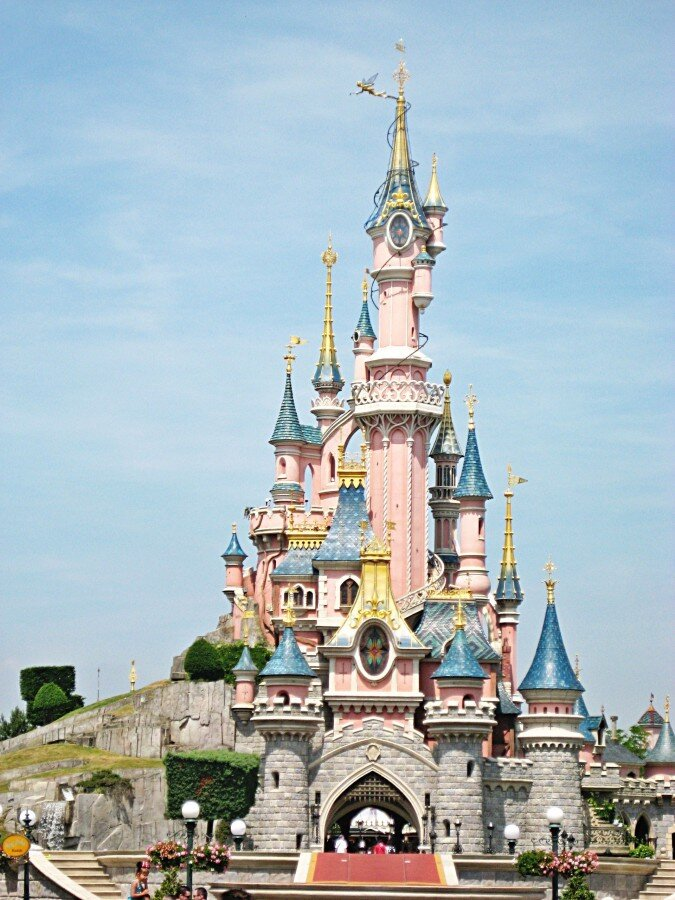
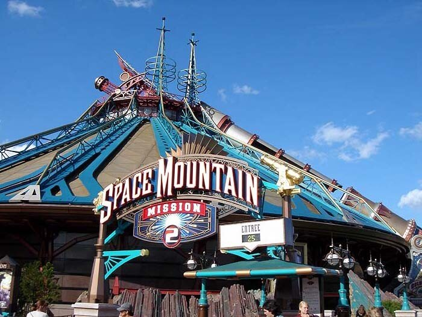
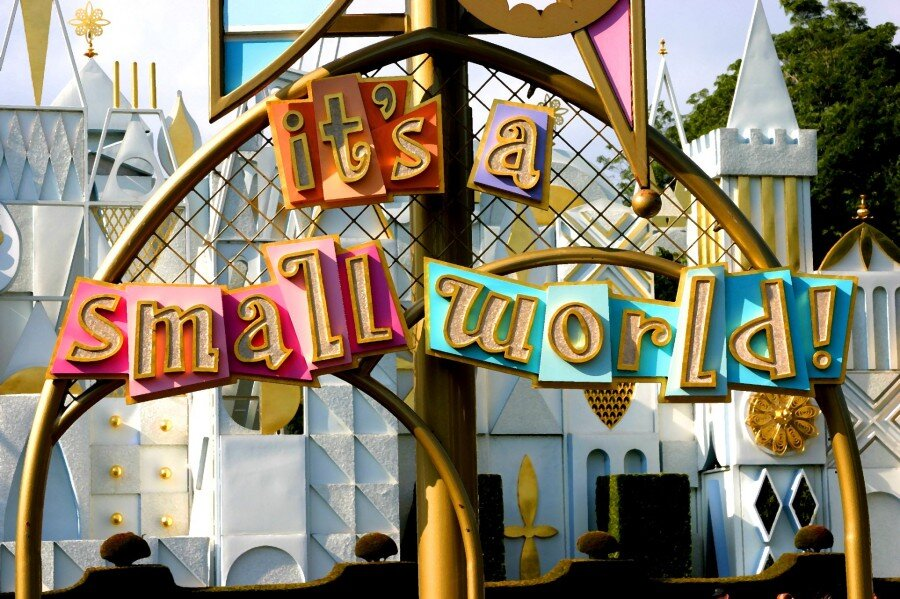
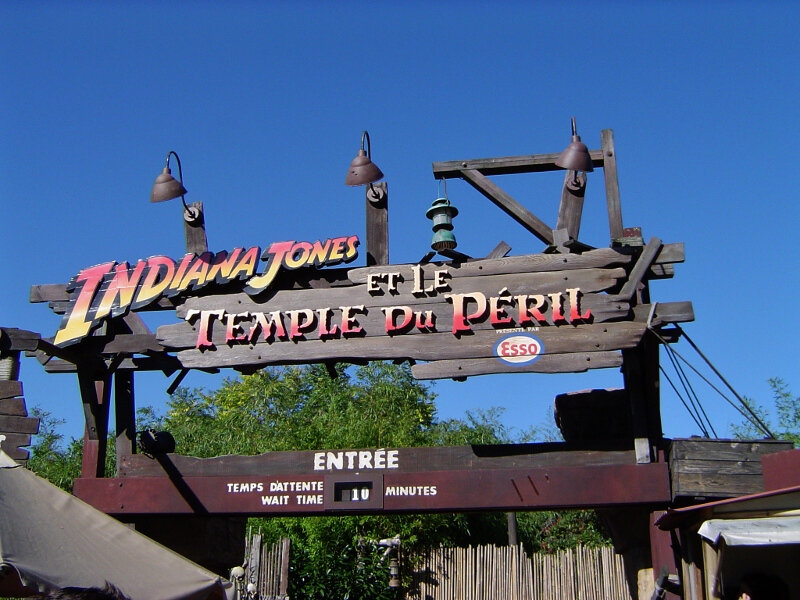
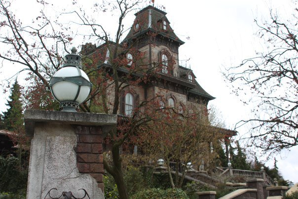
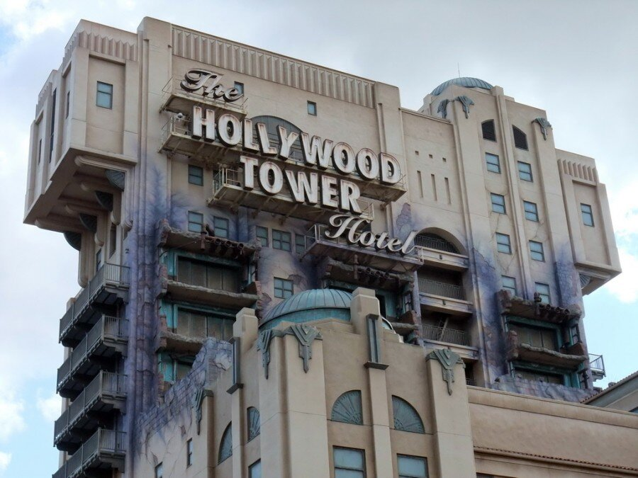

Париж, день 3. 
На третий день пребывания в Париже у нас была запланирована поездка в Диснейленд – в мир детства, сказок и любимых мультфильмов.  

Под катом советы для тех, кто собирается в Диснейленд и наши впечатления.

<!--more-->

1\. Определитесь с тем, зачем вы едете в Диснейленд. Самое время сказать, что это не один парк, а целых два: Disneyland Park и Walt Disney Studios Park. Я не буду писать, какой из них лучше – они оба по-своему интересны и каждый заслуживает того, чтобы его посетили. Аттрационы нужно выбрать в зависимости от того, каким составом вы едете и какие эмоции хотите получить – здесь есть развлечения как для самых маленьких, так и для взрослых искателей приключений. На карте, которую вам обязательно выдадут бесплатно при покупке билетов (или же вы возьмете ее сами, при входе в парк) аттракционы отмечены разными цветами:  
a) Зеленый — для всей семьи;  
b) Синий — развлечения для самых маленьких;  
c) Красный – острые ощущения\*  
и галочками отмечены те, которые обязательно стоит посетить .  
\* — для взрослых и детей выше 130 см (зависит от аттракциона)  
2\. Покупайте билеты заранее, если вы едете в «высокий сезон». Информацию о стоимости и часах работы можно посмотреть на официальном сайте парка:[http://www.disneylandparis.com/](http://www.disneylandparis.com/). Билеты можно купить и на месте, но это займет больше времени и придется постоять в очереди. Если вы относитесь к льготной категории (например, студенты или пенсионеры), смело берите подтверждающие льготу документы – обязательно сделают скидку. По умолчанию вам продадут билет на вход в оба парка, поэтому если вы нацелились только на один из них, не забудьте это указать при онлайн-заказе или кассиру в парке.  
3\. Спланируйте свой маршрут. Парк открывается в 10 утра и чтобы успеть все посмотреть, лучше приехать чуть-чуть пораньше. Проложить маршрут от отеля до Диснейленда можно с помощью официального сайта французского метро: [http://www.ratp.fr/en/](http://www.ratp.fr/en/) . Из Парижа до парка можно добраться на электричке (RER) по линии А1 в сторону Marne-la-Vallee Chessy, которые ходят каждые 10-20 минут. Переход на RER есть на станциях Opera, Chatelet Les Halles, Gare de Lyon и Nation. Особое внимание нужно обратить на то, что для поездки в Диснейленд требуются специальные билеты, которые проще всего купить у кассира прямо на станции, сказав магическое слово «Диснейленд». Вас обязательно поймут!  
4\. Возьмите с собой еду и бутылку воды (или чай, если едете зимой) – на территории много кафе и ресторанов, но продают только фаст-фуд и газировку. В ресторане можно поесть вкуснее и полезнее, но цены кусаются. Есть несколько кофеен, где можно отдохнуть, выпить горячий шоколад и съесть вкусный маффин всего за 4,8 евро.  
5\. Если едете в холодное время года, одевайтесь потеплее – очереди на аттракционы даже в низкий сезон могут достигать 30-60 минут – обогревателей на улице у них нет, есть риск замерзнуть.  
6\. Активно используйте fast-pass (FP) – билеты на быстрый проход на аттракционы. FP действуют на самых популярных аттракционах (на каких именно – отмечено на бумажной карте, на схемах внутри парка и в бесплатном мобильном приложении для IPhone и Android). Получить их можно используя свой билет на вход в специальном автомате – нужно провести билет магнитной полосой (словно оплачиваете покупки кредиткой) и из автомата получить FP – листок бумаги, на котором будет указан промежуток времени (15-20 минут), в который вы можете пройти без очереди. В один промежуток времени можно взять только 1 FP и нельзя взять следующий, пока не истечет время предыдущего. Если вы вдруг передумали, то FP всегда можно аннулировать в сервисном центре.  
7\. Шоппинг лучше отложить на конец дня – с первого же шага на территорию парка вокруг вас будет куча магазинчиков, манящих красивыми витринами. Но они работают допоздна, а вот аттракционы быстро заполняются людьми и закрываются раньше.

Наш день в Парке прошел очень насыщенно – пройдя буквально 100 метров от станции Marne-la-Vallee, мы встали в небольшую очередь за билетами. Не прошло и 10 минут, как мы оказались на главной улице Main Street U.S.A. , где сказочный мир берет свое начало – домики с небольшими окошками и цветной черепицей словно переместились из любимых мультфильмов. Тут и там ходят взрослые и дети, с шапками Микки-Мауса на голове, купленными в одном из безчисленных магазинчиков. Почти бегом мы оказались у центральной площади, откуда открывается вид на всем знакомый замок Спящей Красавицы, который мы так часто видим в начале всех диснеевских мультфильмов.  
  
Чувство щенячьего восторга переполняет, потому как Диснейленд это место, где сбываются детские мечты. Для тех, кто помнит Дисней-Клуб по выходным на ОРТ, это особенное место – ведь столько раз мы смотрели 40 секундную заставку, где был и замок Спящей Красавицы, и аттракцион Индиана Джонса с мертвой петлей, и знаменитый Орбитрон – в Диснейленде это становится реальным! Хочется везде бежать, чтобы все-все успеть посмотреть.  
Диснейленд Парк разделен на 5 регионов – Adventureland, Fantasyland, Discoveryland, Frontierland и уже упомянутый Main Street U.S.A.  
  
Мы начали с Discoveryland, где прокатились на Space Mountain и Buzz Lightyear Laser Blast. Первый аттракцион один из самых страшных – в нем действуют всевозможные ограничения и не зря – даже у людей, у которых нет проблем со здоровьем, кровь приливает к голове и сердце бьется в бешеном ритме. Описывать ощущения бесполезно, лучше один раз попробовать. Buzz Lightyear – отличный, красочный аттракцион для всей семьи, ни лишенный доли азарта (на индивидуальном табло горят очки за убитых пришельцев). По соседству [Париж.](https://vodpop.ru/parizh-frantsiya/) находится огромный комплекс, в котором можно пообедать, просто отдохнуть и посмотреть мультики на огромном экране.  
  
Fantasyland: Peter Pan’s Flight, It’s a small world и Sleeping Beauty Castle – аттракционы для всей семьи, очень красивые и приводящие в восторг как самых маленьких, так и взрослых [С](https://vodpop.ru/berlin-germaniya/) посетителей парка.  
  
Adventureland: Indiana Jones and the Temple of Peril, а на знаменитые Pirates of the Caribbean попасть не удалось – аттракцион был закрыт до конца месяца на реставрацию.  
  
Frontierland: Phantom Manor и Big Thunder Mountain (очень похожий на Indiana Jones).  
В промежутках между FP мы бегали в Walt Disney Studios (от двери до двери расстояние примерно 200 метров), где, увы, почти все будоражащие аттракционы были закрыты, но кое-что нам все-таки удалось увидеть, а именно: Crush’s Coaster и The Twilight Zone Tower of Terror.  
  
Последний можно назвать самым экстремальным, ибо лететь в неизвестность и ощущать свободное падение можно разве что во время прыжка с парашютом. Впечатление «портит» одна мысль, что в Диснейленде все очень безопасно и продумано до малейших деталей.  
Итак, забежав по пути в один из наполненных гостями парка магазинчиков, мы вернулись в Париж.
