Бурса в Турции - это скрытая жемчужина, которая никогда не появляется в пакетных турах или даже экскурсиях, предлагаемых при заселении в отель. Встретить русского там такие же высокие шансы, как [на леднике в Исландии](https://vodpop.ru/islandiya-zimoy-chast-3-strana-ldov/), хотя, как говорится, чем черт не шутит...

<!--more-->

Бурса находится почти в 20 км от Мраморного моря и доступна как по земле, так по воздуху и обычным дорогам.

## **Как добраться  из Стамбула в Бурсу:**

1. Воспользоваться паромом одной из компаний, осуществляющих морские перевозки через Мраморное море. Время в пути - 2 часа, но надо следить за расписанием и не забывать, что в преддверии выходных голубые воротнички из Стамбула также садятся в машинку и стараются укатить подальше от города - мест в пятницу вечером может уже и не быть.
    - [http://www.ido.com.tr](http://www.ido.com.tr/en) - доступна английская версия
    - [https://budo.burulas.com.tr/](https://budo.burulas.com.tr/) \- только на турецком, но интуитивно понятно, что надо делать
2. Проехать вокруг Мраморного моря - подойдет тем, кто хочет постоять в пробках не смог или не захотел плыть на корабле.

Возможно, вам также будет интересно узнать, как можно [дешево долететь до Стамбула](https://vodpop.ru/kak-kupit-samyie-deshevyie-aviabiletyi/).

Объезд занимает около 3 часов, и тут уже вам решать, какой вариант предпочтительнее. Мы выбрали второй и не разу не пожалели: море мы видели и до этого, а вот посмотреть на обычные городки и деревушки Турции, мимо которых лежал наш путь - это всегда интересно.

Мы [забронировали номер на двоих в Alhas Hotel](http://www.booking.com/hotel/tr/bursa-alhas.ru.html?aid=878635;sid=b6008aa2510d1d9a03d3b7b2e3d86468;dcid=1;checkin=2016-04-20;checkout=2016-04-21;dest_id=-740501;dest_type=city;dist=0;group_adults=2;room1=A%2CA;sb_price_type=total;srfid=814023c5fe6748c687eb9253a16a7dc834f0d816X18;type=total;ucfs=1&) из небольшого количества вариантов, свободных на наши даты и адекватных по деньгам. Отель был так себе, но завтрак и вид на город с последнего этажа очень понравились.

Рядом есть торговый центр, где мы потратили около часа в попытках сэкономить на приобретении симки. Самый выгодный тариф оказался у [Turkcell](http://www.turkcell.com.tr/) - одного из трех крупных операторов Турции.

Жаба душила отдавать 40 лир (1000 рублей) просто за симку, плюс еще 20 за 1гб интернета, но страдать каждый раз из-за невозможности найти ночевку или дорогу к интересующим местам не стоит никакой экономии.

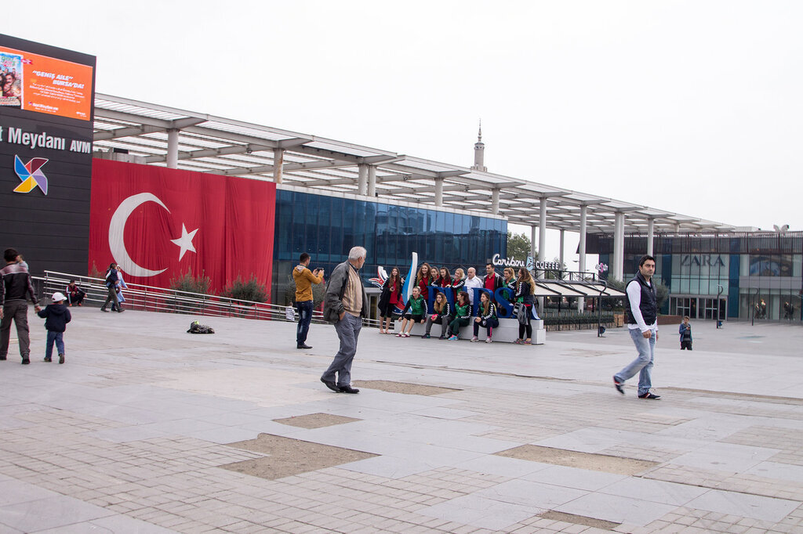

Изрядно устав от общения на ломаном английском, мы выбежали из ТЦ и поехали смотреть город. Бурса лежит вдалеке от туристических троп, хотя все-таки японские и южно-корейские туристы заезжают сюда целыми группами. Чем это объяснить, я не знаю.

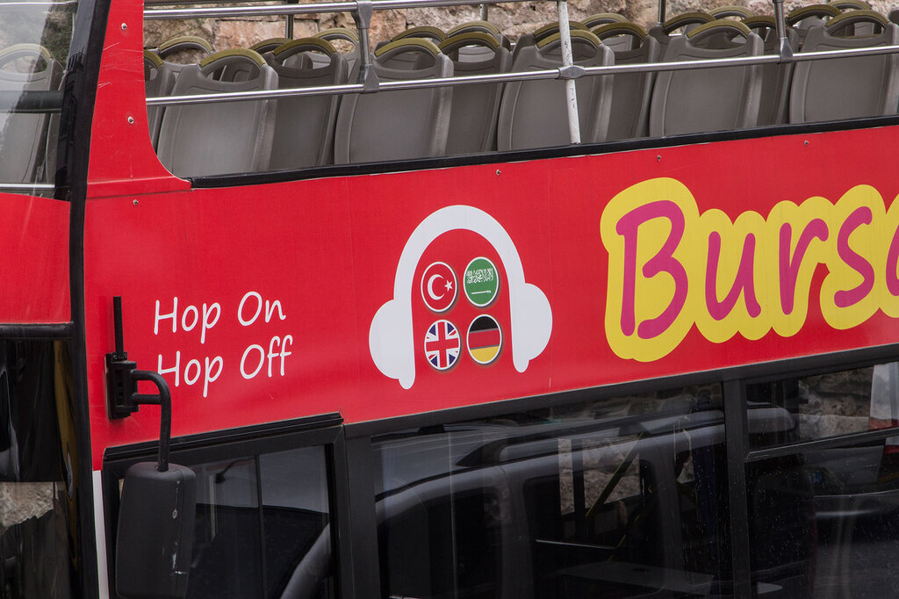

## **Интересные факты о Бурсе :**

1. Бурса была столицей Оттоманской империи в период с 1326 по 1365 г. До этого времени город принадлежал Византийской Империи
2. Турки называют город "Зеленая Бурса" из-за большого количества зеленой  растительности вокруг и внутри города.
3. Улудаг - популярный горнолыжный курорт Турции, сюда приезжают как местные, так и иностранцы.
4. Неподалеку от города расположены лечебные источники. Отличный конкурент отечественному [Кисловодску](https://vodpop.ru/vershinyi-dombaya/).
5. Бурса исторически славится своим ткацким ремеслом. Даже во время османского периода, город остался главным производителем и поставщиком шелковых одежд для высших слоев общества. Помимо собственного шелкового производства сюда импортировали шелк из Ирана, а иногда и из Китая. В Бурсе шили кафтаны, подушки и другие предметы интерьера для дворцов Османской империи до 17-го века.
6. Бурса - четвертый по населенности город Турции (проживает почти 3 млн. человек) и является центром внимания для беженцев турецких кровей из других стран. Так, в начале 20 века сюда изгнали 150 тысяч болгарских турков.
7. Город также является центром автомобильной промышленности Турции: здесь производят Fiat, Renault, а также делают запчасти Bosch, Мако, Valeo и т.п. Помимо этого здесь расположены Coca-Cola, Pepsi Cola и другие крупные пищевые производства. Пожалуй, серьезную конкуренцию ему может оказать только город Гебзе, где также расположены сотни заводов, в т.ч. таких гигантов как Uniliver и Colgate-Palmolive.

Если говорить о достопримечательностях Бурсы, то почти все они построены во времена Оттоманской Империи, в 14-м веке.

## **Достопримечательности Бурсы, Турция:**

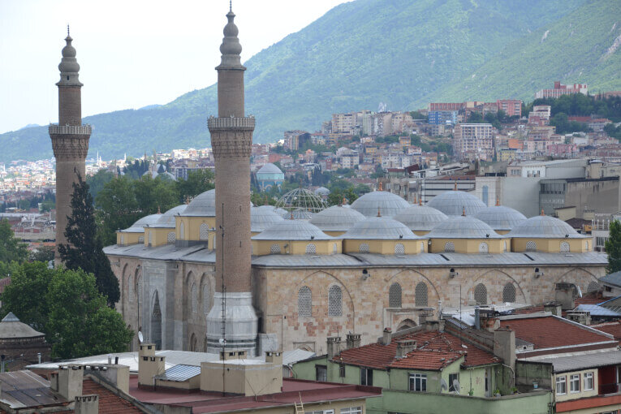

1. Пожалуй, самая известная из них - **мечеть Ulu Cami** (читается как Улу Джами), еще одно название - Grand Mosque (Большая Мечеть).

Нам повезло, так как один из местных кадетов, с которым мы познакомились прямо на улице, провел нам небольшую экскурсию. Мы даже посидели с ним в кафе и пообщались на самые разные темы. Было много о вере и традициях Ислама, о выборе спутника жизни, о том, как современные мусульмане трансформируются и к чему это приводит. О том, что Ислам вот уже второе столетие ассоциируется с терактами и насилием. Словом, о том, что было интересно нам и ему. Мы аккуратно спрашивали о вопросах религии, отношений внутри семьи, так как меньше всего хотели бы обидеть его своим любопытством. Но парень был открыт, и мы с удовольствием провели несколько часов с ним и его другом, который присоединился к нам позже. Мы предложили доехать с нами на вершину горы Улудаг, но им нам надо было возвращаться в школу: они военные, и у них строго лимитированы часы отдыха даже в выходные дни. Я могу потратить еще пару страниц, описывая биографию этого юноши, но хочу лишь выразить нашу радость с Климом, что в мире много таких юных, добрых, честных людей с открытым взглядом на мир, жизнь, религии. Надеюсь, что у него это никогда не пропадет. И у нас тоже.

В случае нас с Климом мы категорически не любим организованные экскурсии, где гид может полчаса не прерываясь пересказывать цифры, даты, имена и названия, которые мы забываем в первые же секунды после того, как услышали. Все это лишнее и отвлекает от главной цели - увидеть, понять, запомнить и составить какое-то собственное мнение о достопримечательности. Поэтому вот такой паренек, который совершенно случайно встретился во время прогулки - идеальный вариант.

Ну а для тех, кто любит историю, все-таки приведу **немного фактов:**

- Улу Джами - самая большая мечеть в Бурсе, построена по заказу султана Баязида I.
- Мечеть спроектирована и построена архитектором Али Наджером в 1396-1400 г.г.
- Здание построено в форме прямоугольника с 20 куполами, которые расположены в 4 ряда по 5 куполов и поддерживаются 12 колоннами. Ходит легенда, что 20 куполов были построены вместо 20 отдельных мечетей, которые обещал возвести султан Баязид I за победу в битве при Никополе в 1396 году
- В мечети два минарета: башен, с которой муэдзин - служитель при мечети,  призывает верующих на молитву

- Внутри мечети есть фонтан, где где прихожане могут совершать ритуальные омовения перед молитвой. Тут-то мы и узнали, что мусульмане - одна из самых чистоплотных наций, т.к. должны омывать почти все тело перед каждой молитвой, т.е. 5(!) раз в день. Говорят, что именно по этой причине их не коснулись многие инфекции, бродившие по средневековой Европе.

 

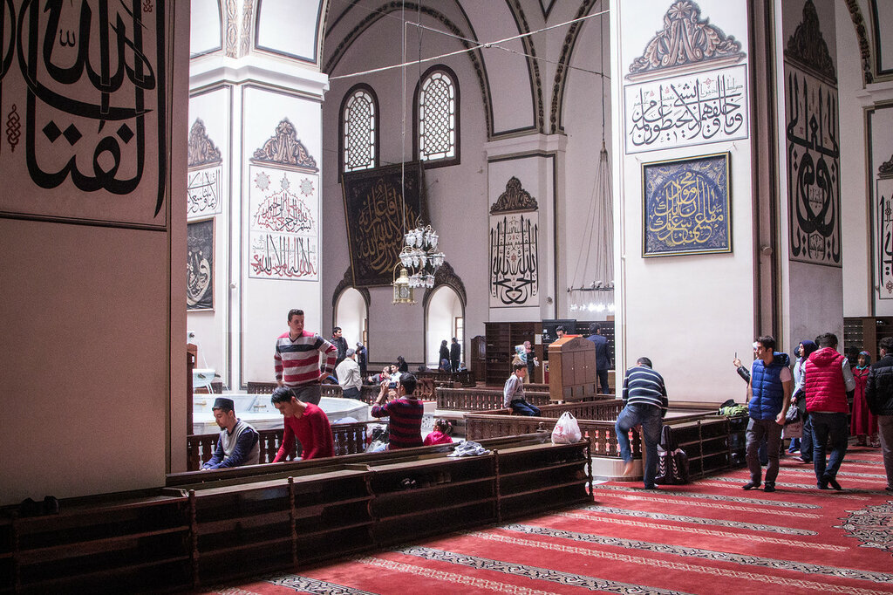

- Прямо над фонтаном купол пропускает естественный дневной свет, благодаря чему внутри мечети мягкое и спокойное освещение.
- Внутри мечети 192 настенные надписи, написанные известными каллиграфами того периода

Как же еще **достопримечательности Бурсы** мы увидели?

2\. Шелковый рынок **Koza Han**

Коза-Хан был построен в 1491 году султаном Беязыт II. Бурса была последней остановкой на Великом шелковом пути из Китая, и потому у рынка Коза Хан было два основных предназначения:

- караван-сарай, т.е. большое строение, служащее кровом и стоянкой для путешественников
- шелковый рынок

Коза Хан состоит из внутреннего двора, окруженного магазинами в два этажа. Удивительно, но меньше всего это место похоже на Турцию, скорее на маленькие дворики Европы.

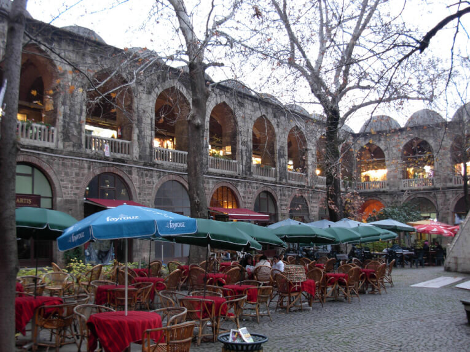

С 14 века гостиница-рынок не сильно изменился внешне: тут все так же много магазинчиков с различными товарами. Теперь тут продают не только шелк, но и обувь, сумки, дизайнерские очки. Есть всякие сувенирные лавки с товаром hand-made. Для желающих проникнуться атмосферой есть несколько кафе, где можно пообедать или просто попить кофе.

3\. **Парк Tophane** Saat Kulesi, или Топхане.

В парке находятся гробницы основателей Османской империи: Гази Османа и его сына Гази Орхана.  Ходят легенды, что Осман сам выбрал место, где его похоронят. Если пройдете прямо от входа по центральной аллее, то увидите башню с часами и несколько старых пушек. Но это не самое интересное, что можно здесь увидеть.

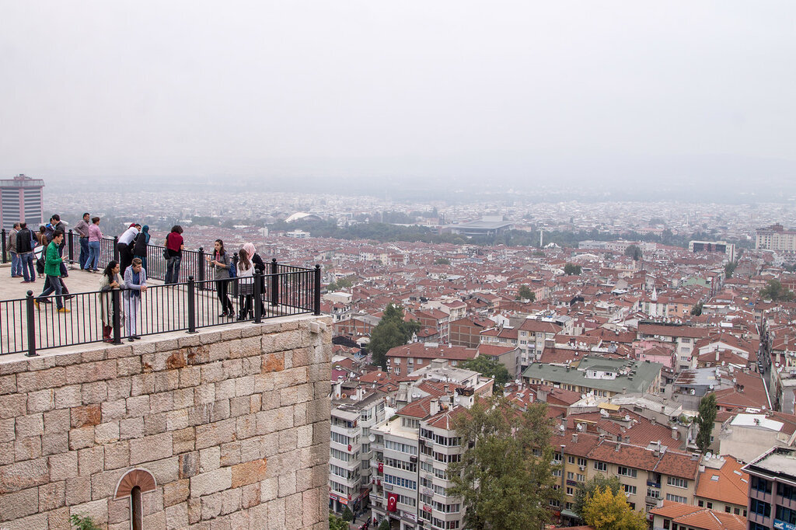

Главное, что отсюда открывается по-настоящему красивый вид на город! 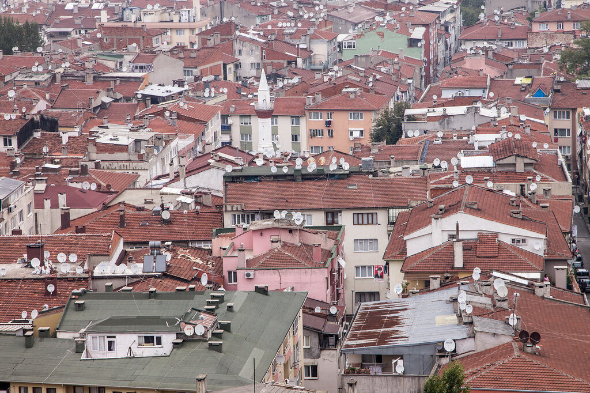

4\. Стены старого города

Отличное место для прогулок внутри старого города. Узкие улочки, обычная жизнь обычных людей. Фото сделано как раз около входа.

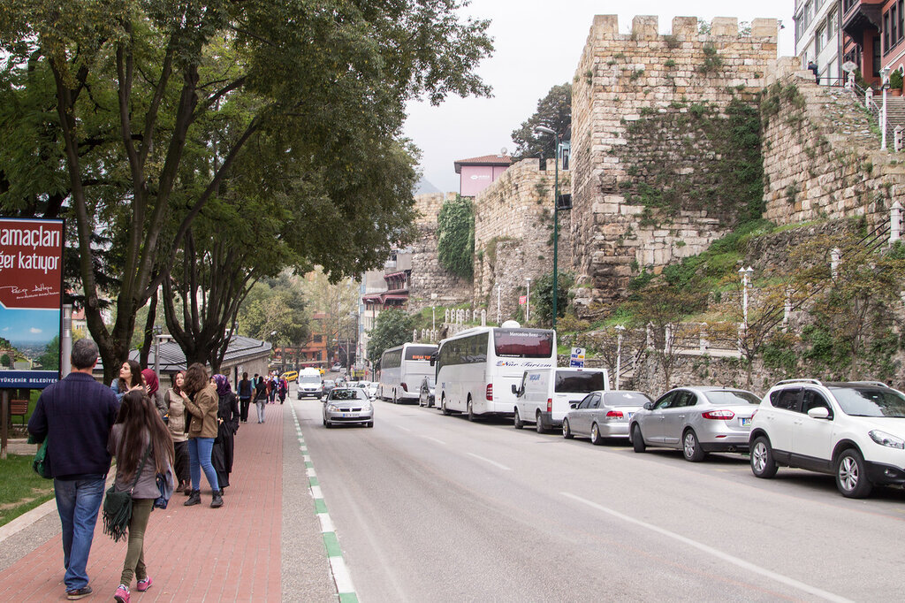

5\. **Кондитерские** лавки и бублик с кунжутом

Не назову какое-то определенное место, но по запаху вы сразу поймете, что вы пришли туда, куда нужно. Здесь можно взять черный и крепкий турецкий чай, который выращивают на побережье Черного моря, или кофе, который обязательно подадут с водой - настолько он крепкий. И, конечно, баклава или бублик с кунжутом, который в Турции называется "simit".

Не забывайте держать глаза широко открытыми, т.к. даже рядом с магазином автозапчастей всегда может соседствовать маленькая кондитерская лавка.

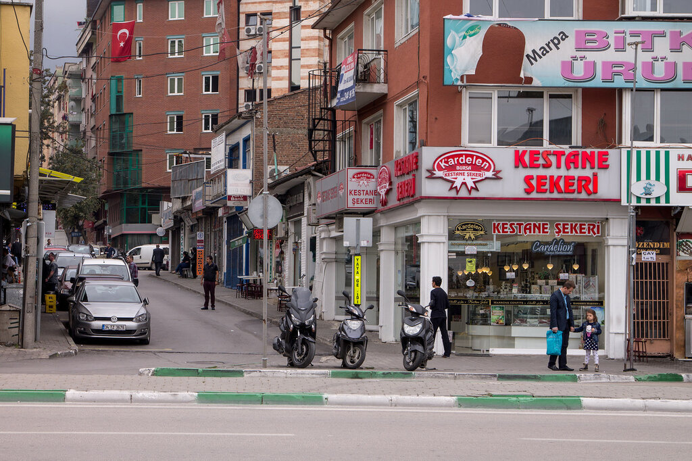

6\. **Люди**

Честно, я бы их поставила на первое место. Нашего мальчика- экскурсовода мы не сфотографировали, так как мы настолько интересно общались, что эта мысль посетила нас только потом, когда мы уже ушли. Но жизнь обычных людей - это всегда очень интересно, особенно когда культура далека от привычной.

Чистильщик сапог

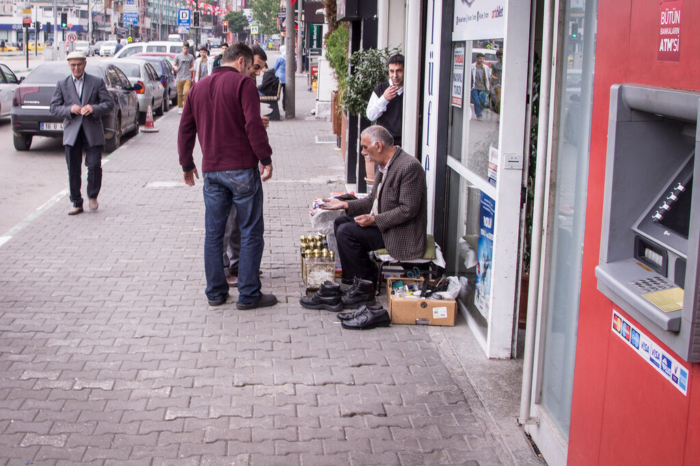

Продавец 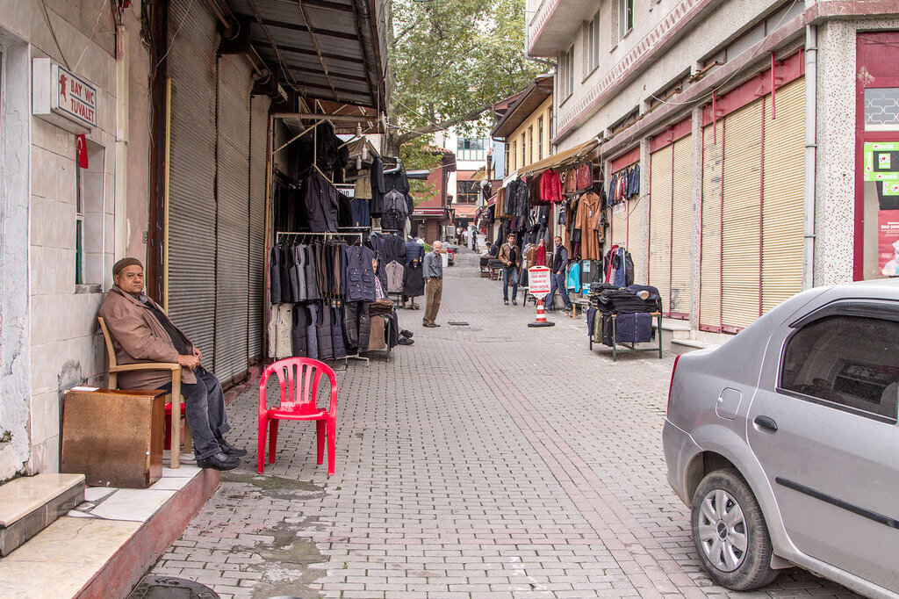

Фермер

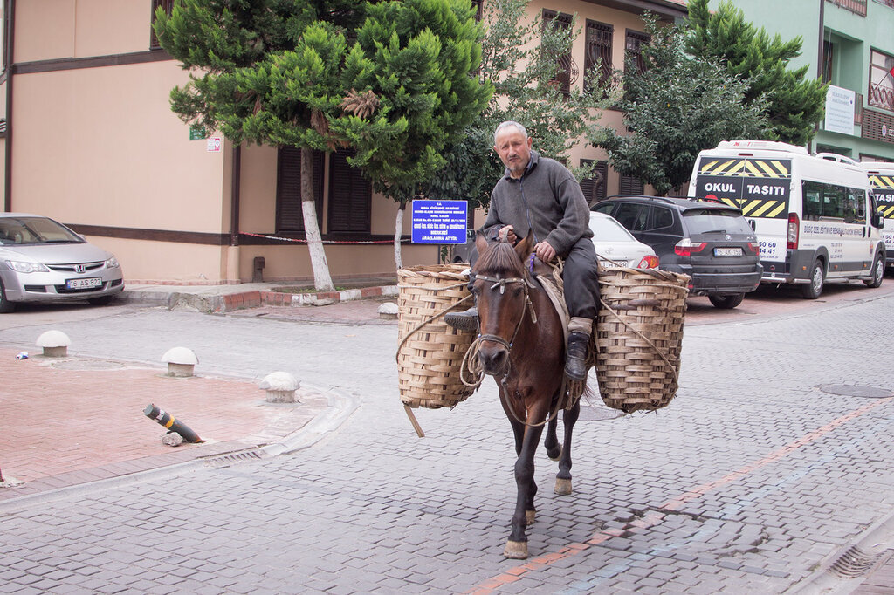

Житель старого города

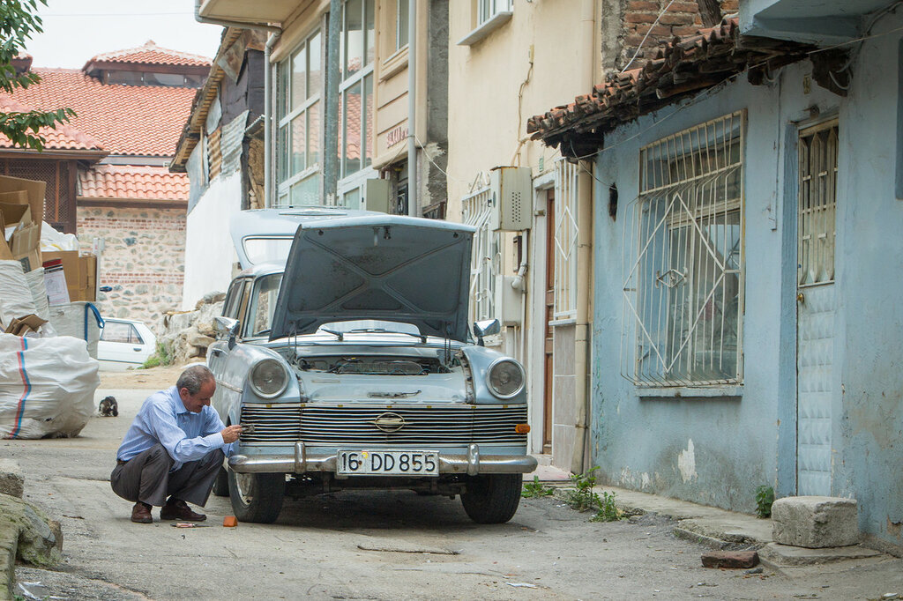

После прогулки по всем достопримечательностям Бурсы можно сходить в настоящий турецкий хамам. Без туристов! Удовольствие стоит 50 лир с человека вместе с массажем. Мы в первый день еще не настолько устали, чтобы расслабляться таким образом, поэтому решили отложить на конец поездки (и правильно сделали!).

Хотите больше интересных историй о самостоятельных путешествиях? Подпишитесь на нас по [эл. почте](http://feedburner.google.com/fb/a/mailverify?uri=vodpop&loc=ru_RU) или в [группе ВКонтакте](http://vk.com/vodpop)
