Продолжение цикла статей про достопримечательности Чианг Мая. Чем еще может удивить северная столица Таиланда?

<!--more-->

С другими достопримечательностями Чианг Мая вы можете ознакомиться тут:

[Достопримечательности Чианг Мая. Часть первая](https://vodpop.ru/dostoprimechatelnosti-chiang-may)

А мы продолжим наш список интересных мест, которые стоит посетить на севере Таиланда.

5\. [Зоопарк Chiang Mai](http://chiangmaizoo.peam.biz/FramesetTravelGuideTemplate1.html) (Chiang Mai Zoo).

Если сравнивать с [другими зоопарками](https://vodpop.ru/oushen-park-v-gonkonge/ "Оушен Парк в Гонконге. Как мы встретились с большой пандой"), то в Чианг Мае он несколько проигрывает конкурентам. Для меня пока образцом для подражания является зоопарк в Злине, Чехия, где все пространство сумели разбить без клеток и металлической сетки.

В чиангмайском зоопарке довольно много животных, и территория рассчитана на прогулку на весь день.

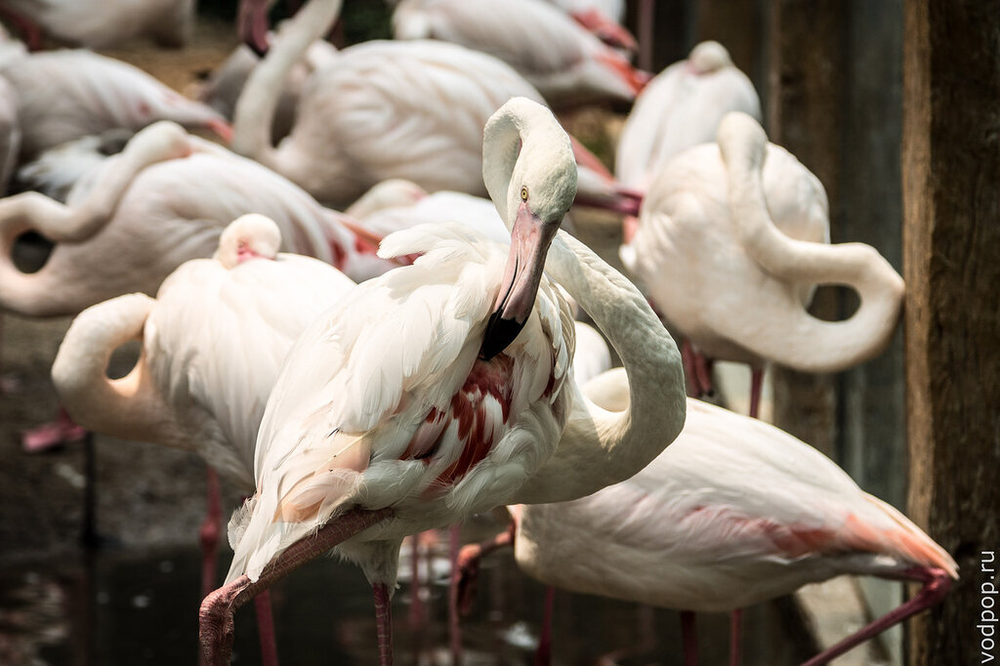

Официально зоопарк работает с 9 до 17, но вы можете немного подзадержаться, т.к. территория действительно большая и стоит рассчитывать из дальнего конца парка на 20-25 минут, чтобы добраться до выхода.

Вход стоит 100 бат, дополнительные 100 бат нужно заплатить, чтобы посмотреть на панд

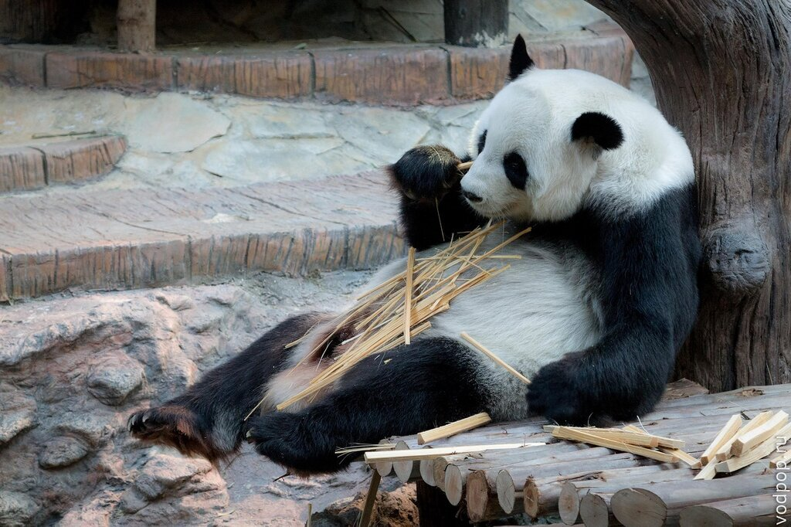

Детям тут точно будет интересно, хотя расстояния придется преодолевать немаленькие

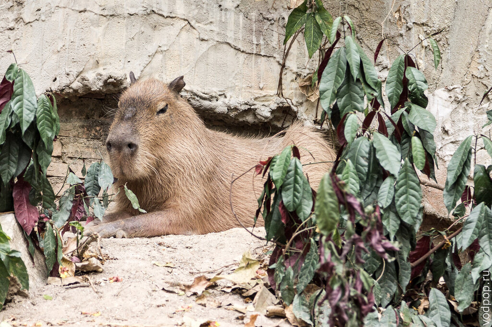

С ограждениями в парке не очень: только тигры, львы и пантеры содержатся в прочных клетках, а вот потомки Бэмби выбегали из своего вольера и смело уходили в гости к другим животным.

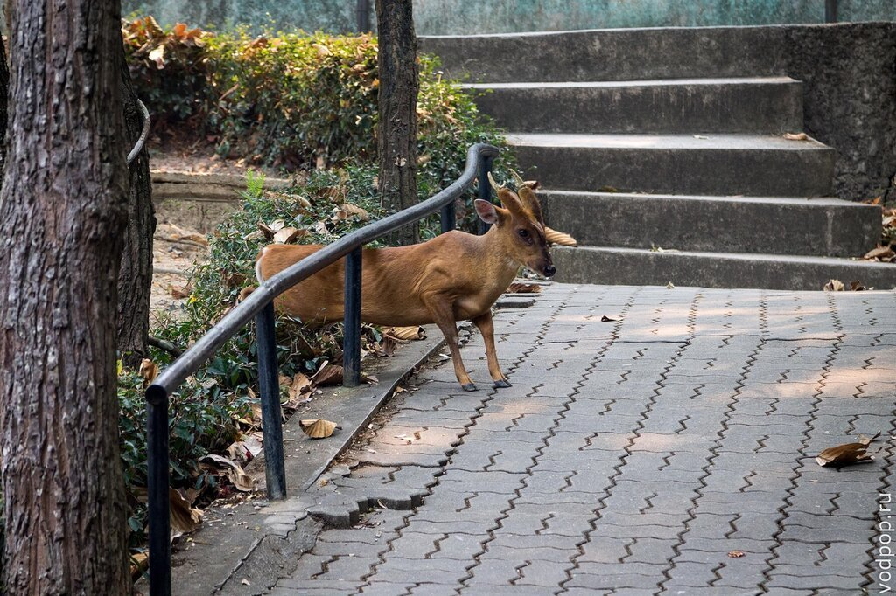

Спящая коала. Сколько раз была в зоопарке, неспящей коалы не видела ни разу!

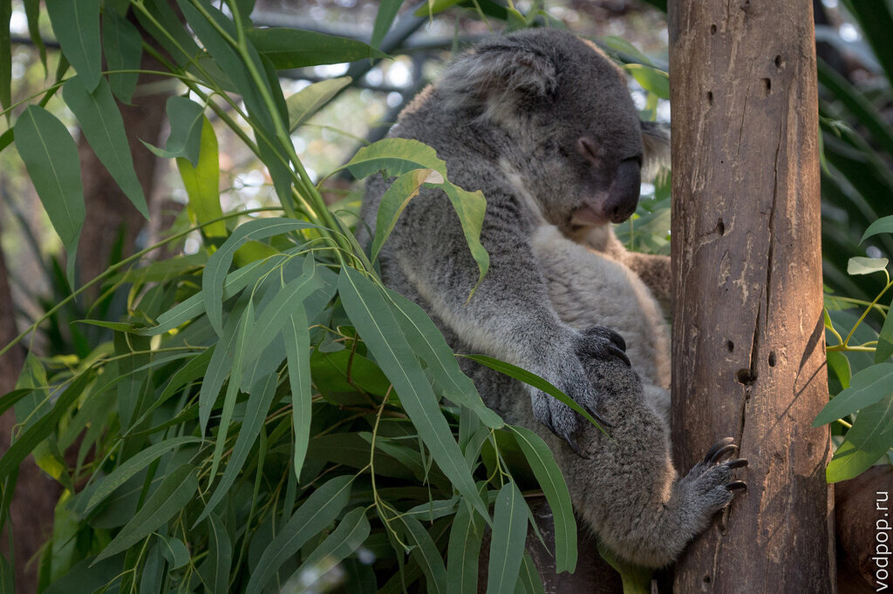

**Как добраться до зоопарка** На своем транспорте - ехать по карте, а таксистам просто сказать "чианг май зуу" - они вас поймут!

<iframe style="border: 0;" src="https://www.google.com/maps/embed?pb=!1m29!1m12!1m3!1d30215.892241760565!2d98.94914736695665!3d18.79875362003278!2m3!1f0!2f0!3f0!3m2!1i1024!2i768!4f13.1!4m14!1i0!3e6!4m5!1s0x30da3a9933111415%3A0x5cf7709a044ba8ba!2sWat+Chedi+Luang+Worawihan%2C+103+Road+King+Prajadhipok+Phra+Singh%2C+Muang+District%2C+Chiang+Mai%2C+50200%2C+%D0%A2%D0%B0%D0%B8%D0%BB%D0%B0%D0%BD%D0%B4!3m2!1d18.786962!2d98.986553!4m5!1s0x30da3a40eb32377f%3A0x164113f7df4d9fb8!2zQ2hpYW5nIE1haSBab28sIDEwMCBIdWF5a2FldyBSZCwgNTAyMDAsINCi0LDQuNC70LDQvdC0!3m2!1d18.809772!2d98.947576!5e0!3m2!1sru!2s!4v1417613251864" width="600" height="450" frameborder="0"></iframe>

6\. Doi Suthep

Гора, на которой расположен одноименный храм Wat Phra That Doi Suthep. Ощущения от него остались не самые приятные - куча торговцев, сувениры, настоящий туристический рай, с толпой людей и шумом. Со стороны похоже на муравейник.

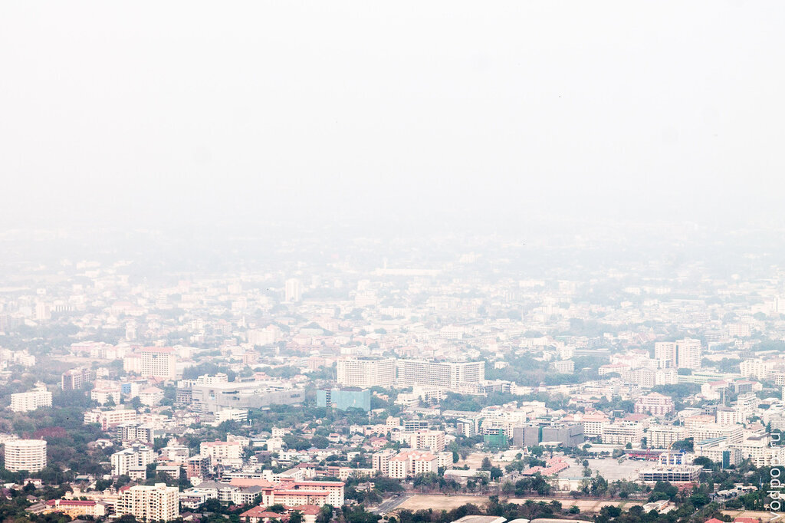

Поэтому мы не стали там надолго останавливаться, а поехали на вершину горы, чтобы полюбоваться видами

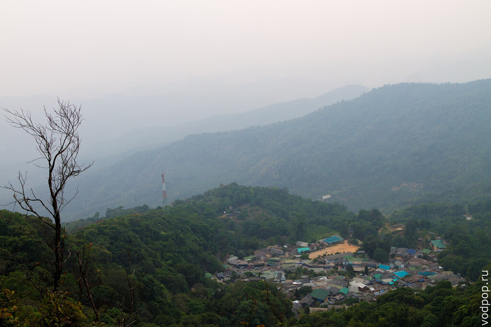

Кстати, в этот раз мы ездили не вдвоем, а аж впятером! В Чианг Мае нам удалось встретиться с ребятами - Лешей и Аленой из Таганрога, с которыми мы познакомились благодаря этому блогу и вместе катались до [Хонда Бей на Филиппинах](https://vodpop.ru/chem-zanatsa-v-puerto-princesse/ "Чем заняться в Пуэрто-Принцессе: Хонда Бэй, гостиницы и рестораны"). Плюс к ним присоединилась подруга Ксюша, и мы большой компанией на двух байках поехали изучать гору.

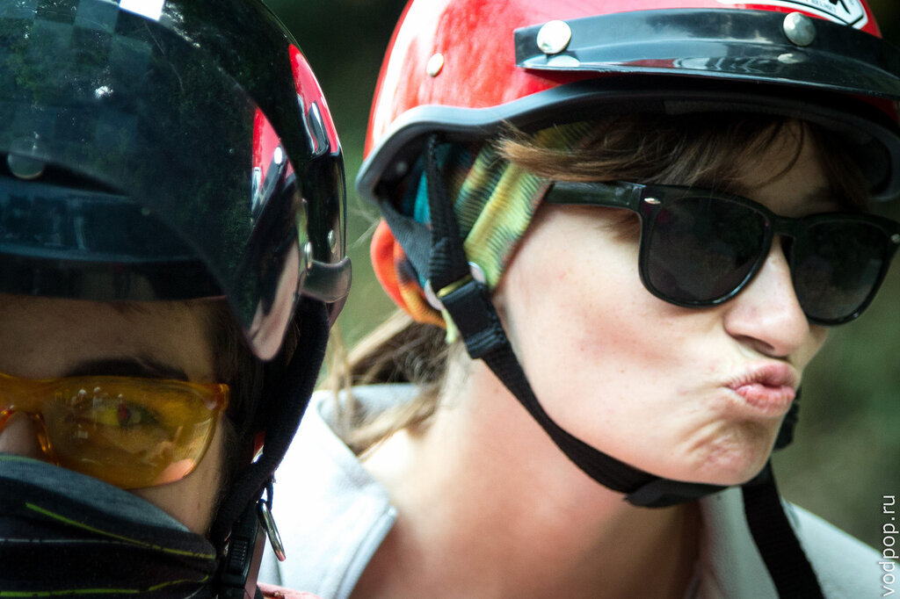

Улыбчивая Ксюша

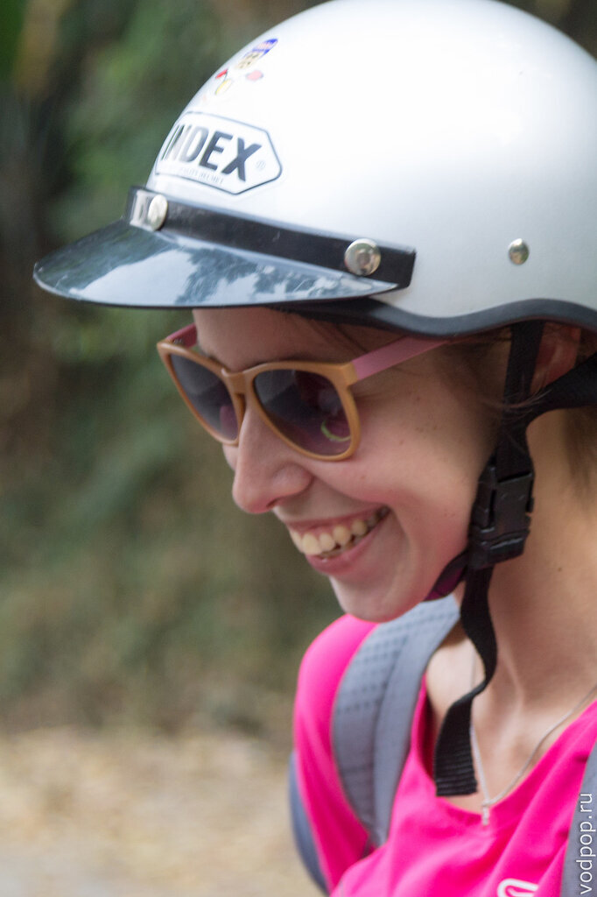

Виды и воздух совершенно меняются - после города отличные ощущения!

Когда мы остановились на маленькой импровизированной смотровой площадке, увидели микроавтобус и людей с камерами.

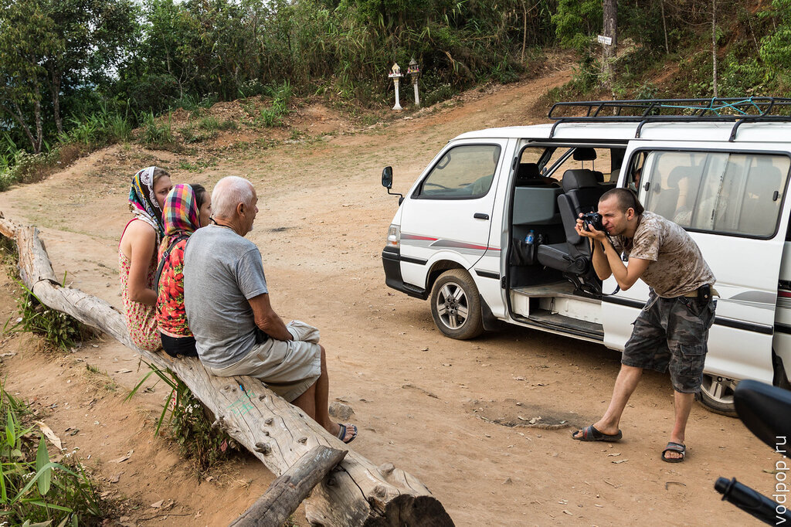

Сначала никак не могли понять откуда такие люди, пока не услышали знакомую русскую речь - тихую и немного странную. Оказалось, что это группа людей, исповедующих индуизм и изучающие Азию и ее святые места.

А по соседству оказались два американца, один из которых 4 месяца путешествовал по России, жил в Курске и пожаловался нам на тотальное незнание английского языка (он сам немного выучил русский, чтобы общаться в магазинах). Ребята дали нам очень полезный совет, чтобы мы разворачивались и ехали по той же дороге обратно в город, т.к. солнце уже шло к закату.

Но мы не послушались, посмотрели карту и уточнив у американцев, что все-таки какая-то дорога там есть, мы решили по ней спуститься, несмотря на их предостережения и фразу "Crazy Russians!"

Виды радовали нас, пока не село солнце.

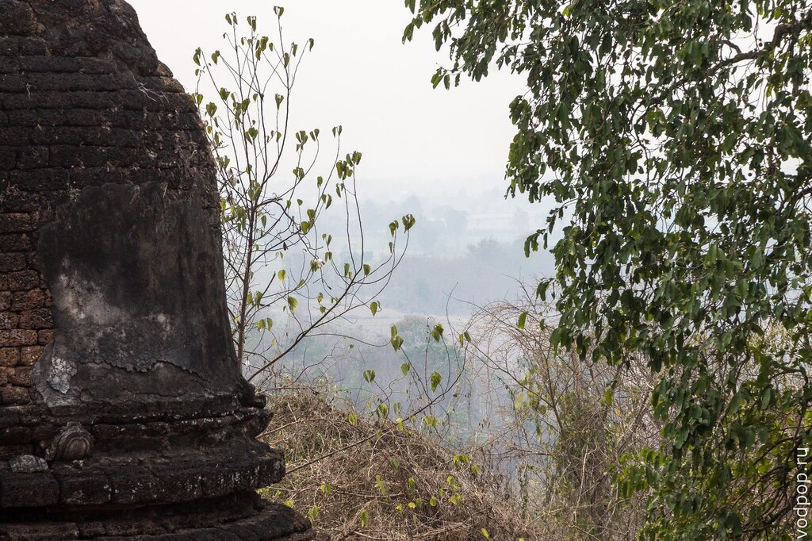

Далее будет читать полезно тем, кто как и мы, любит искать себе приключения на пятую точку.

Итак, для того, чтобы успешно вернуться домой хотя бы часа через 4, советуем выезжать на этот маршрут пораньше.

<iframe style="border: 0;" src="https://www.google.com/maps/embed?pb=!1m55!1m12!1m3!1d54460.812759416105!2d98.90848362678601!3d18.83342140475258!2m3!1f0!2f0!3f0!3m2!1i1024!2i768!4f13.1!4m40!1i0!3e2!4m5!1s0x30da39f4f8289721%3A0xa218873844929242!2z0JLQsNGCINCf0YDQsNGF0LDRgiDQlNC-0LkgQ9GD0YLRhdC10L8sIE11ZWFuZyBDaGlhbmcgTWFpIERpc3RyaWN0LCBDaGlhbmcgTWFpLCDQotCw0LjQu9Cw0L3QtA!3m2!1d18.804896!2d98.921696!4m5!1s0x0%3A0x2553912799a1766a!2sBhuping+Palace!3m2!1d18.805936!2d98.89878399999999!4m3!3m2!1d18.8090251!2d98.8931436!4m3!3m2!1d18.8284827!2d98.89851619999999!4m3!3m2!1d18.8397591!2d98.8976185!4m3!3m2!1d18.8484052!2d98.8928973!4m3!3m2!1d18.857504799999997!2d98.8891118!4m5!1s0x30da3bf1a1be6eb1%3A0xea78e440d482d3f8!2zSHVheSBUdW5nIFRhbyBMYWtlIDEwNywgRG9uIEthZW8sIE1hZSBSaW0gRGlzdHJpY3QsIENoaWFuZyBNYWkgNTAxODAsINCi0LDQuNC70LDQvdC0!3m2!1d18.868361999999998!2d98.93961!5e1!3m2!1sru!2s!4v1417695687682" width="600" height="450" frameborder="0"></iframe>

Итак, если вы рискнете туда поехать, то вы должны быть готовы к песчаным дорогам, на которых колея размыта (и повезет, если вы будете в сухой сезон!), а примерно раз в 3 километра ваш мотоцикл будет падать и заваливать вас с собой.

Дорога сравнима с [Филиппинами](https://vodpop.ru/palavan-foto/ "Неизведанный Палаван: Сан Висенте"), особенно по части колеи. Без умелого водителя и стальных нервов пассажиров мы настоятельно не рекомендуем туда ехать!

Конечно же, местное население живет в небольших горных деревушках, ездит на байке за продуктами в любую погоду в город, но если вы не таец от рождения, то вряд ли вам эта поездка покажется сильно приятной.

После 3х или 4х падений Алена и Ксюша побаивались продолжать спуск на байке и часть пути шли пешком. В принципе, прогуляться 30 км - это тоже ок, но только если вы вышли рано утром в поход.

Нам с Климом было проще, т.к. нас всего двое на мотоцикле и маневрировать было легче.

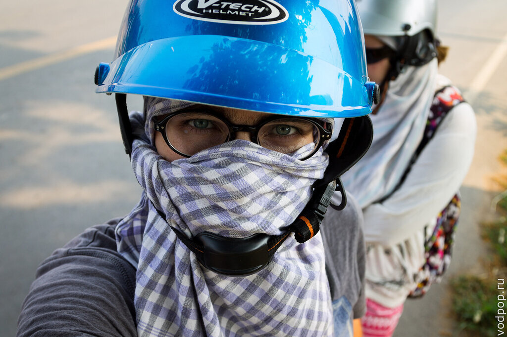

В общем, когда в одиннадцатом часу ночи мы внезапно спустились к озеру Huay Tung Tao Lake, счастью нашему не было предела. Физически измотанные, с последними каплями воды в бутылке (мы же не рассчитывали на такой длительный спуск), с пылью везде и всюду, с царапинами от песка, мы все же нашли силы вскрикнуть, когда по дороге поперек байков увидели ползущую змею длиною в метр. К счастью, мы ее не задели, как и она нас.

Если бы мне изначально сказали, сколько займет этот спуск, я бы покрутила пальцем у виска и развернулась бы на асфальтовую дорогу. Но когда ты уже в пути, так обидно разворачиваться! Кажется, что еще чуть-чуть, и ты у цели. Однако, я советую все же трезво оценить свои силы, умение управлять байком, физическую и моральную выносливость. Зарядите телефоны на полную и обеспечьте наличие карт, на которых будут отображаться эти "козьи тропы" (мы пользовались приложением Maps With Me). И не забудьте залить полный бак в бензин, а то заправок (как и магазинов, кафе, туалетов, аптек и других признаков цивилизации) там нет!

7\. Wat Umong

Один из самых необычных и тихих храмов Таиланда был основан в 1297 году.

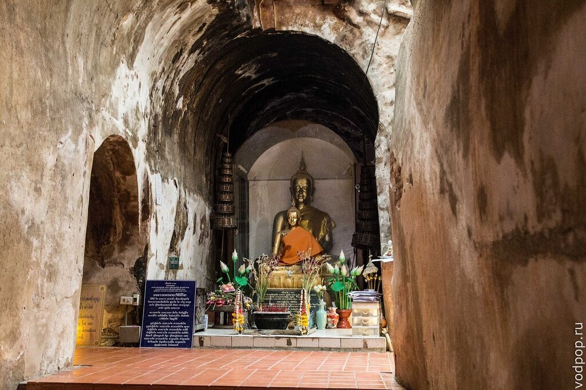

Он известен благодаря тому, что на территории храма проводятся занятия по медитации на английском языке, а также благодаря необычному устройству: храм состоит из нескольких тоннелей, соединенных между собой, в альковах которых стоят фигурки Будды.

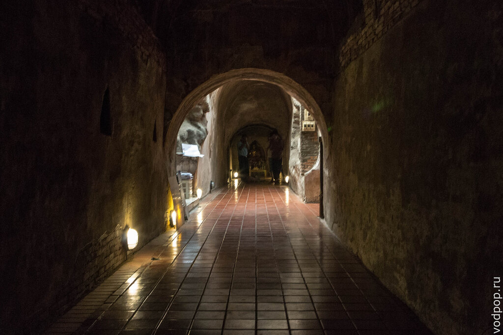

Вокруг тоннельного храма Wat Umong растут "мудрые" деревья - на них висят таблички с буддистскими цитатами на тайском и английском языках.

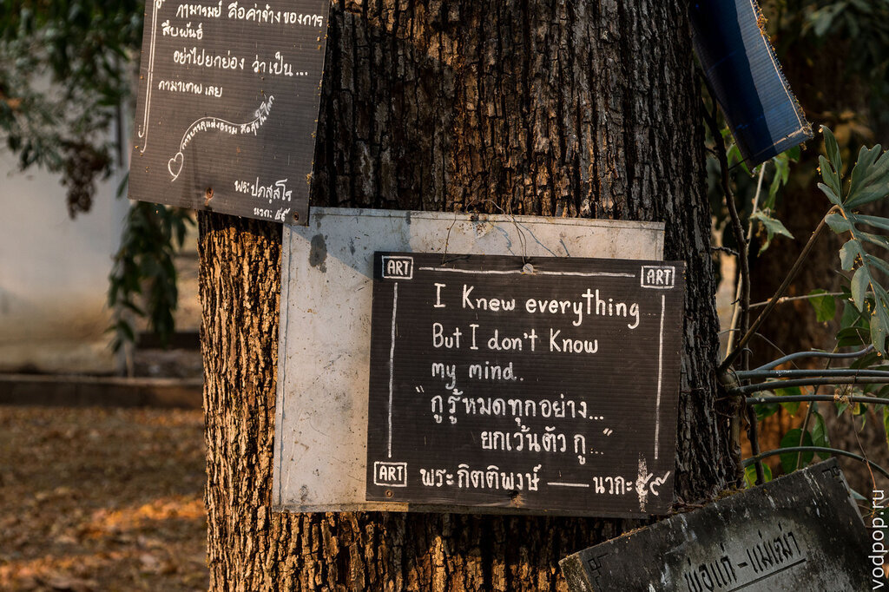

На территории мы увидели фотосессию молодой тайской пары - выглядели они совершенно по-европейски

Такое мы уже видели в Гонконге - [их свадьбу](https://vodpop.ru/chto-posmotret-v-gonkonge/ "Что посмотреть в Гонконге") можно отличить от американской, например, только цветом кожи гостей и разрезом глаз - в остальном те же наряды, украшения, подарки.

Наше селфи с ребятами около большой тайской ступы

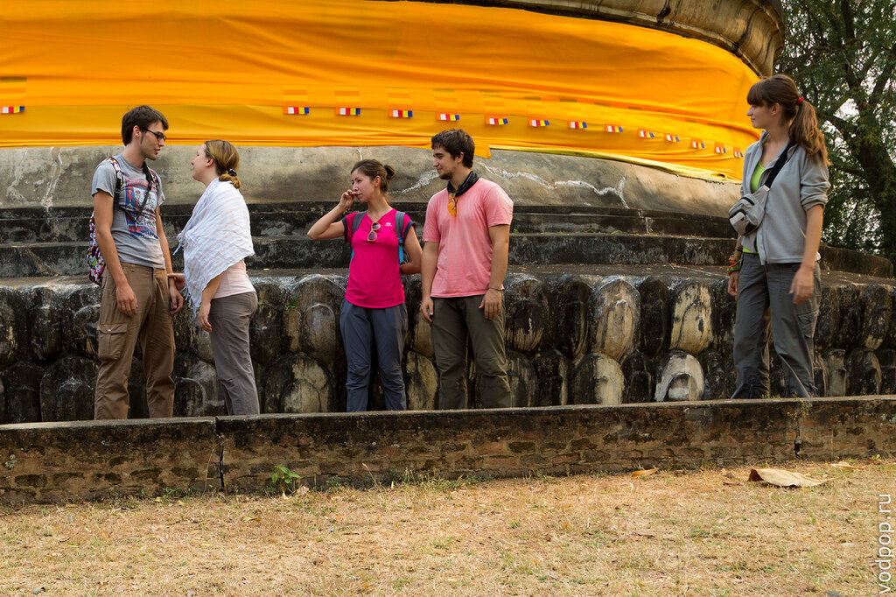

Будь у нас чуть больше времени в тот день, мы бы с радостью задержались там подольше - посидели бы около прудика, послушали тишину. Может, у вас получится?

**Как добраться до храма Wat Umong**

Можете взять такси, байк или даже велосипед - от старого города до храма дорога займет не больше 10-15 минут на транспорте, и максимум час на велосипеде.

<iframe style="border: 0;" src="https://www.google.com/maps/embed?pb=!1m23!1m8!1m3!1d30217.389848308132!2d98.96535606359868!3d18.79040943660019!3m2!1i1024!2i768!4f13.1!4m12!1i0!3e0!4m3!3m2!1d18.7819815!2d98.97751219999999!4m5!1s0x30da3a706f40689d%3A0xedef9aa39d595059!2zV2F0IFVtb25nLCDQotCw0LjQu9Cw0L3QtA!3m2!1d18.78334!2d98.951194!5e0!3m2!1sru!2sus!4v1417698219943" width="600" height="450" frameborder="0"></iframe>
