Когда ты первый раз едешь в новую страну или город, то обязательно встает вопрос: что же можно посмотреть в этом месте, какие основные достопримечательности, какие места стоит посетить, а куда не стоит ехать ни за какие деньги. Итак, достопримечательности Чианг Мая.

<!--more-->

Чианг Май прежде всего славится своей культурой. Его называют городом тысячи храмов, и это чистая правда. В самом известном "квадрате" старого города находится несколько десятков различных храмов. Возраст некоторых составляет несколько столетий, какие-то только строятся.

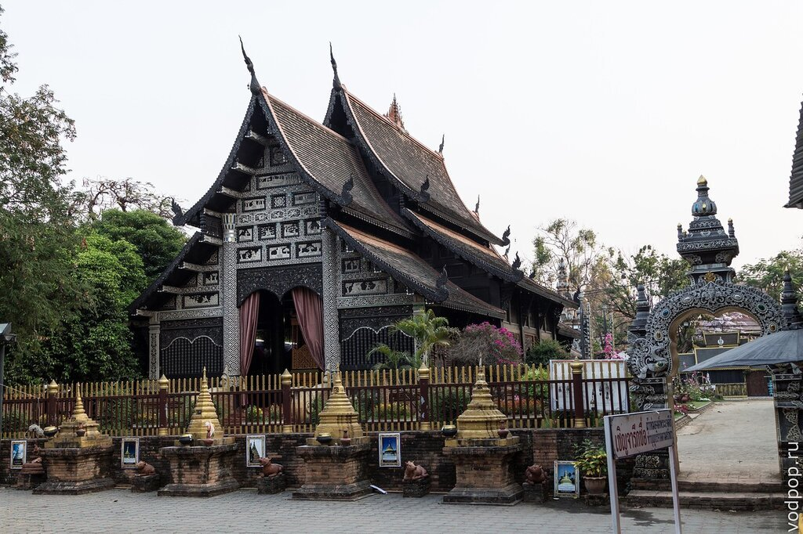

Но город славен не только архитектурой, но и великолепной природой: вокруг Чианг Мая несколько заповедников, озера, водопады и реки. Словом, есть что посмотреть.

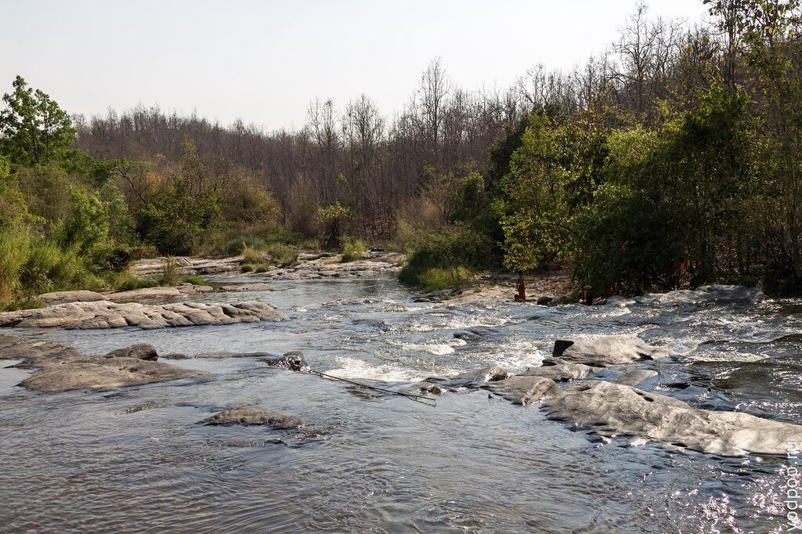

Забавно, что кто-то сравнивает Чианг Май с Санкт-Петербургом: здесь тоже есть мосты и каналы, а уровень развития культуры выше, чем в столице - [Бангкоке](https://vodpop.ru/drevnij-gorod-bangkok/ "Достопримечательности Бангкока. Парк «Древний город» в Бангкоке").

1\. Храм Wat Chedi Luang

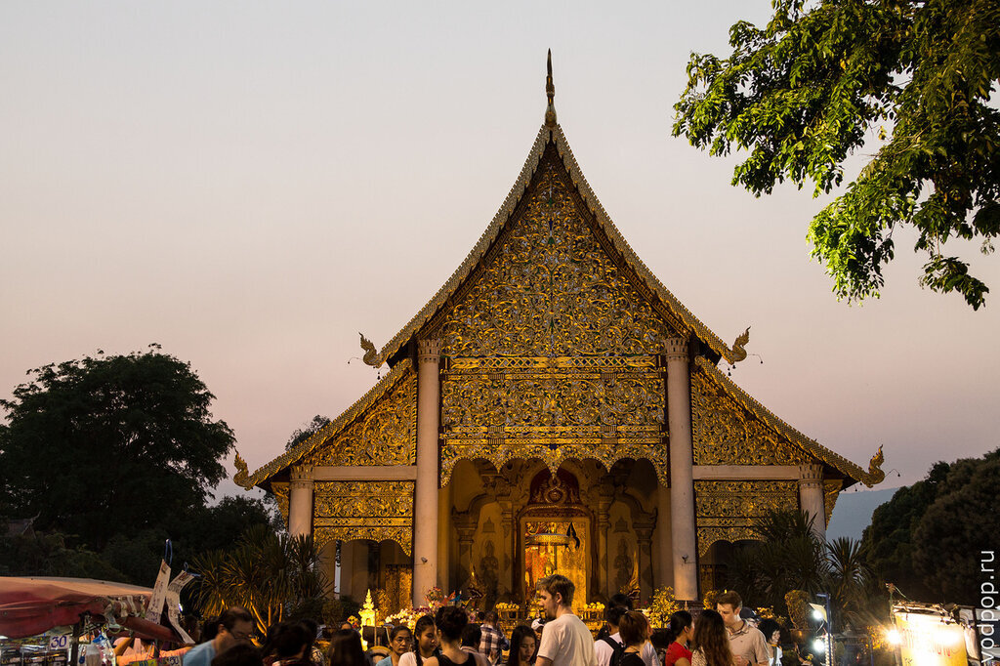

Название этого храма переводится с тайского как "полыхающий". Видимо, он получил это название благодаря обилию золотых красок, которые при попадании света действительно похожи на языки пламени.

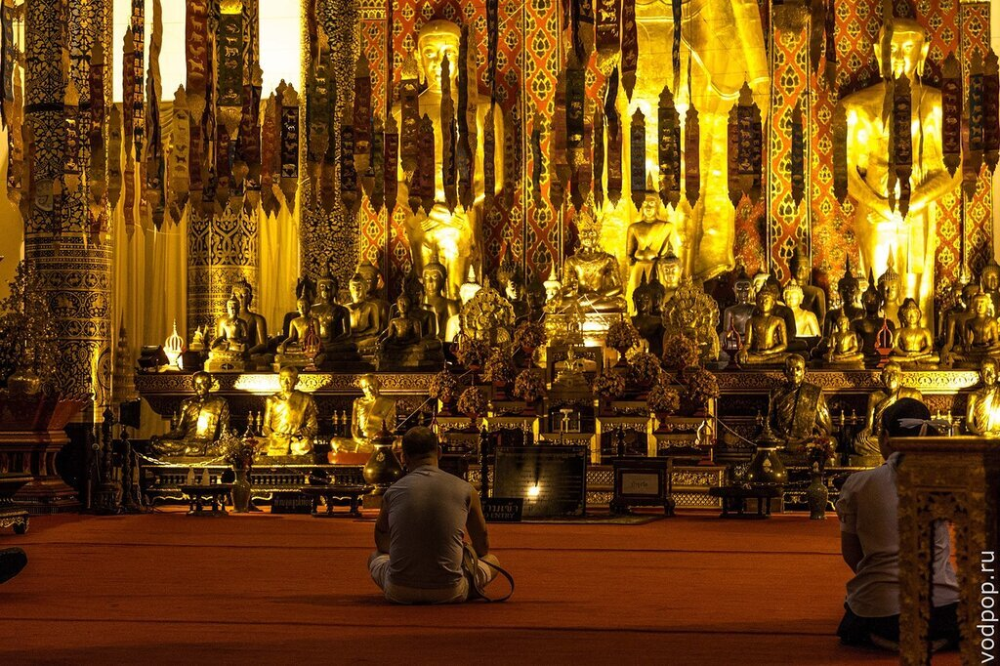

Храм - один из старейших на территории Чианг Мая. Он был частично разрушен во время землетрясения в 1545 году. Пожалуй, самая известная часть храмового комплекса - чеди, высота которой до катастрофы составляла целых 84 метра. Но даже по остаткам фундамента можно судить о былом величии этого сооружения.

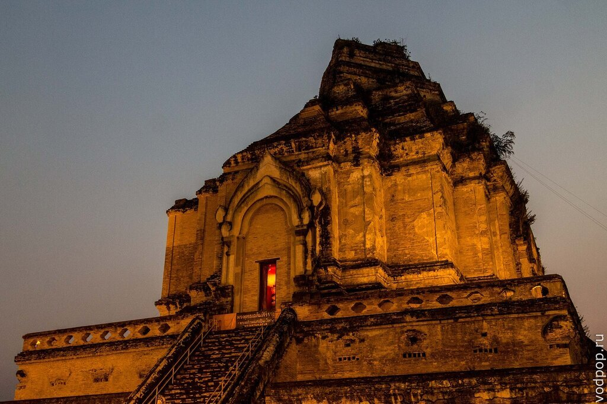

Чеди производит какое-то невероятное впечатление, особенно в вечернее время, когда лишь редкие туристы, забредшие с ночной воскресной ярмарки, заходят на территорию храмового комплекса. Вокруг ходит несколько монахов, при желании с ними можно пообщаться по-английски и задать все интересующие вас вопросы.

Мы же предпочитали сохранять тишину, и под свет луны и некоторых прожекторов обходить чеди со всех сторон.

Строительство храма было начато в 1391 году королем Сен Мыанг Ма, а закончилось уже после смерти короля, его потомком - королем Тилократом. Увы, после землетрясения у страны не оказалось денег на восстановление храма, а после того, как из храма в [Бангкок](https://vodpop.ru/bangkok-otzivy/ "Наши впечатления от Бангкока") вывезли одну из главных реликвий страны - Изумрудного Будду, пришел конец величию этого комплекса.

Однако, сейчас королевство Таиланд тратит большие суммы денег на восстановление храмов и храмовых комплексов, т.к. это обеспечивает довольно большой приток туристов. Хотя, конечно, [Пхукет](https://vodpop.ru/ostrov-bon/ "Остров Бон. Самый безлюдный остров на Пхукете"), [Самуи](https://vodpop.ru/rayskiy-ostrov-samui/ "Райский остров Самуи") и другие курортные города пока пользуются куда большей популярностью.

Ежегодно во время убывания луны в шестом лунном месяце (май-июнь) в Wat Chedi Luang проходит фестиваль Интакхин (Inthakhin Festival).

Интакхин (Inthakhin) - городской столб и святыня, где обитает божество, опекающее город, куда каждый год приходят жители Чианг Мая возложить цветы и попросить дальнейшего процветания северной столице. Обратите внимание, что девушкам вход воспрещен - прекрасная половина человечества может только подносить цветы, но не может зайти внутрь святыни.

Как добраться до Wat Chedi Luang.

Лучше всего это делать пешком, т.к. в центре очень много туристов и не всегда удобно заезжать на байке. Особенно это касается ярмарок - в такие моменты половина центра перекрыта, и вам все равно надо будет кидать свой байк где-то за историческим квадратом. Однако, в будние дни вы вполне можете припарковаться где-то поблизости: на территорию храмового комплекса въезд запрещен.

<iframe style="border: 0;" src="https://www.google.com/maps/embed?pb=!1m14!1m8!1m3!1d15109.004202022003!2d98.98655300000001!3d18.786962000000024!3m2!1i1024!2i768!4f13.1!3m3!1m2!1s0x30da3a9933111415%3A0x5cf7709a044ba8ba!2sWat+Chedi+Luang+Worawihan!5e0!3m2!1sru!2s!4v1417554547693" width="600" height="450" frameborder="0"></iframe>

2\. Озеро Huay Tueng Tao

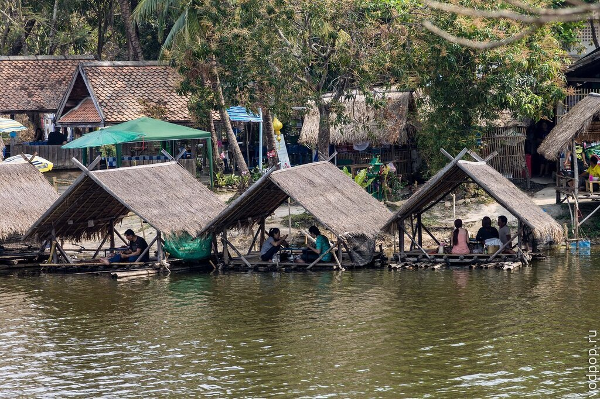

Весьма популярное место среди местного населения: вполне естественно, что тайцам хочется где-то купаться при отсутствии моря. Температура воды зависит от сезона, я бы охарактеризовала воду в марте как бодрящую.

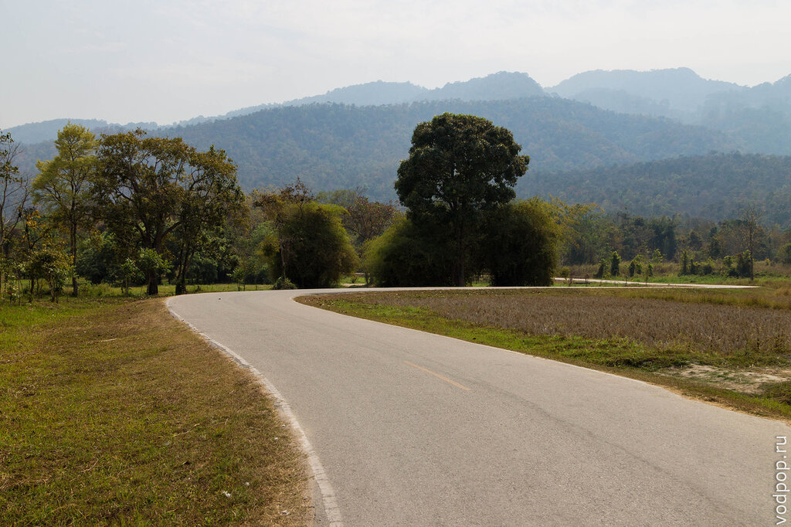

Вокруг озера проложена дорога из асфальта, поэтому без особых проблем можно перемещаться с одной стороны озера на другую. По береговой линии расставлены домики, либо на суше, либо прямо на воде: ими можно пользоваться бесплатно, если сделаете заказ в кафе на сумму не менее 250 бат.

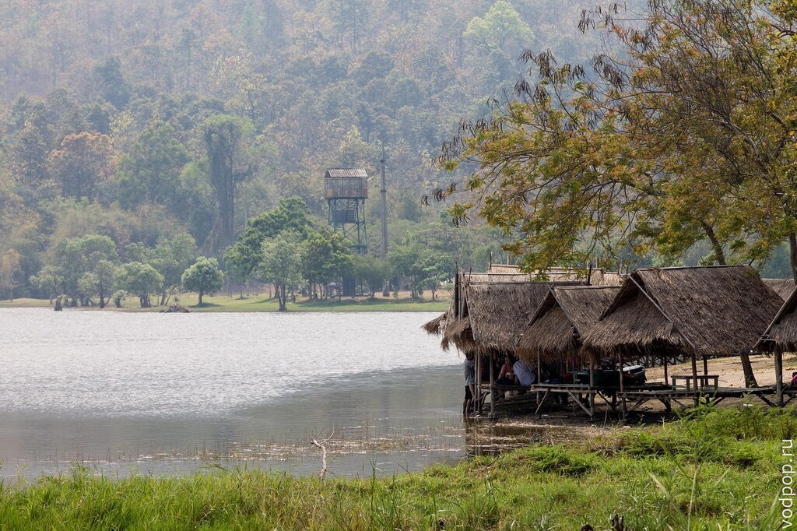

Въезд на территорию платный, вход тоже: за байк с нас взяли 100 бат, за пассажиров по 20. Но несмотря на это, даже в будний день здесь довольно много людей: приезжают в основном на байках, с детьми. Едят тайские вкусности, пьют пиво и изредка купаются.

Как проехать до озера Huay Tueng Tao. По 121 шоссе, затем повернуть налево. Обратите внимание, что путь идет через шоссе и ехать нужно аккуратно: вас будут обгонять пикапы на очень высоких скоростях.

<iframe style="border: 0;" src="https://www.google.com/maps/embed?pb=!1m25!1m12!1m3!1d15102.149001647376!2d98.94168973123263!3d18.863232610024806!2m3!1f0!2f0!3f0!3m2!1i1024!2i768!4f13.1!4m10!1i0!3e0!4m3!3m2!1d18.7896157!2d98.98138739999999!4m3!3m2!1d18.865737!2d98.9453113!5e0!3m2!1sru!2s!4v1417549946307" width="600" height="450" frameborder="0"></iframe>

3\. Сандей маркет (Sunday Market) Проходит каждое воскресенье. Некоторые улицы старого города блокируются для проезда, и уже с полудня торговцы начинают выкладывать свой товар: на земле, но столиках. подвешивать на деревья. Главное - уметь показать свой товар "лицом".

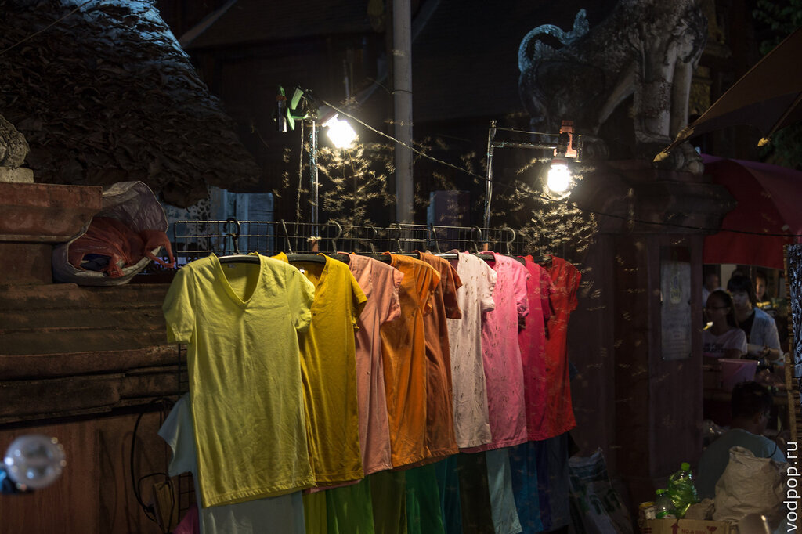

На ярмарке действительно можно найти много всего интересного: картины, украшения, утварь для дома, текстиль. Большинство вещей сделано своими руками, но стоит примерно как в московской Икее.

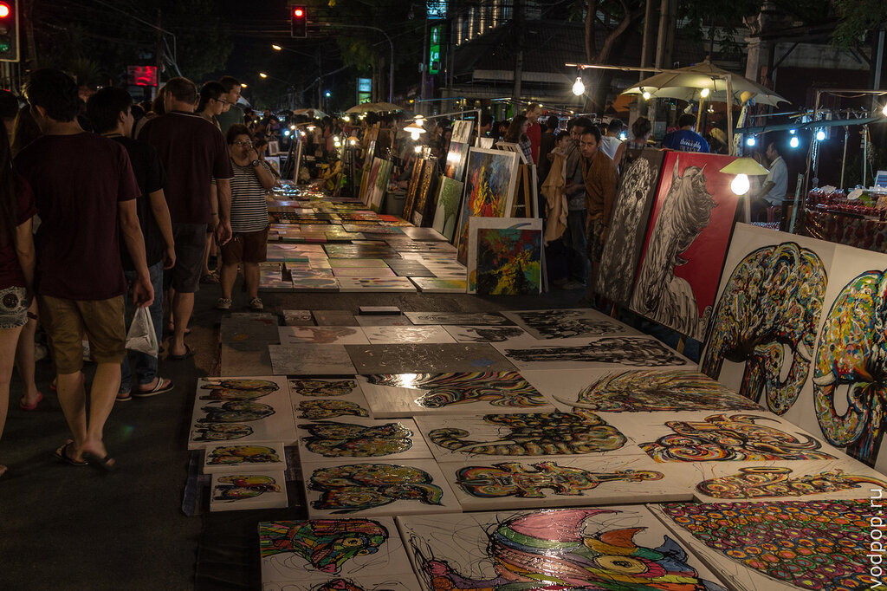

Хотя, конечно, здесь тоже достаточно товара made in China, но его довольно легко отличить.

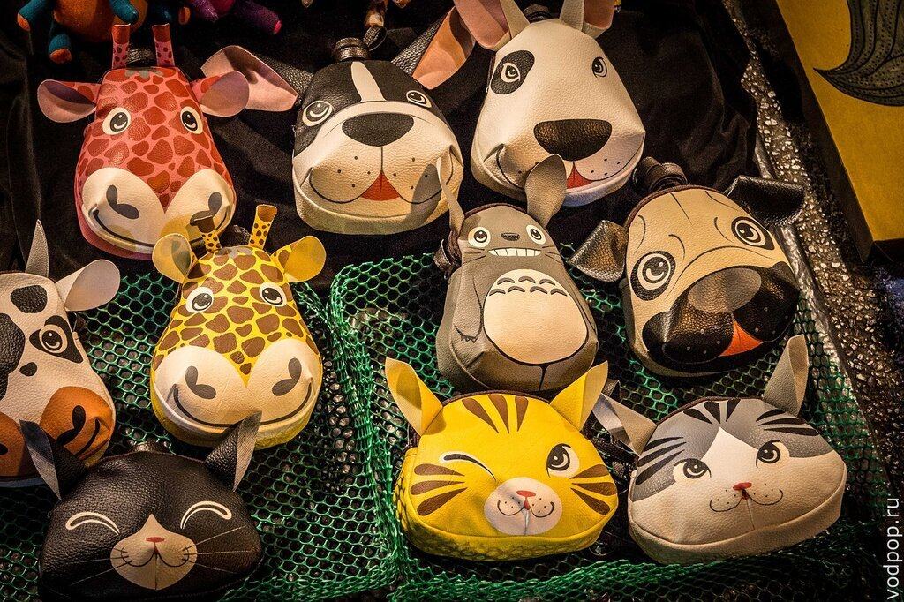

Я большая охотница до сережек hand-made из разных стран, и Климентий всегда старается пополнить мою коллекцию.

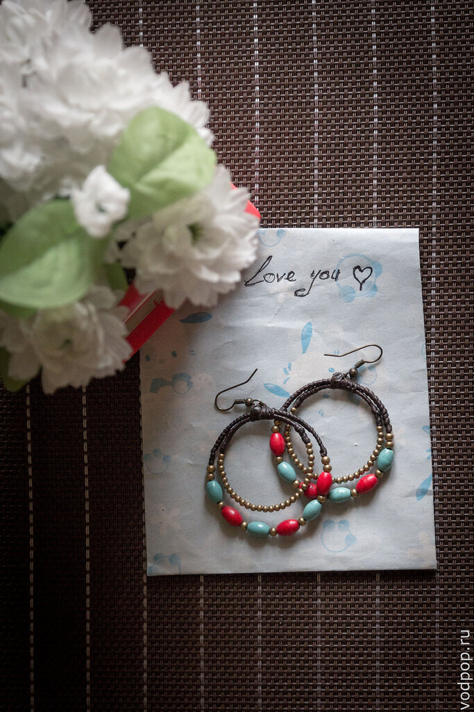

Кроме того, я бы советовала присмотреться к гирляндам, маслам, сумкам из ткани и различным изделиям из бамбука. Почти все можно трогать-щупать и примерять. Торговаться рекомендуется, но всегда с улыбкой. Особенно хорошо торг идет под закрытие, когда они начинают складывать остатки товара - цена может упасть в 2-4 раза.

На рынке довольно шумно и тесно, но почувствовать атмосферу Таиланда получается на-ура.

Как добраться до Sunday Market. Ярмарка проходит на улице Ratchadamhoen на территории квадрата старого города. Лучше всего подъезжать с восточной стороны квадрата.

<iframe style="border: 0;" src="https://www.google.com/maps/embed?pb=!1m27!1m12!1m3!1d3777.214536616342!2d98.98626752331893!3d18.78859011769832!2m3!1f0!2f0!3f0!3m2!1i1024!2i768!4f13.1!4m12!1i0!3e0!4m3!3m2!1d18.788083399999998!2d98.99029329999999!4m5!1s0x30da3a9b9f5a8fc9%3A0x3418ef6f05046e58!2sSoi+Thonon+Rachadamnoen%2C+Tambon+Si+Phum%2C+Amphoe+Mueang+Chiang+Mai%2C+Chang+Wat+Chiang+Mai+50200%2C+%D0%A2%D0%B0%D0%B8%D0%BB%D0%B0%D0%BD%D0%B4!3m2!1d18.7885167!2d98.98279529999999!5e0!3m2!1sru!2s!4v1417605719073" width="600" height="450" frameborder="0"></iframe>

4\. Храмы на территории старого города Конечно, можно было бы написать большой-пребольшой список тех храмов, в которые стоит заглянуть в Чианг Мае. Но мы ограничимся лишь советом взять удобную обувь, бутылку воды и потратить день-два на пеший осмотр храмов, наблюдению за монахами и релаксации в тени особенно густого дерева.

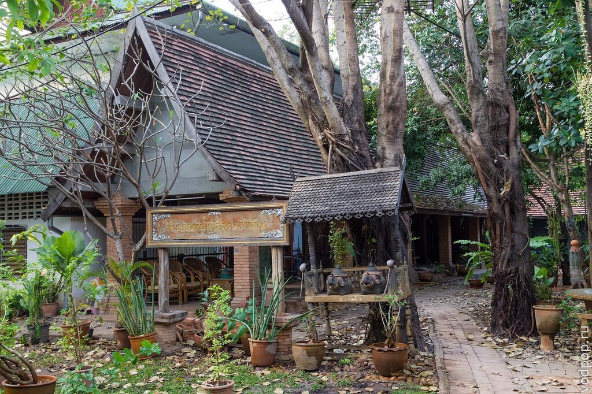

Монахи за работой

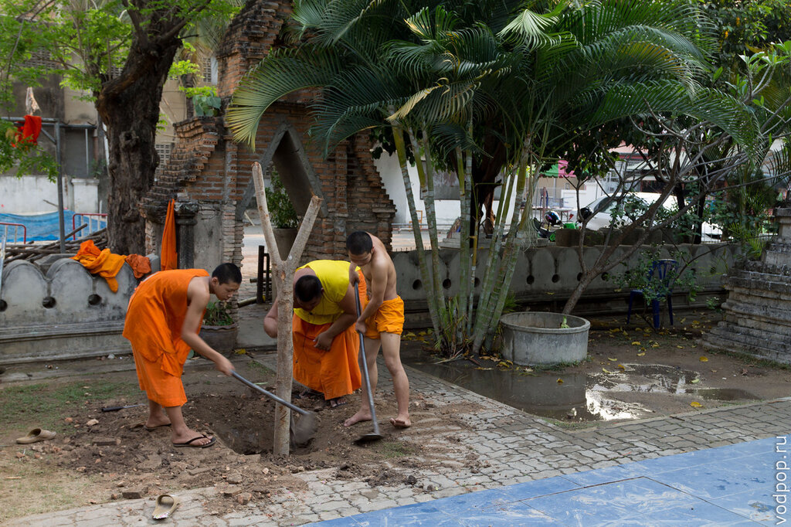

Слон из дерева, вырезанный монахами монастыря

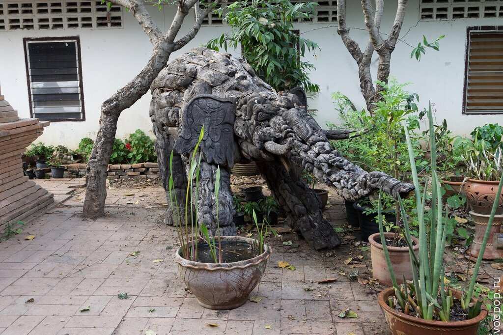

А можно посидеть и подумать о чем-то своем

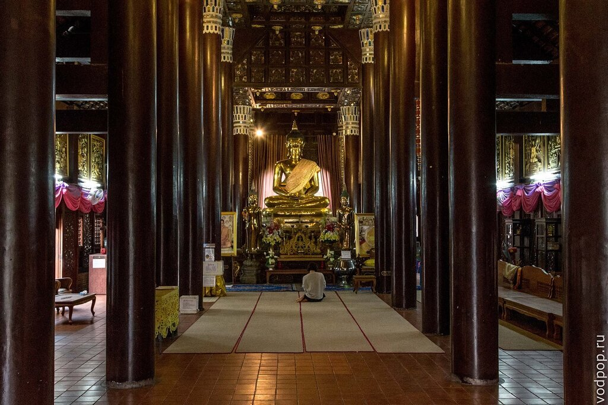

Один из самых уютных храмов Wat Lok Molee

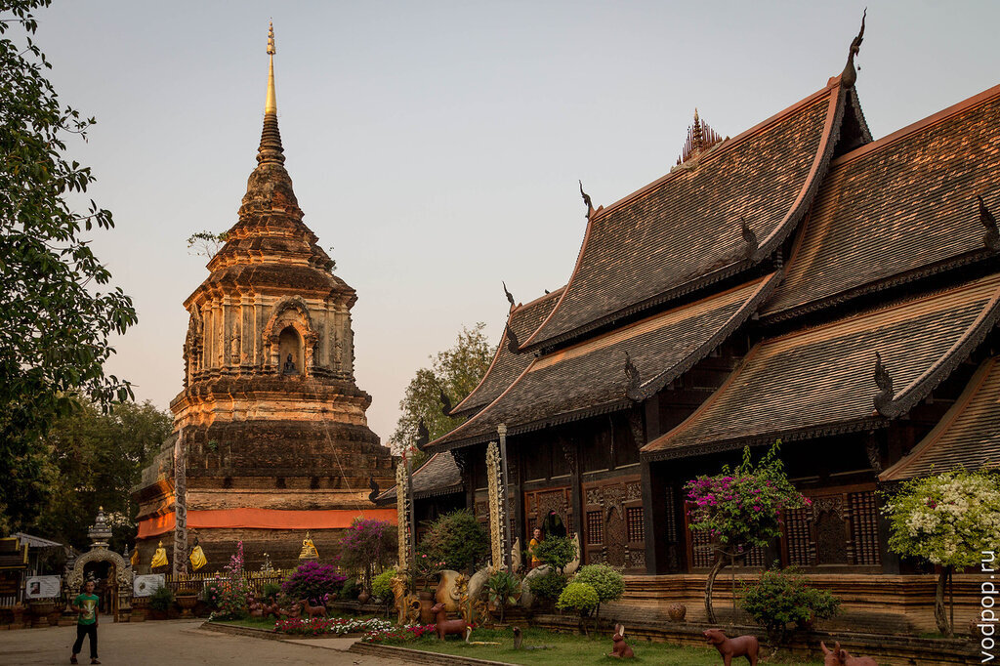

Маленькие Будды на заднем дворе

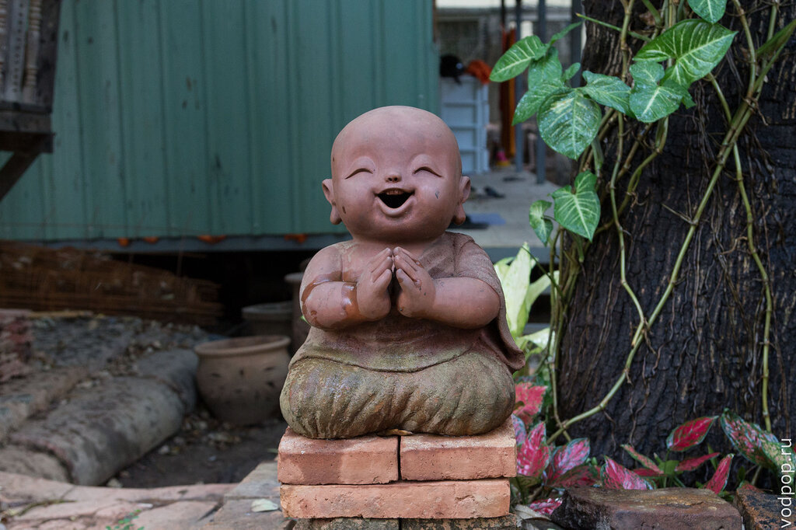

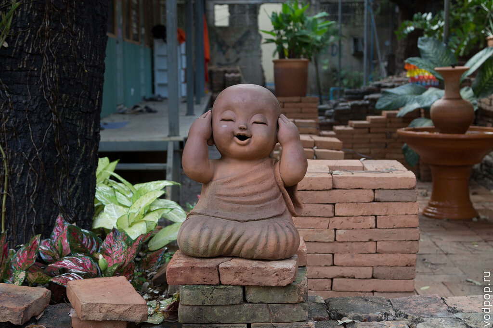

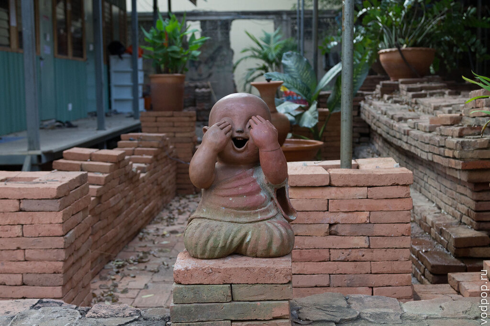

Иногда мы заранее смотрели храмы, в которые хочется зайти, а иногда просто проезжали мимо и останавливались, если что-то привлекало внимание. Например, потрясающее цветущее дерево в предзакатных лучах солнца

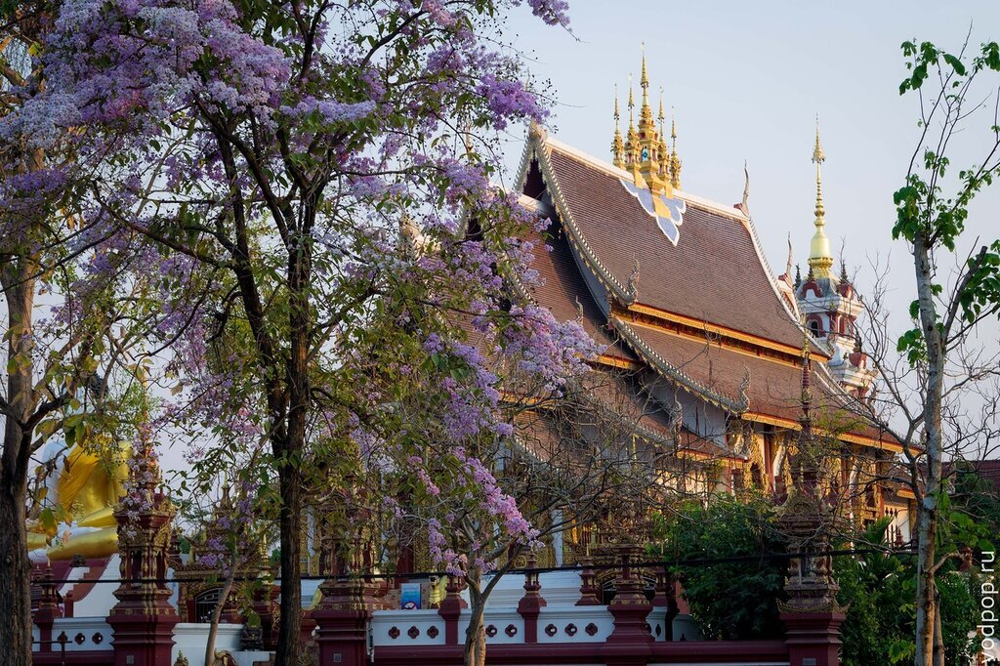

Если выбраться за пределы старого города, то, пожалуй, главным разочарованием стал Wat Phra That Doi Suthep, который, несмотря на приличную удаленность от города, один из самых забитых битком людьми. То есть вообще невозможно подойти близко или сделать фотографию так, чтобы в кадр не попало с десяток людей. Мы очень не любим подобный ажиотаж в храмах, т.к. прежде всего это священное место, где должна преобладать тишина и царить атмосфера умиротворения. А за толпой туристов и кучей сувениров лучше сходить на ярмарку.

Как добраться до старого города. Найти его легко и просто - на карте это идеальный квадрат, внутри которого и находится "старый город". Заблудиться почти невозможно, но вот чтобы сменить направление движения иногда приходится покрутиться.

<iframe style="border: 0;" src="https://www.google.com/maps/embed?pb=!1m35!1m12!1m3!1d15109.0065443769!2d98.97623029225834!3d18.786935888078034!2m3!1f0!2f0!3f0!3m2!1i1024!2i768!4f13.1!4m20!1i0!3e0!4m3!3m2!1d18.7957087!2d98.978383!4m5!1s0x30da3abcf8cc3233%3A0x20b5dece7aef3ff1!2zVGhhbm9uIENoYWl5YXBodW0sIFRhbWJvbiBTaSBQaHVtLCBBbXBob2UgTXVlYW5nIENoaWFuZyBNYWksIENoYW5nIFdhdCBDaGlhbmcgTWFpIDUwMzAwLCDQotCw0LjQu9Cw0L3QtA!3m2!1d18.7952451!2d98.9939193!4m3!3m2!1d18.781280499999998!2d98.9778103!4m3!3m2!1d18.7958915!2d98.9789838!5e0!3m2!1sru!2s!4v1417607229615" width="600" height="450" frameborder="0"></iframe>

Продолжение читайте в следующих статьях!
