Продолжение цикла наших статей про достопримечательности Чианг Мая: гора Doi Inthanon, невероятные слоны в заповеднике Maesa, музыкальные фестивали и другие интересные мероприятия, которые проходят в северной столице Таиланда

<!--more-->

С другими достопримечательностями Чианг Мая вы можете ознакомиться тут:

[Достопримечательности Чианг Мая. Часть первая](https://vodpop.ru/dostoprimechatelnosti-chiang-may)

[Достопримечательности Чианг Мая. Часть вторая](https://vodpop.ru/dostoprimechatelnosti-chiang-may-chast-vtoraya/ "Достопримечательности Чианг Мая. Часть вторая")

8\. День слона в Чианг Мае. Лагерь слонов Maesa Elephant Camp

Ежегодно 13 марта на севере Таиланда в Чианг Мае проводится праздник - день слона. В этот день несколько десятков слонов спускаются вместе со своими наездниками с гор и угощаются свежими фруктами на огромных, специально собранных столах.

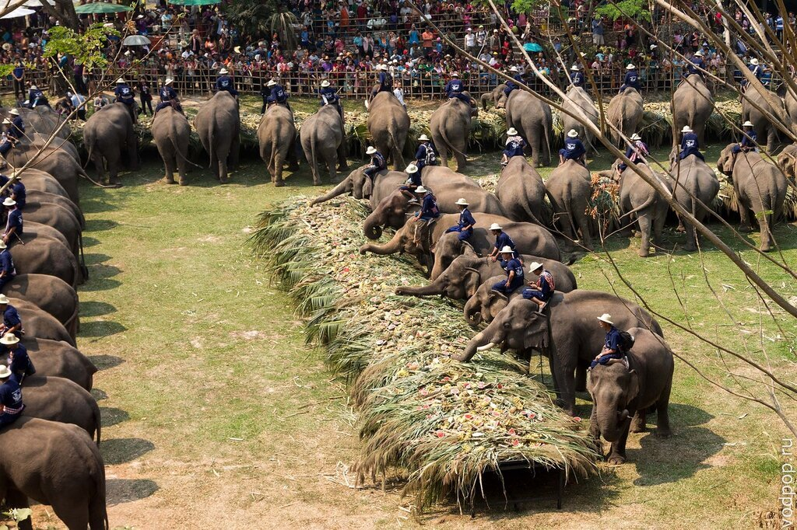

По-моему, мы насчитали около 50 слонов, но в самом лагере их больше: не все участвовали в церемонии.

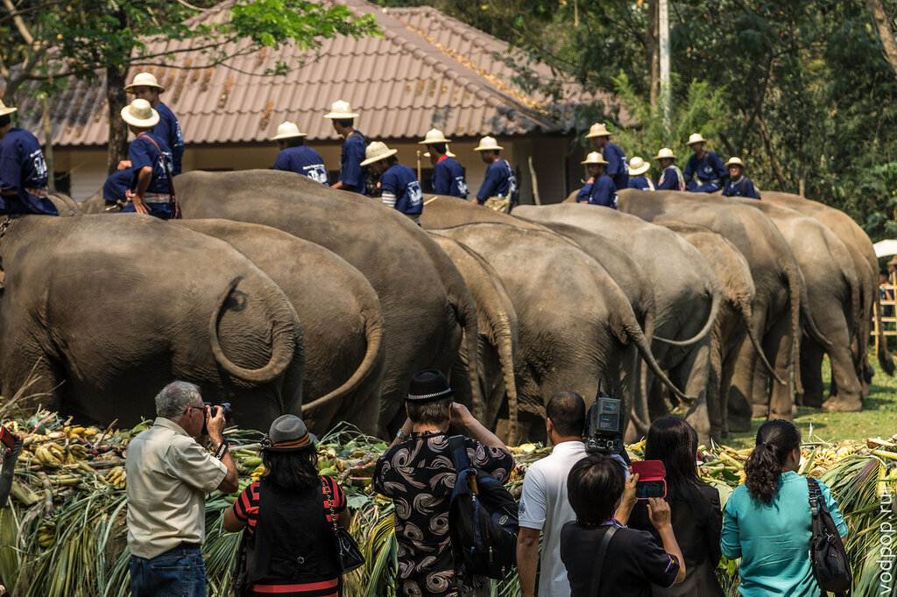

Слоны - очень улыбчивые животные. Многие знают, что они отлично танцуют и рисуют (как дельфины).

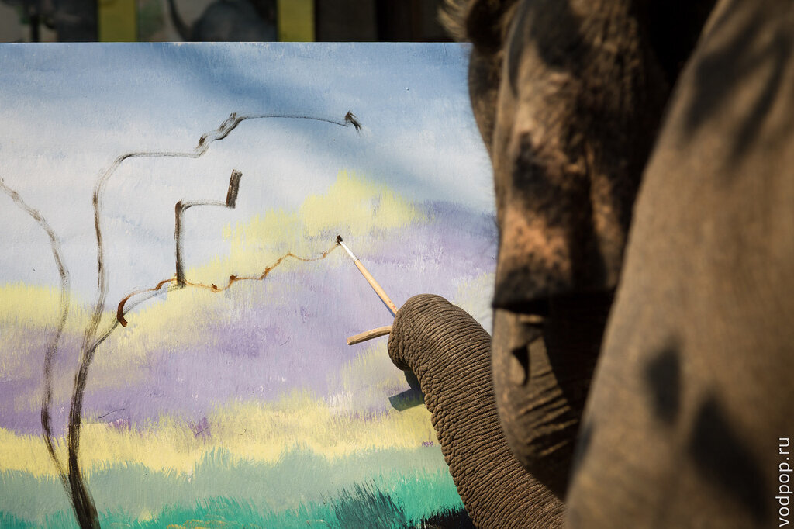

Правда, бывают случаи, когда слоны ведут себя достаточно агрессивно, но если их не провоцировать, то они не должны угрожать вам своими массивными лапами или бивнями.

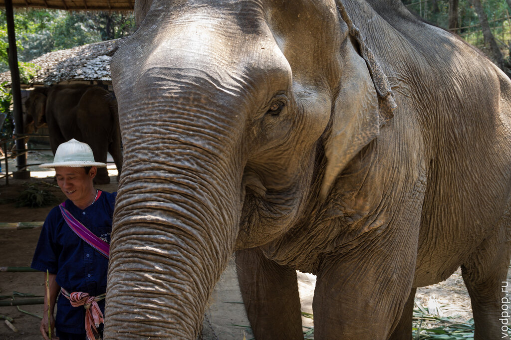

Погонщики закрепляются за слоном на всю жизнь, и может смениться только в случае смерти первого.

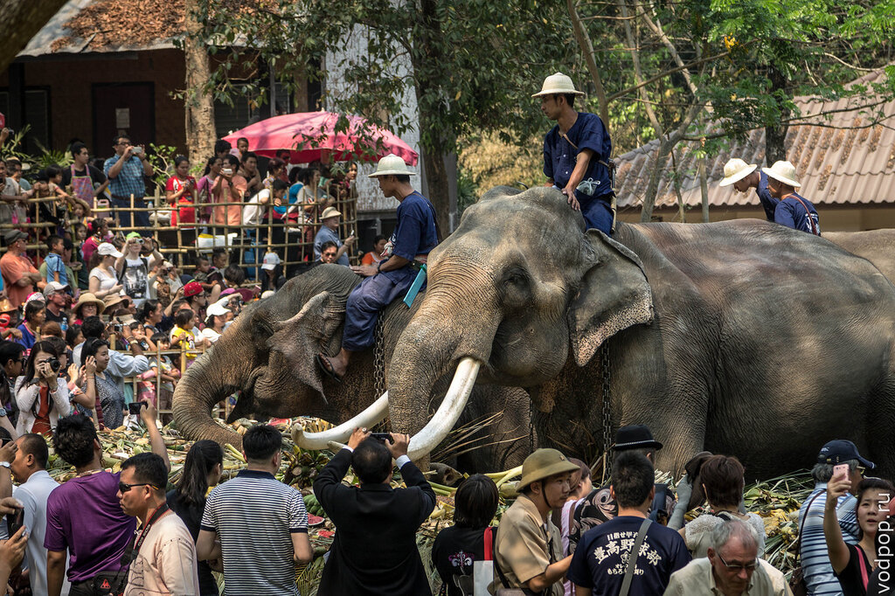

Сам праздник похож на нашу ярмарку - здесь продают много всяких вкусняшек, в том числе угощение для слонов, которые очень любят, когда их кормят бананами с руки. А еще мы видели, что некоторые давали денежку слону в хобот, а тот возвращал их своему погонщику - это нечто вроде чаевых.

На праздник съезжается очень много местных - туристов не так уж много. Часть мероприятия записывали операторы с телевидения. А люди просто рассаживались вокруг, прямо на землю, и смотрели шоу - пьесы, танцы и выступления местных музыкантов.

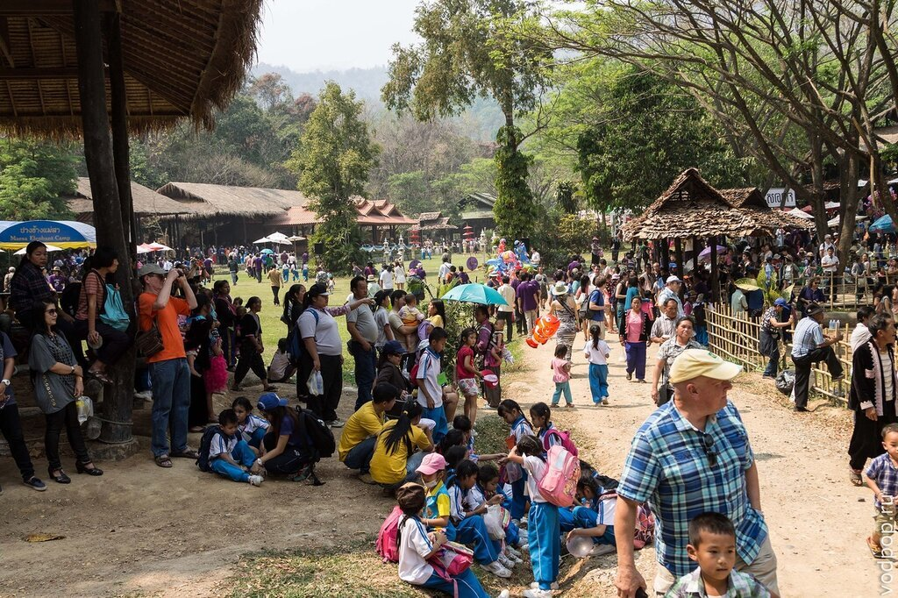

VIP-ложа

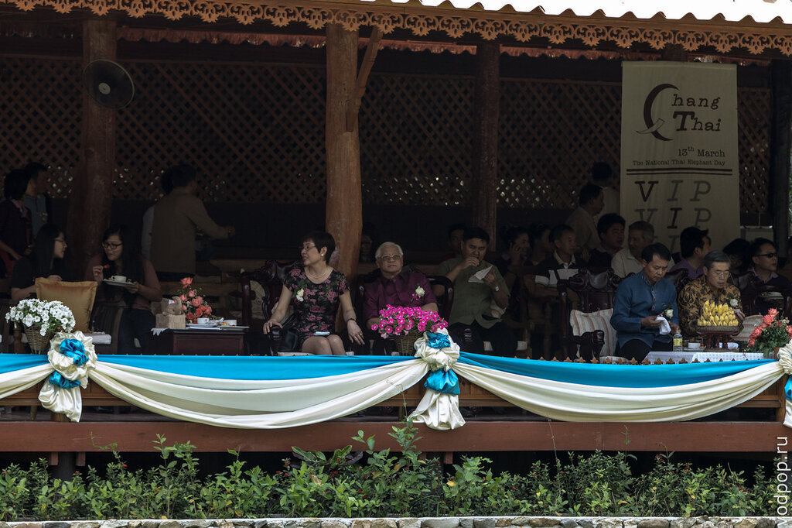

Очень странная постановка. Явно что-то из тайского фольклора.

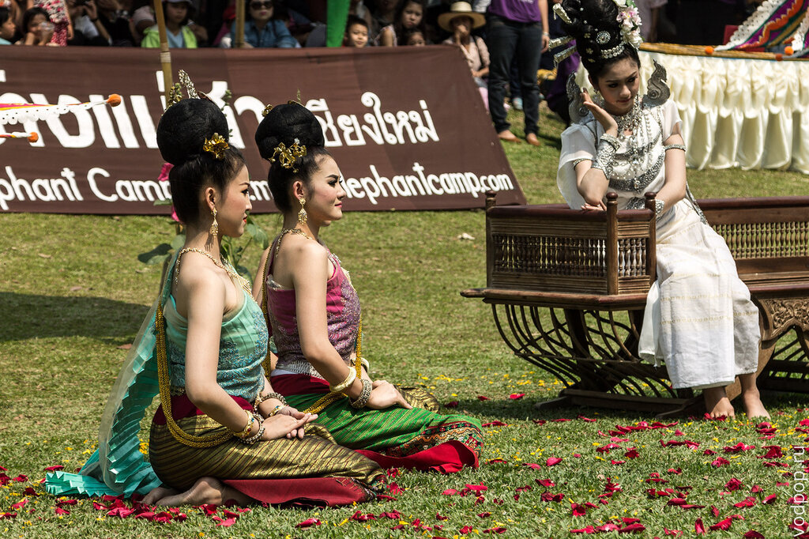

Национальные танцы

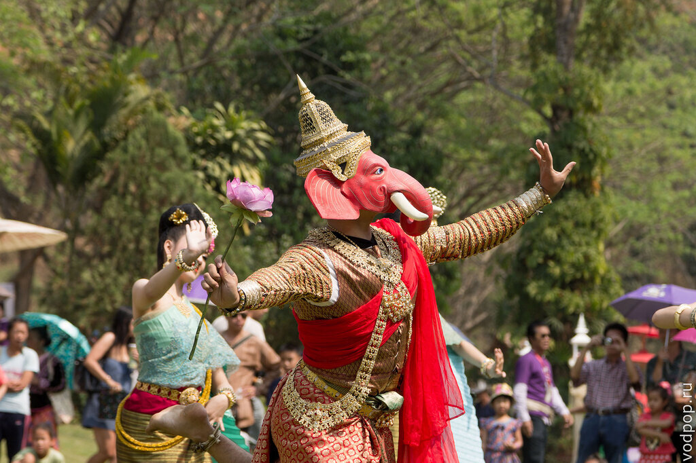

Таец готовит любимый тайский десерт Климентия - снежок с сиропом.

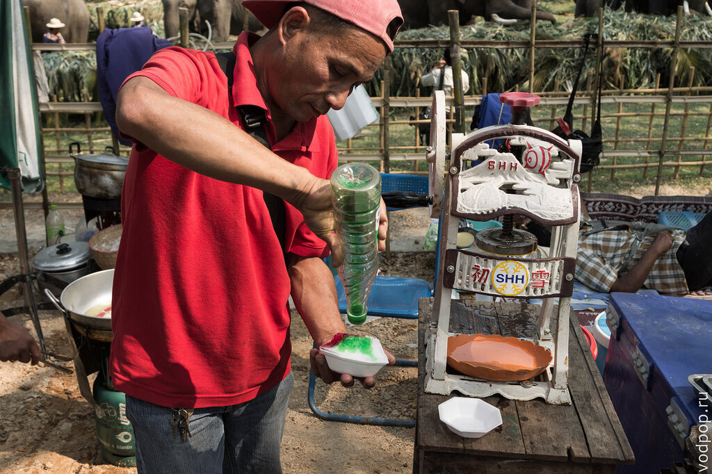

9\. Музыкальный фестиваль в Чианг Мае Точного расписания нет: фестиваль проходит в первую половину марта. Чтобы знать наверняка, надо следить за информацией на афишах в городе или в интернете. С радостью дала бы ссылку на сайт, но, увы, он по каким-то причинам не работает.

Так выглядела сцена под открытым воздухом в перерыве между выступлениями

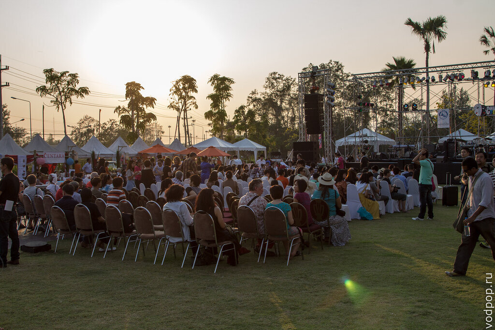

Обстановка очень приятная - основное действие происходит ближе к заходу солнца, а основные посетители, как ни странно, иностранцы. Причем чаще всего весьма обжившиеся в Таиланде. Здесь же стояло пара десятков палаток - предлагали не только еду и напитки, но также трудоустройство в Таиланде и за рубежом.

Фестиваль в 2014 году проходил на территории нового торгового комплекса Promenada, рядом с трассой. Экстерьер и интерьер здания приводил в восторг - все настолько качественно и красиво, что хочется просто бродить по залам, пока потоки ледяного воздуха не выгонят тебя наружу.

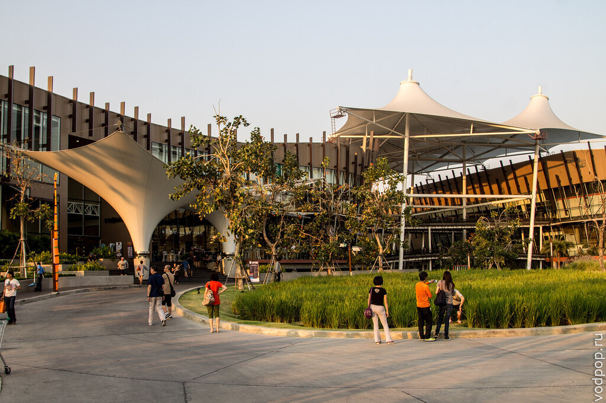

На мероприятие собрались не только фаранги, но и местные тайские звезды - певцы, модели, художники. Обстановка немного богемная, но все очень органично и смотрелось вполне естественно.

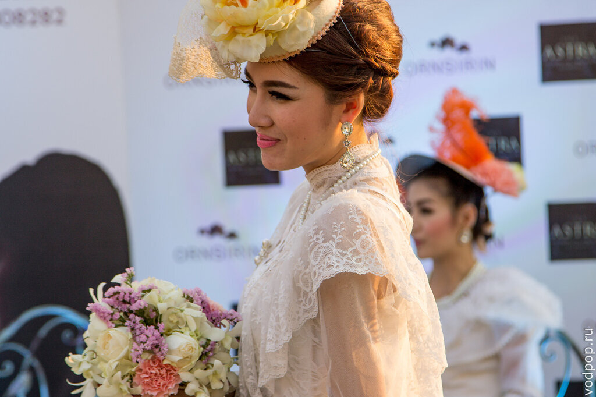

Расписание фестиваля немного менялось по ходу действия. Странно, что два дня почти полностью повторяли друг друга. Хотя мы были практически от и до все выходные, нам безмерно понравилось.

Когда ушам хотелось покоя, мы гуляли вокруг территории ТЦ. Тут есть на что посмотреть

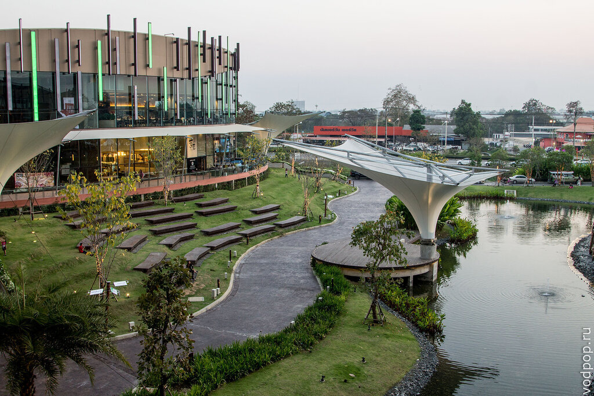

А теперь стоит сказать, зачем каждому стоит хотя бы раз попасть на музыкальный фестиваль в Чианг Мае. Здесь царит невероятная атмосфера и вокруг такая энергетика, которая порой не дает тебе усидеть и даже устоять. Исполнителей тщательно подбирают: здесь нет двух представителей одной страны, одного жанра и даже культур. Все артисты настолько разные, особенные, с национальным колоритом, что в такие моменты невероятно ценишь, что мы все такие разные.

Малайские бабушки с "музыкальными столами": ксилофонами. Подобный инструмент весит не менее 15-20 кг. И вот с таким "арсеналом" ездит женский ансамбль (хотя один мужчина у них все-таки есть) 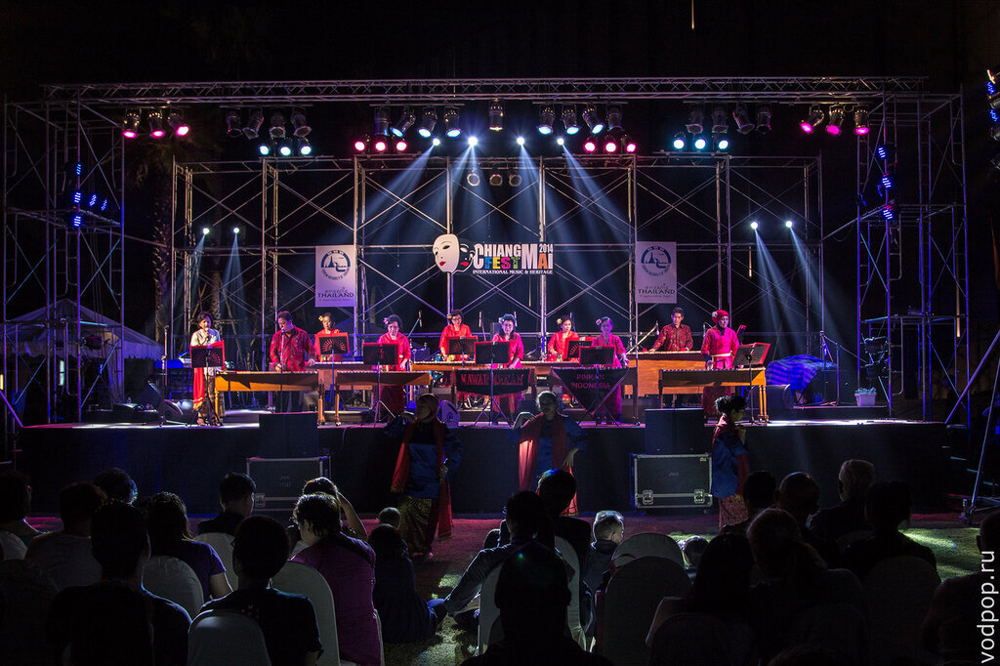

Была опера, поп-рок, джаз и соул. Словом, тут всех терминов не написать, да и зачем. Могу только приложить видео-записи артистов, которых приглашают организаторы фестиваля. Для этого они, также как и миллионы людей во всем мире, идут на youtube и ищут там восходящих звезд. И, кажется, им это удается.

Невероятная Иеока (Iyeoka) пронзила своими песнями до глубины души. И в жизни оказалась настолько приятной в общении, легкой, обнимающей своего сынишку, которому она посвящает все свои выступления, и который всегда в первом ряду смотрит на маму.

<iframe src="https://www.youtube.com/embed/9Pes54J8PVw" width="560" height="315" frameborder="0" allowfullscreen="allowfullscreen"></iframe>

Зажигательные Hot Water из Южной Африки. Увидев пятую точку солистки, я обтекала слюнями. И это еще до того, как она начала зажигательно танцевать на сцене, заставив ВСЕХ без исключения подняться со стульев и земли и начать танцевать.

<iframe src="https://www.youtube.com/embed/V2qRMw4vPJ0" width="560" height="315" frameborder="0" allowfullscreen="allowfullscreen"></iframe>

Симпатичный, скромный и очень неловкий вне сцены Matthew Mole, который управлялся и с голосом, и инструментами одновременно. И то, и другое - его собственного сочинения.

<iframe src="https://www.youtube.com/embed/wFb7j0jY_aE" width="560" height="315" frameborder="0" allowfullscreen="allowfullscreen"></iframe>

Для нас это лучший (пока что) музыкальный фестиваль в жизни. Настоятельно рекомендуем!

10\. Гора и национальный парк Doi Inthanon

Известна тем, что здесь находится самая высокая точка Таиланда - 2565 метров.

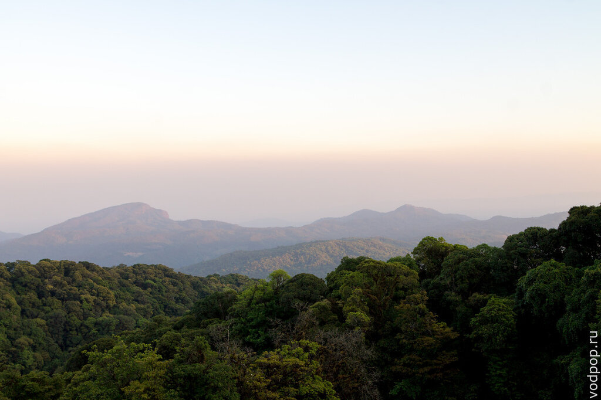

Самое главное для поездки на Doi Inthanon - правильно одеться. На самом верху температура всего +16 - после полугода в южных широтах, для нас это ощущалось как настоящая зима, а при движении на байке становилось еще холоднее.

Даже в наборе самых теплых вещей - все равно зябко. Не забудьте шарфик!

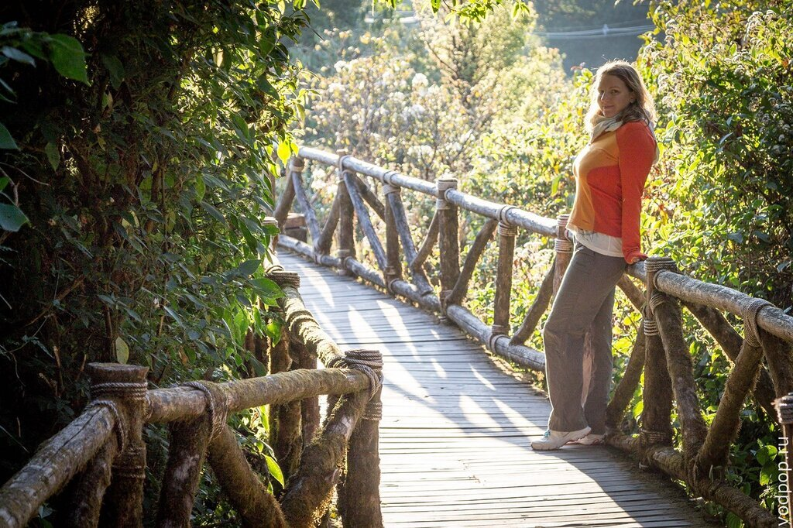

Здесь растут такие растения, которых почти не встретишь в остальной части Таиланда. Пахнет Родиной. Удивительное чувство!

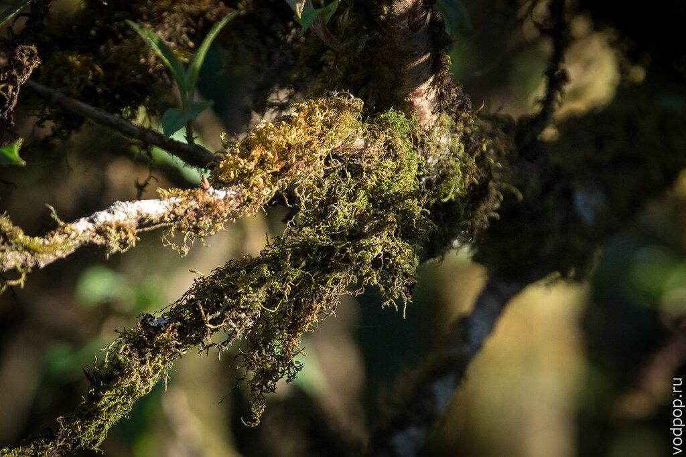

По пути мы увидели съезд в обсерваторию. Не поверите, но в этой широте тоже наблюдают за звездами! (я всегда думала, что это имеет смысл только на крайних широтах).

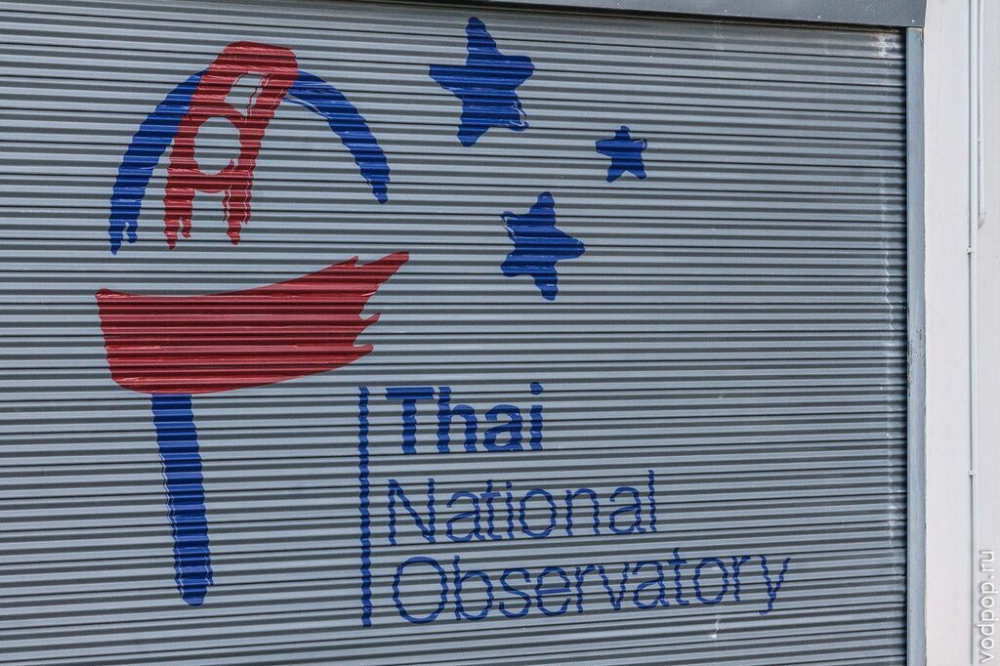

Улыбчивый охранник молча смотрел, как мы облазили вдоль и поперек обсерваторию - даже зашли внутрь, где за компьютерами работала группа инженеров.

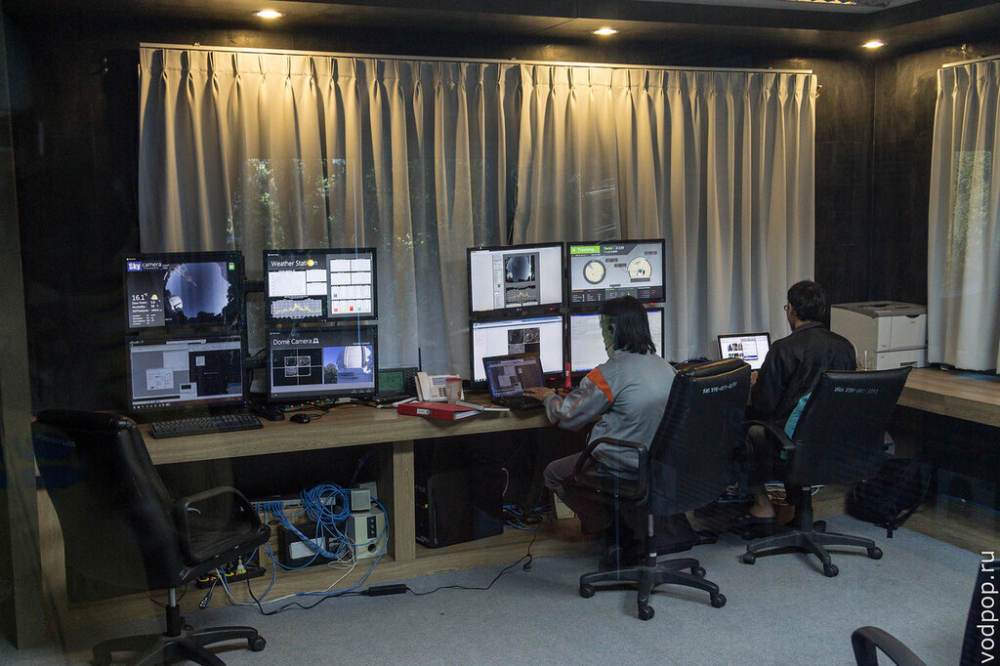

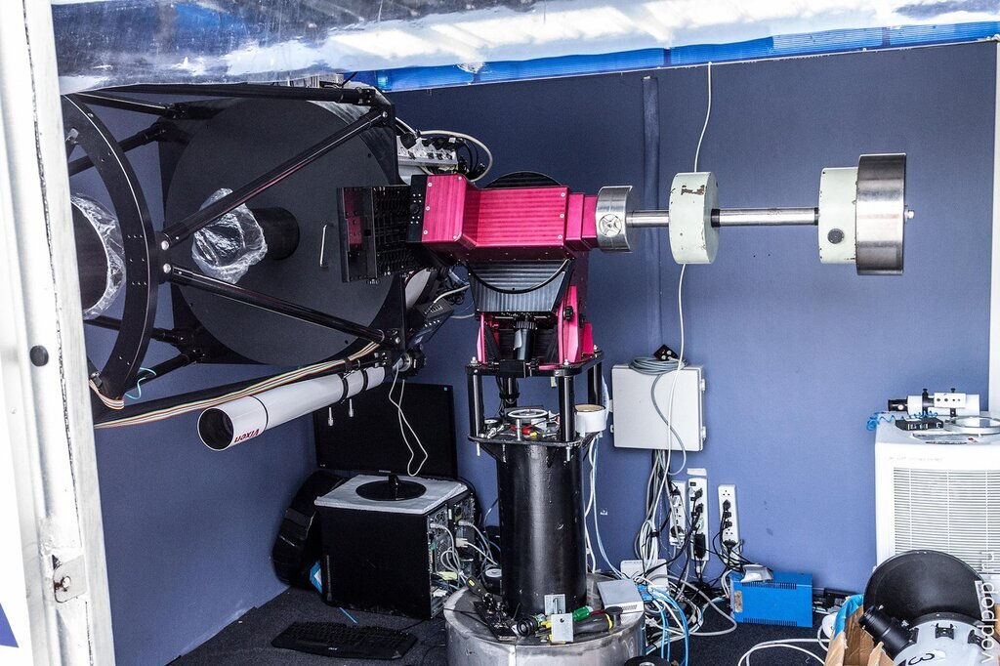

Ощущения как у маленького ребенка, который разбирает телефон по частям - везде любопытно заглянуть, понять, зачем и почему. Для интересующихся на территории стоят информационные стенды. И, кстати, у них есть сайт и даже собрания астрономов-любителей: вместе посмотреть на комету, например. Один минус - гора сама по себе находится крайне не близко к Чианг Маю, а до обсерватории по самой горе ехать еще около 15 километров. На байке такой путь несколько утомителен.

Как добраться до Doi Inthanon

<iframe style="border: 0;" src="https://www.google.com/maps/embed?pb=!1m29!1m12!1m3!1d242042.53167950732!2d98.58540795817773!3d18.577890414890692!2m3!1f0!2f0!3f0!3m2!1i1024!2i768!4f13.1!4m14!1i0!3e6!4m5!1s0x30da3a7e90bb6f5d%3A0x98d46270a59b4367!2sChiang+Mai+Thailand!3m2!1d18.7060641!2d98.9817163!4m5!1s0x30dbaa9c1c7fd96b%3A0xf3f01fb3a96c7054!2z0JTQvtC50LjQvdGC0LDQvdC-0L0!3m2!1d18.5883333!2d98.4875!5e0!3m2!1sru!2sru!4v1424374823047" width="600" height="450" frameborder="0"></iframe>

На самой вершине расположен военный радар, поэтому фотографировать запрещено - мы сделали фото издали, а при подъезде на площадку к нам подошел охранник и вежливо попросил не делать фотографий.

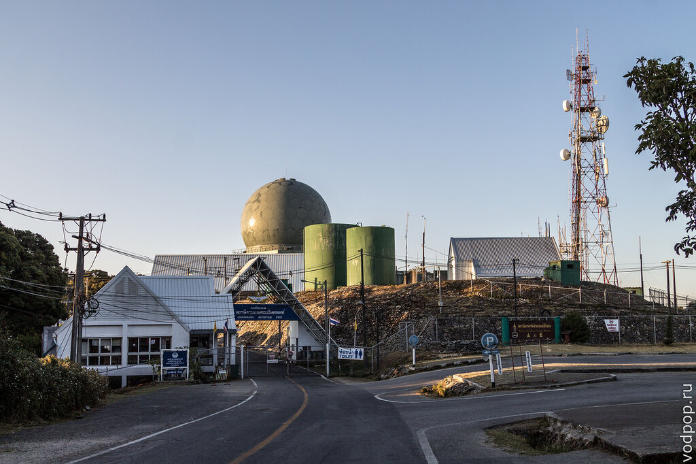

Хотя система пропусков у них довольно легкая - сначала мы пытались на этом военном объекте найти кафе и туалет, и даже прошли через первый КПП, но на втором у нас попросили пропуск.

Примерно на середине пути находится королевский цветочный парк. Изумительная подборка цветов и предзакатные лучи завораживали настолько, что фотографий оттуда не так много, как хотелось бы

Почти ромашки

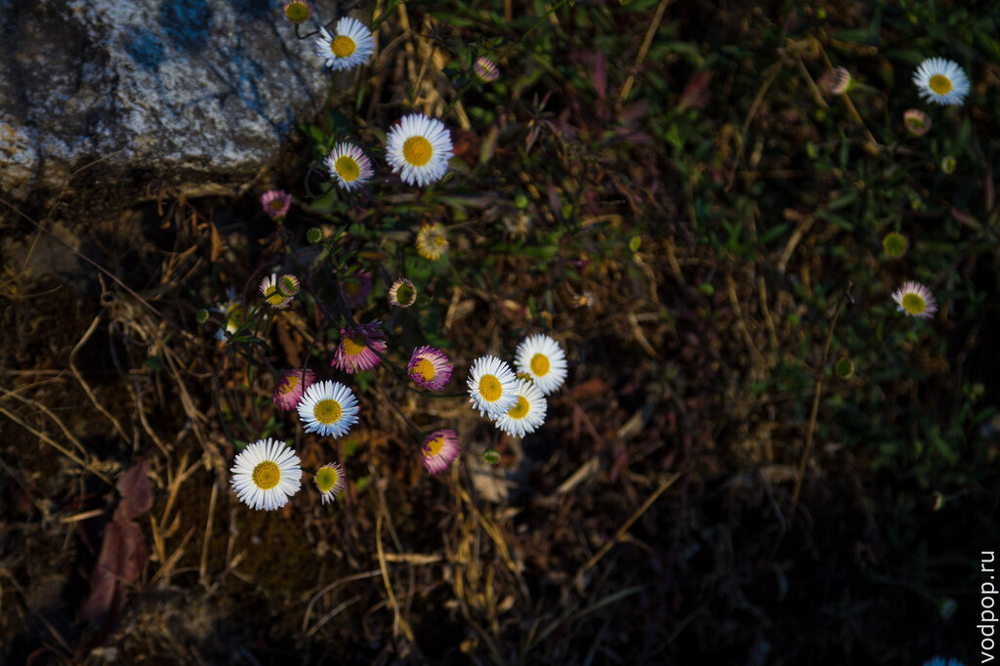

Ну и просто красивые цветы

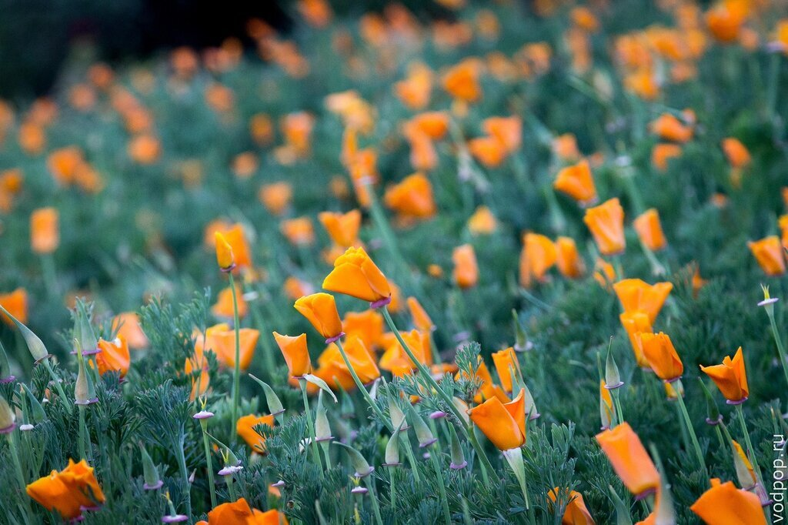

Ват, внутрь которого мы не попали - охранник и так пустил нас без платы на территорию парка (мы за 20 минут до закрытия приехали), поэтому держать открытым храм он не стал.

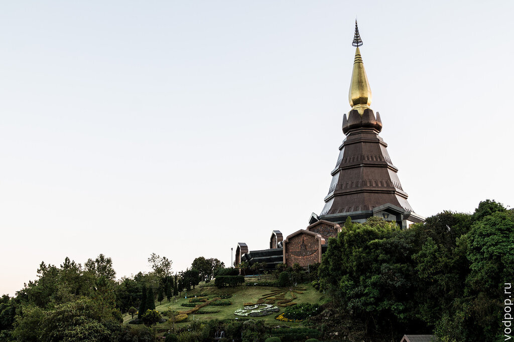

Будьте аккуратны в сухой сезон - ни в коем случае не разводите костров! Мы проезжали мимо нескольких крупных очагов пожаров, но помочь, увы, никак не могли. К сожалению, лесные пожары происходят каждый год. Чаще всего тому причиной человек - не до конца потушенная сигарета, забытый костер. Последствия ужасные: несколько семей, живущих в национальном парке, остались без домов

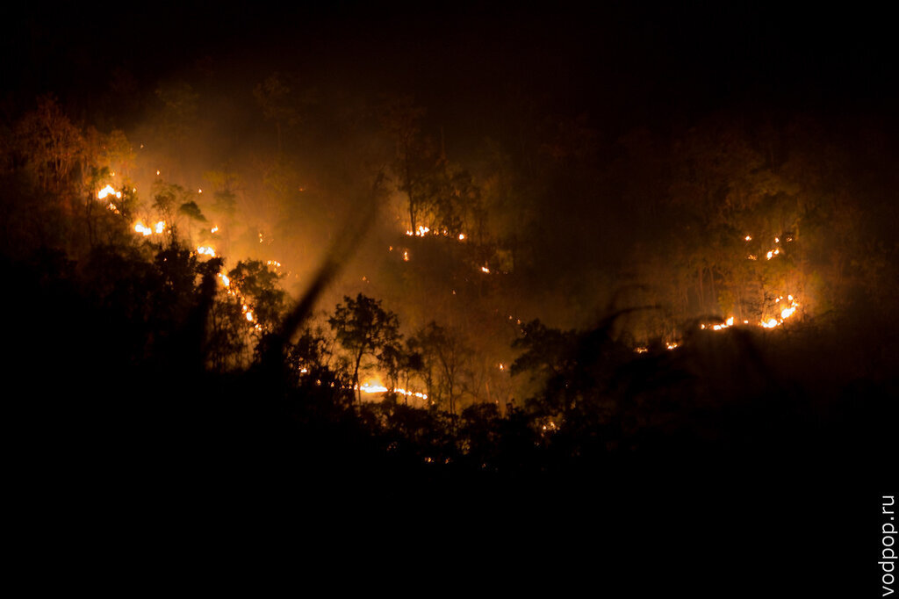

Удачного отдыха и отличных впечатлений в Северной столице Таиланда!
