Достопримечательности Пномпеня не ограничиваются только лишь Королевским дворцом, о котором мы подробно написали [тут](https://vodpop.ru/korolevskiy-dvorets-v-pnompene/ "Королевский дворец в Пномпене. Наша прогулка по столице Камбоджи"). По городу просто приятно погулять, зайти на один из многочисленных рынков, пройтись вдоль набережной или посидеть в кафешке и попробовать блюда всех кухонь мира.

<!--more-->

Стоит посмотреть Национальный Музей Пномпеня - кроме интересных экспонатов, многие из которых привезены сюда из Ангкора, внутри вы сможете найти хороший книжный  магазин, где можно найти много полезных книжек о Камбодже и ее культуре на английском и кхмерском языках.

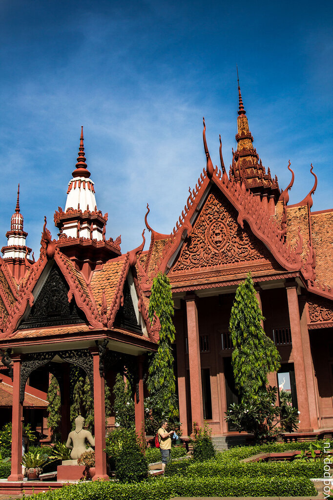

Благодаря книжному магазину, пополнилась моя коллекция книг "Маленький Принц" - теперь и на кхмерском языке!

Даже внешне музей очень красив. Внутри тоже все сделано с умом, гулять по залам приятно.

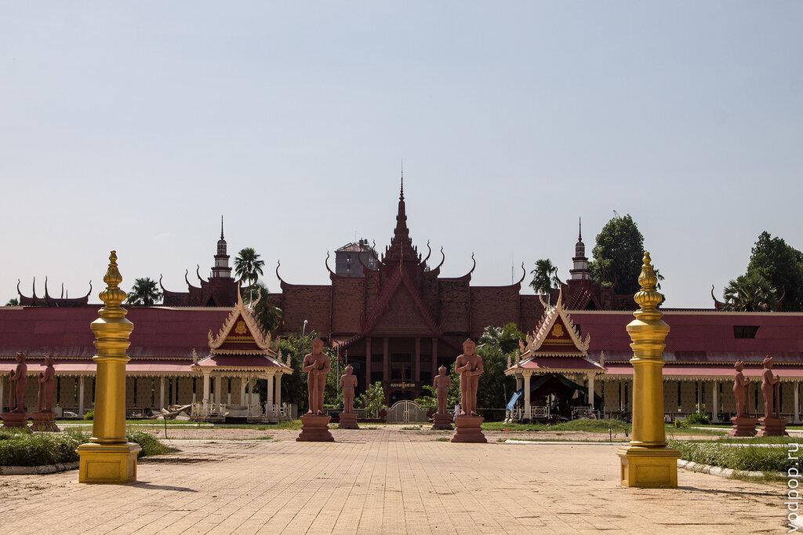

Странная одинокая пальма стоит по бокам от входа

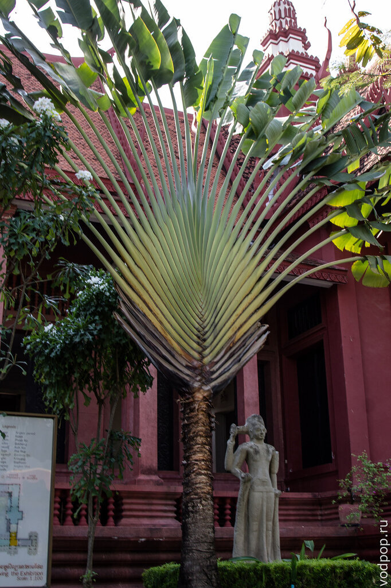

А во внутреннем дворике можно посидеть на бортиках и посмотреть на плавающих в пруду рыбок.  Кажется, им немного тесно

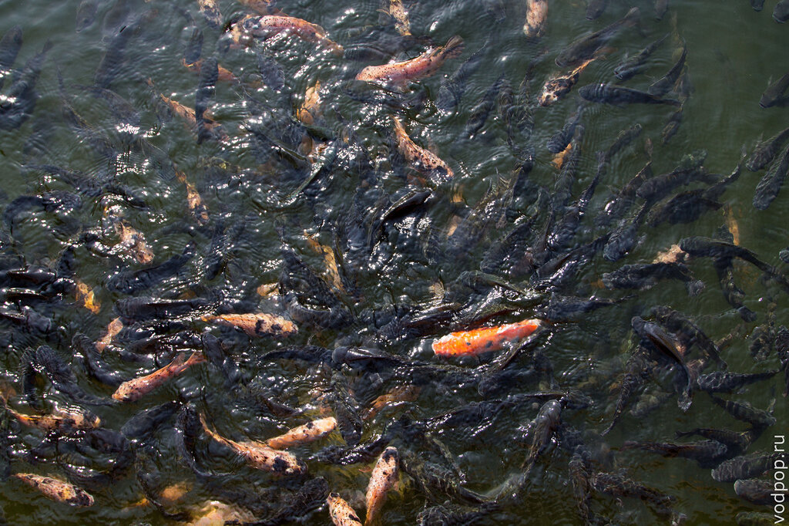

Можно прогуляться в сторону Ват Пном. У подножия установлены симпатичные часы (на фото видны огромные стрелки)

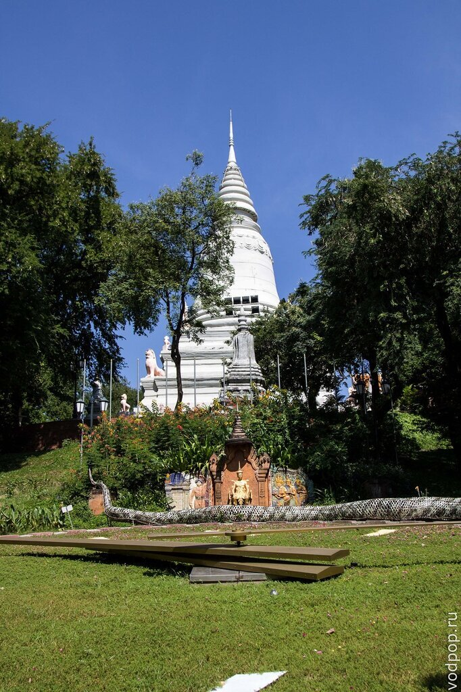

Вход для инострацев платный - 1 доллар

Плату принимает женщина с хищным выражением лица. Она же выдает билетик, который никто нигде не проверяет

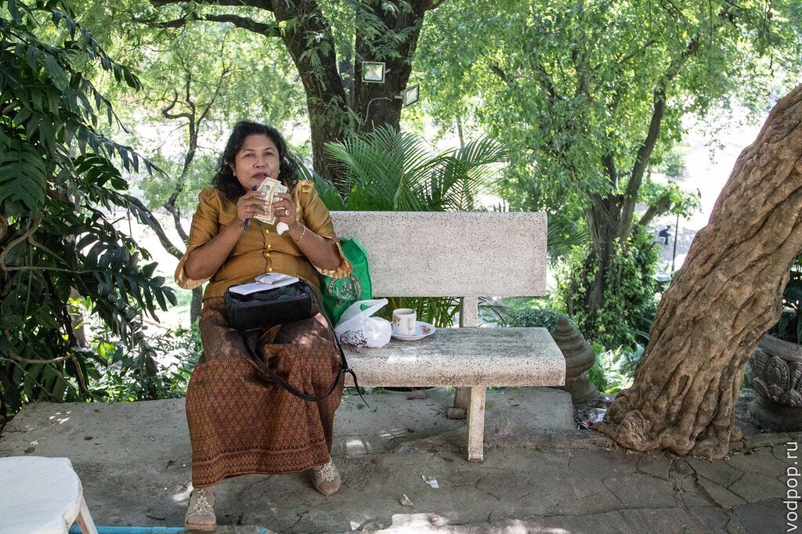

На площадке около храма играют в шахматы. Фигуры легко заменились на камушки и ракушки, что не мешает игрокам очень сосредоточенно смотреть на доску.

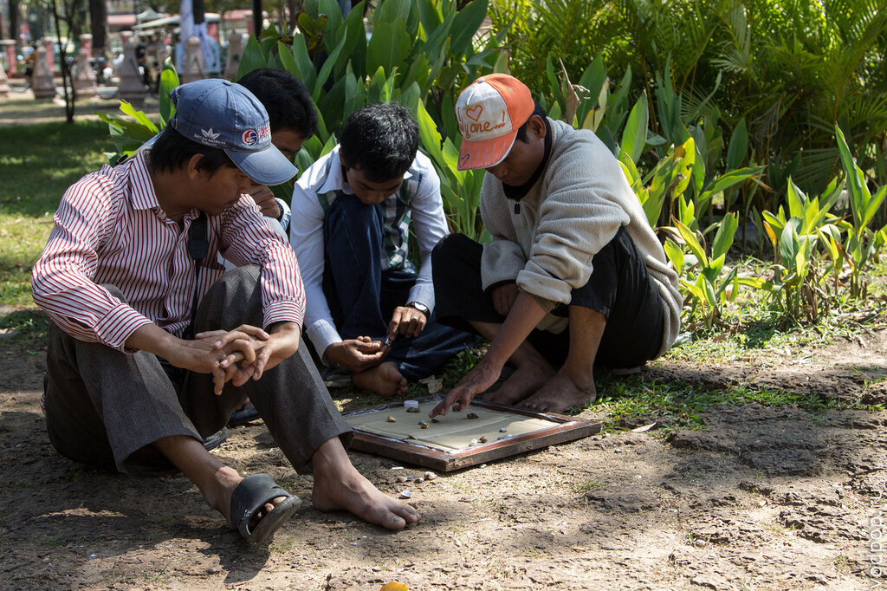

Издали можно взглянуть на монумент независимости (почему-то у нас нет ни одной его фотографии), а затем пройтись до одного из рынков.

Нравится статья? Узнавайте первым о выходе новых интересных историй! Подпишитесь на нас по [эл. почте](http://feedburner.google.com/fb/a/mailverify?uri=vodpop&loc=ru_RU) или в [группе ВКонтакте](http://vk.com/vodpop)

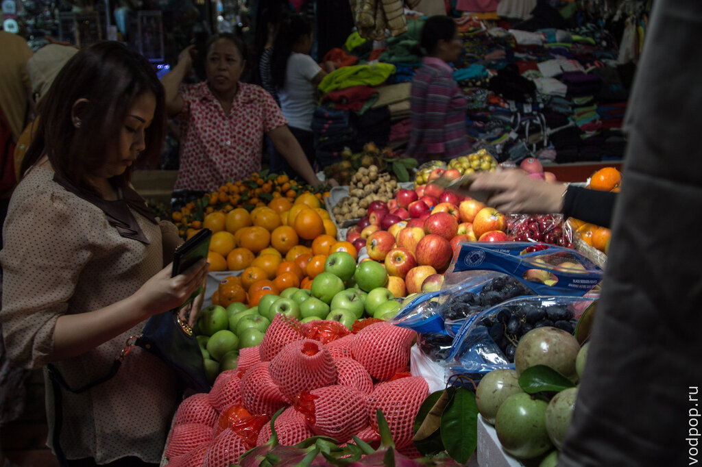 В Пномпене торговля идет довольно бойко - есть Ночной рынок, Русский рынок (получил название в 1980х), Центральный рынок (он же Желтый), на которых можно купить сувениры, посуду, статуэтки, платки, одежду, сережки, еду..

Словом, все, что пожелаете. Торговаться можно и нужно. Ценников вы не увидите нигде - цена появляется в голове продавца при взгляде на потенциального покупателя, которую он затем умножает минимум в  2-3 раза.

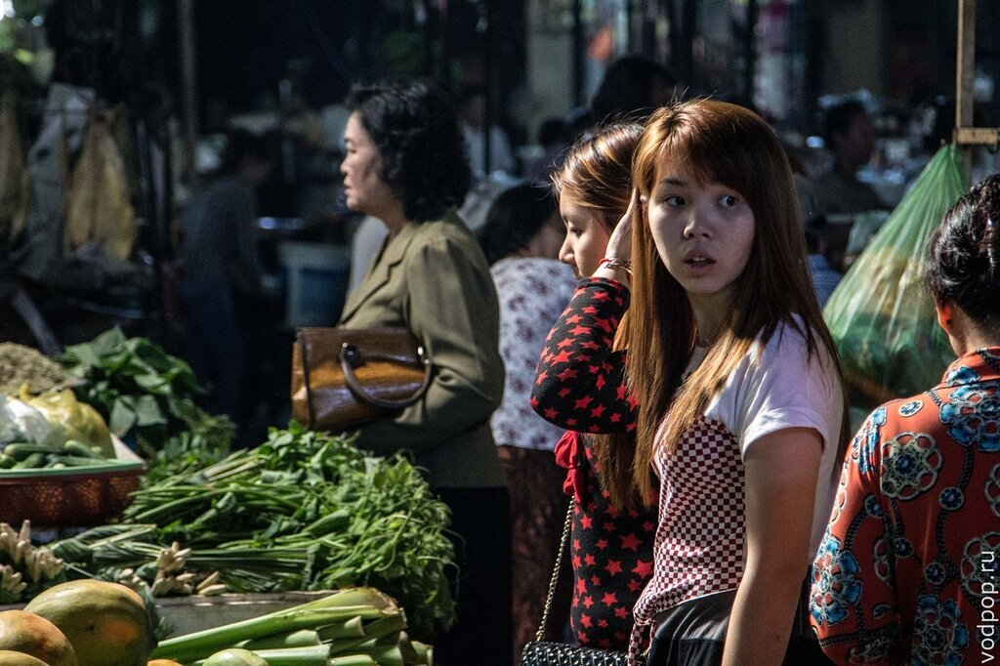

Продавцы довольно милые и готовы вытащить для вас половину прилавка, чтобы вам было удобнее рассмотреть-покрутить что-то в руках. Некоторые весьма неплохо говорят по-английски.

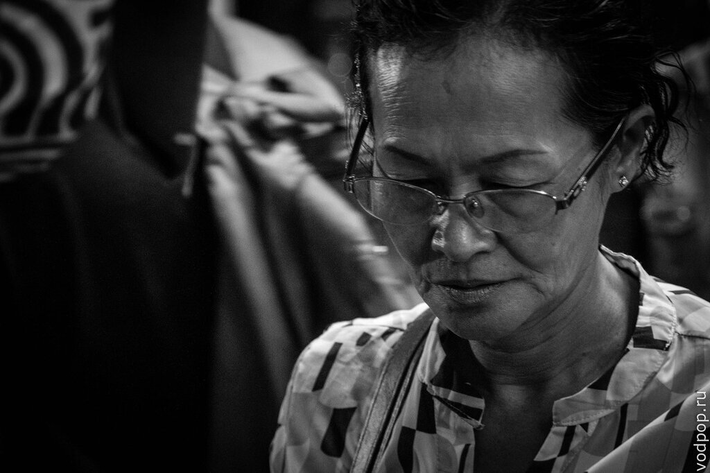

А вот нормальной примерочной вы не найдете - как в старом добром детстве, стоя на одной ноге за занавесочкой, заботливо поддерживаемой рукой продавца, вы будете прыгать на одной ноге, пытаясь попасть в штанину.

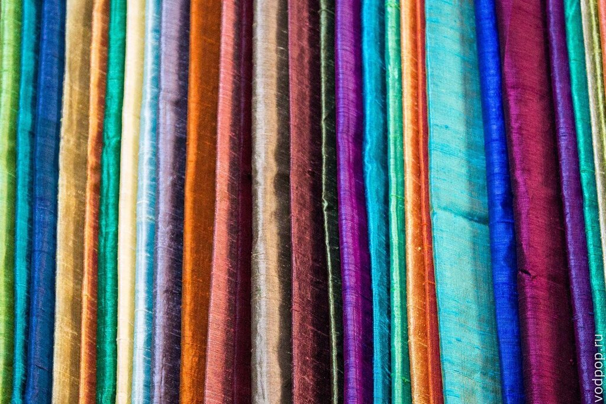

Родители Климентия еще в России ни раз говорили про некую "крому" - чрезвычайно полезный кусок ткани, который кхмеры используют как одежду, головной убор, платок, купальный костюм или полотенце.

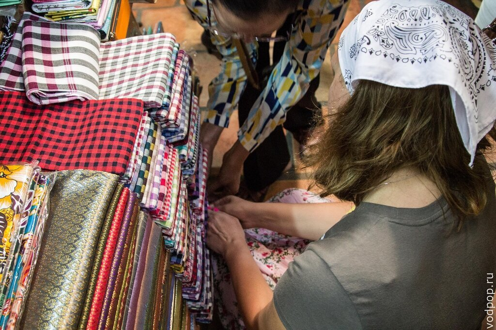 И они были правы! Купив себе по одному платку, мы с тех самых пор не расстаемся с ними ни на минуту - под палящим солнцем Азии мы прячем наши головы, в кондиционированных помещениях накидываем их на плечи и закрываем горло, на пляже используем как подстилку и полотенце.  И по внутренним ощущениям, весь потенциал кромы мы пока не раскрыли .

В общем, если вы окажетесь в Камбодже, обязательно купите себе крому в качестве полезного сувенира (только не забудьте перечислить все полезные функции)!

После прогулки приятно вернуться в гостиницу - принять душ (или даже ванную!), сходить в сауну и поплавать в бассейне.

Мы остановились в Hotel Cambodiana. Кажется, этот отель стоял здесь еще задолго до моего появления на свет, поэтому все тук-тукеры отлично знают, где он находится. Он даже был частично разрушен, а затем восстановлен и с тех пор работает без особых проблем.

 Судя по интерьерам и подъезжающим машинам класса люкс, здесь останавливаются не просто туристы, а в основном люди бизнеса. Во время нашего пребывания в Hotel Cambodiana, там проходило какое-то официальное мероприятие аудиторской компании KPMG.

Не знаю, успевали ли сотрудники KPMG гулять по окрестностям, но территория отеля ухоженная и заслуживает внимания.

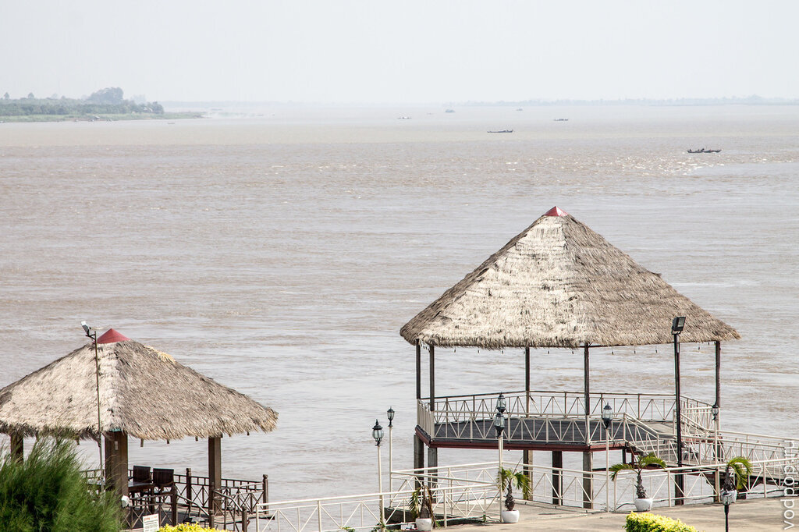

Одно огромное ФИ, которое проявилось сразу же при заселении - неработающий интернет, да еще и в количестве 1 штука на номер. Т.е. чтобы подключить второй и более девайс, нужно доплачивать за каждый дополнительные 10 долларов. Такой подставы от гостиницы подобного уровня ожидать было сложно, благо, на следующий день скорость немного исправилась, а мы приноровились подключать наши устройства по очереди.

Кстати, о тук-туках. Обратите внимание, как крепится коляска к мотоциклу - суровая конструкция на жесткой сцепке все время упирается водителю тук-тука в спину, не давая расслабится. Удивительно, но большинство из них, похоже, не обращает на это внимания. Кроме того, из-за тяжелой повозки мотоцикл кушает очень много бензина, поэтому на всех тук-туках в обязательном порядке есть внешний "бензобак"

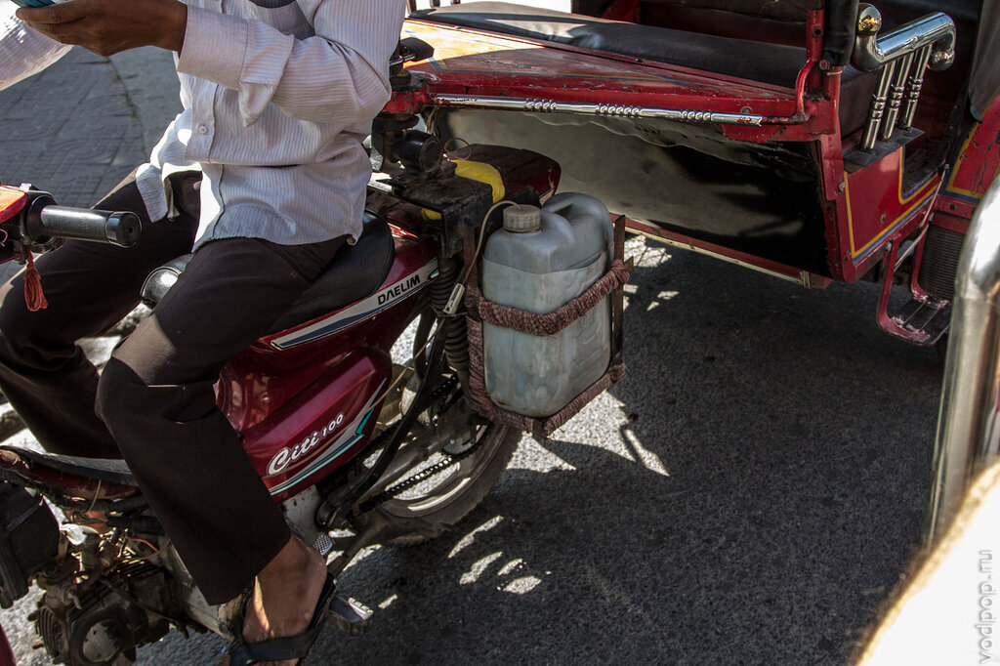

Как итог - Пномпень приятный город, в котором смело можно погулять 1-2 дня, купить дешевых сувениров и сделать пару-тройку красивых фотографий. Будем рады вашим впечатлениям от этого города.
