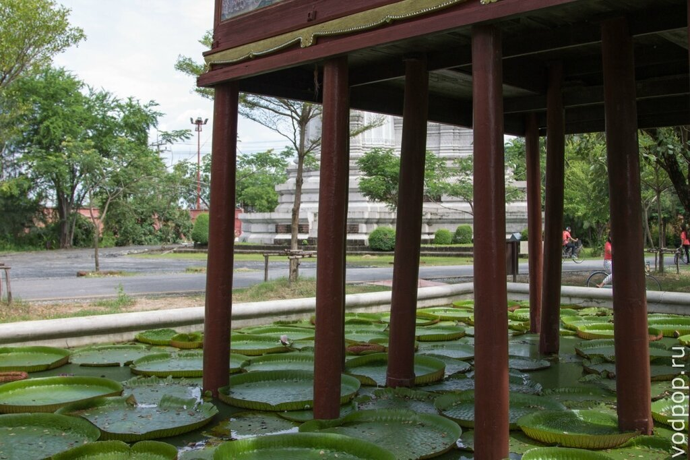

Древний Сиам, он же известный как древний город, Ancient City или Mueang Boran мы посетили в один из первых дней нашего пребывания в Бангкоке. Если верить информации, это самый большой в мире музей под открытым небом, который по моим впечатлениям, занимает площадь не меньше нескольких футбольных стадионов. Одна только уменьшенная копия размером с приличный обеденный стол.

<!--more-->

, Таиланд")

Именно поэтому при покупке билета за 500 бат (чуть выше средней цены на другие достопримечательности бангкока)  вы бесплатно получаете карту и велосипед, на котором можете объехать парк.

, Таиланд")

Еще можно поменять велосипед на одной из стоянок внутри территории, мы так делали, когда я проколола колесо (до сих пор не понимаю, как и где – везде ровный асфальт).

, Таиланд")

По парку ходит экскурсионный трамвай, правда мы слышали из него только тайскую речь. Опция также доступна на английском, но стоит чуть дороже (1200 и 1500 бат тайский и английский язык соответственно). Также можно за 150 бат в час арендовать гольф-кар, в который можно посадить 2-3 человека. Актуальную информацию о ценах можно найти [тут](http://www.ancientcity.com).

, Таиланд")

Мы выбрали вариант с велосипедами и поехали вглубь парка.

, Таиланд")

Стоит заметить, что до Бангкока мы никогда не были в Азии, поэтому архитектура, культура, речь,  религия, достопримечательности Бангкока – все было для нас ново. Было интересно смотреть на выдающиеся произведения искусства разных эпох Таиланда.

, Таиланд")

Нравится статья? Узнавайте первым о выходе новых интересных историй! Подпишитесь на нас по [эл. почте](http://feedburner.google.com/fb/a/mailverify?uri=vodpop&loc=ru_RU) или в [группе ВКонтакте](http://vk.com/vodpop)

Некоторые из экспонатов уже разрушены или находятся в труднодоступных местах (в джунглях), поэтому поездка в Древний город будет полезна тем, кто глубоко интересуется культурой этой страны – архитектурные памятники восстановлены с высокой точность, вплоть до самых мелких деталей.

, Таиланд")

Для таких новичков, как мы, было вполне достаточно поверхностного взгляда, чтобы удивиться таланту и мастерству строителей, архитекторов и художников, благодаря которым этот парк не только работает, но и развивается.

Мастерские находятся прямо тут, на территории парка. В них стоят токарные и деревообрабатывающие станки и рубанки, свалены краски и кисти. Пока мы проезжали мимо, мастера реставрировали пояснительные таблички к экспонатам. Они очень красивы и заслуживают особого внимания.

Если вы хотите не только полюбоваться, но и понять что-то в окружающих вас предметах искусства, советую подготовиться и почитать хотя бы вкратце, что такое буддизм, какие символы чаще всего встречаются и что они значат. Например, что обозначает черный Будда среди золотых?

, Таиланд")

Подготовленными ходить по парку станет намного интереснее. Увы, мы довольствовались лишь отрывочными воспоминаниями о когда-то прочитанной информации об этой удивительной религии. Удивительной, потому что, несмотря на довольно бедную жизнь, тайцы всегда улыбчивы, открыты и довольны жизнью. Хотя у девушки на фото закрыто лицо, под платком она точно улыбается.

, Таиланд")

На осмотр всех достопримечательностей в спокойном темпе у нас ушло около 5 часов. Лучше приехать часам к 10, чтобы в самую жару (с 12 до 14) укрыться от палящего солнца и пообедать в одной из многочисленных кафешек на территории парка.

, Таиланд")

Обязательно  возьмите с собой или купите на месте воду и головные уборы. Наценки «для туристов» небольшие: одна и та же шляпа в парке стоит всего лишь на 10 бат дороже, чем вне него.

, Таиланд")

Мы обедали в ресторанном дворике посередине парка, купив рамен у одного из торговцев на лодке. Вообще лодочные рынки не только достопримечательность Древнего Города, но довольно распространенное явление в Бангкоке (наверное, и во все остальном Таиланде тоже, но мы пока там не были).

, Таиланд")

В Древнем Городе есть свой маленький зоопарк, который в основном состоит из оленей и птиц. Есть еще змея и пара кроликов.

, Таиланд")

Нам очень понравилось – там тихо, есть беседки, в которых можно прилечь в полный рост (после нескольких часов катания в жару это очень приятно) и побыть в тишине. Почему-то в эту часть парка добирается мало людей. Одна из причин – отсутствие ярко выраженной вывески. Мы набрели туда случайно и потом долго удивлялись, как мы там оказались.

Увы, на бумажной карте, которую вам выдадут вместе с билетом, нет готовых маршрутов с оценкой по времени. Поэтому мы ехали «по наитию», по часовой стрелке. Главное, не забывать, что движение в Таиланде левостороннее. На велосипедах это не критично, а вот если вы арендуете гольф-кар, это может печально закончиться.

Все достопримечательности расположены в соответствии с реальным расположением на территории Таиланда. Например, город Сукотаи – исторический памятник с множеством храмов расположен в северной части Таиланда. И в парке он также расположен на севере. Время от времени в парке мы немного дезориентировались и мы жалели, что не взяли с собой компас.

, Таиланд")

Было очень приятно, что это место не очень-то популярно среди иностранных туристов. Сюда ходят в основном тайцы с детьми, чтобы наглядно показать им историю своей страны. Что-то вроде поездки в Москву на Красную площадь, хотя более информативное и наглядное. Но есть в этом и свои недостатки – в описании присутствовал только тайский и английский языки, а перевода многих терминов мы просто не знали. Из-за этого для нас этот поход был не столь полезным, как мог бы быть. Если вы едите большой компанией, то можно выделить каждому человеку по 10-15 достопримечательностей, чтобы он поискал о них информацию в интернете и подготовил по ним мини-отчет. Но это для тех, кто любит «заморочиться».

Наш вердикт: если вы приехали на пару дней в Бангкок и не знаете, чем себя занять – Древний Город отличное место, чтобы всей семьей провести день на природе, любуясь произведениями искусства и постигая загадочную Азию.

Теперь небольшая подсказка, как добраться до Древнего Города. Есть несколько путей:

1. Метро + Автобус + минивен. Самый распространенный. Доезжаете до станции метро On Nut, переходите на сторону, противоположенную супермаркету Теско. Обратите внимание, остановка находится прямо под лестницей в метро. В ту сторону идет 511 автобус с кондиционером за 18 бат с человека. Затем пересаживаетесь на конечной остановке на 36 минивен (8 бат с человека).  Он идет прямо до входа в Древний Город. Если хочется добавить местного колорита и подышать пылью, по 36 маршруту следует сонгтэо примерно за 20 бат.
2. Такси от отеля. Если отель в центре, то без пробок обойдется в 300-400 бат. Но от них никто не застрахован, поэтому может набежать весьма приличная сумма. Способ наименее предпочтительный.
3. Такси от станции метро On Nut. Будет стоить около 130-150 бат.

Местным нужно говорить, что вы направляетесь в  Mueang Boran, тогда вас наверняка поймут и довезут туда, куда нужно.

Если вы будете внимательны и проследите за табличками с надписью «Erawan», то сможете во время движения заметить по левую сторону большой храм с гигантским слоном на крыше – это Эраван музей, о поездке в который мы расскажем в следующих постах. Если есть вопросы – пишите в комментариях!

P.S. на поездку в Древний Город стоит выделить весь день. После целого дня ходьбы/езды у вас вряд ли останутся силы на [другие достопримечательности Бангкока.](https://vodpop.ru/okeanarium-bangkok/ "Океанариум в Бангкоке")
