Джорджтаун - излюбленное место путешественников со всего мира, внесенный в список объектов всемирного наследия Юнеско. Честно - мы как не пытались, так и не поняли, в чем же "фишка" этого города. Разве что самое удобное место для визарана, т.е. получения полноценной визы в Таиланд.

<!--more-->

Доехать до Пенанга можно практически  из любого города - автобусы хорошие, с широкими сидениями, кондиционером. Отправляются часто.

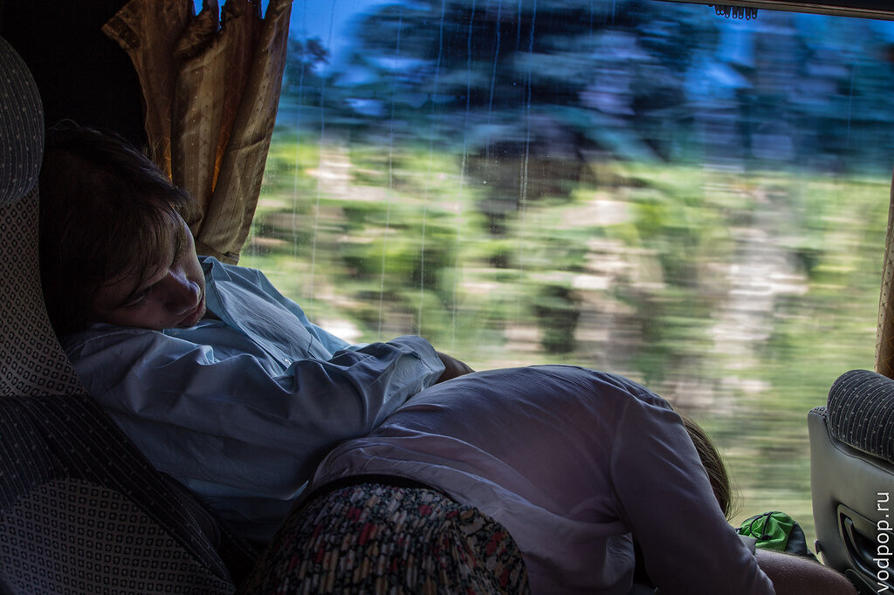

Автобус нас, правда, привез не в сам Джорджтаун, а в Баттерворс, к парому, который идет 20 минут.

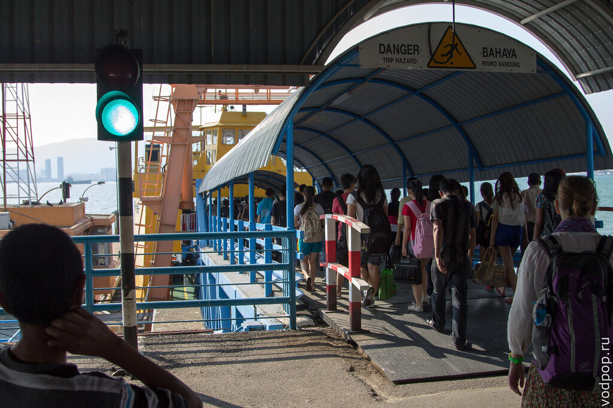

Паром можно оплатить только наличными -  1,2 малайзийских рингит , в отличие [от Норвегии](https://vodpop.ru/nordcap-i-lofotenskie-ostrova/ "В Норвегию на машине. Часть 3. Нордкап и Лофотенские острова"), например, где плата на любом пароме была возможна карточкой.

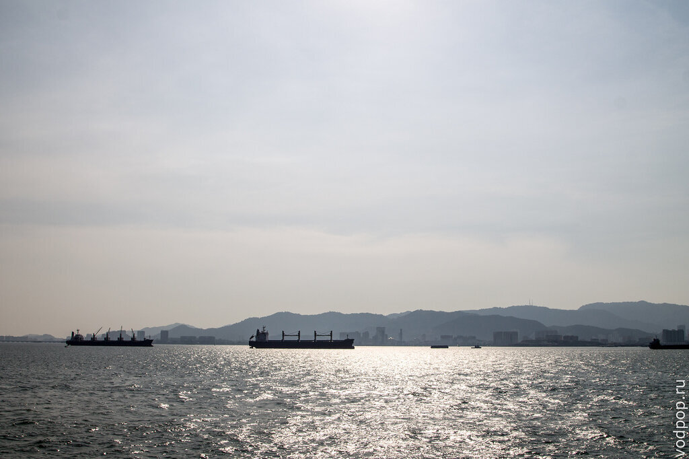

Вид на остров Пенанг довольно симпатичный - многие снимают вид на фотоаппараты, телефоны. Сначала снимала женщина

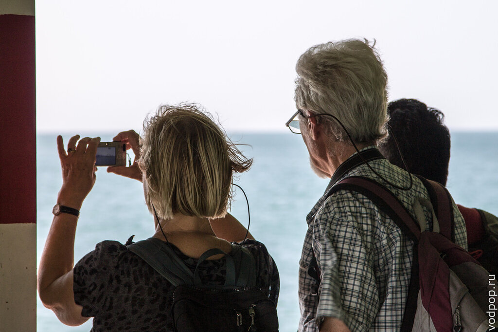

А затем ее спутник

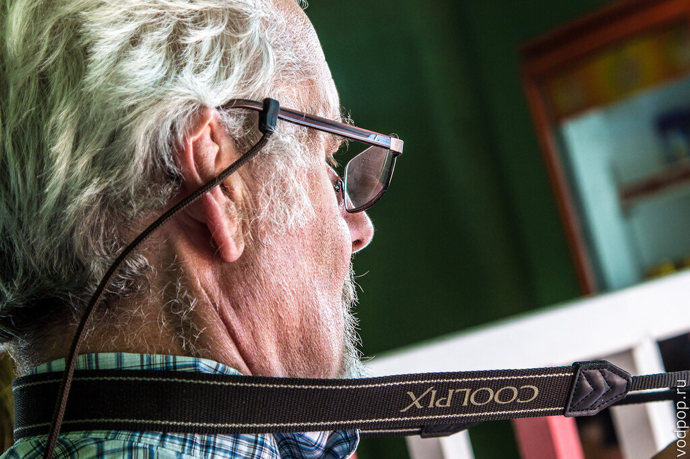

Интересно, зачем им два экземпляра фотографий?

Сначала мы хотели немного погулять по центру города - посмотреть основные достопримечательности - форт, храмы, а затем уехать в Куала-Лумпур. Мы сели на другой автобус, пропустили благодаря "доброму" водителю нашу остановку - вокзал, откуда отправляются ночные автобусы до Куалы, и только через 20 минут дороги нас все-таки одолели сомнения, туда ли мы едем.

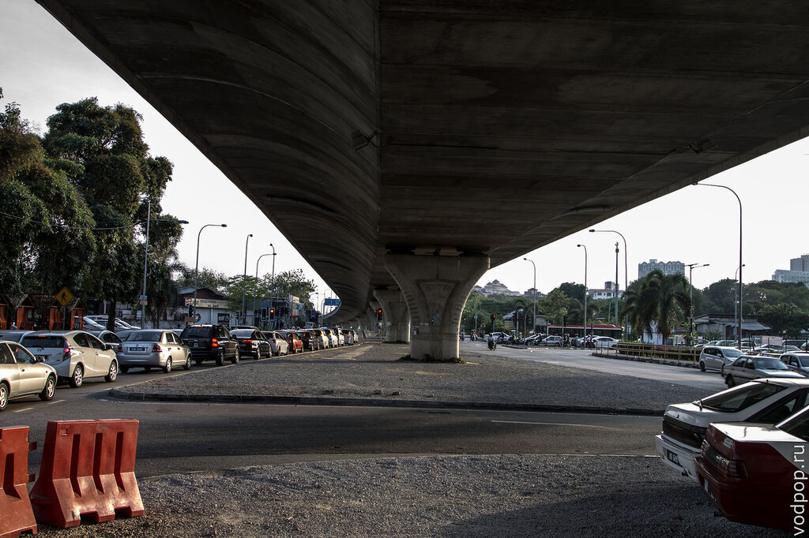

Пейзаж был совершенно не впечатляющим - спальные районы из высоток

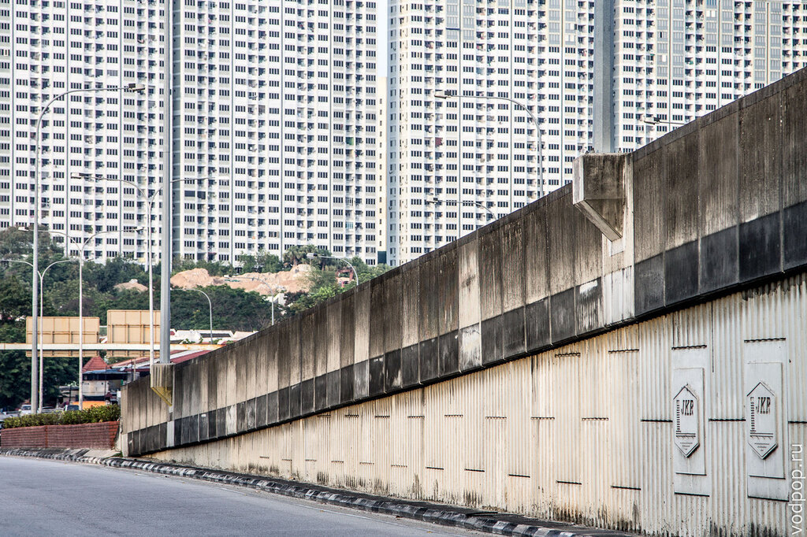

Скучно и серо. Фи

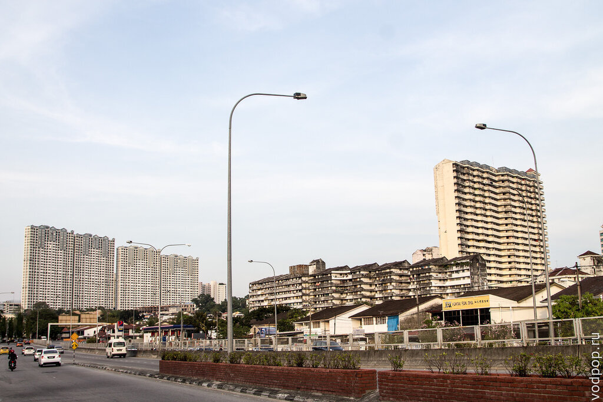

Пока мы вернулись обратно в город, уже стемнело. Усталость взяла вверх и мы решили все-таки задержаться здесь на ночевку. Первая попытка вышла комом - все хостелы были забуканы заранее (путешественники, ну правда, ЧТО вы в этом городе находите?!), поэтому мы просто гуляли по улице, пока не нашли гест по адекватной цене с очень приятным хипстером-малайцем китайского происхождения.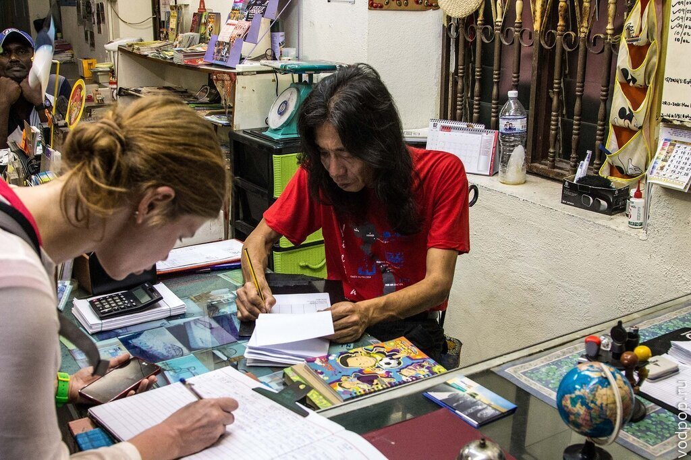

Местечко называется Love Lane Inn. Если планируете посетить Джоржтаун в Малайзии - возьмите хостел на заметку. Там даже завтрак бесплатный - тосты с кофе или чаем.

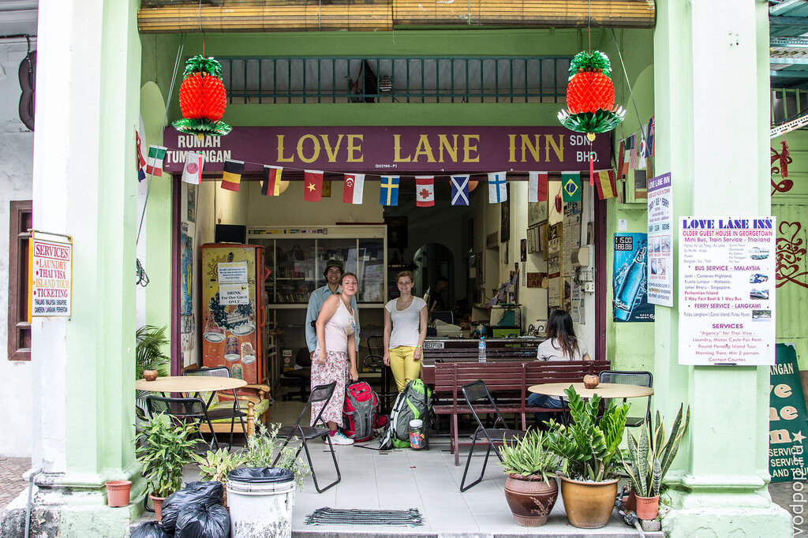

Я решила, что с больной ногой я больше ходить в этот день не смогу - Климентий остался со мной, а Владимир с Дашей пошли осматривать местные достопримечательности - историческую часть города, где сохранились колониальные постройки.

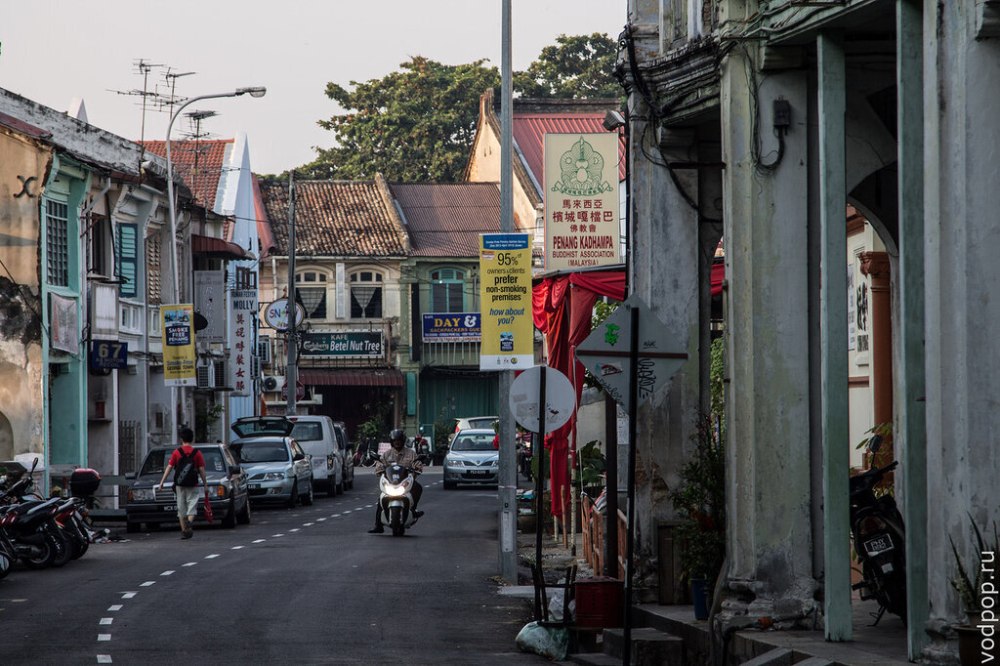

Глаз у нас с Климом после Таиланда точно "замылился" - если бы мы приехали в Джорджтаун в самом начале нашего путешествия, то наверняка бы запомнили его как что-то яркое и неповторимое. Но после китайцев [в Гонконге](https://vodpop.ru/bolshoy-budda-v-gonkonge/ "Большой Будда в Гонконге и рыбацкая деревня Тай О") смотреть на них в Малайзии было уже не так интересно.

История их появления в этих краях довольно занимательна: мелкие торговцы из Китая стали активно переселяться в Малайзию в 19-20 вв., по приглашению британских колонизаторов. Китайцы являлись промежуточным звеном между англичанами (которые сами не хотели жить в таком жарком климате) и населением Малайзии, которое занималось сельским хозяйством. В настоящее время в Малайзии около 25% населения - китайцы. Что удивительно - китайцы разговаривают сразу на трех языках - китайском, малайском и английском. Причем совершенно свободно.

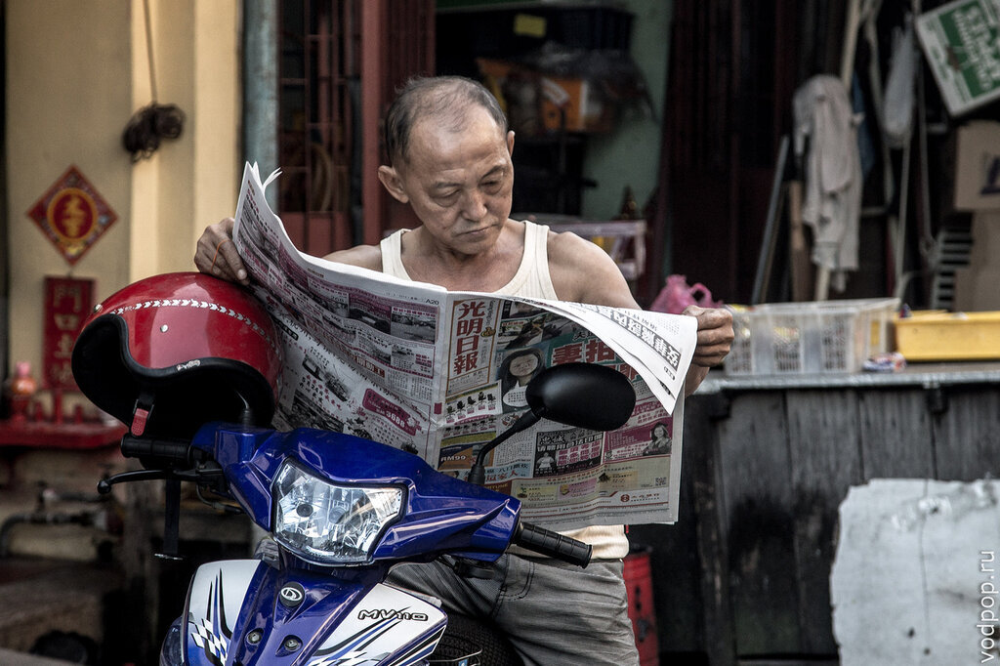

Мы пытались расспросить местное население насчет отношения к "понаехавшим", но почти все отвечали единогласно, что как таковой проблемы нет. Но при этом китайцы чаще всего ходят в китайскую школу, исповедуют другие религии и в общем-то чаще всего общаются друг с другом. Малайцы при этом доминируют в органах гос. управления и с неохотой пускают в свои ряды китайских представителей.

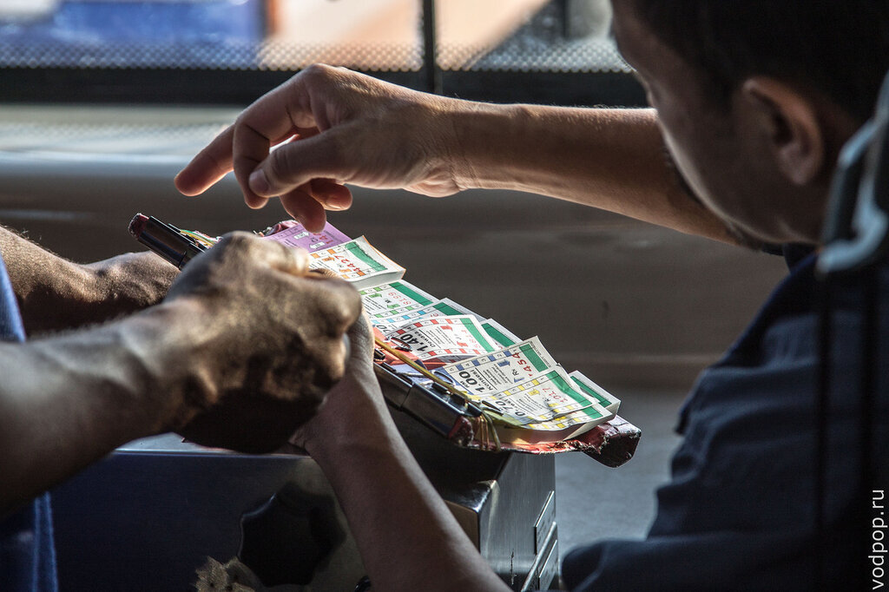

Ну да в сторону политику... По дороге к утреннему автобусу до Куала-Лумпур, увидели классное граффити на стене. Интересно - рисовали местные или туристы?

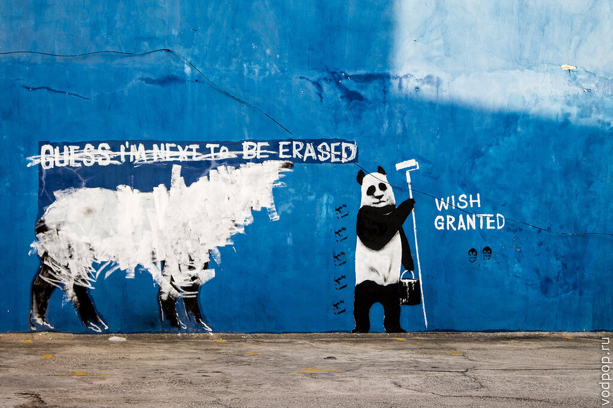

На мой взгляд, Джорджтаун в Малайзии - не самый интересный город для посещения в Юго-Восточной Азии. Однако, если вас какими-то судьбами занесло в эти края, можно постараться найти что-то интересное - тот же Форт, многочисленные китайские храмы. Или просто попить пива сока в компании таких же бэкпекеров со всего мира и задать им животрепещущий вопрос "а зачем вы приехали в Джорджтаун?!"
