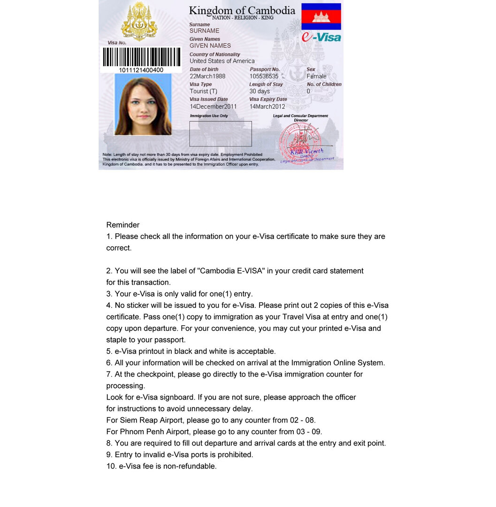

Многие удивятся тому, что россиянам необходимо получать визу в Камбоджу. Если вы прилетаете в Камбоджу на самолете, то эта проблема легко решается прямо в аэропорту за 30$. На наземных переходах процесс сильно усложняется бюрократией и вымогательством пограничников. Поэтому мы решили заранее оформить электронную визу в Камбоджу.

<!--more-->

Общим требованием к получению визы является заграничный паспорт,  срок окончания которого 6 и более месяцев со дня предполагаемого въезда в страну.

## Электронная виза в Камбоджу (e-visa)

Для того чтобы оформить электронную визу, вам прежде всего понадобится посетить [официальный сайт МИД Камбоджи](https://www.evisa.gov.kh/).

Виза однократная, туристическая, выдается на 30 дней пребывания в стране, действительна в течение 3х месяцев с даты выдачи. Стоимость электронной визы e-visa в Камбоджу - 36$.

Обращаю внимание, что электронная виза пока принимается не везде, поэтому привожу таблицу пограничных пукнтов с официального сайта (актуально на ноябрь 2018 года).

Да - поддерживается e-Visa; Нет - не поддерживается e-Visa

<table border="0"><tbody><tr><td><strong>Пограничный пункт</strong><b></b></td><td><strong>Граница</strong></td><td><strong>Вход</strong></td><td><strong>Выход</strong></td></tr><tr><td>Международный аэропорт Пном Пень</td><td>-</td><td>Да</td><td>Да</td></tr><tr><td>Международный аэропорт Сием Рип</td><td>-</td><td>Да</td><td>Да</td></tr><tr><td>Чам Ем (Ко Конг)</td><td>Таиланд</td><td>Да</td><td>Да</td></tr><tr><td>Чорм (Оддар Минчей)</td><td>Таиланд</td><td>Нет</td><td>Да</td></tr><tr><td>Даунг (Камринг-Баттамбанг)</td><td>Таиланд</td><td>Нет</td><td>Да</td></tr><tr><td>Пой Пет (Бантей Минчей)</td><td>Таиланд</td><td>Да</td><td>Да</td></tr><tr><td>Пром (Пайлин)</td><td>Таиланд</td><td>Нет</td><td>Да</td></tr><tr><td>О Смеч (Оддар Минчей)</td><td>Таиланд</td><td>Нет</td><td>Да</td></tr><tr><td>Бавет (Свей Ринг)</td><td>Вьетнам</td><td>Да</td><td>Да</td></tr><tr><td>Каоам Самнор (Кандал-Меконг)</td><td>Вьетнам</td><td>Нет</td><td>Да</td></tr><tr><td>Пном Ден (Такео)</td><td>Вьетнам</td><td>Нет</td><td>Да</td></tr><tr><td>Трапэинг Срэ (Крати)</td><td>Вьетнам</td><td>Нет</td><td>Да</td></tr><tr><td>Донг Крало (Станг Тренд)</td><td>Лаос</td><td>Нет</td><td>Да</td></tr><tr><td>Preah Sihanouk International Airport</td><td>-</td><td>Да</td><td>Да</td></tr><tr><td>Sihanoukville</td><td>-</td><td>Да</td><td>Да</td></tr></tbody></table>

Итак, если вы уверены, что в выбранном вами месте e-visa принимается, то вам необходимо зайти на официальный сайт, заполнить заявку (анкету) на английском языке, к которой приложить фотографию формата JPEG или PNG. В течение 3х дней в случае положительного решения вы получите ответный e-mail на почту с электронной визой, которую необходимо распечатать и предъявить на пограничном контроле:

**Стоимость оформления электронной визы в Камбоджу**: 30$ (консульский сбор) + 6$ (за оформление онлайн)

## Получение визы в Посольстве или Консульстве Камбоджи (в любой стране)

Для оформления визы в  Посольстве/Консульстве нужно взять с собой следующие документы:

- действующий загранпаспорт;
- 3 фотографии 4 см \*6 см;
- заполненную анкету на английском языке (если оформляете в РФ, то на русском). Анкету можно взять в Посольстве.

Виза оформляется за 1 день

**Стоимость оформления визы в Камбоджу в Посольстве:** 30$

## Виза в Камбоджу по прибытии

Легко оформляется в одном из трех аэропортов Камбоджи:

- Пном Пень ( Phnom Penh)
- Сием Рип (Siem Reap)
- Сиянуквиль (SihanoukVille)

**Необходимые документы:** - загранпаспорт; - одна фотография 4 см\* 6см. Если фотографии с собой нет, заплатите 3$ штрафа и пройдете без нее (они все равно фотографируют вас на свою камеру при выдаче визы) - заполненная анкета, которая выдается здесь же по прибытии.

**Стоимость однократной туристической визы по прибытии**: 30$

А вот с пограничными переходами все куда печальнее. Официально стоимость визы та же, и порядок получения такой же, как в аэропорту. Но из-за процветающей бюрократии, взяточничества и наглости камбоджийских пограничников, цена может достигать и 30$, и 50$, и даже 100$ - все зависит от вашего умения давать отпор ворам и помогалам .

## Бизнес-виза в Камбоджу

Если вы планируете задержаться в Камбодже на более продолжительный срок (от 30 дней  и выше), то рекомендуем оформить деловую (бизнес) визу. Она оформляется также по прибытии, стоит 25$. Продлевать ее необходимо в Иммиграционной службе:  на 6 месяцев – 150$, на год-  280$.

Нравится статья? Узнавайте первым о выходе новых интересных историй! Подпишитесь на нас по [эл. почте](http://feedburner.google.com/fb/a/mailverify?uri=vodpop&loc=ru_RU) или в [группе ВКонтакте](http://vk.com/vodpop)

## Продление визы в Камбоджу

Лучше всего это делать через агенство, так как пограничная бюрократия и сюда пустила свои крепкие корни. Однако, если вам хочется сэкономить, и, вероятно, остаться на неопределенный срок без паспорта, то обращайтесь в Иммиграционную службу, которая есть в каждом крупном городе Камбоджи.

Процесс обычно занимает 2-7 дней, цена зависит от каждого конкретного агенства. Лучше всего обойти 3-4 места, сравнить цену, а потом уже принимать решение, где именно заказывать визу.

**Стоимость продления визы в Камбоджу на 30 дней:** 45$

Обращаю внимание, что **электронно визу в Камбоджу продлить нельзя**.

Если вы сами не заметили, как просрочили свою визу, и не занялись этим вопросом заранее, то будьте готовы заплатить 30$ штрафа+5$ за каждый день просрочки.

Мы настоятельно рекомендуем оформить заранее электронную визу в Камбоджу - это поможет сберечь много нервных клеток и денег.
