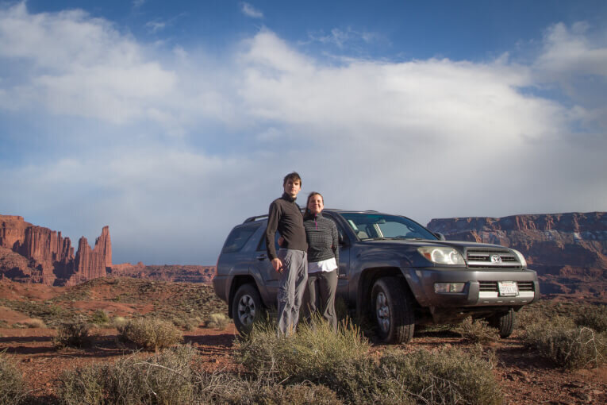

Hi there! We're Sasha and Klim, travellers from Russia. We've already visited about 40 countries and now we're in the huge trip around all the countries in North and South America heading to Argentina by our car. We bought our Toyota Prius in Vermont, USA in April 2016 and deeply explored Canada and States by driving over 40 000 miles (64k km) all over the place. In Jan 2017 we changed our Prius to Toyota 4Runner '04 to have more freedom overland. We love to stay with locals to understand their life and share the experience.

## Follow us!

**The best way to follow us** is to add us on Facebook. Some of the posts are in Russian, so you can use the _Translate_ button to automatically translate our posts to English:

[facebook.com/alexbulygina](https://www.facebook.com/alexbulygina) [facebook.com/klimentij.bulygin](https://www.facebook.com/klimentij.bulygin)

and our cozy Instagram:

[instagram.com/sasha\_and\_klim/](https://www.instagram.com/sasha_and_klim/)

You can also find us in Vkontakte (Russian Facebook):

[vk.com/vodpop](https://vk.com/vodpop) [vk.com/meetoyou](https://vk.com/meetoyou) [vk.com/klimentij511](https://vk.com/klimentij511)

We also have the outstanding travel blog [vodpop.ru](https://vodpop.ru/) and it's [automatic translation](https://translate.google.ru/translate?hl=en&sl=ru&u=https://vodpop.ru/&prev=search).

## Get in touch!

Our Mexican number is **+52 (664) 369 32 66.** Feel free to text or call.

Our Couchsurfing profile with references about us: [couchsurfing.com/people/alexandrabulygina](https://www.couchsurfing.com/people/alexandrabulygina) 

## Our Web Design Studio

Klim is a UX Designer and CEO of the remote company which creates user interfaces for web sites and mobile apps. To find more about it, just check the website: [en.uxman.ru](http://en.uxman.ru)

## Discover our Homeland

We also prepared [a file](https://docs.google.com/document/d/17vlvUVd4dPl4TqfQiCbSDVN0lZk4c-E4wzD0wQ1-vOM/edit?usp=sharing) with Best-of-Russia! Here you can find best music, art, movies and books from our Homeland.

## Check out our route

**—**  the actual travelled path since April 2016 **—**  the general plan for the future

<iframe src="https://www.google.com/maps/d/embed?mid=1henv1g61NnTMnPdbOaSKJtBDLtc" width="640" height="480"></iframe>
