Ежегодная ярмарка в Ват Чалонг не первый раз собирает под открытым небом сотни, а то и тысячи человек. Нам удалось целых два раза посетить это интересное событие и подготовить небольшой отчет о наших прогулках.

<!--more-->

Конечно, если вашей целью является сам храм Ват Чалонг, то мы рекомендуем прийти в обычный день, зайти в одну из построек, посмотреть на яркое и богатое оформление храма или даже обратиться высшим силам. Во время ярмарки Ват Чалонг продолжает работать, но на наш взгляд, наслаждаться красотой буддистского храма лучше в тишине.

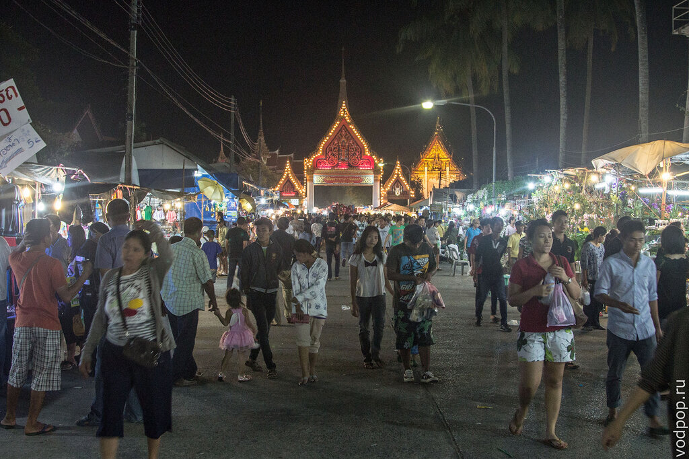

Краткая историческая справа. Первые упоминания о храме Ват Чалонг на Пхукете относятся к 1837 году, а широкую известность храм  получил в 1876 году, когда острове вспыхнуло восстание: китайцы грабили дома и убивали мирных жителей. Монахи храма во главе с настоятелем организовали ополчение и победили мятежников.

Нынче Китай мятежей не затевает, а поставляет подделки на тайские ярмарки. Например, джинсы Levis по 100-400 бат. Кстати, качество отличное - я специально посмотрела все швы, проверила бирки - не отличаются ничем от настоящих. Видимо, фабричного производства в "ночную" смену.

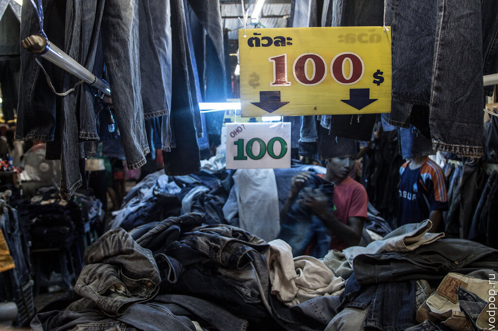

Впрочем, китайцев все так же много, как и в 19 веке. Они стараются жить вместе, поэтому в Пхукет-тауне вы всегда сможете найти китайские кварталы - обычно на них куча вывесок с иероглифами и висят китайские фонарики.

На фото - китайский квартал, который заканчивается кольцевым движением. В центре него китайцы поставили огромный плакат Короля Таиланда (даже они его любят!), а вокруг масса фонариков, бумажных кукол. Словом, красота

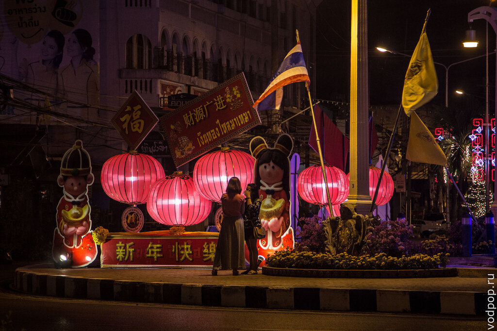

Ежегодная ярмарка в Ват Чалонг собирает огромное количество тайцев и туристов. Хотя мы и не любим толпы, но оба раза нам очень понравилось ходить среди радостно-возбужденных людей, улыбающихся, расслабленных после тяжелого рабочего дня.

Движение на главном шоссе Chaofa почти полностью перекрывается переходящими туда-сюда пешеходами. Для этого на дороге стоят тайцы с фонариками, которые мигают водителям, когда пешеход выходит на дорогу, а также этими фонариками "загоняют" водителей на парковку за 20 бат. Парковка - это просто все свободное пространство в радиусе 1 км от входа в Ват Чалонг. До и после можно парковаться абсолютно бесплатно, что мы и сделали оба раза.

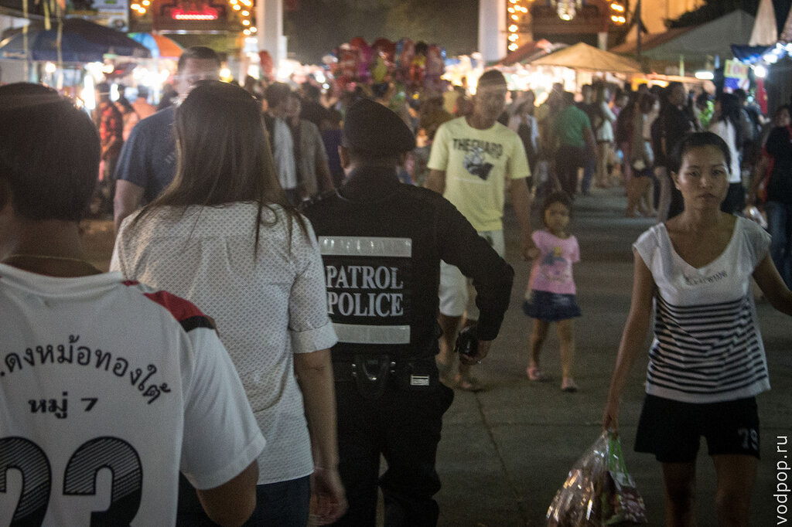

Среди толпы  можно заметить пару полицейских, но они с улыбкой смотрят по сторонам и не делают никаких замечаний. Надо сказать, что тайцы в общем-то любители выпить, но ведут себя при этом очень по-буддистки: никому не мешают, мерно покачиваясь из стороны в сторону, идут куда-то.

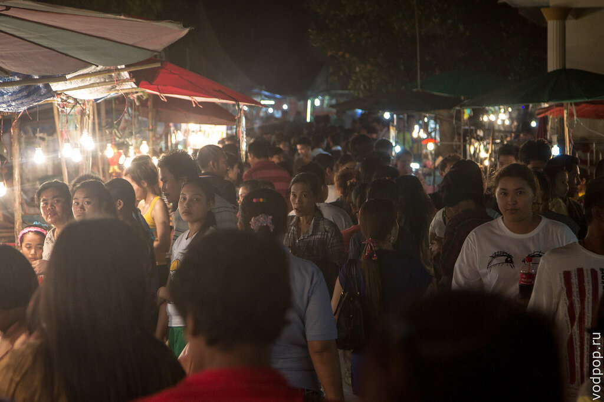

Очень сложно передать атмосферу праздника, которая там царит. Хотя первый раз мы были с Климентием вдвоем, а во второй раз приехали с Дашей и Владимиром - нашими друзьями, которые решили провести отпуск в Азии, атмосфера и там, и там была просто потрясающей!

Желая показать ребятам весь колорит Азии, мы даже не боялись покупать неизвестные нам продукты. Например, вот эти "чипсины" с белой консистенцией сверху, оказались очень вкусными печеньками с заварным кремом - мы возвращались к этой палатке целых два раза.

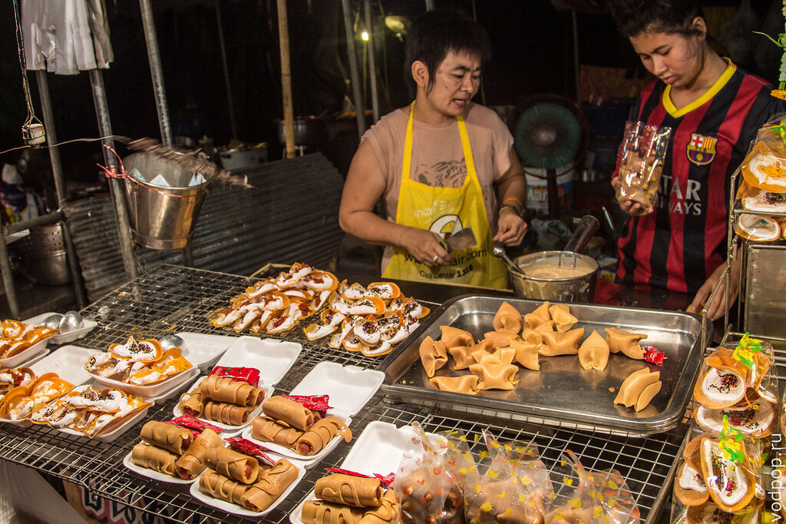

Запивали сладкое не менее сладким тростниковым соком, который делали прямо при нас с помощью нехитрой "соковыжималки": тростник просовывается между двумя цилиндрами, жидкость сливается в ведро, а бесполезные остатки тростника сваливаются рядом в кучу. Полгода назад я была бы в ужасе от того, как тут все происходит, но сейчас я с улыбкой смотрю и понимаю, что раз валяющаяся стопка тростника никому не мешает, то почему я должна из-за нее расстраиваться? Буддизм, однако

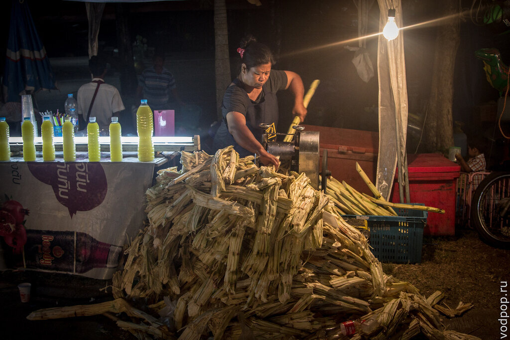

Мы попробовали купить клубнику - она оказалась совершенно невкусной, хотя цена довольно демократичная - от 25 бат за стаканчик 0,25. По соседству продавались каштаны по 100 бат за стакан. Климентий было заинтересовался попробовать, но я напомнила, что мы уже ели их [в Париже](https://vodpop.ru/parizh-frantsiya/ "Париж. Первые впечатления от Франции").

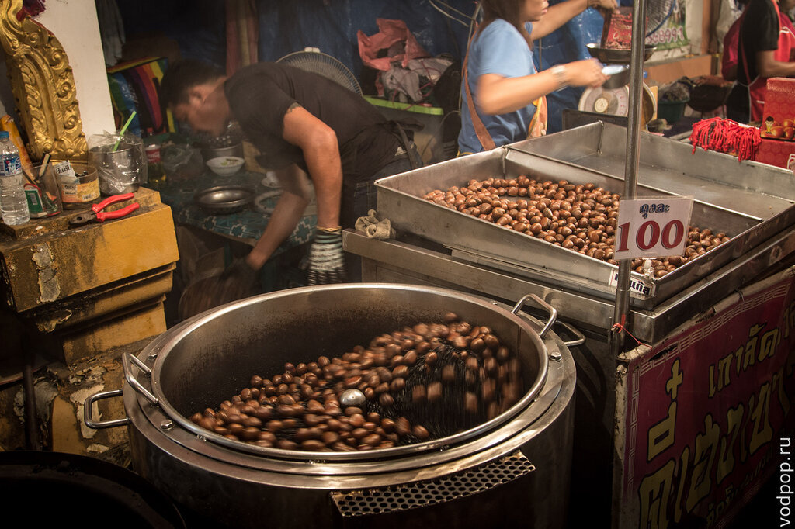

Ароматные шашлычки на деревянной палочке продаются везде и всюду. Фишболы, митболы, креветки, осьминожки, кальмары, крабовые палочки, курица, свинина, сосиски - вот малый перечень того, что вы можете найти на ежегодной ярмарке в Ват Чалонг. Цена от 5 до 50 бат в зависимости от начинки и размера.

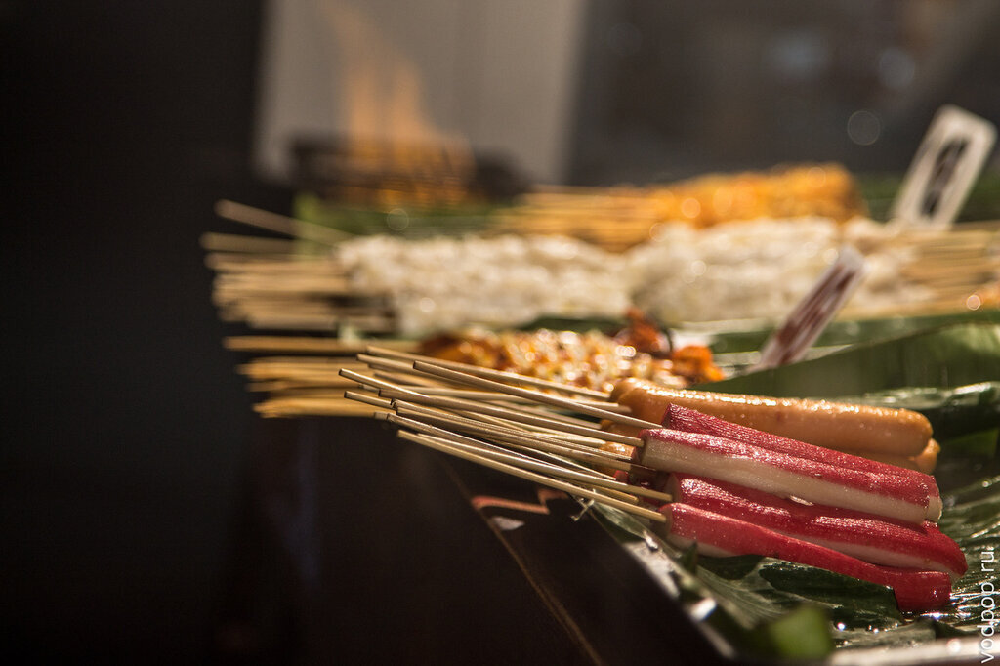

Кстати, на ярмарке действует то же правило, что и на рынках всего мира - чем глубже и дальше от входа, тем дешевле. Поэтому не стремитесь сразу на входе купить все и вся - лучше подождать 5-10 минут и сэкономить. Хотя, учитывая цены в Таиланде, экономия не будет слишком большой.

Ярмарка идет целую неделю, поэтому вы можете хоть каждую ночь приезжать сюда и пробовать все новые и новые тайские деликатесы. Например, тамаринд (индийский финик). Хотя его продают во всех магазинах 7-11, первый раз мы рекомендуем попробовать его свежим, без специй. По вкусу чем-то напоминает изюм, поэтому Климентий сразу отнес тамаринд в длинный список продуктов, которые он не ест.

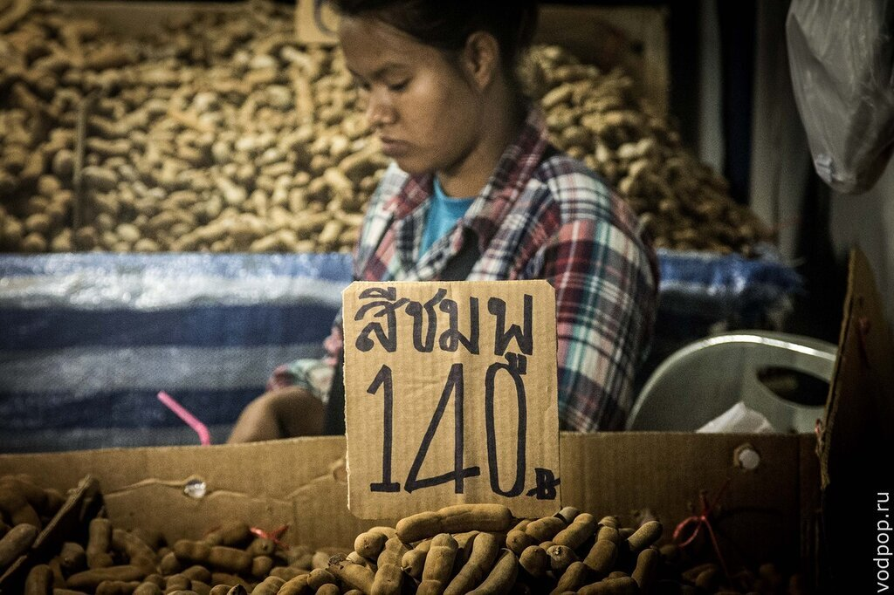

Мы втроем (я, Даша, Владимир) отважились попробовать кузнечиков и еще три вида каких-то жуков и личинок. Неожиданно было очень вкусно - как сушеная закуска к пиву. Но много не съешь. Климентий решил не рисковать и, как мы шутили, в случае чего повез бы нас троих в больницу.

Кроме фаст-фуда на ярмарке есть целый ряд кафе, в которых можно заказать любое блюдо на свой вкус. Не забывайте, что ярмарка все-таки для местного населения, поэтому стейк с картошкой фри вы вряд ли найдете. А вот вкуснейший папайя-салат или фрайд райс чикен - вполне.

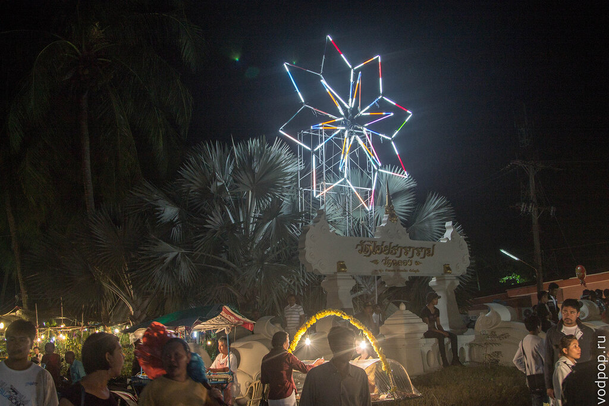

Весь ваш путь сквозь торговые ряды будет сопровождаться громкой музыкой - либо со сцены, либо с прилавков. Надо сказать, что через полгода мы уже узнаем многие песни и у нас появились "любимые" группы. На сцене происходит некая смешная зарисовка - все тайцы смеются, Клим фотографирует..

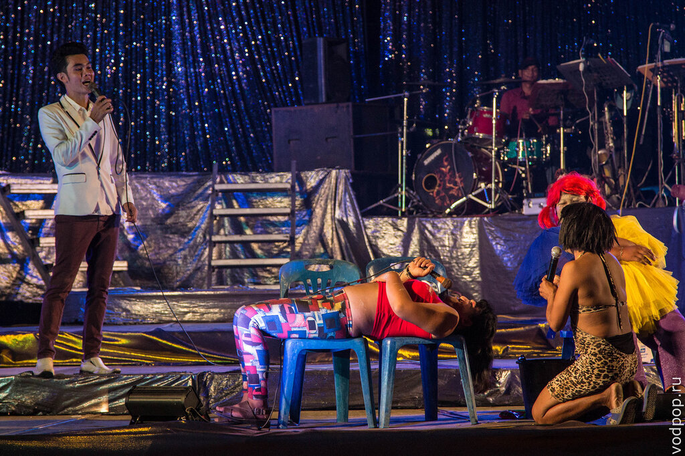

На другой сцене показывают кино - зрители и там, и там сидят на земле.

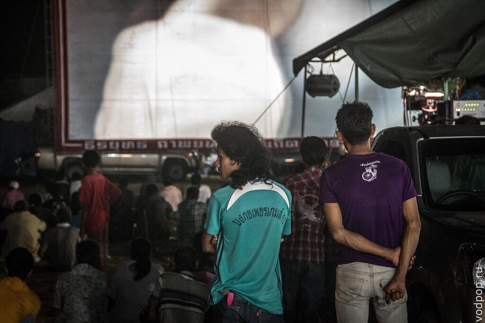Все, что остается после пикника, тайцы оставляют прямо на земле. Мусорку на ярмарке найти очень сложно, поэтому в какой-то момент мы сдались и просто поставили наши пустые пакеты с уже образовавшейся куче.  Нет у тайцев культуры уборки за собой!

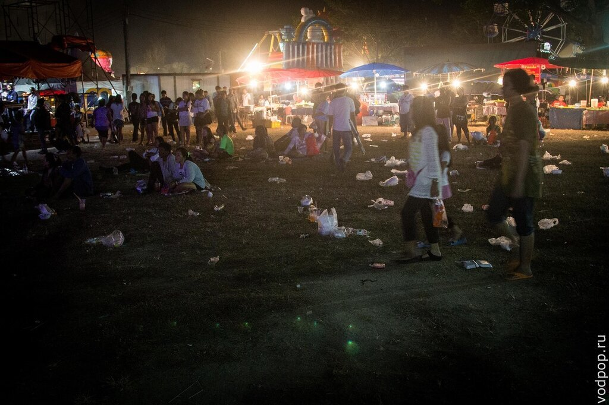

И дело именно в культуре - потому как сами по себе тайцы очень чистоплотны - они каждый день меняют одежду, ежедневно принимают душ. Даже когда вы придете на массаж в любой салон Таиланда, первое, что вам сделают - помоют ноги. А вот с мусором у них как-то не задалось. Хотя после окончания праздника все убирают и опять становится чисто.

Кстати, насчет одежды - ее здесь очень, очень много! За 300 бат можно одеться с ног до головы.

Хорошие подделки очков - по 50-200 бат, футболки - от 20 бат, шорты и юбки - от 30 бат. Множество симпатичных детских вещей (мы не приценивались, но тоже должно быть дешево).

Кстати, несмотря на поздние часы работы ярмарки, которая открывается после заката, все тайцы приходят сюда с детьми. Дети разных возрастов - от грудничков до вполне самостоятельных подростков.

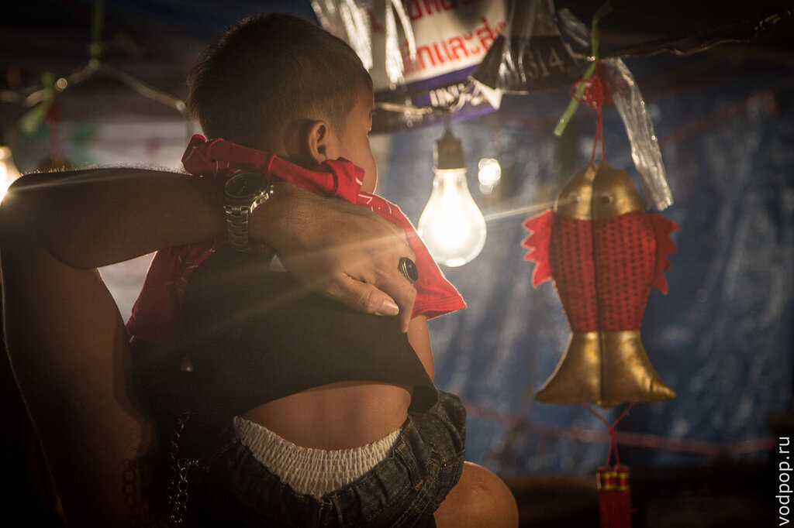

Ярмарка в Ват Чалонг - это праздник для всей семьи. Помимо еды, одежды и живых выступлений на сцене, тут можно найти множество аттракционов: карусели, качели, веселые паровозики, колесо обозрения, стрельбу по мишеням и шарикам, где можно выиграть плюшевую игрушку невероятных размеров. 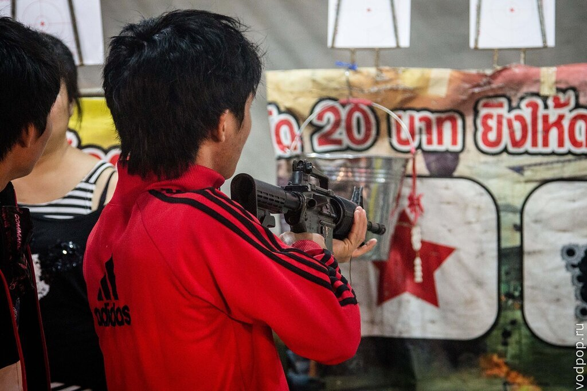

Билет на колесо обозрения высотой в 5 метров максимум стоил 30 бат. Нас катали минут 15, пока мы уже не стали умолять высадить нас на землю.

Еще на рынке мы заказали наш любимый десерт - банановый блинчик с шоколадом. Блинчик по-тайски "рати" - стартовая цена от 15 бат, а дальше растет в зависимости от начинки и ее количества. Наш стоит 45 бат.

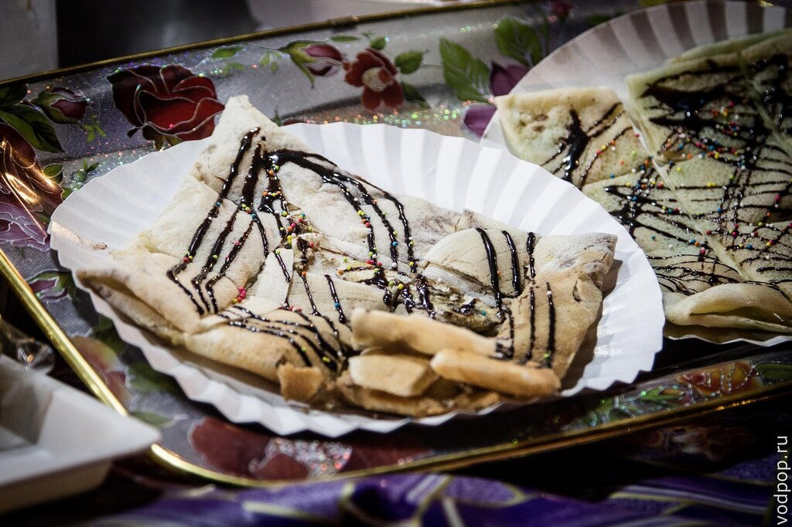

Готовили нам его две симпатичные девушки, которые все время улыбались и радовались, что мы их фотографируем

Самое интересное - это то, как они раскатывают тесто - без скалки, руками растягивая полотно. Хотя потом процесс привычный: на такие же раскаленные чугунные цилиндры, как в блинной в нашем Университете (привет Бауманке!), выкладывается тесто, а потом переворачивается.

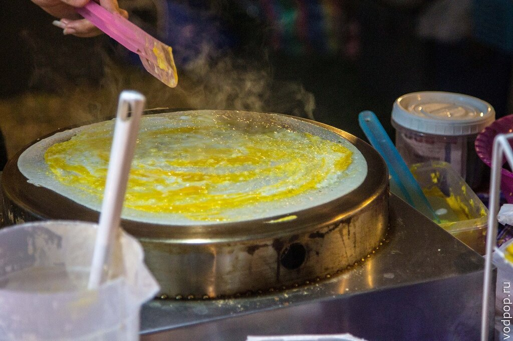

В тесто у них изначально яйцо не добавляется, его за доп.плату размазывают сверху. Потом режут внутрь бананы, складывают конвертиком и поливают шоколадом. Такой десерт каждый день не поешь - он очень калорийный и сытный, поэтому мы всегда берем один на двоих.

Выбор напитков тоже велик - кокосы, тростниковый сок, газировка, пиво, вода в бутылках. На фото растворимая шипучка, похожая на юппи. Вкус приторный до невозможности.

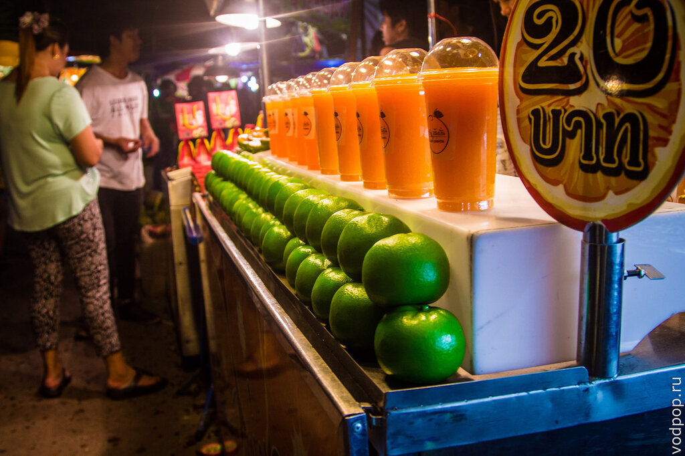

Ежегодная ярмарка в Ват Чалонг на Пхукете - это событие, обязательное к посещению! Это один из лучших способов познакомиться с культурой Таиланда, посмотреть на местное население в неформальной обстановке, понять чем и как живут тайцы - что им нравится, как они отдыхают. Также это уникальная возможность купить необычные сувениры местного производства, попробовать тайские деликатесы, послушать известных исполнителей Таиланда и окунуться в атмосферу праздника!

Если после наших восторженных отзывов вы решите поехать на ярмарку в Ват Чалонг, то полезная информация ниже - для вас.

## Когда проходит ежегодная ярмарка в Ват Чалонг:

- в 2014 году ярмарка проходила с 30 января по 5 февраля - стоит ориентироваться на эти даты и уточнить тур.информации на Пхукете. А лучше всего - спросить местных

## Где проходит ежегодная ярмарка в Ват Чалонг:

- вокруг храма Ват Чалонг. Координаты Ват Чалонг  7.845867 98.338108
- по карте 
    
    <iframe style="border: 0;" src="https://www.google.com/maps/embed?pb=!1m14!1m8!1m3!1d3952.46430287701!2d98.337825!3d7.84637655!3m2!1i1024!2i768!4f13.1!3m3!1m2!1s0x30502fbddaeb8c35%3A0xe39c6a0c63acf8a!2z0JLQsNGCINCn0LDQu9C-0L3Qsw!5e0!3m2!1sru!2s!4v1394631185432" width="800" height="600" frameborder="0"></iframe>
    

## Часы работы ярмарки в Ват Чалонг

- с 19.00 до 01.00. Лучше всего приходить около 22.00-23.00
