Каждый из нас хотя бы раз в жизни слышал про этот великий архитектурный памятник, посвященный богу Вишну. Храм Ангкор Ват - одно из крупнейших в мире культовых сооружений, построенный во время правления Сурьявармана II.

<!--more-->

Храм Ангкор-Ват  в переводе означает "город-храм".  Он окружен рвом, наполненным водой,  и его длина  составляет 3,6 километров, а ширина — 190 метров. В свое время там разводили крокодилов, а сейчас некоторые кхмеры совершенно спокойно освежают себя там после тяжелого рабочего дня.

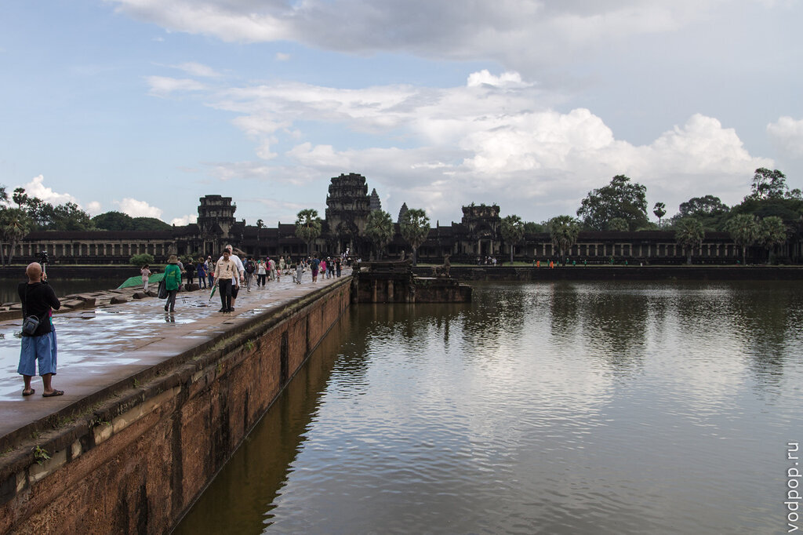

На территории Ангкора наш гид Андрей подвел нас к уменьшенной копии этого уникального архитектурного комплекса.

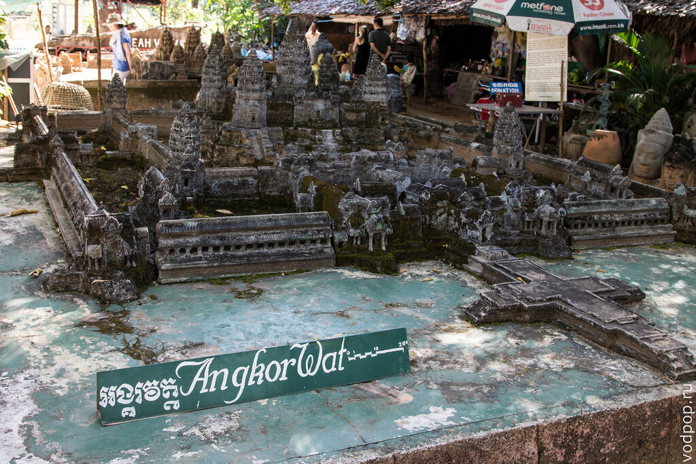

На копии отлично видно, что храм Ангкор-Ват состоит из пяти концентрических прямоугольных башен в форме лотоса (они находятся на центральной платформе храмового комплекса). Центральная башня возвышается над землей на 65 метров, и символизирует мифическую гору Меру, которая является центром всего мира. Кстати, есть одна особенность: путешественник, с какой бы стороны он ни подходил к Ангкору, всегда видит только три башни.

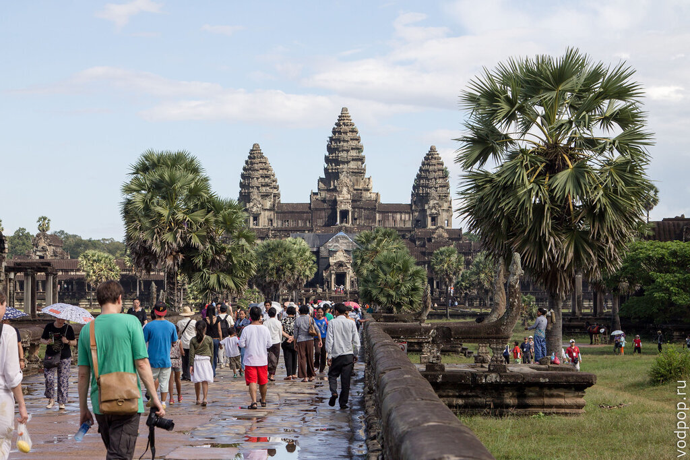

Как [я уже писала](https://vodpop.ru/hramyi-angkora/ "Храмы Ангкора. Загадки Кхмерской Империи"), кхмеры очень религиозны, верят символам, поэтому само собой, храм Ангкор Ват на своих стенах сквозь века сохранил историю мифологии древних кхмеров.

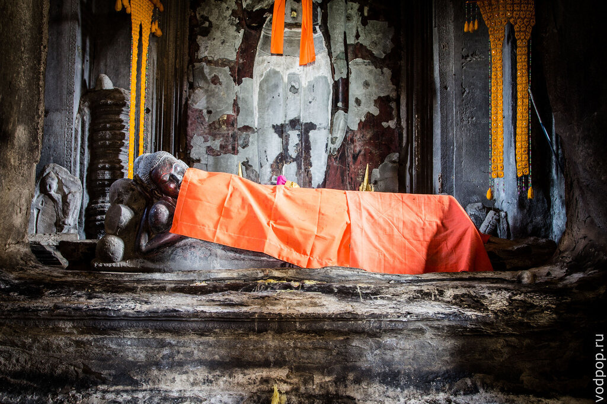

О возникновении Ангкора рассказывает легенда, приведенная в одной из старинных хроник.

_У одного великого государя был сын Преа Кет Меалеа, что означает «божественное сияние». Он был красив и обладал многими другими совершенствами. Бог Индра, восседающий на горе Меру, узнав о великих достоинствах юноши, спустился на землю и пригласил принца к себе. Жилище бога очень понравилось Преа Кет Меалеа, все здесь умиляло и радовало его. Особенно понравился ему дворец, над которым возвышались пять ажурных башен с золотыми верхушками._

_Принц полюбился Индре, и Преа Кет Меалеа жил, наслаждаясь неземной красотой и покоем. Но против него начали роптать тевода — божественные танцовщицы: принц, явившийся из мира людей, был частичкой человечества с его исканиями, тревогами, беспокойством, заботами и соблазнами. Этот дух тревожил и манил небожительниц, смущал их покой. Они сказали Индре: «Отправь принца на землю — с его появлением слишком волнующий нас земной дух появился на небе, не можем мы его больше спокойно переносить». Индра понял их. Ради сохранения спокойствия в своем небесном чертоге он предложил принцу вернуться на землю. Но видя, как трудно принцу расстаться с полюбившимся ему прекрасным дворцом, Индра пообещал построить ему такой же на земле._

_Строительство дворца Индра поручил божественному зодчему Преа Пушнуку, «чья сила и ученость были бесконечны». А место для строительства указал священный бык Нандин. Пушнук собрал мастеров из всех стран и от всех народов. Выкорчевав могучие деревья, выровняв площадку, строители начали возводить сказочный дворец. «Так боги в лице Преа Пушнука возвели Ангкор-Ват», — завершает свой рассказ летописец._

При посещении храма Ангкор Ват на галерее второго уровня вы сможете увидеть  изображения более чем двух тысяч танцовщиц.

[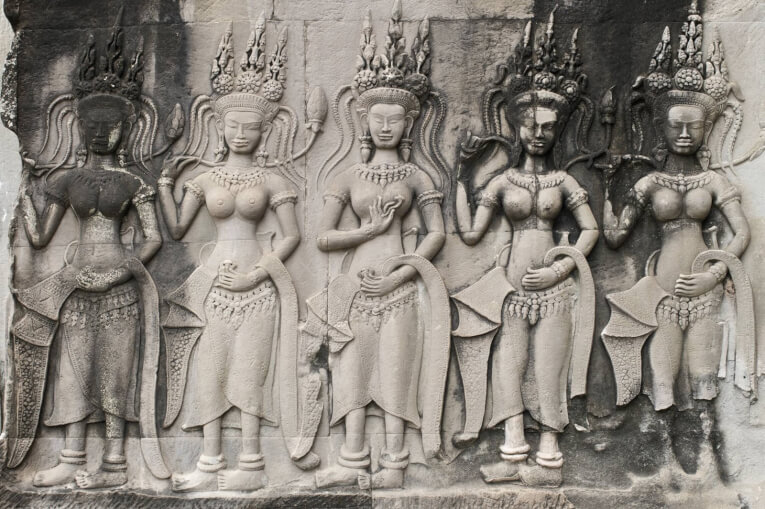](https://vodpop.ru/wp-content/uploads/2014/01/stena.jpg)

Это поражает воображение, особенно, если вы достаточно свежи от впечатлений и еще можете удивляться.

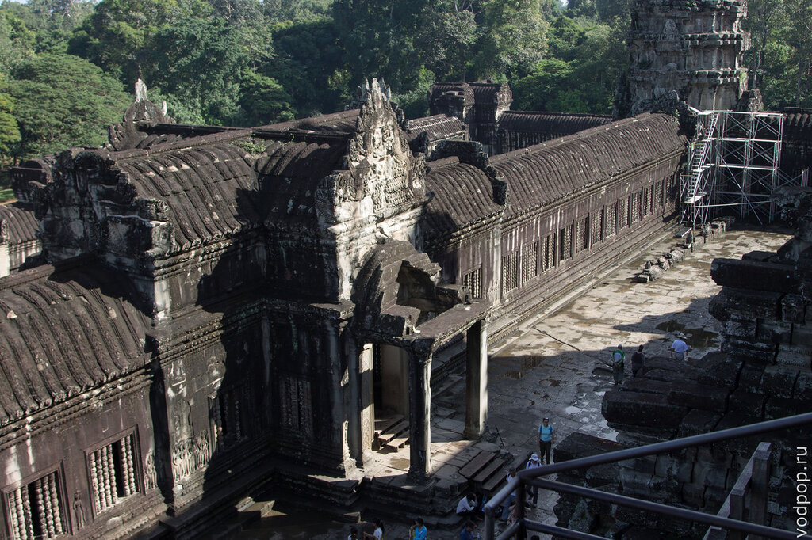У нас храм Ангкор Ват стоял в списке дня на последнем месте. Отчасти это правильно - после этого храма тяжело наслаждаться другими, так как он действительно великолепен. Но силы на тот момент уже кончились, и много интересных моментов мы уже просто не воспринимали.

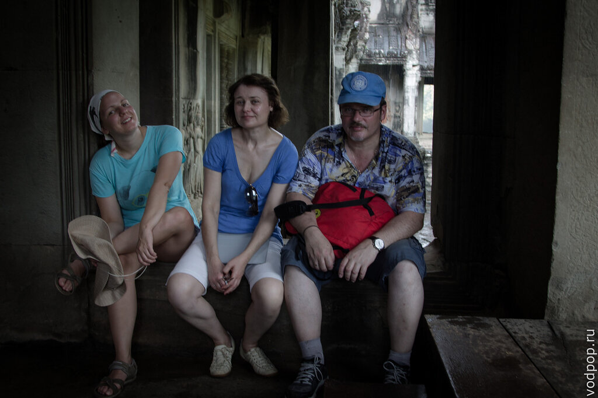

Кстати, есть несколько теорий, объясняющих довольно хорошее состояние храма Ангкор Ват по сравнению с другими.

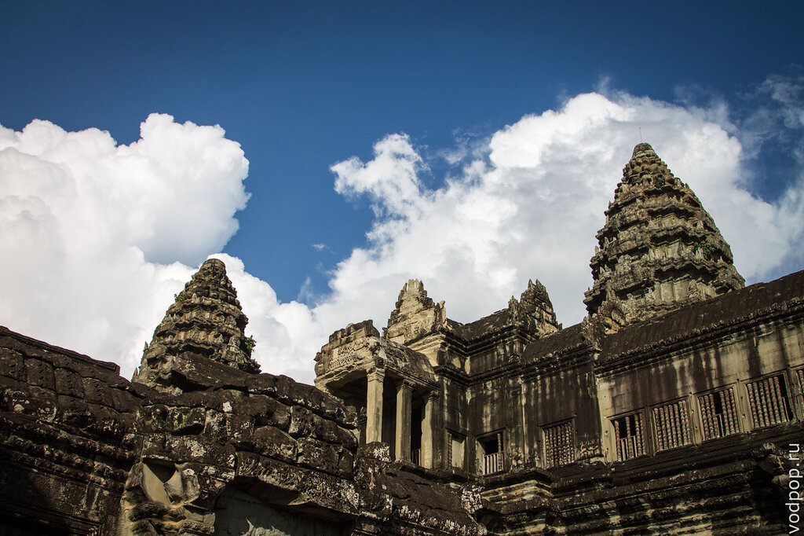

Первое предположение: наличие рва с водой, которые не подпускали джунгли и не давали разрушать камни корневой системой многочисленных деревьев, а в качестве второй версии выдвигается та, что храм Ангкор Ват  был домом для буддистских монахов, которые живут там и по сей день.

На мой взгляд, обе теории правы. А монахи не только живут, но и давно стали своего рода достопримечательностью - они охотно фотографируются, улыбаются и благосклонно принимают из ваших рук подарки. Правда, последнее относится только к мужскому полу - ведь монахам нельзя прикасаться к женщине.

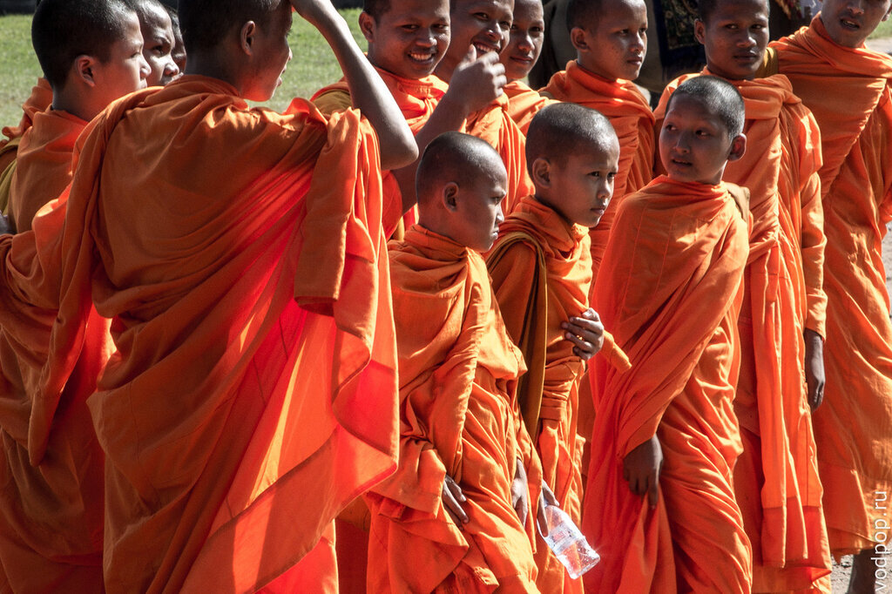

В храме,конечно же, много туристов, но и местное население приходит сюда с детьми - показать культурное наследие предков.

Кстати, вход в храмовый комплекс для кхмеров бесплатный. Туристический билет в Ангкор на 3 дня стоит 80$, что для преобладающего населения Камбоджи равно чуть ли не месячному заработку.

Нравится статья? Узнавайте первым о выходе новых интересных историй! Подпишитесь на нас по [эл. почте](http://feedburner.google.com/fb/a/mailverify?uri=vodpop&loc=ru_RU) или в [группе ВКонтакте](http://vk.com/vodpop)

Интересные виды открываются с башен - можно посмотреть, как бредут случайные прохожие куда-то, или как экскурсионная группа (чаще всего китайская или русская) гуськом бежит за своим гидом. Иногда попадаются и такие одинокие путники, бредущие куда-то под палящим солнцем. Обратите внимание - они тщательно закрывают все тело и голову.

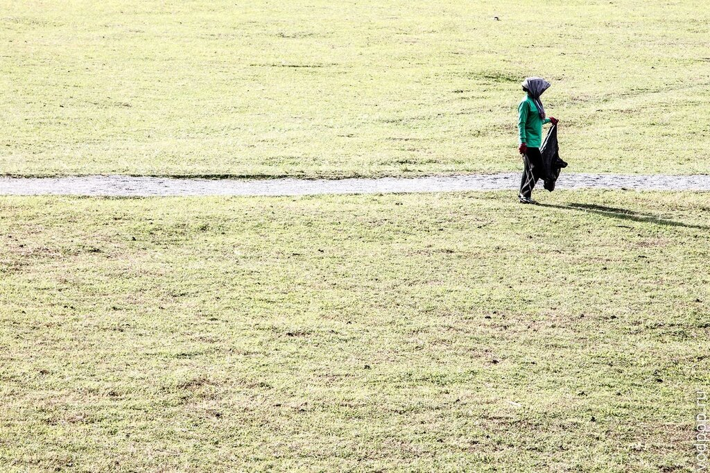

Туристы прячутся от горячих лучей под зонтами.

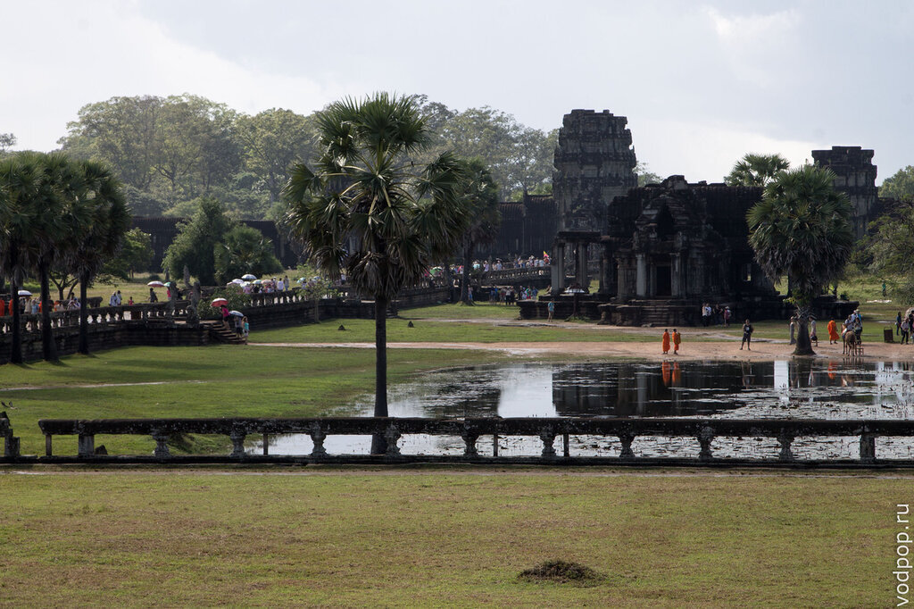

Когда мы в следующий раз соберемся в Камбоджу, мы поедем туда в сезон дождей. И не только потому, что будет меньше людей, а потому, что под дождем Ангкор просто невероятно прекрасен!

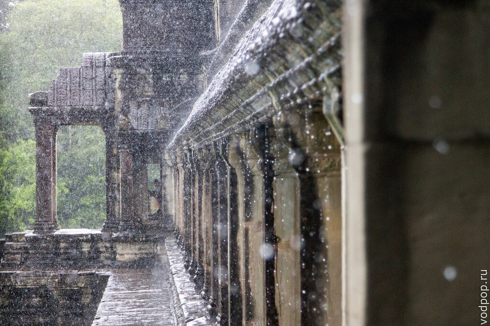

Мы так обрадовались этому дождю, который наконец принес прохладу и свежесть вместо изнуряющей жары.

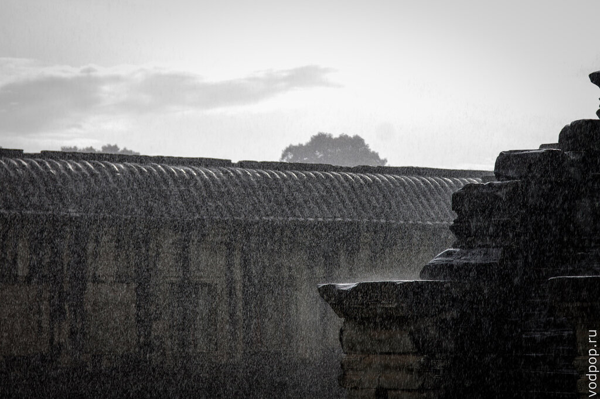

Пока мы вертели с Климом головами и смотрели на всю эту красоту, родители уже успели убежать вперед.

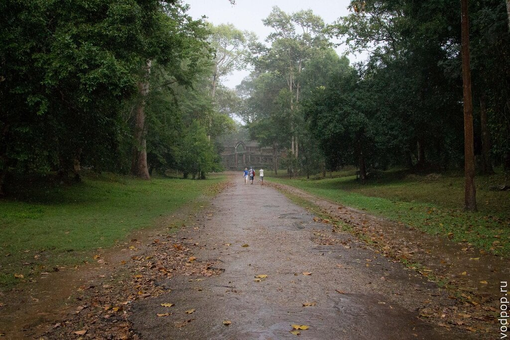

Пейзаж чем-то напоминает осенний. И, кстати, это одна из основных вещей, по которым я скучаю в Азии - здесь совсем нет смены сезонов. Разве что "жарко, сухо" на "жарко, влажно".

Для тех, кто хочет посетить храм Ангкор Ват и увидеть что-то знакомое, советую перед поездкой прочитать древнеиндийские эпосы Рамаяны и Махабхараты: на протяжении нескольких галерей в Ангкор Вате стены украшены искусными орнаментами, на которых герои поражают чудовищ, а боги и богини сливаются в эротических объятиях.

[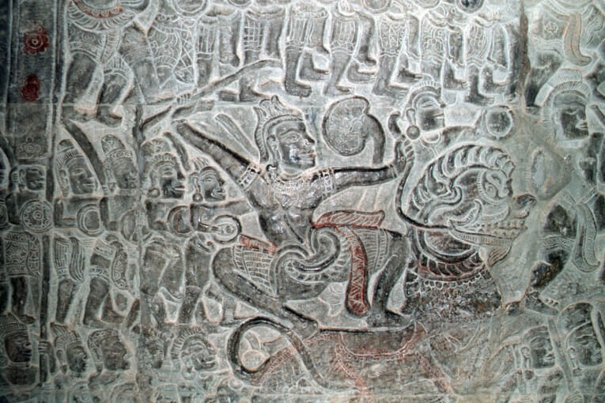](https://vodpop.ru/wp-content/uploads/2014/01/angkor.jpg)

Немного современной истории: в 1973 году, во время начавшейся войны, храм Ангкор-Ват были вынуждены покинуть французские археологи, так как весь храмовый ансамбль превратился в убежище для  «красных кхмеров». До сих пор на стенах храма видны следы от пуль

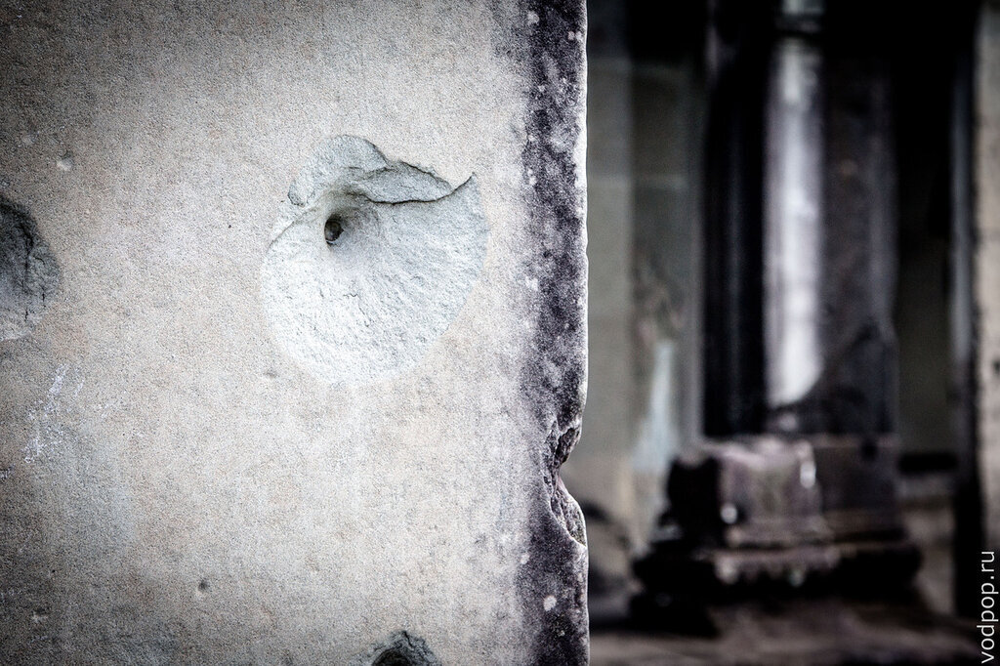

"Красные кхмеры" действовали практически также, как красные  во время революции в России, пытаясь уничтожить "религиозный дурман", и начали они с храмов Ангкора - многочисленные скульптуры и памятники были обезглавлены, изуродованы или уничтожены.

И пусть не сразу, но памятники культуры и великое наследие Кхмерской Империи, будут восстановлены.

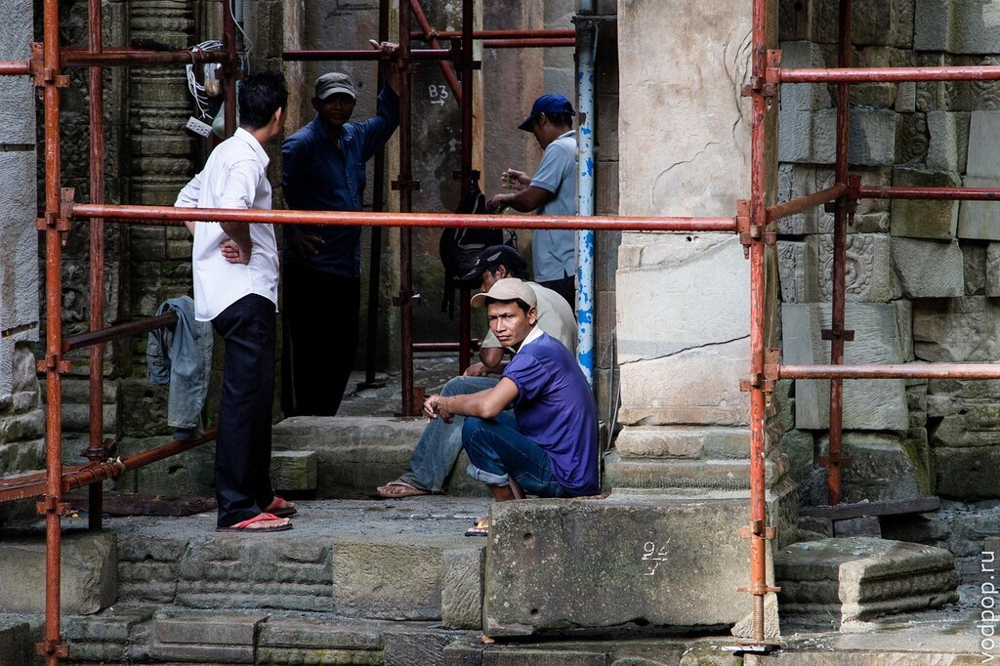

В следующих статьях я напишу о том, как мы посетили знаменитый Пном Кулен, где искупались в водопаде, посетили лежащего Будду и увидели ручей 1000 линг.
