Этот древний храмовый комплекс в Камбодже расположен в двух часах езды от Ангкора. На протяжении всего лишь 20 лет, с 921 по 941 год Кох Кер был столицей Кхмерской Империи. Несмотря на столь короткий срок, этот храмовый комплекс насчитывал около 100 построек. Увы, до наших дней сохранилось всего лишь несколько из них.

<!--more-->

Местность, где был основан древний город, получила название "Остров славы". Дорога до него новенькая, ехать можно довольно быстро.

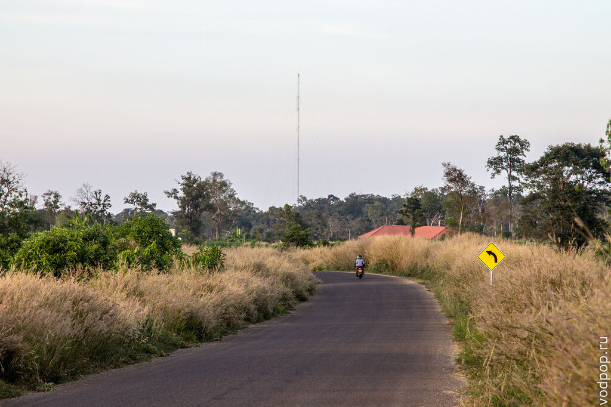

Для туристов Кох Кер открыл свои двери относительно недавно - в 2002 году, так как до этого на территории храмового комплекса велись работы по разминированию. На знаке на двух языках написано, что организацией  CMAC - Cambodian Mine Action Centre, которая располагается в столице Камбоджи - Пномпене, было обезврежено 438 мин и 809 неразорвавшихся боеприпасов.

Впрочем, как сообщает тот же знак, работы продолжаются до сих пор, поэтому лучше гулять по проторенным тропинкам и не заходить в джунгли (хотя иногда очень хочется).

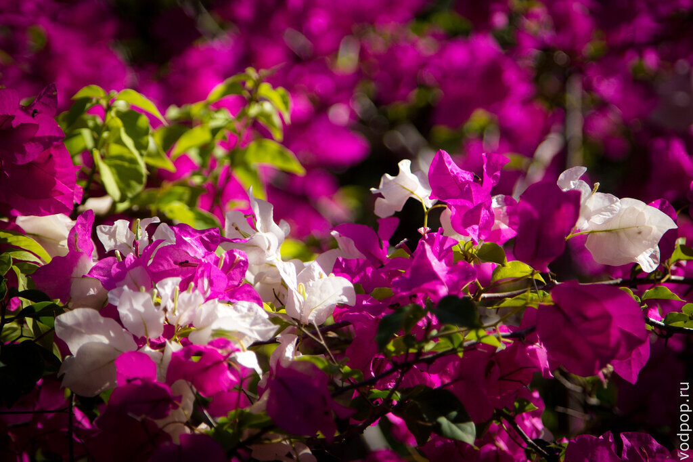

## Прасат Чен

Прасат Чен представляет из себя три святилища, стоящих в ряд. Он был построен в X веке королем Джаяварманом IV. С этим королем связано много легенд, но практически все они сходились в одном - темные силы заключили с ним сделку. Иначе как еще можно объяснить столь быстрое появление такого количества построек на территории Кох Кера всего лишь за 20 лет? Хотя сейчас от былого величия остались только руины, гуляя по ним, не устаешь задавать себе вопрос - как же они в действительности построили такой храмовый комплекс в Камбодже за столь короткий промежуток времени, без использования современных технологий и оборудования?[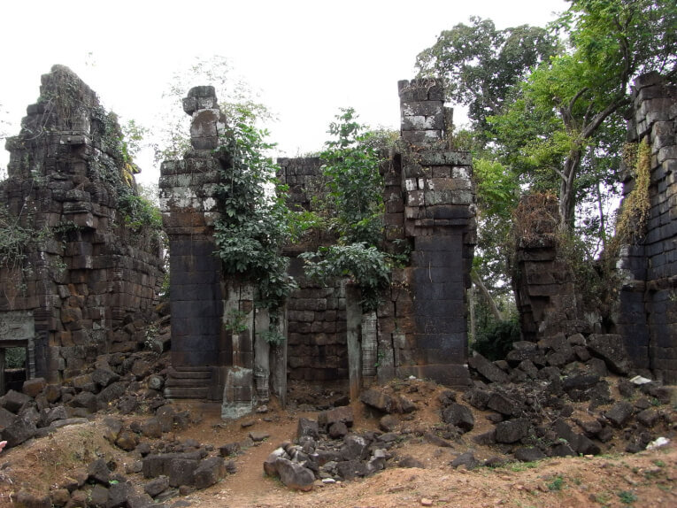](https://vodpop.ru/wp-content/uploads/2014/01/Prasat-CHen.jpg)

Ответа нет до сих пор - историки, инженеры и археологи ломают головы, и большинство признает свое бессилие. Многие технологии строительства того времени утеряны, а их принципы до сих пор не разгаданы.

Однако, несмотря на разрушительные действия природы, гулять по этим местам - одно удовольствие. Тихо, вокруг поют птицы, цикады, редкие туристы или даже местные попадаются на этих развалинах.

## Прасат Тхом и Пранг

Мистическая дымка окружает Прасат Тхом - дворец короля, в центре которого стоит Пранг - пирамида. До наших дней дошли многочисленные рассказы и легенды о временах правления Джаявармана IV: его борьба за власть над Кхмерской Империей сопровождалась беспощадными кровавыми расправами и коварными предательствами. Древние кхмеры верили, что Джаяварман IV связан с темными силами.

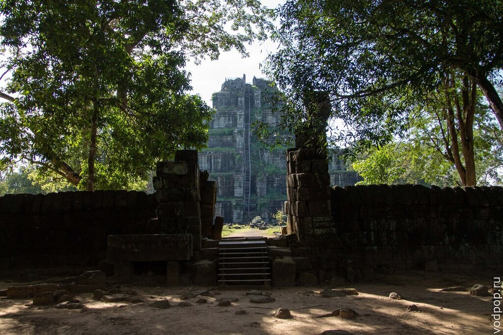

Поверья гласят, что король заключил сделку с врагом Будды - Марой, у которого были ключи от врат в преисподнюю, и именно благодаря дьявольскому вмешательству Джаяварман IV  взошел на престол. Легенда гласит, что Мара потребовал за свою услугу плату, которая состояла вовсе не в предметах роскоши: он потребовал человеческие жизни. Историки также заявляют, что именно в Пранге (пирамиде) проводились кровавые ритуальные церемонии жертвоприношений.

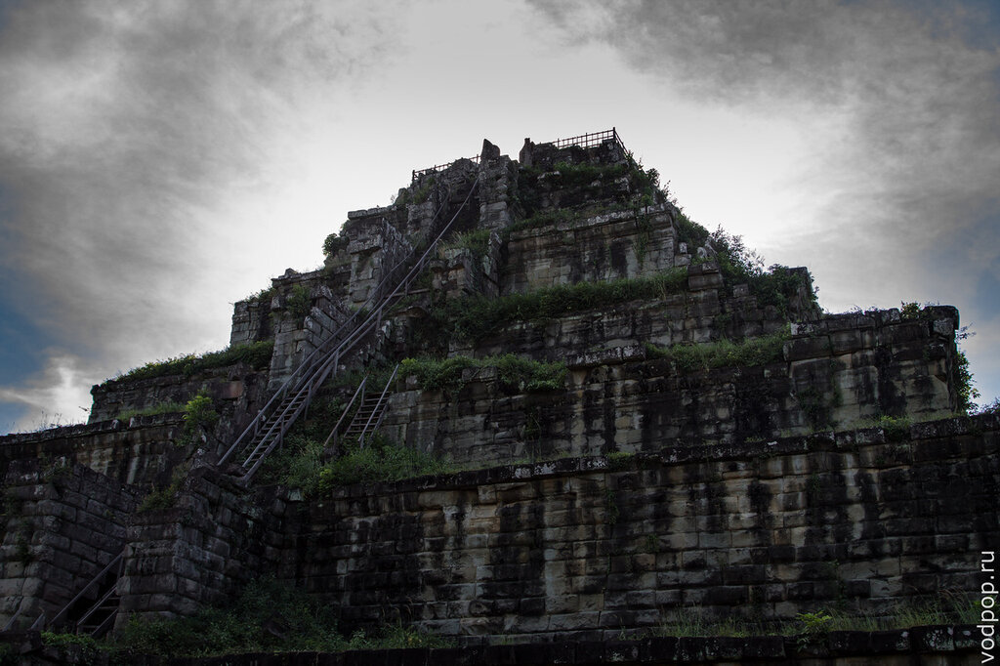

Если присмотреться, то Пранг невероятно напоминает знаменитые пирамиды ацтеков, которые находятся в Мексике. Высота пирамиды составляет 35 метров, она построена из блоков камней, размеры которых настолько точно подходят друг другу, что между ними невозможно просунуть даже денежную купюру. Еще одна необъяснимая загадка Кох Кера.

Наверх ведет каменная лестница, поверх которой построили еще одну - деревянную. Правда, за ее состоянием никто не следит, хотя вход в храм стоит 10$, что явно позволяет положить пару лишних досок. Но, возможно, дело тут не в природной кхмерской лени, а в том, что согласно их легендам это проклятое место. Местные сами отказываются подниматься на вершину пирамиды, так как именно там находится вход в шахту, куда, согласно легенде, сбрасывал своих невинных жертв король Джаяварман IV. Шахта являлась чем-то вроде связующего звена между нашим реальным миром и подземным царством Мары.

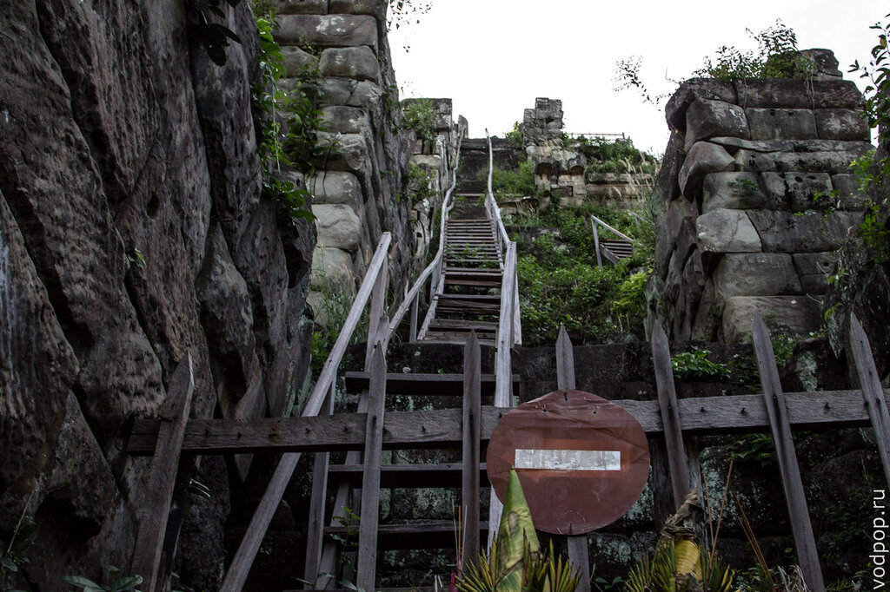

Многие туристы игнорируют этот знак, который повесили вместо того, чтобы восстанавливать лестницу. Мы бы присоединились к их числу, тем более что после таких рассказов хотелось увидеть вход в шахту своими глазами. Но строгие взгляды родителей и экскурсовода заставили отказаться от этой идеи.

Нравится статья? Узнавайте первым о выходе новых интересных историй! Подпишитесь на нас по [эл. почте](http://feedburner.google.com/fb/a/mailverify?uri=vodpop&loc=ru_RU) или в [группе ВКонтакте](http://vk.com/vodpop)

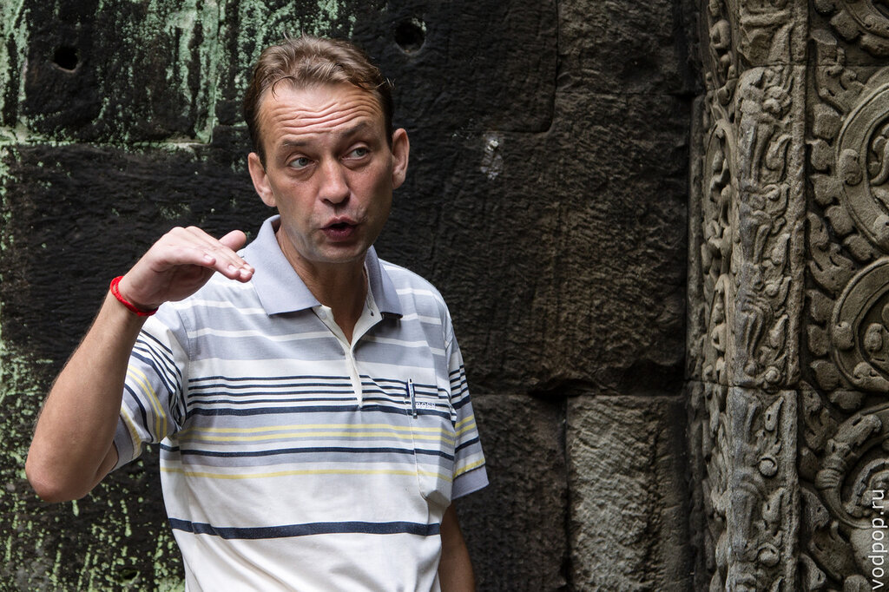

Помимо этого, легенды гласят, что изначально на вершине пирамиды стояла 5-метровая золотая статуя. Когда в 1930 году французская экспедиция обнаружила Прасат Тхом,  никаких следов статуи замечено не было. Для того, чтобы спустить ее на землю потребовались бы современные краны, поэтому первое предположение было такое, что статуя упала в шахту.

Возможно, по этой причине в шахту неоднократно пытались проникнуть археологи и просто интересующиеся люди. В 1997 году местный крестьянин забрался внутрь и нашел слитки золота. Однако, он не стал оставлять их себе, и продав все найденное, принес в жертву богам. Вскоре он потерял рассудок.

В 1998  году  любитель истории (нынче экскурсовод) пытался забраться внутрь, но на глубине 15 метров у него неожиданно перестал работать фонарик. Вспомнив все те дурные слухи, он решил не рисковать, и выбрался наружу. На следующий день в окрестностях Прасат Тхома он встретил тигра. Сочтя это своего рода предупреждением от богов, попытки забраться внутрь он прекратил.

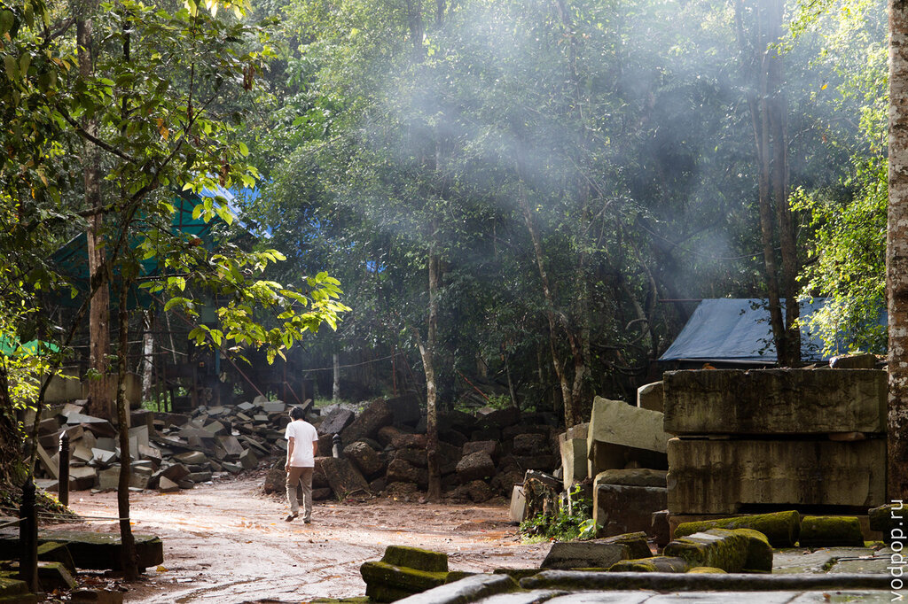

Однако, есть и те, кому повезло меньше - согласно информации, двое европейцев так и не выбрались из шахты. У них порвались все страховочные веревки и достать их тела не удалось.  Также, если верить слухам, то последний раз в 2010 году туда опустились российские диггеры, которые обнаружили, что шахта недавно засыпана. Может, власти Камбоджи обратили свое внимание на таинственные исчезновения, а ,может, опять постарались потусторонние силы - кто знает. Но вход в шахту заколотили.

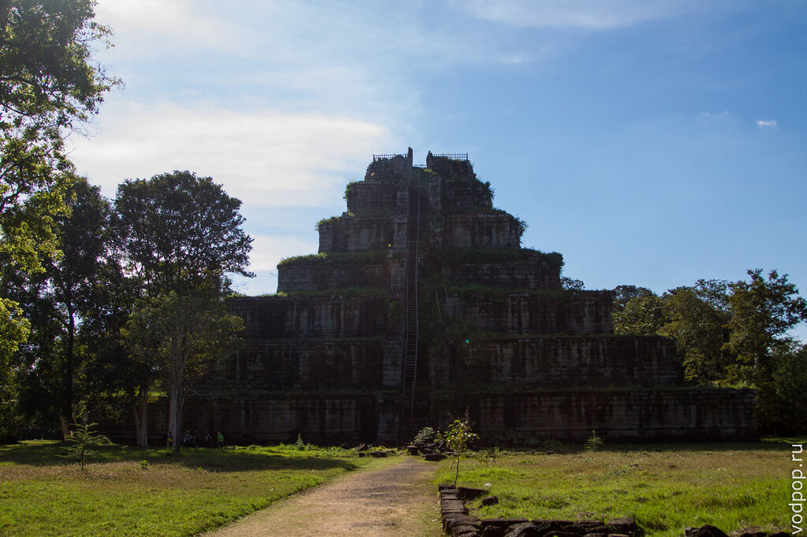

И хотя кхмеры, живущие неподалеку, утверждают, что живности тут не водится (проклятое же место), нам все-таки удалось увидеть одно из них. Пойманная водяная змея, заботливо завернутая в пакет, висела прямо на дереве. Деликатес, однако

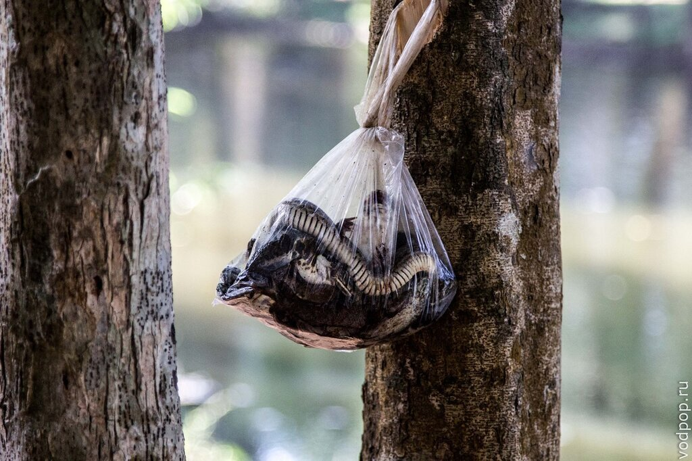

Когда будете гулять вокруг пирамиды, обратите внимание на восточную часть. Согласно легенде, здесь находится могила белого слона - священного в буддизме животного, олицетворяющего королевскую власть. Согласно преданиям, у Белого Слона была красавица-дочь, которую похитил король Камбоджи и провозгласил своей королевой. Несчастный отец Белый Слон отчаянно пытался найти свою дочь, но умер от бессильных попыток. В честь него был построен мавзолей, который в настоящее время скрыт от людских глаз ограждением и табличкой с надписью "не входить".

Кстати, белый слон (он же слон-альбинос) - вполне реальное животное. Правда, кожа у них вовсе не белая, а светло-розовая.

[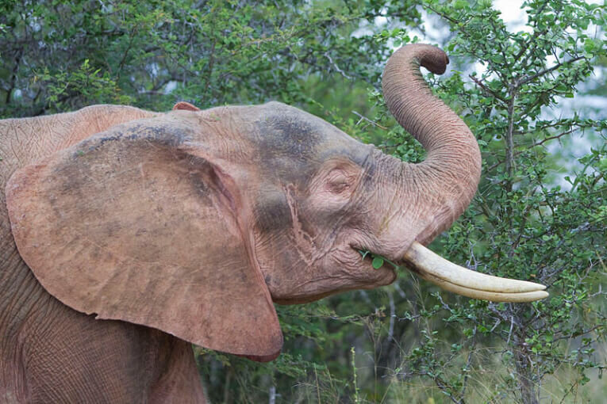](https://vodpop.ru/wp-content/uploads/2014/01/slon.jpg)

## Прасат Линга (он же Прасат Тхноенг)

Прасат Линга - каменное строение, возведенное вокруг огромной [линги](https://vodpop.ru/pnom-kulen/ "Пном Кулен. Храм, водопад и завораживающий ручей 1000 линг") и йони, которые вырезаны из монолитного куска камня. Эту конструкцию, словно Атланты, поддерживали древние стражи - гаруды (полу-гриф, полу-человек) или львы. Сейчас уже трудно сказать, так как уцелели лишь фрагменты строения.

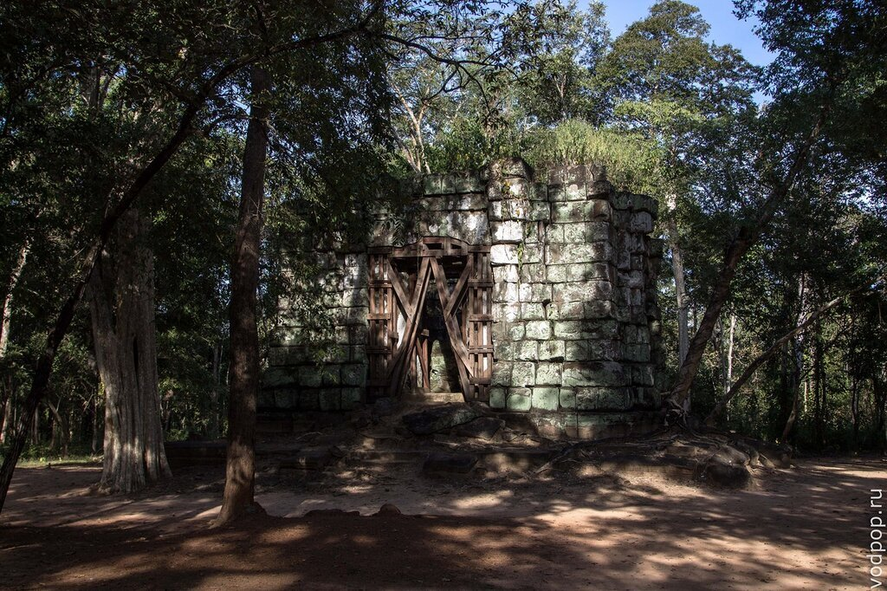

В древнем святилище проводили обряды: брахман (священник) во время ритуала лил воду на лингу, затем вода попадала в йони (желоб) и, вытекая из неё, становилась святой.

[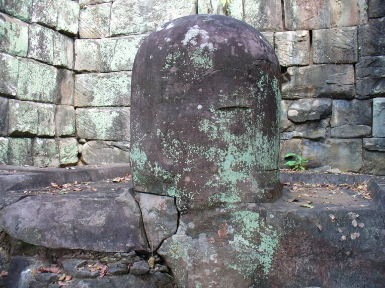](https://vodpop.ru/wp-content/uploads/2014/01/linga.jpg)

Особенность Прасат Линга в том, что йони проходила сквозь северную стену святилища, позволяя жидкости стекать по желобу за пределы здания. Снаружи оставались стоять простые люди - ритуал был скрыт от их глаз, и, должно быть, повергал их в священный трепет.

## Прасат Домрей

В центре Прасат Домрей находится башня, окруженная когда-то четырьмя слонами. Сейчас слонов осталось двое: третий находится в Национальном музее в Пномпене, а четвертый в музее Гимэ в Париже.

[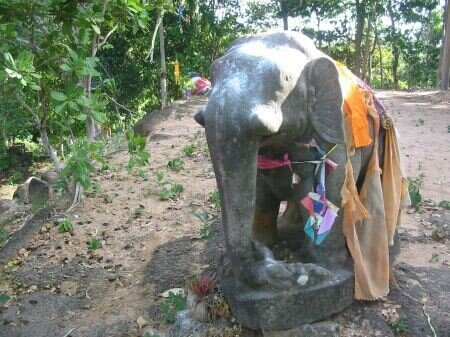](https://vodpop.ru/wp-content/uploads/2014/01/slonik.jpg)

## Прасат Прам

Последний на нашем пути Прасат Прам в общем-то является первым, если вы едете со стороны Сием Рипа. Прасат Прам в переводе с древнего кхмерского языка означает "пять башен".

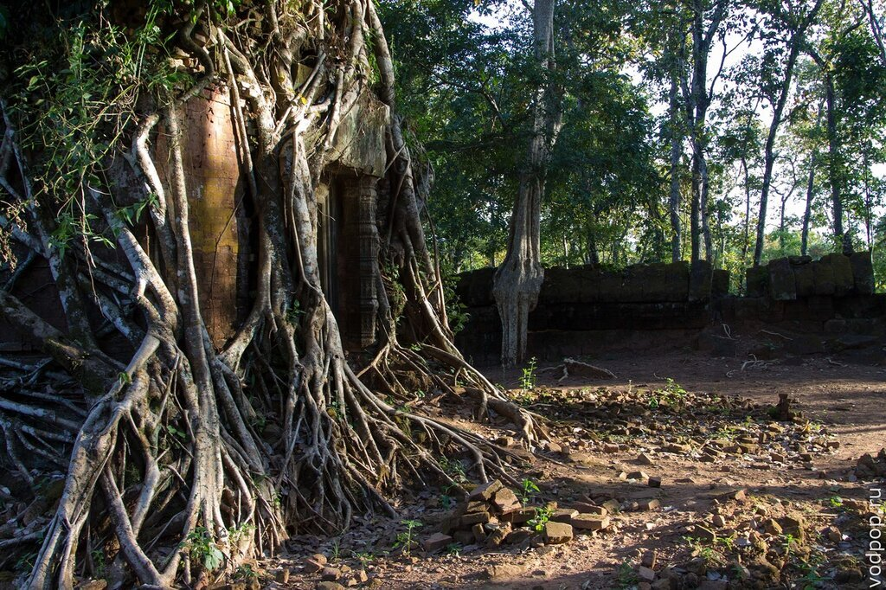

Как ни странно, все башни довольно хорошо сохранились, а корни деревьев, проросшие сквозь древнюю кирпичную кладку, придают этому месту невероятный уют и очарование. Уходить совершенно не хотелось, хотя силы под конец дня были уже на исходе.

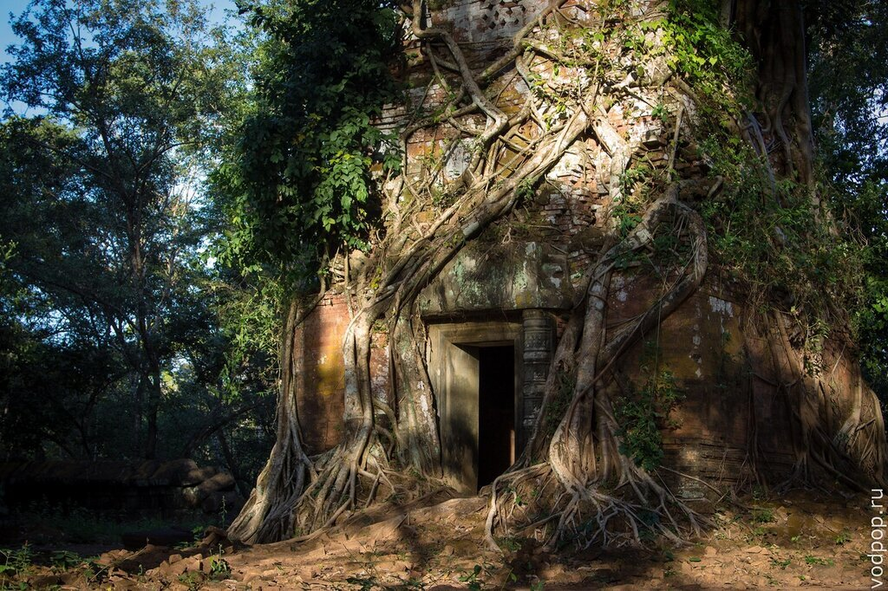

На этом наше волнующее путешествие по храмовому комплексу Кох Кер было завершено. Это был интересный и запоминающийся день, и мы непременно сюда вернемся, чтобы залезть на пирамиду Прасат Тхома, чтобы еще раз прикоснуться к древней истории и легендам Камбоджи.
