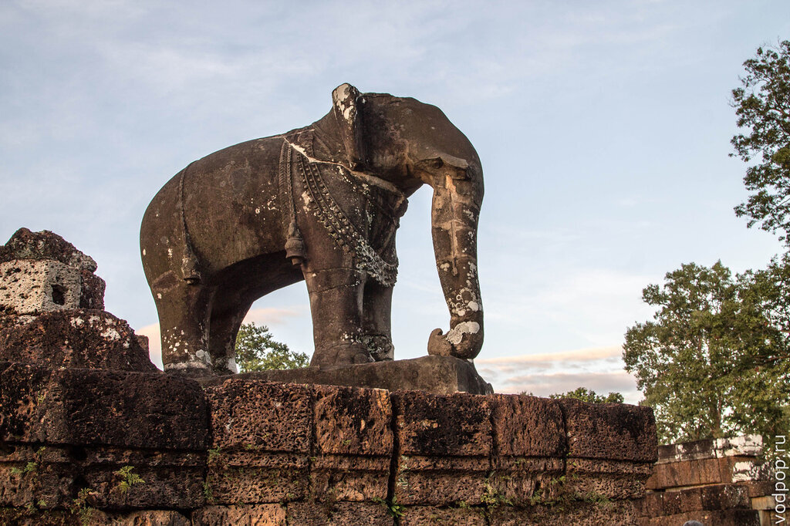
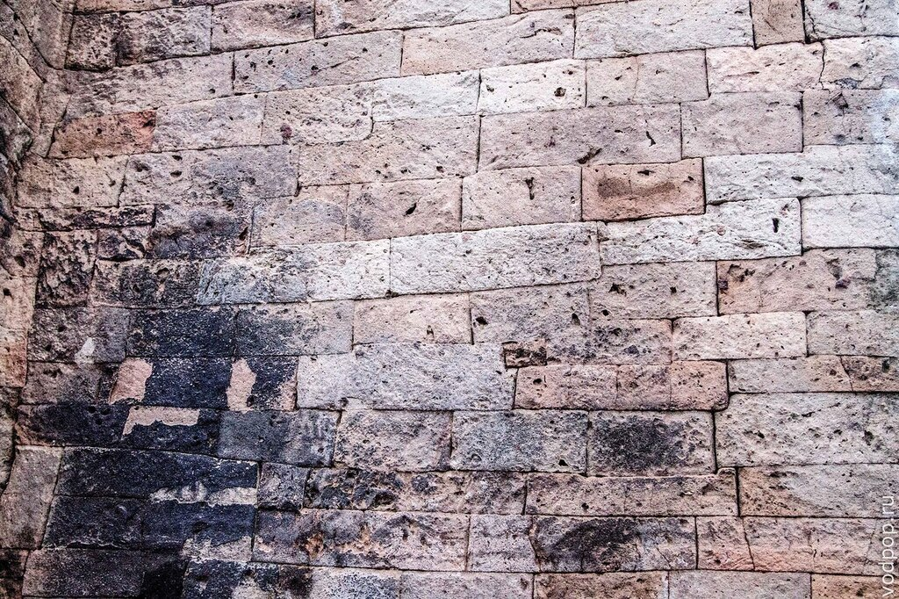
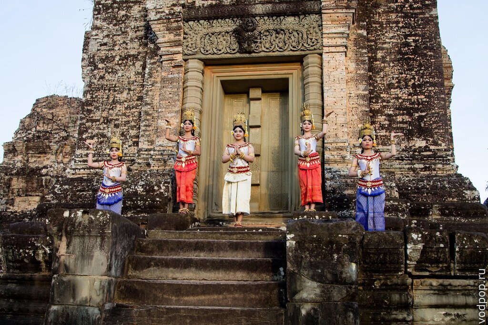
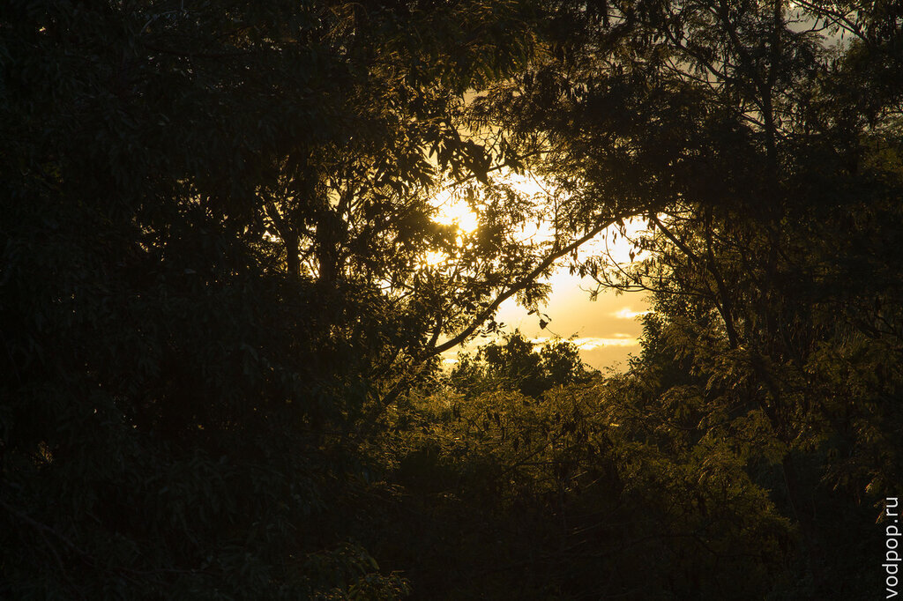
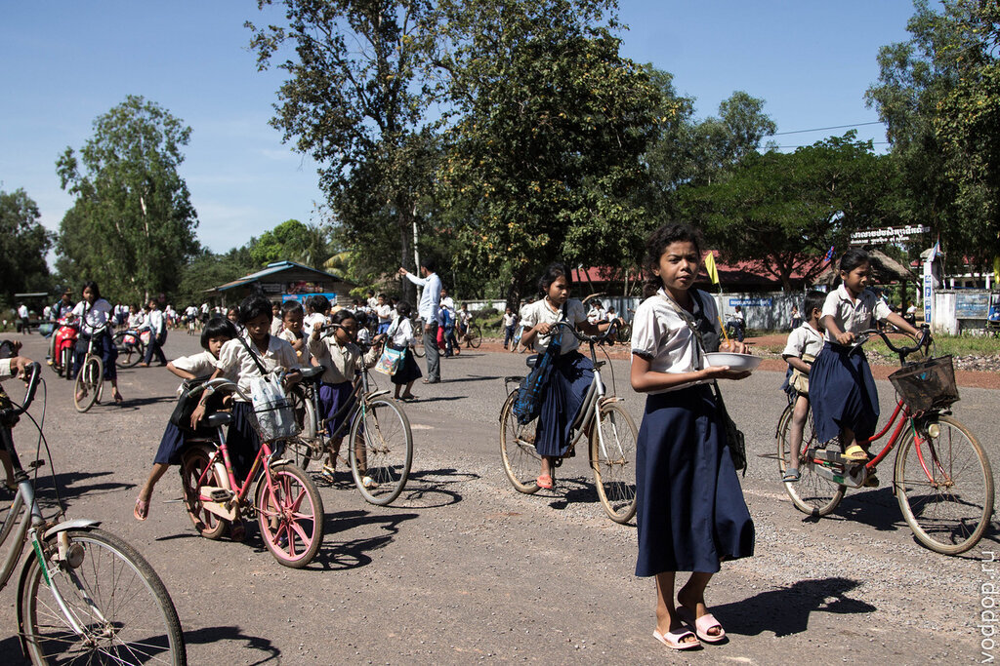
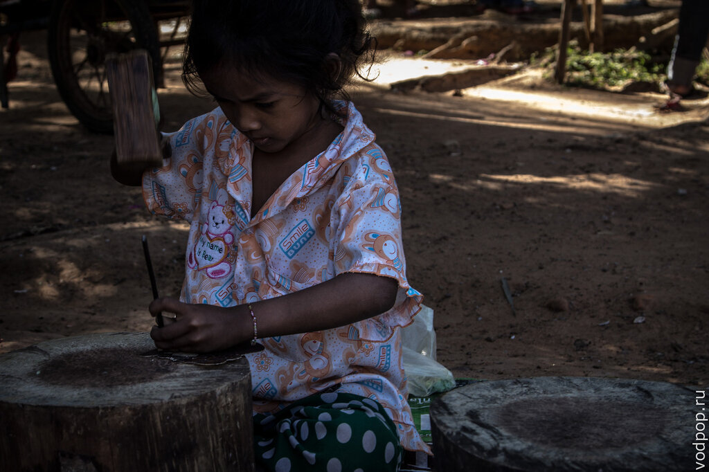
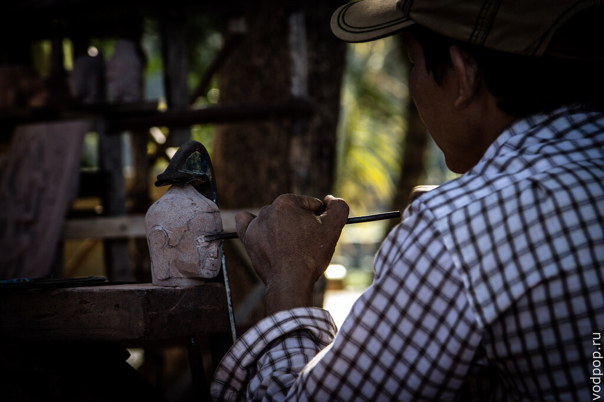
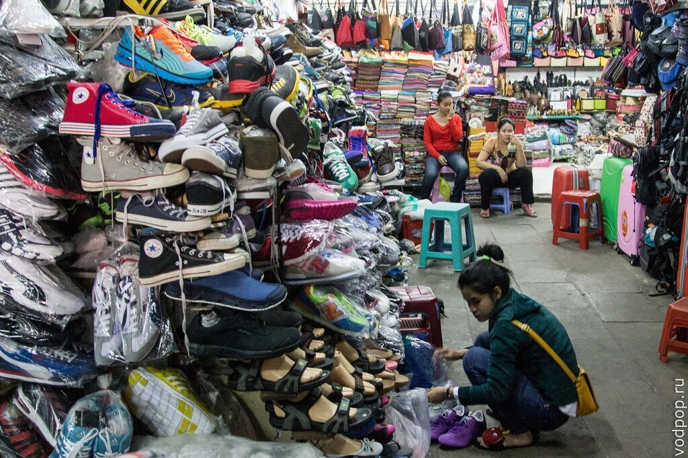
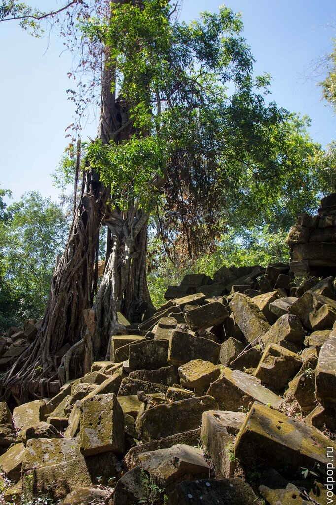
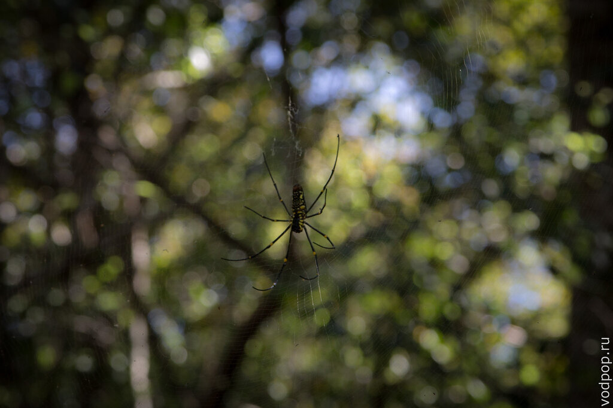

Второй день посещения достопримечательностей Сием Рипа выдался очень насыщенным: мы посетили [Бантей Срей](https://vodpop.ru/bantey-srey/ "Бантей Срей. Женский храм из розового песчаника"), [Пном Кулен и водопад 1000 линг](https://vodpop.ru/pnom-kulen/ "Пном Кулен. Храм, водопад и завораживающий ручей 1000 линг"). Напомню, в первый день мы увидели храмы Ангкора в Камбодже:[Та Пром, Байон](https://vodpop.ru/hramyi-angkora/ "Храмы Ангкора. Загадки Кхмерской Империи") и, конечно же, самый знаменитый храм Камбоджи [Ангкор Ват.](https://vodpop.ru/hram-angkor-vat/ "Храм Ангкор Ват. Восьмое чудо света")

<!--more-->

 

Учитывая, как много всего мы успели посмотреть, много информации, которой делился с нами гид Андрей, прошло мимо меня. Точнее, она запуталась в клубок, который благодаря фотографиям можно распутать и вспомнить, где что было.

## Храм Восточный Мебон

Этот храм был построен в X веке, на гигантском водохранилище Восточный Барай, и добраться до него можно было только по воде. Увы,  во время войны ирригационные сооружения были разрушены: вода пересохла, но прекрасный многоярусный каменный "остров",охраняемый двумя слонами из монолитного камня, стоит по сей день.

Если вспомнить, как долго в Камбодже шли военные действия, можно подумать, что следы на этих древних стенах Восточного Мебона оставили пули. Однако, это не так. Как оказалось, это задумка древних строителей храма, которые таким образом надеялись удержать штукатурку на кирпиче (напомню, Храмы Ангкора в основном строились из песчаника). Увы, их старания были напрасны.

## Храм Пре Руп

Пре Руп, расположенный примерно в 500 метрах на юг от южного берега Восточного Барая, находится, как вы уже догадались, неподалеку от храма Восточный Мебон. Нам повезло, когда мы забрались на последний уровень, там позировали несколько очень красивых девушек в национальных костюмах

Этот храм не зря любят фотографы и художники со всего мира,  так как с верхнего яруса открывается потрясающий вид, особенно на закате.

Не зря храмы Ангкора в Камбодже так популярны..виды, о виды!

Пре Руп стал нашим заключительным храмом второго дня, но на этом мое повествование не заканчивается.

## Храм Бенг Меле

Утром третьего дня, встав пораньше, мы поехали изучать храм, а точнее руины, Бенг Меле. Туда не действуют билеты Ангкора, нужно покупать новые. Пока гид занимался приобретением, из школы по соседству буквально выстрелила толпа детей всех возрастов.

Как рассказал нам гид, во время школьной  перемены на обед многие учащиеся подрабатывают по соседству с храмом, продавая туристам сувениры. А некоторые дети и вовсе не ходят в школу, а с самого раннего детства овладевают ремеслами. Например, эта маленькая девочка делает великолепные рисунки по коже.

Детей в обычной кхмерской семье довольно много - от 4х и больше. Это объясняется тем, что в Камбодже отсутствует государственная пенсия, поэтому семьи стремятся родить как можно больше детей, чтобы хотя бы один из них смог их взять на обеспечение. Довольно практично.

По соседству с юным талантом, уже взрослый мужчина демонстрировал всем желающим процесс превращения куса песчаника (того самого, из которого строили храмы) в произведение искусства.

Нравится статья? Узнавайте первым о выходе новых интересных историй! Подпишитесь на нас по [эл. почте](http://feedburner.google.com/fb/a/mailverify?uri=vodpop&loc=ru_RU) или в [группе ВКонтакте](http://vk.com/vodpop)

Правда, сувениры получаются довольно увесистые, и если планируете привезти домой что-то на память, приезжайте с пустыми чемоданами - соблазн накупить всего по низким ценам в Камбодже крайне высок.

Храм Бенг Меле внутри. Обратите внимание на запутавшиеся лианы - они настолько крепкие, что в некоторых местах даже сделаны природные качели, где особо смелые туристы могут прокатиться над руинами "затерянного мира" - именно такое впечатление оставил у меня Бенг Меле.

Несмотря на солнечную фотографию, большей частью храм находится в тени вековых деревьев. Правда, пытаясь остановить разрушения (хотя куда уж..этим нужно было лет 300 назад заниматься), сейчас деревья начали вырубать, тем самым лишая естественной прохлады уставших и изморенных жарой туристов.

Но туристам стоит остерегаться не только палящего солнца, но и живности, которой тут на удивление много. Кроме привычных нам кошек и собак, вы можете встретиться в храме со змеей, жучком или паучком.

В следующих статьях ждите подробный отчет о храмовом комплексе Ко Кер, его многочисленных прасатах и чарующего вида закатов. А пока все!
