Наше совместное путешествие с родителями Климентия началось недалеко от границы Таиланда и Камбоджи, и в первый же день мы поехали в Сием Рип, чтобы поближе познакомиться с историей Камбоджи и увидеть храмы Ангкора своими глазами.

<!--more-->

Камбоджа традиционно считается дешевой страной для отдыха, однако, если вы хотите обеспечить себе европейский уровень комфорта, то придется платить "туристическую" цену.

В этой поездке мы себе ни в чем не отказывали - жили в дорогих гостиницах, питались исключительно в ресторанах и кафе.  Цены отличаются довольно сильно - в уличном кафе для местных можно поужинать за 1 доллар, в то время как в ресторане блюдо будет стоить около 3-5 долларов (что все равно намного дешевле, чем в России и Европе).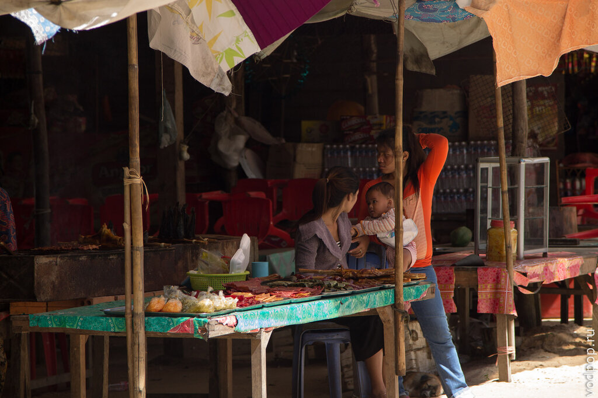

С гостиницами примерно та же тенденция - самый дешевый бекпекерский хостел будет стоить около 100-200 рублей, где за эту сумму вам предложат одно койко-место +общий туалет и душ. А в гостинице за 1000-2000 рублей вы будете жить в королевских условиях, с собственной ванной, несколькими бассейнами на территории и вышколенным персоналом.

Пока с вводной информацией про Камбоджу закончим, и перейдем к самому интересному. Итак, храмы Ангкора.

Ангкор - это древняя столица Кхмерской империи, которая была потеряна и забыта в джунглях на целых четыре столетия. В 1861 году французский натуралист Анри Муо заново открыл всему миру храмы Ангкора.

Ангкор расположен на берегу озера Тонлесап  и занимает огромную площадь - в длину 24 км, в ширину 8 км. Поэтому всем, кому предлагают посмотреть храмы Ангкора за 1-2 дня, должны крепко задуматься, а лучше спросить в туристической компании, какие именно храмы они увидят за это время.

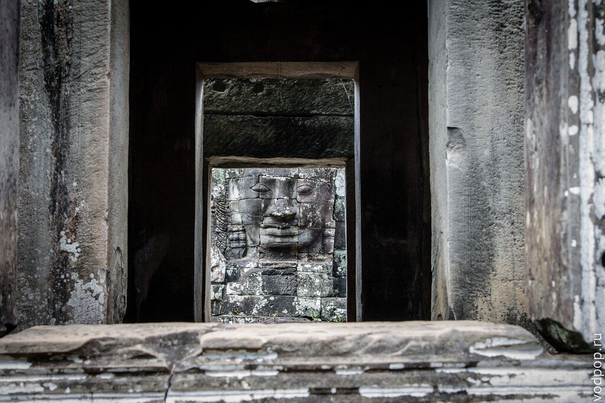

Само собой, все храмы за разумный промежуток времени посмотреть невозможно, да и не за чем - по-настоящему интересных для поверхностного осмотра храмов Ангкора не так уж много.

Однако, для любителей и ценителей древней истории, легенд и кхмерской архитектуры в Ангкоре открываются просто безграничные возможности для изучения - по нашим впечатлениям, здесь можно гулять месяцы и ни разу не зайти два раза в один и тот же храм.

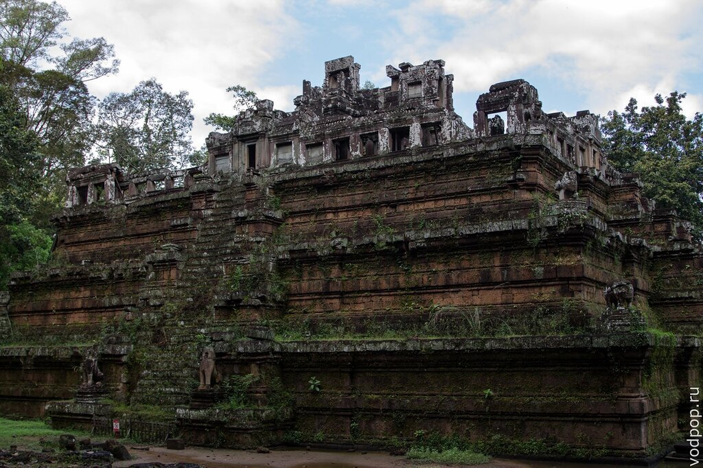

#### Храм Та Пром

Храм Та Пром (в Википедии почему-то Та Прум) благодаря фильму "Лара Крофт. Расхитительница гробниц" , вышедшему в прокат в 2001 году, стал один из самых известных храмов Камбоджи. Теперь сотни и сотни туристов стали приезжать, чтобы увидеть своими глазами, где же снималась звезда Голливуда Анжелина Джоли.

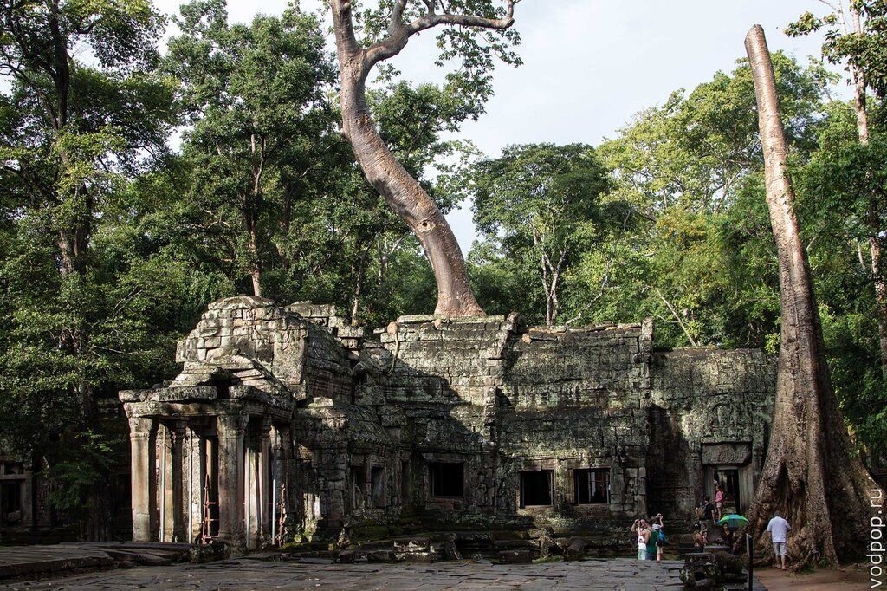

Храм был построен королем Джайяварманом VII в память о своей матери, и в данный момент находится на реставрации. Учитывая крайнюю неспешность и расслабленность всех кхмеров, стройка затянется ни на одно десятилетие.

А пока можно ходить по территории Та Пром, любоваться таинственными очертаниями сплетения камня и дерева.

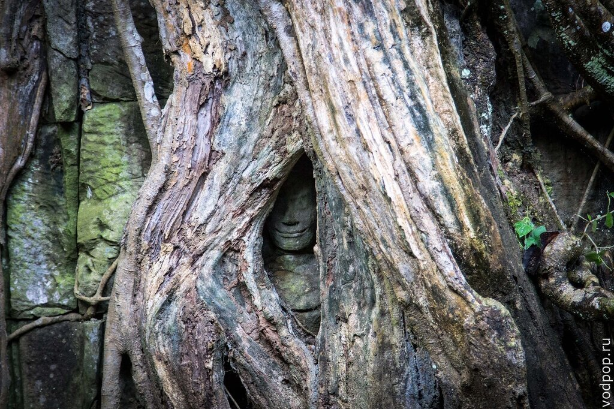

В Та Пром приятно и легко гулять - изнуряющая жара не проникает сквозь кроны древних деревьев, которые кроме этого еще и придают этому месту атмосферу таинственности и загадочности.

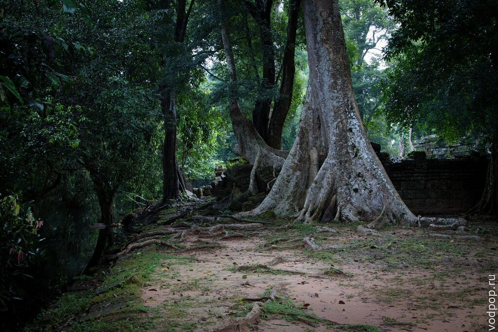

Небольшой прудик

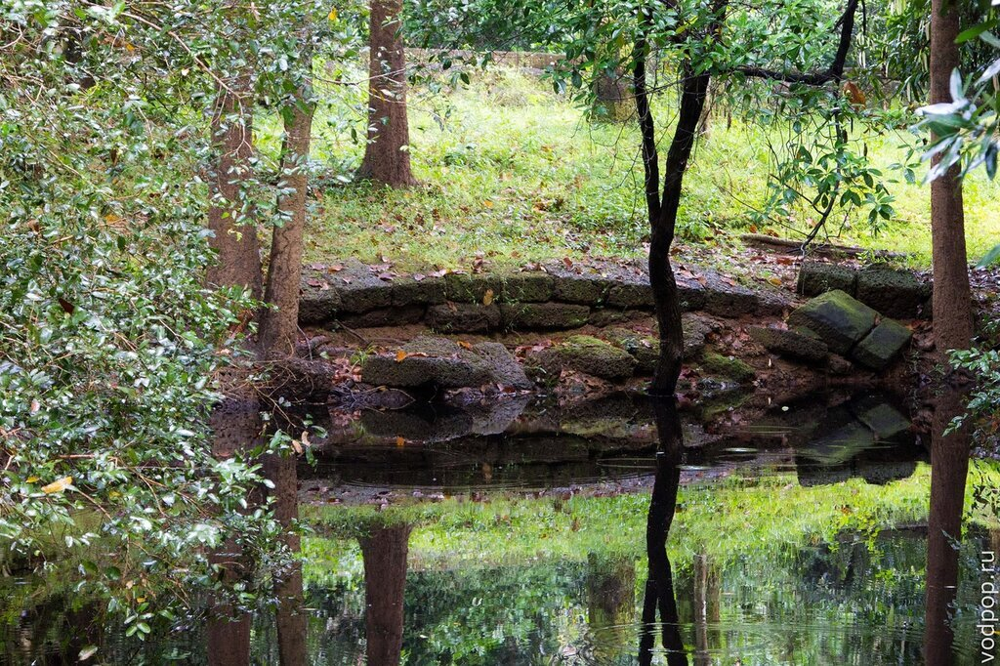

#### Та Кео (Храм - Гора)

Та Кео был построен при короле Джаявармане V и посвящен богу Шиве. Отличительная черта этого храма Ангкора в том,что в нем почти нет росписей.

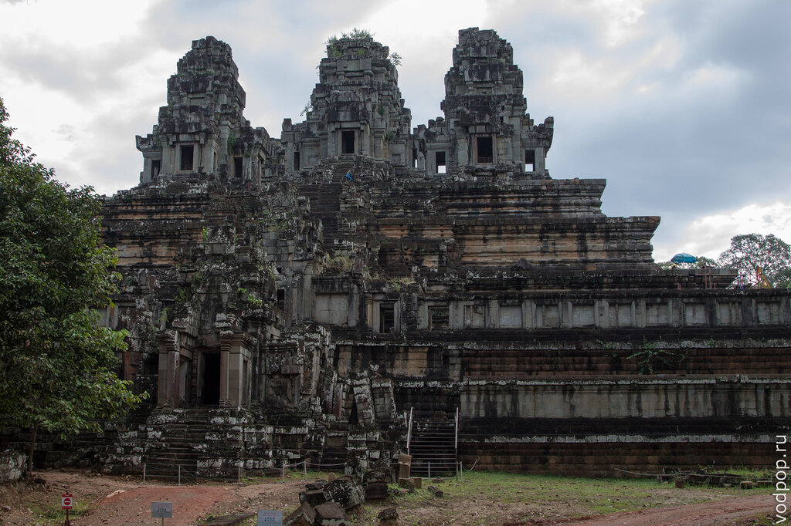

До сих пор ученые гадают, почему это произошло. Среди версией есть следующая: преемники Джаявармана V намеренно отказались закончить храм,чтобы не принимать на себя славу строителей храма. Есть и более прозаичная - пришедший правитель был более заинтересован в строительстве своих собственных задумок, а не завершении дел предшественника.

Зато на примере именно Та Кео особенно заметно, что храмы Ангкора построены без применения цемента и каких-либо других связующих материалов: каменные блоки в них сцепляются по принципу замка.

#### Тхамманон

Тхамманон является одним из пары индуистских храмов на территории храмов Ангкора. Он построен в конце 11-го века во время правления СурьяварманаII

[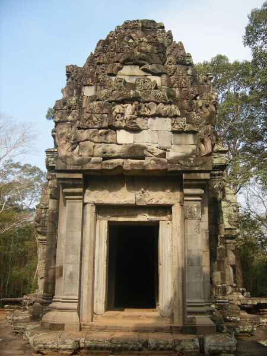](https://vodpop.ru/wp-content/uploads/2014/01/Thammanon.jpg)

####  Ангкор Тхом

Ангкор Тхом – это комплекс храмов и  ритуальных сооружений, окруженный рвом. Если посмотреть снимок из космоса, то можно увидеть, что комплекс образует правильный квадрат площадью свыше 9 квадратных километров. На территорию Ангкор Тхома ведут 5 ворот. На фото изображена верхняя часть южных ворот.

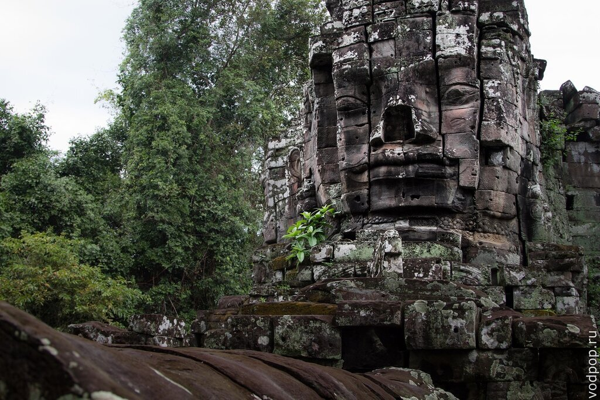

Кхемы очень суеверны, у них множество поверий, и они крайне религиозны - по крайней мере, такое впечатление сложилось у нас после просмотра множества храмов Ангора. В каждой росписи на стене, камне, дереве, кхемы видят некий секретный смысл, который вот уже несколько столетий расшифровывают ученые по всему миру. Например, ворота. Безусловно, сейчас ворота идентифицируют по географическому положению - южные, северные и т.п. Однако, есть и менее официальные названия - например, ворота призраков.

## Терраса прокаженного короля

Джаяварман VII - первый король-буддист, при котором Кхмерская Империя достигла пика своего развития.  Во время его правления буддизм заменил брахманизм и стал официальной государственной религией.

Терраса прокаженного короля исполняла роль крематория: умершего сжигали именно на этой террасе. Почему же терраса носит такое название? По одной версии король Джаяварман VII  страдал от этой хвори, по другой – Терраса прокаженного короля так названа из-за того, что скульптура, изображающая этого короля, изъеденная временем, лишайниками и мхом, напомнила первооткрывателям о людях, больных проказой.

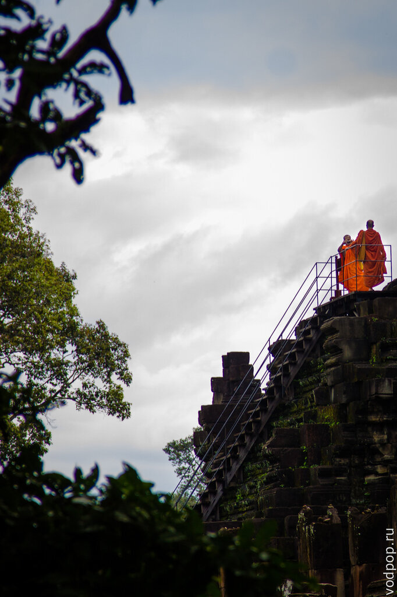

## Терраса слонов

Терраса слонов использовалась для демонстрации величия  власти: здесь проходили парады, праздники - словом, все дворцовые церемонии. Терраса украшена всевозможной каменной резьбой: тут и мистические человеко-птицы Гаруды из индийской мифологии и львы, размером с взрослого человека, сцены битв и войн, пятиголовый конь и,конечно же, слоны - символы королевской власти.

Нравится статья? Узнавайте первым о выходе новых интересных историй! Подпишитесь на нас по [эл. почте](http://feedburner.google.com/fb/a/mailverify?uri=vodpop&loc=ru_RU) или в [группе ВКонтакте](http://vk.com/vodpop)

Когда-то все это было признаком баснословного богатства и символом высокого положения в обществе. Сейчас от былого могущества остались лишь руины, притягивающие внимание многочисленных туристов.

[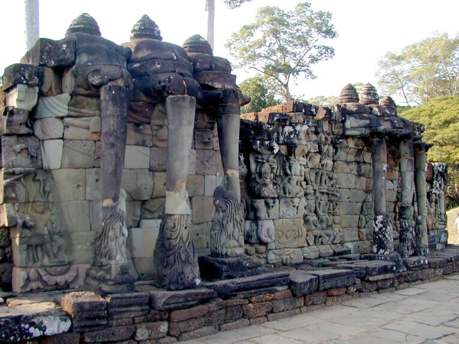](https://vodpop.ru/wp-content/uploads/2014/01/slonyi.jpg)

Когда смотришь на что-то подобное, в голове сразу всплывают ушедшие в небытие могущественные древние империи - Египетская, Персидская, Римская, а затем и Византийская - история слияний и поглощений, кровопролитных войн - от всего этого сейчас осталось всего лишь несколько памятников архитектуры и свитки папируса. Современная Камбоджа, увы, не может похвастаться высоким уровнем развития - такое ощущение, что страна застряла в далеком прошлом: никаких существенных источников дохода, кроме туризма и сельского хозяйства, у Камбоджи нет.

## Пхимеанакас

Еще один храм Ангкора, который в буквальном переводе с кхмерского означает "небесный дворец". Считается, что храм построен в конце X века в правление Раджендравармана II , а затем перестроен Сурьяварманом II - но уже как индуистский храм.

##  Байон

Этот храмовый комплекс в центре Ангкор-Тхома построен в честь короля Джаявармана VII.  Он совершенно справедливо соперничает по популярности с Ангор Ват, и является самым загадочным и мистическим строением всего огромного Ангкора. Как это всё может стоять без единой капли цемента или любого другого связывающего материала, учёные до сих пор ответить не могут, а главное не могут восстановить Байон, теми же методами, которыми он возводился.

В следующих статьях будут интересные факты о самом главном храме Ангкора - Ангкор Вате, а также рассказ про не менее интересные памятники кхмерской культуру. Не забывайте заходить к нам в группу [в контакте](https://vk.com/vodpop) и оставлять комментарии!
