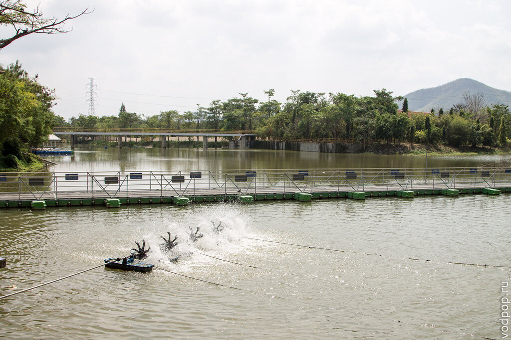
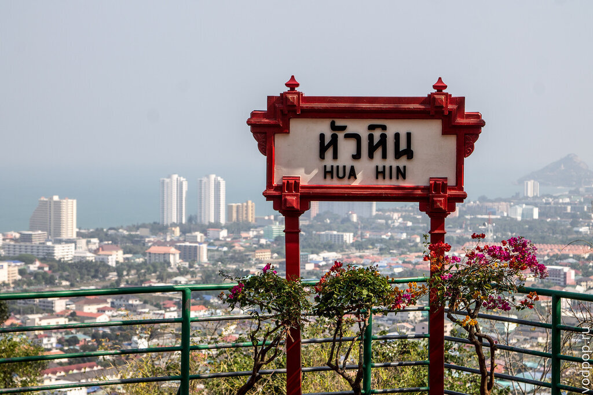
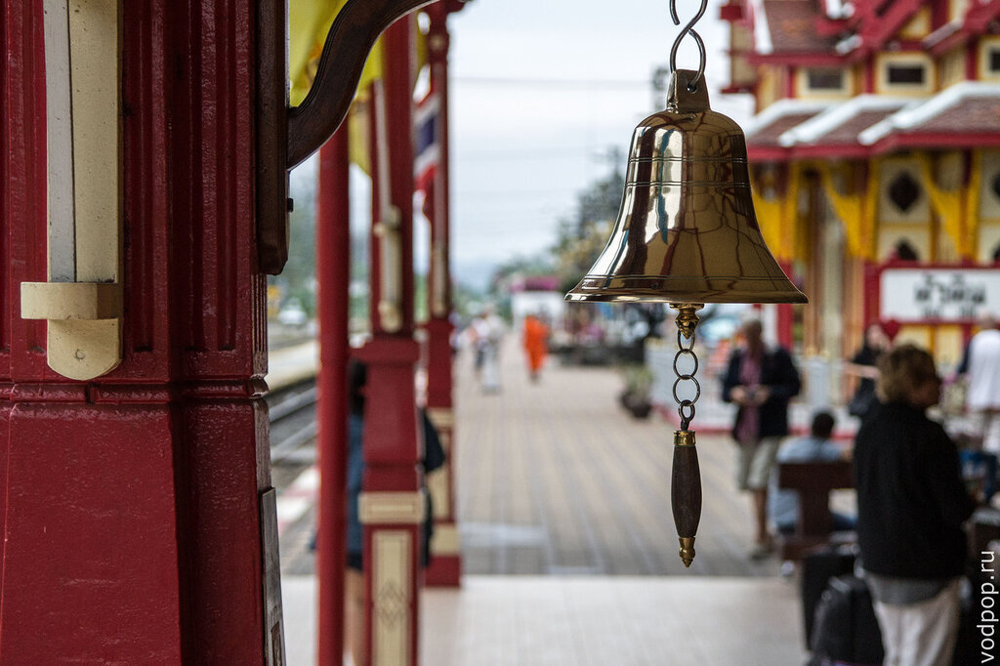
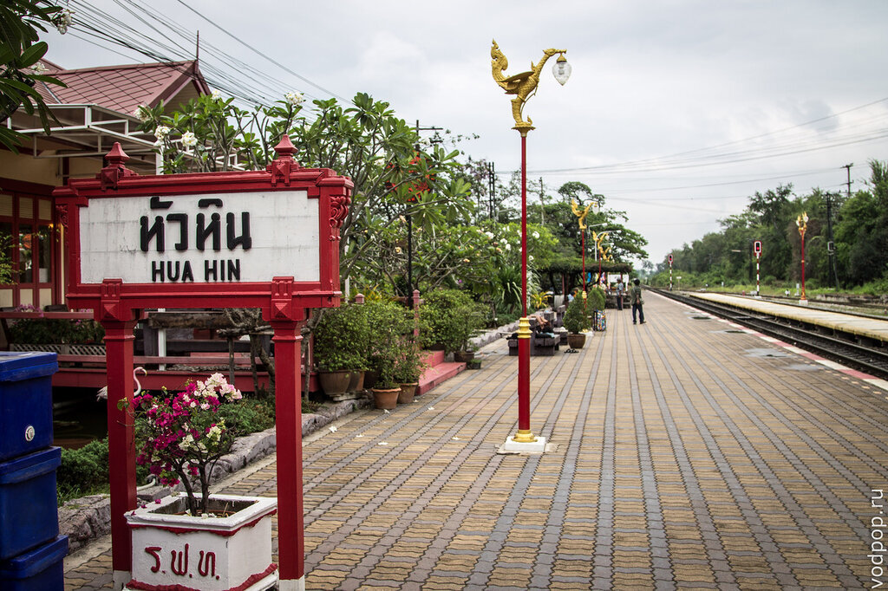
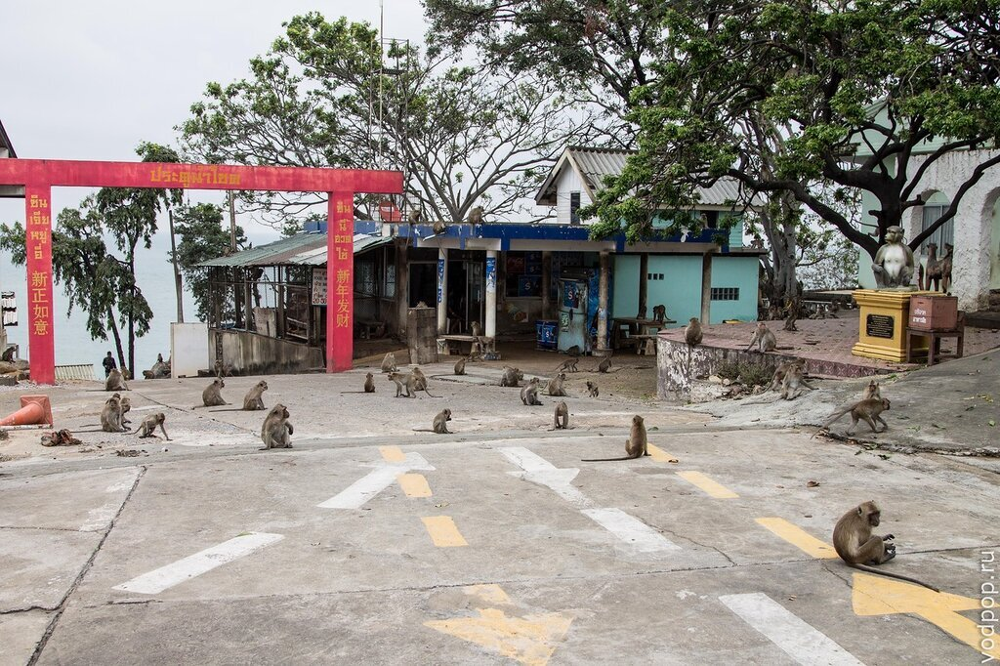
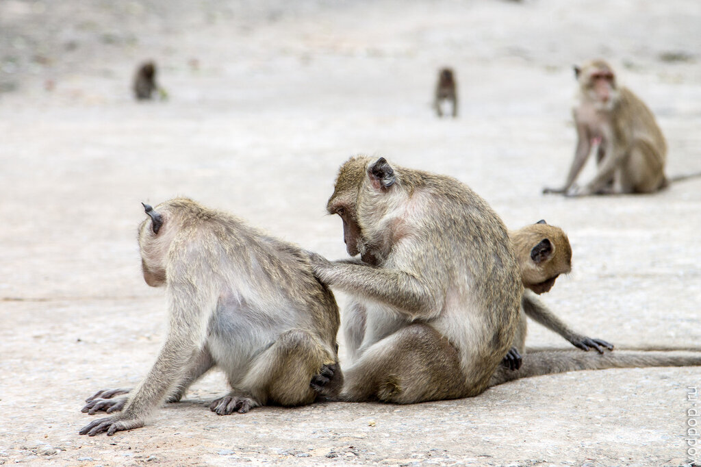
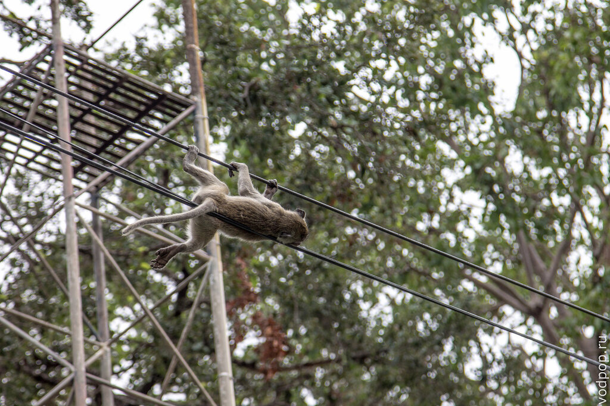
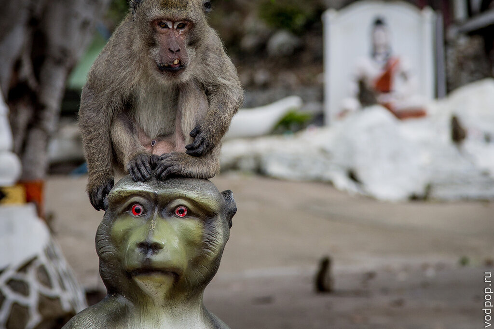

После того, как мы осмотрели все [достопримечательности Чумпхона](https://vodpop.ru/dostoprimechatelnosti-chumphona/ "Достопримечательности Чумпхона"), мы продолжили свой путь на север, до популярного среди европейских туристов города Хуа Хин. К сожалению, наше знакомство было несколько омрачено попаданием Климентия в больницу, но кое-что мы все-таки успели посмотреть.

<!--more-->

 

Пожалуй, Хуа Хин - один из немногих курортных городов Таиланда, где действительно очень мало русских туристов. Зато есть хороший русский ресторан Dacha, который правда интерьером напоминает любой другой европейский. Однако, именно тут мы попробовали первый русский борщ после 5 месяцев путешествия по Азии: восторгу не было предела! Хотя речь вовсе не о еде (а ее было много и разной, но мы отдавали предпочтение пад-таю или гречке с курицей), было приятно почувствовать знакомый вкус.

Мы традиционно воспользовались http://agoda.com/ для поиска жилья. Правда, не зная, понравится город или нет, мы забукали номер всего на 2 ночи. И зря, т.к. гостиница G House Hotel располагалась в довольно удобном месте и радовала приятным ремонтом. Но пытаясь продлить еще на 2 дня жилье за ту же сумму, были весьма не мило спущены на землю администратором, которая заявила цену за ночь около 2000 бат.

Нам пришлось немного переместиться и заселиться в Cheya Resort Hua Hin - по сути, в общагу. Одно из самых главных преимуществ гостиницы - она рядом с аэропортом, а также от нее можно дойти пешком до студенческого городка (через шлагбаум), где любой желающий может присоединиться к вечерним играм в баскетбол, футбол, бадминтон, а также заказать себе ужин (аж до 22.00) за 30-40 бат в местной студенческой столовой.

А теперь вернемся к достопримечательностям и особенностям Хуа Хина. Во-первых, влияние Европы здесь чувствуется как нигде: очень много заведений открыто европейцами для самих же европейцев. Курорт приобрел популярность после 20-х годов 19 века, когда здесь была построена королевская резиденция, куда и по сей день приезжают члены королевской семьи.

Теперь здесь постоянно проживает довольно большое количество пенсионеров из Швеции, Германии, Франции, Норвегии и других развитых стран. Не удивительно, что и цены здесь в среднем выше, чем в других городах. Хотя, если знать, где искать, то суп с лапшой за 35 бат всегда найдется. Но если нет, то скорее всего обед обойдется не менее, чем в 70 бат с человека.

В силу того, что многие туристы пред- или послепенсионного возраста, в Хуа Хине отлично развита система платного здравоохранения. Увы, нам пришлось довольно плотно познакомиться к этой стороной, т.к. Климентий внезапно себя очень плохо почувствовал, и мы начали бегать от врача к врачу, чтобы понять, что же все-таки происходит.

К сожалению, от плохого самочувствия в поездке никто не застрахован, и мы не раз посещали госпитали Таиланда. В большинстве случаев нас выручала страховка Либерти, стоимость которой (2850 с человека за 3 месяца) отбилась одним Климом в многократном размере.

Нравится статья? Узнавайте первым о выходе новых интересных историй! Подпишитесь на нас по [эл. почте](http://feedburner.google.com/fb/a/mailverify?uri=vodpop&loc=ru_RU) или в [группе ВКонтакте](http://vk.com/vodpop)

Кстати, туристы в основном обращаются в клиники, с которыми сотрудничает ассистенс данной страховой компании: если простыми словами, то каждая страховая компания, будь то Альфа, Ресо, Либерти или еще какая, не имеют собственных клиник по всему земному шару. Для этого существуют компании-ассистенсы, которые заключают договоры с клиниками в каждом городе. Их несколько десятков по всему миру, и когда вы собираетесь в дальнюю поездку на долгий срок, лучше подробно ознакомиться со всеми тонкостями и отзывами других туристов о той компании, которой вы хотите доверить свое здоровье.

Однако, в Таиланде кроме коммерческих клиник (куда обращается большинство иностранцев), существуют также и государственные: весьма похожие на российские поликлиники, с большими очередями, непониманием английского языка, невнятным расписанием и отсутствием стойки информации.

Т.к. резкие боли в животе были достаточным поводом для паники и недостаточной мотивацией для вызова скорой помощи, мы сначала позвонили в страховую и выяснили, в какие госпитали Хуа Хина мы можем обратиться.

Нам назвали [Bangkok Hospital](https://www.bangkokhospital.com/huahin/ru/) \- на моей памяти это одна из самых шикарных больниц, больше похожая на гостиницу 5\*. Вежливые и хорошо говорящие по-английски сотрудники, все в красивой форме с иголочки, стойки регистрации и информации, плазменные тв и кожаные диваны для ожидающих, бесплатный кофе и чай, ресторанчик на территории, компьютеры с доступом в интернет и бесплатный вай-фай. Лечение изначально оплачивалось нами самостоятельно, а после подписания счета внутри больницы компенсировалось страховой на наш счет в течение суток. Благо, лечение стоило адекватную сумму, которую можно снять в банкомате. А вот что делают в случае, если лечение превышает 100, 200 тысяч?.. Хорошо, что у нас не было шанса это проверить, и мы обошлись лишь легким испугом. Климентию написали мероприятий на 21 тысячу бат, однако страховая не подтвердила CT-test (аналог нашей томографии) всего организма, и гастроскопию. В результате, мы решили сделать гастроскопию за свои собственные деньги. Правда, уже не в этом госпитале, т.к. если все делать за свой счет, то цены просто убийственные. Следующий день мы потратили на поиск клиники, в которой можно сделать эту не самую приятную процедуру.

В Hua Hin Hospital нам все напомнило суровые российские бесплатные больницы, да и врач работал там неизвестно по какому расписанию, поэтому мы обратились в [San Paolo Hospital](http://www.sanpaulo.co.th/en/index.html), где за 7 тысяч бат пообещали все сделать, и больница хоть и не напоминала отель, предлагала довольно приличный сервис за такие деньги.

Надо сказать, что до самой гастроскопии мы не подозревали, почему у нее такая высокая стоимость. И все встало на свои места, когда Клима положили на каталку и завезли в операционную, где провели анестезию, которая буквально вырубила его на час. А через 60 минут врач пригласил к себе в кабинет, чтобы показать фотографии и объяснить результаты процедуры. В результате все закончилось хорошо: ничего критичного не нашли.

Так что обычная гастроскопия, которая в России вызывает много неприятных эмоций благодаря не самому эстетичному процессу, в Таиланде проходила весьма безболезненно и без потери самооценки. Кстати, стоимость по возвращению в Россию можно было компенсировать, но Климентий решил забить на это и быстрее развивать [офис своей компании](http://uxman.ru) в Москве.

Между всеми этими поездками по больницам, было довольно сложно выкроить время и посмотреть город. То же самое у нас случилось и на Краби, когда Климентий слег с отравлением, и мы быстренько оттуда [уехали на Пхукет.](https://vodpop.ru/kondominium-na-phukete/ "Лучший кондоминиум на Пхукете или как увенчались успехом наши поиски жилья")

Но кое-что мы успели: железнодорожный вокзал Хуа Хина не только поразил нас своей красотой, но и несколько разочаровал отсутствием билетов на поезда до Бангкока: все раскупается заранее.

Очень симпатичная архитектура. Кажется, что все немного кукольное.

Стильный почтовый ящик

Также мы посетили Wat Khao Takiap, где повстречали самое большое количество обезьян в своей жизни. Предостреженные другими путешественниками, мы сняли с себя все лишние предметы, включая часы и очки, убрали все в рюкзак и потуже пристегнули ремни.

Мы были чуть ли не единственными представителями человеческой расы на этой импровизированной "планете обезьян". Даже немного жутко. Особенно их поведение

Многие обезьяны дрались между собой, дергали друг друга за хвосты, издавали страшные звуки, забирались на металлические решетки и раскачивали их из стороны в сторону, громко повизгивая.

Вероятно, у смотрительницы храма, которая сидит там весь день, стальные нервы. Мне стало не по себе сразу, а через 20 минут прогулки разве что голова не разболелась от этой какофонии. Учитывая обстоятельства, мы не очень-то сильно обращали внимания на достопримечательности. Но что-то случайно попадало в кадр.

Еще несколько раз мы выбирались на пляжи, но после южной части Таиланда море Хуа Хина уже не так радует - дно здесь с камушками и ракушками, и во время отливов очень больно идти до глубины. Зато удобно собирать ракушки и прочие дары моря.

Еще мы посмотрели Wat Huay Mongkol - Храм Хуай Монгкол. Честно говоря, после всех Больших Будд - в [Гонконге](https://vodpop.ru/bolshoy-budda-v-gonkonge/ "Большой Будда в Гонконге и рыбацкая деревня Тай О"), на [Пхукете](https://vodpop.ru/bolshoy-budda-na-phukete/ "Большой Будда на Пхукете. Покатушки на слонах и прекрасный вид на город"), в [Мьянме](https://vodpop.ru/nashe-pervoe-znakomstvo-s-myanmoy-pochemu-oni-raskrashivayut-litsa/ "Наше первое знакомство с Мьянмой. Почему они раскрашивают лица?") - мы уже порядком устали от больших статуй, и хотелось разнообразия.

В отличие от вышеперечисленных статуй Больших Будд, в храме Монгкол сидит 11-метровый монах. Вокруг разбит красивый парк, где можно погулять часок-другой.

Наше резюме на Хуа Хин - это хороший город, с развитой инфраструктурой и высокими ценами. Достопримечательностей здесь немного, и те, что есть, вполне можно посмотреть за 3 дня. Остальное же время - снимать кондо, смотреть на море, гулять вдоль пляжа и собирать ракушки. Отличное место, чтобы провести старость.
