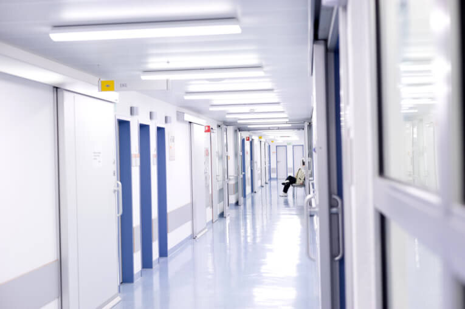

Оформить туристическую страховку в США довольно просто, однако, существуют некоторые нюансы. Поделюсь личным опытом, где лучше всего оформить страховку в США, как сэкономить и что делать при наступлении страхового случая.

## <!--more-->

## Чтобы оформить туристическую страховку в США, необходимо:

1. Выбрать страховую компанию
2. Купить страховой полис в США онлайн (вы можете сделать это и в офисе страховой компании, но онлайн-покупка намного удобнее и никак не влияет качество оказываемых услуг)
3. Распечатать полис или сохранить на телефон, чтобы при наступлении страхового случая можно было оперативно дозвониться до страховой

## Как выбрать страховую компанию для поездки в США:

1. Узнать, с каким ассистансом работает страховая компания. **Ассистанс** (assistance) – _это сервисная компания_, которая будет взаимодействовать с вами в случае наступления страхового случая. Именно с представителем компании-асситанса вы будете взаимодействовать, если что-то случится. К выбору компании-ассистанса при покупке страхового полиса в США нужно относиться особенно внимательно, так как именно от ее представителей зависит ваше здоровье и сохранение нервной системы. По этой причине Global Voyager Assistance (GVA) _не покупать ни в коем случае_, так как масса негативных отзывов. А вот и **лучшие компании-ассистансы** согласно отзывам:
    - Mondial Assistance Group, она же Allianz Global Assistance
    - КЛАСС-Ассист
    - Europ Assistance
    - Axa assistance
    - Euro-Center Prague
2. Уточнить, есть ли у них франшиза (в идеале - нет). Франшиза (от фр. franchise - льгота) означает, что определенную часть расходов при возникновения страхового случая вы оплачиваете самостоятельно. Существует 2 типа франшизы:
    - Условная. К примеру, в договоре указана условная франшиза 100$. Если вам оказали помощь на 90$, то страховая компания ничего не выплачивает (т.к. сумма меньше условной франшизы), а если вам потребовалось лечение на 110$, то компания полностью оплачивает 110$ (т.к. больше франшизы)
    - Безусловная, ее еще называют вычитаемой франшизой. Если размер безусловной франшизы 100$, то при лечении на 90$ вам ничего не выплачивают (меньше суммы франшизы), а если ущерб составил 110$, то вам выплачивают разницу между стоимостью ущерба и франшизой: 110 - 100 = 10$. Это наименее предпочтительный вариант страхования
3.  Прочитать правила страхования. Не торопитесь нажать кнопку "Оплатить", сначала внимательно изучите, какие условия предлагает страховая компания. Особенно, если вы планируете заниматься активными видами спорта: кататься на горных лыжах или нырять с аквалангом. Убедитесь, что все эти активности покрываются страховым полисом.

## В каких случаях страховая компания может не выплатить компенсацию

Обратите внимание, что большинство страховок не компенсирует ущерб в случае, если вы находитесь в состояние алкогольного или наркотического опьянения. В список "отказников" также войдут те, кто сел за руль без прав нужной категории, или же те, кто сознательно пренебрег предупреждающими знаками. В США могут висеть знаки "Купание запрещено", и если с вами что-то случится в зоне действия знака, то страховая компания имеет полное право вам отказать в компенсации ущерба.

## Минимальная сумма страхового покрытия при поездке в США составляет 50 000$.

Это связано с тем, что медицина в США - одна из самых дорогих в мире. К примеру, вызов скорой обойдется в 1000$, а госпитализация в сутки обходится от сотни до нескольких тысяч долларов. Если вы хотите "перестраховаться", то можете выбрать даже большую сумму покрытия - 100 000$, однако стоимость страховки станет существенно дороже.

## А надо ли вообще покупать страховку в США?

Мы самостоятельно путешествуем более 6 лет, и ни разу не выезжали за пределы России без страховки. В отличии от Шенгена, где страховку требуют при подаче на визу, в посольстве США никто не интересуется, есть ли у вас эта бумажка или нет. Однако, с нами, с семьей и друзьями случались страховые случаи: переломы рук, отравления, ожоги, укусы, которые без наличия страховки пришлось бы оплачивать самостоятельно. Порой счет достигал нескольких тысяч долларов. Если сравнивать со стоимостью страховки (около 3 тысяч рублей в месяц), то выгода на лицо.

## Как купить страховку в США

Сначала вы должны убедиться, что у вас нет страховки. Нет-нет, я серьезно! Очень многие банки предлагают "встроенную страховку" в свои пластиковые карты. Для того, чтобы узнать, есть ли у вас страховка в США, можно позвонить в банк или открыть договор. Чаще всего страховка предлагается владельцам премиальных пакетов Gold, Silver и Platinum.  Хотя среди обычных пластиковых карт тоже попадаются встроенные страховки. Многие друзья пользуются Тинькофф All Airline - страховая сумма 50000$, срок действия - 1 год с возможностью продления, по 45 дней в каждой поездке.

Если ваш банк не предлагает страховку, то придется оформить **страховой полис в США** **самостоятельно**. Для этого очень удобно использовать агрегатор страховых компаний [Cherehapa.ru](https://cherehapa.ru/?country=%D0%A1%D0%A8%D0%90&partnerId=25257&marker=z8rbz8s4i)

Большим плюсом через покупке через агрегатор является гарантия качества: если на страховую компанию много жалоб, то Черехапа прекращает сотрудничество. Зачастую на Черехапе цены на страховку ниже, чем на официальном сайте компании, а также возможность сравнить цены на одном сайте значительно экономит время.

## Популярные вопросы при покупке страховки в США

**1\. Я часто летаю в США, как мне сэкономить на страховке?**

При покупке страховки нажмите галочку "годовой полис". Такая страховка стоит чуть дороже, чем под точные даты поездки, но при нескольких въездах в Соединенные Штаты полностью окупает себя. Страховка будет действовать указанное вами количество дней в каждую поездку на протяжении года. К примеру, вы купили полис на 1 год с покрытием 14 дней. Тогда все ваши поездки в США будут покрыты в течение года, первые две недели каждой поездки. Если вдруг вы решите остаться на 15ый день, то него надо будет докупать страховку отдельно.

**2\. Как купить страховку в США, если я уже в поездке?**

При выборе опций на Черехапе поставить галочку "я уже путешествую". И полезный лайф-хак из личного опыта с компанией Либерти. Согласно их страховым условиям, вы можете купить страховку за 5 дней до начала страхования, даже находясь уже за границей. Увы, Черехапа не предлагает этот вариант при фильтрации "я уже путешествую", так как страховка начинает действовать только на 6ой день. Так как мы все время путешествуем (оперативные новости в [нашей группе в ВК](https://vk.com/vodpop)), то постоянно сталкиваемся с необходимостью обновлять страховку.

**3\. Что делать, если мне нужна медицинская помощь?**

Для начала - держать телефон страховой компании под рукой (записать в мобильник, носить с собой распечатку). Первое, что вы должны сделать по правилам, это позвонить в страховую компанию и объяснить, что с вами случилось, назвав свое ФИО или номер договора. Исключением являются ситуации, когда вы этого сделать не в состоянии и для вас кто-то вызывает скорую.

Если вам требуется госпитализация, будьте готовы назвать ваш адрес гостиницы, где вы остановились. Всегда берите с собой паспорт и деньги, так как в некоторых случаях госпитали просят оставить денежный залог до получения гарантийного письма от страховой компании.

В случае, если страховая обещает пост-оплату по возвращении в Россию, соберите все необходимые документы: справки, выписки, рецепты от врача, чеки на покупку медикаментов, а также выписку за телефон - по правилам страховые компании должны компенсировать вам стоимость звонков в страховую. Некоторые страховые принимают сканы документов по электронной почте.

**4\. Что оплачивает страховая компания в США?**

Если вы внимательно прочитаете условия договора, то там будет полный перечень услуг, которые оплачиваются страховой. Как правило, это транспортировка пострадавшего в госпиталь, оказание ему мед.помощи, оплата медикаментов и затраты на телефонные переговоры. Есть множество исключений. Например, из-за очень высокой стоимость стоматологических услуг, почти ни одна страховка их не покрывает. Но большинство страховых компаний оплачивает "экстренную стоматологию". Например, срочное удаление зуба.

Чаще всего страховая компания посылает гарантийное письмо в госпиталь о том, что они готовы компенсировать лечение. Но стоматология и кожные заболевания, к примеру, ожоги, в большинстве случаях проходят по пост-оплате. Т.е. вы сами оплачиваете свое лечение, собираете документы и по возвращению в Россию отправляете в страховую для компенсации. Увы, гарантий здесь нет, и вы должны быть готовы к тому, что страховая может и не компенсировать.

Путешествуйте и берегите себя!
