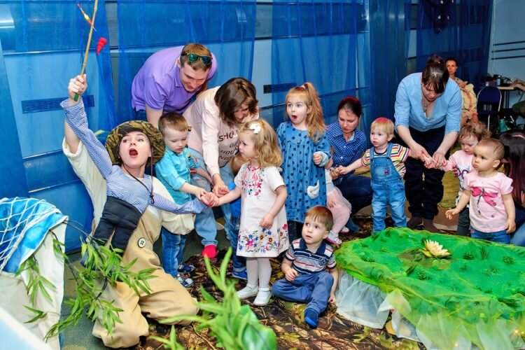
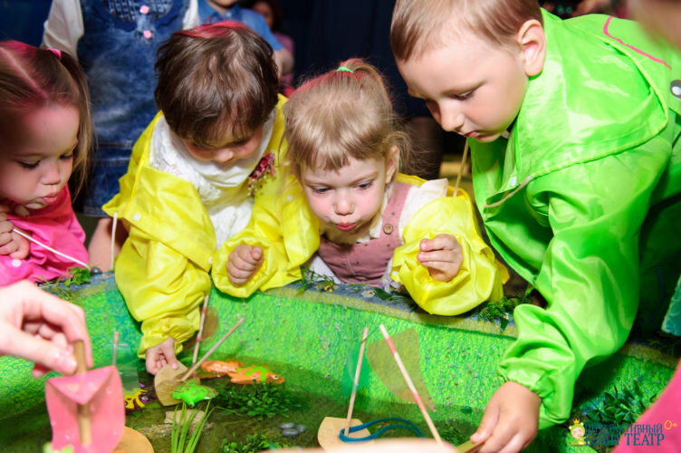

Интерактивный Бэби Театр - это не просто детский театр. Это новый самостоятельный театральный жанр: он создан для самых маленьких зрителей, и имеет несколько принципиальных отличий от традиционного театра.<!--more-->

Спектакль в жанре «бэби театр» проходит в камерной обстановке с периодическими интерактивными включениями. Эти включения вплетены в сюжет.

Зрителям предлагается поучаствовать в событиях, и даже повлиять на них, помочь героям, выполнить увлекательные и развивающие задания или просто от души повеселиться, попеть, потанцевать. Во время спектакля раздается индивидуальный реквизит, все можно трогать – и ребенку обязательно понравится возможность поизучать пьесу «на ощупь».

\[youtube url="https://www.youtube.com/watch?v=zan3Ux7qG8c&feature=youtu.be"\]

Юные зрители легко вовлекутся в действие, ведь оно разворачивается в паре метров от зрительного зала. Профессиональные актеры постоянно взаимодействуют с публикой, границы между ней и сценой размываются.

Интерактивы разработаны по возрастным особенностям. В театре проходят спектакли для разных групп от 8 месяцев и до 5 лет.

Дополнительный приятный бонус – пока идет представление, в зале будет работать фотограф. Каждый зритель получит профессиональные качественные фото бесплатно.

**Цена:** от 850 до 950 рублей с человека, билеты необходимо приобретать как на ребенка, так и на взрослого.

**Контакты театра:**

Сайта - [https://u-skazki.com/performances/](https://u-skazki.com/performances/)

Телефон: [+7 (499) 350-17-00](tel:+74993501700),

E-mail по всем вопросам: [info@u-skazki.com](mailto:info@u-skazki.com)

**Театр в соцсетях:**

[https://www.instagram.com/bebiteatr/](https://www.instagram.com/bebiteatr/)

[https://www.facebook.com/bebiteatr/](https://www.facebook.com/bebiteatr/)

[https://vk.com/bebiteatr](https://vk.com/bebiteatr)
