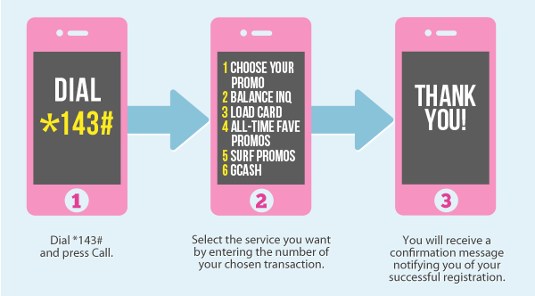
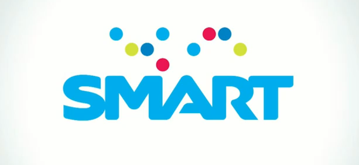
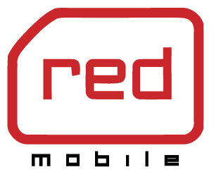

Уже не первый человек нас спрашивает, как обстоят дела со связью на Филиппинах, какого оператора стоит выбрать, что со скоростью интернета и многое другое.  В этой статье мы ответим на все вопросы по порядку.

<!--more-->

На Филиппинах мобильная связь очень активно развивается, так как большая часть населения не может позволить себе компьютер и пользуется мобильным телефоном как основным средством связи. Филиппинцы очень любят слать смс-ки друг другу, что можно заметить, если приглядеться к подавляющему большинству тарифов у местных операторов, а также сидеть на Facebook - это самая популярная социальная сеть в этом стране, в которую каждый день заходит не менее трети населения.

Перечень филиппинских операторов сотовой связи (по клику на оператора можно перейти на его офиц.сайт):  [Smart](http://go.smart.com.ph/), [Talk ‘N Text](http://www1.smart.com.ph/talkntext), [Red Mobile](http://www.redmobile.com/), [Sun Cellular](http://www.suncellular.com.ph/), [Globe](http://www.globe.com.ph/), Touch Mobile. Все операторы работают в стандарте GSM. Как минимум, Smart и Globe поддерживают 4G, но в основном в крупных городах. Насчет дочерних компаний (Smart принадлежат Red Mobile,  Talk N' Text и у них один владелец с Sun Cellular; Globe принадлежит Touch Mobile, также известная как TM) необходимо уточнять. Мы пользовались Smart и Globe на о.Палаван, оба оператора почти везде поддерживают 3G.

Так как нам интернет нужен [для работы](http://uxman.ru/), то по [прилету в Манилу](https://vodpop.ru/kak-dobratsa-palavan/ "Как добраться на Палаван, Филиппины") мы сразу озаботились покупкой сим-карт. Сим-карта Smart стоит порядка 40 песо, а вот за Globe придется выложить больше 100 песо. Сим-карты остальных филиппинских операторов стоят 35-50 песо. У владельцев Apple-устройств не будет проблем - micro-sim продают в крупных городах.

Мы пользовались  исключительно мобильным интернетом, но на Филиппинах выгоднее всего слать смс-ки - во-первых, почти все операторы начисляют бесплатные (бонусные) смс-ки, а во-вторых, их цена составляет всего лишь 1 песо внутри оператора, 2 песо на остальные. Т.е. сущие копейки. Если вы едете компанией друзей и планируете время от времени расходиться в разные стороны, то этот вариант самый экономичный.

Понимая, что скорее всего ваш выбор падет либо на Smart, либо на Globe, распишем поподробнее именно про эти два оператора.

Нравится статья? Узнавайте первым о выходе новых интересных историй! Подпишитесь на нас по [эл. почте](http://feedburner.google.com/fb/a/mailverify?uri=vodpop&loc=ru_RU) или в [группе ВКонтакте](http://vk.com/vodpop)

## GLOBE

Именно у Globe мы решили подключить безлимитный интернет на месяц, так как он чуть дешевле Smart, а зона покрытия на Палаване вполне достойная.

###### Тарифы на мобильный интернет (по системе предоплаты)

Пост-оплата для путешественников вряд ли будет удобной

\[table\]

<table><tbody><tr><td>Срок действия</td><td>Стоимость</td><td>Как подключить</td></tr><tr><td>1 день</td><td>50 песо</td><td>Отправить текст SUPERSURF50 to 8888</td></tr><tr><td>5 дней</td><td>200 песо</td><td>Отправить текст SUPERSURF200 to 8888</td></tr><tr><td>30 дней</td><td>999 песо</td><td>Отправить текст&nbsp;SUPERSURF999 to 8888</td></tr></tbody></table>

\[/table\]

<table><tbody><tr><td>Стоимость</td><td>Лимит</td><td>&nbsp;Срок действия</td><td>Как подключитьь</td></tr><tr><td>15 песо</td><td>20MB</td><td>1 день</td><td>Отправить текст&nbsp;POWERSURF15 to 8888</td></tr><tr><td>30 песо</td><td>50MB</td><td>1&nbsp;день</td><td>Отправить текст&nbsp;POWERSURF30 to 8888</td></tr><tr><td>50 песо</td><td>100MB</td><td>3 дня</td><td>Отправить текст&nbsp;POWERSURF50 to 8888</td></tr><tr><td>99 песо</td><td>50MB</td><td>30 дней</td><td>Отправить текст&nbsp;POWERSURF99 to 8888</td></tr><tr><td>299 песо</td><td>300MB</td><td>30&nbsp;дней</td><td>Отправить текст&nbsp;&nbsp;POWERSURF299 to 8888</td></tr><tr><td>499 песо</td><td>1GB</td><td>30&nbsp;дней</td><td>Отправить текст&nbsp;POWERSURF499 to 8888</td></tr></tbody></table>

Обратите внимание, что хоть нигде об этом не сказано, у Globe действует ограничение на скорость - например, если вы решите послушать музыку онлайн или скачать торренты, то велик шанс, что вас заблокируют (якобы для того, чтобы другие пользователи не страдали).

Эту ссылку они присылают в смске, когда ограничивают трафик

[http://surf.globe.com.ph/fup](http://surf.globe.com.ph/fup) В той же смске они предлагают отключить промо, чтобы восстановить скорость. Этого делать не нужно, нужно просто подождать денек.

Раньше было лучше - действовал лимит на 800 мб в день, без ограничений скорости.

Не хотите разбираться во всех тонкостях - пожалуйста. Без всяких спец.тарифов на телефоне будет доступен интернет по цене 5 песо/15 минут. Это довольно дорогой вариант, но для тех, кто пользуется интернетом редко, вполне сойдет.

Кстати, пока не подключите какой-нибудь тариф на интернет, переведите свой телефон в авиарежим или отключите сотовые данные, т.к. на смарфтонах с вас уже начнут списывать деньги за push-up сообщения и проверку почты.

Звонок внутри сети стоит 6.50 песо, на другие сотовые операторы 7.50 песо. Смс на все операторы 1 песо.

###### Как проверить свой баланс на Globe

- Отправить текстовое сообщение BAL на номер 222
- Позвонить на номер 222

В ответ придет сообщение, в котором будет указан остаток песо на счету и срок их истечения. На Филиппинах еще остался пережиток прошлого в виде сгорания денег на счету через определенный срок.

###### Как настроить интернет на Globe

В идеале все должно настраиваться автоматически, но не тут-то было! В APN по умолчанию указан неверный адрес. Правильные настройки APN: http.globe.com.ph . Все остальное можно не трогать

Вызов справочного меню по команде \*143#

И еще одно замечание про Globe - если вы планируете раздавать интернет, то учтите, что эта функция недоступна с Ipad: выдается некая ошибка и просят обратиться к оператору. Если кто-то знает, в чем тут дело - отпишитесь в комментариях, пожалуйста.

## SMART

[http://www1.smart.com.ph/corporate](http://www1.smart.com.ph/corporate)

Smart мы выбрали в качестве запасного оператора, если интернет от Globe во время [путешествий по Палавану](https://vodpop.ru/palavan-foto/ "Неизведанный Палаван: Сан Висенте") где-нибудь отвалится. Но такого не случилось - оба оператора работали примерно одинаково.

###### Тарифы на мобильный интернет (по системе предоплаты)

Информацию и доступных интернет-пакетах Smart можно посмотреть [тут](http://go.smart.com.ph/internet/). Без подключений доп.опций можно пользоваться стандартным интернетом по цене 5 песо/15 минут.

Безлимитные пакеты

<table><tbody><tr><td>Пакет</td><td>Стоимость</td><td>Срок действия</td><td>Как подключить</td></tr><tr><td>Unli Surf Daily</td><td>50 песо</td><td>Сутки</td><td>Текст "UNLI 50" на номер 211</td></tr><tr><td>Unli Surf Weekly</td><td>300 песо</td><td>Неделя</td><td>Текст "UNLI 300" на номер 211</td></tr><tr><td>Unli Surf Monthly</td><td>1200 песо</td><td>Месяц</td><td>Текст "UNLI 1200" на номер 211</td></tr></tbody></table>

Лимитные пакеты

<table><tbody><tr><td>Пакет</td><td>Стоимость</td><td>Лимит</td><td>Срок действия</td><td>Как подключить</td></tr><tr><td>ON 20</td><td>Php 20</td><td>45 MB</td><td>1 day</td><td>Отправить текст ON 20 на номер 2200</td></tr><tr><td>ON 30</td><td>Php 30</td><td>70&nbsp;MB</td><td>1 day</td><td>Отправить текст ON 30 на номер 2200</td></tr><tr><td>ON 99</td><td>Php 99</td><td>50&nbsp;MB</td><td>30&nbsp;days</td><td>Отправить текст ON 99 на номер 2200</td></tr><tr><td>ON 199</td><td>Php 199</td><td>180&nbsp;MB</td><td>15&nbsp;days</td><td>Отправить текст ON 199 на номер 2200</td></tr><tr><td>ON 299</td><td>Php 299</td><td>300 MB</td><td>30 days</td><td>Отправить текст ON 299 на номер 2200</td></tr><tr><td>ON 499</td><td>Php 499</td><td>1000&nbsp;MB</td><td>30 days</td><td>Отправить текст ON 499 на номер 2200</td></tr><tr><td>ON 995</td><td>Php 995</td><td>2000 MB</td><td>30 days</td><td>Отправить текст ON 995 на номер 2200</td></tr></tbody></table>

######  Как проверить свой баланс на Smart

- Отправить текст "?1515″ на короткий номер 214. В ответ придет смс-сообщение
- Зайти в телефоне в  SMART MENU>Buddy Balance

###### Как настроить интернет на Smart

Все работает по умолчанию. Чтобы получить  настройки для телефона, отправьте текстовое сообщение SET на номер 211.

Кстати, для любителей сверхбыстрого интернета, есть LTE-симки. Подробности можно смотреть тут: [http://www1.smart.com.ph/prepaid/lte](http://www1.smart.com.ph/prepaid/lte)

Если вы решите воспользоваться обычными функциями телефона, то звонок внутри сети обойдется в 6.50 песо, на другие сети 7.50 песо. Смс на все операторы 1 песо.

Чтобы узнать свой номер, самый простой способ - послать кому-нибудь смс-сообщение. Или отправить  ASK SMART на номер 143. В ответ придет сообщение с вашим филиппинским номером.

## SUN CELLULAR

[http://www.suncellular.com.ph/](http://www.suncellular.com.ph/)

Сами не пользовались, но говорят, что Sun сильно проигрывает тому же Smart. Симки этого оператора в основном используют для смс-общения. В продаже за всю поездку я их не видела (но и не искала). Когда писала статью, сайт их лежал, поэтому более точной информации нет.

###### Как проверить свой баланс на Sun Cellular

- Выполнить команду \*221#
- Позвонить по номеру 221

## RED MOBILE

[http://www.redmobile.com/](http://www.redmobile.com/)

Судя по сайту, этот оператор предлагает пакеты дешевых звонков и смс. Кстати, в 2012 году ходили слухи о закрытии компании. Но пока работает.

###### Как проверить свой баланс на Red Mobile

- Отправить текст 999 на номер 9939

## TALK'N' TEXT

[http://www1.smart.com.ph/talkntext](http://www1.smart.com.ph/talkntext)

Как следует из "говорящего" названия, оператор предоставляет дешевые звонки и смс-сообщения.

###### Как проверить свой баланс на Talk'N'Text

- Зайти в телефоне TALK N TEXT MENU>Balance Inquiry
- Отправить текст " ?15001" на номер 214.

## TOUCH MOBILE

[http://republikatm.ph/](http://republikatm.ph/)

Этот оператор позиционирует себя как молодежный, поэтому сайт выглядит скорее прикольно, чем полезно. А еще он на местном тагальском языке. Хотя все довольно понятно.

###### Тарифы на мобильный интернет (по системе предоплаты)

Безлимитные пакеты

<table><tbody><tr><td>Пакет</td><td>Срок действия</td><td>Стоимость</td><td>Как подключить</td></tr><tr><td>SUPERSURF50</td><td>1 день</td><td>50 песо</td><td>Отправить SUPERSURF50 на номер 8888</td></tr><tr><td>SUPERSURF200</td><td>5 дней</td><td>200 песо</td><td>Отправить SUPERSURF200 на номер 8888</td></tr></tbody></table>

###### Как проверить свой баланс на TM (Touch Mobile)

- Выполнить команду \*102#
- Позвонить по номеру 802

## Беспроводной интернет Wi-fi и WiMax на Филиппинах

Встречался нам сей зверь довольно часто, но в крупных городах работал слабенько. Самый лучший wi-fi на Палаване был в [Сан Висенте](https://vodpop.ru/gde-ostanovitsa-v-san-vincente/ "Где остановиться в Сан Винсенте на Палаване: 10 лучших мест"), а также в городе Тай-Тай, бывшей столица Палавана.

В [Пуэрто-Принцессе](https://vodpop.ru/chem-zanatsa-v-puerto-princesse/ "Чем заняться в Пуэрто-Принцессе: Хонда Бэй, гостиницы и рестораны") был во многих гостиницах и кафешках, но хорошо работал только в отеле Deep Forest. В Эль-Нидо интернет был в нашем гестхаусе и в самом популярном месте - Арт-кафе. Однако в работающем состоянии мы его там не застали ни разу.

А в гостинице Casa-Rosa в городе [Тай-Тай](https://vodpop.ru/taj-taj-palavan/ "Неизведанный Палаван. Тай Тай") мы первый раз увидели WiMax - отличный вариант для тех, кто решил пожить на Филиппинах. Основное отличие WiMax от Wi-fi состоит в том, что первая позволяет передавать данные по радиоканалу (подобно мобильной связи) в городских условиях, не смотря на застройки, деревья или погодные условия. Зона действия Wi-fi ограничена парой десятков метров, а WiMax - до 50 км. Если вы решите подключить себе такой на Филиппинах, информацию о тарифах можно узнать тут: [http://tattoo.globe.com.ph/wimax.html](http://tattoo.globe.com.ph/wimax.html) Скорость интернета чуть выше, чем через 3G, но интернет работает стабильнее.

## Проводной интернет на Филиппинах

Проводной доступ к интернету на Филиппинах представлен двумя компаниями - Globe ([http://tattoo.globe.com.ph/products](http://tattoo.globe.com.ph/products) ) и PLDT([http://pldthome.com/shop](http://pldthome.com/shop)). По ссылкам можно ознакомиться с тарифами и предложениями. Стандартная цена - 999 песо. За эти деньги в зависимости от региона вы получите от 512 Кбит до 3  Мбит. Для подключения необходимо обратиться в офис компании.

Если у вас остались какие-либо вопросы, предложения - ждем комменатарии!
